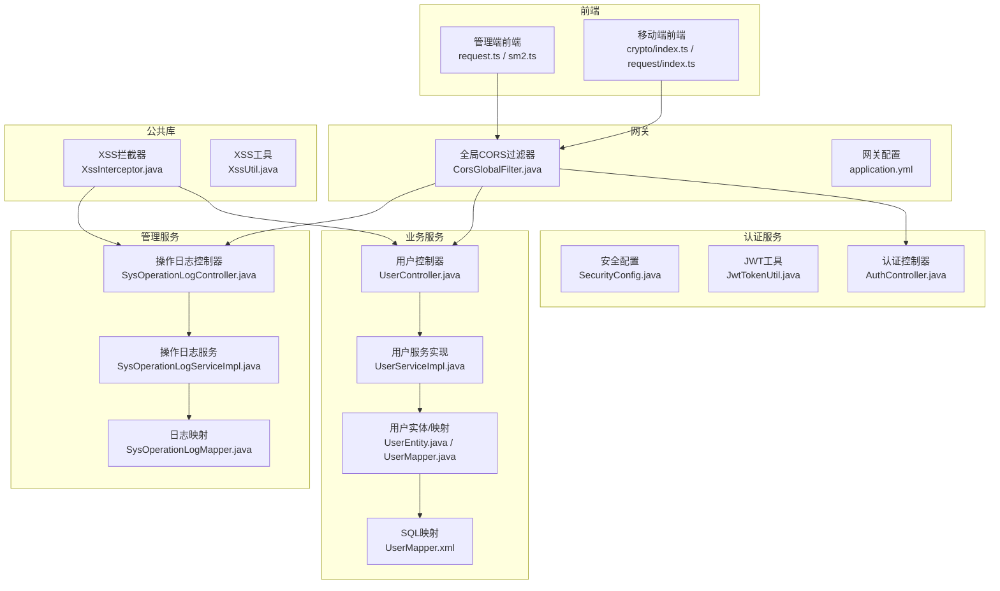
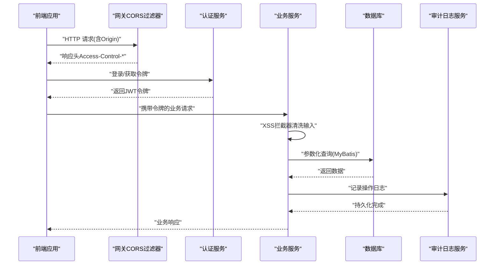
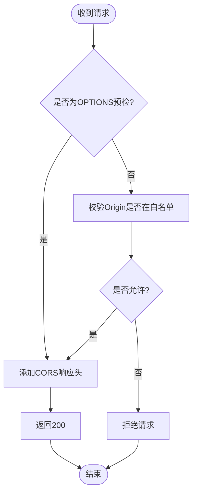
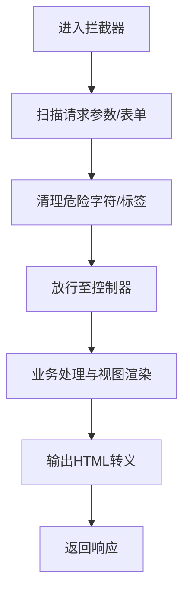
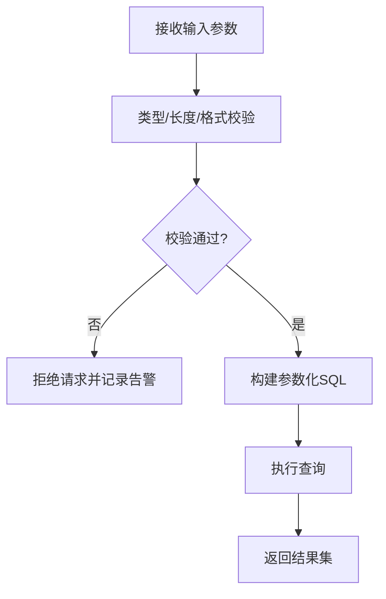
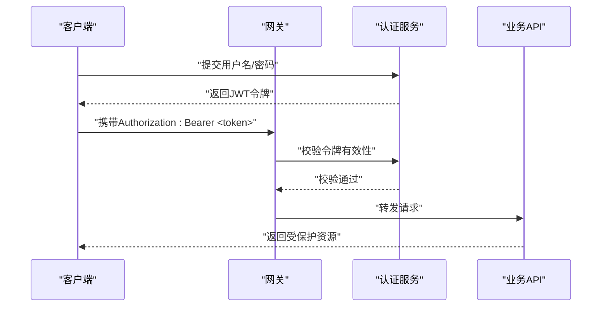
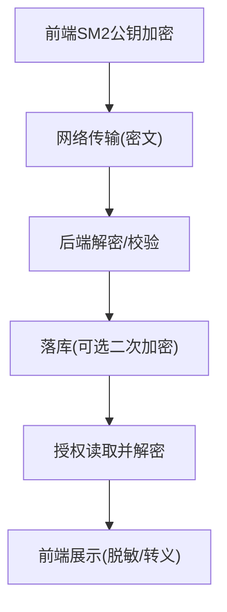
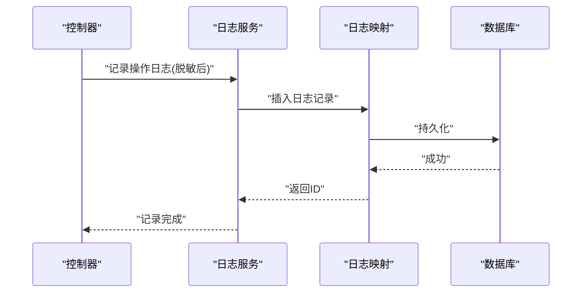
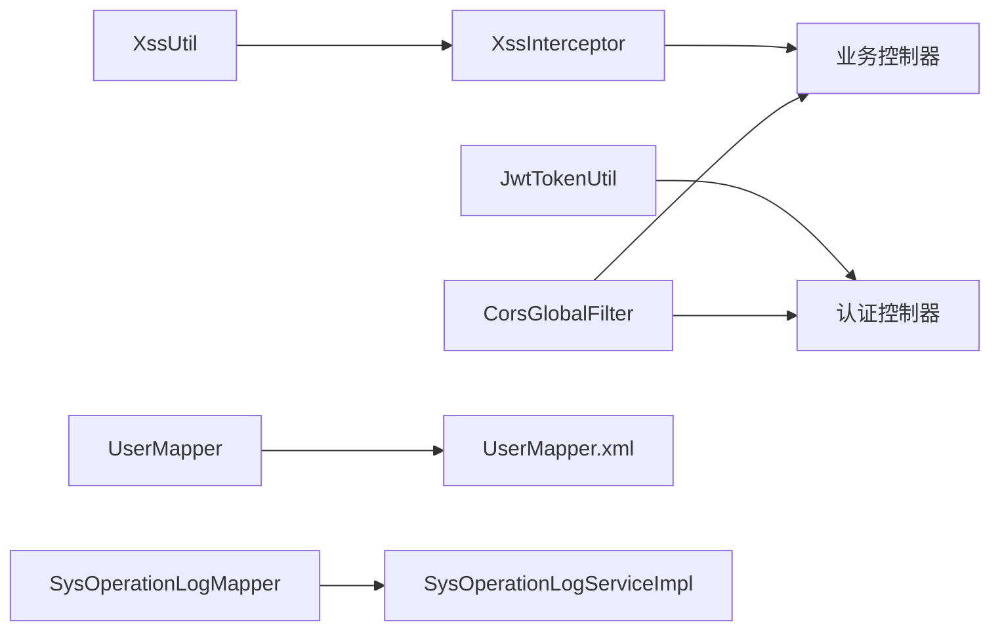

# 数据安全保护

<cite>
**本文引用的文件**   
- [class_times_record_back/gateway/src/main/java/com/shiroko/gateway/filter/CorsGlobalFilter.java](file://class_times_record_back/gateway/src/main/java/com/shiroko/gateway/filter/CorsGlobalFilter.java)
- [class_times_record_back/gateway/src/main/resources/application.yml](file://class_times_record_back/gateway/src/main/resources/application.yml)
- [class_times_record_back/common/src/main/java/com/shiroko/interceptor/XssInterceptor.java](file://class_times_record_back/common/src/main/java/com/shiroko/interceptor/XssInterceptor.java)
- [class_times_record_back/common/src/main/java/com/shiroko/util/XssUtil.java](file://class_times_record_back/common/src/main/java/com/shiroko/util/XssUtil.java)
- [class_times_record_back/admin-service/src/main/java/com/shiroko/controller/SysOperationLogController.java](file://class_times_record_back/admin-service/src/main/java/com/shiroko/controller/SysOperationLogController.java)
- [class_times_record_back/common/src/main/java/com/shiroko/service/impl/SysOperationLogServiceImpl.java](file://class_times_record_back/common/src/main/java/com/shiroko/service/impl/SysOperationLogServiceImpl.java)
- [class_times_record_back/common/src/main/java/com/shiroko/mapper/SysOperationLogMapper.java](file://class_times_record_back/common/src/main/java/com/shiroko/mapper/SysOperationLogMapper.java)
- [class_times_record_back/business-service/src/main/java/com/shiroko/controller/UserController.java](file://class_times_record_back/business-service/src/main/java/com/shiroko/controller/UserController.java)
- [class_times_record_back/business-service/src/main/java/com/shiroko/service/impl/UserServiceImpl.java](file://class_times_record_back/business-service/src/main/java/com/shiroko/service/impl/UserServiceImpl.java)
- [class_times_record_back/business-service/src/main/java/com/shiroko/repository/mysql/entity/UserEntity.java](file://class_times_record_back/business-service/src/main/java/com/shiroko/repository/mysql/entity/UserEntity.java)
- [class_times_record_back/business-service/src/main/java/com/shiroko/repository/mysql/mapper/UserMapper.java](file://class_times_record_back/business-service/src/main/java/com/shiroko/repository/mysql/mapper/UserMapper.java)
- [class_times_record_back/business-service/src/main/resources/mapper/UserMapper.xml](file://class_times_record_back/business-service/src/main/resources/mapper/UserMapper.xml)
- [class_times_record_back/auth-service/src/main/java/com/shiroko/config/SecurityConfig.java](file://class_times_record_back/auth-service/src/main/java/com/shiroko/config/SecurityConfig.java)
- [class_times_record_back/auth-service/src/main/java/com/shiroko/config/JwtTokenUtil.java](file://class_times_record_back/auth-service/src/main/java/com/shiroko/config/JwtTokenUtil.java)
- [class_times_record_back/auth-service/src/main/java/com/shiroko/controller/AuthController.java](file://class_times_record_back/auth-service/src/main/java/com/shiroko/controller/AuthController.java)
- [class_times_record_admin_front/src/utils/request.ts](file://class_times_record_admin_front/src/utils/request.ts)
- [class_times_record_admin_front/src/types/sm-crypto.d.ts](file://class_times_record_admin_front/src/types/sm-crypto.d.ts)
- [class_times_record_admin_front/src/utils/sm2.ts](file://class_times_record_admin_front/src/utils/sm2.ts)
- [class_times_record/src/utils/crypto/index.ts](file://class_times_record/src/utils/crypto/index.ts)
- [class_times_record/src/utils/request/index.ts](file://class_times_record/src/utils/request/index.ts)
</cite>

## 目录
1. [引言](#引言)
2. [项目结构](#项目结构)
3. [核心组件](#核心组件)
4. [架构总览](#架构总览)
5. [详细组件分析](#详细组件分析)
6. [依赖分析](#依赖分析)
7. [性能考虑](#性能考虑)
8. [故障排查指南](#故障排查指南)
9. [结论](#结论)
10. [附录](#附录)

## 引言
本文件围绕“数据安全保护”目标，系统性梳理并解析课程记录系统中的敏感数据本地加密存储、跨域安全（CORS）、XSS防护、SQL注入防护、CSRF与会话安全、以及安全审计日志与隐私保护措施。文档以代码级为依据，结合架构图与时序图，帮助读者快速理解各模块的安全策略与落地实现。

## 项目结构
系统采用前后端分离与微服务架构：
- 前端管理端（Vue）：负责用户交互、请求封装、国密SM2加解密工具调用等。
- 移动端（uni-app）：负责移动端业务与安全能力（如请求拦截、本地加密）。
- 网关层（Gateway）：统一处理跨域、鉴权前置校验、限流等。
- 认证服务（Auth Service）：负责登录、令牌签发与校验、会话相关逻辑。
- 业务服务（Business Service）：承载课程、课时、用户等业务逻辑与数据访问。
- 管理服务（Admin Service）：提供系统管理与审计日志查询接口。
- 公共库（Common）：提供通用拦截器、过滤器、工具类、MyBatis映射等。

图表来源
- [class_times_record_back/gateway/src/main/java/com/shiroko/gateway/filter/CorsGlobalFilter.java](file://class_times_record_back/gateway/src/main/java/com/shiroko/gateway/filter/CorsGlobalFilter.java)
- [class_times_record_back/gateway/src/main/resources/application.yml](file://class_times_record_back/gateway/src/main/resources/application.yml)
- [class_times_record_back/auth-service/src/main/java/com/shiroko/config/SecurityConfig.java](file://class_times_record_back/auth-service/src/main/java/com/shiroko/config/SecurityConfig.java)
- [class_times_record_back/auth-service/src/main/java/com/shiroko/config/JwtTokenUtil.java](file://class_times_record_back/auth-service/src/main/java/com/shiroko/config/JwtTokenUtil.java)
- [class_times_record_back/auth-service/src/main/java/com/shiroko/controller/AuthController.java](file://class_times_record_back/auth-service/src/main/java/com/shiroko/controller/AuthController.java)
- [class_times_record_back/business-service/src/main/java/com/shiroko/controller/UserController.java](file://class_times_record_back/business-service/src/main/java/com/shiroko/controller/UserController.java)
- [class_times_record_back/business-service/src/main/java/com/shiroko/service/impl/UserServiceImpl.java](file://class_times_record_back/business-service/src/main/java/com/shiroko/service/impl/UserServiceImpl.java)
- [class_times_record_back/business-service/src/main/java/com/shiroko/repository/mysql/entity/UserEntity.java](file://class_times_record_back/business-service/src/main/java/com/shiroko/repository/mysql/entity/UserEntity.java)
- [class_times_record_back/business-service/src/main/java/com/shiroko/repository/mysql/mapper/UserMapper.java](file://class_times_record_back/business-service/src/main/java/com/shiroko/repository/mysql/mapper/UserMapper.java)
- [class_times_record_back/business-service/src/main/resources/mapper/UserMapper.xml](file://class_times_record_back/business-service/src/main/resources/mapper/UserMapper.xml)
- [class_times_record_back/admin-service/src/main/java/com/shiroko/controller/SysOperationLogController.java](file://class_times_record_back/admin-service/src/main/java/com/shiroko/controller/SysOperationLogController.java)
- [class_times_record_back/common/src/main/java/com/shiroko/interceptor/XssInterceptor.java](file://class_times_record_back/common/src/main/java/com/shiroko/interceptor/XssInterceptor.java)
- [class_times_record_back/common/src/main/java/com/shiroko/util/XssUtil.java](file://class_times_record_back/common/src/main/java/com/shiroko/util/XssUtil.java)

章节来源
- [class_times_record_back/gateway/src/main/java/com/shiroko/gateway/filter/CorsGlobalFilter.java](file://class_times_record_back/gateway/src/main/java/com/shiroko/gateway/filter/CorsGlobalFilter.java)
- [class_times_record_back/gateway/src/main/resources/application.yml](file://class_times_record_back/gateway/src/main/resources/application.yml)
- [class_times_record_back/common/src/main/java/com/shiroko/interceptor/XssInterceptor.java](file://class_times_record_back/common/src/main/java/com/shiroko/interceptor/XssInterceptor.java)
- [class_times_record_back/common/src/main/java/com/shiroko/util/XssUtil.java](file://class_times_record_back/common/src/main/java/com/shiroko/util/XssUtil.java)

## 核心组件
- 跨域安全（CORS）
  - 网关层全局过滤器统一处理预检请求与实际请求的跨域头设置，限制允许的源、方法与头部，避免任意站点跨域访问。
- XSS防护
  - 通过拦截器对请求参数与表单数据进行清洗，输出侧使用工具进行HTML转义，阻断脚本注入。
- SQL注入防护
  - 使用参数化查询与ORM映射，禁止拼接SQL；在必要处增加输入校验与白名单过滤。
- CSRF与会话安全
  - 基于无状态JWT令牌，服务端不依赖Cookie会话；必要时可结合SameSite Cookie策略与Referer校验增强安全性。
- 敏感数据本地加密
  - 前端使用国密SM2公钥对敏感字段进行加密传输；移动端在本地存储前进行对称加密或密钥派生，降低泄露风险。
- 安全审计日志
  - 关键操作写入审计日志表，包含操作人、时间、IP、动作与结果，便于追溯与合规检查。

章节来源
- [class_times_record_back/gateway/src/main/java/com/shiroko/gateway/filter/CorsGlobalFilter.java](file://class_times_record_back/gateway/src/main/java/com/shiroko/gateway/filter/CorsGlobalFilter.java)
- [class_times_record_back/common/src/main/java/com/shiroko/interceptor/XssInterceptor.java](file://class_times_record_back/common/src/main/java/com/shiroko/interceptor/XssInterceptor.java)
- [class_times_record_back/common/src/main/java/com/shiroko/util/XssUtil.java](file://class_times_record_back/common/src/main/java/com/shiroko/util/XssUtil.java)
- [class_times_record_back/business-service/src/main/resources/mapper/UserMapper.xml](file://class_times_record_back/business-service/src/main/resources/mapper/UserMapper.xml)
- [class_times_record_back/auth-service/src/main/java/com/shiroko/config/JwtTokenUtil.java](file://class_times_record_back/auth-service/src/main/java/com/shiroko/config/JwtTokenUtil.java)
- [class_times_record_admin_front/src/utils/sm2.ts](file://class_times_record_admin_front/src/utils/sm2.ts)
- [class_times_record/src/utils/crypto/index.ts](file://class_times_record/src/utils/crypto/index.ts)
- [class_times_record_back/admin-service/src/main/java/com/shiroko/controller/SysOperationLogController.java](file://class_times_record_back/admin-service/src/main/java/com/shiroko/controller/SysOperationLogController.java)

## 架构总览
下图展示从前端到后端的关键安全路径：前端发起请求→网关CORS处理→认证服务鉴权→业务服务XSS过滤与参数化查询→审计日志落库。

图表来源
- [class_times_record_back/gateway/src/main/java/com/shiroko/gateway/filter/CorsGlobalFilter.java](file://class_times_record_back/gateway/src/main/java/com/shiroko/gateway/filter/CorsGlobalFilter.java)
- [class_times_record_back/auth-service/src/main/java/com/shiroko/controller/AuthController.java](file://class_times_record_back/auth-service/src/main/java/com/shiroko/controller/AuthController.java)
- [class_times_record_back/common/src/main/java/com/shiroko/interceptor/XssInterceptor.java](file://class_times_record_back/common/src/main/java/com/shiroko/interceptor/XssInterceptor.java)
- [class_times_record_back/business-service/src/main/resources/mapper/UserMapper.xml](file://class_times_record_back/business-service/src/main/resources/mapper/UserMapper.xml)
- [class_times_record_back/admin-service/src/main/java/com/shiroko/controller/SysOperationLogController.java](file://class_times_record_back/admin-service/src/main/java/com/shiroko/controller/SysOperationLogController.java)

## 详细组件分析

### 跨域请求安全（CORS）
- 全局过滤器在网关层统一处理跨域：
  - 允许的来源域名需显式配置，避免使用通配符。
  - 仅放行必要的HTTP方法与头部。
  - 预检请求（OPTIONS）直接返回成功，减少后端负载。
- 网关配置文件集中管理跨域策略，便于环境隔离与变更管控。

图表来源
- [class_times_record_back/gateway/src/main/java/com/shiroko/gateway/filter/CorsGlobalFilter.java](file://class_times_record_back/gateway/src/main/java/com/shiroko/gateway/filter/CorsGlobalFilter.java)
- [class_times_record_back/gateway/src/main/resources/application.yml](file://class_times_record_back/gateway/src/main/resources/application.yml)

章节来源
- [class_times_record_back/gateway/src/main/java/com/shiroko/gateway/filter/CorsGlobalFilter.java](file://class_times_record_back/gateway/src/main/java/com/shiroko/gateway/filter/CorsGlobalFilter.java)
- [class_times_record_back/gateway/src/main/resources/application.yml](file://class_times_record_back/gateway/src/main/resources/application.yml)

### XSS防护（输入过滤与输出转义）
- 输入侧：
  - 拦截器对所有请求参数与表单数据进行扫描与清洗，移除危险标签与事件属性。
- 输出侧：
  - 工具类对渲染内容进行HTML转义，防止浏览器执行恶意脚本。
- 最佳实践：
  - 优先使用框架提供的自动转义机制；仅在必要时手动转义。
  - 对富文本内容采用白名单过滤与沙箱渲染。

图表来源
- [class_times_record_back/common/src/main/java/com/shiroko/interceptor/XssInterceptor.java](file://class_times_record_back/common/src/main/java/com/shiroko/interceptor/XssInterceptor.java)
- [class_times_record_back/common/src/main/java/com/shiroko/util/XssUtil.java](file://class_times_record_back/common/src/main/java/com/shiroko/util/XssUtil.java)

章节来源
- [class_times_record_back/common/src/main/java/com/shiroko/interceptor/XssInterceptor.java](file://class_times_record_back/common/src/main/java/com/shiroko/interceptor/XssInterceptor.java)
- [class_times_record_back/common/src/main/java/com/shiroko/util/XssUtil.java](file://class_times_record_back/common/src/main/java/com/shiroko/util/XssUtil.java)

### SQL注入防护（参数化查询与输入验证）
- 使用MyBatis参数化查询，禁止字符串拼接SQL。
- 在业务层对关键字段进行类型与范围校验，必要时引入正则白名单。
- 数据库账户最小权限原则，避免高权限账号直连业务库。

图表来源
- [class_times_record_back/business-service/src/main/resources/mapper/UserMapper.xml](file://class_times_record_back/business-service/src/main/resources/mapper/UserMapper.xml)
- [class_times_record_back/business-service/src/main/java/com/shiroko/repository/mysql/mapper/UserMapper.java](file://class_times_record_back/business-service/src/main/java/com/shiroko/repository/mysql/mapper/UserMapper.java)

章节来源
- [class_times_record_back/business-service/src/main/resources/mapper/UserMapper.xml](file://class_times_record_back/business-service/src/main/resources/mapper/UserMapper.xml)
- [class_times_record_back/business-service/src/main/java/com/shiroko/repository/mysql/mapper/UserMapper.java](file://class_times_record_back/business-service/src/main/java/com/shiroko/repository/mysql/mapper/UserMapper.java)

### CSRF防护与会话安全管理
- 采用无状态JWT令牌，服务端不依赖Cookie会话，天然规避传统CSRF攻击面。
- 建议配合：
  - SameSite Cookie策略（若使用Cookie）。
  - Referer/Origin校验与速率限制。
  - 敏感操作二次确认与短期令牌。

图表来源
- [class_times_record_back/auth-service/src/main/java/com/shiroko/config/JwtTokenUtil.java](file://class_times_record_back/auth-service/src/main/java/com/shiroko/config/JwtTokenUtil.java)
- [class_times_record_back/auth-service/src/main/java/com/shiroko/controller/AuthController.java](file://class_times_record_back/auth-service/src/main/java/com/shiroko/controller/AuthController.java)
- [class_times_record_back/gateway/src/main/java/com/shiroko/gateway/filter/CorsGlobalFilter.java](file://class_times_record_back/gateway/src/main/java/com/shiroko/gateway/filter/CorsGlobalFilter.java)

章节来源
- [class_times_record_back/auth-service/src/main/java/com/shiroko/config/JwtTokenUtil.java](file://class_times_record_back/auth-service/src/main/java/com/shiroko/config/JwtTokenUtil.java)
- [class_times_record_back/auth-service/src/main/java/com/shiroko/controller/AuthController.java](file://class_times_record_back/auth-service/src/main/java/com/shiroko/controller/AuthController.java)

### 敏感数据本地加密存储方案
- 管理端前端：
  - 使用SM2公钥对敏感字段进行加密后再发送，避免明文在网络中传输。
  - 参考工具与类型定义文件，确保公私钥管理与算法选择正确。
- 移动端：
  - 在本地存储前进行对称加密或密钥派生，结合设备安全特性（如KeyStore/Keystore）保护密钥。
- 后端：
  - 对入库敏感字段进行脱敏或二次加密（如AES-GCM），并提供只读解密接口用于授权场景。

图表来源
- [class_times_record_admin_front/src/utils/sm2.ts](file://class_times_record_admin_front/src/utils/sm2.ts)
- [class_times_record_admin_front/src/types/sm-crypto.d.ts](file://class_times_record_admin_front/src/types/sm-crypto.d.ts)
- [class_times_record/src/utils/crypto/index.ts](file://class_times_record/src/utils/crypto/index.ts)

章节来源
- [class_times_record_admin_front/src/utils/sm2.ts](file://class_times_record_admin_front/src/utils/sm2.ts)
- [class_times_record_admin_front/src/types/sm-crypto.d.ts](file://class_times_record_admin_front/src/types/sm-crypto.d.ts)
- [class_times_record/src/utils/crypto/index.ts](file://class_times_record/src/utils/crypto/index.ts)

### 安全审计日志记录策略与隐私数据保护
- 审计日志覆盖关键操作（登录、增删改、导出等），记录操作人、时间、IP、动作与结果。
- 日志服务将结构化数据持久化，支持检索与告警。
- 隐私数据保护：
  - 日志中避免记录敏感信息（如密码、身份证号、银行卡号）。
  - 对必须记录的敏感字段进行脱敏或哈希化处理。

图表来源
- [class_times_record_back/admin-service/src/main/java/com/shiroko/controller/SysOperationLogController.java](file://class_times_record_back/admin-service/src/main/java/com/shiroko/controller/SysOperationLogController.java)
- [class_times_record_back/common/src/main/java/com/shiroko/service/impl/SysOperationLogServiceImpl.java](file://class_times_record_back/common/src/main/java/com/shiroko/service/impl/SysOperationLogServiceImpl.java)
- [class_times_record_back/common/src/main/java/com/shiroko/mapper/SysOperationLogMapper.java](file://class_times_record_back/common/src/main/java/com/shiroko/mapper/SysOperationLogMapper.java)

章节来源
- [class_times_record_back/admin-service/src/main/java/com/shiroko/controller/SysOperationLogController.java](file://class_times_record_back/admin-service/src/main/java/com/shiroko/controller/SysOperationLogController.java)
- [class_times_record_back/common/src/main/java/com/shiroko/service/impl/SysOperationLogServiceImpl.java](file://class_times_record_back/common/src/main/java/com/shiroko/service/impl/SysOperationLogServiceImpl.java)
- [class_times_record_back/common/src/main/java/com/shiroko/mapper/SysOperationLogMapper.java](file://class_times_record_back/common/src/main/java/com/shiroko/mapper/SysOperationLogMapper.java)

## 依赖分析
- 组件耦合关系
  - 网关过滤器与认证服务解耦，通过标准HTTP头传递上下文。
  - 业务服务依赖公共库的XSS拦截器与MyBatis映射，保持低耦合。
  - 管理服务与业务服务通过REST接口协作，审计日志独立于业务事务。
- 外部依赖
  - MyBatis用于参数化查询与对象映射。
  - JWT用于无状态会话与令牌校验。
  - 国密SM2用于前端敏感数据加密。

图表来源
- [class_times_record_back/common/src/main/java/com/shiroko/interceptor/XssInterceptor.java](file://class_times_record_back/common/src/main/java/com/shiroko/interceptor/XssInterceptor.java)
- [class_times_record_back/common/src/main/java/com/shiroko/util/XssUtil.java](file://class_times_record_back/common/src/main/java/com/shiroko/util/XssUtil.java)
- [class_times_record_back/auth-service/src/main/java/com/shiroko/config/JwtTokenUtil.java](file://class_times_record_back/auth-service/src/main/java/com/shiroko/config/JwtTokenUtil.java)
- [class_times_record_back/auth-service/src/main/java/com/shiroko/controller/AuthController.java](file://class_times_record_back/auth-service/src/main/java/com/shiroko/controller/AuthController.java)
- [class_times_record_back/gateway/src/main/java/com/shiroko/gateway/filter/CorsGlobalFilter.java](file://class_times_record_back/gateway/src/main/java/com/shiroko/gateway/filter/CorsGlobalFilter.java)
- [class_times_record_back/business-service/src/main/java/com/shiroko/repository/mysql/mapper/UserMapper.java](file://class_times_record_back/business-service/src/main/java/com/shiroko/repository/mysql/mapper/UserMapper.java)
- [class_times_record_back/business-service/src/main/resources/mapper/UserMapper.xml](file://class_times_record_back/business-service/src/main/resources/mapper/UserMapper.xml)
- [class_times_record_back/common/src/main/java/com/shiroko/mapper/SysOperationLogMapper.java](file://class_times_record_back/common/src/main/java/com/shiroko/mapper/SysOperationLogMapper.java)
- [class_times_record_back/common/src/main/java/com/shiroko/service/impl/SysOperationLogServiceImpl.java](file://class_times_record_back/common/src/main/java/com/shiroko/service/impl/SysOperationLogServiceImpl.java)

章节来源
- [class_times_record_back/common/src/main/java/com/shiroko/interceptor/XssInterceptor.java](file://class_times_record_back/common/src/main/java/com/shiroko/interceptor/XssInterceptor.java)
- [class_times_record_back/common/src/main/java/com/shiroko/util/XssUtil.java](file://class_times_record_back/common/src/main/java/com/shiroko/util/XssUtil.java)
- [class_times_record_back/auth-service/src/main/java/com/shiroko/config/JwtTokenUtil.java](file://class_times_record_back/auth-service/src/main/java/com/shiroko/config/JwtTokenUtil.java)
- [class_times_record_back/auth-service/src/main/java/com/shiroko/controller/AuthController.java](file://class_times_record_back/auth-service/src/main/java/com/shiroko/controller/AuthController.java)
- [class_times_record_back/gateway/src/main/java/com/shiroko/gateway/filter/CorsGlobalFilter.java](file://class_times_record_back/gateway/src/main/java/com/shiroko/gateway/filter/CorsGlobalFilter.java)
- [class_times_record_back/business-service/src/main/java/com/shiroko/repository/mysql/mapper/UserMapper.java](file://class_times_record_back/business-service/src/main/java/com/shiroko/repository/mysql/mapper/UserMapper.java)
- [class_times_record_back/business-service/src/main/resources/mapper/UserMapper.xml](file://class_times_record_back/business-service/src/main/resources/mapper/UserMapper.xml)
- [class_times_record_back/common/src/main/java/com/shiroko/mapper/SysOperationLogMapper.java](file://class_times_record_back/common/src/main/java/com/shiroko/mapper/SysOperationLogMapper.java)
- [class_times_record_back/common/src/main/java/com/shiroko/service/impl/SysOperationLogServiceImpl.java](file://class_times_record_back/common/src/main/java/com/shiroko/service/impl/SysOperationLogServiceImpl.java)

## 性能考虑
- CORS预检请求由网关直接返回，减少后端压力。
- XSS清洗应在边界尽早进行，避免重复处理。
- 参数化查询与索引优化可降低数据库开销。
- 审计日志异步写入，避免阻塞主流程。

## 故障排查指南
- 跨域问题
  - 检查网关CORS白名单与允许的头部/方法是否正确配置。
  - 确认浏览器控制台中的错误提示与响应头是否包含Access-Control-Allow-Origin等。
- XSS误报或漏报
  - 审查拦截器规则与工具类转义策略，确认富文本场景是否启用白名单过滤。
- SQL异常
  - 核对MyBatis映射文件中的参数占位符与Java层传入参数一致性。
- 令牌失效
  - 检查JWT签名与过期时间配置，确认客户端是否携带正确的Authorization头。
- 审计日志缺失
  - 核查日志服务与映射配置，确认写入失败时的重试与告警机制。

章节来源
- [class_times_record_back/gateway/src/main/java/com/shiroko/gateway/filter/CorsGlobalFilter.java](file://class_times_record_back/gateway/src/main/java/com/shiroko/gateway/filter/CorsGlobalFilter.java)
- [class_times_record_back/common/src/main/java/com/shiroko/interceptor/XssInterceptor.java](file://class_times_record_back/common/src/main/java/com/shiroko/interceptor/XssInterceptor.java)
- [class_times_record_back/common/src/main/java/com/shiroko/util/XssUtil.java](file://class_times_record_back/common/src/main/java/com/shiroko/util/XssUtil.java)
- [class_times_record_back/business-service/src/main/resources/mapper/UserMapper.xml](file://class_times_record_back/business-service/src/main/resources/mapper/UserMapper.xml)
- [class_times_record_back/auth-service/src/main/java/com/shiroko/config/JwtTokenUtil.java](file://class_times_record_back/auth-service/src/main/java/com/shiroko/config/JwtTokenUtil.java)
- [class_times_record_back/admin-service/src/main/java/com/shiroko/controller/SysOperationLogController.java](file://class_times_record_back/admin-service/src/main/java/com/shiroko/controller/SysOperationLogController.java)

## 结论
本系统通过网关CORS、XSS拦截与转义、参数化查询、JWT无状态会话、前端SM2加密与后端脱敏/二次加密、以及完善的审计日志机制，构建了较为完整的数据安全防护体系。建议在后续迭代中持续完善输入白名单、日志脱敏策略与密钥轮换机制，以提升整体安全水位。

## 附录
- 前端请求封装与加密工具参考
  - 管理端请求封装与SM2工具：[class_times_record_admin_front/src/utils/request.ts](file://class_times_record_admin_front/src/utils/request.ts)、[class_times_record_admin_front/src/utils/sm2.ts](file://class_times_record_admin_front/src/utils/sm2.ts)
  - 移动端加密与请求封装：[class_times_record/src/utils/crypto/index.ts](file://class_times_record/src/utils/crypto/index.ts)、[class_times_record/src/utils/request/index.ts](file://class_times_record/src/utils/request/index.ts)
- 用户数据模型与映射
  - 用户实体与映射：[class_times_record_back/business-service/src/main/java/com/shiroko/repository/mysql/entity/UserEntity.java](file://class_times_record_back/business-service/src/main/java/com/shiroko/repository/mysql/entity/UserEntity.java)、[class_times_record_back/business-service/src/main/java/com/shiroko/repository/mysql/mapper/UserMapper.java](file://class_times_record_back/business-service/src/main/java/com/shiroko/repository/mysql/mapper/UserMapper.java)
  - SQL映射文件：[class_times_record_back/business-service/src/main/resources/mapper/UserMapper.xml](file://class_times_record_back/business-service/src/main/resources/mapper/UserMapper.xml)