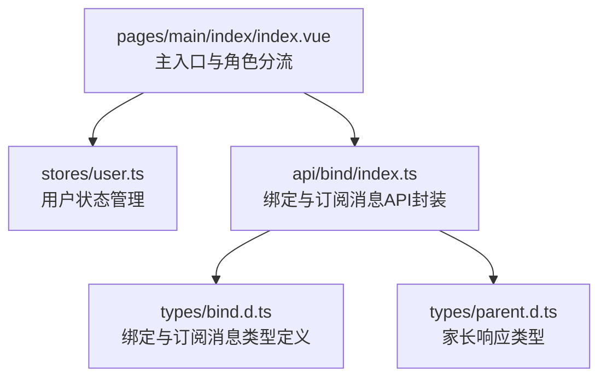
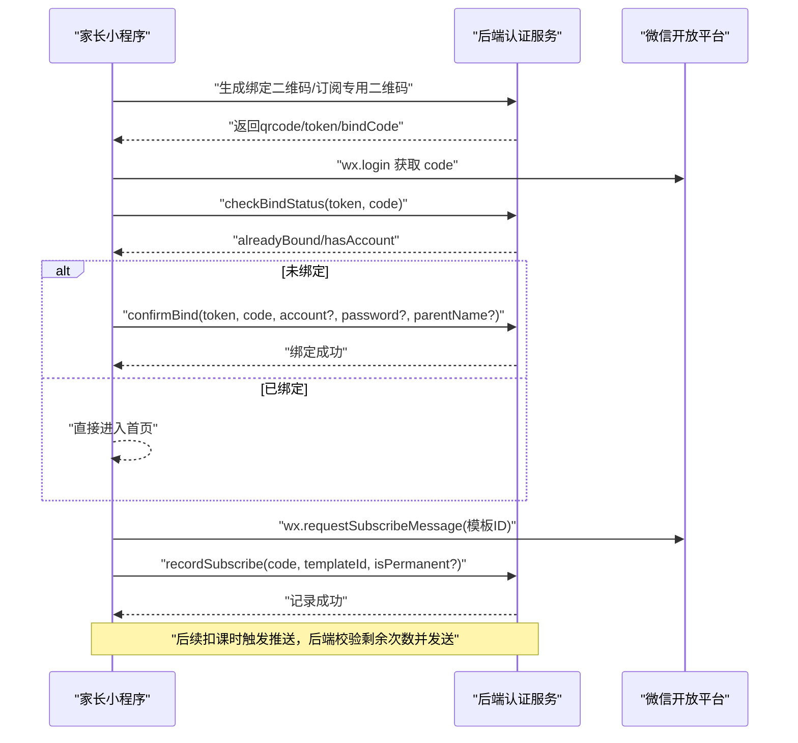
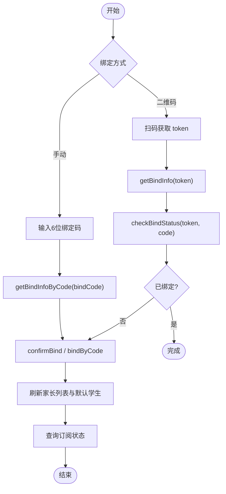
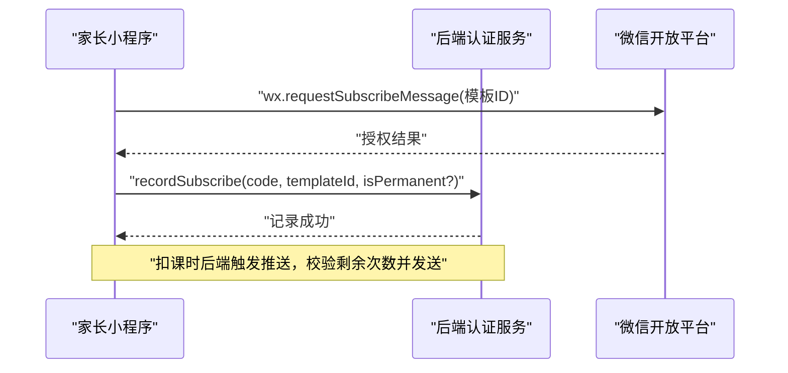
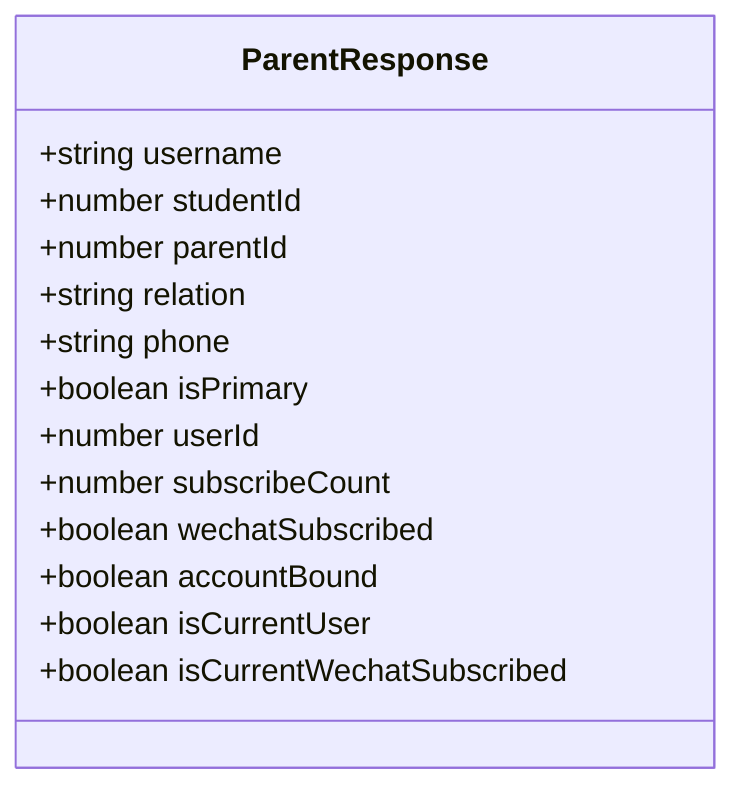
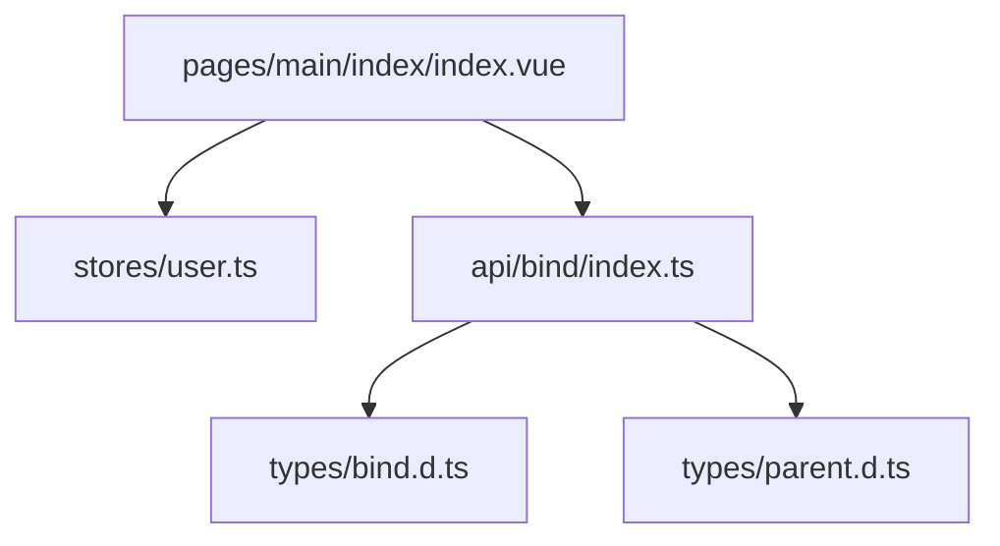

# 家长端功能模块

<cite>
**本文引用的文件**   
- [bind.d.ts](file://class_times_record/src/types/bind.d.ts)
- [index.ts（绑定API）](file://class_times_record/src/api/bind/index.ts)
- [index.vue（主入口）](file://class_times_record/src/pages/main/index/index.vue)
- [user.ts（用户状态管理）](file://class_times_record/src/stores/user.ts)
- [parent.d.ts（家长响应类型）](file://class_times_record/src/types/parent.d.ts)
</cite>

## 目录
1. [简介](#简介)
2. [项目结构](#项目结构)
3. [核心组件](#核心组件)
4. [架构总览](#架构总览)
5. [详细组件分析](#详细组件分析)
6. [依赖关系分析](#依赖关系分析)
7. [性能与体验优化](#性能与体验优化)
8. [故障排查指南](#故障排查指南)
9. [结论](#结论)
10. [附录：常见问题解答](#附录：常见问题解答)

## 简介
本章节面向“家长端”角色，系统性梳理其功能特性与实现要点，包括学生绑定（二维码绑定、手动绑定）、我的课程（查看课程信息与上课时间）、上课记录（历史记录查询与课时详情）、扣费详情（费用明细与扣费通知），以及家长与学生关系的绑定机制、数据同步策略、微信订阅消息推送的实现原理（申请、配置、触发逻辑），并给出数据展示优化方案与离线缓存策略。文档同时提供使用体验设计与常见问题解答，帮助产品、研发与测试人员快速理解与落地。

## 项目结构
家长端为小程序端应用，采用 uni-app + Vue3 + TypeScript 技术栈，页面路由与业务模块按功能域组织。与家长端相关的关键位置如下：
- 主入口与角色分流：根据登录角色渲染家长或教师视图
- 绑定流程：生成绑定二维码/订阅专用二维码、扫码确认绑定、通过绑定码手动绑定
- 订阅消息：授权记录、状态查询、测试发送
- 全局状态：用户信息存储与清理

图表来源
- [index.vue（主入口）:1-85](file://class_times_record/src/pages/main/index/index.vue#L1-L85)
- [user.ts（用户状态管理）:1-28](file://class_times_record/src/stores/user.ts#L1-L28)
- [index.ts（绑定API）:1-133](file://class_times_record/src/api/bind/index.ts#L1-L133)
- [bind.d.ts:1-96](file://class_times_record/src/types/bind.d.ts#L1-L96)
- [parent.d.ts:1-20](file://class_times_record/src/types/parent.d.ts#L1-L20)

章节来源
- [index.vue（主入口）:1-85](file://class_times_record/src/pages/main/index/index.vue#L1-L85)
- [user.ts（用户状态管理）:1-28](file://class_times_record/src/stores/user.ts#L1-L28)

## 核心组件
本节聚焦家长端的核心能力与关键接口，结合类型定义与API封装进行说明。

- 学生绑定
  - 生成绑定二维码：用于教师端或机构端生成，家长扫码后进入绑定流程
  - 生成订阅专用二维码：仅允许订阅消息授权，不绑定账号
  - 获取绑定信息：基于token获取待绑定的学生信息
  - 检查绑定状态：判断是否已绑定、是否已有账号
  - 确认绑定：完成绑定并建立家长与学生关系
  - 通过绑定码绑定：支持手动输入6位绑定码完成绑定
- 订阅消息
  - 记录授权：前端调用微信授权后上报模板ID与code，后端记录次数
  - 查询授权状态：返回是否已授权、剩余次数、是否已订阅指定学生
  - 测试发送：校验授权与推送链路
- 家长信息
  - 家长响应包含用户名、学生ID、关系、是否主要联系人、订阅次数、是否已绑定账号等字段

章节来源
- [index.ts（绑定API）:1-133](file://class_times_record/src/api/bind/index.ts#L1-L133)
- [bind.d.ts:1-96](file://class_times_record/src/types/bind.d.ts#L1-L96)
- [parent.d.ts:1-20](file://class_times_record/src/types/parent.d.ts#L1-L20)

## 架构总览
家长端整体交互流程围绕“绑定—授权—推送—展示”展开。下图展示了从家长扫码到最终收到扣课通知的端到端时序。

图表来源
- [index.ts（绑定API）:1-133](file://class_times_record/src/api/bind/index.ts#L1-L133)
- [bind.d.ts:1-96](file://class_times_record/src/types/bind.d.ts#L1-L96)

## 详细组件分析

### 学生绑定机制与数据同步策略
- 绑定方式
  - 二维码绑定：教师端生成绑定二维码（含token），家长扫码后进入绑定页，先检查绑定状态，再执行确认绑定
  - 手动绑定：教师端生成6位绑定码，家长在小程序内输入绑定码，先查询学生信息，确认后执行绑定
- 数据同步策略
  - 首次绑定成功后，前端应刷新当前家长列表与默认学生选择，确保“我的课程”和“上课记录”能正确加载
  - 若存在多个学生，建议以最近一次访问或主要联系人作为默认学生
  - 绑定完成后，立即拉取订阅状态，以便提示家长授权订阅消息

图表来源
- [index.ts（绑定API）:1-133](file://class_times_record/src/api/bind/index.ts#L1-L133)
- [bind.d.ts:1-96](file://class_times_record/src/types/bind.d.ts#L1-L96)

章节来源
- [index.ts（绑定API）:1-133](file://class_times_record/src/api/bind/index.ts#L1-L133)
- [bind.d.ts:1-96](file://class_times_record/src/types/bind.d.ts#L1-L96)

### 我的课程（查看课程信息与上课时间）
- 数据来源
  - 课程与课表数据由后端统一提供，家长端通过对应API获取当前学生的课程列表与上课时间
- 展示要点
  - 按周/月维度展示课表，突出即将开始的课程
  - 支持筛选与搜索，提升查找效率
- 数据一致性
  - 当教师调整课表时，家长端应在下次进入页面时拉取最新数据；必要时可引入增量更新或版本号对比

章节来源
- [index.vue（主入口）:1-85](file://class_times_record/src/pages/main/index/index.vue#L1-L85)

### 上课记录（历史记录查询与课时详情）
- 历史记录
  - 支持按日期范围、课程名称、状态等条件筛选
  - 分页加载，避免一次性加载过多数据
- 课时详情
  - 展示课时主题、授课教师、时长、备注等信息
  - 与扣费关联的课时，可在详情页显示扣费状态与金额

章节来源
- [index.vue（主入口）:1-85](file://class_times_record/src/pages/main/index/index.vue#L1-L85)

### 扣费详情（费用明细与扣费通知）
- 费用明细
  - 列出每次扣费的课程、时间、金额、支付方式等
  - 支持导出或分享账单（视业务需求）
- 扣费通知
  - 通过微信订阅消息推送扣费结果，家长可在消息中查看详情
  - 推送前需校验订阅授权与剩余次数

章节来源
- [index.ts（绑定API）:1-133](file://class_times_record/src/api/bind/index.ts#L1-L133)
- [bind.d.ts:1-96](file://class_times_record/src/types/bind.d.ts#L1-L96)

### 微信订阅消息推送实现原理
- 申请与配置
  - 在微信公众平台申请订阅消息模板，获取模板ID
  - 小程序端配置模板ID，并在需要时调用授权接口
- 授权与记录
  - 前端调用 wx.requestSubscribeMessage 请求授权
  - 授权成功后调用 recordSubscribe 上报 code 与模板ID，后端记录授权次数
- 触发逻辑
  - 后端在扣课时触发推送，校验剩余次数与openid，发送消息
  - 前端可通过 getSubscribeStatus 查询授权状态与剩余次数

图表来源
- [index.ts（绑定API）:1-133](file://class_times_record/src/api/bind/index.ts#L1-L133)
- [bind.d.ts:1-96](file://class_times_record/src/types/bind.d.ts#L1-L96)

章节来源
- [index.ts（绑定API）:1-133](file://class_times_record/src/api/bind/index.ts#L1-L133)
- [bind.d.ts:1-96](file://class_times_record/src/types/bind.d.ts#L1-L96)

### 家长与学生关系的数据模型
- 家长响应类型包含关键字段：用户名、学生ID、关系、是否主要联系人、订阅次数、是否已绑定账号、是否当前微信号已订阅该学生等
- 这些字段用于前端展示与权限控制，例如区分“已绑定当前微信”与“已订阅该学生”的状态

图表来源
- [parent.d.ts:1-20](file://class_times_record/src/types/parent.d.ts#L1-L20)

章节来源
- [parent.d.ts:1-20](file://class_times_record/src/types/parent.d.ts#L1-L20)

## 依赖关系分析
- 页面层依赖
  - 主入口根据角色渲染家长或教师视图，家长端包含首页与个人中心两个Tab
- 状态管理
  - 用户信息通过 Pinia store 管理，提供设置与清除操作
- API封装
  - 绑定与订阅消息相关接口集中在 api/bind/index.ts，类型定义位于 types/bind.d.ts 与 types/parent.d.ts

图表来源
- [index.vue（主入口）:1-85](file://class_times_record/src/pages/main/index/index.vue#L1-L85)
- [user.ts（用户状态管理）:1-28](file://class_times_record/src/stores/user.ts#L1-L28)
- [index.ts（绑定API）:1-133](file://class_times_record/src/api/bind/index.ts#L1-L133)
- [bind.d.ts:1-96](file://class_times_record/src/types/bind.d.ts#L1-L96)
- [parent.d.ts:1-20](file://class_times_record/src/types/parent.d.ts#L1-L20)

章节来源
- [index.vue（主入口）:1-85](file://class_times_record/src/pages/main/index/index.vue#L1-L85)
- [user.ts（用户状态管理）:1-28](file://class_times_record/src/stores/user.ts#L1-L28)
- [index.ts（绑定API）:1-133](file://class_times_record/src/api/bind/index.ts#L1-L133)
- [bind.d.ts:1-96](file://class_times_record/src/types/bind.d.ts#L1-L96)
- [parent.d.ts:1-20](file://class_times_record/src/types/parent.d.ts#L1-L20)

## 性能与体验优化
- 数据展示优化
  - 列表分页与虚拟滚动：对课程列表与上课记录采用分页加载，必要时引入虚拟滚动减少DOM压力
  - 图片与资源懒加载：课程封面、二维码等资源按需加载
  - 骨架屏与占位图：在网络延迟时提供良好反馈
- 离线缓存策略
  - 本地缓存：将近期课程与记录缓存至本地存储，网络不可用时优先展示缓存数据
  - 版本控制：为列表数据增加版本号或更新时间戳，服务端变更时强制刷新
  - 增量更新：对频繁变动的数据（如课表）采用增量接口，减少全量拉取
- 用户体验设计
  - 引导式绑定：首次进入家长端时，提供清晰的绑定引导与帮助文案
  - 错误提示：对绑定失败、授权失败等场景提供明确提示与重试入口
  - 反馈机制：对重要操作（如确认绑定、授权订阅）提供震动或动画反馈

[本节为通用指导，无需源码引用]

## 故障排查指南
- 绑定失败
  - 检查token是否过期或无效，重新生成绑定二维码
  - 确认微信code有效且未重复使用
  - 核对绑定码是否正确输入
- 订阅消息未送达
  - 确认已调用 recordSubscribe 并返回成功
  - 检查剩余次数是否大于0
  - 验证模板ID配置与openid映射是否正确
- 数据不同步
  - 刷新页面或退出重进，确保拉取最新数据
  - 检查本地缓存是否覆盖最新数据，必要时清空缓存

章节来源
- [index.ts（绑定API）:1-133](file://class_times_record/src/api/bind/index.ts#L1-L133)
- [bind.d.ts:1-96](file://class_times_record/src/types/bind.d.ts#L1-L96)

## 结论
家长端围绕“绑定—授权—推送—展示”形成完整闭环。通过二维码与手动绑定两种方式，家长可便捷地与学生建立关系；借助微信订阅消息，家长能及时获知扣费与上课动态。配合数据展示优化与离线缓存策略，可显著提升用户体验与系统稳定性。

[本节为总结性内容，无需源码引用]

## 附录：常见问题解答
- 问：如何切换默认学生？
  - 答：在个人中心选择目标学生并设为默认，系统将据此加载课程与记录
- 问：为什么收不到扣费通知？
  - 答：请检查是否已授权订阅消息、剩余次数是否为0、模板ID是否正确配置
- 问：绑定后看不到课程？
  - 答：确认绑定成功并已刷新页面；若仍无数据，检查学生ID与课程归属是否正确
- 问：手动绑定失败怎么办？
  - 答：确认绑定码有效期与正确性，重新生成绑定码后再次尝试

[本节为通用问答，无需源码引用]