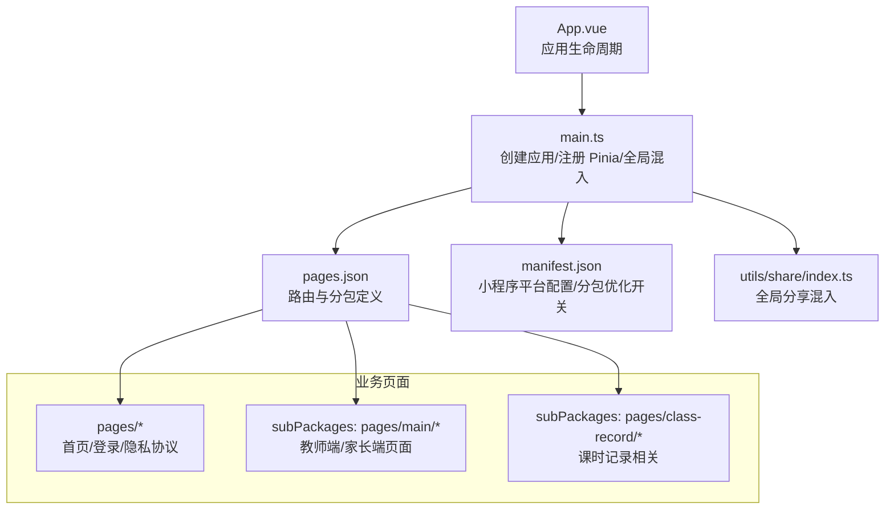
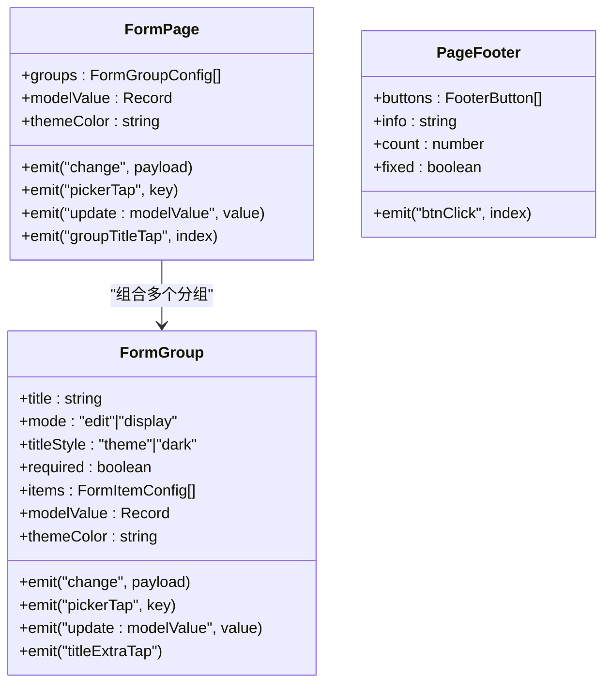
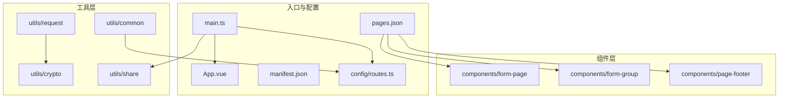
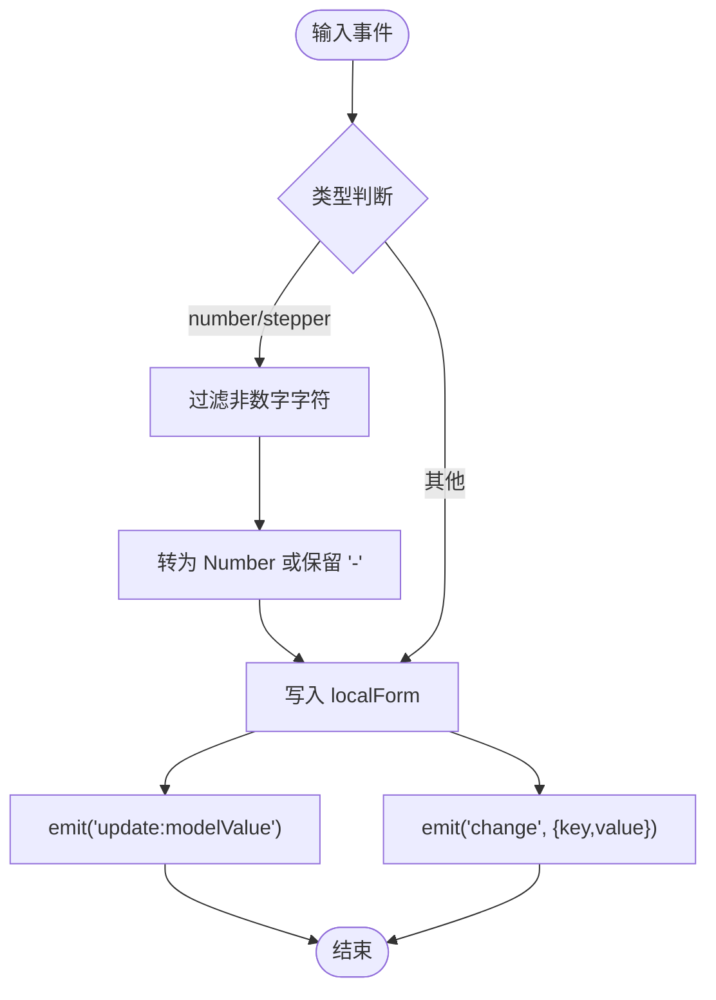
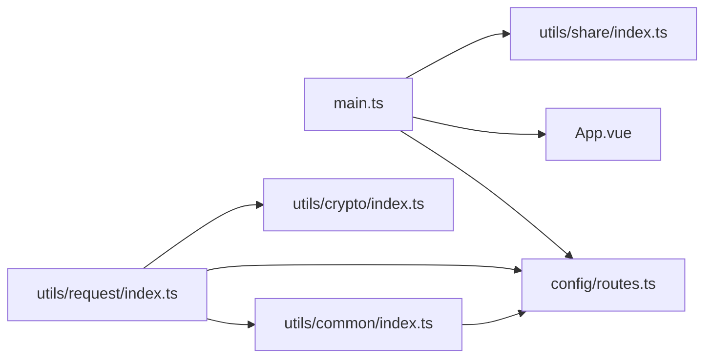
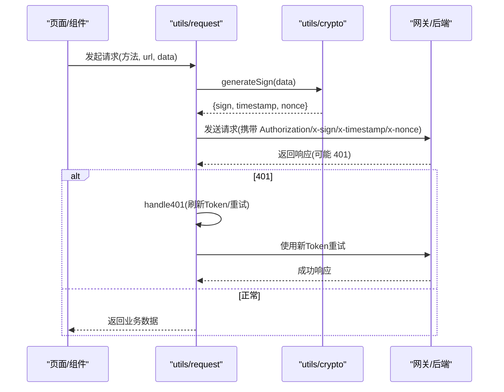
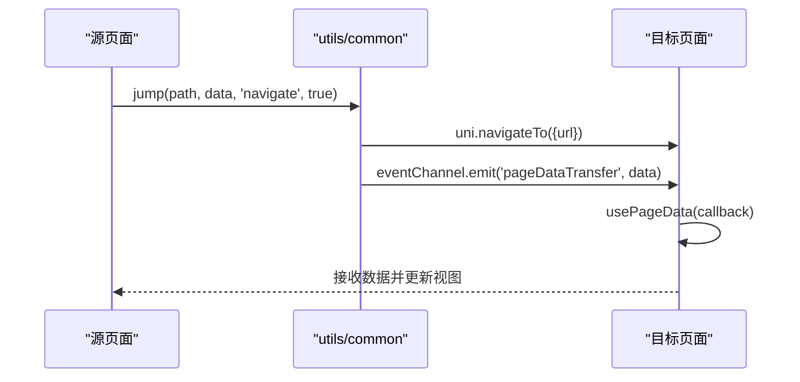

# 微信小程序端架构

<cite>
**本文引用的文件**   
- [App.vue](file://class_times_record/src/App.vue)
- [main.ts](file://class_times_record/src/main.ts)
- [pages.json](file://class_times_record/src/pages.json)
- [manifest.json](file://class_times_record/src/manifest.json)
- [form-page/index.vue](file://class_times_record/src/components/form-page/index.vue)
- [form-group/index.vue](file://class_times_record/src/components/form-group/index.vue)
- [page-footer/index.vue](file://class_times_record/src/components/page-footer/index.vue)
- [request/index.ts](file://class_times_record/src/utils/request/index.ts)
- [crypto/index.ts](file://class_times_record/src/utils/crypto/index.ts)
- [routes.ts](file://class_times_record/src/config/routes.ts)
- [common/index.ts](file://class_times_record/src/utils/common/index.ts)
- [share/index.ts](file://class_times_record/src/utils/share/index.ts)
</cite>

## 目录
1. [引言](#引言)
2. [项目结构](#项目结构)
3. [核心组件](#核心组件)
4. [架构总览](#架构总览)
5. [详细组件分析](#详细组件分析)
6. [依赖关系分析](#依赖关系分析)
7. [性能与分包优化](#性能与分包优化)
8. [安全机制（国密 SM2/SM3）](#安全机制国密-sm2sm3)
9. [多角色与权限控制](#多角色与权限控制)
10. [小程序 API 封装与事件处理](#小程序-api-封装与事件处理)
11. [开发规范与最佳实践](#开发规范与最佳实践)
12. [故障排查指南](#故障排查指南)
13. [结论](#结论)

## 引言
本文件面向微信小程序端的整体架构与实现，聚焦以下目标：
- uni-app 跨平台框架使用方案与小程序适配策略
- 组件优先的开发模式：FormPage、FormGroup、PageFooter 等核心组件的设计理念与实现细节
- 分包加载策略与性能优化，确保主包体积可控
- 前端国密算法（SM2/SM3）在密码加密与请求签名中的应用
- 多角色（教师端、家长端）功能划分与权限控制
- 小程序特有 API 封装与事件处理机制
- 完整的开发规范与最佳实践指导

## 项目结构
本项目基于 uni-app + Vue3 构建，采用“页面 + 分包 + 通用组件 + 工具库”的清晰分层。关键入口与配置如下：
- 应用生命周期与全局混入：App.vue、main.ts
- 路由与分包：pages.json
- 平台配置与分包优化开关：manifest.json
- 统一跳转与参数传递：utils/common/index.ts
- 分享能力：utils/share/index.ts
- 网络与安全：utils/request/index.ts、utils/crypto/index.ts
- 路由常量：config/routes.ts

图表来源
- [App.vue:1-18](file://class_times_record/src/App.vue#L1-L18)
- [main.ts:1-25](file://class_times_record/src/main.ts#L1-L25)
- [pages.json:1-415](file://class_times_record/src/pages.json#L1-L415)
- [manifest.json:50-64](file://class_times_record/src/manifest.json#L50-L64)

章节来源
- [App.vue:1-18](file://class_times_record/src/App.vue#L1-L18)
- [main.ts:1-25](file://class_times_record/src/main.ts#L1-L25)
- [pages.json:1-415](file://class_times_record/src/pages.json#L1-L415)
- [manifest.json:50-64](file://class_times_record/src/manifest.json#L50-L64)

## 核心组件
本节聚焦“组件优先”的设计思想，围绕 FormPage、FormGroup、PageFooter 三大核心组件展开。

- FormPage
  - 职责：聚合多个 FormGroup，提供统一的表单数据双向绑定与主题色注入
  - 特性：透传 change/pickerTap/update:modelValue/groupTitleTap 等事件；支持具名插槽扩展每个分组标题右侧与表单项内容
- FormGroup
  - 职责：渲染单个白色卡片容器，包含标题栏与配置驱动的表单项列表
  - 模式：edit（可编辑）、display（只读展示）
  - 支持的表单项类型：input、number、textarea、radio、select、date、time、picker、stepper、avatar、slot
  - 交互：内部维护 localForm 避免频繁 Diff，支持点号路径读写、数字输入过滤、选项值类型还原、头像选择等
- PageFooter
  - 职责：页面底部固定操作栏，支持单按钮、多按钮与信息+按钮布局
  - 特性：info 文本支持 {{count}} 占位符高亮显示；fixed 定位与阴影适配

图表来源
- [form-page/index.vue:1-58](file://class_times_record/src/components/form-page/index.vue#L1-L58)
- [form-group/index.vue:1-630](file://class_times_record/src/components/form-group/index.vue#L1-L630)
- [page-footer/index.vue:1-121](file://class_times_record/src/components/page-footer/index.vue#L1-L121)

章节来源
- [form-page/index.vue:1-58](file://class_times_record/src/components/form-page/index.vue#L1-L58)
- [form-group/index.vue:1-630](file://class_times_record/src/components/form-group/index.vue#L1-L630)
- [page-footer/index.vue:1-121](file://class_times_record/src/components/page-footer/index.vue#L1-L121)

## 架构总览
小程序端采用“轻量入口 + 配置驱动 + 组件化 + 工具层”的分层架构：
- 入口层：App.vue 管理生命周期，main.ts 初始化应用、Pinia、全局混入（分享）
- 路由层：pages.json 定义主包与分包，uniIdRouter 控制登录态
- 组件层：FormPage/FormGroup/PageFooter 等通用组件提升复用率
- 工具层：request（HTTP 封装）、crypto（SM2/SM3）、common（跳转/提示/参数解析）、share（分享）
- 配置层：routes.ts 集中管理页面路径常量

图表来源
- [main.ts:1-25](file://class_times_record/src/main.ts#L1-L25)
- [App.vue:1-18](file://class_times_record/src/App.vue#L1-L18)
- [pages.json:1-415](file://class_times_record/src/pages.json#L1-L415)
- [manifest.json:50-64](file://class_times_record/src/manifest.json#L50-L64)
- [routes.ts:1-65](file://class_times_record/src/config/routes.ts#L1-L65)
- [form-page/index.vue:1-58](file://class_times_record/src/components/form-page/index.vue#L1-L58)
- [form-group/index.vue:1-630](file://class_times_record/src/components/form-group/index.vue#L1-L630)
- [page-footer/index.vue:1-121](file://class_times_record/src/components/page-footer/index.vue#L1-L121)
- [request/index.ts:1-413](file://class_times_record/src/utils/request/index.ts#L1-L413)
- [crypto/index.ts:1-99](file://class_times_record/src/utils/crypto/index.ts#L1-L99)
- [common/index.ts:1-268](file://class_times_record/src/utils/common/index.ts#L1-L268)
- [share/index.ts:1-19](file://class_times_record/src/utils/share/index.ts#L1-L19)

## 详细组件分析

### FormPage 组件
- 设计要点
  - 通过 groups 数组驱动渲染多个 FormGroup，统一注入 themeColor 与 modelValue
  - 透传 change、pickerTap、update:modelValue、groupTitleTap 事件，便于父页面集中处理
  - 支持为每个分组提供 title-extra 与 item-slot 插槽，满足复杂场景定制
- 使用建议
  - 将表单按逻辑拆分为多个分组，减少单组复杂度
  - 对需要跳转的选择项使用 type=picker，配合 pickerTap 事件进行导航

章节来源
- [form-page/index.vue:1-58](file://class_times_record/src/components/form-page/index.vue#L1-L58)

### FormGroup 组件
- 设计要点
  - 两种模式：edit（可编辑）、display（只读），同一组件复用
  - 配置驱动：items 数组描述表单项，type 决定渲染控件
  - 本地状态 localForm 降低微信端 Diff 开销，setValue 深拷贝后抛出 update:modelValue
  - 输入校验：number/stepper 自动过滤非数字，支持允许负数；radio 根据 options 原始类型还原
  - 选择器：select/date/time/picker 分别对应不同交互；avatar 调用 chooseImage
- 性能优化
  - watch 浅拷贝同步外部 modelValue，避免 deep 监听导致频繁触发
  - getValue/setValue 支持点号路径，减少嵌套对象访问成本
- 可扩展性
  - slot 类型与默认插槽支持任意自定义内容，如日程卡片、添加按钮等

图表来源
- [form-group/index.vue:456-490](file://class_times_record/src/components/form-group/index.vue#L456-L490)
- [form-group/index.vue:426-447](file://class_times_record/src/components/form-group/index.vue#L426-L447)

章节来源
- [form-group/index.vue:1-630](file://class_times_record/src/components/form-group/index.vue#L1-L630)

### PageFooter 组件
- 设计要点
  - 三种布局：单按钮居中、多按钮横向、信息+按钮
  - info 文本支持 {{count}} 占位符，计算属性拆分片段并高亮数字
  - fixed 定位用于表单提交页，普通文档流用于详情页
- 使用建议
  - 将高频操作置于主按钮，次要操作使用 secondary，危险操作使用 danger

章节来源
- [page-footer/index.vue:1-121](file://class_times_record/src/components/page-footer/index.vue#L1-L121)

## 依赖关系分析
- main.ts 负责创建应用、注册 Pinia、注入全局 $ROUTES、混入 share
- App.vue 暴露 onLaunch/onShow/onHide 生命周期钩子
- pages.json 定义主包与分包，启用 easycom 自动引入 uni-ui
- manifest.json 中 mp-weixin 开启 subPackages 优化
- utils/request 依赖 crypto 生成签名，依赖 common 的 showToast，依赖 routes 做重定向
- utils/common 依赖 routes 做路径白名单校验，依赖 api/auth 做退出登录
- utils/share 作为全局混入提供分享回调

图表来源
- [main.ts:1-25](file://class_times_record/src/main.ts#L1-L25)
- [App.vue:1-18](file://class_times_record/src/App.vue#L1-L18)
- [routes.ts:1-65](file://class_times_record/src/config/routes.ts#L1-L65)
- [share/index.ts:1-19](file://class_times_record/src/utils/share/index.ts#L1-L19)
- [request/index.ts:1-413](file://class_times_record/src/utils/request/index.ts#L1-L413)
- [crypto/index.ts:1-99](file://class_times_record/src/utils/crypto/index.ts#L1-L99)
- [common/index.ts:1-268](file://class_times_record/src/utils/common/index.ts#L1-L268)

章节来源
- [main.ts:1-25](file://class_times_record/src/main.ts#L1-L25)
- [App.vue:1-18](file://class_times_record/src/App.vue#L1-L18)
- [routes.ts:1-65](file://class_times_record/src/config/routes.ts#L1-L65)
- [share/index.ts:1-19](file://class_times_record/src/utils/share/index.ts#L1-L19)
- [request/index.ts:1-413](file://class_times_record/src/utils/request/index.ts#L1-L413)
- [crypto/index.ts:1-99](file://class_times_record/src/utils/crypto/index.ts#L1-L99)
- [common/index.ts:1-268](file://class_times_record/src/utils/common/index.ts#L1-L268)

## 性能与分包优化
- 分包策略
  - 主包仅包含必要页面（首页、登录、隐私协议、用户协议）
  - 教师端与家长端页面放入 subPackages/pages/main，课时记录相关放入 subPackages/pages/class-record
  - 通过 pages.json 的 subPackages 明确 root 与 pages 映射，按需加载
- 平台优化
  - manifest.json 中 mp-weixin 开启 optimization.subPackages=true，显著降低首屏加载时间
- 组件级优化
  - FormGroup 使用局部 localForm 与浅拷贝同步，避免微信端因引用共享导致的输入卡顿
  - 使用 uni-icons 等轻量图标，减少图片资源
- 建议
  - 持续监控主包大小，尽量将大体积第三方库按需引入或下沉到分包
  - 合理使用懒加载与分页，避免一次性渲染大量数据

章节来源
- [pages.json:33-395](file://class_times_record/src/pages.json#L33-L395)
- [manifest.json:61-63](file://class_times_record/src/manifest.json#L61-L63)
- [form-group/index.vue:394-400](file://class_times_record/src/components/form-group/index.vue#L394-L400)

## 安全机制（国密 SM2/SM3）
- SM2 密码加密
  - 使用 sm-crypto 的 doEncrypt，cipherMode=1（C1C3C2），并在结果前拼接 04 前缀，需与后端保持一致
- SM3 请求签名
  - generateSign 对请求参数进行稳定序列化（递归排序 key、剔除 null/undefined/空串），拼接 timestamp、nonce 与 API_SECRET，再执行 SM3 得到 sign
  - 请求头携带 x-sign、x-timestamp、x-nonce，防止参数篡改与重放
- 流程示意

图表来源
- [crypto/index.ts:15-19](file://class_times_record/src/utils/crypto/index.ts#L15-L19)
- [crypto/index.ts:60-98](file://class_times_record/src/utils/crypto/index.ts#L60-L98)
- [request/index.ts:79-179](file://class_times_record/src/utils/request/index.ts#L79-L179)
- [request/index.ts:192-278](file://class_times_record/src/utils/request/index.ts#L192-L278)

章节来源
- [crypto/index.ts:1-99](file://class_times_record/src/utils/crypto/index.ts#L1-L99)
- [request/index.ts:1-413](file://class_times_record/src/utils/request/index.ts#L1-L413)

## 多角色与权限控制
- 角色划分
  - 教师端：班级/课程/学生/排课/扣费/记录管理等
  - 家长端：我的课程、上课记录、扣费详情、绑定学生等
- 路由组织
  - 教师端与家长端页面均位于 subPackages/pages/main 下，按 teacher/parent 子目录区分
- 登录态与鉴权
  - pages.json 中 uniIdRouter 指定 loginPage 与 needLogin 列表，未登录时自动跳转
  - request 中 handle401 实现 Token 静默刷新与失败回退登录
- 建议
  - 结合后端返回的角色字段在前端动态控制菜单与页面可见性
  - 敏感操作增加二次确认与权限校验

章节来源
- [pages.json:410-414](file://class_times_record/src/pages.json#L410-L414)
- [request/index.ts:192-278](file://class_times_record/src/utils/request/index.ts#L192-L278)

## 小程序 API 封装与事件处理
- 统一跳转与参数传递
  - jump 函数统一处理 navigate/redirect/relaunch，默认使用 EventChannel 传递对象参数，URL 长度受限场景自动降级
  - usePageData 在 onLoad 中优先从 EventChannel 接收数据，否则从 URL 解码兜底
- 消息提示
  - showToast 兼容字符串与对象参数，支持延迟与回调
- 分享能力
  - share 混入提供全局 onShareAppMessage 与 onShareTimeline 默认行为
- 示例流程

图表来源
- [common/index.ts:27-97](file://class_times_record/src/utils/common/index.ts#L27-L97)
- [common/index.ts:177-234](file://class_times_record/src/utils/common/index.ts#L177-L234)
- [share/index.ts:1-19](file://class_times_record/src/utils/share/index.ts#L1-L19)

章节来源
- [common/index.ts:1-268](file://class_times_record/src/utils/common/index.ts#L1-L268)
- [share/index.ts:1-19](file://class_times_record/src/utils/share/index.ts#L1-L19)

## 开发规范与最佳实践
- 组件优先
  - 优先使用 FormPage/FormGroup/PageFooter 组合页面，减少重复代码
  - 通过 items 配置驱动表单，保持模板简洁
- 路由与跳转
  - 所有页面路径集中在 routes.ts，jump 强制校验路径存在性
  - 大数据量传递优先使用 EventChannel，避免 URL 过长
- 网络与安全
  - 所有请求走 request 封装，禁止直接调用 uni.request
  - 签名与加密必须使用 crypto 提供的接口，保持前后端一致
- 样式与主题
  - 通过 themeColor 注入统一主题，避免硬编码颜色
- 性能
  - 合理使用分包，避免主包膨胀
  - 列表分页与懒加载，避免一次性渲染过多节点

[本节为通用指导，不直接分析具体文件]

## 故障排查指南
- 401 未授权
  - 检查 refreshToken 是否存在；handle401 会尝试刷新并缓存新 accessToken
  - 刷新失败将清理本地凭证并跳转登录页
- 网络异常/超时
  - request.fail 分支统一提示网络异常或超时，检查网络环境与域名配置
- 跳转路径错误
  - jump 会在运行时校验路径是否在 ROUTES 中，不在则拦截并提示
- 表单输入卡顿
  - 确认 FormGroup 使用 localForm 与浅拷贝同步，避免 deep 监听
- 分享无效
  - 确认已混入 share，且页面未覆盖全局分享配置

章节来源
- [request/index.ts:192-278](file://class_times_record/src/utils/request/index.ts#L192-L278)
- [request/index.ts:160-178](file://class_times_record/src/utils/request/index.ts#L160-L178)
- [common/index.ts:39-49](file://class_times_record/src/utils/common/index.ts#L39-L49)
- [form-group/index.vue:394-400](file://class_times_record/src/components/form-group/index.vue#L394-L400)
- [share/index.ts:1-19](file://class_times_record/src/utils/share/index.ts#L1-L19)

## 结论
本项目以 uni-app 为基础，结合组件优先与配置驱动理念，构建了可复用、易维护的小程序端架构。通过分包优化与工具层封装，实现了良好的性能与安全性。FormPage/FormGroup/PageFooter 提升了表单与操作栏的复用度；request 与 crypto 提供了健壮的请求与安全保障；common 与 share 完善了小程序生态体验。在多角色场景下，通过路由组织与登录态管理，有效支撑了教师端与家长端的功能边界。后续可继续完善权限粒度与埋点统计，进一步提升用户体验与可观测性。