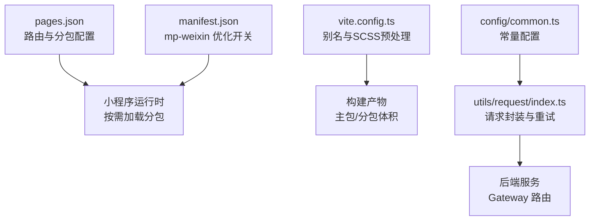
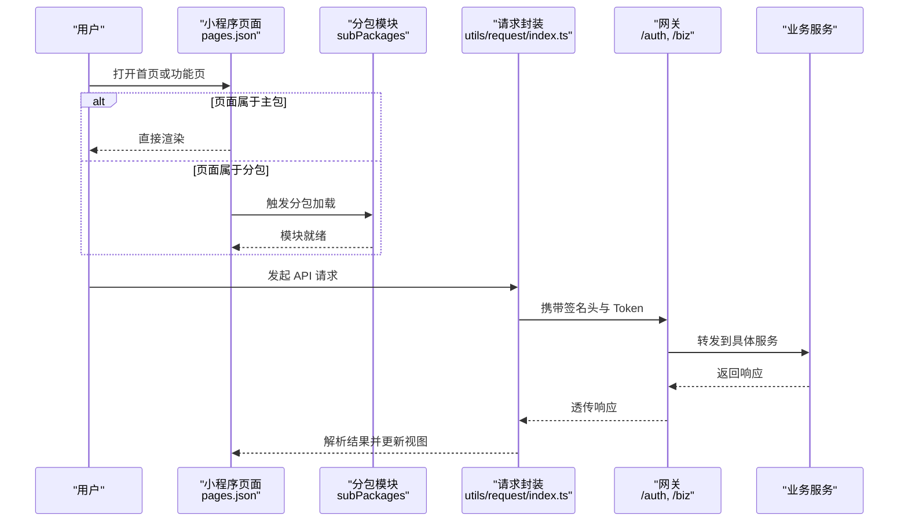
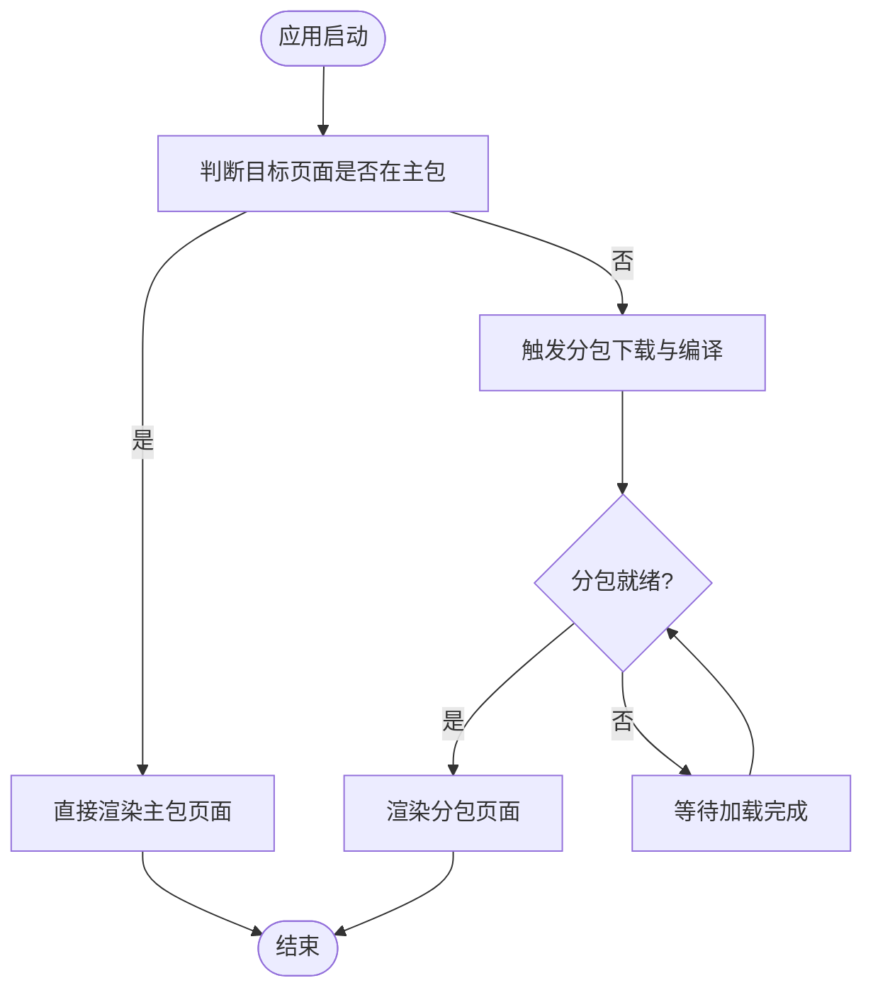
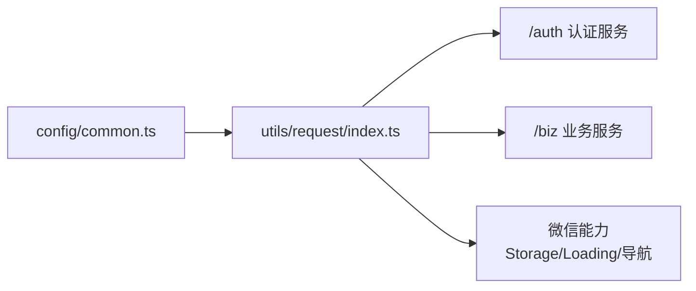

# 性能优化策略

<cite>
**本文引用的文件**   
- [pages.json](file://class_times_record/src/pages.json)
- [manifest.json](file://class_times_record/src/manifest.json)
- [vite.config.ts](file://class_times_record/vite.config.ts)
- [request/index.ts](file://class_times_record/src/utils/request/index.ts)
- [config/common.ts](file://class_times_record/src/config/common.ts)
</cite>

## 目录
1. [引言](#引言)
2. [项目结构](#项目结构)
3. [核心组件](#核心组件)
4. [架构总览](#架构总览)
5. [详细组件分析](#详细组件分析)
6. [依赖分析](#依赖分析)
7. [性能考虑](#性能考虑)
8. [故障排查指南](#故障排查指南)
9. [结论](#结论)
10. [附录](#附录)

## 引言
本文件面向小程序端（uni-app）的性能优化，围绕分包加载、图片资源优化、网络请求优化、页面渲染优化、监控与调试、打包体积分析与优化建议、以及性能测试与基准方案展开。文档结合仓库中现有配置与实现，给出可落地的策略与步骤，并附带可视化图示帮助理解。

## 项目结构
本项目为 uni-app 多端工程，其中 class_times_record 为小程序端源码。关键结构与优化相关点：
- 路由与分包：通过 pages.json 定义主包页面与 subPackages 分包，便于按需加载与控制主包大小。
- 平台构建与优化开关：manifest.json 中针对 mp-weixin 开启 subPackages 优化；vite.config.ts 提供别名与 SCSS 预处理配置。
- 网络层：utils/request/index.ts 封装了统一请求、签名、Token 刷新与重试等机制。
- 通用常量：config/common.ts 提供角色、模板ID等常量。

图表来源
- [pages.json:1-415](file://class_times_record/src/pages.json#L1-L415)
- [manifest.json:50-64](file://class_times_record/src/manifest.json#L50-L64)
- [vite.config.ts:1-30](file://class_times_record/vite.config.ts#L1-L30)
- [request/index.ts:1-413](file://class_times_record/src/utils/request/index.ts#L1-L413)
- [config/common.ts:1-34](file://class_times_record/src/config/common.ts#L1-L34)

章节来源
- [pages.json:1-415](file://class_times_record/src/pages.json#L1-L415)
- [manifest.json:50-64](file://class_times_record/src/manifest.json#L50-L64)
- [vite.config.ts:1-30](file://class_times_record/vite.config.ts#L1-L30)

## 核心组件
- 分包与路由
  - 主包入口与基础页面位于 pages 数组；业务模块按 root 划分到 subPackages，如 pages/main、pages/class-record。
  - 通过 uniIdRouter 配置登录页与需要登录的页面，减少不必要的鉴权逻辑在主包中的耦合。
- 构建与优化
  - manifest.json 中 mp-weixin 的 optimization.subPackages 已开启，有助于在微信端进行分包优化。
  - vite.config.ts 使用 @ 别名指向 src，利于模块化组织与按需引入。
- 网络请求
  - utils/request/index.ts 基于 uni.request 封装，支持自动签名、超时控制、错误提示、401 静默刷新 Token 与重试。
  - Gateway 前缀约定 /auth 与 /biz，确保请求被正确路由至对应微服务。

章节来源
- [pages.json:1-415](file://class_times_record/src/pages.json#L1-L415)
- [manifest.json:50-64](file://class_times_record/src/manifest.json#L50-L64)
- [vite.config.ts:1-30](file://class_times_record/vite.config.ts#L1-L30)
- [request/index.ts:1-413](file://class_times_record/src/utils/request/index.ts#L1-L413)

## 架构总览
下图展示小程序端从页面路由到网络请求的整体流程，体现分包加载与请求拦截的关键路径。

图表来源
- [pages.json:1-415](file://class_times_record/src/pages.json#L1-L415)
- [request/index.ts:1-413](file://class_times_record/src/utils/request/index.ts#L1-L413)

## 详细组件分析

### 分包加载策略
- 主包大小控制（2MB 限制）
  - 将非首屏必要页面与大型模块放入 subPackages，避免主包超过 2MB。
  - 将公共样式与脚本尽量抽离到分包共享或使用懒加载方式引入。
- 分包路由配置
  - 在 pages.json 中使用 subPackages.root 指定根目录，并在 pages 中声明子路径。
  - 示例：将家长与教师相关页面归入 pages/main，课时管理相关页面归入 pages/class-record。
- 按需加载机制
  - 利用 uni-app 的分包特性，仅在首次访问时下载对应分包。
  - 对低频功能进一步采用动态 import 或条件初始化，降低冷启动开销。

图表来源
- [pages.json:1-415](file://class_times_record/src/pages.json#L1-L415)

章节来源
- [pages.json:1-415](file://class_times_record/src/pages.json#L1-L415)

### 图片资源优化方案
- 图片压缩
  - 在构建阶段使用工具链（如 image-webpack-loader、svgo、pngquant）对静态资源进行无损/有损压缩。
  - 优先使用 SVG 图标与矢量图，减少位图数量与体积。
- 懒加载
  - 列表与长页面使用懒加载策略，仅当元素进入视口再加载图片，降低首屏压力。
  - 结合占位图与骨架屏提升感知性能。
- CDN 加速
  - 将图片资源托管至 CDN，启用缓存与压缩传输（gzip/brotli）。
  - 使用相对路径或域名白名单配置，确保小程序安全域名校验通过。

[本节为通用策略说明，不直接分析具体文件]

### 网络请求优化
- 请求合并
  - 对高频且数据相关性强的接口，可在业务层聚合参数后一次性拉取，减少往返次数。
  - 使用防抖与节流避免重复请求。
- 缓存策略
  - 对读多写少的数据采用本地缓存（如 Storage），设置合理过期时间。
  - 结合版本号或时间戳实现缓存失效与增量更新。
- 错误重试机制
  - 在网络异常或服务器错误时进行指数退避重试，避免雪崩。
  - 对幂等 GET 请求可安全重试；POST 需谨慎处理。

章节来源
- [request/index.ts:1-413](file://class_times_record/src/utils/request/index.ts#L1-L413)

### 页面渲染优化
- 虚拟列表
  - 大数据量列表使用虚拟滚动，仅渲染可视区域节点，显著降低内存占用与重排重绘。
- 分页加载
  - 列表数据分页获取，结合下拉刷新与触底加载更多，平衡首屏与交互体验。
- 内存管理
  - 及时释放定时器、事件监听与大图对象引用，避免内存泄漏。
  - 页面销毁时清理状态与中间变量。

[本节为通用策略说明，不直接分析具体文件]

### 小程序特有的性能监控与调试工具
- 微信开发者工具
  - 使用性能面板查看网络、渲染、内存与帧率指标。
  - 使用“代码包大小”检查主包与分包体积分布。
- uniStatistics
  - 在 manifest.json 中可启用 uniStatistics 以采集运行期指标（当前项目默认关闭）。
- 自定义埋点
  - 在请求封装与页面生命周期中插入埋点，统计耗时、失败率与关键路径时长。

章节来源
- [manifest.json:74-76](file://class_times_record/src/manifest.json#L74-L76)

### 打包体积分析与优化建议
- 体积分析
  - 使用微信开发者工具的“代码包大小”功能定位大文件与冗余依赖。
  - 借助第三方插件（如 webpack-bundle-analyzer）分析依赖树。
- 优化建议
  - 移除未使用的第三方库与 polyfill。
  - 拆分大组件与页面，延迟加载非必要模块。
  - 压缩静态资源，启用 gzip/brotli。
  - 合理使用分包，避免主包膨胀。

章节来源
- [manifest.json:50-64](file://class_times_record/src/manifest.json#L50-L64)
- [vite.config.ts:1-30](file://class_times_record/vite.config.ts#L1-L30)

### 性能测试方法与基准测试方案
- 测试环境
  - 选择主流机型与网络环境（4G/5G/Wi-Fi），覆盖低端设备。
- 指标定义
  - 首屏渲染时间、分包加载耗时、API 平均耗时与成功率、内存峰值与 GC 频率。
- 基准方案
  - 固定任务序列（启动→登录→核心页面→列表翻页→退出），多次采样取均值。
  - 对比优化前后指标变化，记录回归问题。

[本节为通用策略说明，不直接分析具体文件]

## 依赖分析
- 组件内聚与耦合
  - 请求封装集中处理签名、超时、错误提示与 401 刷新，降低业务层耦合度。
  - 常量配置独立于业务逻辑，提高可维护性。
- 外部依赖与集成点
  - 通过 Gateway 前缀 /auth 与 /biz 与后端微服务对接。
  - 微信小程序平台能力（Storage、showLoading、reLaunch）贯穿请求与路由流程。

图表来源
- [request/index.ts:1-413](file://class_times_record/src/utils/request/index.ts#L1-L413)
- [config/common.ts:1-34](file://class_times_record/src/config/common.ts#L1-L34)

章节来源
- [request/index.ts:1-413](file://class_times_record/src/utils/request/index.ts#L1-L413)
- [config/common.ts:1-34](file://class_times_record/src/config/common.ts#L1-L34)

## 性能考虑
- 启动与冷启动
  - 精简主包，延迟初始化非必要模块，减少首屏阻塞。
- 渲染与交互
  - 避免频繁 setData 与大对象更新，使用局部更新与增量渲染。
- 网络与并发
  - 控制并发数，避免同时大量请求导致带宽拥塞与线程竞争。
- 存储与缓存
  - 合理设置缓存有效期，定期清理过期数据，防止存储膨胀。

[本节为通用策略说明，不直接分析具体文件]

## 故障排查指南
- 401 未授权与 Token 刷新
  - 现象：部分请求返回 401，随后触发 refresh 流程。
  - 排查：确认 refreshToken 是否存在、refresh 接口是否可达、新 Token 是否正确写入 Storage。
  - 行为：刷新成功后队列中的请求会重新发送，失败则跳转登录页。
- 网络异常与超时
  - 现象：fail 回调提示网络异常或超时。
  - 排查：检查 baseUrl 与域名白名单、网络连通性与服务端可用性。
- 分包加载失败
  - 现象：访问分包页面无响应或报错。
  - 排查：确认 pages.json 中分包路径与 root 配置正确，主包未超 2MB。

章节来源
- [request/index.ts:182-278](file://class_times_record/src/utils/request/index.ts#L182-L278)
- [request/index.ts:160-178](file://class_times_record/src/utils/request/index.ts#L160-L178)
- [pages.json:1-415](file://class_times_record/src/pages.json#L1-L415)

## 结论
通过对分包加载、图片资源、网络请求、页面渲染与监控调试的系统化优化，可显著提升小程序端的启动速度、交互流畅度与稳定性。建议在持续迭代中建立性能基线，结合自动化测试与监控告警，保障长期质量。

## 附录
- 关键配置位置参考
  - 分包与路由：pages.json
  - 平台优化开关：manifest.json
  - 构建与别名：vite.config.ts
  - 请求封装与重试：utils/request/index.ts
  - 通用常量：config/common.ts

章节来源
- [pages.json:1-415](file://class_times_record/src/pages.json#L1-L415)
- [manifest.json:50-64](file://class_times_record/src/manifest.json#L50-L64)
- [vite.config.ts:1-30](file://class_times_record/vite.config.ts#L1-L30)
- [request/index.ts:1-413](file://class_times_record/src/utils/request/index.ts#L1-L413)
- [config/common.ts:1-34](file://class_times_record/src/config/common.ts#L1-L34)