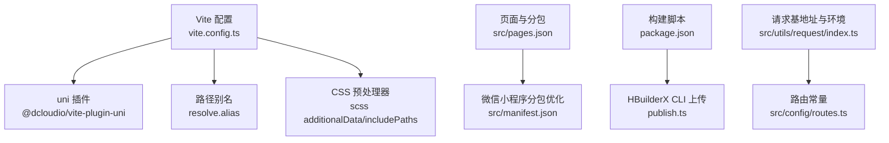
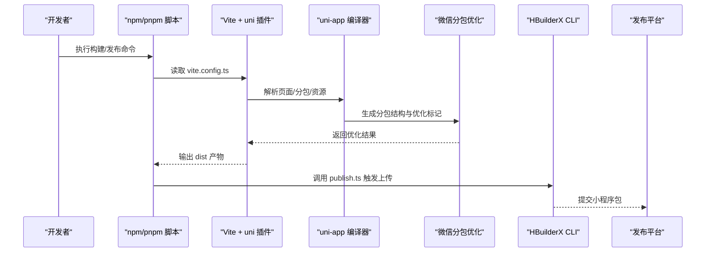
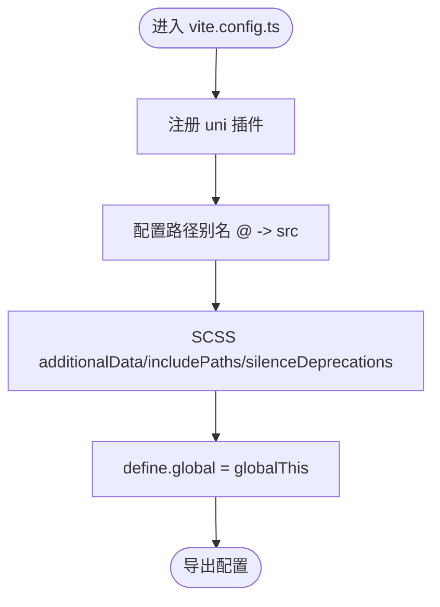
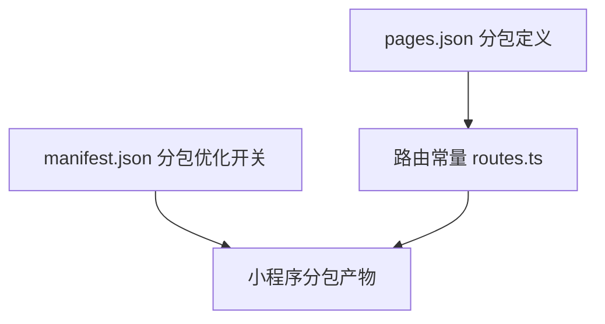
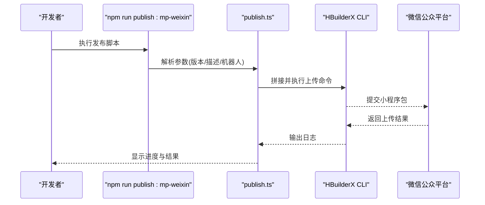
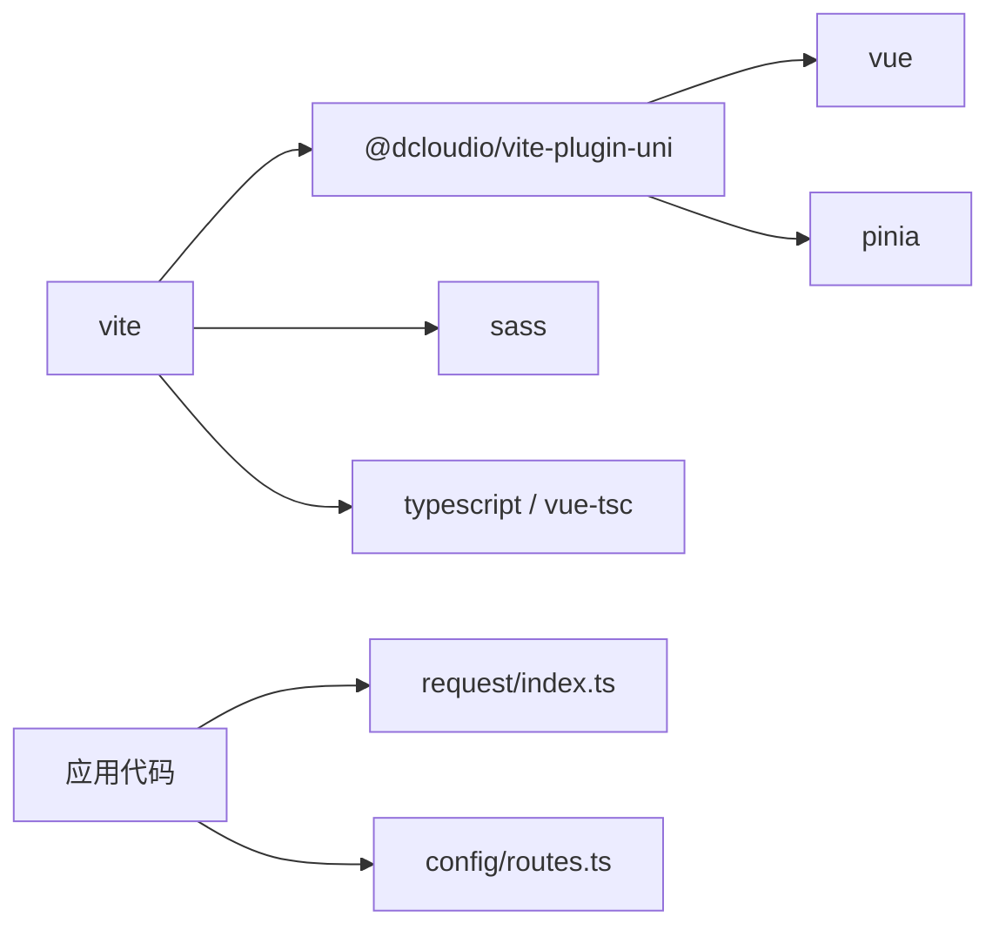

# 构建打包优化

<cite>
**本文引用的文件**
- [vite.config.ts](file://class_times_record/vite.config.ts)
- [package.json](file://class_times_record/package.json)
- [pages.json](file://class_times_record/src/pages.json)
- [manifest.json](file://class_times_record/src/manifest.json)
- [publish.ts](file://class_times_record/publish.ts)
- [request/index.ts](file://class_times_record/src/utils/request/index.ts)
- [config/routes.ts](file://class_times_record/src/config/routes.ts)
</cite>

## 目录
1. [引言](#引言)
2. [项目结构](#项目结构)
3. [核心组件](#核心组件)
4. [架构总览](#架构总览)
5. [详细组件分析](#详细组件分析)
6. [依赖分析](#依赖分析)
7. [性能考虑](#性能考虑)
8. [故障排查指南](#故障排查指南)
9. [结论](#结论)
10. [附录](#附录)

## 引言
本文件面向小程序端（uni-app + Vite）的构建与打包优化，围绕以下目标展开：
- Vite 构建配置优化：插件、别名、预处理选项
- 分包策略与主包体积控制：路由规划与分包边界
- Tree Shaking 与代码分割：减少最终包体积
- 依赖库优化：按需引入与版本管理
- 环境变量与构建时替换：多环境差异化
- 增量构建与缓存机制：提升开发体验
- 多环境构建与自动化发布流程：脚本与工具链
- 构建性能分析与优化建议：定位瓶颈与改进方向

## 项目结构
本项目为 uni-app 小程序工程，使用 Vite 作为构建工具。关键构建相关位置如下：
- 构建配置：vite.config.ts
- 平台与分包配置：src/pages.json、src/manifest.json
- 构建脚本与发布：package.json、publish.ts
- 运行时环境变量切换：src/utils/request/index.ts
- 路由常量：src/config/routes.ts

图表来源
- [vite.config.ts:1-30](file://class_times_record/vite.config.ts#L1-L30)
- [pages.json:1-415](file://class_times_record/src/pages.json#L1-L415)
- [manifest.json:50-64](file://class_times_record/src/manifest.json#L50-L64)
- [package.json:1-82](file://class_times_record/package.json#L1-L82)
- [publish.ts:1-61](file://class_times_record/publish.ts#L1-L61)
- [request/index.ts:1-413](file://class_times_record/src/utils/request/index.ts#L1-L413)
- [config/routes.ts:1-65](file://class_times_record/src/config/routes.ts#L1-L65)

章节来源
- [vite.config.ts:1-30](file://class_times_record/vite.config.ts#L1-L30)
- [package.json:1-82](file://class_times_record/package.json#L1-L82)
- [pages.json:1-415](file://class_times_record/src/pages.json#L1-L415)
- [manifest.json:50-64](file://class_times_record/src/manifest.json#L50-L64)
- [publish.ts:1-61](file://class_times_record/publish.ts#L1-L61)
- [request/index.ts:1-413](file://class_times_record/src/utils/request/index.ts#L1-L413)
- [config/routes.ts:1-65](file://class_times_record/src/config/routes.ts#L1-L65)

## 核心组件
- Vite 插件与基础能力
  - 启用 @dcloudio/vite-plugin-uni 以支持 uni-app 编译与小程序产物生成
  - 通过 defineConfig 暴露标准 Vite 配置项
- 路径别名
  - 将 @ 指向 src 目录，统一模块引用路径
- CSS 预处理
  - SCSS additionalData 注入全局样式变量与主题入口
  - includePaths 设置 scss 查找路径
  - silenceDeprecations 抑制旧版 API 警告
- 构建脚本
  - 提供多端开发与构建命令，包含微信小程序专用命令
  - 提供发布脚本入口 publish.ts
- 分包与平台优化
  - pages.json 定义主包与分包路由
  - manifest.json 开启微信小程序 subPackages 优化
- 环境变量与运行期切换
  - request/index.ts 根据 NODE_ENV 选择不同后端基地址
- 路由常量
  - config/routes.ts 集中管理页面路径常量，避免硬编码

章节来源
- [vite.config.ts:1-30](file://class_times_record/vite.config.ts#L1-L30)
- [package.json:1-82](file://class_times_record/package.json#L1-L82)
- [pages.json:1-415](file://class_times_record/src/pages.json#L1-L415)
- [manifest.json:50-64](file://class_times_record/src/manifest.json#L50-L64)
- [request/index.ts:1-413](file://class_times_record/src/utils/request/index.ts#L1-L413)
- [config/routes.ts:1-65](file://class_times_record/src/config/routes.ts#L1-L65)

## 架构总览
下图展示从源码到小程序产物的构建链路，以及分包与发布的关键节点。

图表来源
- [vite.config.ts:1-30](file://class_times_record/vite.config.ts#L1-L30)
- [pages.json:1-415](file://class_times_record/src/pages.json#L1-L415)
- [manifest.json:50-64](file://class_times_record/src/manifest.json#L50-L64)
- [publish.ts:1-61](file://class_times_record/publish.ts#L1-L61)

## 详细组件分析

### Vite 构建配置优化
- 插件配置
  - 使用 @dcloudio/vite-plugin-uni 提供 uni-app 全栈构建能力
- 别名设置
  - resolve.alias 将 @ 映射至 src，简化导入路径
- 预处理选项
  - SCSS additionalData 注入全局样式入口与 sass:color 模块
  - includePaths 指定 scss 搜索根路径
  - silenceDeprecations 抑制 legacy-js-api 警告
- 构建时全局常量
  - define.global 兼容 globalThis 环境差异

图表来源
- [vite.config.ts:1-30](file://class_times_record/vite.config.ts#L1-L30)

章节来源
- [vite.config.ts:1-30](file://class_times_record/vite.config.ts#L1-L30)

### 分包策略与主包大小控制
- 分包路由规划
  - pages.json 中通过 subPackages 将业务域按 root 划分，如 main、class-record
  - 主包仅保留启动页、登录、协议等必要页面，降低首屏加载体积
- 平台级分包优化
  - manifest.json 中 mp-weixin.optimization.subPackages 开启分包优化
- 路由常量管理
  - config/routes.ts 集中维护所有页面路径，便于分包边界调整与一致性校验

图表来源
- [pages.json:1-415](file://class_times_record/src/pages.json#L1-L415)
- [manifest.json:50-64](file://class_times_record/src/manifest.json#L50-L64)
- [config/routes.ts:1-65](file://class_times_record/src/config/routes.ts#L1-L65)

章节来源
- [pages.json:1-415](file://class_times_record/src/pages.json#L1-L415)
- [manifest.json:50-64](file://class_times_record/src/manifest.json#L50-L64)
- [config/routes.ts:1-65](file://class_times_record/src/config/routes.ts#L1-L65)

### Tree Shaking 与代码分割
- Tree Shaking
  - 基于 ES Module 静态分析，移除未使用导出；建议在 utils、api 层保持纯函数与命名导出
- 代码分割
  - 分包即天然的路由级代码分割；结合懒加载可进一步细化
  - 对于非小程序场景可使用动态 import() 进行细粒度拆分（当前小程序侧以分包为主）

[本节为通用技术说明，不直接分析具体文件]

### 依赖库优化策略
- 第三方库按需引入
  - 优先使用轻量替代或按需引入方案，避免整体引入大库
- 版本管理
  - 锁定依赖版本，确保构建稳定性与可复现性
- 无用依赖清理
  - 定期审计依赖树，移除不再使用的包

[本节为通用技术说明，不直接分析具体文件]

### 环境变量配置与构建时替换
- 运行期环境切换
  - request/index.ts 通过 process.env.NODE_ENV 分支选择 baseUrl，实现 dev/prod/trial 环境切换
- 构建时替换
  - 可通过 Vite define 在构建阶段注入常量，减少运行期判断分支
- 最佳实践
  - 将敏感信息放入 CI 环境变量，不在仓库中硬编码

章节来源
- [request/index.ts:1-413](file://class_times_record/src/utils/request/index.ts#L1-L413)

### 增量构建与缓存机制
- 开发体验优化
  - Vite 默认具备热更新与增量编译能力；合理组织模块与避免循环依赖可进一步提升速度
- 缓存策略
  - 利用 node_modules 与 Vite 内部缓存；CI 中缓存 pnpm/npm 包与 Vite 缓存目录
- 构建产物
  - 区分开发/生产产物目录，避免污染

[本节为通用技术说明，不直接分析具体文件]

### 多环境构建与自动化发布流程
- 多端构建脚本
  - package.json 提供多端 build 命令，如 mp-weixin
- 自动化发布
  - publish.ts 解析命令行参数，调用 HBuilderX CLI 完成上传，支持版本号、描述、机器人编号等参数
- 流程时序

图表来源
- [package.json:1-82](file://class_times_record/package.json#L1-L82)
- [publish.ts:1-61](file://class_times_record/publish.ts#L1-L61)

章节来源
- [package.json:1-82](file://class_times_record/package.json#L1-L82)
- [publish.ts:1-61](file://class_times_record/publish.ts#L1-L61)

### 构建性能分析与优化建议
- 分析维度
  - 构建时长：关注依赖安装、编译、分包合并、压缩阶段
  - 产物体积：关注主包大小、分包数量与大小、公共库重复打包
- 常见优化点
  - 减少主包页面与静态资源
  - 合理使用分包，避免跨分包强耦合
  - 关闭不必要的调试信息与日志
  - 使用平台优化开关（如 subPackages）
- 工具建议
  - 使用平台提供的体积分析工具与日志，定位大文件与重复依赖

[本节为通用技术说明，不直接分析具体文件]

## 依赖分析
- 构建依赖
  - vite、@dcloudio/vite-plugin-uni、sass、typescript、vue-tsc 等
- 运行依赖
  - vue、pinia、dayjs、sm-crypto、vue-i18n 等
- 发布依赖
  - miniprogram-ci（可选）、HBuilderX CLI（外部工具）

图表来源
- [package.json:1-82](file://class_times_record/package.json#L1-L82)
- [vite.config.ts:1-30](file://class_times_record/vite.config.ts#L1-L30)
- [request/index.ts:1-413](file://class_times_record/src/utils/request/index.ts#L1-L413)
- [config/routes.ts:1-65](file://class_times_record/src/config/routes.ts#L1-L65)

章节来源
- [package.json:1-82](file://class_times_record/package.json#L1-L82)

## 性能考虑
- 构建阶段
  - 并行任务：CI 中缓存依赖与构建缓存
  - 增量构建：避免全量重建，减少无关变更
- 运行阶段
  - 首屏加载：主包最小化，关键资源内联，图片与字体按需加载
  - 网络请求：合并接口、缓存策略、错误重试与超时控制
- 产物体积
  - 分包边界清晰，避免重复依赖
  - 关闭调试模式，移除 console 与无用资源

[本节为通用技术说明，不直接分析具体文件]

## 故障排查指南
- 常见问题
  - 分包后页面无法访问：检查 pages.json 分包 root 与 path 是否一致
  - 主包过大：定位大文件与重复依赖，迁移至分包或按需引入
  - 环境变量未生效：确认构建命令与 define 注入是否正确
  - 发布失败：核对 HBuilderX CLI 路径、私钥与 appId 配置
- 定位方法
  - 查看构建日志与平台上传日志
  - 使用平台体积分析工具定位大文件
  - 逐步缩小范围，验证分包与依赖影响

章节来源
- [pages.json:1-415](file://class_times_record/src/pages.json#L1-L415)
- [manifest.json:50-64](file://class_times_record/src/manifest.json#L50-L64)
- [publish.ts:1-61](file://class_times_record/publish.ts#L1-L61)

## 结论
通过对 Vite 构建配置、分包策略、Tree Shaking、依赖管理与发布流程的系统优化，可有效降低小程序主包体积、缩短构建时间并提升发布效率。建议持续监控构建指标与产物体积，结合业务演进不断调整分包边界与依赖策略。

[本节为总结性内容，不直接分析具体文件]

## 附录
- 常用命令参考
  - 开发：多端开发命令见 package.json scripts
  - 构建：多端构建命令见 package.json scripts
  - 发布：npm run publish:mp-weixin 触发自动化上传
- 配置文件清单
  - 构建配置：vite.config.ts
  - 分包与平台：src/pages.json、src/manifest.json
  - 脚本与发布：package.json、publish.ts
  - 环境变量与路由：src/utils/request/index.ts、src/config/routes.ts

章节来源
- [package.json:1-82](file://class_times_record/package.json#L1-L82)
- [vite.config.ts:1-30](file://class_times_record/vite.config.ts#L1-L30)
- [pages.json:1-415](file://class_times_record/src/pages.json#L1-L415)
- [manifest.json:50-64](file://class_times_record/src/manifest.json#L50-L64)
- [publish.ts:1-61](file://class_times_record/publish.ts#L1-L61)
- [request/index.ts:1-413](file://class_times_record/src/utils/request/index.ts#L1-L413)
- [config/routes.ts:1-65](file://class_times_record/src/config/routes.ts#L1-L65)