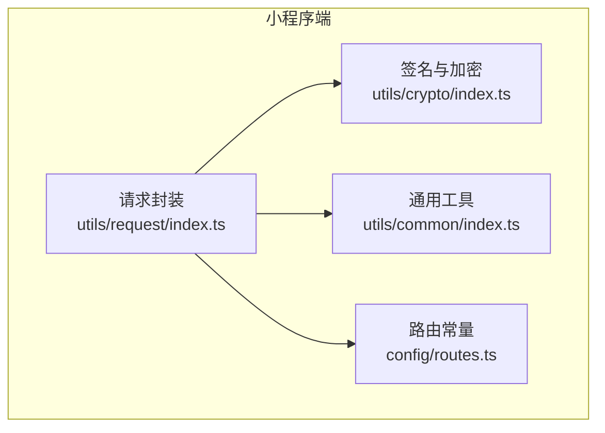
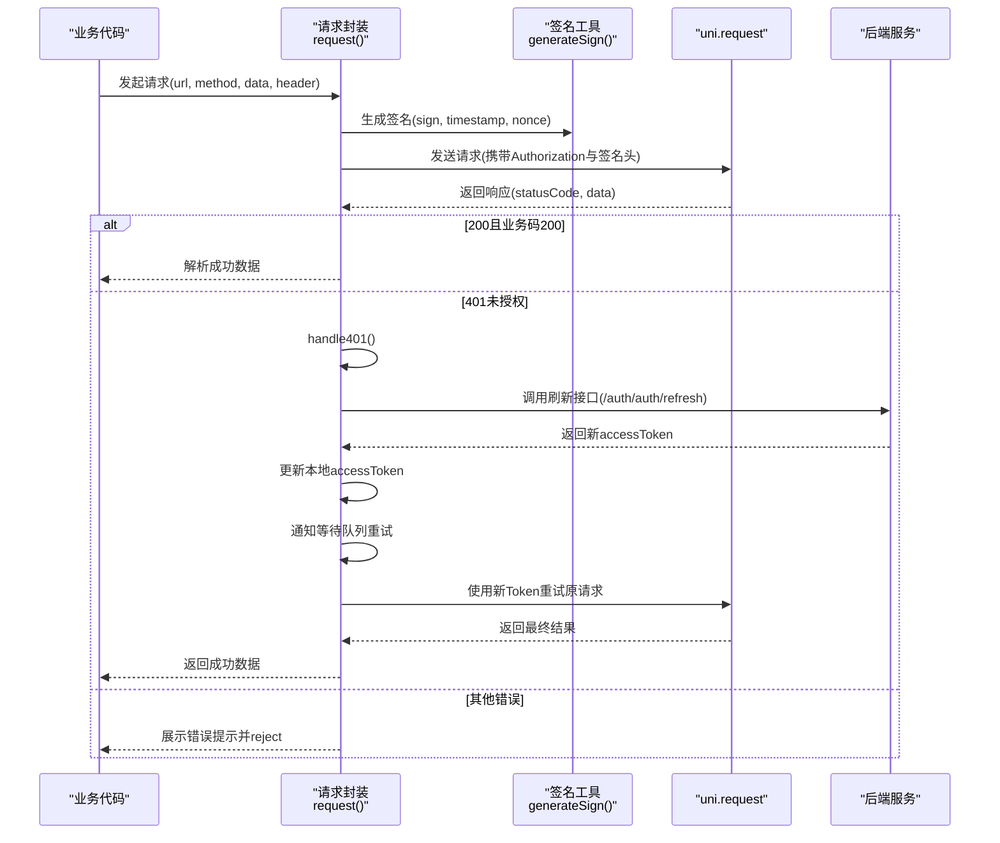
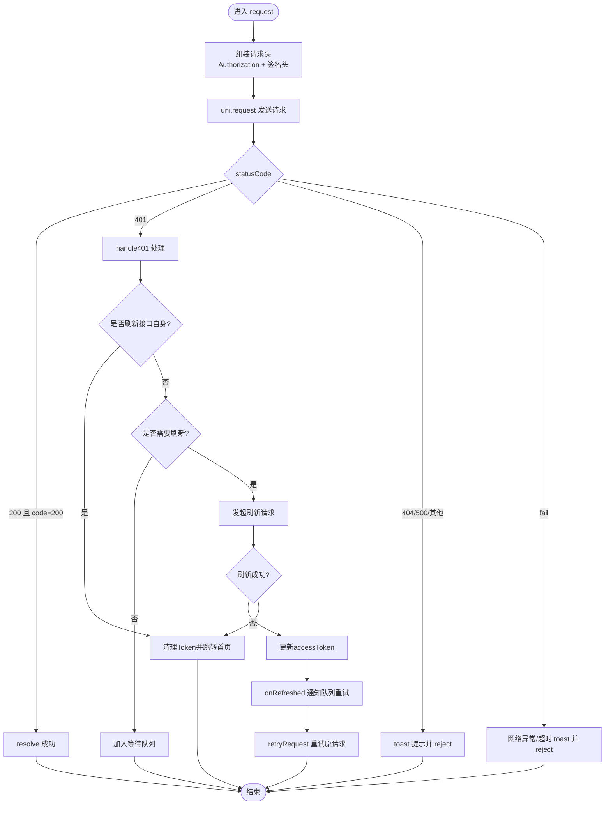
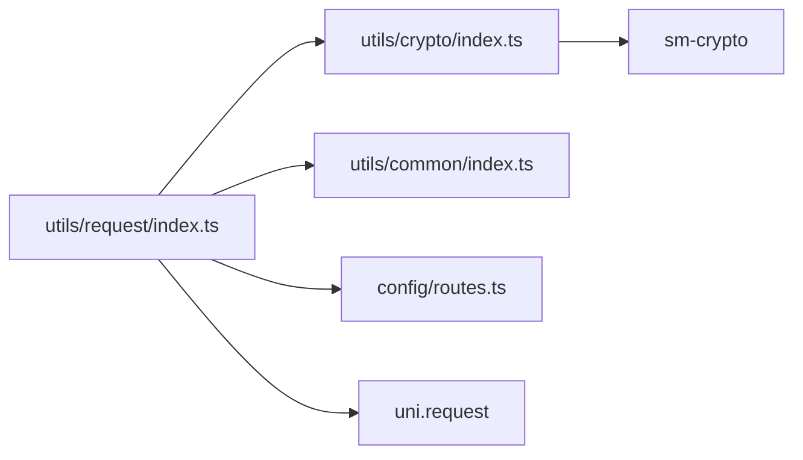
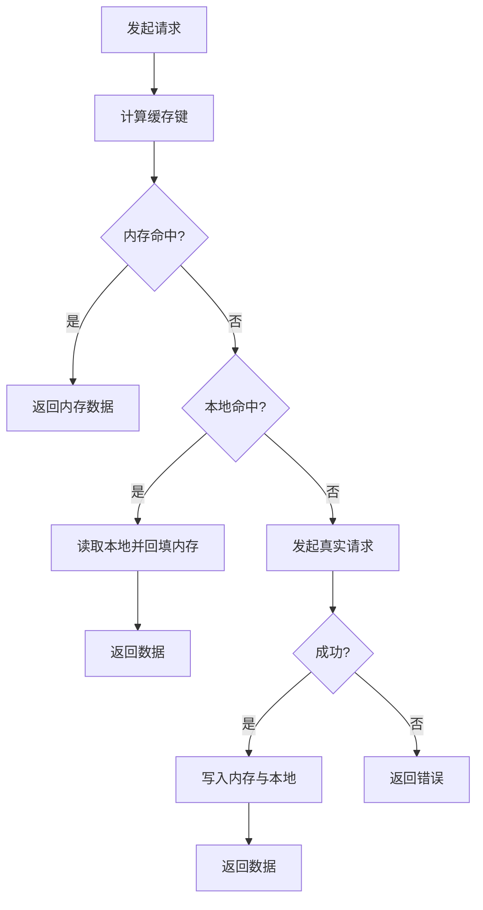
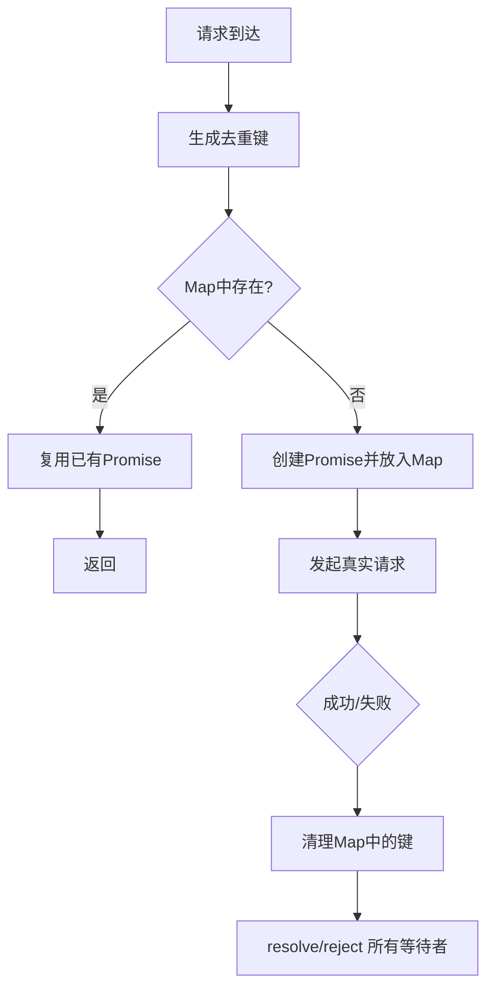
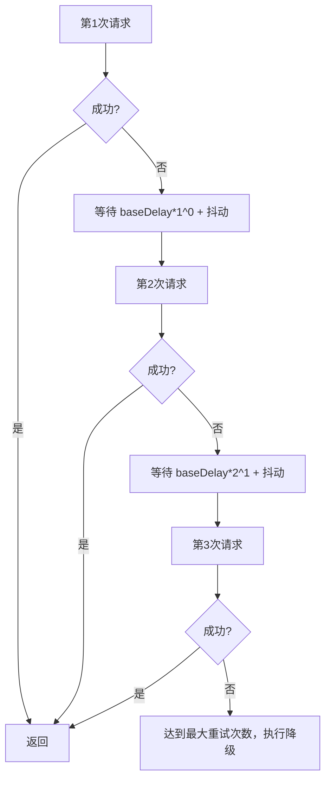
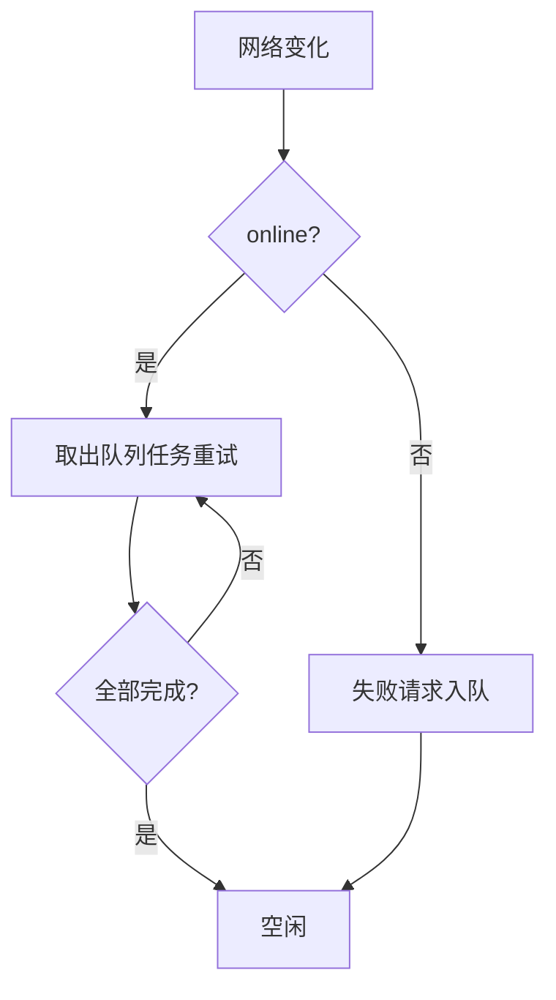

# 网络请求优化

<cite>
**本文引用的文件**   
- [class_times_record/src/utils/request/index.ts](file://class_times_record/src/utils/request/index.ts)
- [class_times_record/src/utils/crypto/index.ts](file://class_times_record/src/utils/crypto/index.ts)
- [class_times_record/src/utils/common/index.ts](file://class_times_record/src/utils/common/index.ts)
- [class_times_record/src/config/routes.ts](file://class_times_record/src/config/routes.ts)
</cite>

## 目录
1. [简介](#简介)
2. [项目结构](#项目结构)
3. [核心组件](#核心组件)
4. [架构总览](#架构总览)
5. [详细组件分析](#详细组件分析)
6. [依赖关系分析](#依赖关系分析)
7. [性能考虑](#性能考虑)
8. [故障排查指南](#故障排查指南)
9. [结论](#结论)
10. [附录](#附录)

## 简介
本文件面向小程序端（uni-app）的网络请求优化，围绕以下目标展开：
- 统一请求拦截器：请求头设置、签名与鉴权、错误处理与提示
- Token 管理：自动刷新、并发安全、失败降级与跳转
- 缓存策略：本地/内存缓存与失效机制（建议方案）
- 请求合并与去重：避免重复请求（建议方案）
- 重试机制：指数退避与失败降级（建议方案）
- 网络状态监听与离线处理（建议方案）
- 性能监控与日志记录（建议方案）
- 最佳实践与示例路径指引

## 项目结构
本次优化聚焦于小程序端的 HTTP 封装与安全签名模块，关键文件如下：
- 请求封装与拦截：utils/request/index.ts
- 国密签名与加密：utils/crypto/index.ts
- 通用工具（Toast、跳转等）：utils/common/index.ts
- 路由常量：config/routes.ts

图表来源
- [class_times_record/src/utils/request/index.ts:1-413](file://class_times_record/src/utils/request/index.ts#L1-L413)
- [class_times_record/src/utils/crypto/index.ts:1-99](file://class_times_record/src/utils/crypto/index.ts#L1-L99)
- [class_times_record/src/utils/common/index.ts:1-268](file://class_times_record/src/utils/common/index.ts#L1-L268)
- [class_times_record/src/config/routes.ts:1-65](file://class_times_record/src/config/routes.ts#L1-L65)

章节来源
- [class_times_record/src/utils/request/index.ts:1-413](file://class_times_record/src/utils/request/index.ts#L1-L413)
- [class_times_record/src/utils/crypto/index.ts:1-99](file://class_times_record/src/utils/crypto/index.ts#L1-L99)
- [class_times_record/src/utils/common/index.ts:1-268](file://class_times_record/src/utils/common/index.ts#L1-L268)
- [class_times_record/src/config/routes.ts:1-65](file://class_times_record/src/config/routes.ts#L1-L65)

## 核心组件
- 请求封装与拦截器
  - 统一入口 request<T>(options)，基于 uni.request 实现
  - 自动注入 Authorization、x-sign、x-timestamp、x-nonce 等请求头
  - 统一成功/失败/完成回调，显示加载提示与错误提示
  - 401 未授权时触发 Token 刷新流程，并支持并发等待与重试
- 安全签名
  - generateSign(params) 生成 SM3 签名、时间戳与随机串
  - 参数序列化采用稳定排序与过滤，确保前后端一致
- 通用工具
  - showToast 提供统一的提示能力
  - jump/usePageData 用于页面跳转与参数传递（与网络无关但被登录过期跳转使用）
- 路由常量
  - ROUTES.INDEX 作为登录过期后的默认跳转目标

章节来源
- [class_times_record/src/utils/request/index.ts:79-179](file://class_times_record/src/utils/request/index.ts#L79-L179)
- [class_times_record/src/utils/request/index.ts:192-278](file://class_times_record/src/utils/request/index.ts#L192-L278)
- [class_times_record/src/utils/request/index.ts:290-334](file://class_times_record/src/utils/request/index.ts#L290-L334)
- [class_times_record/src/utils/crypto/index.ts:60-98](file://class_times_record/src/utils/crypto/index.ts#L60-L98)
- [class_times_record/src/utils/common/index.ts:106-142](file://class_times_record/src/utils/common/index.ts#L106-L142)
- [class_times_record/src/config/routes.ts:2-62](file://class_times_record/src/config/routes.ts#L2-L62)

## 架构总览
下图展示了从业务调用到服务端响应的完整链路，包括签名注入、Token 管理与 401 刷新流程。

图表来源
- [class_times_record/src/utils/request/index.ts:79-179](file://class_times_record/src/utils/request/index.ts#L79-L179)
- [class_times_record/src/utils/request/index.ts:192-278](file://class_times_record/src/utils/request/index.ts#L192-L278)
- [class_times_record/src/utils/request/index.ts:290-334](file://class_times_record/src/utils/request/index.ts#L290-L334)
- [class_times_record/src/utils/crypto/index.ts:60-98](file://class_times_record/src/utils/crypto/index.ts#L60-L98)

## 详细组件分析

### 请求拦截器与 Token 管理
- 请求头设置
  - 自动注入 Content-Type、Authorization（Bearer token）、x-sign、x-timestamp、x-nonce
  - 支持通过 options.header 扩展自定义请求头
- 超时与加载态
  - 全局 timeout 配置；loading 控制 show/hideLoading
- 错误处理
  - 200 且业务码 200：resolve
  - 401：进入 Token 刷新流程
  - 404/500/其他：toast 提示并 reject
  - fail：区分 timeout 与普通网络异常，toast 提示并 reject
- Token 刷新与并发安全
  - isRefreshing 标志位防止并发刷新
  - refreshSubscribers 队列保存所有等待中的请求，刷新成功后依次重试
  - 当前请求也加入订阅队列，避免“回调+订阅”双重重试
- 刷新失败与登出
  - 无 refreshToken 或刷新失败：清除 accessToken/refreshToken，toast 提示，延迟跳转到首页
  - 刷新接口本身返回 401：直接清理并跳转

图表来源
- [class_times_record/src/utils/request/index.ts:79-179](file://class_times_record/src/utils/request/index.ts#L79-L179)
- [class_times_record/src/utils/request/index.ts:192-278](file://class_times_record/src/utils/request/index.ts#L192-L278)
- [class_times_record/src/utils/request/index.ts:290-334](file://class_times_record/src/utils/request/index.ts#L290-L334)

章节来源
- [class_times_record/src/utils/request/index.ts:79-179](file://class_times_record/src/utils/request/index.ts#L79-L179)
- [class_times_record/src/utils/request/index.ts:192-278](file://class_times_record/src/utils/request/index.ts#L192-L278)
- [class_times_record/src/utils/request/index.ts:290-334](file://class_times_record/src/utils/request/index.ts#L290-L334)
- [class_times_record/src/utils/common/index.ts:106-142](file://class_times_record/src/utils/common/index.ts#L106-L142)
- [class_times_record/src/config/routes.ts:2-62](file://class_times_record/src/config/routes.ts#L2-L62)

### 安全签名与加密
- 签名算法
  - 对请求参数进行稳定排序与过滤（剔除 null/undefined/空串），拼接为 key=value&... 形式
  - 追加 API_SECRET 后计算 SM3 摘要，得到 sign
  - 同时生成 timestamp 与 nonce，随请求头一起发送
- 加密能力
  - encryptPassword 使用 SM2 公钥加密密码（与后端保持一致的 cipherMode）
- 一致性保障
  - 对象序列化采用递归稳定 stringify，保证与后端 Jackson 行为一致

章节来源
- [class_times_record/src/utils/crypto/index.ts:27-53](file://class_times_record/src/utils/crypto/index.ts#L27-L53)
- [class_times_record/src/utils/crypto/index.ts:60-98](file://class_times_record/src/utils/crypto/index.ts#L60-L98)
- [class_times_record/src/utils/crypto/index.ts:15-19](file://class_times_record/src/utils/crypto/index.ts#L15-L19)

### 通用工具与路由
- showToast：统一消息提示，支持多种图标与时长，内部延时调用 uni.showToast
- ROUTES：集中管理页面路径，供登录过期跳转使用

章节来源
- [class_times_record/src/utils/common/index.ts:106-142](file://class_times_record/src/utils/common/index.ts#L106-L142)
- [class_times_record/src/config/routes.ts:2-62](file://class_times_record/src/config/routes.ts#L2-L62)

## 依赖关系分析
- 请求封装依赖
  - crypto.generateSign：注入签名相关请求头
  - common.showToast：错误与提示信息
  - config.ROUTES：登录过期跳转目标
- 外部依赖
  - uni.request：底层网络请求
  - sm-crypto：SM2/SM3 算法

图表来源
- [class_times_record/src/utils/request/index.ts:1-413](file://class_times_record/src/utils/request/index.ts#L1-L413)
- [class_times_record/src/utils/crypto/index.ts:1-99](file://class_times_record/src/utils/crypto/index.ts#L1-L99)
- [class_times_record/src/utils/common/index.ts:1-268](file://class_times_record/src/utils/common/index.ts#L1-L268)
- [class_times_record/src/config/routes.ts:1-65](file://class_times_record/src/config/routes.ts#L1-L65)

章节来源
- [class_times_record/src/utils/request/index.ts:1-413](file://class_times_record/src/utils/request/index.ts#L1-L413)
- [class_times_record/src/utils/crypto/index.ts:1-99](file://class_times_record/src/utils/crypto/index.ts#L1-L99)
- [class_times_record/src/utils/common/index.ts:1-268](file://class_times_record/src/utils/common/index.ts#L1-L268)
- [class_times_record/src/config/routes.ts:1-65](file://class_times_record/src/config/routes.ts#L1-L65)

## 性能考虑
- 已实现
  - 统一超时与加载态，减少 UI 抖动
  - 401 并发刷新与重试，避免多次无效请求
- 建议增强（可插拔扩展点）
  - 请求缓存：本地存储 + 内存缓存 + 失效策略（见“附录”）
  - 请求合并与去重：按 URL+方法+参数哈希去重，合并 Promise（见“附录”）
  - 重试与退避：指数退避 + 最大重试次数 + 失败降级（见“附录”）
  - 网络状态监听与离线队列：断网时入队，恢复后批量重试（见“附录”）
  - 性能监控与日志：埋点耗时、成功率、错误分类上报（见“附录”）

[本节为通用指导，不直接分析具体文件]

## 故障排查指南
- 常见问题定位
  - 401 频繁出现：检查 refreshToken 是否存在、刷新接口是否正常、isRefreshing 逻辑是否正确
  - 签名失败：确认参数排序与过滤逻辑是否与后端一致，API_SECRET 是否匹配
  - 网络超时：检查 timeout 配置与服务端响应时间，必要时增加超时或优化接口
  - 跳转异常：确认 ROUTES.INDEX 是否在 pages.json 中注册
- 快速自检清单
  - 请求头是否包含 Authorization 与 x-sign/x-timestamp/x-nonce
  - 刷新接口 /auth/auth/refresh 是否可达且返回正确结构
  - 刷新成功后是否更新了 accessToken 并触发了重试队列
  - 错误提示是否清晰，用户可感知

章节来源
- [class_times_record/src/utils/request/index.ts:192-278](file://class_times_record/src/utils/request/index.ts#L192-L278)
- [class_times_record/src/utils/crypto/index.ts:60-98](file://class_times_record/src/utils/crypto/index.ts#L60-L98)
- [class_times_record/src/config/routes.ts:2-62](file://class_times_record/src/config/routes.ts#L2-L62)

## 结论
当前请求封装已具备完善的拦截、签名、鉴权与 401 自动刷新能力，并通过队列机制保证并发安全。建议在后续迭代中按需引入缓存、去重、重试退避、网络监听与性能监控等能力，进一步提升用户体验与系统稳定性。

[本节为总结性内容，不直接分析具体文件]

## 附录

### A. 请求缓存策略（建议方案）
- 缓存层级
  - 内存缓存：进程内 Map，键为请求标识（URL+method+参数哈希），值为 {data, time}
  - 本地缓存：uni.setStorageSync，持久化常用静态数据
- 失效策略
  - TTL：按类型配置不同过期时间（如 5s/30s/5min）
  - 主动失效：写操作后按前缀或精确键删除
- 命中流程
  - 先查内存，命中则直接返回
  - 未命中再查本地，命中则回填内存并返回
  - 均未命中则发起真实请求，成功后写入两级缓存

[此图为概念示意，不对应具体源码文件]

### B. 请求合并与去重（建议方案）
- 去重键：url + method + JSON.stringify(data) 的哈希
- 合并策略：同一键的请求在首次发出时创建 Promise，后续相同请求共享该 Promise
- 生命周期：请求完成后从 Map 中移除对应键

[此图为概念示意，不对应具体源码文件]

### C. 重试与指数退避（建议方案）
- 适用场景：网络抖动、临时 5xx、限流 429
- 策略：最大重试次数 N，初始间隔 baseDelay，每次翻倍，叠加随机抖动
- 失败降级：超过阈值后返回兜底数据或提示用户稍后重试

[此图为概念示意，不对应具体源码文件]

### D. 网络状态监听与离线处理（建议方案）
- 监听：uni.onNetworkStatusChange，维护 online/offline 状态
- 离线队列：将失败请求入队，带优先级与重试次数
- 恢复策略：网络恢复后按序重试，失败继续延后重试

[此图为概念示意，不对应具体源码文件]

### E. 性能监控与日志记录（建议方案）
- 指标
  - 请求耗时、成功率、错误分类（网络/鉴权/业务/服务器）
  - 首包时间、TTFB、DNS 解析耗时（平台允许时）
- 采集点
  - 请求开始/结束时间戳
  - 响应码与业务码
  - 错误堆栈与上下文（URL、method、参数摘要）
- 上报
  - 批量上报、采样上报、敏感信息脱敏

[此节为通用指导，不直接分析具体文件]

### F. 最佳实践建议
- 明确缓存边界：仅对幂等 GET 与低频变更数据启用缓存
- 合理设置 TTL：热点数据短 TTL，静态资源长 TTL
- 去重粒度：以“语义唯一”的键为准，避免过度合并导致脏读
- 重试克制：幂等接口谨慎重试，非幂等接口需幂等设计或补偿
- 降级优先：在网络不可用时提供可用体验（缓存/骨架屏/友好提示）
- 可观测性：埋点先行，问题可追踪、可度量、可回溯

[本节为通用指导，不直接分析具体文件]