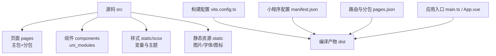
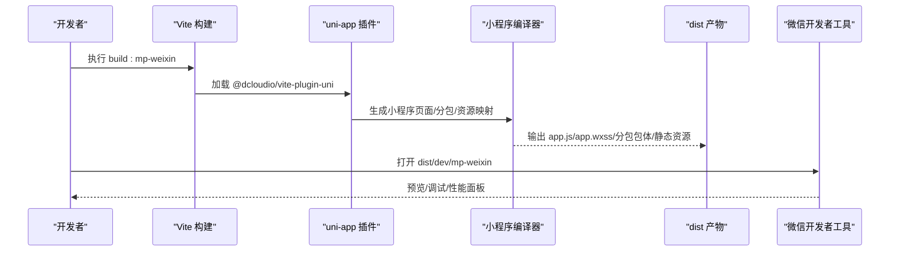
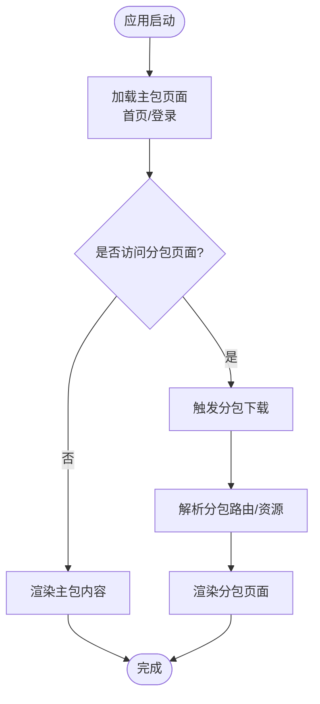
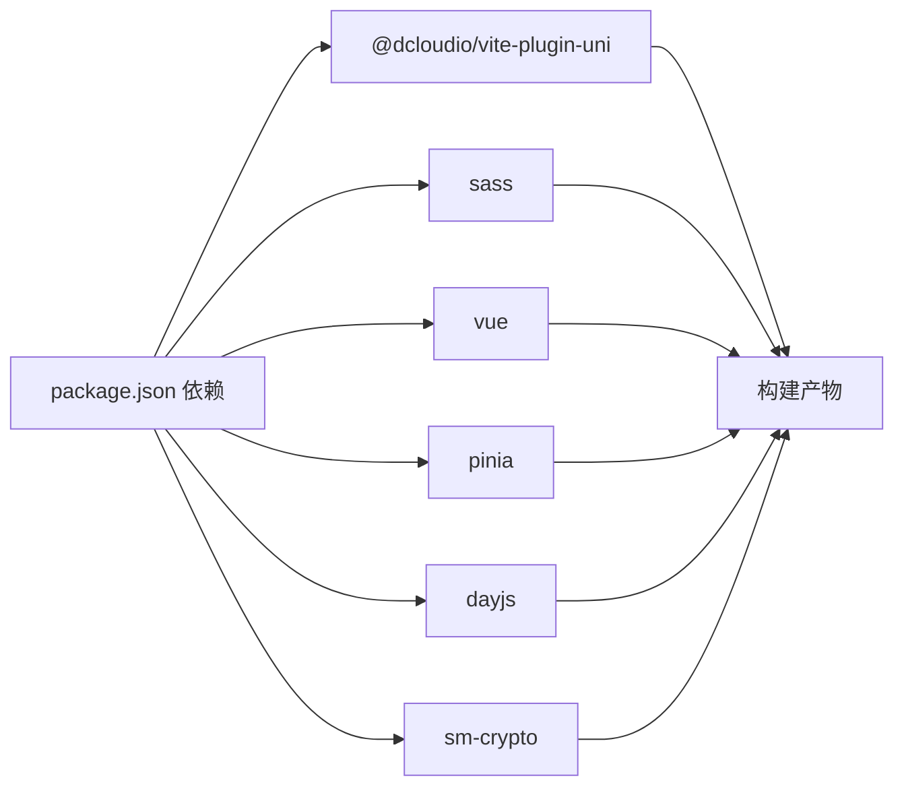

# 资源文件优化

<cite>
**本文引用的文件**
- [vite.config.ts](file://class_times_record/vite.config.ts)
- [package.json](file://class_times_record/package.json)
- [manifest.json](file://class_times_record/src/manifest.json)
- [pages.json](file://class_times_record/src/pages.json)
- [App.vue](file://class_times_record/src/App.vue)
- [main.ts](file://class_times_record/src/main.ts)
- [_index.scss](file://class_times_record/src/static/scss/_index.scss)
- [_index.scss（变量）](file://class_times_record/src/static/scss/variables/_index.scss)
</cite>

## 目录
1. [简介](#简介)
2. [项目结构](#项目结构)
3. [核心组件](#核心组件)
4. [架构总览](#架构总览)
5. [详细组件分析](#详细组件分析)
6. [依赖分析](#依赖分析)
7. [性能考虑](#性能考虑)
8. [故障排查指南](#故障排查指南)
9. [结论](#结论)
10. [附录](#附录)

## 简介
本文件面向小程序端（以微信小程序为主）的资源文件优化，覆盖图片、CSS/JS、字体与图标、分包加载、构建分析与体积优化、开发/生产差异化配置、CDN 与缓存策略，以及监控与性能分析工具的使用。文档结合仓库现有配置与工程实践，给出可落地的方案与示例路径，帮助在保持功能完整性的前提下显著降低首包体积、提升加载与渲染性能。

## 项目结构
本项目基于 uni-app + Vite 构建，目标平台包含微信小程序等。关键资源与构建相关位置如下：
- 构建与预处理：Vite 插件与 SCSS 全局注入
- 小程序配置：manifest.json（打包与平台特性）、pages.json（路由与分包）
- 应用入口：main.ts 初始化 Pinia、全局混入等
- 样式系统：SCSS 变量集中管理并通过 Vite 注入
- 静态资源：logo.png、default-share.png 等

图表来源
- [vite.config.ts:1-30](file://class_times_record/vite.config.ts#L1-L30)
- [manifest.json:50-64](file://class_times_record/src/manifest.json#L50-L64)
- [pages.json:33-395](file://class_times_record/src/pages.json#L33-L395)
- [main.ts:1-25](file://class_times_record/src/main.ts#L1-L25)
- [App.vue:1-18](file://class_times_record/src/App.vue#L1-L18)

章节来源
- [vite.config.ts:1-30](file://class_times_record/vite.config.ts#L1-L30)
- [package.json:1-82](file://class_times_record/package.json#L1-L82)
- [manifest.json:1-79](file://class_times_record/src/manifest.json#L1-L79)
- [pages.json:1-415](file://class_times_record/src/pages.json#L1-L415)
- [main.ts:1-25](file://class_times_record/src/main.ts#L1-L25)
- [App.vue:1-18](file://class_times_record/src/App.vue#L1-L18)

## 核心组件
- 构建与预处理
  - Vite 插件启用 uni-app 构建能力；别名 @ 指向 src；define 注入 globalThis；SCSS 通过 additionalData 注入全局变量与主题入口，避免 uni-app 别名解析问题。
- 小程序平台配置
  - manifest.json 中 mp-weixin 的 setting.minified 开启代码压缩；optimization.subPackages 开启分包优化；ignoreUploadUnusedFiles 控制上传未使用文件行为。
- 路由与分包
  - pages.json 定义主包首页与登录页，将大量业务页面按角色/模块划分到 subPackages，满足小程序主包体积限制并实现按需加载。
- 应用初始化
  - main.ts 创建 SSR 应用、注册 Pinia、挂载全局属性与混入；App.vue 提供生命周期钩子与公共样式占位。
- 样式系统
  - SCSS 变量集中存放于 variables/_index.scss，_index.scss 作为统一入口被 Vite 注入至所有样式文件。

章节来源
- [vite.config.ts:5-28](file://class_times_record/vite.config.ts#L5-L28)
- [manifest.json:50-64](file://class_times_record/src/manifest.json#L50-L64)
- [pages.json:3-395](file://class_times_record/src/pages.json#L3-L395)
- [main.ts:9-23](file://class_times_record/src/main.ts#L9-L23)
- [App.vue:1-18](file://class_times_record/src/App.vue#L1-L18)
- [_index.scss:1-2](file://class_times_record/src/static/scss/_index.scss#L1-L2)
- [_index.scss（变量）:1-8](file://class_times_record/src/static/scss/variables/_index.scss#L1-L8)

## 架构总览
下图展示从源码到小程序产物的关键流程，突出资源处理与分包加载的关键节点。

图表来源
- [package.json:22-37](file://class_times_record/package.json#L22-L37)
- [vite.config.ts:1-14](file://class_times_record/vite.config.ts#L1-L14)
- [manifest.json:50-64](file://class_times_record/src/manifest.json#L50-L64)
- [pages.json:33-395](file://class_times_record/src/pages.json#L33-L395)

## 详细组件分析

### 图片资源优化
- 格式选择
  - 照片类优先 WebP（体积小、兼容性好），透明背景或简单图形优先 SVG（矢量无损）。
  - 若需兼容旧环境，可提供 PNG/JPG 降级方案。
- 尺寸适配
  - 根据容器尺寸产出多倍图（1x/2x/3x），或使用 rpx 自适应布局减少大图下载。
  - 列表/缩略图使用较小尺寸，详情页再加载高清原图。
- 压缩策略
  - 有损压缩用于照片（质量 70%-85%），无损压缩用于图标/插画。
  - 批量处理建议：svgo（SVG）、tinypng/jpegtran/mozjpeg（位图）、webp 转换。
- 懒加载与预加载
  - 首屏以上图片使用 loading 占位，滚动进入视口时再加载。
  - 关键首屏图片可 preconnect 或 preload。
- 雪碧图与图标
  - 小图标合并为雪碧图减少请求数；动态图标建议使用 SVG 或字体图标。
- 静态资源 CDN 与缓存
  - 将 logo.png、default-share.png 等静态资源部署到 CDN，开启强缓存（长 max-age）与版本化文件名，配合 ETag/Last-Modified 做协商缓存。
  - 小程序内可通过相对路径引用，由平台自动处理；如需跨域，确保域名白名单正确。

章节来源
- [manifest.json:50-64](file://class_times_record/src/manifest.json#L50-L64)
- [package.json:22-37](file://class_times_record/package.json#L22-L37)

### CSS 与 JavaScript 压缩合并
- 压缩
  - 小程序侧已开启 minified，确保 JS/CSS 压缩生效。
  - SCSS 通过 Vite 预处理，最终输出 wxss；建议移除无用样式、提取公共样式。
- 合并
  - 小程序平台会按页面/分包组织资源，尽量复用公共样式与脚本，避免重复引入。
  - 使用 uni_modules 提供的组件按需引入，减少冗余。
- 构建期优化
  - 关闭不必要的 polyfill；按需引入第三方库；Tree-shaking 清理未使用导出。
  - 对大型库进行分片或延迟加载。

章节来源
- [manifest.json:50-64](file://class_times_record/src/manifest.json#L50-L64)
- [vite.config.ts:15-28](file://class_times_record/vite.config.ts#L15-L28)

### 字体文件优化与图标雪碧图
- 字体
  - 仅嵌入必要字形（如常用汉字集），或使用在线字体服务并按需裁剪。
  - 使用 woff2 格式以获得更小体积；设置 font-display 提升首字渲染体验。
- 图标
  - 小图标合并为雪碧图，减少 HTTP 请求；复杂图标使用 SVG。
  - 注意雪碧图定位精度与缩放失真问题。

章节来源
- [vite.config.ts:15-28](file://class_times_record/vite.config.ts#L15-L28)

### 分包加载的资源隔离与按需加载
- 分包策略
  - 主包仅保留启动页、登录页与极少量公共资源；业务页面按角色/模块拆分到 subPackages。
  - 通过 pages.json 的 subPackages 配置 root 与 pages 列表，实现按需加载。
- 资源隔离
  - 各分包独立打包，避免主包膨胀；公共样式/脚本放置主包或独立分包。
- 按需加载
  - 页面级懒加载；组件按需引入；大对象/重型逻辑延迟初始化。
- 注意事项
  - 分包数量与大小受平台限制；避免循环依赖；合理划分边界。

图表来源
- [pages.json:33-395](file://class_times_record/src/pages.json#L33-L395)
- [manifest.json:61-63](file://class_times_record/src/manifest.json#L61-L63)

章节来源
- [pages.json:33-395](file://class_times_record/src/pages.json#L33-L395)
- [manifest.json:61-63](file://class_times_record/src/manifest.json#L61-L63)

### 构建时的资源分析与体积优化
- 分析
  - 使用微信开发者工具的“性能”面板查看网络瀑布图、资源大小与耗时。
  - 使用“小程序助手”或“云开发控制台”的体积分析（如可用）了解包体构成。
- 优化
  - 去除未使用的图片/字体/样式；替换大图；启用分包。
  - 精简第三方库，避免全量引入；对大库进行异步加载。
  - 利用 Vite 的 alias 与 define 减少运行时开销。

章节来源
- [package.json:22-37](file://class_times_record/package.json#L22-L37)
- [vite.config.ts:5-14](file://class_times_record/vite.config.ts#L5-L14)

### 开发环境与生产环境的差异化配置
- 开发
  - dev:mp-weixin 命令快速启动并打开微信开发者工具，便于热更新与调试。
  - 可开启 source map（视平台支持）辅助定位问题。
- 生产
  - build:mp-weixin 输出压缩后的产物；manifest.json 中 minified 确保代码压缩。
  - 静态资源走 CDN，开启强缓存与版本化命名。
- 环境变量
  - 通过 define 注入全局常量，区分 API 地址、开关等。

章节来源
- [package.json:16-37](file://class_times_record/package.json#L16-L37)
- [manifest.json:50-64](file://class_times_record/src/manifest.json#L50-L64)
- [vite.config.ts:12-14](file://class_times_record/vite.config.ts#L12-L14)

### 静态资源的 CDN 加速与缓存策略
- CDN 部署
  - 将 logo.png、default-share.png 等静态资源上传至 CDN，并在小程序中通过相对路径或绝对 URL 引用。
- 缓存策略
  - 静态资源：Cache-Control: public, max-age=31536000, immutable；文件名带 hash 实现版本化。
  - 动态接口：短缓存或无缓存，配合 ETag/Last-Modified。
- 安全与白名单
  - 确保域名在小程序后台配置合法，避免跨域拦截。

章节来源
- [manifest.json:50-64](file://class_times_record/src/manifest.json#L50-L64)

### 资源监控与性能分析工具
- 微信开发者工具
  - 使用“性能”面板查看网络、渲染、内存；“小程序助手”查看包体结构与依赖。
- 自定义埋点
  - 在 App.vue 生命周期记录关键时间点（onLaunch/onShow），上报至后端或统计平台。
- 指标建议
  - 首屏时间、主包体积、分包体积、图片体积占比、HTTP 请求数、缓存命中率。

章节来源
- [App.vue:4-12](file://class_times_record/src/App.vue#L4-L12)
- [package.json:16-37](file://class_times_record/package.json#L16-L37)

## 依赖分析
- 构建依赖
  - @dcloudio/vite-plugin-uni 提供 uni-app 构建能力；sass 负责 SCSS 编译。
- 运行依赖
  - vue、pinia、vue-i18n 等；dayjs、sm-crypto 等业务库按需引入。
- 平台依赖
  - 针对 mp-weixin 等平台的多端包，构建时按需生成对应产物。

图表来源
- [package.json:42-80](file://class_times_record/package.json#L42-L80)
- [vite.config.ts:1-6](file://class_times_record/vite.config.ts#L1-L6)

章节来源
- [package.json:42-80](file://class_times_record/package.json#L42-L80)
- [vite.config.ts:1-6](file://class_times_record/vite.config.ts#L1-L6)

## 性能考虑
- 首屏优化
  - 主包最小化，关键资源预加载；首屏图片懒加载与占位。
- 网络优化
  - 合并请求、启用 gzip/br（服务端/CDN）；合理使用缓存。
- 渲染优化
  - 减少重排重绘；避免超大 DOM；合理使用分包与懒加载。
- 体积优化
  - 图片压缩与格式升级；移除未使用代码；按需引入第三方库。

[本节为通用指导，不直接分析具体文件]

## 故障排查指南
- 未使用文件上传问题
  - manifest.json 中 ignoreUploadUnusedFiles/ignoreDevUnusedFiles 控制上传行为，必要时关闭以避免 vendor 缺失关联文件。
- 分包未生效
  - 确认 pages.json 的 subPackages 配置正确；检查根路径与页面路径；确保 optimization.subPackages 开启。
- 样式变量未生效
  - 检查 Vite 的 SCSS additionalData 注入路径是否正确；确保 _index.scss 与 variables/_index.scss 存在并被引用。
- 构建失败或路径错误
  - 检查 resolve.alias 与 path.resolve 生成的绝对路径；避免 Windows 路径分隔符导致的解析异常。

章节来源
- [manifest.json:50-64](file://class_times_record/src/manifest.json#L50-L64)
- [pages.json:33-395](file://class_times_record/src/pages.json#L33-L395)
- [vite.config.ts:15-28](file://class_times_record/vite.config.ts#L15-L28)

## 结论
通过合理的图片优化、CSS/JS 压缩与合并、字体与图标治理、分包加载、构建分析与差异化配置，可以显著降低小程序首包体积与首屏时间。结合 CDN 与缓存策略、完善的监控与性能分析工具，可在持续迭代中保持稳定的用户体验。

[本节为总结性内容，不直接分析具体文件]

## 附录
- 配置文件示例路径
  - 构建与预处理：[vite.config.ts](file://class_times_record/vite.config.ts)
  - 小程序平台配置：[manifest.json](file://class_times_record/src/manifest.json)
  - 路由与分包：[pages.json](file://class_times_record/src/pages.json)
  - 应用入口：[main.ts](file://class_times_record/src/main.ts)、[App.vue](file://class_times_record/src/App.vue)
  - 样式变量：[_index.scss](file://class_times_record/src/static/scss/_index.scss)、[_index.scss（变量）](file://class_times_record/src/static/scss/variables/_index.scss)
  - 构建脚本：[package.json](file://class_times_record/package.json)

[本节为索引性内容，不直接分析具体文件]