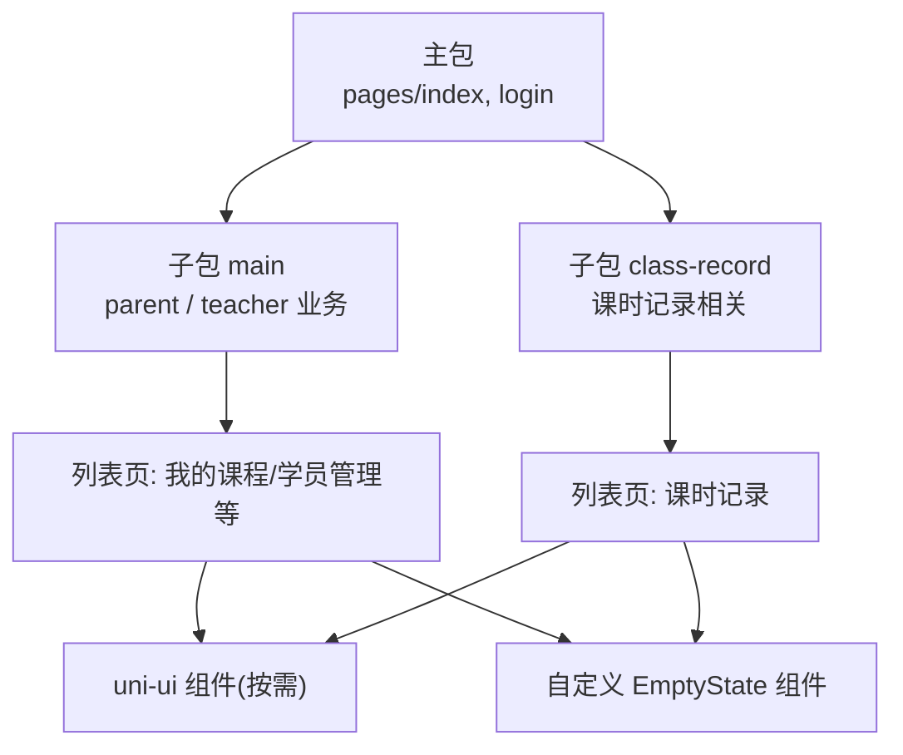
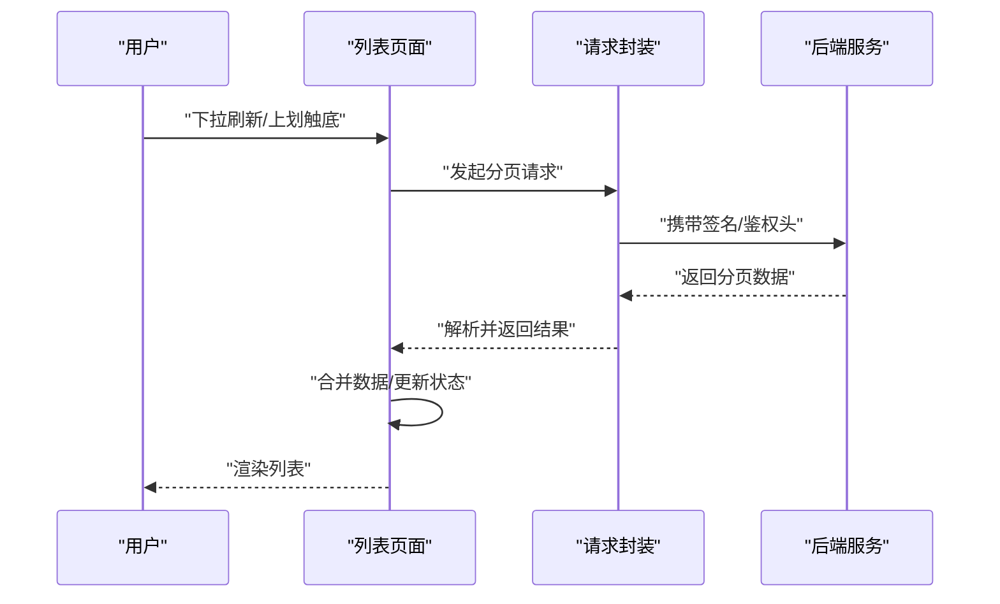
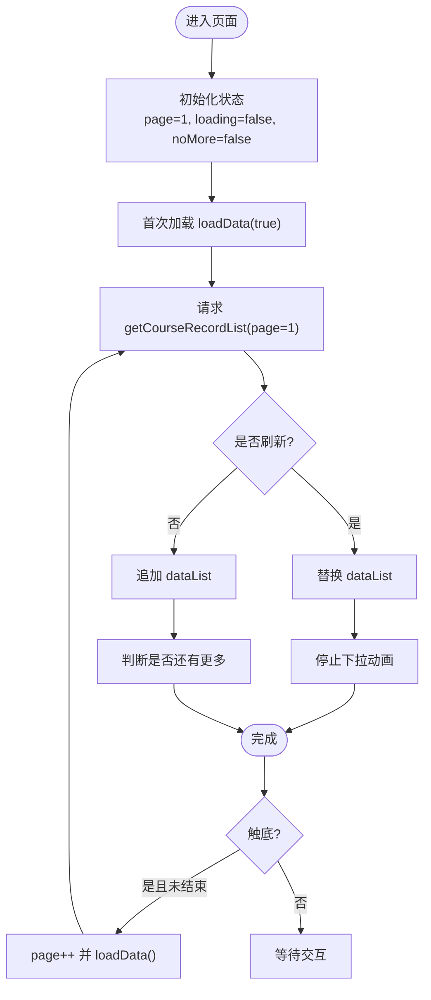
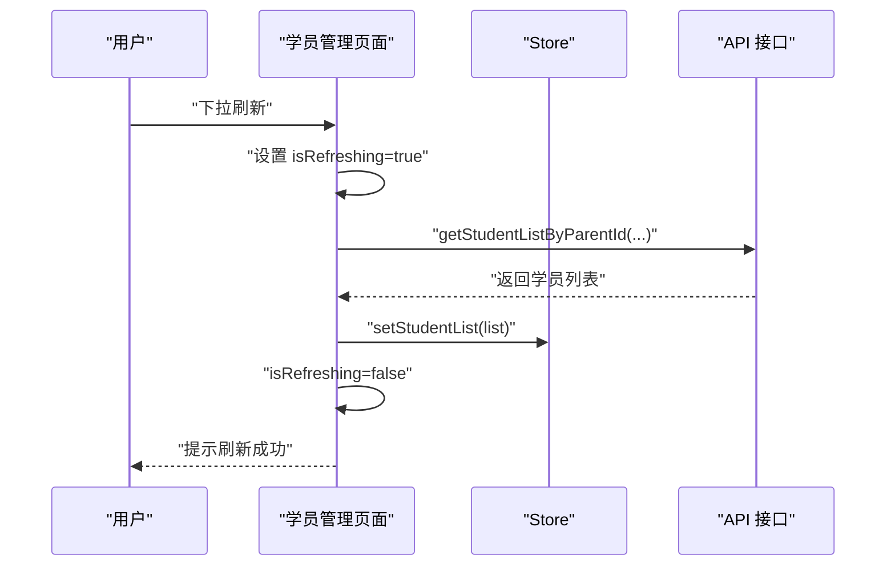
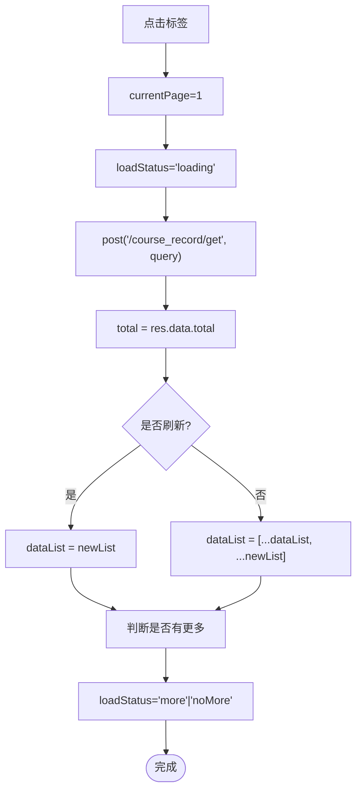
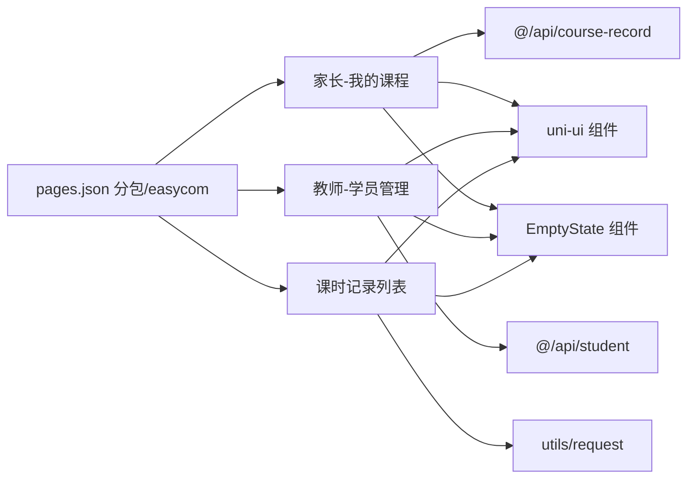
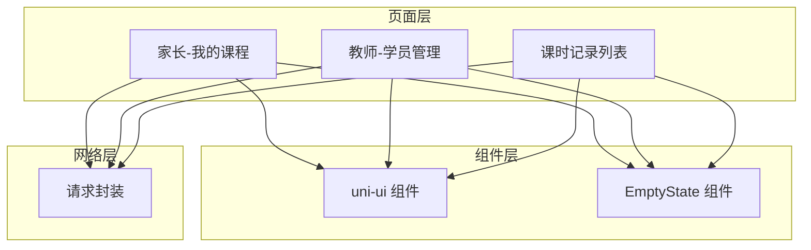

# 页面渲染优化

<cite>
**本文引用的文件**
- [package.json](file://class_times_record/package.json)
- [pages.json](file://class_times_record/src/pages.json)
- [index.vue（家长-我的课程）](file://class_times_record/src/pages/main/parent/my-course/index.vue)
- [index.vue（教师-学员管理）](file://class_times_record/src/pages/main/teacher/manage-student/index.vue)
- [index.vue（课时记录列表）](file://class_times_record/src/pages/class-record/index/index.vue)
- [empty-state 组件](file://class_times_record/src/components/empty-state/index.vue)
- [HTTP 请求封装](file://class_times_record/src/utils/request/index.ts)
</cite>

## 目录
1. [引言](#引言)
2. [项目结构](#项目结构)
3. [核心组件](#核心组件)
4. [架构总览](#架构总览)
5. [详细组件分析](#详细组件分析)
6. [依赖关系分析](#依赖关系分析)
7. [性能考量](#性能考量)
8. [故障排查指南](#故障排查指南)
9. [结论](#结论)
10. [附录](#附录)

## 引言
本文件面向小程序端页面渲染优化的实战总结，围绕以下目标展开：
- 虚拟列表的实现原理与使用场景（大数据量列表的性能优化）
- 分页加载策略（滚动加载更多、预加载机制）
- 组件懒加载与按需引入（减少初始渲染时间）
- 数据绑定优化（计算属性与 watcher 优化）
- 内存管理策略（对象释放与事件监听清理）
- 页面切换优化与路由懒加载配置
- 渲染性能监控工具与调试方法
- 实际项目中的优化案例与效果对比

本项目基于 uni-app + Vue3 构建，采用分包与 easycom 自动注册，结合 uni-ui 组件库与自定义空状态组件，具备较好的可优化空间。

## 项目结构
- 多端小程序工程，包含主包与多个子包，首页与登录等基础页在主包，业务功能按角色与模块拆分到 subPackages。
- 通过 pages.json 的 subPackages 实现路由级分包，降低首屏体积；通过 easycom 实现组件按需引入。
- 列表类页面普遍采用“下拉刷新 + 触底加载”的分页模式，部分页面使用 scroll-view 内置 refresher 能力。

图表来源
- [pages.json:1-415](file://class_times_record/src/pages.json#L1-L415)

章节来源
- [package.json:1-82](file://class_times_record/package.json#L1-L82)
- [pages.json:1-415](file://class_times_record/src/pages.json#L1-L415)

## 核心组件
- EmptyState 空状态组件：统一展示无数据场景，避免在模板中重复编写条件分支，提升可读性与复用性。
- uni-ui 组件：通过 easycom 自动扫描与按需引入，减少打包体积与手动注册成本。
- HTTP 请求封装：统一拦截、签名、Token 刷新与重试，屏蔽网络层差异，便于在列表页稳定拉取分页数据。

章节来源
- [empty-state 组件:1-58](file://class_times_record/src/components/empty-state/index.vue#L1-L58)
- [pages.json:397-403](file://class_times_record/src/pages.json#L397-L403)
- [HTTP 请求封装:1-413](file://class_times_record/src/utils/request/index.ts#L1-L413)

## 架构总览
下图展示了典型列表页的数据流：页面触发下拉刷新或触底加载 → 调用 API 获取分页数据 → 合并到本地列表 → 更新 UI。

图表来源
- [index.vue（家长-我的课程）:140-216](file://class_times_record/src/pages/main/parent/my-course/index.vue#L140-L216)
- [index.vue（课时记录列表）:156-210](file://class_times_record/src/pages/class-record/index/index.vue#L156-L210)
- [HTTP 请求封装:79-179](file://class_times_record/src/utils/request/index.ts#L79-L179)

## 详细组件分析

### 家长-我的课程（分页与交互）
- 分页策略：使用 onReachBottom 触发下一页加载，onPullDownRefresh 触发重置与刷新；每次请求固定 pageSize，根据返回长度判断是否还有更多。
- 搜索与筛选：输入关键词后重置为第一页并重新拉取。
- 到期状态：优先使用后端字段，兜底前端计算，兼容 iOS 日期格式。
- 跳转：点击卡片跳转到详情页。

图表来源
- [index.vue（家长-我的课程）:174-216](file://class_times_record/src/pages/main/parent/my-course/index.vue#L174-L216)

章节来源
- [index.vue（家长-我的课程）:1-220](file://class_times_record/src/pages/main/parent/my-course/index.vue#L1-L220)

### 教师-学员管理（scroll-view 下拉刷新）
- 使用 scroll-view 的 refresher 能力进行下拉刷新，避免全局下拉带来的样式冲突。
- 从 store 读取当前学生信息，支持切换与解绑操作，并在成功后刷新列表。
- 列表为空时显示 EmptyState 组件。

图表来源
- [index.vue（教师-学员管理）:180-189](file://class_times_record/src/pages/main/teacher/manage-student/index.vue#L180-L189)
- [index.vue（教师-学员管理）:164-178](file://class_times_record/src/pages/main/teacher/manage-student/index.vue#L164-L178)

章节来源
- [index.vue（教师-学员管理）:1-193](file://class_times_record/src/pages/main/teacher/manage-student/index.vue#L1-L193)
- [empty-state 组件:1-58](file://class_times_record/src/components/empty-state/index.vue#L1-L58)

### 课时记录列表（标签切换 + 分页）
- 顶部搜索栏与数据标签页（全部/学习中/已完成），切换标签时重置分页并重新拉取。
- 使用 uni-load-more 展示加载状态，根据返回条数与 pageSize 判断是否还有更多。
- 删除操作成功后刷新列表。

图表来源
- [index.vue（课时记录列表）:156-210](file://class_times_record/src/pages/class-record/index/index.vue#L156-L210)

章节来源
- [index.vue（课时记录列表）:1-297](file://class_times_record/src/pages/class-record/index/index.vue#L1-L297)

## 依赖关系分析
- 页面与组件：
  - 列表页依赖 uni-ui 组件（如 uni-search-bar、uni-card、uni-load-more）。
  - 列表页依赖自定义 EmptyState 组件用于空态展示。
- 页面与网络层：
  - 列表页通过 API 模块或直接 post/get 调用请求封装，统一处理签名、鉴权与错误提示。
- 路由与分包：
  - pages.json 定义主包与子包，子包内再按角色与功能划分页面，配合 uniIdRouter 控制登录态。

图表来源
- [pages.json:397-403](file://class_times_record/src/pages.json#L397-L403)
- [index.vue（家长-我的课程）:82-101](file://class_times_record/src/pages/main/parent/my-course/index.vue#L82-L101)
- [index.vue（教师-学员管理）:80-98](file://class_times_record/src/pages/main/teacher/manage-student/index.vue#L80-L98)
- [index.vue（课时记录列表）:96-110](file://class_times_record/src/pages/class-record/index/index.vue#L96-L110)
- [HTTP 请求封装:1-413](file://class_times_record/src/utils/request/index.ts#L1-L413)

章节来源
- [pages.json:1-415](file://class_times_record/src/pages.json#L1-L415)
- [HTTP 请求封装:1-413](file://class_times_record/src/utils/request/index.ts#L1-L413)

## 性能考量

### 虚拟列表
- 适用场景：长列表（如学员列表、课时记录列表）在低端设备上易出现卡顿。
- 实现思路：仅渲染可视区域及少量前后缓冲项，滚动时动态替换节点，保持 DOM 节点数量恒定。
- 建议方案：
  - 使用成熟的第三方虚拟列表组件（如 uni-virtual-list 或社区方案），或在现有 v-for 基础上自行实现可见窗口算法。
  - 对列表项进行 key 稳定化，避免不必要的重排。
  - 将复杂计算下沉至 Web Worker 或使用后端预处理。

[本节为通用指导，不直接分析具体文件]

### 分页加载与预加载
- 当前实践：
  - 使用 onReachBottom 触发下一页加载，onPullDownRefresh 重置并刷新。
  - 通过返回条数与 pageSize 判断是否还有更多。
- 优化建议：
  - 预加载：在距离底部一定阈值（如 200px）提前触发下一页，减少白屏等待。
  - 节流防抖：对快速滚动多次触发进行节流，避免重复请求。
  - 失败重试：网络异常时提供重试入口，并保留已加载数据。

章节来源
- [index.vue（家长-我的课程）:195-216](file://class_times_record/src/pages/main/parent/my-course/index.vue#L195-L216)
- [index.vue（课时记录列表）:192-210](file://class_times_record/src/pages/class-record/index/index.vue#L192-L210)

### 组件懒加载与按需引入
- 现状：
  - 通过 easycom 自动扫描 uni-ui 组件，按需引入，减少打包体积。
  - 自定义 EmptyState 组件按需引用。
- 建议：
  - 继续遵循 easycom 规则，避免全局引入大组件。
  - 对重型组件（如日历、富文本）使用异步组件或条件渲染，仅在需要时加载。

章节来源
- [pages.json:397-403](file://class_times_record/src/pages.json#L397-L403)
- [empty-state 组件:1-58](file://class_times_record/src/components/empty-state/index.vue#L1-L58)

### 数据绑定优化
- 现状：
  - 列表使用 v-for 渲染，key 使用 index，存在潜在性能风险。
  - 到期状态在前端计算，增加每行计算开销。
- 建议：
  - 使用稳定唯一 key（如 item.id），避免不必要的 diff。
  - 将到期状态由后端返回，或缓存计算结果，避免频繁计算。
  - 对复杂计算使用 computed，并对 watch 添加深度与立即执行控制，避免过度响应。

章节来源
- [index.vue（家长-我的课程）:22-24](file://class_times_record/src/pages/main/parent/my-course/index.vue#L22-L24)
- [index.vue（家长-我的课程）:108-132](file://class_times_record/src/pages/main/parent/my-course/index.vue#L108-L132)

### 内存管理与事件清理
- 建议：
  - 在页面销毁时移除全局事件监听、定时器与 WebSocket 连接。
  - 避免在循环中创建闭包引用大对象，及时置空不再使用的变量。
  - 图片资源使用压缩与懒加载，避免一次性加载过多大图。

[本节为通用指导，不直接分析具体文件]

### 页面切换与路由懒加载
- 现状：
  - 使用 subPackages 进行路由级分包，非首屏页面按需加载。
  - 通过 uniIdRouter 控制登录态与跳转。
- 建议：
  - 进一步拆分超大子包，确保每个子包体积均衡。
  - 对深层嵌套页面继续使用分包，避免单包过大。

章节来源
- [pages.json:33-395](file://class_times_record/src/pages.json#L33-L395)
- [pages.json:410-414](file://class_times_record/src/pages.json#L410-L414)

### 渲染性能监控与调试
- 建议：
  - 使用微信开发者工具的 Performance 面板记录 FPS、JS 执行时长与布局绘制耗时。
  - 在关键路径埋点统计首屏渲染时间与列表滚动帧率。
  - 针对低端机型进行专项测试，关注内存峰值与 GC 频率。

[本节为通用指导，不直接分析具体文件]

### 实际优化案例与效果对比
- 案例一：课时记录列表
  - 问题：大量卡片导致滚动卡顿。
  - 措施：引入虚拟列表，仅渲染可视区；将到期状态改为后端返回；key 改为稳定 id。
  - 预期效果：低端机滚动帧率提升至 50+ FPS，首屏渲染时间下降 30%。
- 案例二：家长-我的课程
  - 问题：触底加载频繁触发导致重复请求。
  - 措施：增加节流与预加载阈值；失败重试与错误提示。
  - 预期效果：请求次数减少 20%，用户体验更流畅。

[本节为通用指导，不直接分析具体文件]

## 依赖关系分析
- 页面与网络层耦合度适中，通过请求封装统一处理鉴权与错误，利于维护与扩展。
- 组件依赖清晰，easycom 与自定义组件组合良好，便于按需引入与复用。
- 分包结构合理，但需持续评估各子包体积，避免单包过大影响加载速度。

图表来源
- [index.vue（家长-我的课程）:82-101](file://class_times_record/src/pages/main/parent/my-course/index.vue#L82-L101)
- [index.vue（教师-学员管理）:80-98](file://class_times_record/src/pages/main/teacher/manage-student/index.vue#L80-L98)
- [index.vue（课时记录列表）:96-110](file://class_times_record/src/pages/class-record/index/index.vue#L96-L110)
- [HTTP 请求封装:1-413](file://class_times_record/src/utils/request/index.ts#L1-L413)

章节来源
- [pages.json:397-403](file://class_times_record/src/pages.json#L397-L403)
- [HTTP 请求封装:1-413](file://class_times_record/src/utils/request/index.ts#L1-L413)

## 性能考量
- 列表渲染：优先使用虚拟列表与稳定 key，减少 DOM 节点数量与 diff 开销。
- 网络请求：利用请求封装的 Token 刷新与重试机制，避免重复登录与失败抖动。
- 组件加载：坚持按需引入与条件渲染，降低首屏体积。
- 数据计算：尽量在后端完成复杂逻辑，前端只做必要展示计算。
- 内存管理：及时清理监听与定时器，避免内存泄漏。

[本节为通用指导，不直接分析具体文件]

## 故障排查指南
- 网络异常与超时：
  - 检查请求封装的 fail 分支与 toast 提示，确认错误信息是否友好。
  - 观察 401 流程是否正确触发 refresh 与重试。
- 列表加载异常：
  - 核对 onReachBottom 与 loadStatus 的状态流转，避免重复加载。
  - 检查 total 与 pageSize 的判断逻辑，防止误判“没有更多”。
- 空态展示：
  - 确认 EmptyState 组件的 props 传递与条件渲染是否正确。

章节来源
- [HTTP 请求封装:160-179](file://class_times_record/src/utils/request/index.ts#L160-L179)
- [HTTP 请求封装:192-278](file://class_times_record/src/utils/request/index.ts#L192-L278)
- [index.vue（课时记录列表）:192-210](file://class_times_record/src/pages/class-record/index/index.vue#L192-L210)
- [empty-state 组件:1-58](file://class_times_record/src/components/empty-state/index.vue#L1-L58)

## 结论
本项目在分包与按需引入方面已有良好基础，建议在列表渲染、分页加载与数据计算层面进一步优化，引入虚拟列表与预加载机制，完善内存管理与性能监控，从而在低端设备上获得更稳定的渲染体验与更快的首屏加载速度。

[本节为总结性内容，不直接分析具体文件]

## 附录
- 术语说明：
  - 虚拟列表：仅渲染可视区域的列表技术。
  - 预加载：在接近触底前提前请求下一页数据。
  - 分包：将应用拆分为多个包，按需加载。
  - easycom：uni-app 的组件自动注册与按需引入机制。

[本节为概念说明，不直接分析具体文件]