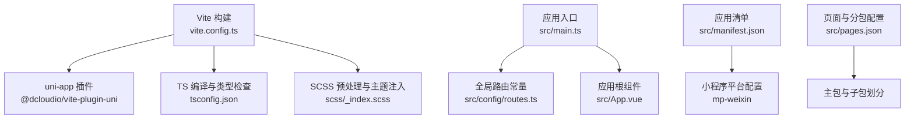
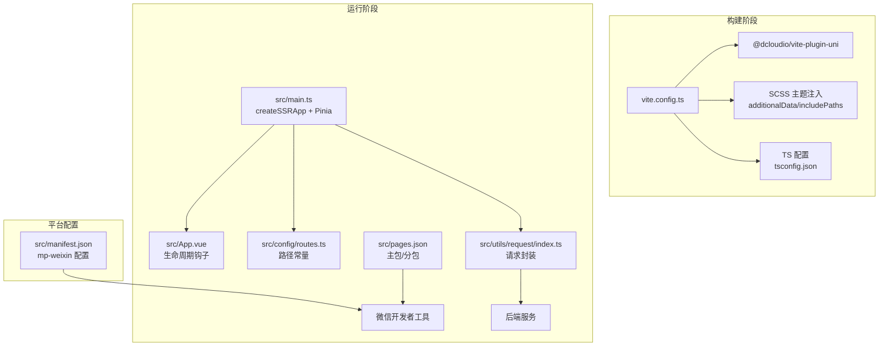
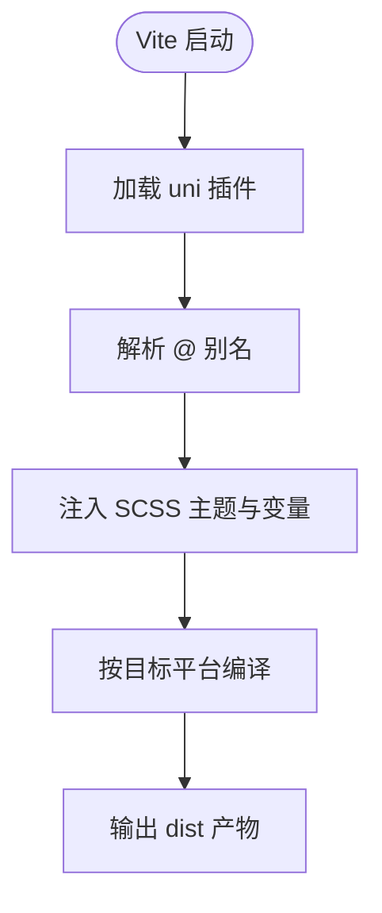
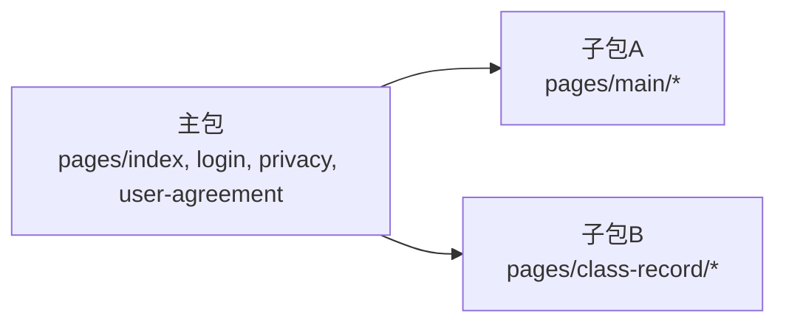
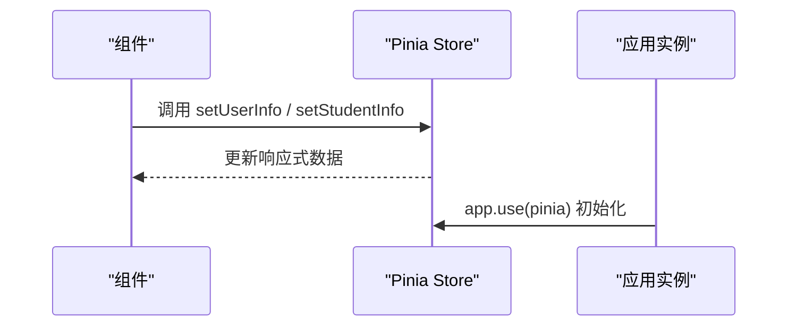
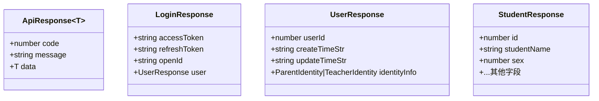
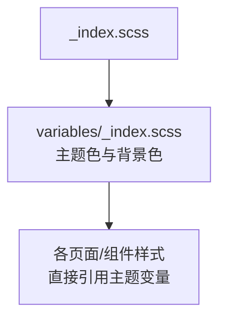
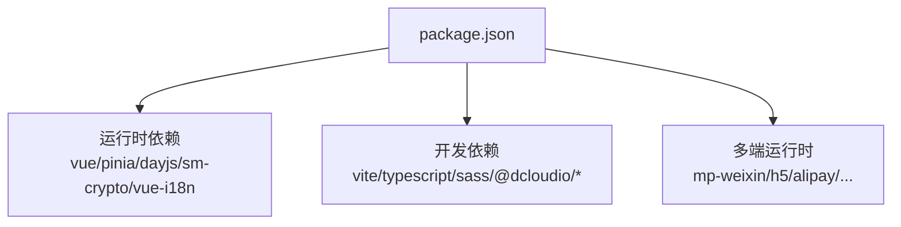
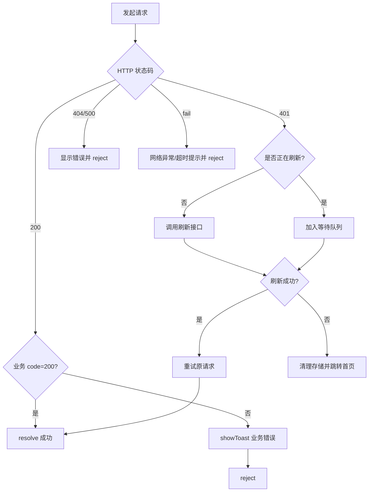

# 技术栈与配置

<cite>
**本文引用的文件**   
- [vite.config.ts](file://class_times_record/vite.config.ts)
- [package.json](file://class_times_record/package.json)
- [tsconfig.json](file://class_times_record/tsconfig.json)
- [src/main.ts](file://class_times_record/src/main.ts)
- [src/App.vue](file://class_times_record/src/App.vue)
- [src/manifest.json](file://class_times_record/src/manifest.json)
- [src/pages.json](file://class_times_record/src/pages.json)
- [src/config/routes.ts](file://class_times_record/src/config/routes.ts)
- [src/utils/request/index.ts](file://class_times_record/src/utils/request/index.ts)
- [src/static/scss/_index.scss](file://class_times_record/src/static/scss/_index.scss)
- [src/static/scss/variables/_index.scss](file://class_times_record/src/static/scss/variables/_index.scss)
- [src/types/env.d.ts](file://class_times_record/src/types/env.d.ts)
- [src/types/http.d.ts](file://class_times_record/src/types/http.d.ts)
- [src/types/user.d.ts](file://class_times_record/src/types/user.d.ts)
- [src/types/student.d.ts](file://class_times_record/src/types/student.d.ts)
</cite>

## 目录
1. [简介](#简介)
2. [项目结构](#项目结构)
3. [核心组件](#核心组件)
4. [架构总览](#架构总览)
5. [详细组件分析](#详细组件分析)
6. [依赖关系分析](#依赖关系分析)
7. [性能考虑](#性能考虑)
8. [故障排查指南](#故障排查指南)
9. [结论](#结论)
10. [附录](#附录)

## 简介
本文件聚焦微信小程序端的技术栈与工程化配置，围绕 uni-app 3.0（Vue 3 + TypeScript）的集成方案展开，详细说明 Vite 构建优化、多平台编译、分包策略、Pinia 状态管理初始化与使用模式、TypeScript 类型定义管理、SCSS 主题系统，以及开发环境搭建与调试技巧。内容均基于仓库内实际源码与配置文件进行解析，便于快速上手与持续演进。

## 项目结构
小程序端位于 class_times_record 目录，采用 uni-app 3.0 标准工程结构：
- 入口与生命周期：src/main.ts、src/App.vue
- 路由与页面：src/pages.json（含主包与分包）、src/config/routes.ts（路径常量）
- 应用清单与平台配置：src/manifest.json
- 构建与工具链：vite.config.ts、tsconfig.json、package.json
- 样式与主题：src/static/scss/_index.scss、src/static/scss/variables/_index.scss
- 类型定义：src/types/*.d.ts
- 网络请求封装：src/utils/request/index.ts

图表来源
- [vite.config.ts:1-30](file://class_times_record/vite.config.ts#L1-L30)
- [tsconfig.json:1-29](file://class_times_record/tsconfig.json#L1-L29)
- [src/main.ts:1-25](file://class_times_record/src/main.ts#L1-L25)
- [src/App.vue:1-18](file://class_times_record/src/App.vue#L1-L18)
- [src/manifest.json:1-79](file://class_times_record/src/manifest.json#L1-L79)
- [src/pages.json:1-415](file://class_times_record/src/pages.json#L1-L415)

章节来源
- [vite.config.ts:1-30](file://class_times_record/vite.config.ts#L1-L30)
- [package.json:1-82](file://class_times_record/package.json#L1-L82)
- [tsconfig.json:1-29](file://class_times_record/tsconfig.json#L1-L29)
- [src/main.ts:1-25](file://class_times_record/src/main.ts#L1-L25)
- [src/App.vue:1-18](file://class_times_record/src/App.vue#L1-L18)
- [src/manifest.json:1-79](file://class_times_record/src/manifest.json#L1-L79)
- [src/pages.json:1-415](file://class_times_record/src/pages.json#L1-L415)

## 核心组件
- 应用启动与全局挂载
  - 通过 createSSRApp 创建应用实例，注册 Pinia，并挂载全局属性与混入。
  - 参考路径：[src/main.ts:1-25](file://class_times_record/src/main.ts#L1-L25)
- 应用生命周期
  - 在 App.vue 中监听 onLaunch/onShow/onHide，用于全局日志或初始化逻辑。
  - 参考路径：[src/App.vue:1-18](file://class_times_record/src/App.vue#L1-L18)
- 路由与页面组织
  - pages.json 定义主包与分包；routes.ts 提供统一的路径常量，避免硬编码。
  - 参考路径：[src/pages.json:1-415](file://class_times_record/src/pages.json#L1-L415)、[src/config/routes.ts:1-65](file://class_times_record/src/config/routes.ts#L1-L65)
- 网络请求封装
  - 统一拦截、签名头、Token 自动刷新与重试、错误提示等。
  - 参考路径：[src/utils/request/index.ts:1-413](file://class_times_record/src/utils/request/index.ts#L1-L413)
- 状态管理（Pinia）
  - 用户与学生模块示例，展示 ref 状态与方法封装。
  - 参考路径：[src/stores/user.ts:1-28](file://class_times_record/src/stores/user.ts#L1-L28)、[src/stores/student.ts:1-49](file://class_times_record/src/stores/student.ts#L1-L49)

章节来源
- [src/main.ts:1-25](file://class_times_record/src/main.ts#L1-L25)
- [src/App.vue:1-18](file://class_times_record/src/App.vue#L1-L18)
- [src/pages.json:1-415](file://class_times_record/src/pages.json#L1-L415)
- [src/config/routes.ts:1-65](file://class_times_record/src/config/routes.ts#L1-L65)
- [src/utils/request/index.ts:1-413](file://class_times_record/src/utils/request/index.ts#L1-L413)
- [src/stores/user.ts:1-28](file://class_times_record/src/stores/user.ts#L1-L28)
- [src/stores/student.ts:1-49](file://class_times_record/src/stores/student.ts#L1-L49)

## 架构总览
下图展示了从 Vite 构建到小程序运行的关键链路，包括 uni-app 插件、SCSS 主题注入、路由与分包、Pinia 初始化与网络层封装。

图表来源
- [vite.config.ts:1-30](file://class_times_record/vite.config.ts#L1-L30)
- [tsconfig.json:1-29](file://class_times_record/tsconfig.json#L1-L29)
- [src/main.ts:1-25](file://class_times_record/src/main.ts#L1-L25)
- [src/App.vue:1-18](file://class_times_record/src/App.vue#L1-L18)
- [src/pages.json:1-415](file://class_times_record/src/pages.json#L1-L415)
- [src/manifest.json:1-79](file://class_times_record/src/manifest.json#L1-L79)
- [src/utils/request/index.ts:1-413](file://class_times_record/src/utils/request/index.ts#L1-L413)

## 详细组件分析

### uni-app 3.0 与 Vue 3 + TypeScript 集成
- 框架与运行时
  - 使用 @dcloudio/uni-app 3.0 alpha 版本，配套 vite 插件与多端运行时。
  - 参考路径：[package.json:42-80](file://class_times_record/package.json#L42-L80)
- 应用初始化
  - 通过 createSSRApp 创建应用，注册 Pinia，挂载全局属性与混入。
  - 参考路径：[src/main.ts:1-25](file://class_times_record/src/main.ts#L1-L25)
- 生命周期与全局样式
  - App.vue 中使用 onLaunch/onShow/onHide 钩子；全局样式可通过 SCSS 注入。
  - 参考路径：[src/App.vue:1-18](file://class_times_record/src/App.vue#L1-L18)

章节来源
- [package.json:42-80](file://class_times_record/package.json#L42-L80)
- [src/main.ts:1-25](file://class_times_record/src/main.ts#L1-L25)
- [src/App.vue:1-18](file://class_times_record/src/App.vue#L1-L18)

### Vite 构建工具配置与优化
- 插件与别名
  - 启用 @dcloudio/vite-plugin-uni，设置 @ 指向 src 目录。
  - 参考路径：[vite.config.ts:1-14](file://class_times_record/vite.config.ts#L1-L14)
- 全局变量注入
  - define.global = globalThis，兼容第三方库对全局对象的引用。
  - 参考路径：[vite.config.ts:12-14](file://class_times_record/vite.config.ts#L12-L14)
- SCSS 预处理器与主题系统
  - additionalData 引入主题入口，includePaths 指定基础路径，silenceDeprecations 抑制旧版 API 警告。
  - 参考路径：[vite.config.ts:15-28](file://class_times_record/vite.config.ts#L15-L28)
  - 主题入口与变量：
    - [src/static/scss/_index.scss:1-2](file://class_times_record/src/static/scss/_index.scss#L1-L2)
    - [src/static/scss/variables/_index.scss:1-8](file://class_times_record/src/static/scss/variables/_index.scss#L1-L8)
- 多平台编译脚本
  - package.json 提供 dev/build 多端命令，包含 mp-weixin、H5、支付宝、百度等。
  - 参考路径：[package.json:4-40](file://class_times_record/package.json#L4-L40)

图表来源
- [vite.config.ts:1-30](file://class_times_record/vite.config.ts#L1-L30)
- [package.json:4-40](file://class_times_record/package.json#L4-L40)

章节来源
- [vite.config.ts:1-30](file://class_times_record/vite.config.ts#L1-L30)
- [package.json:4-40](file://class_times_record/package.json#L4-L40)

### 多平台编译与分包策略
- 多端命令
  - 通过 npm scripts 切换目标平台，如 dev:mp-weixin、build:mp-weixin。
  - 参考路径：[package.json:4-40](file://class_times_record/package.json#L4-L40)
- 分包配置
  - pages.json 中 subPackages 将教师端与家长端功能拆分至独立子包，降低主包体积。
  - 参考路径：[src/pages.json:33-395](file://class_times_record/src/pages.json#L33-L395)
- 小程序优化开关
  - manifest.json 中 mp-weixin.optimization.subPackages 开启分包优化。
  - 参考路径：[src/manifest.json:61-63](file://class_times_record/src/manifest.json#L61-L63)

图表来源
- [src/pages.json:1-415](file://class_times_record/src/pages.json#L1-L415)
- [src/manifest.json:61-63](file://class_times_record/src/manifest.json#L61-L63)

章节来源
- [package.json:4-40](file://class_times_record/package.json#L4-L40)
- [src/pages.json:1-415](file://class_times_record/src/pages.json#L1-L415)
- [src/manifest.json:61-63](file://class_times_record/src/manifest.json#L61-L63)

### Pinia 状态管理初始化与使用模式
- 初始化
  - main.ts 中 createPinia 并 app.use(pinia)，使所有组件可访问 store。
  - 参考路径：[src/main.ts:10-14](file://class_times_record/src/main.ts#L10-L14)
- 使用模式
  - 以 useUserStore/useStudentStore 为例，通过 ref 维护响应式数据，并提供 set/clear 方法。
  - 参考路径：[src/stores/user.ts:1-28](file://class_times_record/src/stores/user.ts#L1-L28)、[src/stores/student.ts:1-49](file://class_times_record/src/stores/student.ts#L1-L49)

图表来源
- [src/main.ts:10-14](file://class_times_record/src/main.ts#L10-L14)
- [src/stores/user.ts:1-28](file://class_times_record/src/stores/user.ts#L1-L28)
- [src/stores/student.ts:1-49](file://class_times_record/src/stores/student.ts#L1-L49)

章节来源
- [src/main.ts:10-14](file://class_times_record/src/main.ts#L10-L14)
- [src/stores/user.ts:1-28](file://class_times_record/src/stores/user.ts#L1-L28)
- [src/stores/student.ts:1-49](file://class_times_record/src/stores/student.ts#L1-L49)

### TypeScript 类型定义配置与管理
- 编译器选项
  - tsconfig.json 启用严格模式、ESNext 目标、Node 解析、路径别名 @/* -> src/*，并声明 types 为 @dcloudio/types 与 node。
  - 参考路径：[tsconfig.json:1-29](file://class_times_record/tsconfig.json#L1-L29)
- 业务类型
  - http.d.ts 定义 ApiResponse/LoginResponse；user.d.ts 定义用户身份联合类型；student.d.ts 定义学生相关接口与请求参数。
  - 参考路径：[src/types/http.d.ts:1-13](file://class_times_record/src/types/http.d.ts#L1-L13)、[src/types/user.d.ts:1-28](file://class_times_record/src/types/user.d.ts#L1-L28)、[src/types/student.d.ts:1-112](file://class_times_record/src/types/student.d.ts#L1-L112)
- 第三方库类型补充
  - env.d.ts 为 sm-crypto 添加模块声明，解决 TS 识别问题。
  - 参考路径：[src/types/env.d.ts:1-6](file://class_times_record/src/types/env.d.ts#L1-L6)

图表来源
- [src/types/http.d.ts:1-13](file://class_times_record/src/types/http.d.ts#L1-L13)
- [src/types/user.d.ts:1-28](file://class_times_record/src/types/user.d.ts#L1-L28)
- [src/types/student.d.ts:1-112](file://class_times_record/src/types/student.d.ts#L1-L112)

章节来源
- [tsconfig.json:1-29](file://class_times_record/tsconfig.json#L1-L29)
- [src/types/http.d.ts:1-13](file://class_times_record/src/types/http.d.ts#L1-L13)
- [src/types/user.d.ts:1-28](file://class_times_record/src/types/user.d.ts#L1-L28)
- [src/types/student.d.ts:1-112](file://class_times_record/src/types/student.d.ts#L1-L112)
- [src/types/env.d.ts:1-6](file://class_times_record/src/types/env.d.ts#L1-L6)

### SCSS 样式预处理与主题系统
- 主题入口与变量
  - _index.scss 通过 @forward 聚合 variables/_index.scss，集中管理主题色与背景色。
  - 参考路径：[src/static/scss/_index.scss:1-2](file://class_times_record/src/static/scss/_index.scss#L1-L2)、[src/static/scss/variables/_index.scss:1-8](file://class_times_record/src/static/scss/variables/_index.scss#L1-L8)
- Vite 注入策略
  - additionalData 引入主题入口，includePaths 指定基础路径，silenceDeprecations 抑制旧版颜色函数警告。
  - 参考路径：[vite.config.ts:15-28](file://class_times_record/vite.config.ts#L15-L28)

图表来源
- [src/static/scss/_index.scss:1-2](file://class_times_record/src/static/scss/_index.scss#L1-L2)
- [src/static/scss/variables/_index.scss:1-8](file://class_times_record/src/static/scss/variables/_index.scss#L1-L8)
- [vite.config.ts:15-28](file://class_times_record/vite.config.ts#L15-L28)

章节来源
- [src/static/scss/_index.scss:1-2](file://class_times_record/src/static/scss/_index.scss#L1-L2)
- [src/static/scss/variables/_index.scss:1-8](file://class_times_record/src/static/scss/variables/_index.scss#L1-L8)
- [vite.config.ts:15-28](file://class_times_record/vite.config.ts#L15-L28)

### 开发环境搭建与调试技巧
- 安装依赖
  - 在项目根目录执行 pnpm install 或 npm install。
  - 参考路径：[package.json:1-82](file://class_times_record/package.json#L1-L82)
- 启动与预览
  - 微信小程序：dev:mp-weixin 会自动打开本地微信开发者工具并指向 dist/dev/mp-weixin。
  - 参考路径：[package.json:16-17](file://class_times_record/package.json#L16-L17)
- 热重载与调试
  - 使用微信开发者工具的“热重载”与“断点调试”，结合 console.log 与 Pinia 状态查看。
  - 参考路径：[src/App.vue:4-12](file://class_times_record/src/App.vue#L4-L12)
- 发布与 CI
  - publish:mp-weixin 脚本可用于自动化上传与发布流程。
  - 参考路径：[package.json:39](file://class_times_record/package.json#L39)

章节来源
- [package.json:16-17](file://class_times_record/package.json#L16-L17)
- [package.json:39](file://class_times_record/package.json#L39)
- [src/App.vue:4-12](file://class_times_record/src/App.vue#L4-L12)

## 依赖关系分析
- 运行时依赖
  - vue 3.x、pinia、dayjs、sm-crypto、vue-i18n 等。
  - 参考路径：[package.json:42-66](file://class_times_record/package.json#L42-L66)
- 构建与开发依赖
  - vite 5.2.8、typescript 5.3.3、sass、@dcloudio/vite-plugin-uni、@dcloudio/types 等。
  - 参考路径：[package.json:67-80](file://class_times_record/package.json#L67-L80)
- 多端运行时
  - uni-mp-weixin、uni-h5、uni-mp-alipay 等多端运行时包保持版本一致。
  - 参考路径：[package.json:43-58](file://class_times_record/package.json#L43-L58)

图表来源
- [package.json:42-80](file://class_times_record/package.json#L42-L80)

章节来源
- [package.json:42-80](file://class_times_record/package.json#L42-L80)

## 性能考虑
- 分包优化
  - 通过 pages.json 的 subPackages 与 manifest.json 的 optimization.subPackages 提升首屏加载速度。
  - 参考路径：[src/pages.json:33-395](file://class_times_record/src/pages.json#L33-L395)、[src/manifest.json:61-63](file://class_times_record/src/manifest.json#L61-L63)
- 代码压缩与 ES6 转译
  - mp-weixin setting.minified 与 es6 开启，减少包体并提升兼容性。
  - 参考路径：[src/manifest.json:52-59](file://class_times_record/src/manifest.json#L52-L59)
- 资源忽略
  - ignoreUploadUnusedFiles/ignoreDevUnusedFiles 避免未使用文件导致打包异常。
  - 参考路径：[src/manifest.json:53-54](file://class_times_record/src/manifest.json#L53-L54)
- 构建优化建议
  - 按需引入组件与工具函数，避免全量引入；合理使用懒加载与图片压缩。
  - 参考路径：[vite.config.ts:1-30](file://class_times_record/vite.config.ts#L1-L30)

章节来源
- [src/pages.json:33-395](file://class_times_record/src/pages.json#L33-L395)
- [src/manifest.json:52-59](file://class_times_record/src/manifest.json#L52-L59)
- [vite.config.ts:1-30](file://class_times_record/vite.config.ts#L1-L30)

## 故障排查指南
- Token 过期与自动刷新
  - 当返回 401 时，封装层会尝试使用 refreshToken 刷新并自动重试；若刷新失败则跳转首页。
  - 参考路径：[src/utils/request/index.ts:192-278](file://class_times_record/src/utils/request/index.ts#L192-L278)
- 网络异常与超时
  - fail 回调中区分 timeout 并给出友好提示；complete 中隐藏 loading。
  - 参考路径：[src/utils/request/index.ts:160-174](file://class_times_record/src/utils/request/index.ts#L160-L174)
- 业务错误处理
  - 根据 code 与 message 显示 toast 并 reject Promise，便于上层统一处理。
  - 参考路径：[src/utils/request/index.ts:114-158](file://class_times_record/src/utils/request/index.ts#L114-L158)
- 登录态清理与重定向
  - 刷新接口本身返回 401 或无 refreshToken 时，清理本地存储并重定向到首页。
  - 参考路径：[src/utils/request/index.ts:202-211](file://class_times_record/src/utils/request/index.ts#L202-L211)

图表来源
- [src/utils/request/index.ts:114-174](file://class_times_record/src/utils/request/index.ts#L114-L174)
- [src/utils/request/index.ts:192-278](file://class_times_record/src/utils/request/index.ts#L192-L278)

章节来源
- [src/utils/request/index.ts:114-174](file://class_times_record/src/utils/request/index.ts#L114-L174)
- [src/utils/request/index.ts:192-278](file://class_times_record/src/utils/request/index.ts#L192-L278)

## 结论
本项目基于 uni-app 3.0 与 Vue 3 + TypeScript 构建了高可维护的小程序前端工程。通过 Vite 插件与 SCSS 主题注入实现高效构建与统一视觉规范；利用 pages.json 与 manifest.json 的分包与优化配置显著提升性能；Pinia 提供清晰的状态管理模式；TypeScript 类型体系完善，覆盖业务与第三方库；网络层封装具备完善的鉴权与错误处理机制。整体工程化程度较高，适合持续迭代与团队协作。

## 附录
- 环境变量与域名切换
  - request/index.ts 根据 NODE_ENV 选择 baseUrl，便于开发与生产环境切换。
  - 参考路径：[src/utils/request/index.ts:7-22](file://class_times_record/src/utils/request/index.ts#L7-L22)
- 路由常量与类型导出
  - routes.ts 导出 PagePath 类型，确保路径使用的类型安全。
  - 参考路径：[src/config/routes.ts:62-65](file://class_times_record/src/config/routes.ts#L62-L65)

章节来源
- [src/utils/request/index.ts:7-22](file://class_times_record/src/utils/request/index.ts#L7-L22)
- [src/config/routes.ts:62-65](file://class_times_record/src/config/routes.ts#L62-L65)