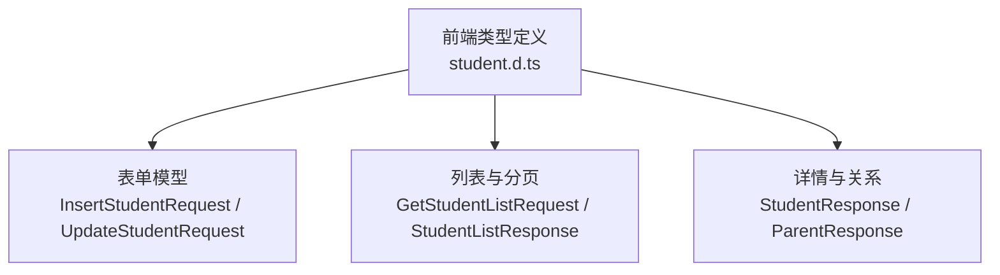
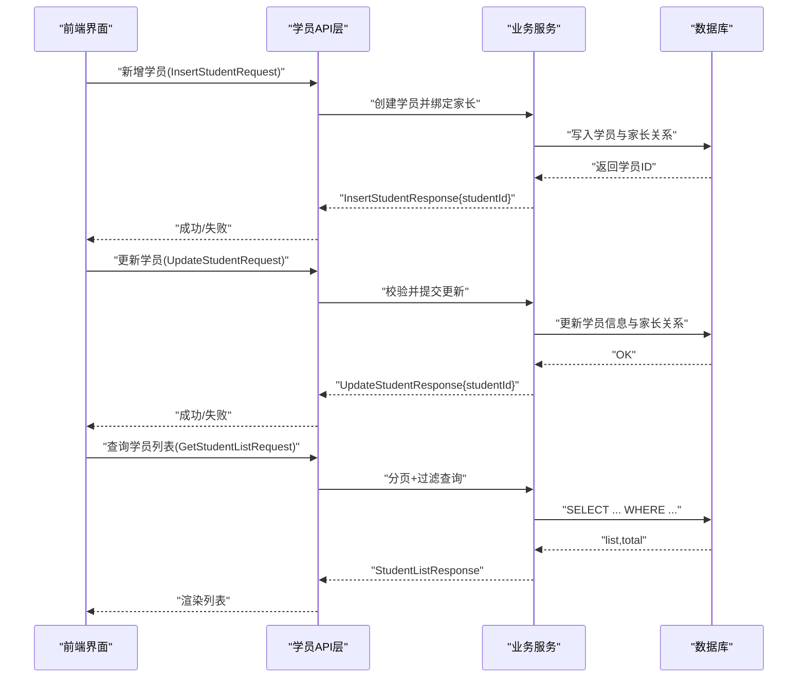
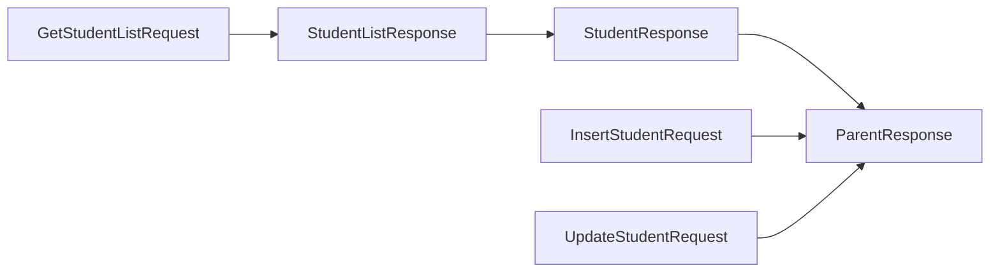

# 学员管理

<cite>
**本文引用的文件**   
- [student.d.ts](file://class_times_record/src/types/student.d.ts)
</cite>

## 目录
1. [简介](#简介)
2. [项目结构](#项目结构)
3. [核心组件](#核心组件)
4. [架构总览](#架构总览)
5. [详细组件分析](#详细组件分析)
6. [依赖分析](#依赖分析)
7. [性能考虑](#性能考虑)
8. [故障排查指南](#故障排查指南)
9. [结论](#结论)
10. [附录](#附录)

## 简介
本章节面向“学员管理”功能，围绕学员的完整生命周期进行说明，包括：
- 新增学员：基本信息录入、家长绑定（一对一/多对一）
- 编辑学员：个人资料修改、联系方式更新
- 删除学员：软删除机制与关联数据处理策略
- 数据验证：必填字段、格式校验、业务约束
- 列表查询：分页、搜索过滤
- 状态管理与数据同步：前端状态、缓存与一致性

为保证准确性，本文所有实现细节均基于仓库中已存在的类型定义进行推导与说明。

## 项目结构
从现有代码可见，学员相关的前端类型集中在以下文件中：
- class_times_record/src/types/student.d.ts：定义了学员请求/响应模型、分页参数、筛选条件等

该文件为学员模块的核心契约来源，前后端交互的数据结构均以该类型为基准。

图表来源
- [student.d.ts:1-112](file://class_times_record/src/types/student.d.ts#L1-L112)

章节来源
- [student.d.ts:1-112](file://class_times_record/src/types/student.d.ts#L1-L112)

## 核心组件
本节聚焦学员管理的核心数据结构与职责边界，帮助快速理解增删改查与关系绑定的数据契约。

- 学员实体与展示信息
  - 包含基础信息（姓名、性别、生日、学校、地址）、头像、机构集合、主/副家长对象、课时统计、时间戳等
- 列表与分页
  - 支持按范围（scope/targetId）、性别、是否已排课、关键词等多维筛选
  - 统一分页参数 currentPage/pageSize，返回 list 与 total
- 新增学员
  - 必填字段：学员姓名、所属机构、性别、出生日期、学校、地址
  - 家长绑定：可携带 primaryParent 与 secondaryParent 对象
- 更新学员
  - 支持头像、姓名、性别、生日、学校、地址、主/副家长的更新
  - 提供两种提交模型：带 birthStr 的通用模型与将 birthStr 转换为 birth 的提交模型
- 查询接口
  - 按家长ID、教师ID、机构ID、课程ID、班级ID等多种维度获取学员列表
  - 支持关键字模糊匹配、性别与是否已排课筛选

章节来源
- [student.d.ts:1-112](file://class_times_record/src/types/student.d.ts#L1-L112)

## 架构总览
下图展示了学员管理在前后端交互中的关键数据流与角色分工。前端通过统一的请求模型发起操作，后端根据 scope/targetId 等上下文定位资源并执行相应逻辑。

图表来源
- [student.d.ts:1-112](file://class_times_record/src/types/student.d.ts#L1-L112)

## 详细组件分析

### 新增学员（基本信息录入、家长绑定）
- 输入模型
  - InsertStudentRequest：包含学员姓名、机构ID、性别、出生日期、学校、地址，以及 primaryParent 与 secondaryParent 两个家长对象
- 输出模型
  - InsertStudentResponse：返回 studentId
- 业务流程要点
  - 必填字段校验：学员姓名、机构ID、性别、出生日期、学校、地址
  - 家长绑定：支持同时设置主/副家长；若仅需一对一绑定，可将另一侧置空或忽略
  - 事务性：建议在同一事务内完成学员创建与家长关系建立，保证一致性
- 典型调用示例（以类型为准）
  - 请求体参考：InsertStudentRequest
  - 响应体参考：InsertStudentResponse

章节来源
- [student.d.ts:82-95](file://class_times_record/src/types/student.d.ts#L82-L95)

### 编辑学员（个人资料修改、联系方式更新）
- 输入模型
  - UpdateStudentRequest：支持更新头像、姓名、性别、生日（birthStr）、学校、地址、主/副家长
  - SubmitUpdateStudentRequest：将 birthStr 转换为 birth 后再提交
- 输出模型
  - UpdateStudentResponse：返回 studentId
- 业务流程要点
  - 字段可选更新：仅提交需要变更的字段
  - 日期格式转换：前端使用 birthStr 便于展示与选择，提交时转为 birth
  - 家长关系更新：可替换主/副家长，或解除绑定（传 null）
- 典型调用示例（以类型为准）
  - 请求体参考：UpdateStudentRequest 或 SubmitUpdateStudentRequest
  - 响应体参考：UpdateStudentResponse

章节来源
- [student.d.ts:97-111](file://class_times_record/src/types/student.d.ts#L97-L111)

### 删除学员（软删除机制、关联数据处理）
- 现状说明
  - 当前类型定义未显式提供删除接口模型；建议在业务层采用软删除策略
- 推荐策略
  - 软删除：为学员表增加 is_deleted 标记，避免物理删除导致历史数据丢失
  - 关联处理：
    - 家长关系：保留但标记失效，或迁移至“历史绑定”表
    - 课程/班级记录：保持不可变，确保审计与报表正确
- 注意事项
  - 列表查询需默认过滤已删除学员
  - 恢复功能可按需扩展

[本节为概念性说明，不直接分析具体文件，故无章节来源]

### 数据验证规则（必填字段、格式校验、业务约束）
- 必填字段
  - 新增：学员姓名、机构ID、性别、出生日期、学校、地址
  - 更新：至少包含 id 与一个待更新字段
- 格式校验
  - 出生日期：建议使用标准字符串格式（如 YYYY-MM-DD），并在提交前由前端统一转换
  - 手机号/邮箱：若后续扩展至联系方式字段，应遵循正则校验
- 业务约束
  - 机构归属：学员必须属于某一机构
  - 家长绑定：主/副家长可为空，但若存在则需确保家长有效且未被禁用
  - 唯一性：同一机构下学员姓名可重复，但建议结合学号/身份证号做唯一性校验（如需）

章节来源
- [student.d.ts:82-111](file://class_times_record/src/types/student.d.ts#L82-L111)

### 学员与家长绑定关系管理（一对一、多对一）
- 关系模型
  - StudentResponse 中包含 primaryParent 与 secondaryParent 两个家长对象
- 场景说明
  - 一对一绑定：仅设置 primaryParent，secondaryParent 为空
  - 多对一绑定：多个学员可绑定同一家长（primaryParent 或 secondaryParent 指向同一 parent）
- 更新策略
  - 支持替换主/副家长，或解除绑定（传 null）
  - 建议记录变更日志，便于追溯

章节来源
- [student.d.ts:1-17](file://class_times_record/src/types/student.d.ts#L1-L17)
- [student.d.ts:97-111](file://class_times_record/src/types/student.d.ts#L97-L111)

### 学员列表展示（分页查询、搜索过滤）
- 查询入口
  - GetStudentListRequest：通过 scope/targetId 指定查询范围，支持 sex、hasClass、keyword 等筛选
  - 其他专用入口：按家长ID、教师ID、机构ID、课程ID、班级ID分别获取
- 分页参数
  - currentPage、pageSize
- 返回结构
  - StudentListResponse：包含 list 与 total
- 搜索过滤
  - keyword：用于模糊匹配（如姓名、学校等）
  - sex：按性别筛选
  - hasClass：是否已排课筛选

章节来源
- [student.d.ts:43-51](file://class_times_record/src/types/student.d.ts#L43-L51)
- [student.d.ts:65-68](file://class_times_record/src/types/student.d.ts#L65-L68)
- [student.d.ts:19-41](file://class_times_record/src/types/student.d.ts#L19-L41)
- [student.d.ts:70-80](file://class_times_record/src/types/student.d.ts#L70-L80)

### 状态管理与数据同步机制
- 前端状态
  - 列表页：维护 currentPage、pageSize、筛选条件与结果集
  - 详情页：维护学员详情与主/副家长信息
- 缓存策略
  - 列表结果可按 scope/targetId + 筛选条件作为缓存键
  - 详情数据可在用户离开页面后清理，避免脏读
- 一致性保障
  - 增删改成功后主动刷新列表或局部更新
  - 冲突处理：当并发更新时，优先采用乐观锁或提示用户重试

[本节为通用实践说明，不直接分析具体文件，故无章节来源]

## 依赖分析
学员类型定义是前后端契约的基础，直接影响表单、列表、详情等页面的实现。其依赖关系如下：

图表来源
- [student.d.ts:1-112](file://class_times_record/src/types/student.d.ts#L1-L112)

章节来源
- [student.d.ts:1-112](file://class_times_record/src/types/student.d.ts#L1-L112)

## 性能考虑
- 分页与索引
  - 列表查询务必使用分页，避免一次性拉取大量数据
  - 针对常用筛选字段（如 institutionId、sex、hasClass、keyword）建立合适索引
- 批量操作
  - 批量导入学员时，采用分批提交与事务控制，降低锁竞争
- 缓存
  - 热点数据（如机构下拉、家长列表）可短期缓存
- 网络优化
  - 合并请求、按需加载详情，减少首屏压力

[本节为通用指导，不直接分析具体文件，故无章节来源]

## 故障排查指南
- 常见错误
  - 必填字段缺失：检查 InsertStudentRequest/UpdateStudentRequest 必填项
  - 日期格式错误：确认 birthStr/birth 的格式一致
  - 家长无效：确保 primaryParent/secondaryParent 指向有效的家长记录
- 定位方法
  - 查看请求体是否符合类型定义
  - 核对 scope/targetId 是否正确传递
  - 检查分页参数是否越界或过大
- 恢复建议
  - 软删除误删：通过恢复接口或后台工具恢复标记
  - 家长关系异常：重新绑定或清理历史绑定记录

[本节为通用指导，不直接分析具体文件，故无章节来源]

## 结论
学员管理模块以清晰的类型契约为基础，覆盖新增、编辑、查询等核心流程，并通过灵活的筛选与分页能力支撑复杂业务场景。建议在生产环境中完善软删除、权限控制与审计日志，进一步提升系统的健壮性与可维护性。

[本节为总结性内容，不直接分析具体文件，故无章节来源]

## 附录
- 术语
  - 主家长（primaryParent）：学员的主要联系人
  - 副家长（secondaryParent）：学员的次要联系人
  - 范围（scope/targetId）：用于限定查询范围的上下文标识
- 参考路径
  - 类型定义：class_times_record/src/types/student.d.ts

[本节为补充信息，不直接分析具体文件，故无章节来源]