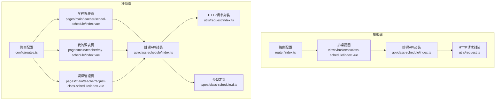
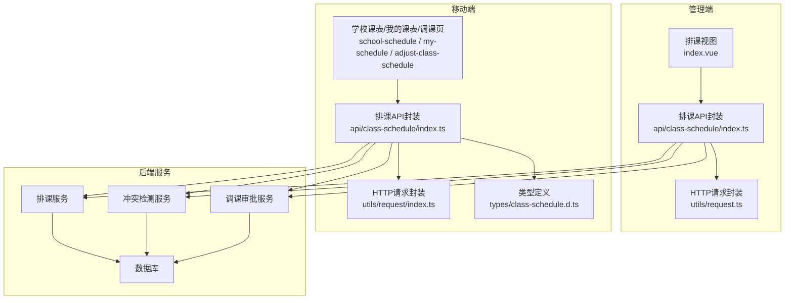
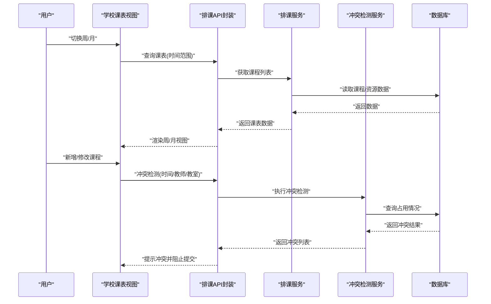
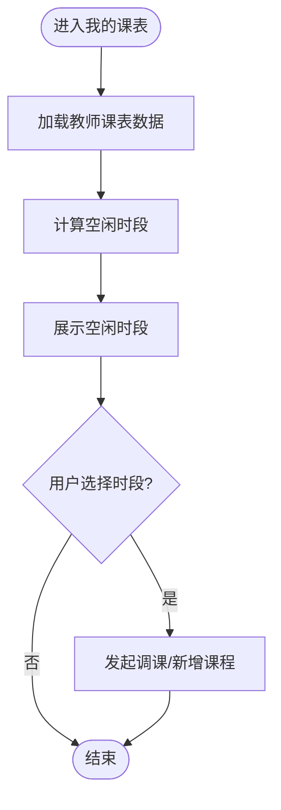
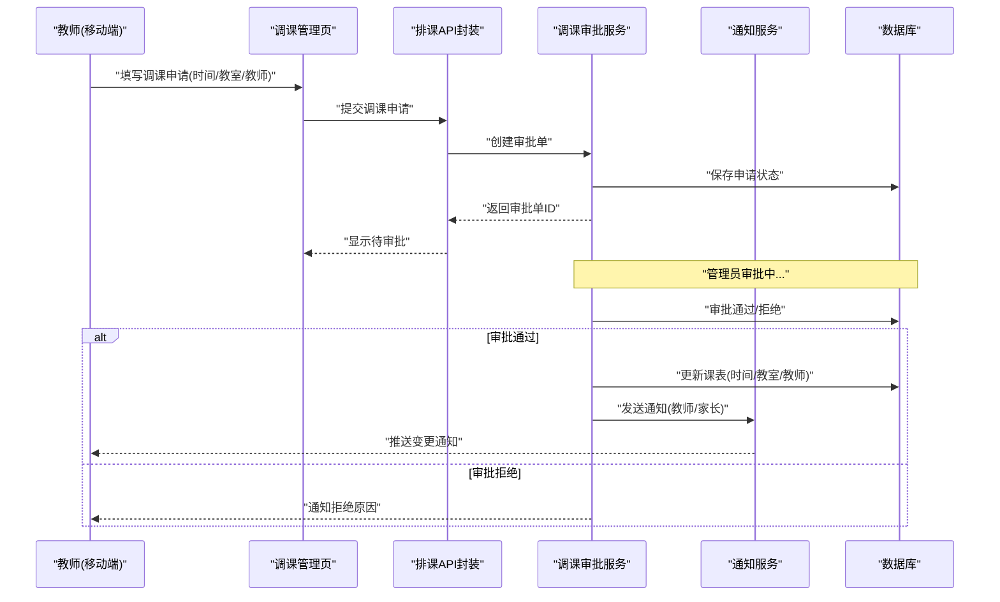
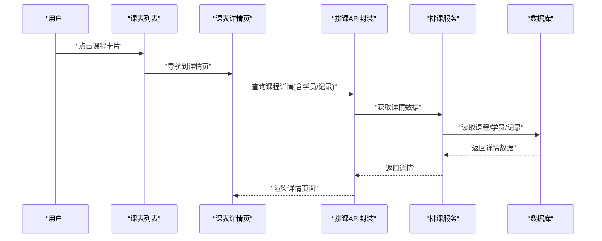
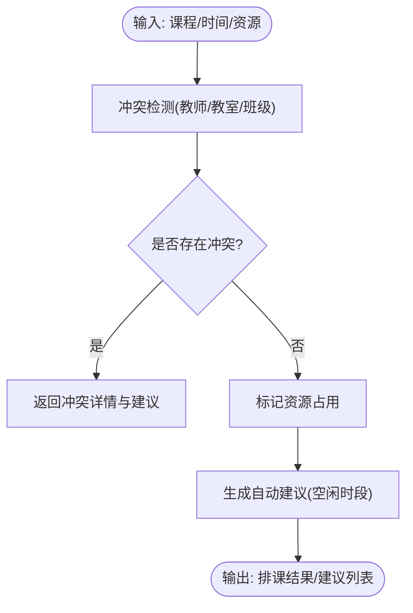
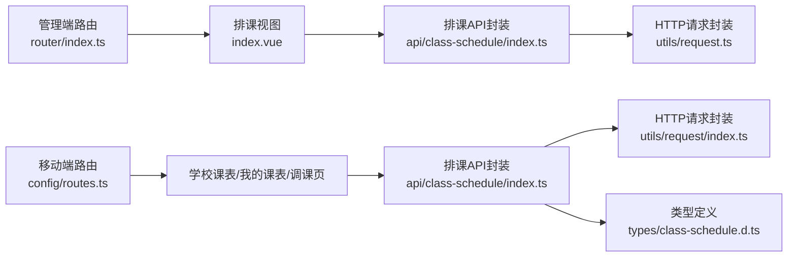

# 排课管理

<cite>
**本文引用的文件**   
- [class_record_admin_front/src/api/class-schedule/index.ts](file://class_record_admin_front/src/api/class-schedule/index.ts)
- [class_record_admin_front/src/views/business/class-schedule/index.vue](file://class_record_admin_front/src/views/business/class-schedule/index.vue)
- [class_times_record/src/api/class-schedule/index.ts](file://class_times_record/src/api/class-schedule/index.ts)
- [class_times_record/src/pages/main/teacher/school-schedule/index.vue](file://class_times_record/src/pages/main/teacher/school-schedule/index.vue)
- [class_times_record/src/pages/main/teacher/my-schedule/index.vue](file://class_times_record/src/pages/main/teacher/my-schedule/index.vue)
- [class_times_record/src/pages/main/teacher/adjust-class-schedule/index.vue](file://class_times_record/src/pages/main/teacher/adjust-class-schedule/index.vue)
- [class_times_record/src/types/class-schedule.d.ts](file://class_times_record/src/types/class-schedule.d.ts)
- [class_record_admin_front/src/router/index.ts](file://class_record_admin_front/src/router/index.ts)
- [class_times_record/src/config/routes.ts](file://class_times_record/src/config/routes.ts)
- [class_record_admin_front/src/utils/request.ts](file://class_record_admin_front/src/utils/request.ts)
- [class_times_record/src/utils/request/index.ts](file://class_times_record/src/utils/request/index.ts)
- [class_record_admin_front/package.json](file://class_record_admin_front/package.json)
- [class_times_record/package.json](file://class_times_record/package.json)
</cite>

## 目录
1. [简介](#简介)
2. [项目结构](#项目结构)
3. [核心组件](#核心组件)
4. [架构总览](#架构总览)
5. [详细组件分析](#详细组件分析)
6. [依赖分析](#依赖分析)
7. [性能考虑](#性能考虑)
8. [故障排查指南](#故障排查指南)
9. [结论](#结论)
10. [附录](#附录)

## 简介
本文件围绕“排课管理”功能，系统化梳理学校课表查看、个人课表管理、调课管理等关键模块，并给出排课算法逻辑（冲突检测、资源占用检查、自动建议）、调课业务流程（申请、审批、通知）与课表详情页面能力说明。同时提供面向前端的API接口清单（查询、调整、冲突检测），以及缓存策略与性能优化方案，帮助读者快速理解与落地使用。

## 项目结构
本项目包含两个前端应用：
- 管理端（Vue + Vite）：用于机构管理员进行课程、班级、教师、排课等综合管理。
- 移动端（uni-app）：面向教师与家长，提供学校课表、个人课表、调课申请等功能。

图表来源
- [class_record_admin_front/src/router/index.ts](file://class_record_admin_front/src/router/index.ts)
- [class_record_admin_front/src/views/business/class-schedule/index.vue](file://class_record_admin_front/src/views/business/class-schedule/index.vue)
- [class_record_admin_front/src/api/class-schedule/index.ts](file://class_record_admin_front/src/api/class-schedule/index.ts)
- [class_record_admin_front/src/utils/request.ts](file://class_record_admin_front/src/utils/request.ts)
- [class_times_record/src/config/routes.ts](file://class_times_record/src/config/routes.ts)
- [class_times_record/src/pages/main/teacher/school-schedule/index.vue](file://class_times_record/src/pages/main/teacher/school-schedule/index.vue)
- [class_times_record/src/pages/main/teacher/my-schedule/index.vue](file://class_times_record/src/pages/main/teacher/my-schedule/index.vue)
- [class_times_record/src/pages/main/teacher/adjust-class-schedule/index.vue](file://class_times_record/src/pages/main/teacher/adjust-class-schedule/index.vue)
- [class_times_record/src/api/class-schedule/index.ts](file://class_times_record/src/api/class-schedule/index.ts)
- [class_times_record/src/utils/request/index.ts](file://class_times_record/src/utils/request/index.ts)
- [class_times_record/src/types/class-schedule.d.ts](file://class_times_record/src/types/class-schedule.d.ts)

章节来源
- [class_record_admin_front/src/router/index.ts](file://class_record_admin_front/src/router/index.ts)
- [class_times_record/src/config/routes.ts](file://class_times_record/src/config/routes.ts)

## 核心组件
- 学校课表查看（按周/月视图展示、课程冲突检测）
  - 管理端通过排课视图加载数据，结合时间维度渲染周/月视图；在变更或加载时调用冲突检测接口，提示潜在冲突。
  - 移动端学校课表页支持按周/月切换，展示班级/教师维度的课程块，并在冲突时高亮提示。
- 个人课表管理（教师个人时间安排、空闲时段查看）
  - 移动端我的课表页聚合教师已排课程，计算空闲时段，辅助教师选择可授课时间。
- 调课管理（课程时间调整、教室变更、教师替换）
  - 移动端调课管理页支持提交调课申请（新时间/教室/教师），后端走审批流程，完成后更新课表并推送通知。
- 课表详情页面
  - 展示课程信息、学员列表、上课记录等，支持从列表跳转至详情页查看完整信息。

章节来源
- [class_record_admin_front/src/views/business/class-schedule/index.vue](file://class_record_admin_front/src/views/business/class-schedule/index.vue)
- [class_times_record/src/pages/main/teacher/school-schedule/index.vue](file://class_times_record/src/pages/main/teacher/school-schedule/index.vue)
- [class_times_record/src/pages/main/teacher/my-schedule/index.vue](file://class_times_record/src/pages/main/teacher/my-schedule/index.vue)
- [class_times_record/src/pages/main/teacher/adjust-class-schedule/index.vue](file://class_times_record/src/pages/main/teacher/adjust-class-schedule/index.vue)

## 架构总览
前后端分离的排课系统，前端负责视图与交互，后端提供排课、冲突检测、调课审批等能力。移动端与管理端共享同一套排课领域模型与API契约。

图表来源
- [class_record_admin_front/src/views/business/class-schedule/index.vue](file://class_record_admin_front/src/views/business/class-schedule/index.vue)
- [class_record_admin_front/src/api/class-schedule/index.ts](file://class_record_admin_front/src/api/class-schedule/index.ts)
- [class_record_admin_front/src/utils/request.ts](file://class_record_admin_front/src/utils/request.ts)
- [class_times_record/src/pages/main/teacher/school-schedule/index.vue](file://class_times_record/src/pages/main/teacher/school-schedule/index.vue)
- [class_times_record/src/pages/main/teacher/my-schedule/index.vue](file://class_times_record/src/pages/main/teacher/my-schedule/index.vue)
- [class_times_record/src/pages/main/teacher/adjust-class-schedule/index.vue](file://class_times_record/src/pages/main/teacher/adjust-class-schedule/index.vue)
- [class_times_record/src/api/class-schedule/index.ts](file://class_times_record/src/api/class-schedule/index.ts)
- [class_times_record/src/utils/request/index.ts](file://class_times_record/src/utils/request/index.ts)
- [class_times_record/src/types/class-schedule.d.ts](file://class_times_record/src/types/class-schedule.d.ts)

## 详细组件分析

### 学校课表查看（周/月视图与冲突检测）
- 功能要点
  - 周/月视图切换：根据当前日期范围拉取课程数据，按时间段渲染课程块。
  - 冲突检测：在新增/修改课程时，调用冲突检测接口，返回冲突项列表，前端以高亮或弹窗提示。
  - 资源占用：检查教室、教师、班级在同一时间段的占用情况，避免重复分配。
- 交互流程
  - 用户切换周/月 → 触发查询 → 渲染视图 → 若存在冲突则提示 → 引导修正。

图表来源
- [class_times_record/src/pages/main/teacher/school-schedule/index.vue](file://class_times_record/src/pages/main/teacher/school-schedule/index.vue)
- [class_record_admin_front/src/views/business/class-schedule/index.vue](file://class_record_admin_front/src/views/business/class-schedule/index.vue)
- [class_record_admin_front/src/api/class-schedule/index.ts](file://class_record_admin_front/src/api/class-schedule/index.ts)
- [class_times_record/src/api/class-schedule/index.ts](file://class_times_record/src/api/class-schedule/index.ts)

章节来源
- [class_record_admin_front/src/views/business/class-schedule/index.vue](file://class_record_admin_front/src/views/business/class-schedule/index.vue)
- [class_times_record/src/pages/main/teacher/school-schedule/index.vue](file://class_times_record/src/pages/main/teacher/school-schedule/index.vue)
- [class_record_admin_front/src/api/class-schedule/index.ts](file://class_record_admin_front/src/api/class-schedule/index.ts)
- [class_times_record/src/api/class-schedule/index.ts](file://class_times_record/src/api/class-schedule/index.ts)

### 个人课表管理（教师个人时间与空闲时段）
- 功能要点
  - 聚合教师已排课程，按日/周展示。
  - 空闲时段计算：基于教师可用时间段与现有课程，计算可授课区间。
  - 快捷操作：从空闲时段直接发起调课或新增课程。
- 交互流程
  - 进入我的课表 → 加载教师课表 → 计算空闲时段 → 用户选择时段 → 跳转到调课或新增课程。

图表来源
- [class_times_record/src/pages/main/teacher/my-schedule/index.vue](file://class_times_record/src/pages/main/teacher/my-schedule/index.vue)
- [class_times_record/src/api/class-schedule/index.ts](file://class_times_record/src/api/class-schedule/index.ts)

章节来源
- [class_times_record/src/pages/main/teacher/my-schedule/index.vue](file://class_times_record/src/pages/main/teacher/my-schedule/index.vue)
- [class_times_record/src/api/class-schedule/index.ts](file://class_times_record/src/api/class-schedule/index.ts)

### 调课管理（申请、审批、通知）
- 功能要点
  - 调课申请：支持调整时间、教室、教师，提交后进入审批流。
  - 审批流程：管理员审核通过后生效，否则回滚或拒绝。
  - 通知推送：对受影响教师、家长发送变更通知。
- 交互流程
  - 用户在调课页填写变更 → 提交申请 → 等待审批 → 审批通过 → 更新课表 → 推送通知。

图表来源
- [class_times_record/src/pages/main/teacher/adjust-class-schedule/index.vue](file://class_times_record/src/pages/main/teacher/adjust-class-schedule/index.vue)
- [class_times_record/src/api/class-schedule/index.ts](file://class_times_record/src/api/class-schedule/index.ts)

章节来源
- [class_times_record/src/pages/main/teacher/adjust-class-schedule/index.vue](file://class_times_record/src/pages/main/teacher/adjust-class-schedule/index.vue)
- [class_times_record/src/api/class-schedule/index.ts](file://class_times_record/src/api/class-schedule/index.ts)

### 课表详情页面（课程信息、学员列表、上课记录）
- 功能要点
  - 课程基本信息：名称、教师、教室、时间、状态等。
  - 学员列表：展示报名学员及出勤状态。
  - 上课记录：历史上课记录与备注。
- 交互流程
  - 从课表列表点击课程 → 跳转详情页 → 加载课程详情与学员/记录 → 支持编辑或导出。

图表来源
- [class_record_admin_front/src/views/business/class-schedule/index.vue](file://class_record_admin_front/src/views/business/class-schedule/index.vue)
- [class_record_admin_front/src/api/class-schedule/index.ts](file://class_record_admin_front/src/api/class-schedule/index.ts)

章节来源
- [class_record_admin_front/src/views/business/class-schedule/index.vue](file://class_record_admin_front/src/views/business/class-schedule/index.vue)
- [class_record_admin_front/src/api/class-schedule/index.ts](file://class_record_admin_front/src/api/class-schedule/index.ts)

### 排课算法逻辑（冲突检测、资源占用、自动建议）
- 冲突检测
  - 输入：课程时间、教师、教室、班级。
  - 规则：同一教师/教室/班级在同一时间段仅能有一门课程；跨天/跨周边界需精确比较。
  - 输出：冲突列表（冲突对象、冲突类型、建议替代时间）。
- 资源占用检查
  - 维护资源占用索引（教师、教室、班级），在排课时快速判断可用性。
- 自动排课建议
  - 基于空闲时段与约束条件，生成候选时间段，按优先级排序推荐。

图表来源
- [class_record_admin_front/src/api/class-schedule/index.ts](file://class_record_admin_front/src/api/class-schedule/index.ts)
- [class_times_record/src/api/class-schedule/index.ts](file://class_times_record/src/api/class-schedule/index.ts)
- [class_times_record/src/types/class-schedule.d.ts](file://class_times_record/src/types/class-schedule.d.ts)

章节来源
- [class_record_admin_front/src/api/class-schedule/index.ts](file://class_record_admin_front/src/api/class-schedule/index.ts)
- [class_times_record/src/api/class-schedule/index.ts](file://class_times_record/src/api/class-schedule/index.ts)
- [class_times_record/src/types/class-schedule.d.ts](file://class_times_record/src/types/class-schedule.d.ts)

## 依赖分析
- 前端内部依赖
  - 管理端：路由 → 排课视图 → 排课API封装 → HTTP请求封装。
  - 移动端：路由 → 学校课表/我的课表/调课页 → 排课API封装 → HTTP请求封装 → 类型定义。
- 外部依赖
  - uni_modules：日历、日期选择、表格、弹窗等通用组件。
  - 包管理：package.json声明了各自的前端框架与依赖版本。

图表来源
- [class_record_admin_front/src/router/index.ts](file://class_record_admin_front/src/router/index.ts)
- [class_record_admin_front/src/views/business/class-schedule/index.vue](file://class_record_admin_front/src/views/business/class-schedule/index.vue)
- [class_record_admin_front/src/api/class-schedule/index.ts](file://class_record_admin_front/src/api/class-schedule/index.ts)
- [class_record_admin_front/src/utils/request.ts](file://class_record_admin_front/src/utils/request.ts)
- [class_times_record/src/config/routes.ts](file://class_times_record/src/config/routes.ts)
- [class_times_record/src/pages/main/teacher/school-schedule/index.vue](file://class_times_record/src/pages/main/teacher/school-schedule/index.vue)
- [class_times_record/src/pages/main/teacher/my-schedule/index.vue](file://class_times_record/src/pages/main/teacher/my-schedule/index.vue)
- [class_times_record/src/pages/main/teacher/adjust-class-schedule/index.vue](file://class_times_record/src/pages/main/teacher/adjust-class-schedule/index.vue)
- [class_times_record/src/api/class-schedule/index.ts](file://class_times_record/src/api/class-schedule/index.ts)
- [class_times_record/src/utils/request/index.ts](file://class_times_record/src/utils/request/index.ts)
- [class_times_record/src/types/class-schedule.d.ts](file://class_times_record/src/types/class-schedule.d.ts)

章节来源
- [class_record_admin_front/package.json](file://class_record_admin_front/package.json)
- [class_times_record/package.json](file://class_times_record/package.json)

## 性能考虑
- 缓存策略
  - 本地缓存：对周/月课表数据采用短期缓存（如内存或localStorage），减少重复请求。
  - 失效策略：当发生调课、新增课程、删除课程等操作时，主动清除相关时间范围的缓存。
  - 增量更新：冲突检测与资源占用检查优先使用缓存数据，必要时再请求后端校验。
- 渲染优化
  - 虚拟滚动：在课程数量较多时，采用虚拟列表渲染，降低DOM压力。
  - 分片加载：按周/月分片加载课程数据，避免一次性加载过多数据导致卡顿。
- 网络优化
  - 请求合并：将多个小请求合并为批量接口，减少往返次数。
  - 重试与退避：对失败请求实现指数退避重试，提升稳定性。
- 计算优化
  - 空闲时段计算：预计算教师可用时间段，避免每次重新遍历全部课程。
  - 冲突检测：使用索引结构（教师/教室/班级→时间段集合）加速冲突判定。

[本节为通用性能指导，不直接分析具体文件]

## 故障排查指南
- 常见问题
  - 课表数据不同步：检查是否清除了相关时间范围的缓存；确认调课审批成功后是否触发了通知与数据更新。
  - 冲突检测不准确：核对时间边界处理（跨天/跨周）；确认资源占用索引是否正确更新。
  - 视图渲染卡顿：检查是否启用虚拟滚动；评估数据量与分片加载策略。
- 定位方法
  - 前端日志：在HTTP请求封装层打印请求/响应与错误堆栈。
  - 类型校验：确保移动端类型定义与后端返回结构一致，避免运行时异常。
  - 复现步骤：记录操作步骤、时间范围、涉及资源（教师/教室/班级），便于定位问题。

章节来源
- [class_record_admin_front/src/utils/request.ts](file://class_record_admin_front/src/utils/request.ts)
- [class_times_record/src/utils/request/index.ts](file://class_times_record/src/utils/request/index.ts)
- [class_times_record/src/types/class-schedule.d.ts](file://class_times_record/src/types/class-schedule.d.ts)

## 结论
排课管理系统通过清晰的前端分层与统一的API封装，实现了学校课表查看、个人课表管理与调课管理的闭环。冲突检测与资源占用检查保障了排课的合理性，调课审批流程确保了变更的可控性与可追溯性。配合缓存与渲染优化，系统在大规模数据场景下仍具备良好的性能表现。

[本节为总结性内容，不直接分析具体文件]

## 附录

### API接口清单（前端视角）
- 查询类
  - 获取周/月课表：按时间范围返回课程列表。
  - 获取教师个人课表：按教师ID与时间范围返回课程列表。
  - 获取课程详情：返回课程信息、学员列表、上课记录。
- 调整类
  - 提交调课申请：包含原课程ID、新时间、新教室、新教师等信息。
  - 更新课程信息：支持时间、教室、教师的局部更新。
- 冲突检测类
  - 冲突检测：输入时间、教师、教室、班级，返回冲突列表与建议。
- 注意事项
  - 所有接口均通过HTTP请求封装统一处理鉴权、重试与错误。
  - 移动端与类型定义保持一致，避免字段不一致导致的解析错误。

章节来源
- [class_record_admin_front/src/api/class-schedule/index.ts](file://class_record_admin_front/src/api/class-schedule/index.ts)
- [class_times_record/src/api/class-schedule/index.ts](file://class_times_record/src/api/class-schedule/index.ts)
- [class_times_record/src/types/class-schedule.d.ts](file://class_times_record/src/types/class-schedule.d.ts)
- [class_record_admin_front/src/utils/request.ts](file://class_record_admin_front/src/utils/request.ts)
- [class_times_record/src/utils/request/index.ts](file://class_times_record/src/utils/request/index.ts)