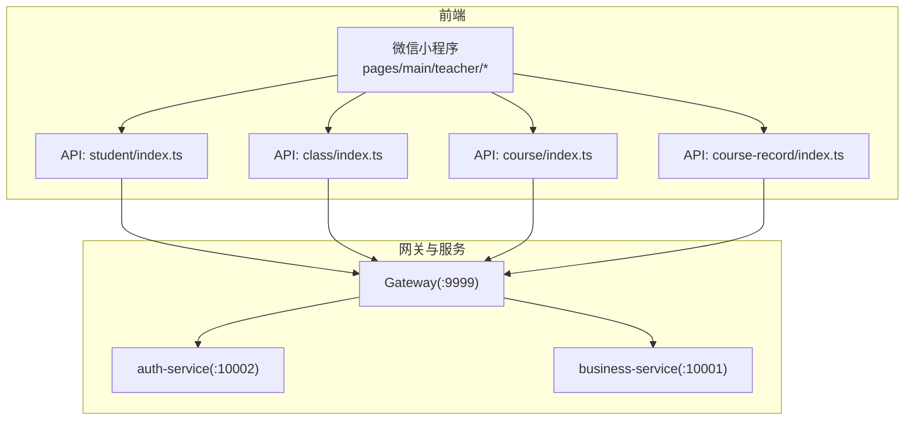
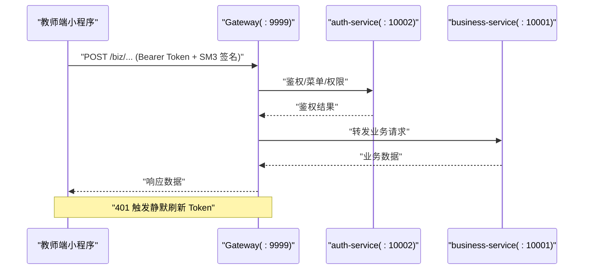
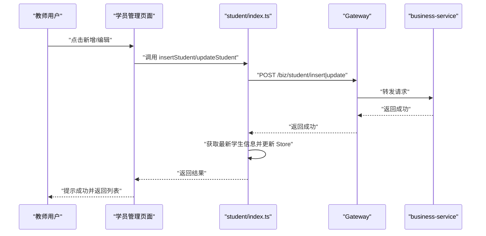
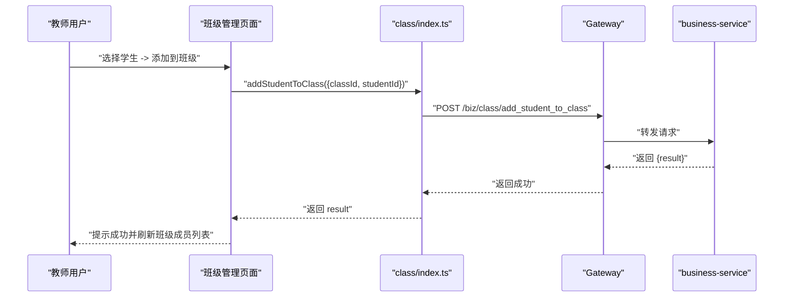
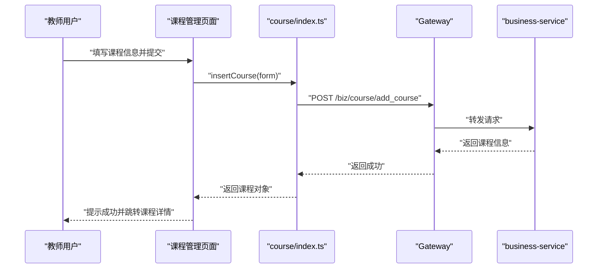
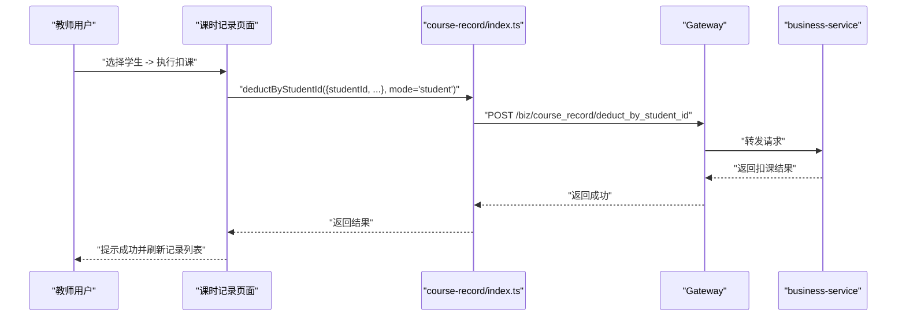
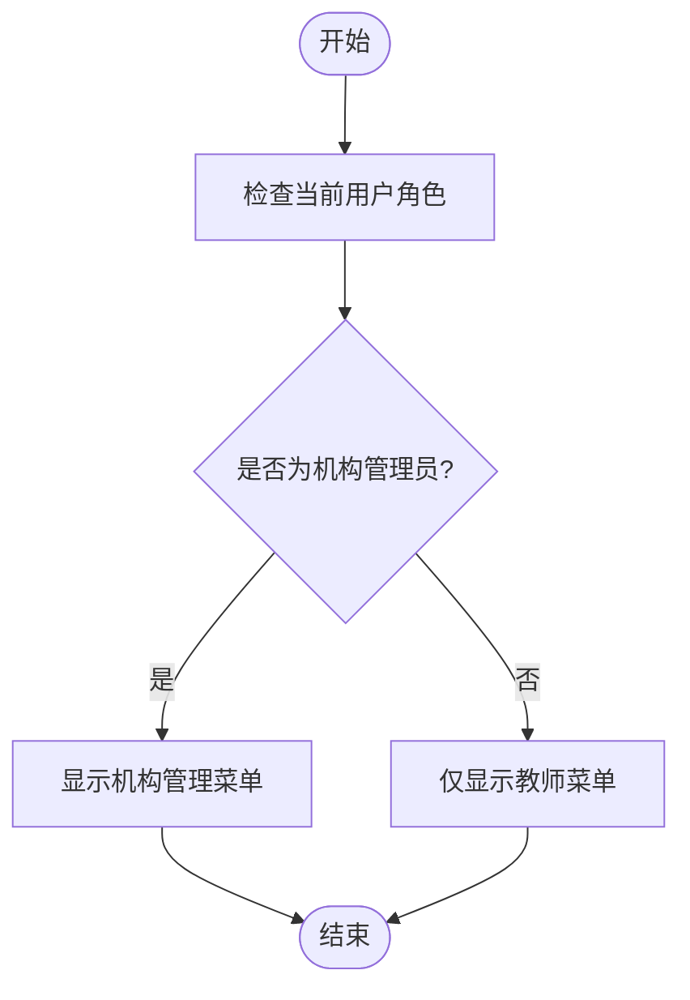
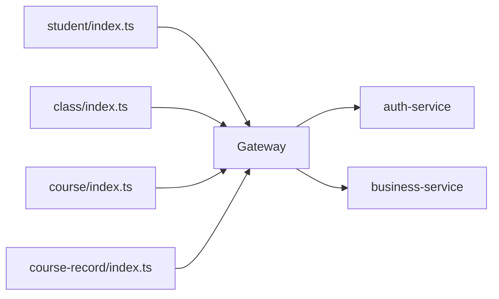

# 教师端功能模块

<cite>
**本文引用的文件**
- [CLAUDE.md](file://CLAUDE.md)
- [class_times_record/README.md](file://class_times_record/README.md)
- [class_record_admin_front/README.md](file://class_record_admin_front/README.md)
- [student/index.ts](file://class_times_record/src/api/student/index.ts)
- [class/index.ts](file://class_times_record/src/api/class/index.ts)
- [course/index.ts](file://class_times_record/src/api/course/index.ts)
- [course-record/index.ts](file://class_times_record/src/api/course-record/index.ts)
</cite>

## 目录
1. [简介](#简介)
2. [项目结构](#项目结构)
3. [核心组件](#核心组件)
4. [架构总览](#架构总览)
5. [详细组件分析](#详细组件分析)
6. [依赖分析](#依赖分析)
7. [性能考虑](#性能考虑)
8. [故障排查指南](#故障排查指南)
9. [结论](#结论)
10. [附录](#附录)

## 简介
本文件面向“教师端”角色，系统化梳理其在微信小程序端的完整能力边界与实现要点，覆盖学员管理、班级管理、课程管理、课时记录（上课记录与扣费）、排课管理等核心业务。文档同时说明权限控制模型（机构管理员身份切换与菜单权限）、关键业务流程与异常处理策略，并提供可操作的 API 调用示例与用户体验优化建议。

## 项目结构
教师端小程序位于 class_times_record 目录，采用 uni-app + Vue 3 + TypeScript 技术栈，按业务域划分 api 模块，页面集中在 pages/main/teacher 下，类型定义集中于 types 目录。后端通过 Gateway 统一路由分发至认证服务与业务服务，教师端请求需携带 Bearer Token 并附加 SM3 签名头。

图示来源
- [class_times_record/README.md](file://class_times_record/README.md)
- [student/index.ts](file://class_times_record/src/api/student/index.ts)
- [class/index.ts](file://class_times_record/src/api/class/index.ts)
- [course/index.ts](file://class_times_record/src/api/course/index.ts)
- [course-record/index.ts](file://class_times_record/src/api/course-record/index.ts)

章节来源
- [class_times_record/README.md](file://class_times_record/README.md)
- [CLAUDE.md](file://CLAUDE.md)

## 核心组件
本节聚焦教师端在小程序中的四大核心能力及其 API 封装：学员管理、班级管理、课程管理、课时记录。每个模块均提供增删改查与特定业务操作接口，并在前端进行基础参数校验与错误提示。

- 学员管理
  - 能力：按教师/机构/班级/课程维度查询学生列表；新增、更新学生信息；解绑家长与学生关系；取消微信订阅通知。
  - 关键点：各查询入口对必要 ID 做前置校验，失败时直接提示并返回空结果；更新后同步刷新本地缓存。
  - 参考路径
    - [getStudentListByTeacherId:49-63](file://class_times_record/src/api/student/index.ts#L49-L63)
    - [insertStudent:174-181](file://class_times_record/src/api/student/index.ts#L174-L181)
    - [updateStudent:188-202](file://class_times_record/src/api/student/index.ts#L188-L202)
    - [unbindStudent:210-212](file://class_times_record/src/api/student/index.ts#L210-L212)
    - [cancelStudentSubscribe:220-222](file://class_times_record/src/api/student/index.ts#L220-L222)

- 班级管理
  - 能力：按教师/机构/学生维度查询班级；新增、编辑班级；向班级添加/移除学生。
  - 关键点：scope 聚合查询简化调用方逻辑；添加/移除学生成功后返回影响标识供上层确认。
  - 参考路径
    - [getClassListByTeacherId:24-32](file://class_times_record/src/api/class/index.ts#L24-L32)
    - [addStudentToClass:79-93](file://class_times_record/src/api/class/index.ts#L79-L93)
    - [removeStudentFromClass:100-114](file://class_times_record/src/api/class/index.ts#L100-L114)
    - [insertClass:135-144](file://class_times_record/src/api/class/index.ts#L135-L144)
    - [updateClassById:151-160](file://class_times_record/src/api/class/index.ts#L151-L160)

- 课程管理
  - 能力：按机构/学生维度查询课程；新增、更新课程。
  - 关键点：新增/更新接口返回结构化响应或影响行数，便于上层反馈。
  - 参考路径
    - [getCourseByInstitutionId:9-12](file://class_times_record/src/api/course/index.ts#L9-L12)
    - [insertCourse:29-32](file://class_times_record/src/api/course/index.ts#L29-L32)
    - [updateCourse:39-42](file://class_times_record/src/api/course/index.ts#L39-L42)

- 课时记录（上课记录与扣费）
  - 能力：查询课卡记录；插入课卡记录；按学生/课程/班级维度快速扣课；更新课卡记录；查询扣费详情。
  - 关键点：扣课支持多模式（student/course/class），统一 FastDeductRequest 扩展 mode 字段；扣费详情用于家长端通知点击后的溯源。
  - 参考路径
    - [getCourseRecordList:9-17](file://class_times_record/src/api/course-record/index.ts#L9-L17)
    - [insertCourseRecord:39-52](file://class_times_record/src/api/course-record/index.ts#L39-L52)
    - [deductByStudentId:59-67](file://class_times_record/src/api/course-record/index.ts#L59-L67)
    - [deductByCourseId:74-80](file://class_times_record/src/api/course-record/index.ts#L74-L80)
    - [deductByClassId:82-88](file://class_times_record/src/api/course-record/index.ts#L82-L88)
    - [getDeductDetail:103-107](file://class_times_record/src/api/course-record/index.ts#L103-L107)

章节来源
- [student/index.ts](file://class_times_record/src/api/student/index.ts)
- [class/index.ts](file://class_times_record/src/api/class/index.ts)
- [course/index.ts](file://class_times_record/src/api/course/index.ts)
- [course-record/index.ts](file://class_times_record/src/api/course-record/index.ts)

## 架构总览
教师端小程序通过 Nginx 反向代理进入 Gateway，由 Gateway 根据路径前缀将请求分发到 auth-service 与 business-service。教师端使用 Bearer Token 认证，每次请求附带 SM3 签名头，401 自动静默刷新 Token。

图示来源
- [class_times_record/README.md](file://class_times_record/README.md)
- [CLAUDE.md](file://CLAUDE.md)

## 详细组件分析

### 学员管理（添加、编辑、删除/解绑）
- 业务目标
  - 为教师提供按自身或机构范围的学生检索、新增与编辑能力；支持解绑家长与学生关系以及取消微信订阅通知。
- 数据验证规则
  - 查询类接口对必要 ID（如 teacherId/institutionId/classId/courseId）进行非零校验，不满足则直接提示并返回空结果。
  - 新增/更新学生信息需保证必填字段完整（由后端最终校验）。
- 业务流程控制
  - 更新成功后，前端会再次拉取最新学生信息并写入本地 Store，确保后续展示一致。
- 异常处理机制
  - 前端对网络异常与业务码非 200 的情况进行统一提示；Token 过期自动刷新。
- 交互体验优化
  - 列表页支持关键词筛选与分页；更新后即时刷新缓存，避免二次请求。
- 典型流程时序

图示来源
- [student/index.ts](file://class_times_record/src/api/student/index.ts)

章节来源
- [student/index.ts](file://class_times_record/src/api/student/index.ts)

### 班级管理（创建班级、分配学员）
- 业务目标
  - 支持创建班级、编辑班级信息，并向班级添加/移除学生；支持按教师/机构维度查看班级列表。
- 数据验证规则
  - scope 聚合查询要求 targetId 有效；添加/移除学生需要 classId 与 studentId。
- 业务流程控制
  - 添加/移除学生成功后返回 result 标识，上层据此提示并刷新列表。
- 异常处理机制
  - 统一捕获网络与业务错误，给出明确提示；必要时回滚 UI 状态。
- 交互体验优化
  - 列表支持关键字过滤；批量操作提供二次确认与加载态。
- 典型流程时序

图示来源
- [class/index.ts](file://class_times_record/src/api/class/index.ts)

章节来源
- [class/index.ts](file://class_times_record/src/api/class/index.ts)

### 课程管理（课程设置、排课关联）
- 业务目标
  - 支持按机构/学生维度查询课程；新增与更新课程信息；课程与班级/排课存在关联关系（由后端维护）。
- 数据验证规则
  - 新增/更新需满足课程名称、类型等必填项；机构维度查询需 institutionId。
- 业务流程控制
  - 新增成功后返回课程对象，便于后续绑定班级或排课。
- 异常处理机制
  - 统一错误提示；重复创建场景由后端去重或返回冲突码。
- 交互体验优化
  - 课程列表支持分页与搜索；编辑页回填历史数据。
- 典型流程时序

图示来源
- [course/index.ts](file://class_times_record/src/api/course/index.ts)

章节来源
- [course/index.ts](file://class_times_record/src/api/course/index.ts)

### 课时记录（上课记录、课时扣费）
- 业务目标
  - 记录上课情况（插入课卡记录）；支持按学生/课程/班级维度快速扣课；提供扣费详情查询以支撑通知溯源。
- 数据验证规则
  - 扣课请求包含 mode 字段（student/course/class），不同模式对应不同必填参数；所有数值型参数需为正数。
- 业务流程控制
  - 扣课成功后返回结果对象，包含剩余课时等信息；家长端可通过 recordId 查询扣费详情。
- 异常处理机制
  - 余额不足、参数非法、权限不足等错误由后端返回，前端统一提示。
- 交互体验优化
  - 快速扣课提供常用模板；扣课后立即刷新列表与统计卡片。
- 典型流程时序（按学生扣课）

图示来源
- [course-record/index.ts](file://class_times_record/src/api/course-record/index.ts)

章节来源
- [course-record/index.ts](file://class_times_record/src/api/course-record/index.ts)

### 权限控制模型（机构管理员身份切换与菜单权限）
- 教师角色与机构管理员
  - 教师在系统中具有 TEACHER 角色；是否具备机构管理员能力由 c_teacher.is_institution_admin 字段标识。
  - 管理端提供接口切换教师的机构管理员身份，该能力属于 admin-service 的 teacher-auth 模块。
- 菜单权限
  - 教师端小程序菜单可见性由系统菜单配置与角色关联决定；登录成功后由认证服务返回菜单树，前端据此渲染导航。
- 身份切换流程（管理端）
  - 管理员在后台对教师账号执行“切换机构管理员身份”，后端更新 c_teacher.is_institution_admin 标志位，教师下次登录后生效。
- 相关 API 与约定
  - 管理端教师账号管理：/admin/teacher_auth/toggle_institution_admin
  - 教师端请求路径前缀：/biz/** 与 /auth/**，经 Gateway 分发。

章节来源
- [CLAUDE.md](file://CLAUDE.md)
- [class_record_admin_front/README.md](file://class_record_admin_front/README.md)

## 依赖分析
- 前端模块耦合
  - 页面层依赖各自 api 模块；api 模块之间无相互依赖，保持高内聚低耦合。
  - 全局工具 request 负责拦截器、签名、Token 刷新等横切关注点。
- 后端服务依赖
  - Gateway 统一鉴权与路由；auth-service 负责认证与菜单；business-service 承载核心业务。
- 外部依赖
  - 数据库表命名遵循 c_ 前缀；教师/家长/学生等实体关系清晰，避免跨服务重复 Mapper。

图示来源
- [class_times_record/README.md](file://class_times_record/README.md)
- [student/index.ts](file://class_times_record/src/api/student/index.ts)
- [class/index.ts](file://class_times_record/src/api/class/index.ts)
- [course/index.ts](file://class_times_record/src/api/course/index.ts)
- [course-record/index.ts](file://class_times_record/src/api/course-record/index.ts)

章节来源
- [class_times_record/README.md](file://class_times_record/README.md)
- [CLAUDE.md](file://CLAUDE.md)

## 性能考虑
- 列表分页与懒加载：学员/班级/课程/课时记录列表均采用分页查询，减少首屏压力。
- 缓存与一致性：更新学生信息后立即拉取最新数据并写入 Store，避免脏读。
- 请求合并与防抖：高频操作（如搜索）建议在前端增加防抖与节流。
- 网络重试与降级：Token 刷新失败时引导重新登录；弱网环境下提供友好提示。

## 故障排查指南
- 常见问题定位
  - 401 未授权：检查 Authorization 头与 Token 有效期；确认是否触发静默刷新。
  - 签名失败：确认 x-sign/x-timestamp/x-nonce 是否正确生成且时间戳合理。
  - 参数缺失：核对必要 ID（teacherId/institutionId/classId/courseId/studentId）是否传参正确。
  - 权限不足：确认教师是否具备相应菜单权限或机构管理员身份。
- 日志与追踪
  - 前端统一打印请求/响应摘要；后端通过操作日志与链路追踪辅助定位。
- 恢复策略
  - 网络异常：自动重试一次；超过阈值提示用户稍后再试。
  - 业务异常：根据错误码给出具体修复建议（如余额不足、重复操作等）。

章节来源
- [class_times_record/README.md](file://class_times_record/README.md)
- [CLAUDE.md](file://CLAUDE.md)

## 结论
教师端围绕“学员—班级—课程—课时记录—排课”的主线形成闭环管理能力。通过清晰的 API 分层、严格的参数校验与完善的异常处理，结合权限控制与菜单可见性，保障教师在不同角色下的安全与高效操作。建议在后续迭代中持续优化交互体验与性能表现，完善错误码体系与可观测性。

## 附录

### API 调用示例（教师端）
- 登录与刷新
  - POST /auth/auth/login_by_pwd
  - POST /auth/auth/refresh
- 学员管理
  - POST /biz/student/get_by_teacher_id
  - POST /biz/student/insert
  - POST /biz/student/update
  - POST /biz/student/unbind
  - POST /biz/student/cancel_subscribe
- 班级管理
  - POST /biz/class/get_classes_by_teacher_id
  - POST /biz/class/add_student_to_class
  - POST /biz/class/remove_student_from_class
  - POST /biz/class/insert
  - POST /biz/class/update_by_id
- 课程管理
  - POST /biz/course/get_course_by_institution_id
  - POST /biz/course/add_course
  - POST /biz/course/update_by_id
- 课时记录
  - POST /biz/course_record/new_get
  - POST /biz/course_record/insert
  - POST /biz/course_record/deduct_by_student_id
  - POST /biz/course_record/deduct_by_course_id
  - POST /biz/course_record/deduct_by_class_id
  - GET /biz/course_record/deduct-detail

章节来源
- [class_times_record/README.md](file://class_times_record/README.md)
- [student/index.ts](file://class_times_record/src/api/student/index.ts)
- [class/index.ts](file://class_times_record/src/api/class/index.ts)
- [course/index.ts](file://class_times_record/src/api/course/index.ts)
- [course-record/index.ts](file://class_times_record/src/api/course-record/index.ts)