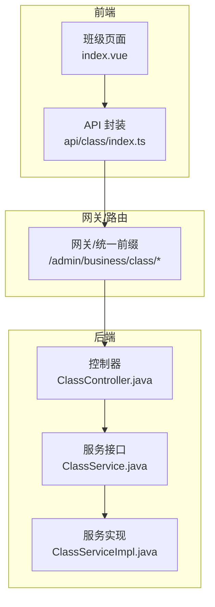
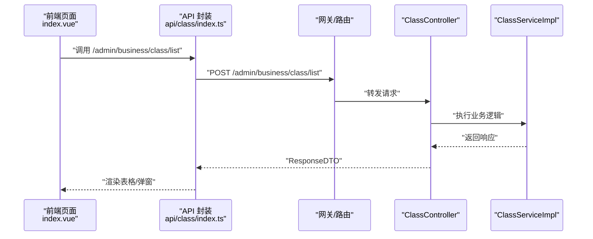
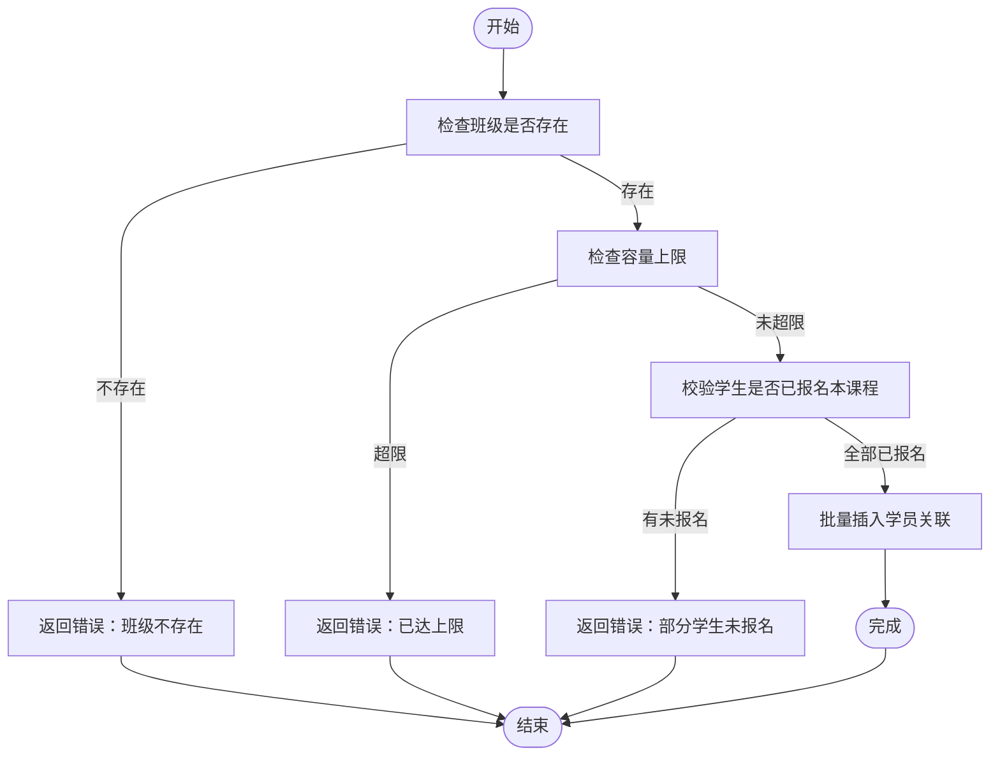
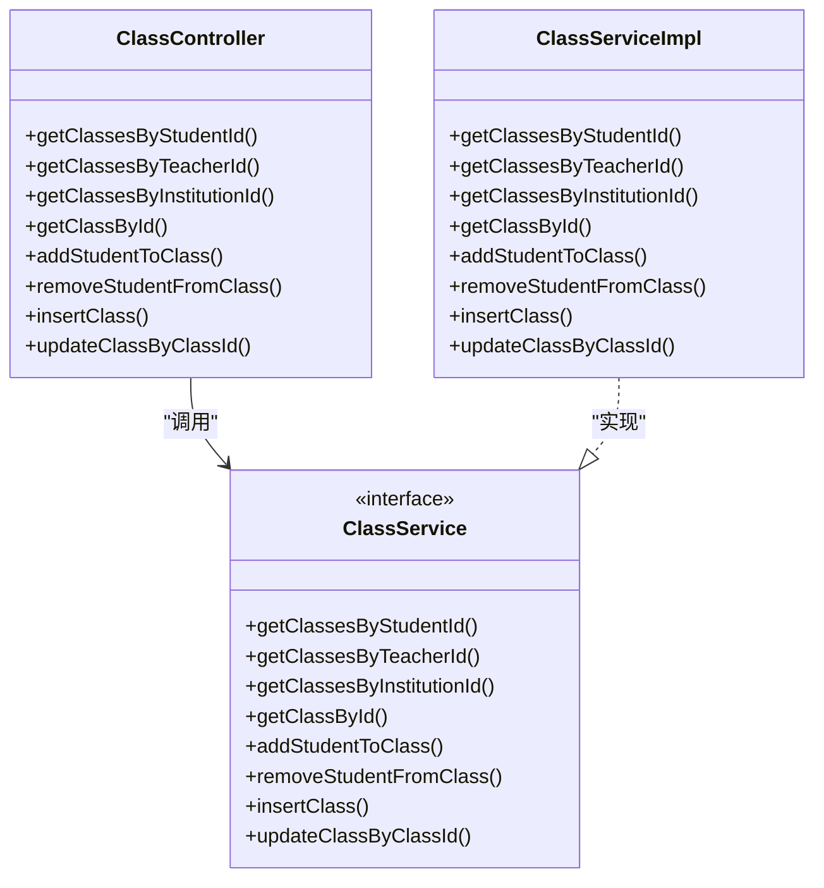

# 班级管理

<cite>
**本文引用的文件**   
- [class/index.vue](file://class_record_admin_front/src/views/business/class/index.vue)
- [api/class/index.ts](file://class_record_admin_front/src/api/class/index.ts)
- [ClassController.java](file://class_times_record_back/business-service/src/main/java/com/shiroko/controller/ClassController.java)
- [ClassServiceImpl.java](file://class_times_record_back/business-service/src/main/java/com/shiroko/service/impl/ClassServiceImpl.java)
- [ClassService.java](file://class_times_record_back/common/src/main/java/com/shiroko/service/ClassService.java)
- [InsertClassDTO.java](file://class_times_record_back/common/src/main/java/com/shiroko/repository/dto/clazz/InsertClassDTO.java)
- [UpdateClassDTO.java](file://class_times_record_back/common/src/main/java/com/shiroko/repository/dto/clazz/UpdateClassDTO.java)
- [QueryClassVO.java](file://class_times_record_back/common/src/main/java/com/shiroko/repository/vo/clazz/QueryClassVO.java)
- [ClassVO.java](file://class_times_record_back/common/src/main/java/com/shiroko/repository/vo/clazz/ClassVO.java)
</cite>

## 目录
1. [简介](#简介)
2. [项目结构](#项目结构)
3. [核心组件](#核心组件)
4. [架构总览](#架构总览)
5. [详细组件分析](#详细组件分析)
6. [依赖关系分析](#依赖关系分析)
7. [性能与容量控制](#性能与容量控制)
8. [故障排查指南](#故障排查指南)
9. [结论](#结论)
10. [附录：API 接口文档](#附录api-接口文档)

## 简介
本文件面向“班级管理”功能，覆盖班级创建、配置与管理流程；学员与教师分配；容量控制（最大学员数、已满处理）；状态管理（启用/停用/归档）；班级详情展示（学员列表、课时统计、出勤率计算思路）；以及前后端 API 说明。同时提供数据导入导出的建议方案与模板字段规范。

## 项目结构
前端采用 Vue + Element Plus，后端为 Spring Boot 微服务（business-service 暴露业务接口）。班级管理的核心路径如下：
- 前端页面：views/business/class/index.vue
- 前端 API 封装：api/class/index.ts
- 后端控制器：business-service/.../controller/ClassController.java
- 后端服务实现：business-service/.../service/impl/ClassServiceImpl.java
- 通用 DTO/VO：common/.../dto/clazz/* 与 common/.../vo/clazz/*

图表来源
- [class/index.vue:1-482](file://class_record_admin_front/src/views/business/class/index.vue#L1-L482)
- [api/class/index.ts:1-14](file://class_record_admin_front/src/api/class/index.ts#L1-L14)
- [ClassController.java:1-75](file://class_times_record_back/business-service/src/main/java/com/shiroko/controller/ClassController.java#L1-L75)
- [ClassService.java:1-38](file://class_times_record_back/common/src/main/java/com/shiroko/service/ClassService.java#L1-L38)
- [ClassServiceImpl.java:1-282](file://class_times_record_back/business-service/src/main/java/com/shiroko/service/impl/ClassServiceImpl.java#L1-L282)

章节来源
- [class/index.vue:1-482](file://class_record_admin_front/src/views/business/class/index.vue#L1-L482)
- [api/class/index.ts:1-14](file://class_record_admin_front/src/api/class/index.ts#L1-L14)
- [ClassController.java:1-75](file://class_times_record_back/business-service/src/main/java/com/shiroko/controller/ClassController.java#L1-L75)
- [ClassService.java:1-38](file://class_times_record_back/common/src/main/java/com/shiroko/service/ClassService.java#L1-L38)
- [ClassServiceImpl.java:1-282](file://class_times_record_back/business-service/src/main/java/com/shiroko/service/impl/ClassServiceImpl.java#L1-L282)

## 核心组件
- 班级列表页：支持按名称、状态、课程筛选，分页展示，新增/编辑班级，管理学生。
- 班级表单：包含班级名称、所属机构（新增时）、课程、授课教师（新增时）、最大人数、状态等。
- 学生管理弹窗：查看班级学员、批量添加、单个移除。
- 后端控制器与服务：提供增删改查、按维度查询、学员增减、更新班级信息等能力。

章节来源
- [class/index.vue:1-482](file://class_record_admin_front/src/views/business/class/index.vue#L1-L482)
- [ClassController.java:1-75](file://class_times_record_back/business-service/src/main/java/com/shiroko/controller/ClassController.java#L1-L75)
- [ClassServiceImpl.java:1-282](file://class_times_record_back/business-service/src/main/java/com/shiroko/service/impl/ClassServiceImpl.java#L1-L282)

## 架构总览
从请求到响应的关键链路：
- 前端通过 api/class/index.ts 调用 /admin/business/class/* 系列接口
- 网关转发至 business-service 的 ClassController
- Controller 委托 ClassService 接口，由 ClassServiceImpl 执行业务逻辑
- 涉及多表操作（班级、教师关联、排班、学员关联、课次记录校验）使用事务保证一致性

图表来源
- [api/class/index.ts:1-14](file://class_record_admin_front/src/api/class/index.ts#L1-L14)
- [ClassController.java:1-75](file://class_times_record_back/business-service/src/main/java/com/shiroko/controller/ClassController.java#L1-L75)
- [ClassServiceImpl.java:1-282](file://class_times_record_back/business-service/src/main/java/com/shiroko/service/impl/ClassServiceImpl.java#L1-L282)

## 详细组件分析

### 班级基本信息设置（名称、课程、机构、教师、时间、教室）
- 新增班级
  - 必填项：班级名称、课程、最大人数
  - 可选：所属机构（用于过滤课程与教师）、授课教师（多选）
  - 提交后调用 insert 接口，后端写入班级基础信息、教师关联、排班日程
- 编辑班级
  - 仅更新班级自身字段时，可传递 onlyUpdateClassOwn=true，避免触发“先删后增”的教师与日程同步
  - 若需变更教师或日程，将执行删除旧关联并插入新关联

章节来源
- [class/index.vue:142-192](file://class_record_admin_front/src/views/business/class/index.vue#L142-L192)
- [ClassServiceImpl.java:172-222](file://class_times_record_back/business-service/src/main/java/com/shiroko/service/impl/ClassServiceImpl.java#L172-L222)
- [ClassServiceImpl.java:232-275](file://class_times_record_back/business-service/src/main/java/com/shiroko/service/impl/ClassServiceImpl.java#L232-L275)
- [InsertClassDTO.java:1-30](file://class_times_record_back/common/src/main/java/com/shiroko/repository/dto/clazz/InsertClassDTO.java#L1-L30)
- [UpdateClassDTO.java:1-42](file://class_times_record_back/common/src/main/java/com/shiroko/repository/dto/clazz/UpdateClassDTO.java#L1-L42)

### 学员分配（批量添加、单个添加、移除）
- 批量添加
  - 前端选择多个学生 ID，调用 add_student 接口
  - 后端校验：
    - 班级存在性
    - 容量上限：当前人数 + 新增人数 ≤ 最大学员数
    - 报名校验：所选学生必须已报名该班级对应课程
    - 重复校验：避免重复加入
- 移除学员
  - 支持单个移除，后端批量删除学员关联

图表来源
- [ClassServiceImpl.java:96-160](file://class_times_record_back/business-service/src/main/java/com/shiroko/service/impl/ClassServiceImpl.java#L96-L160)

章节来源
- [class/index.vue:250-302](file://class_record_admin_front/src/views/business/class/index.vue#L250-L302)
- [ClassServiceImpl.java:96-160](file://class_times_record_back/business-service/src/main/java/com/shiroko/service/impl/ClassServiceImpl.java#L96-L160)
- [ClassServiceImpl.java:225-229](file://class_times_record_back/business-service/src/main/java/com/shiroko/service/impl/ClassServiceImpl.java#L225-L229)

### 教师分配（主讲教师、助教教师）
- 新增时可选择多名教师作为任课教师
- 编辑时可全量替换教师关联（先删后增），或通过 onlyUpdateClassOwn 跳过此步骤
- 列表页展示教师姓名集合

章节来源
- [class/index.vue:395-413](file://class_record_admin_front/src/views/business/class/index.vue#L395-L413)
- [ClassServiceImpl.java:232-275](file://class_times_record_back/business-service/src/main/java/com/shiroko/service/impl/ClassServiceImpl.java#L232-L275)

### 班级容量控制机制
- 最大学员数限制：在新增/编辑时由 studentMaxCount 定义
- 已满状态处理：添加学员时若超出上限直接拒绝
- 列表展示：显示“当前人数/最大人数”，便于管理员识别满员班级

章节来源
- [class/index.vue:349-353](file://class_record_admin_front/src/views/business/class/index.vue#L349-L353)
- [ClassServiceImpl.java:111-114](file://class_times_record_back/business-service/src/main/java/com/shiroko/service/impl/ClassServiceImpl.java#L111-L114)

### 班级状态管理（启用、停用、历史归档）
- 状态枚举：进行中、已结束
- 列表与表单均支持状态切换
- 历史归档：可将状态置为“已结束”进行归档，后续仍可查询

章节来源
- [class/index.vue:57-66](file://class_record_admin_front/src/views/business/class/index.vue#L57-L66)
- [class/index.vue:408-413](file://class_record_admin_front/src/views/business/class/index.vue#L408-L413)

### 班级详情页面功能说明
- 学员列表展示：通过 get_by_id 获取班级详情，含学生列表
- 课时统计：后端 VO 中包含 courseRecord 对象，可用于统计课时
- 出勤率计算：基于课程记录中的出勤情况在前端计算（例如：实际出席课时/应出席课时）

章节来源
- [class/index.vue:219-239](file://class_record_admin_front/src/views/business/class/index.vue#L219-L239)
- [ClassVO.java:1-44](file://class_times_record_back/common/src/main/java/com/shiroko/repository/vo/clazz/ClassVO.java#L1-L44)

## 依赖关系分析
- 前端依赖
  - index.vue 依赖 api/class/index.ts 提供的 list/insert/update 方法
  - 学生管理依赖 /admin/business/class/add_student 与 /admin/business/class/remove_student
- 后端依赖
  - ClassController 依赖 ClassService 接口
  - ClassServiceImpl 依赖多个 Mapper（班级、教师、排班、学员关联、课次记录）

图表来源
- [ClassController.java:1-75](file://class_times_record_back/business-service/src/main/java/com/shiroko/controller/ClassController.java#L1-L75)
- [ClassService.java:1-38](file://class_times_record_back/common/src/main/java/com/shiroko/service/ClassService.java#L1-L38)
- [ClassServiceImpl.java:1-282](file://class_times_record_back/business-service/src/main/java/com/shiroko/service/impl/ClassServiceImpl.java#L1-L282)

## 性能与容量控制
- 容量校验前置：在添加学员前先做人数上限与报名校验，减少无效写入
- 批量操作：使用批量插入/删除接口降低数据库往返次数
- 只更新自身字段：onlyUpdateClassOwn=true 时跳过教师与日程的“先删后增”，提升更新效率
- 分页查询：列表接口支持分页参数，避免一次性加载过多数据

章节来源
- [ClassServiceImpl.java:96-160](file://class_times_record_back/business-service/src/main/java/com/shiroko/service/impl/ClassServiceImpl.java#L96-L160)
- [ClassServiceImpl.java:232-275](file://class_times_record_back/business-service/src/main/java/com/shiroko/service/impl/ClassServiceImpl.java#L232-L275)
- [class/index.vue:111-127](file://class_record_admin_front/src/views/business/class/index.vue#L111-L127)

## 故障排查指南
- 添加学员失败
  - 常见原因：班级不存在、已达上限、学生未报名本课程、重复添加
  - 定位方式：查看后端返回的错误消息，结合前端提示
- 更新班级失败
  - 常见原因：班级不存在、参数校验失败
  - 定位方式：确认 onlyUpdateClassOwn 的使用场景，必要时传入完整教师/日程列表
- 列表为空或异常
  - 检查筛选条件是否为空字符串导致参数被剔除
  - 确认分页参数是否正确

章节来源
- [ClassServiceImpl.java:96-160](file://class_times_record_back/business-service/src/main/java/com/shiroko/service/impl/ClassServiceImpl.java#L96-L160)
- [ClassServiceImpl.java:232-275](file://class_times_record_back/business-service/src/main/java/com/shiroko/service/impl/ClassServiceImpl.java#L232-L275)
- [class/index.vue:111-127](file://class_record_admin_front/src/views/business/class/index.vue#L111-L127)

## 结论
班级管理模块覆盖了从创建、配置到人员分配的全流程，具备完善的容量控制与状态管理能力。通过 onlyUpdateClassOwn 优化了高频更新场景的性能，并通过批量接口提升了整体吞吐。建议在后续迭代中完善导出模板与更细粒度的权限控制。

## 附录：API 接口文档

### 通用约定
- 请求方式：POST
- 统一前缀：/admin/business/class
- 请求体：JSON
- 响应体：统一包装 ResponseDTO<T>

### 列表查询
- 接口：/list
- 入参：分页与筛选（如 className、status、courseId、currentPage、pageSize）
- 出参：PageData<ClassResponse>
- 用途：班级列表展示与筛选

章节来源
- [api/class/index.ts:3-5](file://class_record_admin_front/src/api/class/index.ts#L3-L5)
- [class/index.vue:111-127](file://class_record_admin_front/src/views/business/class/index.vue#L111-L127)

### 新增班级
- 接口：/insert
- 入参：InsertClassRequest（包含 className、courseId、studentMaxCount、institutionId、teacherIds 等）
- 出参：InsertClassResponse
- 用途：创建班级并写入教师与排班

章节来源
- [api/class/index.ts:7-9](file://class_record_admin_front/src/api/class/index.ts#L7-L9)
- [ClassController.java:65-68](file://class_times_record_back/business-service/src/main/java/com/shiroko/controller/ClassController.java#L65-L68)
- [ClassServiceImpl.java:172-222](file://class_times_record_back/business-service/src/main/java/com/shiroko/service/impl/ClassServiceImpl.java#L172-L222)
- [InsertClassDTO.java:1-30](file://class_times_record_back/common/src/main/java/com/shiroko/repository/dto/clazz/InsertClassDTO.java#L1-L30)

### 更新班级
- 接口：/update
- 入参：UpdateClassRequest（包含 classId、className、studentMaxCount、status、onlyUpdateClassOwn 等）
- 出参：UpdateClassResponse
- 用途：仅更新班级自身字段或连同教师/日程一起更新

章节来源
- [api/class/index.ts:11-13](file://class_record_admin_front/src/api/class/index.ts#L11-L13)
- [ClassController.java:70-73](file://class_times_record_back/business-service/src/main/java/com/shiroko/controller/ClassController.java#L70-L73)
- [ClassServiceImpl.java:232-275](file://class_times_record_back/business-service/src/main/java/com/shiroko/service/impl/ClassServiceImpl.java#L232-L275)
- [UpdateClassDTO.java:1-42](file://class_times_record_back/common/src/main/java/com/shiroko/repository/dto/clazz/UpdateClassDTO.java#L1-L42)

### 按维度查询
- 接口：/get_classes_by_student_id、/get_classes_by_teacher_id、/get_classes_by_institution_id
- 入参：QueryClassDTO
- 出参：QueryClassVO（classList、total）
- 用途：按学生/教师/机构维度获取班级列表

章节来源
- [ClassController.java:35-48](file://class_times_record_back/business-service/src/main/java/com/shiroko/controller/ClassController.java#L35-L48)
- [ClassService.java:22-36](file://class_times_record_back/common/src/main/java/com/shiroko/service/ClassService.java#L22-L36)
- [QueryClassVO.java:1-26](file://class_times_record_back/common/src/main/java/com/shiroko/repository/vo/clazz/QueryClassVO.java#L1-L26)

### 获取班级详情
- 接口：/get_class_by_id
- 入参：QueryClassDTO（classId）
- 出参：QueryClassVO（classList 包含班级详情与学生列表）
- 用途：班级详情页数据加载

章节来源
- [ClassController.java:50-53](file://class_times_record_back/business-service/src/main/java/com/shiroko/controller/ClassController.java#L50-L53)
- [ClassServiceImpl.java:162-169](file://class_times_record_back/business-service/src/main/java/com/shiroko/service/impl/ClassServiceImpl.java#L162-L169)

### 添加学员
- 接口：/add_student_to_class
- 入参：UpdateClassDTO（classId、students[]）
- 出参：UpdateClassVO
- 用途：批量添加学员，含容量与报名校验

章节来源
- [ClassController.java:55-58](file://class_times_record_back/business-service/src/main/java/com/shiroko/controller/ClassController.java#L55-L58)
- [ClassServiceImpl.java:96-160](file://class_times_record_back/business-service/src/main/java/com/shiroko/service/impl/ClassServiceImpl.java#L96-L160)
- [UpdateClassDTO.java:1-42](file://class_times_record_back/common/src/main/java/com/shiroko/repository/dto/clazz/UpdateClassDTO.java#L1-L42)

### 移除学员
- 接口：/remove_student_from_class
- 入参：UpdateClassDTO（classId、students[]）
- 出参：UpdateClassVO
- 用途：批量移除学员

章节来源
- [ClassController.java:60-63](file://class_times_record_back/business-service/src/main/java/com/shiroko/controller/ClassController.java#L60-L63)
- [ClassServiceImpl.java:225-229](file://class_times_record_back/business-service/src/main/java/com/shiroko/service/impl/ClassServiceImpl.java#L225-L229)

### 数据导入导出与 Excel 模板
- 导入建议
  - 模板字段：班级名称、课程ID、最大人数、状态、教师ID列表、排班（星期、起止日期、起止时间、备注）
  - 校验规则：课程有效性、教师有效性、容量上限、重复导入去重
- 导出建议
  - 导出字段：班级ID、班级名称、课程名称、教师姓名、最大人数、当前人数、状态、创建时间
- 注意
  - 导入时需开启事务，确保数据一致性
  - 大文件导入建议分片处理与异步任务

[本节为通用建议，不直接分析具体代码文件]