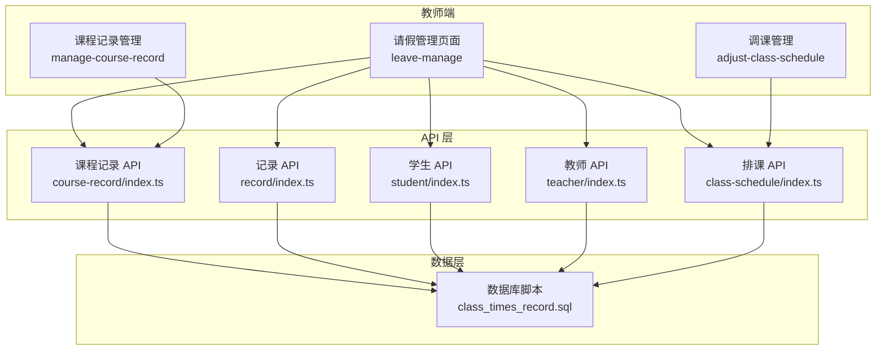
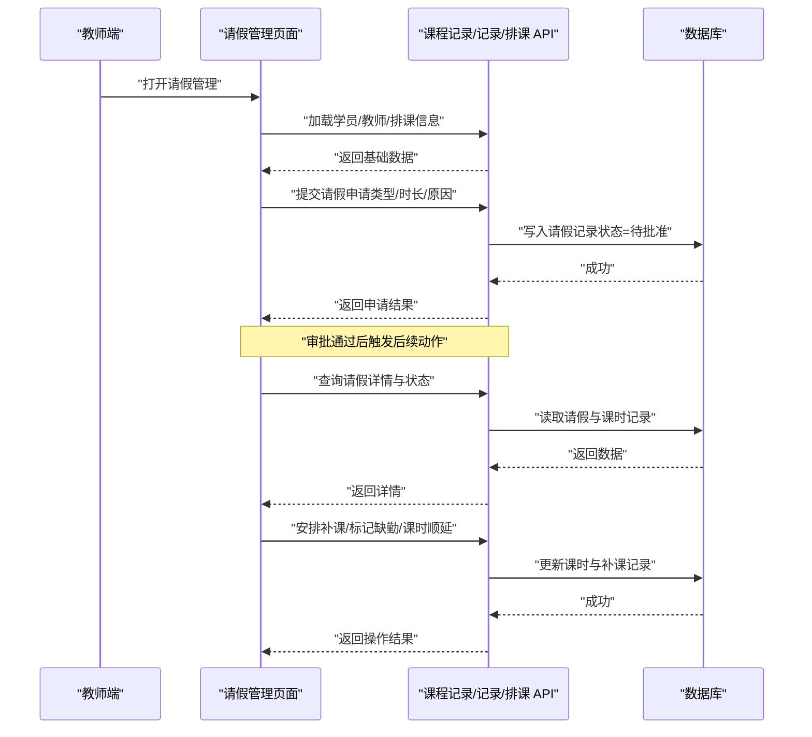
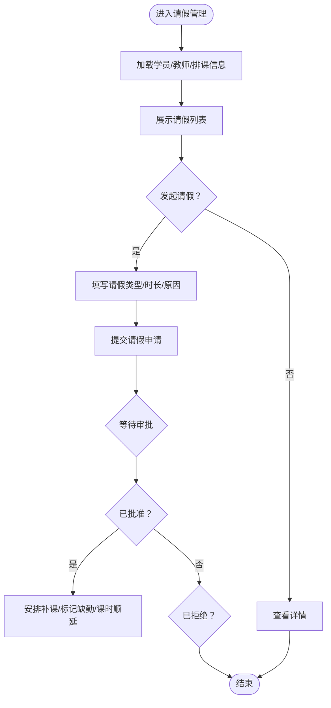
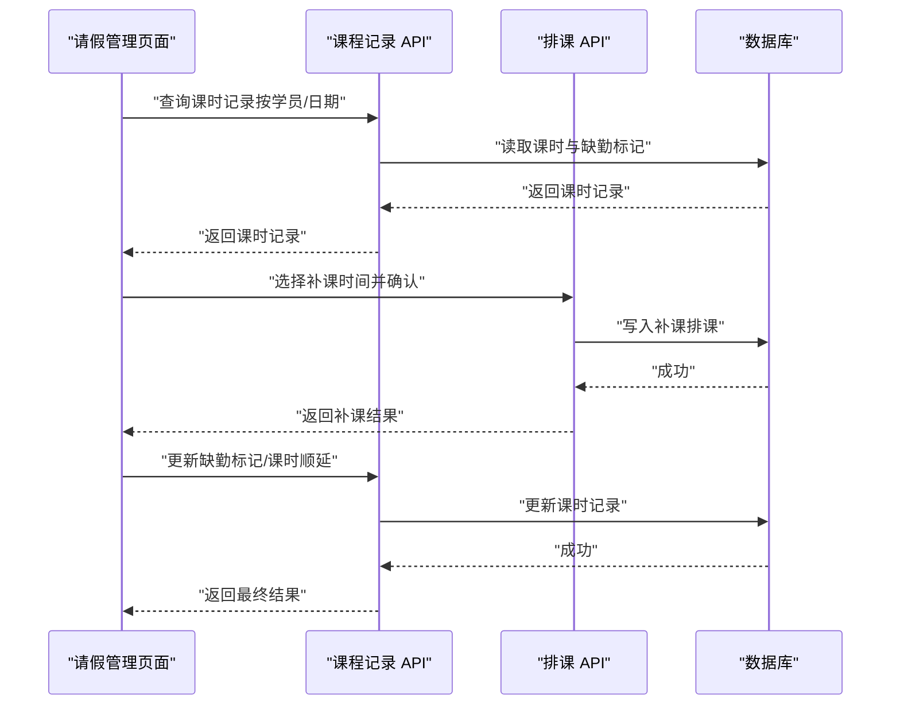
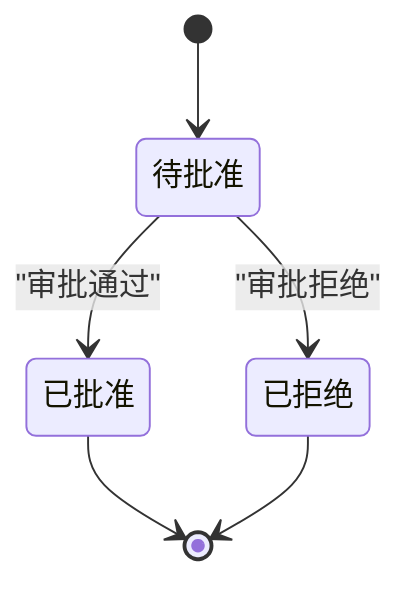
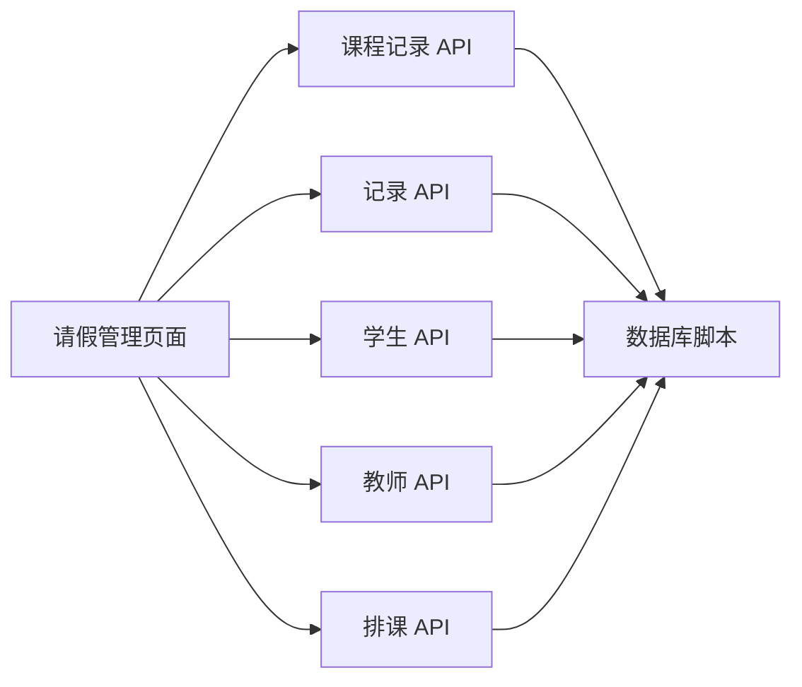

# 请假管理

<cite>
**本文引用的文件**   
- [class_times_record.sql](file://class_times_record_back/docs/class_times_record.sql)
- [leave-manage/index.vue](file://class_times_record/src/pages/main/teacher/leave-manage/index.vue)
- [leave-manage/index.d.ts](file://class_times_record/src/pages/main/teacher/leave-manage/index.d.ts)
- [leave-manage/index.scss](file://class_times_record/src/pages/main/teacher/leave-manage/index.scss)
- [course-record/index.ts](file://class_times_record/src/api/course-record/index.ts)
- [record/index.ts](file://class_times_record/src/api/record/index.ts)
- [student/index.ts](file://class_times_record/src/api/student/index.ts)
- [teacher/index.ts](file://class_times_record/src/api/teacher/index.ts)
- [class-schedule/index.ts](file://class_times_record/src/api/class-schedule/index.ts)
- [index.vue（教师主页）](file://class_times_record/src/pages/main/teacher/index/index.vue)
- [adjust-class-schedule/index.vue](file://class_times_record/src/pages/main/teacher/adjust-class-schedule/index.vue)
- [course-record/index.vue](file://class_times_record/src/pages/main/teacher/manage-course-record/index.vue)
</cite>

## 目录
1. [简介](#简介)
2. [项目结构](#项目结构)
3. [核心组件](#核心组件)
4. [架构总览](#架构总览)
5. [详细组件分析](#详细组件分析)
6. [依赖分析](#依赖分析)
7. [性能考虑](#性能考虑)
8. [故障排查指南](#故障排查指南)
9. [结论](#结论)
10. [附录](#附录)

## 简介
本文件围绕“请假管理”功能，结合仓库中现有前端页面与接口定义，梳理请假申请、审批状态跟踪、记录查询以及与课时记录的关联逻辑。文档同时给出请假类型分类、统计指标、通知机制、API 数据模型以及审计追踪建议，帮助开发者与业务人员快速理解并落地相关能力。

## 项目结构
从当前仓库可见，请假管理主要涉及以下模块：
- 教师端请假管理页面：用于发起请假、查看请假列表与详情、处理补课等。
- 课程记录与排课相关 API：用于联动课时扣减、补课安排与记录展示。
- 学生与教师信息 API：用于在请假单中展示学员与教师信息。
- 数据库脚本：提供表结构与字段说明，支撑请假与课时数据的持久化。

图表来源
- [leave-manage/index.vue](file://class_times_record/src/pages/main/teacher/leave-manage/index.vue)
- [course-record/index.ts](file://class_times_record/src/api/course-record/index.ts)
- [record/index.ts](file://class_times_record/src/api/record/index.ts)
- [student/index.ts](file://class_times_record/src/api/student/index.ts)
- [teacher/index.ts](file://class_times_record/src/api/teacher/index.ts)
- [class-schedule/index.ts](file://class_times_record/src/api/class-schedule/index.ts)
- [class_times_record.sql](file://class_times_record_back/docs/class_times_record.sql)

章节来源
- [leave-manage/index.vue](file://class_times_record/src/pages/main/teacher/leave-manage/index.vue)
- [leave-manage/index.d.ts](file://class_times_record/src/pages/main/teacher/leave-manage/index.d.ts)
- [leave-manage/index.scss](file://class_times_record/src/pages/main/teacher/leave-manage/index.scss)
- [course-record/index.ts](file://class_times_record/src/api/course-record/index.ts)
- [record/index.ts](file://class_times_record/src/api/record/index.ts)
- [student/index.ts](file://class_times_record/src/api/student/index.ts)
- [teacher/index.ts](file://class_times_record/src/api/teacher/index.ts)
- [class-schedule/index.ts](file://class_times_record/src/api/class-schedule/index.ts)
- [class_times_record.sql](file://class_times_record_back/docs/class_times_record.sql)

## 核心组件
- 请假管理页面（教师端）
  - 负责请假申请提交、请假列表展示、请假详情查看、补课安排入口等。
  - 通过调用课程记录、记录、学生、教师、排课等 API 完成数据交互。
- 课程记录与记录 API
  - 提供课时记录查询、更新、标记缺勤、生成补课记录等能力。
- 排课 API
  - 提供调课、补课时间选择与确认能力。
- 学生与教师 API
  - 提供学员与教师基本信息查询，用于请假单上下文展示。
- 数据库脚本
  - 定义请假、课时、记录等相关表结构与字段约束，支撑业务规则落地。

章节来源
- [leave-manage/index.vue](file://class_times_record/src/pages/main/teacher/leave-manage/index.vue)
- [leave-manage/index.d.ts](file://class_times_record/src/pages/main/teacher/leave-manage/index.d.ts)
- [course-record/index.ts](file://class_times_record/src/api/course-record/index.ts)
- [record/index.ts](file://class_times_record/src/api/record/index.ts)
- [student/index.ts](file://class_times_record/src/api/student/index.ts)
- [teacher/index.ts](file://class_times_record/src/api/teacher/index.ts)
- [class-schedule/index.ts](file://class_times_record/src/api/class-schedule/index.ts)
- [class_times_record.sql](file://class_times_record_back/docs/class_times_record.sql)

## 架构总览
请假管理整体流程如下：
- 教师端发起请假申请，选择请假类型、时长、原因，并提交至后端。
- 系统根据请假类型与规则自动或人工审批，更新请假状态（待批准、已批准、已拒绝）。
- 若为已批准请假，系统联动课时记录进行缺勤标记、补课安排或课时顺延。
- 家长端可通过消息通知获知请假与补课信息。
- 管理员可查询请假记录并进行统计分析。

图表来源
- [leave-manage/index.vue](file://class_times_record/src/pages/main/teacher/leave-manage/index.vue)
- [course-record/index.ts](file://class_times_record/src/api/course-record/index.ts)
- [record/index.ts](file://class_times_record/src/api/record/index.ts)
- [class-schedule/index.ts](file://class_times_record/src/api/class-schedule/index.ts)
- [class_times_record.sql](file://class_times_record_back/docs/class_times_record.sql)

## 详细组件分析

### 请假管理页面（教师端）
- 职责
  - 展示请假列表与详情，支持按学员、日期范围筛选。
  - 发起请假申请：选择请假类型（事假、病假、公假）、填写时长与原因。
  - 查看审批状态（待批准、已批准、已拒绝），并在批准后进入补课安排。
  - 跳转至课程记录与调课页面，完成补课与课时顺延。
- 关键交互
  - 提交请假申请后，页面轮询或刷新以获取最新状态。
  - 已批准的请假项显示“安排补课”入口，点击后进入调课流程。
- 数据绑定
  - 使用 TypeScript 类型定义确保表单字段与 API 响应一致。
  - 样式文件控制页面布局与交互反馈。

图表来源
- [leave-manage/index.vue](file://class_times_record/src/pages/main/teacher/leave-manage/index.vue)
- [leave-manage/index.d.ts](file://class_times_record/src/pages/main/teacher/leave-manage/index.d.ts)
- [leave-manage/index.scss](file://class_times_record/src/pages/main/teacher/leave-manage/index.scss)

章节来源
- [leave-manage/index.vue](file://class_times_record/src/pages/main/teacher/leave-manage/index.vue)
- [leave-manage/index.d.ts](file://class_times_record/src/pages/main/teacher/leave-manage/index.d.ts)
- [leave-manage/index.scss](file://class_times_record/src/pages/main/teacher/leave-manage/index.scss)

### 请假与课时记录的关联逻辑
- 自动标记缺勤
  - 当请假状态变更为“已批准”，系统根据请假时长对对应课时记录进行缺勤标记。
- 补课安排
  - 教师可在请假详情中进入调课页面，选择新的上课时间与班级，完成补课。
- 课时顺延
  - 对于因请假导致的课时缺失，可按规则将剩余课时顺延至后续排课。

图表来源
- [course-record/index.ts](file://class_times_record/src/api/course-record/index.ts)
- [class-schedule/index.ts](file://class_times_record/src/api/class-schedule/index.ts)
- [class_times_record.sql](file://class_times_record_back/docs/class_times_record.sql)

章节来源
- [course-record/index.ts](file://class_times_record/src/api/course-record/index.ts)
- [class-schedule/index.ts](file://class_times_record/src/api/class-schedule/index.ts)
- [class_times_record.sql](file://class_times_record_back/docs/class_times_record.sql)

### 请假类型分类与管理
- 类型定义
  - 事假：个人事务请假，通常需提前申请，可能影响课时统计。
  - 病假：因病无法上课，需提供必要证明（如需要），允许紧急请假。
  - 公假：因公外出或学校活动，一般无需扣减课时。
- 处理规则
  - 不同请假类型在审批策略、缺勤标记与补课要求上有所差异。
  - 公假通常不触发缺勤标记；事假与病假在批准后触发缺勤标记与补课安排。

章节来源
- [leave-manage/index.d.ts](file://class_times_record/src/pages/main/teacher/leave-manage/index.d.ts)
- [class_times_record.sql](file://class_times_record_back/docs/class_times_record.sql)

### 请假状态跟踪
- 状态枚举
  - 待批准：申请已提交，等待审批。
  - 已批准：审批通过，触发缺勤标记与补课流程。
  - 已拒绝：审批未通过，不触发后续动作。
- 状态流转
  - 提交申请后状态为“待批准”。
  - 审批通过后状态变为“已批准”，否则变为“已拒绝”。

章节来源
- [leave-manage/index.vue](file://class_times_record/src/pages/main/teacher/leave-manage/index.vue)
- [leave-manage/index.d.ts](file://class_times_record/src/pages/main/teacher/leave-manage/index.d.ts)

### 请假记录查询
- 查询维度
  - 按学员、教师、日期范围、请假类型、状态筛选。
- 数据来源
  - 通过记录 API 与课程记录 API 聚合请假与课时信息。
- 展示方式
  - 列表页展示关键字段（学员、类型、时长、状态、原因摘要）。
  - 详情页展示完整信息与补课安排。

章节来源
- [record/index.ts](file://class_times_record/src/api/record/index.ts)
- [course-record/index.ts](file://class_times_record/src/api/course-record/index.ts)
- [leave-manage/index.vue](file://class_times_record/src/pages/main/teacher/leave-manage/index.vue)

### 请假统计功能
- 学员请假率分析
  - 统计周期内学员请假次数与总课时比例，识别高频请假学员。
- 教师请假情况统计
  - 统计教师请假次数、类型分布与平均时长，辅助排课优化。
- 实现思路
  - 基于请假记录与课时记录聚合计算，导出报表或可视化图表。

章节来源
- [record/index.ts](file://class_times_record/src/api/record/index.ts)
- [course-record/index.ts](file://class_times_record/src/api/course-record/index.ts)
- [class_times_record.sql](file://class_times_record_back/docs/class_times_record.sql)

### 请假通知机制
- 家长提醒
  - 请假申请提交后向家长发送提醒，包含请假类型、时长与预计补课时间。
- 补课通知
  - 补课确认后向家长与教师发送通知，包含新上课时间与地点。
- 实现建议
  - 通过消息服务或短信/微信模板消息推送，确保及时触达。

章节来源
- [leave-manage/index.vue](file://class_times_record/src/pages/main/teacher/leave-manage/index.vue)
- [class-schedule/index.ts](file://class_times_record/src/api/class-schedule/index.ts)

### 请假相关的 API 接口与数据模型
- 接口清单（示例）
  - 请假申请提交：POST /api/leave/apply
  - 请假列表查询：GET /api/leave/list
  - 请假详情查询：GET /api/leave/detail/{id}
  - 补课安排：POST /api/schedule/makeup
  - 课时记录更新：PUT /api/course-record/update
- 数据模型（关键字段）
  - 请假记录：学员ID、教师ID、请假类型、开始时间、结束时间、原因、状态、创建时间、更新时间。
  - 课时记录：课程ID、学员ID、教师ID、上课时间、缺勤标记、补课ID、备注。
  - 排课记录：班级ID、课程ID、上课时间、状态、补课来源。

章节来源
- [course-record/index.ts](file://class_times_record/src/api/course-record/index.ts)
- [record/index.ts](file://class_times_record/src/api/record/index.ts)
- [class-schedule/index.ts](file://class_times_record/src/api/class-schedule/index.ts)
- [class_times_record.sql](file://class_times_record_back/docs/class_times_record.sql)

### 审计追踪与历史变更记录
- 变更事件
  - 请假申请创建、审批通过/拒绝、补课安排、缺勤标记、课时顺延。
- 记录内容
  - 操作人、操作时间、变更前值、变更后值、原因说明。
- 存储与展示
  - 在审计日志表中追加记录，并提供查询与导出能力。

章节来源
- [class_times_record.sql](file://class_times_record_back/docs/class_times_record.sql)

## 依赖分析
- 页面到 API 的依赖
  - 请假管理页面依赖课程记录、记录、学生、教师、排课等 API。
- API 到数据库的依赖
  - 所有业务 API 均依赖数据库脚本定义的表结构与字段。
- 潜在耦合点
  - 请假状态变更与课时记录更新的强一致性需要在事务或补偿机制中保障。

图表来源
- [leave-manage/index.vue](file://class_times_record/src/pages/main/teacher/leave-manage/index.vue)
- [course-record/index.ts](file://class_times_record/src/api/course-record/index.ts)
- [record/index.ts](file://class_times_record/src/api/record/index.ts)
- [student/index.ts](file://class_times_record/src/api/student/index.ts)
- [teacher/index.ts](file://class_times_record/src/api/teacher/index.ts)
- [class-schedule/index.ts](file://class_times_record/src/api/class-schedule/index.ts)
- [class_times_record.sql](file://class_times_record_back/docs/class_times_record.sql)

章节来源
- [leave-manage/index.vue](file://class_times_record/src/pages/main/teacher/leave-manage/index.vue)
- [course-record/index.ts](file://class_times_record/src/api/course-record/index.ts)
- [record/index.ts](file://class_times_record/src/api/record/index.ts)
- [student/index.ts](file://class_times_record/src/api/student/index.ts)
- [teacher/index.ts](file://class_times_record/src/api/teacher/index.ts)
- [class-schedule/index.ts](file://class_times_record/src/api/class-schedule/index.ts)
- [class_times_record.sql](file://class_times_record_back/docs/class_times_record.sql)

## 性能考虑
- 分页与筛选
  - 请假列表与课时记录应支持分页与多维度筛选，避免一次性加载大量数据。
- 缓存策略
  - 学员与教师基础信息可短期缓存，减少重复查询。
- 异步任务
  - 补课安排与缺勤标记可采用异步任务，提升用户响应速度。
- 索引优化
  - 针对常用查询字段（学员ID、日期、状态）建立索引，提高查询效率。

## 故障排查指南
- 常见问题
  - 请假提交失败：检查必填字段与权限校验。
  - 状态未更新：确认审批流程是否完成，检查状态字段更新逻辑。
  - 补课冲突：验证新排课时间与已有排课是否存在冲突。
- 定位方法
  - 查看页面控制台错误与网络请求响应。
  - 核对数据库记录与审计日志，确认变更链路。

章节来源
- [leave-manage/index.vue](file://class_times_record/src/pages/main/teacher/leave-manage/index.vue)
- [class_times_record.sql](file://class_times_record_back/docs/class_times_record.sql)

## 结论
请假管理功能通过教师端页面与多组 API 协同，实现了请假申请、审批、补课与课时记录的闭环。建议在后续迭代中完善通知机制、统计报表与审计追踪，以提升用户体验与管理效率。

## 附录
- 相关文件路径
  - 请假管理页面：[leave-manage/index.vue](file://class_times_record/src/pages/main/teacher/leave-manage/index.vue)
  - 请假类型定义：[leave-manage/index.d.ts](file://class_times_record/src/pages/main/teacher/leave-manage/index.d.ts)
  - 课程记录 API：[course-record/index.ts](file://class_times_record/src/api/course-record/index.ts)
  - 记录 API：[record/index.ts](file://class_times_record/src/api/record/index.ts)
  - 学生 API：[student/index.ts](file://class_times_record/src/api/student/index.ts)
  - 教师 API：[teacher/index.ts](file://class_times_record/src/api/teacher/index.ts)
  - 排课 API：[class-schedule/index.ts](file://class_times_record/src/api/class-schedule/index.ts)
  - 数据库脚本：[class_times_record.sql](file://class_times_record_back/docs/class_times_record.sql)
  - 教师主页：[index.vue（教师主页）](file://class_times_record/src/pages/main/teacher/index/index.vue)
  - 调课页面：[adjust-class-schedule/index.vue](file://class_times_record/src/pages/main/teacher/adjust-class-schedule/index.vue)
  - 课程记录管理：[course-record/index.vue](file://class_times_record/src/pages/main/teacher/manage-course-record/index.vue)