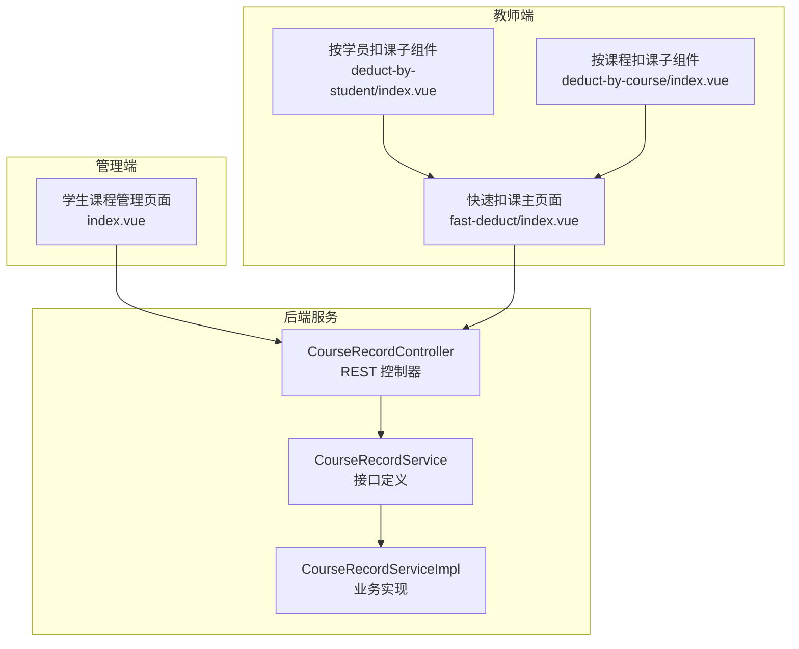
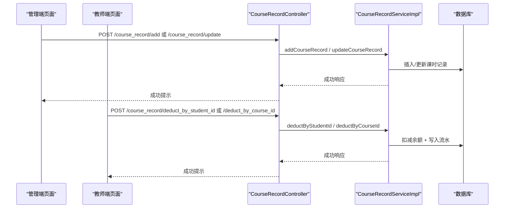
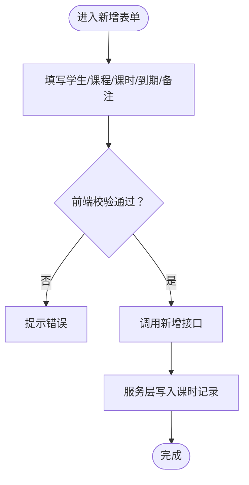
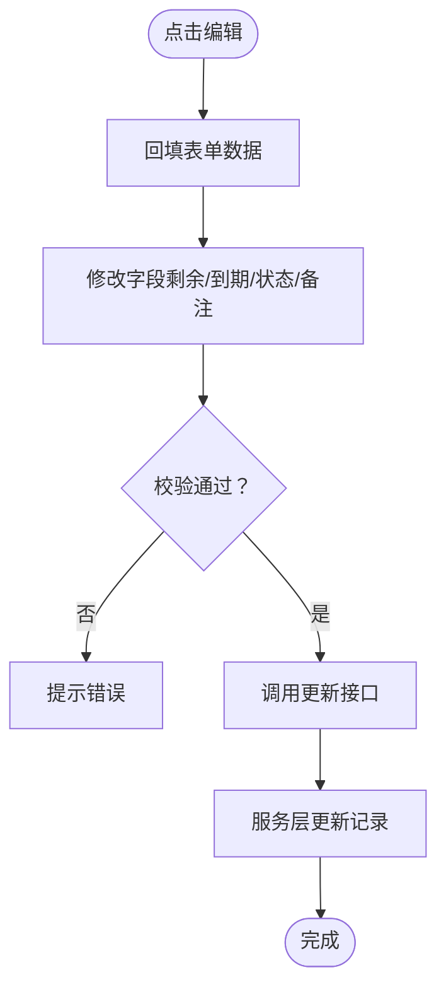
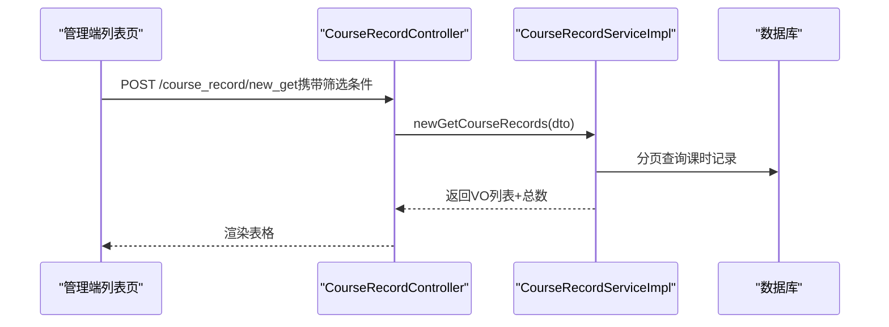
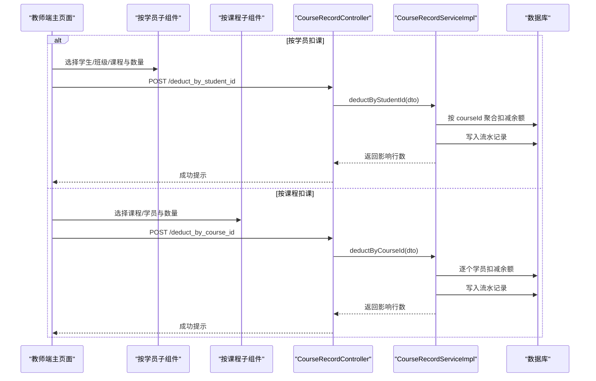
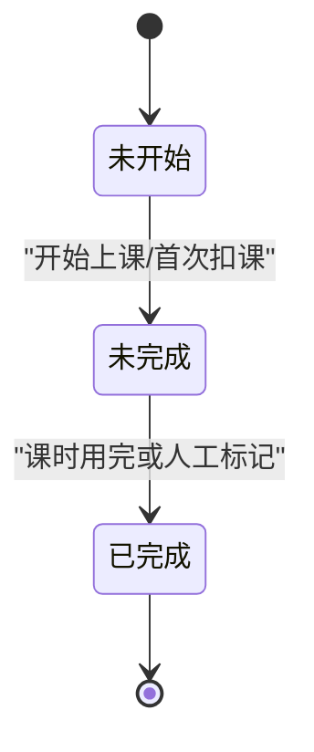
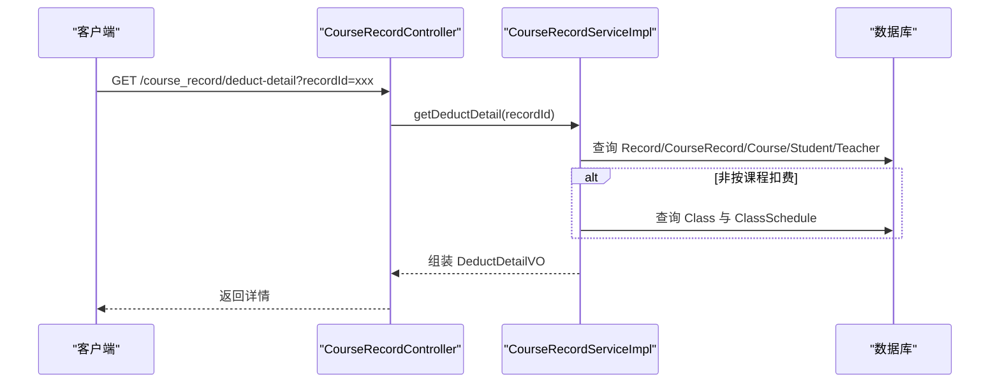
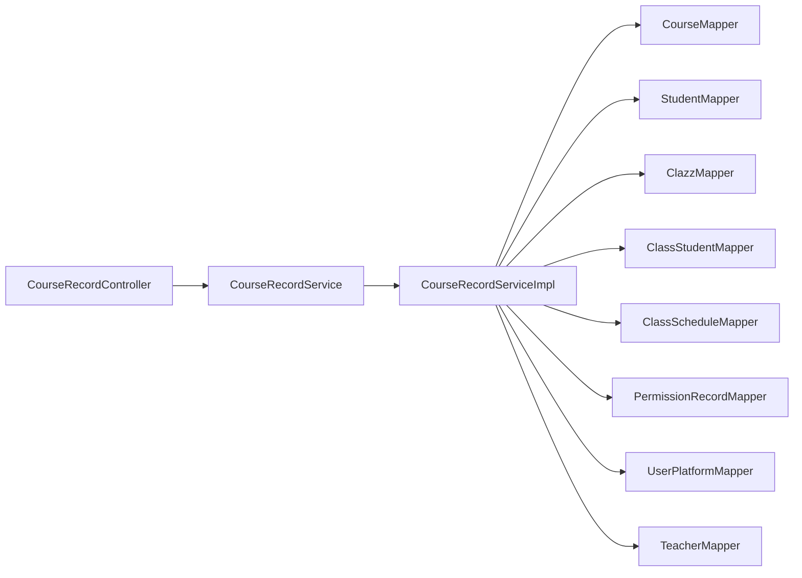

# 课时记录管理

<cite>
**本文引用的文件**
- [CourseRecordController.java](file://class_times_record_back/business-service/src/main/java/com/shiroko/controller/CourseRecordController.java)
- [CourseRecordService.java](file://class_times_record_back/common/src/main/java/com/shiroko/service/CourseRecordService.java)
- [CourseRecordServiceImpl.java](file://class_times_record_back/business-service/src/main/java/com/shiroko/service/impl/CourseRecordServiceImpl.java)
- [index.vue（教师端快速扣课）](file://class_times_record/src/pages/main/teacher/fast-deduct/index.vue)
- [deduct-by-student/index.vue（按学员扣课子组件）](file://class_times_record/src/pages/main/teacher/fast-deduct/components/deduct-by-student/index.vue)
- [deduct-by-course/index.vue（按课程扣课子组件）](file://class_times_record/src/pages/main/teacher/fast-deduct/components/deduct-by-course/index.vue)
- [index.vue（管理端学生课程管理）](file://class_record_admin_front/src/views/business/course-record/index.vue)
</cite>

## 目录
1. [简介](#简介)
2. [项目结构](#项目结构)
3. [核心组件](#核心组件)
4. [架构总览](#架构总览)
5. [详细组件分析](#详细组件分析)
6. [依赖关系分析](#依赖关系分析)
7. [性能与扩展性](#性能与扩展性)
8. [故障排查指南](#故障排查指南)
9. [结论](#结论)
10. [附录：API 接口说明](#附录api-接口说明)

## 简介
本文件围绕“课时记录管理”功能，系统梳理从创建、编辑、查询到批量扣费的全流程，并重点解释快速扣费的两种模式（按学员、按课程）、状态管理与详情展示、请假与补课的关联思路，以及统计报表能力。文档同时提供面向前后端的 API 概览与错误处理建议，帮助开发者与业务人员快速理解与落地。

## 项目结构
本仓库包含多端实现：
- 后端服务（business-service）：提供课时记录的增删改查、批量扣费、详情查询等接口；通过 Service 层封装业务逻辑，使用 Mapper 访问数据。
- 教师端小程序（class_times_record）：提供“快速扣课”页面，支持按学员或按课程批量扣课，选择班级/课程、设置日期与备注后提交。
- 管理端前端（class_record_admin_front）：提供“学生课程管理”页面，用于手动录入与编辑课时记录（如新增、修改剩余课时、到期时间、状态与备注）。

图示来源
- [CourseRecordController.java:24-106](file://class_times_record_back/business-service/src/main/java/com/shiroko/controller/CourseRecordController.java#L24-L106)
- [CourseRecordService.java:17-39](file://class_times_record_back/common/src/main/java/com/shiroko/service/CourseRecordService.java#L17-L39)
- [CourseRecordServiceImpl.java:44-534](file://class_times_record_back/business-service/src/main/java/com/shiroko/service/impl/CourseRecordServiceImpl.java#L44-L534)
- [index.vue（教师端快速扣课）:1-207](file://class_times_record/src/pages/main/teacher/fast-deduct/index.vue#L1-L207)
- [deduct-by-student/index.vue:1-412](file://class_times_record/src/pages/main/teacher/fast-deduct/components/deduct-by-student/index.vue#L1-L412)
- [deduct-by-course/index.vue:1-214](file://class_times_record/src/pages/main/teacher/fast-deduct/components/deduct-by-course/index.vue#L1-L214)
- [index.vue（管理端学生课程管理）:1-328](file://class_record_admin_front/src/views/business/course-record/index.vue#L1-L328)

章节来源
- [CourseRecordController.java:24-106](file://class_times_record_back/business-service/src/main/java/com/shiroko/controller/CourseRecordController.java#L24-L106)
- [CourseRecordService.java:17-39](file://class_times_record_back/common/src/main/java/com/shiroko/service/CourseRecordService.java#L17-L39)
- [CourseRecordServiceImpl.java:44-534](file://class_times_record_back/business-service/src/main/java/com/shiroko/service/impl/CourseRecordServiceImpl.java#L44-L534)
- [index.vue（教师端快速扣课）:1-207](file://class_times_record/src/pages/main/teacher/fast-deduct/index.vue#L1-L207)
- [deduct-by-student/index.vue:1-412](file://class_times_record/src/pages/main/teacher/fast-deduct/components/deduct-by-student/index.vue#L1-L412)
- [deduct-by-course/index.vue:1-214](file://class_times_record/src/pages/main/teacher/fast-deduct/components/deduct-by-course/index.vue#L1-L214)
- [index.vue（管理端学生课程管理）:1-328](file://class_record_admin_front/src/views/business/course-record/index.vue#L1-L328)

## 核心组件
- 控制器层（CourseRecordController）
  - 暴露课时记录查询、新增、删除、更新、按学生/课程/班级扣费、扣费详情等 REST 接口。
- 服务接口（CourseRecordService）
  - 定义课时记录的核心业务能力：CRUD、分页查询、三种扣费入口。
- 服务实现（CourseRecordServiceImpl）
  - 实现具体业务：余额校验、批量聚合、流水记录、权限注入、到期状态计算、扣费详情组装。
- 教师端快速扣课
  - 主页面负责模式切换、日期与备注收集、调用后端扣费接口；两个子组件分别负责按学员与按课程的交互与数据拼装。
- 管理端学生课程管理
  - 提供手动录入与编辑界面，支持按机构/学生/课程/状态筛选，维护课时总数、剩余课时、到期时间与备注。

章节来源
- [CourseRecordController.java:24-106](file://class_times_record_back/business-service/src/main/java/com/shiroko/controller/CourseRecordController.java#L24-L106)
- [CourseRecordService.java:17-39](file://class_times_record_back/common/src/main/java/com/shiroko/service/CourseRecordService.java#L17-L39)
- [CourseRecordServiceImpl.java:44-534](file://class_times_record_back/business-service/src/main/java/com/shiroko/service/impl/CourseRecordServiceImpl.java#L44-L534)
- [index.vue（教师端快速扣课）:1-207](file://class_times_record/src/pages/main/teacher/fast-deduct/index.vue#L1-L207)
- [deduct-by-student/index.vue:1-412](file://class_times_record/src/pages/main/teacher/fast-deduct/components/deduct-by-student/index.vue#L1-L412)
- [deduct-by-course/index.vue:1-214](file://class_times_record/src/pages/main/teacher/fast-deduct/components/deduct-by-course/index.vue#L1-L214)
- [index.vue（管理端学生课程管理）:1-328](file://class_record_admin_front/src/views/business/course-record/index.vue#L1-L328)

## 架构总览
课时记录管理的整体链路如下：
- 管理端：通过“学生课程管理”页面完成课时记录的创建与编辑，调用后端新增/更新接口。
- 教师端：在“快速扣课”中选择模式（按学员/按课程），填写日期与备注，提交后由后端执行余额扣减、写入流水、返回结果。
- 后端：控制器接收请求，服务层进行参数校验、余额检查、批量聚合、事务写入，并返回统一响应体。

图示来源
- [CourseRecordController.java:37-82](file://class_times_record_back/business-service/src/main/java/com/shiroko/controller/CourseRecordController.java#L37-L82)
- [CourseRecordServiceImpl.java:148-263](file://class_times_record_back/business-service/src/main/java/com/shiroko/service/impl/CourseRecordServiceImpl.java#L148-L263)

## 详细组件分析

### 课时记录创建（手动录入）
- 管理端“学生课程管理”页面提供新增表单，字段包括学生、课程、课时总数、剩余课时、到期时间、状态、备注等。
- 提交时调用后端新增接口，服务层将记录持久化并赋予权限。

章节来源
- [index.vue（管理端学生课程管理）:126-169](file://class_record_admin_front/src/views/business/course-record/index.vue#L126-L169)
- [CourseRecordController.java:48-56](file://class_times_record_back/business-service/src/main/java/com/shiroko/controller/CourseRecordController.java#L48-L56)
- [CourseRecordServiceImpl.java:90-102](file://class_times_record_back/business-service/src/main/java/com/shiroko/service/impl/CourseRecordServiceImpl.java#L90-L102)

### 课时记录编辑（信息修正、备注添加）
- 管理端支持编辑已有记录，可修正剩余课时、到期时间、状态与备注。
- 服务层对“剩余课时不能大于总课时”做校验。

章节来源
- [index.vue（管理端学生课程管理）:139-169](file://class_record_admin_front/src/views/business/course-record/index.vue#L139-L169)
- [CourseRecordController.java:78-82](file://class_times_record_back/business-service/src/main/java/com/shiroko/controller/CourseRecordController.java#L78-L82)
- [CourseRecordServiceImpl.java:114-124](file://class_times_record_back/business-service/src/main/java/com/shiroko/service/impl/CourseRecordServiceImpl.java#L114-L124)

### 课时记录查询（按学员、课程、时间范围筛选）
- 管理端支持按机构、学生、课程、状态筛选，分页展示列表。
- 后端提供通用查询与新版查询接口，支持分页与权限注入。

章节来源
- [index.vue（管理端学生课程管理）:93-124](file://class_record_admin_front/src/views/business/course-record/index.vue#L93-L124)
- [CourseRecordController.java:43-46](file://class_times_record_back/business-service/src/main/java/com/shiroko/controller/CourseRecordController.java#L43-L46)
- [CourseRecordServiceImpl.java:127-140](file://class_times_record_back/business-service/src/main/java/com/shiroko/service/impl/CourseRecordServiceImpl.java#L127-L140)

### 快速扣费功能（按课程批量扣费、按学员批量扣费）
- 教师端主页面提供“按学员扣课/按课程扣课”两种模式，支持选择日期与备注。
- 按学员模式：选择学生后，可在“按班级/按课程”子模式下勾选班级或课程，输入扣课数量并提交。
- 按课程模式：选择课程后，勾选该课程下的学员，输入各学员扣课数量并提交。
- 后端根据模式聚合与校验余额，写入扣费流水，并返回影响行数。

图示来源
- [index.vue（教师端快速扣课）:142-198](file://class_times_record/src/pages/main/teacher/fast-deduct/index.vue#L142-L198)
- [deduct-by-student/index.vue:250-282](file://class_times_record/src/pages/main/teacher/fast-deduct/components/deduct-by-student/index.vue#L250-L282)
- [deduct-by-course/index.vue:117-132](file://class_times_record/src/pages/main/teacher/fast-deduct/components/deduct-by-course/index.vue#L117-L132)
- [CourseRecordController.java:63-76](file://class_times_record_back/business-service/src/main/java/com/shiroko/controller/CourseRecordController.java#L63-L76)
- [CourseRecordServiceImpl.java:148-263](file://class_times_record_back/business-service/src/main/java/com/shiroko/service/impl/CourseRecordServiceImpl.java#L148-L263)

#### 批量处理逻辑要点
- 按学员模式：对相同 courseId 的扣除数量进行聚合，再一次性扣减，减少数据库更新次数。
- 按课程模式：遍历学员逐一扣减，便于精细化控制每个学员的扣课数量。
- 余额不足：当扣减影响行数为 0 时抛出业务异常，提示余额不足。

章节来源
- [CourseRecordServiceImpl.java:148-207](file://class_times_record_back/business-service/src/main/java/com/shiroko/service/impl/CourseRecordServiceImpl.java#L148-L207)
- [CourseRecordServiceImpl.java:214-263](file://class_times_record_back/business-service/src/main/java/com/shiroko/service/impl/CourseRecordServiceImpl.java#L214-L263)

### 课时记录的状态管理
- 管理端“学生课程管理”中，课时记录存在“未开始/未完成/已完成”三种状态，用于标识课程生命周期。
- 后端在服务层还计算“到期状态”（已到期/即将到期/有效），用于列表与详情展示。

章节来源
- [index.vue（管理端学生课程管理）:44-48](file://class_record_admin_front/src/views/business/course-record/index.vue#L44-L48)
- [CourseRecordServiceImpl.java:344-368](file://class_times_record_back/business-service/src/main/java/com/shiroko/service/impl/CourseRecordServiceImpl.java#L344-L368)

### 课时记录详情（上课信息、学员信息、扣费明细）
- 提供扣费详情接口，根据 recordId 查询扣课记录，并关联课程、学生、老师等信息。
- 根据扣费模式决定是否显示班级信息与排课描述：
  - 按课程扣费：不显示班级信息。
  - 按学员/按班级扣费：显示班级与排课时间。

图示来源
- [CourseRecordController.java:101-104](file://class_times_record_back/business-service/src/main/java/com/shiroko/controller/CourseRecordController.java#L101-L104)
- [CourseRecordServiceImpl.java:412-532](file://class_times_record_back/business-service/src/main/java/com/shiroko/service/impl/CourseRecordServiceImpl.java#L412-L532)

章节来源
- [CourseRecordController.java:101-104](file://class_times_record_back/business-service/src/main/java/com/shiroko/controller/CourseRecordController.java#L101-L104)
- [CourseRecordServiceImpl.java:412-532](file://class_times_record_back/business-service/src/main/java/com/shiroko/service/impl/CourseRecordServiceImpl.java#L412-L532)

### 请假与补课记录的关联管理（概念说明）
- 请假与补课通常与课时记录存在关联：例如某次请假对应一次补课安排，补课完成后生成新的课时记录或调整原记录。
- 建议在业务层建立“请假单/补课单”实体，并与课时记录通过外键或关联表建立关系，确保：
  - 请假不影响余额，但会触发后续补课计划。
  - 补课完成后，生成扣费流水或恢复相应课时。
- 当前代码库未直接体现请假/补课模块的具体实现，可按上述思路扩展。

[本节为概念性说明，不涉及具体源码文件]

### 课时统计报表（概念说明）
- 学员剩余课时：基于课时记录汇总，按学员维度统计剩余课时与到期状态。
- 教师工作量统计：基于扣费流水中的操作老师与扣课数量，按时间段统计授课量。
- 建议通过后端聚合查询或定时任务生成报表数据，供前端图表展示。

[本节为概念性说明，不涉及具体源码文件]

## 依赖关系分析
- 控制器依赖服务接口，服务实现依赖多个 Mapper（课程、学生、班级、排课、用户平台、权限等）。
- 教师端页面依赖课程与学生的查询接口，以支撑快速扣课的选项加载。
- 管理端页面依赖课程、学生、机构的查询接口，以支撑筛选与下拉选项。

图示来源
- [CourseRecordController.java:24-106](file://class_times_record_back/business-service/src/main/java/com/shiroko/controller/CourseRecordController.java#L24-L106)
- [CourseRecordServiceImpl.java:48-62](file://class_times_record_back/business-service/src/main/java/com/shiroko/service/impl/CourseRecordServiceImpl.java#L48-L62)

章节来源
- [CourseRecordController.java:24-106](file://class_times_record_back/business-service/src/main/java/com/shiroko/controller/CourseRecordController.java#L24-L106)
- [CourseRecordServiceImpl.java:48-62](file://class_times_record_back/business-service/src/main/java/com/shiroko/service/impl/CourseRecordServiceImpl.java#L48-L62)

## 性能与扩展性
- 批量聚合：按学员扣费时按 courseId 聚合，减少数据库更新次数，提升吞吐。
- 分页查询：列表查询采用分页，避免一次性加载大量数据。
- 权限注入：在返回列表时批量查询权限，降低 N+1 问题。
- 扩展点：
  - 增加异步通知：通过注解与上下文传递，便于接入消息队列或推送服务。
  - 引入缓存：对高频只读数据（如课程、学生基础信息）进行缓存，降低数据库压力。

[本节为通用指导，不涉及具体源码文件]

## 故障排查指南
- 余额不足：扣费时若影响行数为 0，会抛出业务异常，提示余额不足。请检查课时记录是否存在且剩余课时是否足够。
- 参数校验失败：新增/更新时若剩余课时大于总课时，会提示参数错误。请修正表单数据。
- 班级不存在或无学生：按班级扣费时，若班级不存在或班级下无学生，会抛出参数错误。请确认班级与学生绑定情况。
- 详情为空：扣费详情查询需传入有效的 recordId，否则返回失败。请确认来源是否正确。

章节来源
- [CourseRecordServiceImpl.java:168-171](file://class_times_record_back/business-service/src/main/java/com/shiroko/service/impl/CourseRecordServiceImpl.java#L168-L171)
- [CourseRecordServiceImpl.java:239-251](file://class_times_record_back/business-service/src/main/java/com/shiroko/service/impl/CourseRecordServiceImpl.java#L239-L251)
- [CourseRecordServiceImpl.java:412-418](file://class_times_record_back/business-service/src/main/java/com/shiroko/service/impl/CourseRecordServiceImpl.java#L412-L418)

## 结论
课时记录管理覆盖了从创建、编辑、查询到批量扣费的全链路，并通过清晰的职责分层与统一的响应体保障稳定性与可维护性。快速扣费提供了灵活的业务入口，配合权限注入与到期状态计算，满足教学场景的多样化需求。建议在后续迭代中完善请假/补课与统计报表能力，进一步提升运营效率。

[本节为总结性内容，不涉及具体源码文件]

## 附录：API 接口说明
以下列出课时记录相关的主要接口（路径与方法）及用途，具体参数与返回结构请参考后端 DTO/VO 定义。

- 获取课时记录（旧版）
  - 方法：POST
  - 路径：/course_record/get
  - 用途：分页查询课时记录，带权限注入
- 获取课时记录（新版）
  - 方法：POST
  - 路径：/course_record/new_get
  - 用途：分页查询课时记录，带到期状态注入
- 新增课时记录
  - 方法：POST
  - 路径：/course_record/add
  - 用途：管理员分组授权并插入课时记录
- 插入课时记录（新）
  - 方法：POST
  - 路径：/course_record/insert
  - 用途：插入课时记录并授予创建者权限
- 删除课时记录
  - 方法：POST
  - 路径：/course_record/delete
  - 用途：软删除指定课时记录
- 更新课时记录
  - 方法：POST
  - 路径：/course_record/update
  - 用途：更新课时记录（含剩余课时与总课时校验）
- 按学员扣费
  - 方法：POST
  - 路径：/course_record/deduct_by_student_id
  - 用途：按学员维度批量扣费（支持按班级或按课程）
- 按课程扣费
  - 方法：POST
  - 路径：/course_record/deduct_by_course_id
  - 用途：按课程维度批量扣费（选择多个学员）
- 按班级扣费
  - 方法：POST
  - 路径：/course_record/deduct_by_class_id
  - 用途：按班级维度批量扣费（班级下所有学员）
- 查询扣费详情
  - 方法：GET
  - 路径：/course_record/deduct-detail
  - 用途：根据 recordId 查询扣费详情（含课程、学生、老师、班级与排课信息）

章节来源
- [CourseRecordController.java:37-104](file://class_times_record_back/business-service/src/main/java/com/shiroko/controller/CourseRecordController.java#L37-L104)