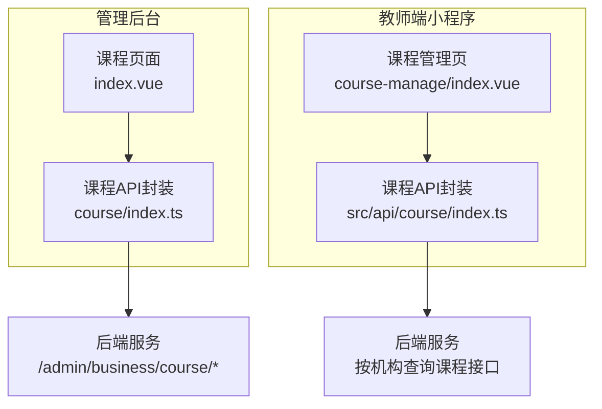
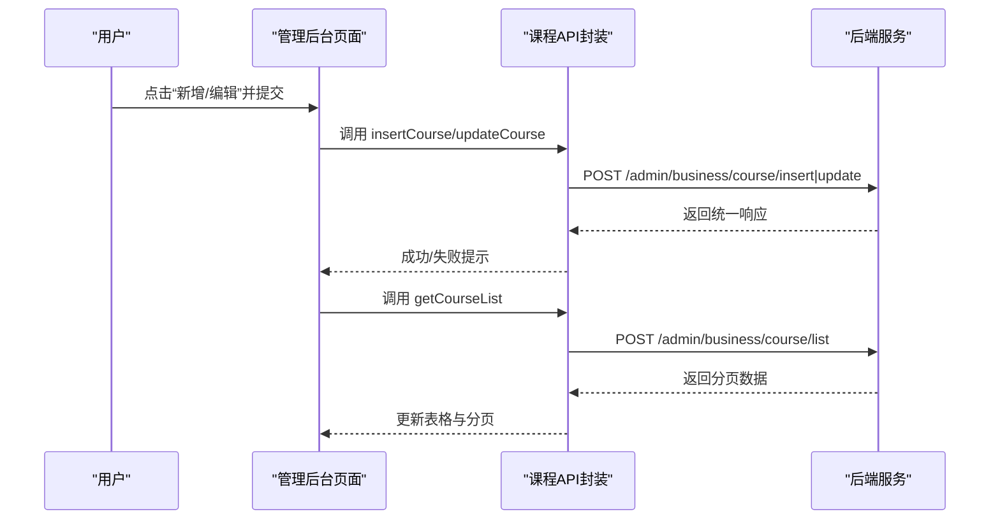
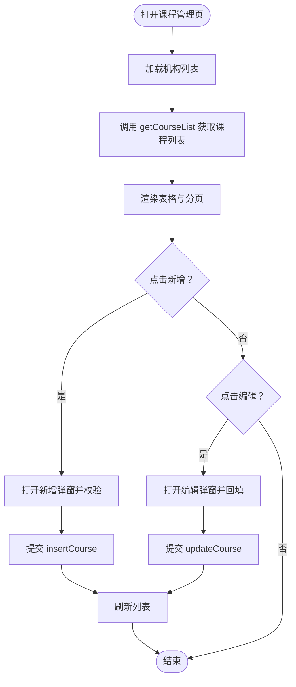
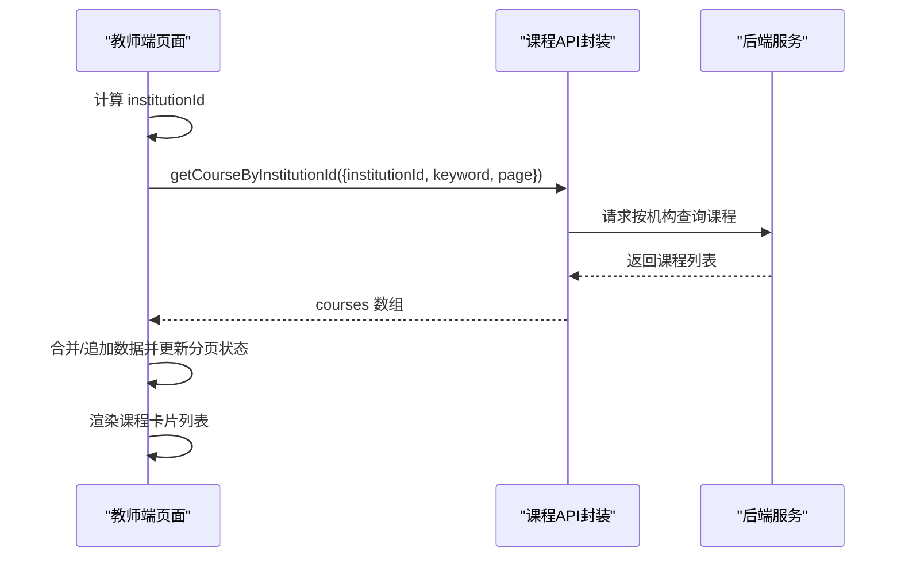
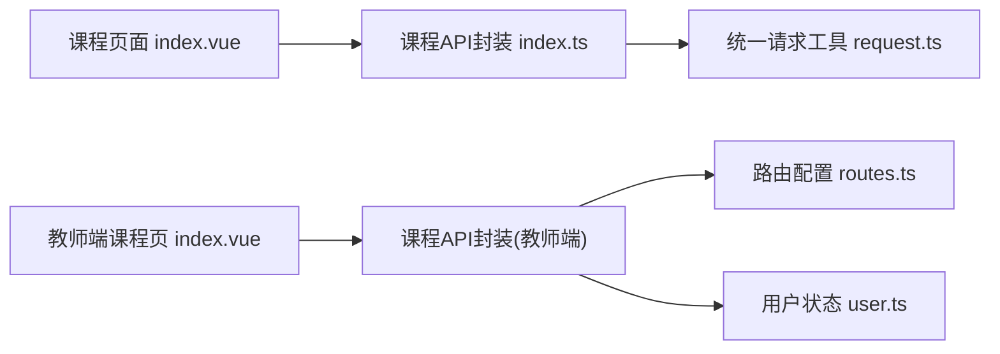

# 课程管理

<cite>
**本文引用的文件**
- [class_record_admin_front/src/api/course/index.ts](file://class_record_admin_front/src/api/course/index.ts)
- [class_record_admin_front/src/views/business/course/index.vue](file://class_record_admin_front/src/views/business/course/index.vue)
- [class_times_record/src/pages/main/teacher/course-manage/index.vue](file://class_times_record/src/pages/main/teacher/course-manage/index.vue)
</cite>

## 目录
1. [简介](#简介)
2. [项目结构](#项目结构)
3. [核心组件](#核心组件)
4. [架构总览](#架构总览)
5. [详细组件分析](#详细组件分析)
6. [依赖分析](#依赖分析)
7. [性能考虑](#性能考虑)
8. [故障排查指南](#故障排查指南)
9. [结论](#结论)
10. [附录：API 接口文档与使用示例](#附录api-接口文档与使用示例)

## 简介
本文件围绕“课程管理”能力，系统化梳理课程的新增、编辑、分类与上下架控制，说明课程与班级的关联关系、课程复用机制、定价策略（按课时计费、套餐计费、折扣优惠等）在现有实现中的体现与扩展点。同时提供课程选择器在排课、扣费场景的集成方式，以及课程数据统计能力的现状与建议。文末给出完整的 API 接口文档与前端调用示例路径，便于快速对接与二次开发。

## 项目结构
课程管理功能在前端分为两条链路：
- 管理后台（Vue + Element Plus）：提供课程的列表查询、新增、编辑、状态切换等管理能力。
- 教师端小程序（uni-app）：提供按机构维度检索课程、分页加载、搜索过滤、跳转详情等能力。



图表来源
- [class_record_admin_front/src/views/business/course/index.vue:1-242](file://class_record_admin_front/src/views/business/course/index.vue#L1-L242)
- [class_record_admin_front/src/api/course/index.ts:1-14](file://class_record_admin_front/src/api/course/index.ts#L1-L14)
- [class_times_record/src/pages/main/teacher/course-manage/index.vue:1-181](file://class_times_record/src/pages/main/teacher/course-manage/index.vue#L1-L181)

章节来源
- [class_record_admin_front/src/views/business/course/index.vue:1-242](file://class_record_admin_front/src/views/business/course/index.vue#L1-L242)
- [class_record_admin_front/src/api/course/index.ts:1-14](file://class_record_admin_front/src/api/course/index.ts#L1-L14)
- [class_times_record/src/pages/main/teacher/course-manage/index.vue:1-181](file://class_times_record/src/pages/main/teacher/course-manage/index.vue#L1-L181)

## 核心组件
- 管理后台课程页面
  - 功能：课程列表查询（支持名称、类型、状态筛选）、分页、新增/编辑弹窗、启用/禁用开关、机构下拉选择。
  - 关键交互：表单校验、提交后刷新列表、错误提示。
- 教师端课程管理页
  - 功能：按机构维度获取课程列表、关键词搜索、上拉加载更多、空态展示、点击跳转课程详情。
  - 关键交互：防抖加载、分页状态维护、下拉刷新与触底加载。

章节来源
- [class_record_admin_front/src/views/business/course/index.vue:1-242](file://class_record_admin_front/src/views/business/course/index.vue#L1-L242)
- [class_times_record/src/pages/main/teacher/course-manage/index.vue:1-181](file://class_times_record/src/pages/main/teacher/course-manage/index.vue#L1-L181)

## 架构总览
从数据流角度，课程管理的端到端流程如下：
- 管理后台：用户操作触发前端请求 -> 调用 /admin/business/course/* 接口 -> 返回统一响应格式 -> 更新表格与分页。
- 教师端：进入页面或触发搜索/滚动 -> 调用按机构查询课程接口 -> 合并/追加数据 -> 渲染卡片列表。



图表来源
- [class_record_admin_front/src/api/course/index.ts:1-14](file://class_record_admin_front/src/api/course/index.ts#L1-L14)
- [class_record_admin_front/src/views/business/course/index.vue:1-242](file://class_record_admin_front/src/views/business/course/index.vue#L1-L242)

## 详细组件分析

### 管理后台课程页面（Vue + Element Plus）
- 列表查询
  - 支持按课程名称、课程类型（按次/按天）、状态（可用/禁用）筛选；分页参数 currentPage/pageSize。
  - 调用 getCourseList 接口，接收 PageData<CourseResponse> 结构。
- 新增/编辑
  - 表单字段包含：课程名称、课程类型、所属机构、是否可用。
  - 提交时根据是否存在 id 决定调用 insertCourse 或 updateCourse。
- 状态控制
  - 通过 isAvailable 字段控制课程上下架（可用/禁用）。
- 机构联动
  - 页面初始化时加载机构列表，用于课程创建/编辑时的机构选择。



图表来源
- [class_record_admin_front/src/views/business/course/index.vue:1-242](file://class_record_admin_front/src/views/business/course/index.vue#L1-L242)
- [class_record_admin_front/src/api/course/index.ts:1-14](file://class_record_admin_front/src/api/course/index.ts#L1-L14)

章节来源
- [class_record_admin_front/src/views/business/course/index.vue:1-242](file://class_record_admin_front/src/views/business/course/index.vue#L1-L242)
- [class_record_admin_front/src/api/course/index.ts:1-14](file://class_record_admin_front/src/api/course/index.ts#L1-L14)

### 教师端课程管理页（uni-app）
- 数据加载
  - 基于当前用户的机构ID进行课程检索，支持关键词搜索。
  - 分页加载：currentPage/pageSize，已到底标记 isFinished，加载中锁 isLoading。
- 交互行为
  - 下拉刷新重置分页并重新加载。
  - 触底自动加载下一页数据。
  - 点击课程卡片跳转到课程详情页。
- 空态处理
  - 无结果时显示空态提示。



图表来源
- [class_times_record/src/pages/main/teacher/course-manage/index.vue:1-181](file://class_times_record/src/pages/main/teacher/course-manage/index.vue#L1-L181)

章节来源
- [class_times_record/src/pages/main/teacher/course-manage/index.vue:1-181](file://class_times_record/src/pages/main/teacher/course-manage/index.vue#L1-L181)

### 课程与班级关联及复用机制
- 一对多映射
  - 业务上通常一个课程可对应多个班级（同一课程在不同时段/不同教师/不同地点开班），即课程到班级的一对多关系。
- 课程复用
  - 课程作为“知识产品”被多次复用，避免重复定义基础信息；班级承载排课、学员、上课时间等运行时信息。
- 建议的数据模型
  - Course（课程主数据）
  - Class（班级实例，外键指向 Course）
  - 通过 Course.id 与 Class.course_id 建立关联。

```mermaid
erDiagram
COURSE {
int id PK
string course_name
int course_type
int is_available
datetime create_time
}
CLASS {
int id PK
int course_id FK
string class_name
datetime start_time
datetime end_time
}
COURSE ||--o{ CLASS : "一对多"
```

[本节为概念性说明，不直接分析具体源码文件]

### 课程定价策略与计费模式
- 按课时计费
  - 适用于“按次”类课程，以课时为单位扣减。
- 套餐计费
  - 将若干课时打包为套餐，购买后获得固定课时额度。
- 折扣优惠
  - 可在订单层面对价格进行折扣，不影响课程主数据的价格定义。
- 实施建议
  - 课程主数据保留“计价单位/基准价”等字段；实际扣费逻辑由订单/计费模块组合计算。
  - 若需支持“按天”计费，可在课程类型基础上增加“日单价”或“时长阈值”。

[本节为通用设计建议，不直接分析具体源码文件]

### 课程选择器使用指南（排课、扣费场景）
- 排课场景
  - 步骤：打开排课表单 -> 调用课程选择器 -> 选择课程 -> 绑定到班级/排课记录。
  - 注意：仅展示 is_available=1 的课程；支持按名称/类型筛选。
- 扣费场景
  - 步骤：选择学员与课程 -> 确认课时数量/套餐 -> 调用扣费接口 -> 生成扣费记录。
  - 注意：按次课程按课时扣减；套餐课程按套餐规则扣减。
- 前端集成要点
  - 使用统一的课程列表接口，确保前后端数据结构一致。
  - 对课程类型做差异化展示与校验（如按次需要输入课时数）。

[本节为通用集成建议，不直接分析具体源码文件]

### 课程数据统计能力
- 现状
  - 当前课程管理页面未内置销量、学员人数、收入统计等指标。
- 建议扩展
  - 在课程详情或独立报表页聚合以下指标：
    - 销量：课程被购买的次数/套餐份数。
    - 学员人数：去重后的选课/上课学员数。
    - 收入：按订单金额汇总（含折扣后实收）。
  - 数据来源：订单表、扣费记录表、上课记录表等。

[本节为通用扩展建议，不直接分析具体源码文件]

### 课程上下架与历史版本管理
- 上下架控制
  - 通过 is_available 字段控制课程可见性与可用性。
- 历史版本管理
  - 建议在课程变更频繁时引入版本表，记录每次修改的关键字段快照，便于审计与回滚。
  - 版本表字段建议：version、change_type、operator、changed_at、snapshot_json。

[本节为通用设计建议，不直接分析具体源码文件]

## 依赖分析
- 管理后台
  - 页面依赖课程API封装，API封装依赖统一请求工具。
- 教师端
  - 页面依赖课程API封装（按机构查询），依赖路由与用户状态获取机构ID。



图表来源
- [class_record_admin_front/src/views/business/course/index.vue:1-242](file://class_record_admin_front/src/views/business/course/index.vue#L1-L242)
- [class_record_admin_front/src/api/course/index.ts:1-14](file://class_record_admin_front/src/api/course/index.ts#L1-L14)
- [class_times_record/src/pages/main/teacher/course-manage/index.vue:1-181](file://class_times_record/src/pages/main/teacher/course-manage/index.vue#L1-L181)

章节来源
- [class_record_admin_front/src/views/business/course/index.vue:1-242](file://class_record_admin_front/src/views/business/course/index.vue#L1-L242)
- [class_record_admin_front/src/api/course/index.ts:1-14](file://class_record_admin_front/src/api/course/index.ts#L1-L14)
- [class_times_record/src/pages/main/teacher/course-manage/index.vue:1-181](file://class_times_record/src/pages/main/teacher/course-manage/index.vue#L1-L181)

## 性能考虑
- 分页与懒加载
  - 管理后台采用服务端分页；教师端采用上拉加载更多，减少首屏压力。
- 搜索优化
  - 关键词搜索在服务端进行模糊匹配，避免全量拉取。
- 缓存策略
  - 机构列表、常用课程可按短时效缓存，降低重复请求。
- 并发与防抖
  - 教师端已实现加载中锁，避免重复请求；必要时可增加请求去重。

[本节为通用性能建议，不直接分析具体源码文件]

## 故障排查指南
- 常见问题
  - 列表为空：检查筛选条件是否为空、网络是否正常、后端是否返回空数据。
  - 新增/编辑失败：检查必填项校验、机构ID是否有效、后端返回的错误码。
  - 无法加载更多：检查 isFinished 与 currentPage 状态是否正确递增。
- 定位方法
  - 查看浏览器/小程序控制台日志与网络请求。
  - 核对接口返回结构与前端期望字段是否一致。
  - 复现最小用例，逐步缩小问题范围。

章节来源
- [class_record_admin_front/src/views/business/course/index.vue:1-242](file://class_record_admin_front/src/views/business/course/index.vue#L1-L242)
- [class_times_record/src/pages/main/teacher/course-manage/index.vue:1-181](file://class_times_record/src/pages/main/teacher/course-manage/index.vue#L1-L181)

## 结论
本课程管理方案以“课程主数据+班级实例”为核心，结合上下架控制与按机构维度的检索能力，满足日常教学管理与排课、扣费等业务场景。后续可在课程详情与报表中补充销量、学员人数、收入等统计指标，并通过版本化提升变更可追溯性。

[本节为总结性内容，不直接分析具体源码文件]

## 附录：API 接口文档与使用示例

### 管理后台课程接口
- 获取课程列表
  - 方法：POST
  - 路径：/admin/business/course/list
  - 请求体：分页与筛选参数（如 currentPage、pageSize、courseName、courseType、isAvailable）
  - 响应：统一 ApiResponse<PageData<CourseResponse>>
  - 参考路径：[getCourseList 定义:3-5](file://class_record_admin_front/src/api/course/index.ts#L3-L5)
- 新增课程
  - 方法：POST
  - 路径：/admin/business/course/insert
  - 请求体：课程基本信息（如 courseName、courseType、institutionId、isAvailable）
  - 响应：统一 ApiResponse<InsertCourseResponse>
  - 参考路径：[insertCourse 定义:7-9](file://class_record_admin_front/src/api/course/index.ts#L7-L9)
- 更新课程
  - 方法：POST
  - 路径：/admin/business/course/update
  - 请求体：包含 id 与待更新字段
  - 响应：统一 ApiResponse<UpdateCourseResponse>
  - 参考路径：[updateCourse 定义:11-13](file://class_record_admin_front/src/api/course/index.ts#L11-L13)

章节来源
- [class_record_admin_front/src/api/course/index.ts:1-14](file://class_record_admin_front/src/api/course/index.ts#L1-L14)

### 教师端课程接口
- 按机构查询课程
  - 方法：POST（依据封装约定）
  - 路径：由封装函数决定（参见下方引用）
  - 请求体：institutionId、keyword、currentPage、pageSize
  - 响应：包含 courses 列表的分页数据
  - 参考路径：[getCourseByInstitutionId 调用处:117-122](file://class_times_record/src/pages/main/teacher/course-manage/index.vue#L117-L122)

章节来源
- [class_times_record/src/pages/main/teacher/course-manage/index.vue:1-181](file://class_times_record/src/pages/main/teacher/course-manage/index.vue#L1-L181)

### 前端调用示例（路径指引）
- 管理后台
  - 列表查询：[getCourseList 调用位置:54-70](file://class_record_admin_front/src/views/business/course/index.vue#L54-L70)
  - 新增/编辑提交：[handleSubmit 调用位置:107-122](file://class_record_admin_front/src/views/business/course/index.vue#L107-L122)
- 教师端
  - 按机构查询课程：[loadData 调用位置:116-147](file://class_times_record/src/pages/main/teacher/course-manage/index.vue#L116-L147)

章节来源
- [class_record_admin_front/src/views/business/course/index.vue:1-242](file://class_record_admin_front/src/views/business/course/index.vue#L1-L242)
- [class_times_record/src/pages/main/teacher/course-manage/index.vue:1-181](file://class_times_record/src/pages/main/teacher/course-manage/index.vue#L1-L181)