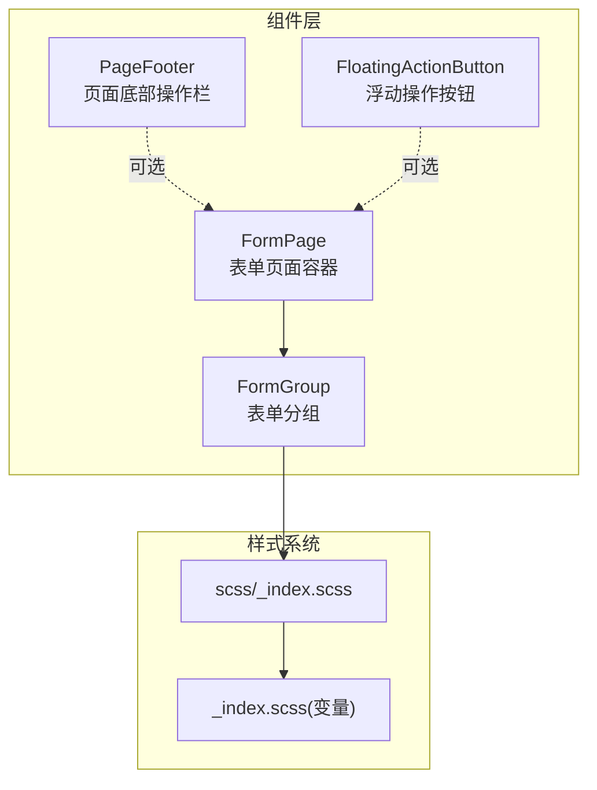
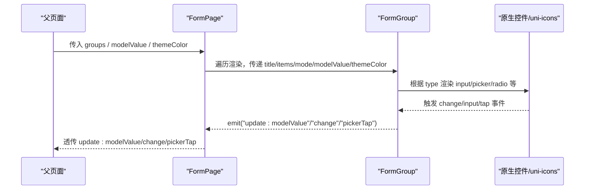
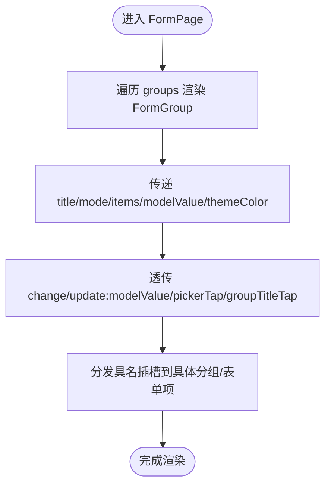
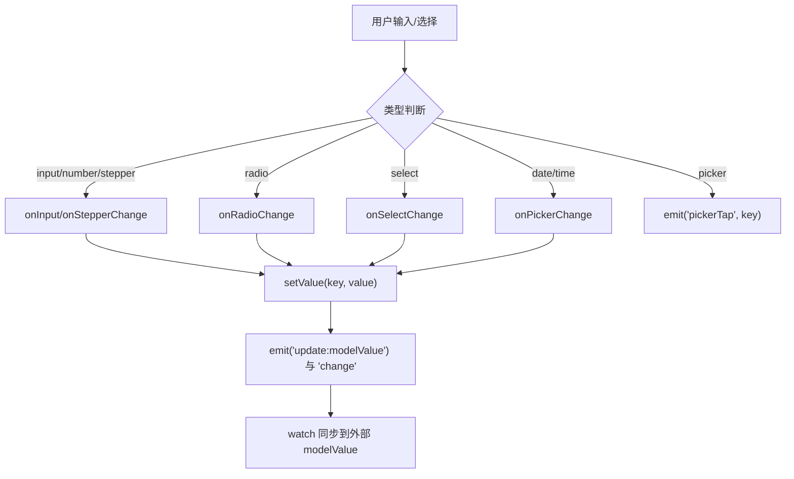
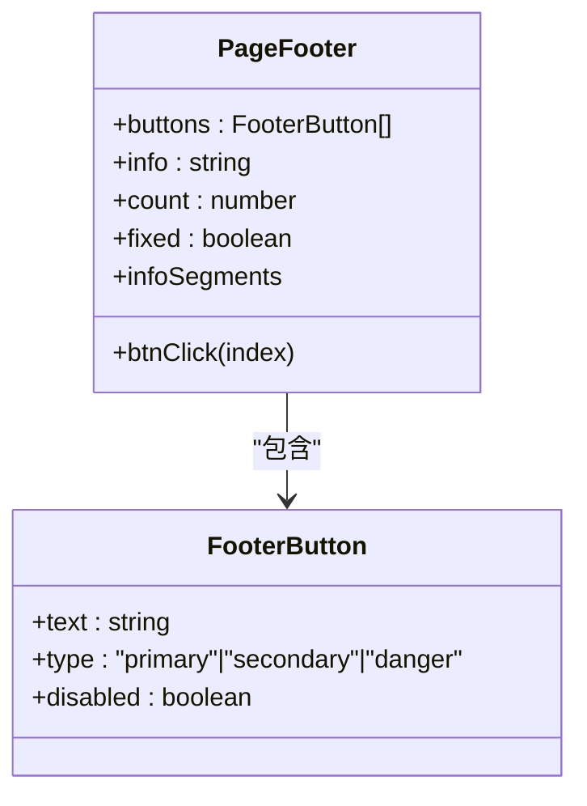
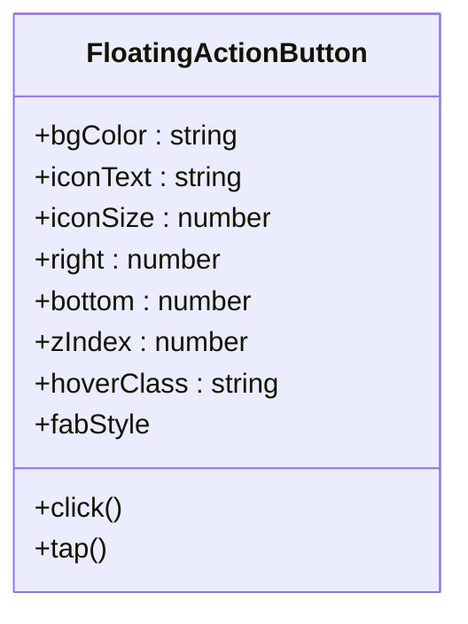
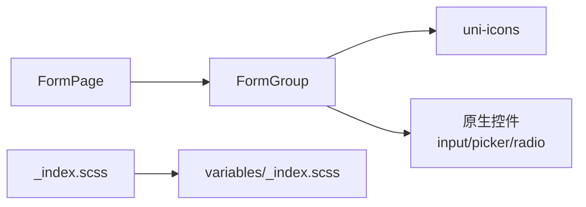

# 组件化开发体系

<cite>
**本文引用的文件**
- [form-page/index.vue](file://class_times_record/src/components/form-page/index.vue)
- [form-group/index.vue](file://class_times_record/src/components/form-group/index.vue)
- [form-group/types.d.ts](file://class_times_record/src/components/form-group/types.d.ts)
- [page-footer/index.vue](file://class_times_record/src/components/page-footer/index.vue)
- [page-footer/types.d.ts](file://class_times_record/src/components/page-footer/types.d.ts)
- [floating-action-button/index.vue](file://class_times_record/src/components/floating-action-button/index.vue)
- [static/scss/_index.scss](file://class_times_record/src/static/scss/_index.scss)
- [static/scss/variables/_index.scss](file://class_times_record/src/static/scss/variables/_index.scss)
</cite>

## 目录
1. [引言](#引言)
2. [项目结构](#项目结构)
3. [核心组件](#核心组件)
4. [架构总览](#架构总览)
5. [详细组件分析](#详细组件分析)
6. [依赖关系分析](#依赖关系分析)
7. [性能与体验优化](#性能与体验优化)
8. [样式与主题系统](#样式与主题系统)
9. [与 uni-ui 集成与扩展](#与-uni-ui-集成与扩展)
10. [测试与文档策略](#测试与文档策略)
11. [最佳实践与复用指南](#最佳实践与复用指南)
12. [故障排查](#故障排查)
13. [结论](#结论)

## 引言
本文件面向小程序端（uni-app + Vue 3）的组件化开发体系，聚焦于表单页面组织、分组渲染、底部操作栏与浮动按钮等核心组件的设计与实现。文档从设计理念、Props 接口、事件通信、插槽模式、样式变量与主题定制、响应式适配、性能优化、测试与文档生成，以及与 uni-ui 的集成扩展等方面进行全面说明，帮助团队构建可复用、可维护、可扩展的小程序 UI 组件库。

## 项目结构
本项目采用“按功能域组织”的组件目录结构，核心自定义组件位于 components 目录下，每个组件包含模板、脚本与样式，类型定义独立存放便于复用与文档生成。

图表来源
- [form-page/index.vue:1-58](file://class_times_record/src/components/form-page/index.vue#L1-L58)
- [form-group/index.vue:1-630](file://class_times_record/src/components/form-group/index.vue#L1-L630)
- [page-footer/index.vue:1-121](file://class_times_record/src/components/page-footer/index.vue#L1-L121)
- [floating-action-button/index.vue:1-75](file://class_times_record/src/components/floating-action-button/index.vue#L1-L75)
- [static/scss/_index.scss:1-2](file://class_times_record/src/static/scss/_index.scss#L1-L2)
- [static/scss/variables/_index.scss:1-8](file://class_times_record/src/static/scss/variables/_index.scss#L1-L8)

章节来源
- [form-page/index.vue:1-58](file://class_times_record/src/components/form-page/index.vue#L1-L58)
- [form-group/index.vue:1-630](file://class_times_record/src/components/form-group/index.vue#L1-L630)
- [page-footer/index.vue:1-121](file://class_times_record/src/components/page-footer/index.vue#L1-L121)
- [floating-action-button/index.vue:1-75](file://class_times_record/src/components/floating-action-button/index.vue#L1-L75)
- [static/scss/_index.scss:1-2](file://class_times_record/src/static/scss/_index.scss#L1-L2)
- [static/scss/variables/_index.scss:1-8](file://class_times_record/src/static/scss/variables/_index.scss#L1-L8)

## 核心组件
- FormPage：多分组表单页面容器，负责将 groups 配置逐项渲染为 FormGroup，并透传 modelValue、主题色与事件。
- FormGroup：单个表单分组，支持 edit/display 两种模式，通过 items 配置驱动渲染多种表单项（input、number、textarea、radio、select、date、time、picker、stepper、avatar、slot）。
- PageFooter：页面底部固定或普通布局的操作栏，支持单按钮、双按钮、多按钮与信息计数展示。
- FloatingActionButton：右下角浮动操作按钮，支持渐变背景、安全区适配与点击事件。

章节来源
- [form-page/index.vue:1-58](file://class_times_record/src/components/form-page/index.vue#L1-L58)
- [form-group/index.vue:1-630](file://class_times_record/src/components/form-group/index.vue#L1-L630)
- [page-footer/index.vue:1-121](file://class_times_record/src/components/page-footer/index.vue#L1-L121)
- [floating-action-button/index.vue:1-75](file://class_times_record/src/components/floating-action-button/index.vue#L1-L75)

## 架构总览
组件间职责清晰、耦合度低：FormPage 聚合多个 FormGroup；FormGroup 内部处理数据读写与交互；PageFooter 与 FAB 作为通用 UI 元素被页面按需引入。

图表来源
- [form-page/index.vue:1-58](file://class_times_record/src/components/form-page/index.vue#L1-L58)
- [form-group/index.vue:1-630](file://class_times_record/src/components/form-group/index.vue#L1-L630)

## 详细组件分析

### FormPage 组件
- 设计目标：以声明式 groups 配置驱动多分组表单渲染，统一透传 modelValue、主题色与事件。
- Props 接口
  - groups: FormGroupConfig[]，描述分组标题、模式、必填标记与 items 列表。
  - modelValue?: Record<string, any>，表单数据对象，支持双向绑定。
  - themeColor?: string，主题色，默认使用组件内默认值。
- 事件机制
  - update:modelValue：向上传递完整表单数据更新。
  - change：字段级变更事件，payload 包含 key 与 value。
  - pickerTap：用于跳转选择器页面的键名。
  - groupTitleTap：分组标题右侧额外区域点击事件，携带分组索引。
- 插槽模式
  - group-title-extra-{index}：为特定分组标题右侧注入内容。
  - group-{index}-{item.key}：针对某分组某项的具名插槽，作用域提供 modelValue 与 item。
  - group-{index}：在分组末尾追加自定义内容。

图表来源
- [form-page/index.vue:1-58](file://class_times_record/src/components/form-page/index.vue#L1-L58)

章节来源
- [form-page/index.vue:1-58](file://class_times_record/src/components/form-page/index.vue#L1-L58)

### FormGroup 组件
- 设计目标：以 items 配置驱动渲染不同表单项，同时支持 display 只读模式与 edit 编辑模式。
- Props 接口
  - title?: string，分组标题。
  - mode?: "edit" | "display"，渲染模式。
  - titleStyle?: "theme" | "dark"，标题风格。
  - required?: boolean，分组级别必填标记。
  - items?: FormItemConfig[]，表单项配置数组。
  - modelValue?: Record<string, any>，表单数据对象。
  - themeColor?: string，主题色。
- 事件机制
  - update:modelValue：完整表单数据更新。
  - change：字段级变更事件 {key, value}。
  - pickerTap：点击 picker 类型时返回 key，由父组件决定跳转逻辑。
  - titleExtraTap：标题右侧额外区域点击事件。
- 数据流与本地缓存
  - 内部维护 localForm 影子对象，避免频繁引用重构导致的输入卡顿。
  - watch(modelValue) 浅拷贝同步到 localForm，写入后深拷贝抛出 update:modelValue。
  - getValue/setValue 支持点号嵌套路径访问与自动创建中间对象。
- 表单项类型与行为
  - input/number：文本/数字输入，number 类型自动过滤非数字字符，支持 allowNegative 负数控制。
  - textarea：多行文本，auto-height。
  - radio：单选组，智能还原 options 中原始类型（布尔/数字/字符串）。
  - select：下拉选择器，基于 picker mode=selector，显示 label 文本。
  - date/time：日期/时间选择器，支持 column 纵向布局。
  - picker：整行可点击，触发 pickerTap 交由父组件处理跳转。
  - stepper：步进器，支持 min/max 限制。
  - avatar：头像选择，调用 chooseImage 获取临时路径。
  - slot：通过 item.type="slot" 配合具名插槽完全自定义。
- 展示模式（display）
  - 所有非 slot 类型统一渲染为 info-item，空值回退 emptyText 或“未填写”。
  - 支持 format 函数对值进行格式化输出。

图表来源
- [form-group/index.vue:1-630](file://class_times_record/src/components/form-group/index.vue#L1-L630)

章节来源
- [form-group/index.vue:1-630](file://class_times_record/src/components/form-group/index.vue#L1-L630)
- [form-group/types.d.ts:1-157](file://class_times_record/src/components/form-group/types.d.ts#L1-L157)

### PageFooter 组件
- 设计目标：提供统一的底部操作栏，支持信息计数与多按钮布局。
- Props 接口
  - buttons?: FooterButton[]，按钮配置数组。
  - info?: string，左侧信息文本，支持 {{count}} 占位符。
  - count?: number，占位符替换数值。
  - fixed?: boolean，是否固定定位在页面底部。
- 事件机制
  - btnClick(index)：按钮点击事件，返回按钮索引。
- 计算属性
  - infoSegments：将 info 拆分为 text/count 片段，用于高亮显示数量。

图表来源
- [page-footer/index.vue:1-121](file://class_times_record/src/components/page-footer/index.vue#L1-L121)
- [page-footer/types.d.ts:1-22](file://class_times_record/src/components/page-footer/types.d.ts#L1-L22)

章节来源
- [page-footer/index.vue:1-121](file://class_times_record/src/components/page-footer/index.vue#L1-L121)
- [page-footer/types.d.ts:1-22](file://class_times_record/src/components/page-footer/types.d.ts#L1-L22)

### FloatingActionButton 组件
- 设计目标：提供右下角浮动操作按钮，支持渐变背景与安全区适配。
- Props 接口
  - bgColor?: string，背景色或渐变色。
  - iconText?: string，默认图标文本。
  - iconSize?: number，图标字体大小。
  - right?: number，距离右侧 rpx。
  - bottom?: number，距离底部 rpx。
  - zIndex?: number，层级。
  - hoverClass?: string，点击态类名。
- 事件机制
  - click/tap：点击事件，兼容 uni 习惯。
- 样式计算
  - fabStyle：动态计算背景、位置、阴影，自动加上 --window-bottom 安全距离。

图表来源
- [floating-action-button/index.vue:1-75](file://class_times_record/src/components/floating-action-button/index.vue#L1-L75)

章节来源
- [floating-action-button/index.vue:1-75](file://class_times_record/src/components/floating-action-button/index.vue#L1-L75)

## 依赖关系分析
- FormPage 依赖 FormGroup 进行分组渲染。
- FormGroup 依赖 uni-icons 图标组件与原生 picker/input/radio 等控件。
- 样式系统通过 scss/_index.scss 引入 variables/_index.scss 中的主题变量。

图表来源
- [form-page/index.vue:1-58](file://class_times_record/src/components/form-page/index.vue#L1-L58)
- [form-group/index.vue:1-630](file://class_times_record/src/components/form-group/index.vue#L1-L630)
- [static/scss/_index.scss:1-2](file://class_times_record/src/static/scss/_index.scss#L1-L2)
- [static/scss/variables/_index.scss:1-8](file://class_times_record/src/static/scss/variables/_index.scss#L1-L8)

章节来源
- [form-page/index.vue:1-58](file://class_times_record/src/components/form-page/index.vue#L1-L58)
- [form-group/index.vue:1-630](file://class_times_record/src/components/form-group/index.vue#L1-L630)
- [static/scss/_index.scss:1-2](file://class_times_record/src/static/scss/_index.scss#L1-L2)
- [static/scss/variables/_index.scss:1-8](file://class_times_record/src/static/scss/variables/_index.scss#L1-L8)

## 性能与体验优化
- 局部状态隔离：FormGroup 使用 localForm 减少因外层引用变化导致的频繁 Diff，提升输入流畅度。
- 浅拷贝同步：watch(modelValue) 仅做浅拷贝，避免 deep 监听带来的重复同步开销。
- 值写入深拷贝：setValue 中对 localForm 深拷贝后再抛出 update:modelValue，防止父子共享同一内存地址导致通知错乱。
- 输入过滤与类型还原：number/stepper 输入过滤非数字字符，radio 智能还原 options 中原始类型，减少上层处理成本。
- 展示模式优化：display 模式下统一渲染 info-item，空值回退与 format 函数减少分支复杂度。
- 安全区适配：FAB 使用 calc(bottom + var(--window-bottom)) 适配全面屏与小程序底部安全区。

章节来源
- [form-group/index.vue:1-630](file://class_times_record/src/components/form-group/index.vue#L1-L630)
- [floating-action-button/index.vue:1-75](file://class_times_record/src/components/floating-action-button/index.vue#L1-L75)

## 样式与主题系统
- 变量管理：通过 static/scss/variables/_index.scss 集中定义主题色与背景色变量，便于全局统一与切换。
- 模块导入：static/scss/_index.scss 使用 @forward 引入变量模块，保持样式模块化与可维护性。
- 组件样式：各组件使用 scoped 样式并通过 src 引用外部 scss 文件，确保样式隔离与复用。
- 主题定制建议：
  - 新增主题色：在 variables/_index.scss 中扩展变量，并在组件 props 中暴露 themeColor 以便覆盖。
  - 响应式适配：优先使用 rpx 单位，结合 flex 布局与 safe-area-inset-bottom 适配不同屏幕。

章节来源
- [static/scss/_index.scss:1-2](file://class_times_record/src/static/scss/_index.scss#L1-L2)
- [static/scss/variables/_index.scss:1-8](file://class_times_record/src/static/scss/variables/_index.scss#L1-L8)

## 与 uni-ui 集成与扩展
- 图标集成：FormGroup 中使用 uni-icons 提供箭头、日历、相机等图标，增强交互提示。
- 选择器扩展：
  - 使用原生 picker 实现 select/date/time 选择器，降低第三方依赖。
  - 对于复杂选择场景，可通过 picker 类型触发 pickerTap 事件，由父组件跳转到 uni-data-picker 或自定义选择页。
- 表单生态：
  - 当前组件自研表单能力，若需更强大的校验与联动，可在父页面集成 uni-forms，将 FormGroup 作为子项嵌入。
  - 通过具名插槽与配置驱动，保持与现有 API 兼容的同时平滑迁移。

章节来源
- [form-group/index.vue:1-630](file://class_times_record/src/components/form-group/index.vue#L1-L630)

## 测试与文档策略
- 单元测试建议：
  - 针对 FormGroup 的 setValue/getValue 路径解析、number 输入过滤、radio 类型还原、stepper 边界值等进行断言。
  - 针对 PageFooter 的 infoSegments 计算、按钮禁用态与点击事件进行验证。
  - 针对 FAB 的 fabStyle 计算与安全区适配进行快照测试。
- 端到端测试建议：
  - 模拟用户输入与选择，验证 update:modelValue 与 change 事件的数据一致性。
  - 验证 pickerTap 事件触发后的路由跳转逻辑。
- 文档生成策略：
  - 基于 types.d.ts 自动生成 Props 表格与示例用法。
  - 为每个组件编写 README，包含用途、Props、事件、插槽与示例代码路径。
  - 使用 Storybook 或自建站点展示组件在不同模式下的效果。

[本节为方法论指导，不直接分析具体文件]

## 最佳实践与复用指南
- 配置驱动：尽量通过 items/groups 配置驱动渲染，减少模板分支与样板代码。
- 事件最小化：对外暴露必要事件（update:modelValue、change、pickerTap），内部处理细节，降低父组件负担。
- 插槽命名规范：使用 group-{index}-{item.key} 与 group-title-extra-{index} 等具名插槽，保证可预测性与可维护性。
- 主题色透传：在 FormPage 中统一接收 themeColor 并传递给 FormGroup，确保视觉一致性。
- 安全区适配：FAB 与固定底部组件应使用 var(--window-bottom) 或平台提供的安全区 API。
- 类型先行：在 types.d.ts 中明确定义配置接口，利用 TypeScript 推导与约束，提高健壮性。

[本节为方法论指导，不直接分析具体文件]

## 故障排查
- 输入卡顿：检查是否在 watch 中使用了 deep 监听，改为浅拷贝同步；确认 setValue 中深拷贝后再抛出事件。
- 值类型异常：确认 radio 的 options 中 value 是否为期望类型；number 输入是否启用 allowNegative。
- 选择器无选中：检查 getSelectIndex 与 getSelectLabel 的匹配逻辑，确保 options 的 value 与 modelValue 一致。
- 底部遮挡：确认 PageFooter 的 fixed 与 FAB 的 bottom 设置，必要时调整安全区适配。
- 主题不一致：检查 themeColor 透传链路与变量覆盖是否正确。

章节来源
- [form-group/index.vue:1-630](file://class_times_record/src/components/form-group/index.vue#L1-L630)
- [page-footer/index.vue:1-121](file://class_times_record/src/components/page-footer/index.vue#L1-L121)
- [floating-action-button/index.vue:1-75](file://class_times_record/src/components/floating-action-button/index.vue#L1-L75)

## 结论
本组件化体系以配置驱动为核心，结合清晰的 Props/事件/插槽契约与完善的类型定义，实现了高内聚、低耦合的可复用表单与通用 UI 组件。通过主题变量管理与安全区适配，保证了跨设备的一致体验。建议在后续迭代中持续完善测试与文档，逐步接入 uni-forms 等生态组件，进一步提升表单能力与开发效率。