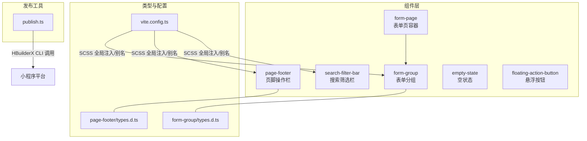
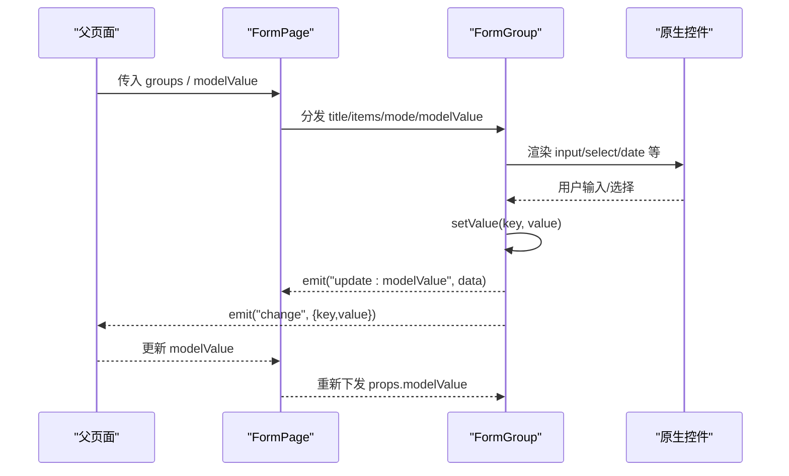
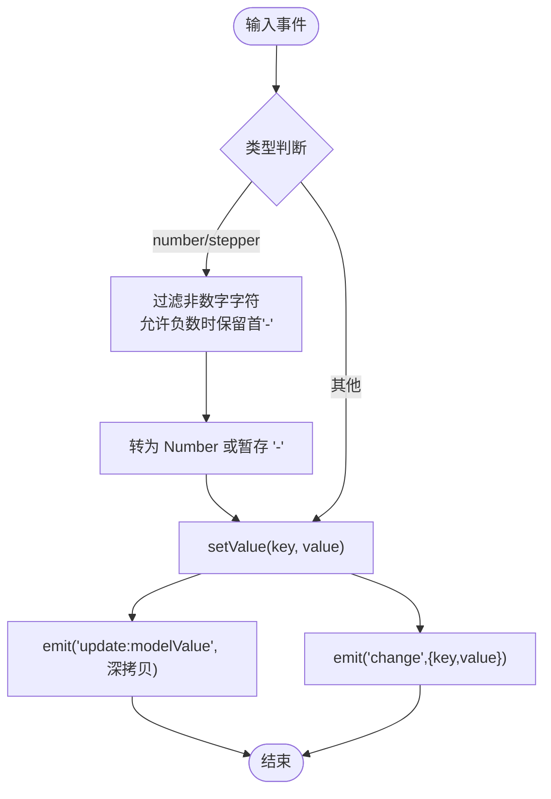
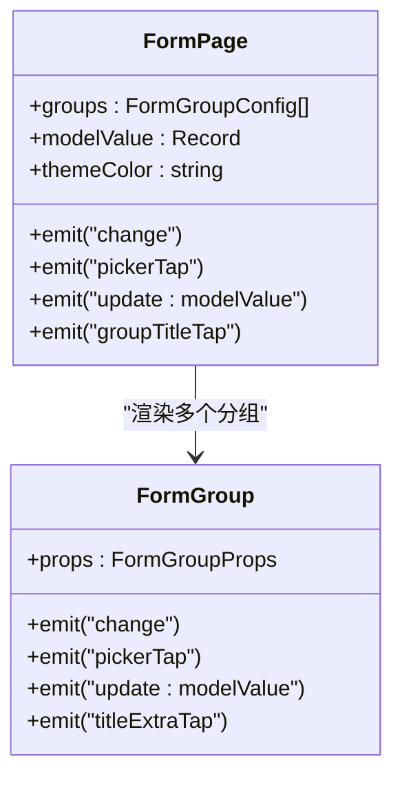
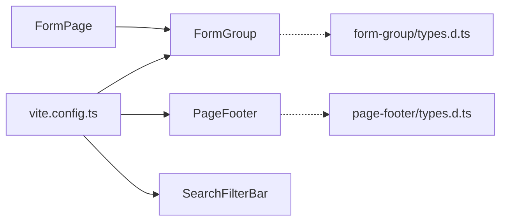

# 组件开发指南

<cite>
**本文引用的文件**   
- [class_times_record/src/components/form-group/index.vue](file://class_times_record/src/components/form-group/index.vue)
- [class_times_record/src/components/form-page/index.vue](file://class_times_record/src/components/form-page/index.vue)
- [class_times_record/src/components/page-footer/index.vue](file://class_times_record/src/components/page-footer/index.vue)
- [class_times_record/src/components/search-filter-bar/index.vue](file://class_times_record/src/components/search-filter-bar/index.vue)
- [class_times_record/src/components/empty-state/index.vue](file://class_times_record/src/components/empty-state/index.vue)
- [class_times_record/src/components/floating-action-button/index.vue](file://class_times_record/src/components/floating-action-button/index.vue)
- [class_times_record/src/components/form-group/types.d.ts](file://class_times_record/src/components/form-group/types.d.ts)
- [class_times_record/src/components/page-footer/types.d.ts](file://class_times_record/src/components/page-footer/types.d.ts)
- [class_times_record/publish.ts](file://class_times_record/publish.ts)
- [class_times_record/vite.config.ts](file://class_times_record/vite.config.ts)
</cite>

## 目录
1. [简介](#简介)
2. [项目结构](#项目结构)
3. [核心组件](#核心组件)
4. [架构总览](#架构总览)
5. [详细组件分析](#详细组件分析)
6. [依赖关系分析](#依赖关系分析)
7. [性能与稳定性](#性能与稳定性)
8. [测试与断言策略](#测试与断言策略)
9. [打包发布与版本控制](#打包发布与版本控制)
10. [文档与演示](#文档与演示)
11. [故障排查](#故障排查)
12. [结论](#结论)

## 简介
本指南面向小程序（uni-app）前端团队，系统化梳理组件开发规范、编码标准与最佳实践。围绕表单驱动渲染、页面底部操作栏、搜索筛选、空状态展示与悬浮按钮等通用能力，给出类型定义、事件通信、数据流设计、生命周期管理、单元测试、打包发布、性能监控与调试方法，并总结复杂业务组件的重构经验。

## 项目结构
本项目采用“按功能域组织”的组件目录结构，公共 UI 组件集中在 class_times_record/src/components 下，配合独立的类型定义文件 types.d.ts 进行强约束。构建配置通过 vite.config.ts 统一别名与 SCSS 全局变量注入；发布脚本 publish.ts 封装 HBuilderX CLI 自动化上传流程。

图表来源
- [class_times_record/src/components/form-page/index.vue:1-58](file://class_times_record/src/components/form-page/index.vue#L1-L58)
- [class_times_record/src/components/form-group/index.vue:1-630](file://class_times_record/src/components/form-group/index.vue#L1-L630)
- [class_times_record/src/components/page-footer/index.vue:1-121](file://class_times_record/src/components/page-footer/index.vue#L1-L121)
- [class_times_record/src/components/search-filter-bar/index.vue:1-186](file://class_times_record/src/components/search-filter-bar/index.vue#L1-L186)
- [class_times_record/src/components/empty-state/index.vue:1-58](file://class_times_record/src/components/empty-state/index.vue#L1-L58)
- [class_times_record/src/components/floating-action-button/index.vue:1-75](file://class_times_record/src/components/floating-action-button/index.vue#L1-L75)
- [class_times_record/src/components/form-group/types.d.ts:1-157](file://class_times_record/src/components/form-group/types.d.ts#L1-L157)
- [class_times_record/src/components/page-footer/types.d.ts:1-22](file://class_times_record/src/components/page-footer/types.d.ts#L1-L22)
- [class_times_record/vite.config.ts:1-30](file://class_times_record/vite.config.ts#L1-L30)
- [class_times_record/publish.ts:1-61](file://class_times_record/publish.ts#L1-L61)

章节来源
- [class_times_record/src/components/form-page/index.vue:1-58](file://class_times_record/src/components/form-page/index.vue#L1-L58)
- [class_times_record/src/components/form-group/index.vue:1-630](file://class_times_record/src/components/form-group/index.vue#L1-L630)
- [class_times_record/src/components/page-footer/index.vue:1-121](file://class_times_record/src/components/page-footer/index.vue#L1-L121)
- [class_times_record/src/components/search-filter-bar/index.vue:1-186](file://class_times_record/src/components/search-filter-bar/index.vue#L1-L186)
- [class_times_record/src/components/empty-state/index.vue:1-58](file://class_times_record/src/components/empty-state/index.vue#L1-L58)
- [class_times_record/src/components/floating-action-button/index.vue:1-75](file://class_times_record/src/components/floating-action-button/index.vue#L1-L75)
- [class_times_record/src/components/form-group/types.d.ts:1-157](file://class_times_record/src/components/form-group/types.d.ts#L1-L157)
- [class_times_record/src/components/page-footer/types.d.ts:1-22](file://class_times_record/src/components/page-footer/types.d.ts#L1-L22)
- [class_times_record/vite.config.ts:1-30](file://class_times_record/vite.config.ts#L1-L30)
- [class_times_record/publish.ts:1-61](file://class_times_record/publish.ts#L1-L61)

## 核心组件
- 表单分组 FormGroup：配置驱动的表单项渲染器，支持 edit/display 双模式、多控件类型、双向绑定与事件透传。
- 表单页 FormPage：聚合多个 FormGroup，提供统一的 v-model 与事件转发。
- 页脚 PageFooter：固定或普通布局的底部操作栏，支持信息+按钮组合。
- 搜索筛选 SearchFilterBar：搜索框 + 下拉筛选，维护 activeFilters 与 keyword。
- 空状态 EmptyState：统一空态展示。
- 悬浮按钮 FloatingActionButton：可配置位置、样式与交互的悬浮入口。

章节来源
- [class_times_record/src/components/form-group/index.vue:1-630](file://class_times_record/src/components/form-group/index.vue#L1-L630)
- [class_times_record/src/components/form-page/index.vue:1-58](file://class_times_record/src/components/form-page/index.vue#L1-L58)
- [class_times_record/src/components/page-footer/index.vue:1-121](file://class_times_record/src/components/page-footer/index.vue#L1-L121)
- [class_times_record/src/components/search-filter-bar/index.vue:1-186](file://class_times_record/src/components/search-filter-bar/index.vue#L1-L186)
- [class_times_record/src/components/empty-state/index.vue:1-58](file://class_times_record/src/components/empty-state/index.vue#L1-L58)
- [class_times_record/src/components/floating-action-button/index.vue:1-75](file://class_times_record/src/components/floating-action-button/index.vue#L1-L75)

## 架构总览
组件间以“配置驱动 + 事件总线”的方式协作：FormPage 作为容器编排多个 FormGroup，FormGroup 内部维护局部表单影子对象，避免频繁引用重构导致的输入卡顿；所有变更通过 update:modelValue 与 change 事件向上传递。SearchFilterBar 独立维护 keyword 与 activeFilters，并通过 update 事件同步父级状态。PageFooter 仅负责按钮点击事件上报。

图表来源
- [class_times_record/src/components/form-page/index.vue:1-58](file://class_times_record/src/components/form-page/index.vue#L1-L58)
- [class_times_record/src/components/form-group/index.vue:1-630](file://class_times_record/src/components/form-group/index.vue#L1-L630)

## 详细组件分析

### 表单分组 FormGroup
- 职责与模式
  - edit 模式：渲染可编辑控件（input/textarea/radio/select/date/time/picker/stepper/avatar/slot）。
  - display 模式：将 items 渲染为只读 info-item，支持 emptyText 回退与 format 函数格式化。
- 数据流
  - 内部 localForm 作为影子对象，监听外部 modelValue 浅拷贝同步，避免 deep watch 导致输入抖动。
  - setValue 支持点号路径写入，自动创建中间对象，并以深拷贝副本触发 update:modelValue 与 change。
- 输入处理
  - number/stepper 支持正负数过滤与边界限制，特殊字符拦截与 NaN 防护。
  - radio 根据 options 原始值还原布尔/数字/字符串类型。
  - select 通过索引匹配 options 写入 value。
- 事件
  - change: { key, value }
  - pickerTap: 自定义跳转型选择器
  - update:modelValue: 完整表单数据
  - titleExtraTap: 标题右侧扩展区域点击
- 插槽
  - #title-extra：标题右侧扩展
  - #item-slot：按 item.key 具名插槽，作用域包含 modelValue 与 item
  - 默认插槽：在 items 之后追加内容

图表来源
- [class_times_record/src/components/form-group/index.vue:456-490](file://class_times_record/src/components/form-group/index.vue#L456-L490)
- [class_times_record/src/components/form-group/index.vue:426-447](file://class_times_record/src/components/form-group/index.vue#L426-L447)

章节来源
- [class_times_record/src/components/form-group/index.vue:1-630](file://class_times_record/src/components/form-group/index.vue#L1-L630)
- [class_times_record/src/components/form-group/types.d.ts:1-157](file://class_times_record/src/components/form-group/types.d.ts#L1-L157)

### 表单页 FormPage
- 职责：遍历 groups，将每个 group 映射为一个 FormGroup，透传 themeColor 与事件。
- 事件转发：将子组件的 change、pickerTap、update:modelValue、groupTitleTap 向上抛出。
- 插槽透传：将 #title-extra 与 #item-slot 按 index 与 slotItem.key 动态命名，便于父级精确覆盖。

图表来源
- [class_times_record/src/components/form-page/index.vue:1-58](file://class_times_record/src/components/form-page/index.vue#L1-L58)
- [class_times_record/src/components/form-group/index.vue:1-630](file://class_times_record/src/components/form-group/index.vue#L1-L630)

章节来源
- [class_times_record/src/components/form-page/index.vue:1-58](file://class_times_record/src/components/form-page/index.vue#L1-L58)

### 页脚 PageFooter
- 布局模式：单按钮居中、双按钮主次、三按钮以上均分。
- 信息区：info 文本支持 {{count}} 占位符，自动替换为主题色高亮数字。
- 定位：fixed 模式用于漂浮底部，带阴影与安全区适配。
- 事件：btnClick(index)。

章节来源
- [class_times_record/src/components/page-footer/index.vue:1-121](file://class_times_record/src/components/page-footer/index.vue#L1-L121)
- [class_times_record/src/components/page-footer/types.d.ts:1-22](file://class_times_record/src/components/page-footer/types.d.ts#L1-L22)

### 搜索筛选 SearchFilterBar
- 功能：keyword 双向绑定；filters 配置生成下拉选项；activeFilters 承载当前选中项。
- 交互：点击筛选项后关闭下拉，触发 filterChange 与 update:activeFilters。
- 使用注意：父容器需 sticky 定位与足够高度，确保下拉不被遮挡。

章节来源
- [class_times_record/src/components/search-filter-bar/index.vue:1-186](file://class_times_record/src/components/search-filter-bar/index.vue#L1-L186)

### 空状态 EmptyState
- 用途：列表为空、搜索无结果等场景的统一占位。
- Props：text、tip。

章节来源
- [class_times_record/src/components/empty-state/index.vue:1-58](file://class_times_record/src/components/empty-state/index.vue#L1-L58)

### 悬浮按钮 FloatingActionButton
- 特性：支持背景渐变、图标大小、位置偏移、层级、hoverClass。
- 兼容：自动计算系统窗口底部安全距离 var(--window-bottom)。
- 事件：click、tap。

章节来源
- [class_times_record/src/components/floating-action-button/index.vue:1-75](file://class_times_record/src/components/floating-action-button/index.vue#L1-L75)

## 依赖关系分析
- 组件内聚性
  - FormGroup 内部实现完整的数据读写与事件派发，对外暴露最小接口，内聚度高。
  - FormPage 仅做编排与透传，职责单一。
- 耦合点
  - FormPage 依赖 FormGroup 的事件契约（change/update:modelValue/pickerTap/groupTitleTap）。
  - 各组件通过 types.d.ts 明确 Props 类型，降低耦合风险。
- 外部依赖
  - uni-app 原生 API（如 chooseImage、picker、radio-group）。
  - SCSS 全局变量由 vite.config.ts 注入。

图表来源
- [class_times_record/src/components/form-page/index.vue:1-58](file://class_times_record/src/components/form-page/index.vue#L1-L58)
- [class_times_record/src/components/form-group/index.vue:1-630](file://class_times_record/src/components/form-group/index.vue#L1-L630)
- [class_times_record/src/components/page-footer/index.vue:1-121](file://class_times_record/src/components/page-footer/index.vue#L1-L121)
- [class_times_record/src/components/search-filter-bar/index.vue:1-186](file://class_times_record/src/components/search-filter-bar/index.vue#L1-L186)
- [class_times_record/src/components/form-group/types.d.ts:1-157](file://class_times_record/src/components/form-group/types.d.ts#L1-L157)
- [class_times_record/src/components/page-footer/types.d.ts:1-22](file://class_times_record/src/components/page-footer/types.d.ts#L1-L22)
- [class_times_record/vite.config.ts:1-30](file://class_times_record/vite.config.ts#L1-L30)

章节来源
- [class_times_record/src/components/form-page/index.vue:1-58](file://class_times_record/src/components/form-page/index.vue#L1-L58)
- [class_times_record/src/components/form-group/index.vue:1-630](file://class_times_record/src/components/form-group/index.vue#L1-L630)
- [class_times_record/src/components/page-footer/index.vue:1-121](file://class_times_record/src/components/page-footer/index.vue#L1-L121)
- [class_times_record/src/components/search-filter-bar/index.vue:1-186](file://class_times_record/src/components/search-filter-bar/index.vue#L1-L186)
- [class_times_record/src/components/form-group/types.d.ts:1-157](file://class_times_record/src/components/form-group/types.d.ts#L1-L157)
- [class_times_record/src/components/page-footer/types.d.ts:1-22](file://class_times_record/src/components/page-footer/types.d.ts#L1-L22)
- [class_times_record/vite.config.ts:1-30](file://class_times_record/vite.config.ts#L1-L30)

## 性能与稳定性
- 输入性能优化
  - FormGroup 使用 localForm 影子对象与浅拷贝同步，避免 deep watch 引起的频繁 Diff，显著缓解小程序输入卡顿。
- 数值输入健壮性
  - number/stepper 对非法字符进行过滤，并对 "-" 单独处理防止 NaN 污染数据。
- 显示模式优化
  - display 模式下通过 getDisplayValue 统一处理空值回退与格式化，减少上层逻辑复杂度。
- 样式与布局
  - PageFooter 与 FAB 使用 fixed 定位与 var(--window-bottom) 安全区适配，避免被系统 UI 遮挡。
- 建议
  - 大表单分页或懒加载分组，减少一次性渲染压力。
  - 长列表结合虚拟滚动或分页加载。
  - 图片资源压缩与缓存策略。

[本节为通用指导，不直接分析具体文件]

## 测试与断言策略
- 单元与 E2E
  - 可使用 Vitest 对纯函数与组件行为进行测试；E2E 可使用 Playwright 验证页面交互。
- 组件测试要点
  - 初始化：校验默认 props 与初始渲染。
  - 输入：模拟 input/change 事件，断言 update:modelValue 与 change 事件 payload。
  - 边界：number/stepper 的负数、越界、空串、NaN 防护。
  - 显示模式：display 模式下空值回退与 format 输出。
  - 插槽：#item-slot 与 #title-extra 的内容渲染。
- Mock 数据准备
  - 构造符合 FormItemConfig 的 items 数组，覆盖所有 type 分支。
  - 构造 filters 与 activeFilters 用于 SearchFilterBar 测试。
- 断言策略
  - 事件断言：捕获 emit 参数，校验 key/value 类型与格式。
  - DOM 断言：检查类名、文本、占位符、禁用态。
  - 副作用：如 chooseImage 调用，应 mock 成功回调并断言写入值。

[本节为通用指导，不直接分析具体文件]

## 打包发布与版本控制
- 自动化发布
  - 通过 publish.ts 读取 package.json 版本号，解析命令行参数（ver/desc/robot），拼接 HBuilderX CLI 命令执行微信小程序上传。
  - 支持实时打印编译日志，失败时输出错误信息。
- 构建配置
  - vite.config.ts 中配置 @ 别名与 SCSS 全局变量注入，解决 uni-app 别名解析问题与样式复用。
- 版本控制建议
  - 使用语义化版本，发布前更新 package.json version。
  - 提交记录遵循约定式提交，描述变更影响范围。

章节来源
- [class_times_record/publish.ts:1-61](file://class_times_record/publish.ts#L1-L61)
- [class_times_record/vite.config.ts:1-30](file://class_times_record/vite.config.ts#L1-L30)

## 文档与演示
- 文档自动生成
  - 基于 types.d.ts 的 JSDoc 注释与 README 模板，可集成到 CI 生成 API 文档。
- 在线演示
  - 使用 Storybook/VitePress 搭建组件故事与示例页面，提供交互预览与用例说明。
- 文档规范
  - 每个组件提供：用途、Props 表格、事件说明、插槽说明、示例代码、注意事项。

[本节为通用指导，不直接分析具体文件]

## 故障排查
- 输入卡顿
  - 检查是否开启 deep watch 监听 modelValue；确认 FormGroup 使用 localForm 与浅拷贝同步。
- 数值异常
  - 检查 number/stepper 的 allowNegative 与过滤逻辑，避免 "-" 转 Number 产生 NaN。
- 下拉遮挡
  - 确认 SearchFilterBar 父容器使用 sticky 定位与足够 z-index。
- 底部按钮被遮挡
  - 检查 PageFooter/FAB 的 fixed 定位与 var(--window-bottom) 安全区。
- 图片选择无效
  - 检查 chooseImage 成功回调是否正确写入对应字段。

章节来源
- [class_times_record/src/components/form-group/index.vue:394-400](file://class_times_record/src/components/form-group/index.vue#L394-L400)
- [class_times_record/src/components/form-group/index.vue:456-490](file://class_times_record/src/components/form-group/index.vue#L456-L490)
- [class_times_record/src/components/search-filter-bar/index.vue:169-186](file://class_times_record/src/components/search-filter-bar/index.vue#L169-L186)
- [class_times_record/src/components/floating-action-button/index.vue:48-66](file://class_times_record/src/components/floating-action-button/index.vue#L48-L66)
- [class_times_record/src/components/form-group/index.vue:619-626](file://class_times_record/src/components/form-group/index.vue#L619-L626)

## 结论
本指南总结了表单驱动渲染、事件通信、类型约束与发布流程的最佳实践。通过配置化与类型化，提升组件的可复用性与可维护性；通过本地影子对象与输入过滤，保障性能与健壮性；通过自动化发布与文档规范，提高交付效率与质量。建议在复杂业务场景中优先采用这些模式，并在迭代中持续完善测试与文档。