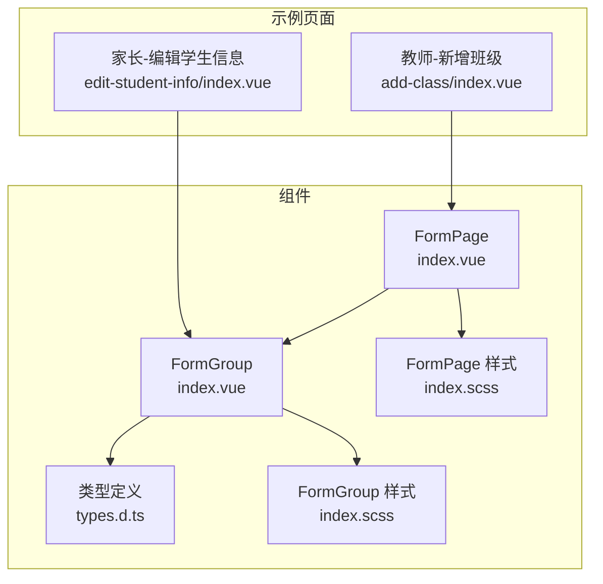
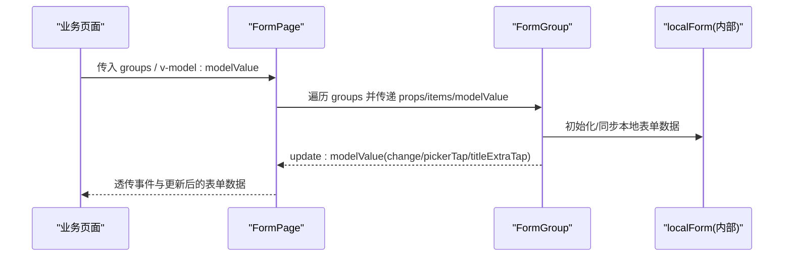
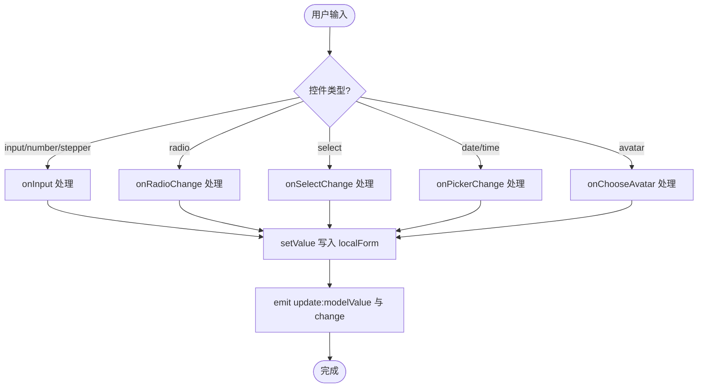

# 表单组件库

<cite>
**本文引用的文件**   
- [class_times_record/src/components/form-page/index.vue](file://class_times_record/src/components/form-page/index.vue)
- [class_times_record/src/components/form-page/index.scss](file://class_times_record/src/components/form-page/index.scss)
- [class_times_record/src/components/form-group/index.vue](file://class_times_record/src/components/form-group/index.vue)
- [class_times_record/src/components/form-group/index.scss](file://class_times_record/src/components/form-group/index.scss)
- [class_times_record/src/components/form-group/types.d.ts](file://class_times_record/src/components/form-group/types.d.ts)
- [class_times_record/src/pages/main/teacher/add-class/index.vue](file://class_times_record/src/pages/main/teacher/add-class/index.vue)
- [class_times_record/src/pages/main/parent/edit-student-info/index.vue](file://class_times_record/src/pages/main/parent/edit-student-info/index.vue)
</cite>

## 目录
1. [简介](#简介)
2. [项目结构](#项目结构)
3. [核心组件](#核心组件)
4. [架构总览](#架构总览)
5. [详细组件分析](#详细组件分析)
6. [依赖关系分析](#依赖关系分析)
7. [性能与体验优化](#性能与体验优化)
8. [样式定制与主题适配](#样式定制与主题适配)
9. [故障排查指南](#故障排查指南)
10. [结论](#结论)

## 简介
本组件库围绕“配置驱动 + 双向绑定”的表单范式，提供两个核心组件：
- FormPage 表单页面容器：负责多分组渲染、插槽透传与事件转发。
- FormGroup 表单分组：负责单个分组的标题、表单项渲染、值读写与事件派发。

组件支持多种内置控件类型（文本、数字、单选、下拉、日期、时间、步进器、头像选择、自定义插槽等），并提供 display 展示模式与 edit 编辑模式，满足复杂业务场景下的快速构建需求。

## 项目结构
- 组件位于 class_times_record/src/components 下，包含 form-page 与 form-group 两个子目录。
- 使用示例位于 class_times_record/src/pages 下的多个业务页面中，如教师端创建班级、家长端编辑学生信息等。



图表来源
- [class_times_record/src/components/form-page/index.vue:1-58](file://class_times_record/src/components/form-page/index.vue#L1-L58)
- [class_times_record/src/components/form-group/index.vue:1-630](file://class_times_record/src/components/form-group/index.vue#L1-L630)
- [class_times_record/src/components/form-group/types.d.ts:1-157](file://class_times_record/src/components/form-group/types.d.ts#L1-L157)
- [class_times_record/src/components/form-page/index.scss:1-5](file://class_times_record/src/components/form-page/index.scss#L1-L5)
- [class_times_record/src/components/form-group/index.scss:1-457](file://class_times_record/src/components/form-group/index.scss#L1-L457)
- [class_times_record/src/pages/main/teacher/add-class/index.vue:1-363](file://class_times_record/src/pages/main/teacher/add-class/index.vue#L1-L363)
- [class_times_record/src/pages/main/parent/edit-student-info/index.vue:1-140](file://class_times_record/src/pages/main/parent/edit-student-info/index.vue#L1-L140)

章节来源
- [class_times_record/src/components/form-page/index.vue:1-58](file://class_times_record/src/components/form-page/index.vue#L1-L58)
- [class_times_record/src/components/form-group/index.vue:1-630](file://class_times_record/src/components/form-group/index.vue#L1-L630)
- [class_times_record/src/components/form-group/types.d.ts:1-157](file://class_times_record/src/components/form-group/types.d.ts#L1-L157)
- [class_times_record/src/components/form-page/index.scss:1-5](file://class_times_record/src/components/form-page/index.scss#L1-L5)
- [class_times_record/src/components/form-group/index.scss:1-457](file://class_times_record/src/components/form-group/index.scss#L1-L457)
- [class_times_record/src/pages/main/teacher/add-class/index.vue:1-363](file://class_times_record/src/pages/main/teacher/add-class/index.vue#L1-L363)
- [class_times_record/src/pages/main/parent/edit-student-info/index.vue:1-140](file://class_times_record/src/pages/main/parent/edit-student-info/index.vue#L1-L140)

## 核心组件
- FormPage
  - 职责：接收 groups 配置数组，循环渲染多个 FormGroup；透传 modelValue 双向绑定；转发 change、pickerTap、update:modelValue、groupTitleTap 等事件；暴露 group 级与 item 级插槽以支持高度定制化内容。
  - Props：groups、modelValue、themeColor。
  - Events：change、pickerTap、update:modelValue、groupTitleTap。
- FormGroup
  - 职责：渲染分组标题、根据 items 配置渲染不同控件；维护内部 localForm 避免频繁引用重构；通过 setValue/getValue 实现点号路径读写；在 display 模式下统一渲染只读信息项。
  - Props：title、mode、titleStyle、required、items、modelValue、themeColor。
  - Events：change、pickerTap、update:modelValue、titleExtraTap。
  - 内置类型：input、number、textarea、radio、select、date、time、picker、stepper、avatar、slot、text（display）。

章节来源
- [class_times_record/src/components/form-page/index.vue:35-55](file://class_times_record/src/components/form-page/index.vue#L35-L55)
- [class_times_record/src/components/form-group/index.vue:319-380](file://class_times_record/src/components/form-group/index.vue#L319-L380)
- [class_times_record/src/components/form-group/types.d.ts:18-157](file://class_times_record/src/components/form-group/types.d.ts#L18-L157)

## 架构总览
FormPage 作为页面级容器，将 groups 配置逐项传递给 FormGroup；每个 FormGroup 基于 items 配置渲染具体控件，并通过事件机制与父组件通信。数据流采用 v-model 双向绑定，配合内部 localForm 提升输入性能。



图表来源
- [class_times_record/src/components/form-page/index.vue:1-33](file://class_times_record/src/components/form-page/index.vue#L1-L33)
- [class_times_record/src/components/form-group/index.vue:387-447](file://class_times_record/src/components/form-group/index.vue#L387-L447)

## 详细组件分析

### FormPage 组件
- 设计要点
  - 通过 v-for 渲染多个 FormGroup，并将 title、titleStyle、mode、required、items、modelValue、themeColor 透传。
  - 透传三个插槽：group-title-extra、item-slot、group-{index}，用于扩展标题右侧操作、行内自定义控件以及整组自定义区域。
  - 事件转发：change、pickerTap、update:modelValue、groupTitleTap。
- 关键 Props/Events
  - Props：groups、modelValue、themeColor。
  - Events：change、pickerTap、update:modelValue、groupTitleTap。
- 典型用法
  - 在业务页面中定义 groups 配置数组，结合 v-model 管理表单数据，监听 pickerTap 处理跨页选择回写。

章节来源
- [class_times_record/src/components/form-page/index.vue:1-58](file://class_times_record/src/components/form-page/index.vue#L1-L58)

### FormGroup 组件
- 设计要点
  - 两种模式：edit（可交互）与 display（只读）。
  - 标题栏支持 theme/dark 风格与必填标记，支持 title-prefix 与 title-extra 插槽。
  - 表单项通过 type 区分渲染逻辑，支持 column/block/inputAlign/noBorder/small 等布局与样式控制。
  - 内部维护 localForm，watch 浅拷贝同步外部 modelValue，setValue 写入后深拷贝抛出 update:modelValue 与 change。
  - 针对 number/stepper 做数值过滤与范围限制；radio/select 智能还原原始类型；avatar 调用 uni.chooseImage。
- 关键 Props/Events
  - Props：title、mode、titleStyle、required、items、modelValue、themeColor。
  - Events：change、pickerTap、update:modelValue、titleExtraTap。
- 内置类型说明
  - input/number：文本/数字输入，number 自动转 Number，支持 allowNegative。
  - textarea：多行文本，auto-height。
  - radio：选项来自 options，value 保持原始类型。
  - select：picker mode=selector，显示 label，选中值写入 value。
  - date/time：原生 picker，column 时带边框容器与图标。
  - picker：整行点击触发 pickerTap，由父组件处理跳转与回写。
  - stepper：加减按钮与输入框组合，min/max 限制。
  - avatar：点击选择图片，临时路径写入字段。
  - slot：通过 item.key 指定具名插槽，完全自定义内容。
  - text：display 模式下统一 info-item 展示。
- 数据访问与写入
  - getValue/setValue 支持点号嵌套路径，中间路径不存在时自动创建空对象。
  - getDisplayValue 在 display 模式下对空值进行回退，支持 format 函数格式化。
- 事件与交互
  - onInput/onRadioChange/onSelectChange/onPickerChange/onStepperChange/onChooseAvatar 分别处理对应控件变更。
  - getItemClass 生成动态 class，no-border/block/column/align-right 等。



图表来源
- [class_times_record/src/components/form-group/index.vue:456-490](file://class_times_record/src/components/form-group/index.vue#L456-L490)
- [class_times_record/src/components/form-group/index.vue:533-549](file://class_times_record/src/components/form-group/index.vue#L533-L549)
- [class_times_record/src/components/form-group/index.vue:582-598](file://class_times_record/src/components/form-group/index.vue#L582-L598)
- [class_times_record/src/components/form-group/index.vue:606-626](file://class_times_record/src/components/form-group/index.vue#L606-L626)

章节来源
- [class_times_record/src/components/form-group/index.vue:1-630](file://class_times_record/src/components/form-group/index.vue#L1-L630)
- [class_times_record/src/components/form-group/types.d.ts:1-157](file://class_times_record/src/components/form-group/types.d.ts#L1-L157)

### 使用示例与最佳实践

#### 示例一：教师端创建班级（复杂表单、动态时段、跨页选择）
- 使用 FormPage 承载多分组，第一组为基础信息（含任课老师 slot 自定义），第二组为上课日程（通过模板 #group-1 动态渲染卡片列表）。
- 通过 pickerTap 处理课程选择跳转，跨页事件更新 form 与 groups[0].items[1].pickerText。
- 提交前进行多层校验（必填、日期区间、时间先后等），再调用 API 提交。

章节来源
- [class_times_record/src/pages/main/teacher/add-class/index.vue:1-363](file://class_times_record/src/pages/main/teacher/add-class/index.vue#L1-L363)

#### 示例二：家长端编辑学生信息（简单表单、column 布局）
- 直接使用 FormGroup，mode="edit"，items 配置出生日期、学校、住址，均使用 column 纵向布局。
- 提交前进行必填校验，调用 API 保存。

章节来源
- [class_times_record/src/pages/main/parent/edit-student-info/index.vue:1-140](file://class_times_record/src/pages/main/parent/edit-student-info/index.vue#L1-L140)

## 依赖关系分析
- 组件间依赖
  - FormPage 依赖 FormGroup 进行分组渲染。
  - FormGroup 依赖 types.d.ts 中的类型定义，确保 items 配置的强类型约束。
- 外部依赖
  - 使用 uni-app 生态组件（uni-icons、picker、radio 等）与 API（uni.chooseImage）。
- 耦合与内聚
  - FormPage 仅做透传与转发，低耦合高内聚。
  - FormGroup 封装了所有控件渲染与数据写入逻辑，内聚性强，便于复用。

```mermaid
classDiagram
class FormPage {
+props : groups, modelValue, themeColor
+events : change, pickerTap, update : modelValue, groupTitleTap
+slots : group-title-extra, item-slot, group-{index}
}
class FormGroup {
+props : title, mode, titleStyle, required, items, modelValue, themeColor
+events : change, pickerTap, update : modelValue, titleExtraTap
+methods : getValue(key), setValue(key,value), getItemClass(item)
+slots : title-prefix, title-extra, item-slot, default
}
class Types {
+BaseFormItemConfig
+NumberFormItemConfig
+OtherFormItemConfig
+FormItemConfig
+FormGroupConfig
}
FormPage --> FormGroup : "渲染"
FormGroup --> Types : "类型约束"
```

图表来源
- [class_times_record/src/components/form-page/index.vue:35-55](file://class_times_record/src/components/form-page/index.vue#L35-L55)
- [class_times_record/src/components/form-group/index.vue:319-380](file://class_times_record/src/components/form-group/index.vue#L319-L380)
- [class_times_record/src/components/form-group/types.d.ts:1-157](file://class_times_record/src/components/form-group/types.d.ts#L1-L157)

章节来源
- [class_times_record/src/components/form-page/index.vue:1-58](file://class_times_record/src/components/form-page/index.vue#L1-L58)
- [class_times_record/src/components/form-group/index.vue:1-630](file://class_times_record/src/components/form-group/index.vue#L1-L630)
- [class_times_record/src/components/form-group/types.d.ts:1-157](file://class_times_record/src/components/form-group/types.d.ts#L1-L157)

## 性能与体验优化
- 输入性能
  - FormGroup 内部维护 localForm，避免每次输入都直接修改外层引用，减少小程序 Diff 开销。
  - watch 使用浅拷贝同步外部 modelValue，不开启 deep，防止输入时反复触发同步。
- 数值输入
  - number/stepper 输入时进行正则过滤，避免非法字符污染数据；允许负数时特殊处理 "-" 状态。
- 类型安全
  - radio 选项值保留原始类型（布尔/数字/字符串），避免字符串化导致比较失败。
- 渲染优化
  - 使用 key 稳定渲染列表；display 模式统一 info-item 渲染，减少分支复杂度。
- 用户体验
  - placeholder 提示、占位文本回退、紧凑间距 small、右对齐 align-right、block/column 布局等增强可读性与易用性。

章节来源
- [class_times_record/src/components/form-group/index.vue:387-447](file://class_times_record/src/components/form-group/index.vue#L387-L447)
- [class_times_record/src/components/form-group/index.vue:456-490](file://class_times_record/src/components/form-group/index.vue#L456-L490)
- [class_times_record/src/components/form-group/index.vue:533-549](file://class_times_record/src/components/form-group/index.vue#L533-L549)
- [class_times_record/src/components/form-group/index.vue:510-525](file://class_times_record/src/components/form-group/index.vue#L510-L525)

## 样式定制与主题适配
- 主题色
  - 通过 themeColor 属性控制 radio 选中色、装饰条颜色等；FormPage 默认 "#70a9a2"。
- 标题风格
  - titleStyle 支持 theme（主题色+宽装饰条）与 dark（深色+窄装饰条）。
- 布局与间距
  - block：上下排列（label 在上，控件在下）。
  - column：纵向布局且带边框容器（适合日期/长输入）。
  - no-border：移除底部分割线，常用于最后一项。
  - align-right：输入内容或步进器靠右对齐。
  - small：display 模式下减小行间距。
- 覆盖方式
  - 通过 item.itemClass 追加自定义类名；利用 :deep 穿透小程序组件节点进行微调。
  - 全局变量 $theme-color 与 $default-background-color 影响整体主题。

章节来源
- [class_times_record/src/components/form-group/index.scss:1-457](file://class_times_record/src/components/form-group/index.scss#L1-L457)
- [class_times_record/src/components/form-page/index.scss:1-5](file://class_times_record/src/components/form-page/index.scss#L1-L5)

## 故障排查指南
- 输入卡顿或闪烁
  - 检查是否直接修改外层 modelValue 引用；应通过 v-model 与组件内部 setValue 更新。
  - 确认 watch 未开启 deep，避免频繁同步。
- 数值异常
  - number/stepper 输入时注意 allowNegative 与过滤逻辑；避免 "-" 被转为 NaN。
- 类型不一致
  - radio 选项 value 应保持原始类型；若后端期望字符串，请在提交前转换。
- 选择器不显示或错位
  - 确认 picker 的 range/range-key/value 配置正确；column 模式下需使用 input-box 容器。
- 头像选择无效
  - 检查 uni.chooseImage 权限与返回值 tempFilePaths 是否正确写入。

章节来源
- [class_times_record/src/components/form-group/index.vue:456-490](file://class_times_record/src/components/form-group/index.vue#L456-L490)
- [class_times_record/src/components/form-group/index.vue:533-549](file://class_times_record/src/components/form-group/index.vue#L533-L549)
- [class_times_record/src/components/form-group/index.vue:619-626](file://class_times_record/src/components/form-group/index.vue#L619-L626)

## 结论
本表单组件库通过 FormPage 与 FormGroup 的组合，实现了“配置驱动 + 双向绑定 + 插槽扩展”的高内聚、低耦合方案。其内置丰富的控件类型与灵活的布局/样式能力，可满足从简单信息编辑到复杂动态表单的多场景需求。借助内部 localForm 与严格的类型定义，在保证性能的同时提升了开发效率与可维护性。