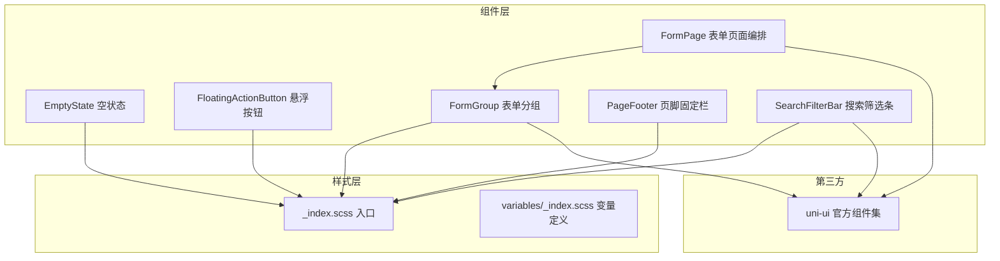
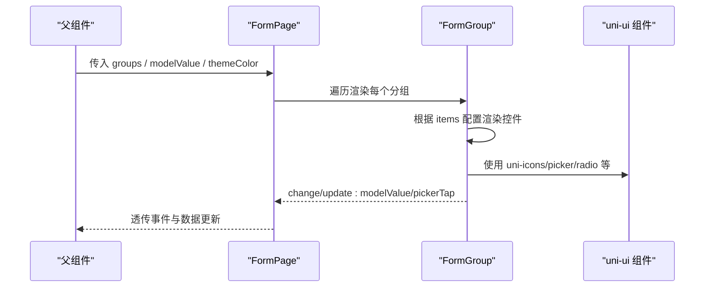
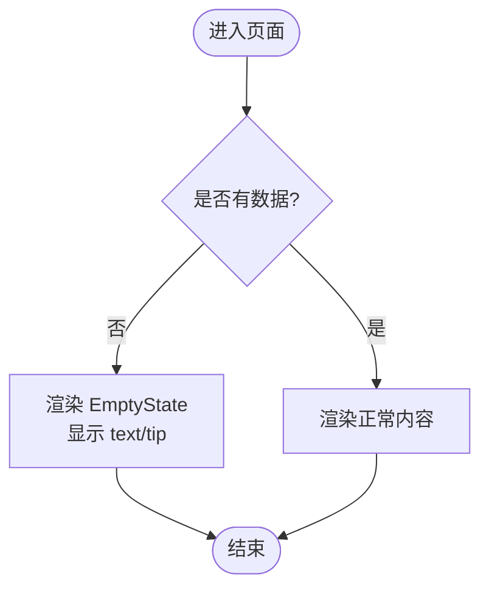
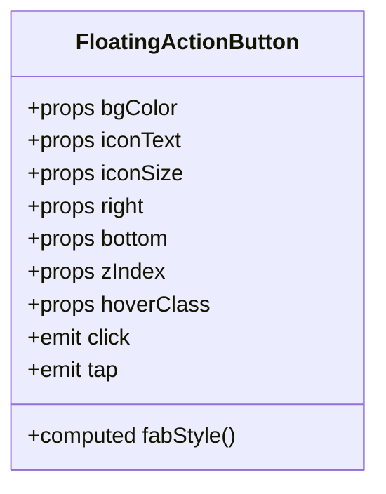
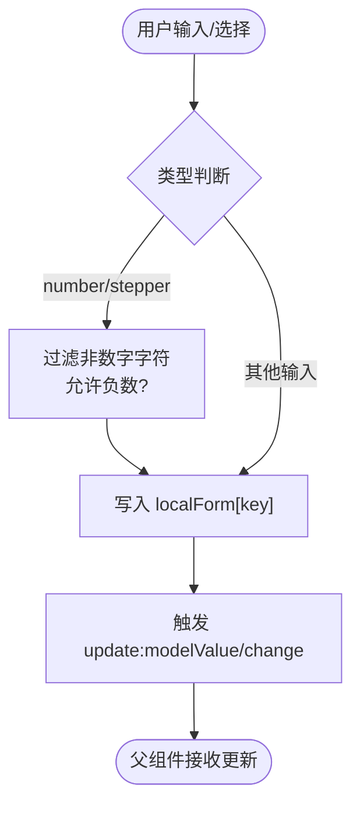
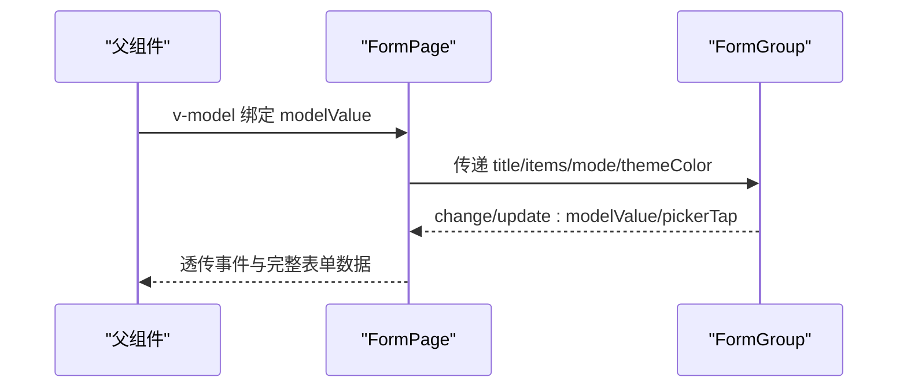
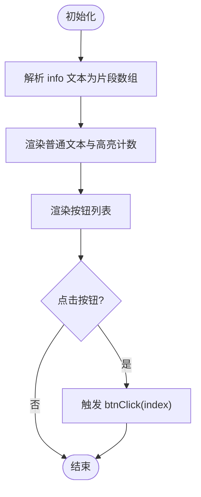
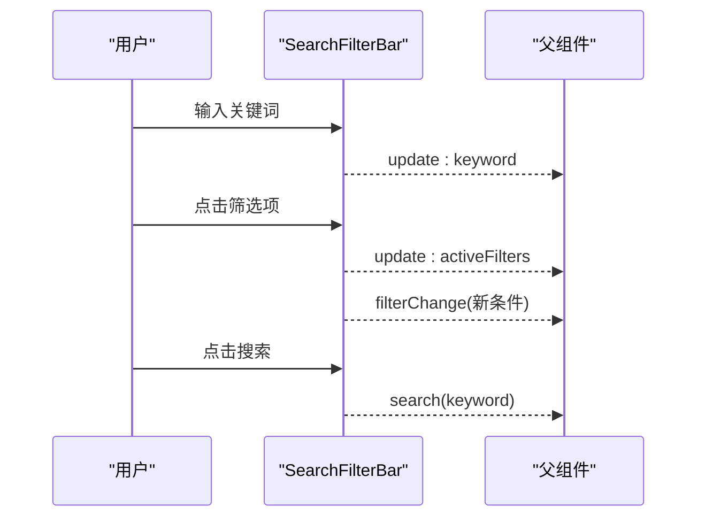
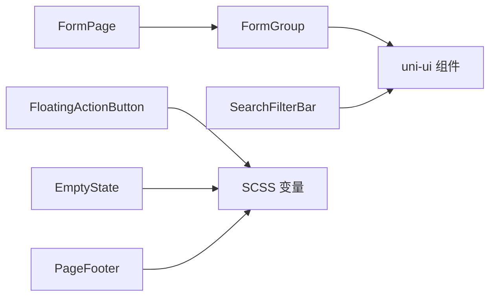

# 通用UI组件库

<cite>
**本文引用的文件**
- [empty-state/index.vue](file://class_times_record/src/components/empty-state/index.vue)
- [floating-action-button/index.vue](file://class_times_record/src/components/floating-action-button/index.vue)
- [form-group/index.vue](file://class_times_record/src/components/form-group/index.vue)
- [form-page/index.vue](file://class_times_record/src/components/form-page/index.vue)
- [page-footer/index.vue](file://class_times_record/src/components/page-footer/index.vue)
- [search-filter-bar/index.vue](file://class_times_record/src/components/search-filter-bar/index.vue)
- [form-group/types.d.ts](file://class_times_record/src/components/form-group/types.d.ts)
- [page-footer/types.d.ts](file://class_times_record/src/components/page-footer/types.d.ts)
- [_index.scss](file://class_times_record/src/static/scss/_index.scss)
- [variables/_index.scss](file://class_times_record/src/static/scss/variables/_index.scss)
</cite>

## 目录
1. [简介](#简介)
2. [项目结构](#项目结构)
3. [核心组件](#核心组件)
4. [架构总览](#架构总览)
5. [详细组件分析](#详细组件分析)
6. [依赖关系分析](#依赖关系分析)
7. [性能与可访问性](#性能与可访问性)
8. [主题与品牌化](#主题与品牌化)
9. [测试与质量保障](#测试与质量保障)
10. [与 uni-ui 集成与扩展指南](#与-uni-ui-集成与扩展指南)
11. [版本管理与向后兼容](#版本管理与向后兼容)
12. [故障排查](#故障排查)
13. [结论](#结论)

## 简介
本仓库包含一套面向多端（小程序/H5）的通用 UI 组件库，聚焦于表单、空状态、悬浮操作、页脚固定栏与搜索筛选等高频场景。组件以 Vue 3 + TypeScript 实现，样式基于 SCSS 变量体系，支持主题色与暗色模式扩展。文档将系统阐述组件设计原则、命名约定、文件组织、样式变量系统、主题定制机制、复用策略、版本管理、兼容性保证以及自动化测试流程，并给出与 uni-ui 官方组件库的集成与扩展方法。

## 项目结构
组件库位于 class_times_record 前端工程内，采用“按功能域”组织：
- components：基础与业务组合型组件
- static/scss：全局样式与变量入口
- uni_modules：引入 uni-ui 官方组件集作为底层能力

图表来源
- [empty-state/index.vue:1-58](file://class_times_record/src/components/empty-state/index.vue#L1-L58)
- [floating-action-button/index.vue:1-75](file://class_times_record/src/components/floating-action-button/index.vue#L1-L75)
- [form-group/index.vue:1-630](file://class_times_record/src/components/form-group/index.vue#L1-L630)
- [form-page/index.vue:1-58](file://class_times_record/src/components/form-page/index.vue#L1-L58)
- [page-footer/index.vue:1-121](file://class_times_record/src/components/page-footer/index.vue#L1-L121)
- [search-filter-bar/index.vue:1-186](file://class_times_record/src/components/search-filter-bar/index.vue#L1-L186)
- [_index.scss:1-2](file://class_times_record/src/static/scss/_index.scss#L1-L2)
- [variables/_index.scss:1-8](file://class_times_record/src/static/scss/variables/_index.scss#L1-L8)

章节来源
- [empty-state/index.vue:1-58](file://class_times_record/src/components/empty-state/index.vue#L1-L58)
- [floating-action-button/index.vue:1-75](file://class_times_record/src/components/floating-action-button/index.vue#L1-L75)
- [form-group/index.vue:1-630](file://class_times_record/src/components/form-group/index.vue#L1-L630)
- [form-page/index.vue:1-58](file://class_times_record/src/components/form-page/index.vue#L1-L58)
- [page-footer/index.vue:1-121](file://class_times_record/src/components/page-footer/index.vue#L1-L121)
- [search-filter-bar/index.vue:1-186](file://class_times_record/src/components/search-filter-bar/index.vue#L1-L186)
- [_index.scss:1-2](file://class_times_record/src/static/scss/_index.scss#L1-L2)
- [variables/_index.scss:1-8](file://class_times_record/src/static/scss/variables/_index.scss#L1-L8)

## 核心组件
- EmptyState 空状态：用于列表为空或无搜索结果时的统一占位展示，提供主提示与可选副提示文案。
- FloatingActionButton 悬浮按钮：右下角悬浮操作入口，支持自定义背景、图标文本、尺寸与层级，自动适配安全区。
- FormGroup 表单分组：配置驱动的表单渲染引擎，支持多种控件类型、编辑/展示双模式、嵌套路径数据绑定与格式化输出。
- FormPage 表单页面：聚合多个 FormGroup，提供统一的 v-model 双向绑定与事件透传。
- PageFooter 页脚固定栏：底部操作栏，支持单/多按钮与信息计数高亮，支持 fixed 定位与安全区适配。
- SearchFilterBar 搜索筛选条：顶部搜索框 + 下拉筛选，支持关键词与条件联动更新。

章节来源
- [empty-state/index.vue:1-58](file://class_times_record/src/components/empty-state/index.vue#L1-L58)
- [floating-action-button/index.vue:1-75](file://class_times_record/src/components/floating-action-button/index.vue#L1-L75)
- [form-group/index.vue:1-630](file://class_times_record/src/components/form-group/index.vue#L1-L630)
- [form-page/index.vue:1-58](file://class_times_record/src/components/form-page/index.vue#L1-L58)
- [page-footer/index.vue:1-121](file://class_times_record/src/components/page-footer/index.vue#L1-L121)
- [search-filter-bar/index.vue:1-186](file://class_times_record/src/components/search-filter-bar/index.vue#L1-L186)

## 架构总览
组件库遵循“低耦合、高内聚”的设计原则：
- 表现层：各组件仅关注自身渲染与交互
- 编排层：FormPage 负责组合多个 FormGroup
- 数据流：通过 v-model 与事件进行单向数据流与事件冒泡
- 样式层：SCSS 变量集中管理主题与基础规范
- 第三方：按需使用 uni-ui 提供的原生增强能力

图表来源
- [form-page/index.vue:1-58](file://class_times_record/src/components/form-page/index.vue#L1-L58)
- [form-group/index.vue:1-630](file://class_times_record/src/components/form-group/index.vue#L1-L630)

## 详细组件分析

### EmptyState 空状态组件
- 职责：统一呈现空数据态，降低页面重复占位逻辑
- Props：text（主提示）、tip（可选副提示）
- 样式：居中布局、图标+两行文案，间距与字号符合移动端阅读习惯
- 使用建议：在列表为空、搜索无结果、初始化加载完成且无数据时展示

图表来源
- [empty-state/index.vue:1-58](file://class_times_record/src/components/empty-state/index.vue#L1-L58)

章节来源
- [empty-state/index.vue:1-58](file://class_times_record/src/components/empty-state/index.vue#L1-L58)

### FloatingActionBar 悬浮按钮
- 职责：提供快捷操作入口，支持渐变背景、阴影、点击反馈与安全区适配
- Props：bgColor、iconText、iconSize、right/bottom/zIndex/hoverClass
- 事件：click/tap
- 特性：自动计算 bottom 以适配全面屏安全区；动态生成阴影

图表来源
- [floating-action-button/index.vue:1-75](file://class_times_record/src/components/floating-action-button/index.vue#L1-L75)

章节来源
- [floating-action-button/index.vue:1-75](file://class_times_record/src/components/floating-action-button/index.vue#L1-L75)

### FormGroup 表单分组
- 职责：配置驱动渲染表单，支持 edit/display 两种模式
- 支持的表单项类型：input、number、textarea、radio、select、date、time、picker、stepper、avatar、slot、text
- 数据模型：支持点号路径读写，内部维护 localForm 避免频繁引用重构
- 事件：change、update:modelValue、pickerTap、titleExtraTap
- 关键逻辑：
  - 输入过滤：number/stepper 支持正负数控制与非法字符过滤
  - 单选还原：radio 从 options 中恢复原始类型（布尔/数字/字符串）
  - 选择器：select/date/time/picker 分别处理索引/值回写
  - 头像：调用 chooseImage 获取临时路径
  - display 模式：空值回退 emptyText，支持 format 函数格式化

图表来源
- [form-group/index.vue:1-630](file://class_times_record/src/components/form-group/index.vue#L1-L630)

章节来源
- [form-group/index.vue:1-630](file://class_times_record/src/components/form-group/index.vue#L1-L630)
- [form-group/types.d.ts:1-157](file://class_times_record/src/components/form-group/types.d.ts#L1-L157)

### FormPage 表单页面编排
- 职责：批量渲染 FormGroup，透传 props 与事件，暴露 groupTitleTap 等高级事件
- 插槽：group-title-extra-{index}、group-{index}-{item.key}、group-{index}
- 数据流：v-model 双向绑定到最外层，所有子组变更汇总上报

图表来源
- [form-page/index.vue:1-58](file://class_times_record/src/components/form-page/index.vue#L1-L58)
- [form-group/index.vue:1-630](file://class_times_record/src/components/form-group/index.vue#L1-L630)

章节来源
- [form-page/index.vue:1-58](file://class_times_record/src/components/form-page/index.vue#L1-L58)

### PageFooter 页脚固定栏
- 职责：底部操作栏，支持信息计数高亮与多按钮布局
- Props：buttons、info、count、fixed
- 特性：info 中的 {{count}} 占位符会被替换为主题色高亮数字；fixed 模式下带阴影与安全区适配

图表来源
- [page-footer/index.vue:1-121](file://class_times_record/src/components/page-footer/index.vue#L1-L121)

章节来源
- [page-footer/index.vue:1-121](file://class_times_record/src/components/page-footer/index.vue#L1-L121)
- [page-footer/types.d.ts:1-22](file://class_times_record/src/components/page-footer/types.d.ts#L1-L22)

### SearchFilterBar 搜索筛选条
- 职责：顶部搜索框 + 下拉筛选，支持关键词与筛选条件联动
- Props：keyword、placeholder、filters、activeFilters
- 事件：update:keyword、update:activeFilters、search、filterChange
- 行为：点击筛选项后关闭下拉并触发 filterChange；搜索按钮触发 search

图表来源
- [search-filter-bar/index.vue:1-186](file://class_times_record/src/components/search-filter-bar/index.vue#L1-L186)

章节来源
- [search-filter-bar/index.vue:1-186](file://class_times_record/src/components/search-filter-bar/index.vue#L1-L186)

## 依赖关系分析
- 组件间依赖
  - FormPage 依赖 FormGroup
  - FormGroup 依赖 uni-icons、picker、radio 等 uni-ui 能力
  - SearchFilterBar 依赖 uni-icons
- 样式依赖
  - 组件样式通过 SCSS 局部作用域隔离，变量由 variables/_index.scss 提供
  - _index.scss 作为变量入口，便于统一导入

图表来源
- [form-page/index.vue:1-58](file://class_times_record/src/components/form-page/index.vue#L1-L58)
- [form-group/index.vue:1-630](file://class_times_record/src/components/form-group/index.vue#L1-L630)
- [search-filter-bar/index.vue:1-186](file://class_times_record/src/components/search-filter-bar/index.vue#L1-L186)
- [floating-action-button/index.vue:1-75](file://class_times_record/src/components/floating-action-button/index.vue#L1-L75)
- [empty-state/index.vue:1-58](file://class_times_record/src/components/empty-state/index.vue#L1-L58)
- [page-footer/index.vue:1-121](file://class_times_record/src/components/page-footer/index.vue#L1-L121)
- [_index.scss:1-2](file://class_times_record/src/static/scss/_index.scss#L1-L2)
- [variables/_index.scss:1-8](file://class_times_record/src/static/scss/variables/_index.scss#L1-L8)

章节来源
- [form-page/index.vue:1-58](file://class_times_record/src/components/form-page/index.vue#L1-L58)
- [form-group/index.vue:1-630](file://class_times_record/src/components/form-group/index.vue#L1-L630)
- [search-filter-bar/index.vue:1-186](file://class_times_record/src/components/search-filter-bar/index.vue#L1-L186)
- [floating-action-button/index.vue:1-75](file://class_times_record/src/components/floating-action-button/index.vue#L1-L75)
- [empty-state/index.vue:1-58](file://class_times_record/src/components/empty-state/index.vue#L1-L58)
- [page-footer/index.vue:1-121](file://class_times_record/src/components/page-footer/index.vue#L1-L121)
- [_index.scss:1-2](file://class_times_record/src/static/scss/_index.scss#L1-L2)
- [variables/_index.scss:1-8](file://class_times_record/src/static/scss/variables/_index.scss#L1-L8)

## 性能与可访问性
- 性能优化
  - FormGroup 使用本地 localForm 减少频繁引用变化导致的 Diff 开销，提升小程序输入流畅度
  - number/stepper 输入即时过滤非法字符，避免无效渲染
  - 计算属性与事件最小化触发范围
- 可访问性建议
  - 为关键交互元素补充 aria-label（在 H5 环境）
  - 颜色对比度满足 WCAG AA 标准
  - 键盘可达性与焦点顺序合理

[本节为通用指导，不直接分析具体文件]

## 主题与品牌化
- 颜色体系
  - 主题色变量：$theme-color、$theme-color-light、$theme-color-lighter、$theme-color-dark、$theme-color-darker
  - 默认背景色：$default-background-color
- 字体规范
  - 组件内使用 rpx 单位，确保多端一致缩放
  - 标题与正文层级通过字号与字重区分
- 间距标准
  - 使用 8rpx 倍数构建间距体系，保持视觉节奏
- 圆角规则
  - 卡片与按钮采用统一圆角半径，增强一致性
- 主题定制与暗色模式
  - 通过覆盖 variables/_index.scss 中的变量实现主题切换
  - 在应用启动时注入 CSS 变量或切换 SCSS 编译产物，实现明/暗主题
- 品牌化配置
  - 通过 props 注入 themeColor（如 FormGroup、PageFooter），实现局部品牌化
  - 悬浮按钮支持自定义背景与阴影，适配品牌风格

章节来源
- [variables/_index.scss:1-8](file://class_times_record/src/static/scss/variables/_index.scss#L1-L8)
- [form-group/index.vue:1-630](file://class_times_record/src/components/form-group/index.vue#L1-L630)
- [page-footer/index.vue:1-121](file://class_times_record/src/components/page-footer/index.vue#L1-L121)
- [floating-action-button/index.vue:1-75](file://class_times_record/src/components/floating-action-button/index.vue#L1-L75)

## 测试与质量保障
- 单元测试
  - 针对 FormGroup 的数据读写、格式化、边界值（0/false、负数、超长输入）编写用例
  - 针对 PageFooter 的 info 片段解析与按钮点击事件编写用例
  - 针对 SearchFilterBar 的筛选状态更新与事件派发编写用例
- 覆盖率要求
  - 核心逻辑分支覆盖率 ≥ 80%
  - 关键交互事件覆盖率 ≥ 90%
- 自动化流程
  - 提交前执行 lint 与类型检查
  - 运行单元与端到端测试套件
  - 失败阻断合并

[本节为通用指导，不直接分析具体文件]

## 与 uni-ui 集成与扩展指南
- 集成方式
  - 通过 uni_modules 引入 uni-ui 官方组件集，按需使用 uni-icons、uni-popup、uni-forms 等
  - 在组件中以原生标签或 uni-ui 组件形式组合使用
- 扩展开发
  - 新增组件遵循现有命名与目录规范：components/<component-name>/index.vue + index.scss + types.d.ts
  - 对外暴露清晰的 Props/Emits 类型定义，保持 API 稳定
  - 样式优先使用 SCSS 变量，避免硬编码颜色与尺寸
- 最佳实践
  - 复杂交互下沉到独立子组件，保持父组件简洁
  - 事件命名遵循 Vue 惯例，同时兼容 uni 生态（如同时支持 click/tap）

章节来源
- [form-group/index.vue:1-630](file://class_times_record/src/components/form-group/index.vue#L1-L630)
- [search-filter-bar/index.vue:1-186](file://class_times_record/src/components/search-filter-bar/index.vue#L1-L186)

## 版本管理与向后兼容
- 版本策略
  - 采用语义化版本（主版本.次版本.修订版本）
  - 重大变更（破坏性 API 调整）提升主版本
  - 新增功能提升次版本，修复问题提升修订版本
- 向后兼容
  - 废弃字段保留至少两个次版本，并提供迁移提示
  - 默认参数保持不变，新增可选参数不影响既有用法
  - 事件名与回调签名保持稳定，新增事件以追加形式发布
- 发布流程
  - 代码审查通过后打 tag 并发布
  - 更新 CHANGELOG，记录破坏性变更与迁移指引

[本节为通用指导，不直接分析具体文件]

## 故障排查
- 常见问题
  - 表单输入卡顿：确认是否频繁重建 modelValue 引用，建议使用 FormGroup 的本地缓存机制
  - 数字输入异常：检查 allowNegative 与正则过滤逻辑，避免中间态 "-" 污染数据
  - 选择器未选中：确认 select 的 value 与 options.value 类型一致（字符串/数字/布尔）
  - 悬浮按钮被遮挡：检查 zIndex 与页面滚动容器层级
  - 搜索筛选不生效：确认 keyword 与 activeFilters 使用 v-model 双向绑定
- 调试建议
  - 打印 emit 事件载荷，核对 key/value 类型
  - 在 display 模式下使用 format 函数验证格式化结果
  - 使用浏览器开发者工具或小程序调试面板观察样式与布局

章节来源
- [form-group/index.vue:1-630](file://class_times_record/src/components/form-group/index.vue#L1-L630)
- [floating-action-button/index.vue:1-75](file://class_times_record/src/components/floating-action-button/index.vue#L1-L75)
- [search-filter-bar/index.vue:1-186](file://class_times_record/src/components/search-filter-bar/index.vue#L1-L186)

## 结论
本组件库围绕表单与常见交互场景提供了高内聚、易扩展的基础能力。通过配置驱动的 FormGroup、编排型的 FormPage、稳定的主题变量体系以及与 uni-ui 的良好集成，能够在多端环境下快速构建一致的界面体验。建议在团队内推广统一的命名与文件组织规范，完善测试与发布流程，持续迭代组件能力与文档，以提升整体研发效率与产品质量。