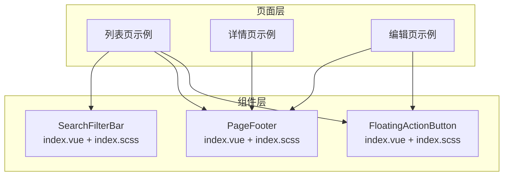
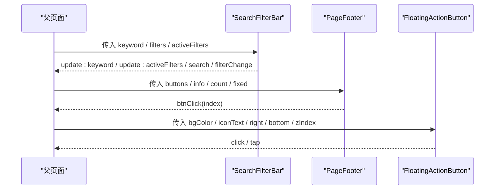
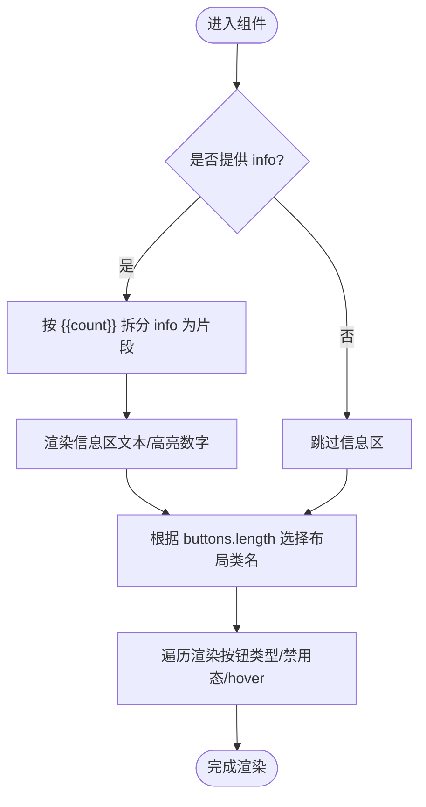
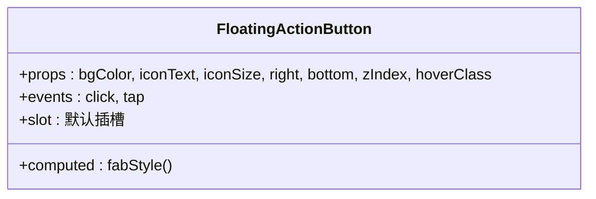
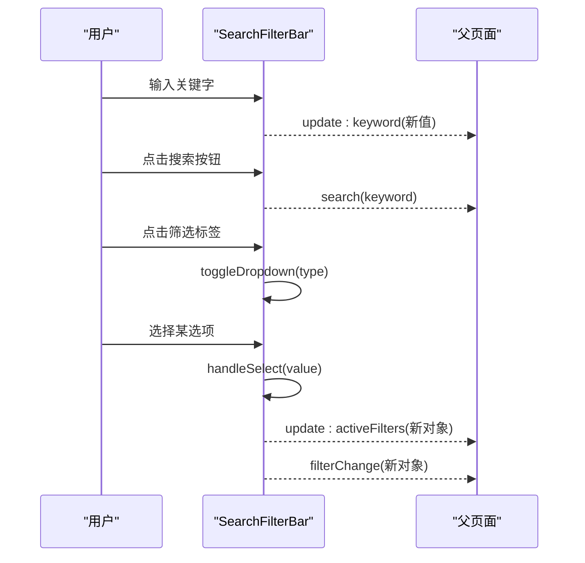
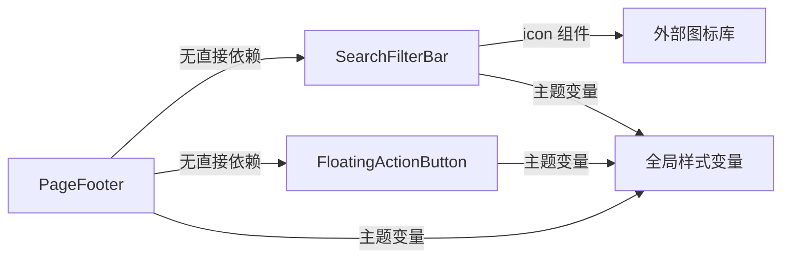

# 页面布局组件

<cite>
**本文引用的文件**
- [page-footer/index.vue](file://class_times_record/src/components/page-footer/index.vue)
- [page-footer/index.scss](file://class_times_record/src/components/page-footer/index.scss)
- [floating-action-button/index.vue](file://class_times_record/src/components/floating-action-button/index.vue)
- [floating-action-button/index.scss](file://class_times_record/src/components/floating-action-button/index.scss)
- [search-filter-bar/index.vue](file://class_times_record/src/components/search-filter-bar/index.vue)
- [search-filter-bar/index.scss](file://class_times_record/src/components/search-filter-bar/index.scss)
</cite>

## 目录
1. [简介](#简介)
2. [项目结构](#项目结构)
3. [核心组件](#核心组件)
4. [架构总览](#架构总览)
5. [详细组件分析](#详细组件分析)
6. [依赖关系分析](#依赖关系分析)
7. [性能与内存优化](#性能与内存优化)
8. [可访问性与多端适配](#可访问性与多端适配)
9. [故障排查指南](#故障排查指南)
10. [结论](#结论)
11. [附录：使用示例](#附录使用示例)

## 简介
本文件面向课程记录应用中的页面布局组件，系统性梳理以下三个核心组件的实现原理、交互模式与最佳实践：
- PageFooter 页面底部操作栏：支持单按钮、双按钮、信息+按钮三种布局，提供固定漂浮与普通文档流两种模式。
- FloatingActionButton 浮动操作按钮：右下角悬浮主操作入口，支持自定义图标与主题色渐变。
- SearchFilterBar 搜索过滤栏：顶部粘性头部，包含搜索框与下拉筛选面板，支持 v-model 双向绑定与事件回调。

文档将覆盖响应式布局、触摸反馈、动画实现、插槽机制、样式覆盖、业务场景组合用法、可访问性支持与多端适配策略，并给出性能优化建议与常见问题排查方法。

## 项目结构
三个布局组件位于 class_times_record 前端工程下 components 目录中，每个组件由 Vue 模板、TypeScript 逻辑与 SCSS 样式组成，遵循“组件内聚”的组织方式。

图表来源
- [page-footer/index.vue:1-121](file://class_times_record/src/components/page-footer/index.vue#L1-L121)
- [floating-action-button/index.vue:1-75](file://class_times_record/src/components/floating-action-button/index.vue#L1-L75)
- [search-filter-bar/index.vue:1-186](file://class_times_record/src/components/search-filter-bar/index.vue#L1-L186)

章节来源
- [page-footer/index.vue:1-121](file://class_times_record/src/components/page-footer/index.vue#L1-L121)
- [floating-action-button/index.vue:1-75](file://class_times_record/src/components/floating-action-button/index.vue#L1-L75)
- [search-filter-bar/index.vue:1-186](file://class_times_record/src/components/search-filter-bar/index.vue#L1-L186)

## 核心组件
本节概述各组件的职责、对外接口与内部关键能力。

- PageFooter
  - 职责：渲染页面底部操作区域，支持固定漂浮或普通布局；左侧可选信息区（支持占位符高亮数字），右侧按钮区根据数量自适应布局。
  - 关键能力：info/count 动态文本片段渲染；buttons 数组驱动按钮渲染；fixed 切换定位模式；hover-class 按压反馈；默认插槽扩展。
  - 事件：btnClick(index)。

- FloatingActionButton
  - 职责：提供右下角悬浮主操作入口，支持自定义图标/文本、背景色与层级。
  - 关键能力：计算样式（背景渐变、阴影、安全区 bottom）；点击态缩放与亮度变化；默认插槽替换图标内容。
  - 事件：click/tap。

- SearchFilterBar
  - 职责：顶部粘性头部，包含搜索输入与下拉筛选面板，支持 v-model 双向绑定与筛选变更事件。
  - 关键能力：filters 配置驱动选项；activeFilters 承接选中值；currentSelectType 控制当前展开项；遮罩关闭下拉。
  - 事件：update:keyword、update:activeFilters、search、filterChange。

章节来源
- [page-footer/index.vue:47-118](file://class_times_record/src/components/page-footer/index.vue#L47-L118)
- [floating-action-button/index.vue:18-72](file://class_times_record/src/components/floating-action-button/index.vue#L18-L72)
- [search-filter-bar/index.vue:61-167](file://class_times_record/src/components/search-filter-bar/index.vue#L61-L167)

## 架构总览
三个组件均为无状态 UI 容器，通过 props 接收数据，通过事件向父组件通信。父页面负责业务状态与数据流，组件专注于展示与交互。

图表来源
- [search-filter-bar/index.vue:98-167](file://class_times_record/src/components/search-filter-bar/index.vue#L98-L167)
- [page-footer/index.vue:84-97](file://class_times_record/src/components/page-footer/index.vue#L84-L97)
- [floating-action-button/index.vue:32-71](file://class_times_record/src/components/floating-action-button/index.vue#L32-L71)

## 详细组件分析

### PageFooter 组件
- 布局模式
  - 单按钮：居中且占满宽度。
  - 双按钮：左右排列，主按钮更大比例。
  - 三及以上：等宽排列。
  - 信息+按钮：左侧显示提示文本，右侧按钮不占满宽度。
- 信息文本与高亮数字
  - 通过拆分 info 字符串并按 {{count}} 占位符生成片段数组，分别以普通文本与高亮数字渲染。
- 固定漂浮与安全区
  - fixed=true 时采用 fixed 定位，底部增加 env(safe-area-inset-bottom) 适配全面屏。
- 按钮交互
  - hover-class 提供按压反馈；disabled 禁用态样式与 pointer-events 拦截。
- 插槽
  - 默认插槽用于完全自定义底部内容。

图表来源
- [page-footer/index.vue:104-117](file://class_times_record/src/components/page-footer/index.vue#L104-L117)
- [page-footer/index.scss:55-98](file://class_times_record/src/components/page-footer/index.scss#L55-L98)

章节来源
- [page-footer/index.vue:10-44](file://class_times_record/src/components/page-footer/index.vue#L10-L44)
- [page-footer/index.vue:84-117](file://class_times_record/src/components/page-footer/index.vue#L84-L117)
- [page-footer/index.scss:13-21](file://class_times_record/src/components/page-footer/index.scss#L13-L21)
- [page-footer/index.scss:55-98](file://class_times_record/src/components/page-footer/index.scss#L55-L98)
- [page-footer/index.scss:102-152](file://class_times_record/src/components/page-footer/index.scss#L102-L152)

### FloatingActionButton 组件
- 定位与尺寸
  - 固定定位在右下角，right/bottom 可通过 props 调整；bottom 自动叠加 var(--window-bottom) 适配系统安全区。
- 外观与阴影
  - 支持纯色或渐变色背景；非渐变会自动转为线性渐变；阴影颜色随背景色动态生成。
- 交互与动画
  - hover-class 提供点击缩放与亮度变化过渡效果。
- 插槽
  - 默认插槽允许替换加号图标为任意内容（如 uni-icons）。

图表来源
- [floating-action-button/index.vue:22-40](file://class_times_record/src/components/floating-action-button/index.vue#L22-L40)
- [floating-action-button/index.vue:48-66](file://class_times_record/src/components/floating-action-button/index.vue#L48-L66)
- [floating-action-button/index.vue:68-71](file://class_times_record/src/components/floating-action-button/index.vue#L68-L71)

章节来源
- [floating-action-button/index.vue:1-16](file://class_times_record/src/components/floating-action-button/index.vue#L1-L16)
- [floating-action-button/index.vue:32-40](file://class_times_record/src/components/floating-action-button/index.vue#L32-L40)
- [floating-action-button/index.vue:48-66](file://class_times_record/src/components/floating-action-button/index.vue#L48-L66)
- [floating-action-button/index.scss:1-28](file://class_times_record/src/components/floating-action-button/index.scss#L1-L28)

### SearchFilterBar 组件
- 粘性头部
  - 使用 sticky 定位固定在顶部，z-index 保证在最上层；背景与阴影提升层次。
- 搜索交互
  - input 触发 update:keyword；确认键或按钮触发 search 事件。
- 下拉筛选
  - filters 配置对象驱动 tab 与选项；activeFilters 承载当前选中值；toggleDropdown 切换当前类型；handleSelect 更新 activeFilters 并关闭下拉。
- 遮罩层
  - 点击遮罩关闭下拉面板。

图表来源
- [search-filter-bar/index.vue:138-167](file://class_times_record/src/components/search-filter-bar/index.vue#L138-L167)

章节来源
- [search-filter-bar/index.vue:1-58](file://class_times_record/src/components/search-filter-bar/index.vue#L1-L58)
- [search-filter-bar/index.vue:98-167](file://class_times_record/src/components/search-filter-bar/index.vue#L98-L167)
- [search-filter-bar/index.scss:5-16](file://class_times_record/src/components/search-filter-bar/index.scss#L5-L16)
- [search-filter-bar/index.scss:39-66](file://class_times_record/src/components/search-filter-bar/index.scss#L39-L66)
- [search-filter-bar/index.scss:69-99](file://class_times_record/src/components/search-filter-bar/index.scss#L69-L99)
- [search-filter-bar/index.scss:103-111](file://class_times_record/src/components/search-filter-bar/index.scss#L103-L111)

## 依赖关系分析
- 组件间耦合度低，均通过 props/events 与父页面通信，无直接相互引用。
- 样式变量依赖全局主题变量（如 $theme-color、$default-background-color），便于统一换肤。
- 外部依赖
  - 图标：SearchFilterBar 中使用 icon 组件进行勾选标记。
  - 平台变量：var(--window-bottom)、env(safe-area-inset-bottom) 用于多端安全区适配。

图表来源
- [page-footer/index.scss:130-152](file://class_times_record/src/components/page-footer/index.scss#L130-L152)
- [floating-action-button/index.scss:7-12](file://class_times_record/src/components/floating-action-button/index.scss#L7-L12)
- [search-filter-bar/index.scss:11-12](file://class_times_record/src/components/search-filter-bar/index.scss#L11-L12)

章节来源
- [page-footer/index.scss:130-152](file://class_times_record/src/components/page-footer/index.scss#L130-L152)
- [floating-action-button/index.scss:7-12](file://class_times_record/src/components/floating-action-button/index.scss#L7-L12)
- [search-filter-bar/index.scss:11-12](file://class_times_record/src/components/search-filter-bar/index.scss#L11-L12)

## 性能与内存优化
- 减少重排与重绘
  - 使用 transform 与 opacity 做动画（如 hover 缩放、透明度变化），避免频繁修改 layout 属性。
  - 下拉面板通过 max-height 过渡打开/收起，避免 display 切换导致的回流。
- 事件节流与防抖
  - 对高频输入（如搜索）建议在父层进行节流/防抖处理，降低 update:keyword 频率。
- 条件渲染与懒加载
  - 仅在需要时渲染 filters 与下拉面板；大数据量选项可使用虚拟滚动或分页加载。
- 样式与主题
  - 尽量复用主题变量，减少重复样式定义；避免在运行时频繁计算复杂样式。
- 内存管理
  - 组件本身无持久化状态，注意父页面在销毁前清理定时器、监听器与缓存数据。

[本节为通用指导，无需具体文件引用]

## 可访问性与多端适配
- 可访问性
  - 为按钮与信息文本提供语义化标签；必要时添加 aria-label 与 role 以提升屏幕阅读器体验。
  - 键盘导航：确保 Tab 顺序合理，Enter/Space 可触发主要操作。
- 多端适配
  - 安全区：使用 var(--window-bottom) 与 env(safe-area-inset-bottom) 适配全面屏与小程序底部条。
  - 字体与触控：rpx 单位与合适的字号/行高，保证移动端触控目标尺寸。
  - 主题与深色模式：通过 CSS 变量或主题变量切换，保持视觉一致性。

[本节为通用指导，无需具体文件引用]

## 故障排查指南
- 搜索框输入不生效
  - 检查是否使用 v-model 绑定 keyword 与 activeFilters；确认父组件正确监听 update:keyword 与 update:activeFilters。
- 下拉筛选不更新
  - 确认 filters 配置结构与 activeFilters 初始值一致；handleSelect 会合并新值并关闭下拉。
- 底部按钮被遮挡
  - 检查 fixed 模式下安全区变量是否正确注入；确认页面内容高度足够，避免被底部固定栏覆盖。
- 悬浮按钮位置异常
  - 检查 var(--window-bottom) 是否可用；必要时手动设置 bottom 值。
- 主题色未生效
  - 确认全局样式已引入主题变量；SCSS 变量需编译生效。

章节来源
- [search-filter-bar/index.vue:98-167](file://class_times_record/src/components/search-filter-bar/index.vue#L98-L167)
- [page-footer/index.scss:13-21](file://class_times_record/src/components/page-footer/index.scss#L13-L21)
- [floating-action-button/index.vue:58-66](file://class_times_record/src/components/floating-action-button/index.vue#L58-L66)

## 结论
三个布局组件以简洁的 props/events 契约与清晰的职责边界，提供了可复用的页面骨架能力。通过主题变量与安全区适配，它们在不同终端上具备良好的一致性与可用性。结合本文的性能优化与可访问性建议，可在实际项目中快速构建高质量的列表、详情与编辑页面。

[本节为总结性内容，无需具体文件引用]

## 附录：使用示例
以下为典型业务场景的组合用法说明（不含代码，仅描述用法要点）：

- 列表页布局
  - 顶部放置 SearchFilterBar，v-model 绑定 keyword 与 activeFilters，监听 search 与 filterChange 触发数据刷新。
  - 列表底部使用 PageFooter，fixed=false 作为普通布局；当多选场景时，传入 info 与 count 显示“已选 N 人”，buttons 提供“取消/确认”。
  - 右下角放置 FloatingActionButton，点击后跳转到新增或批量操作入口。

- 详情页布局
  - 顶部可省略 SearchFilterBar，或使用轻量搜索。
  - 底部使用 PageFooter，fixed=false，buttons 提供“返回/编辑/删除”等动作。
  - 若需要快捷操作，可保留 FloatingActionButton。

- 编辑页布局
  - 顶部可放置 SearchFilterBar 用于关联选择（如选择学生/教师）。
  - 底部使用 PageFooter，fixed=true，buttons 提供“保存/取消”，并在表单校验失败时禁用主按钮。
  - 右下角可放置 FloatingActionButton 用于快速插入常用字段或跳转辅助工具。

[本节为概念性示例，无需具体文件引用]