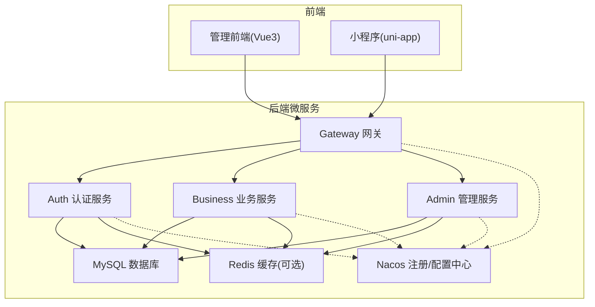
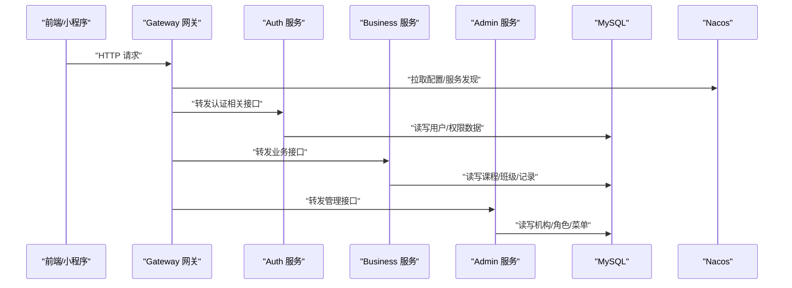
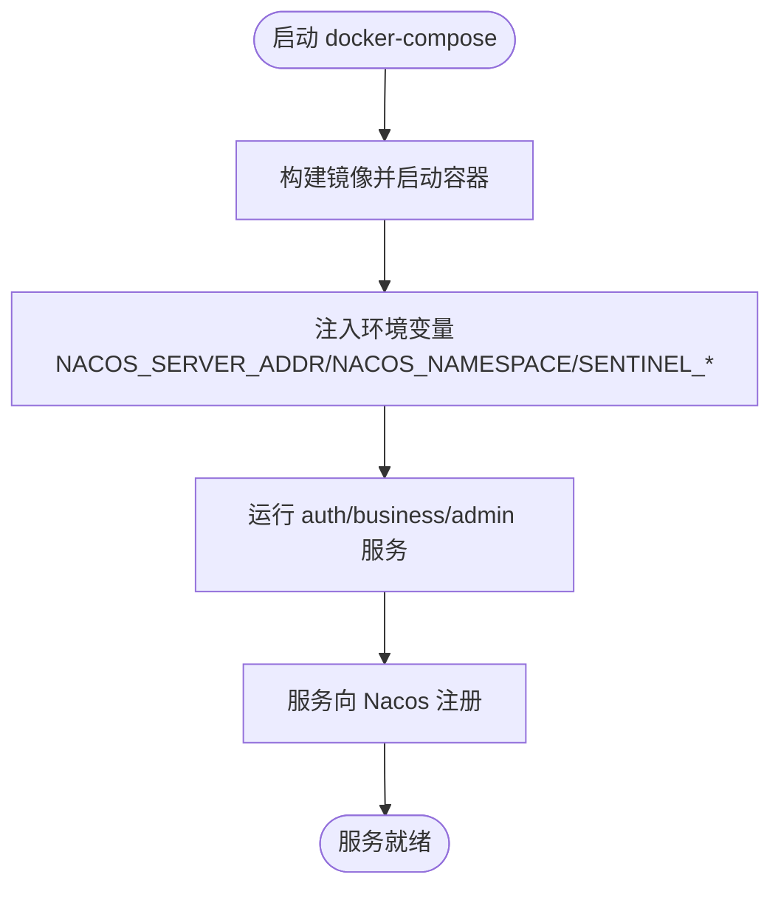
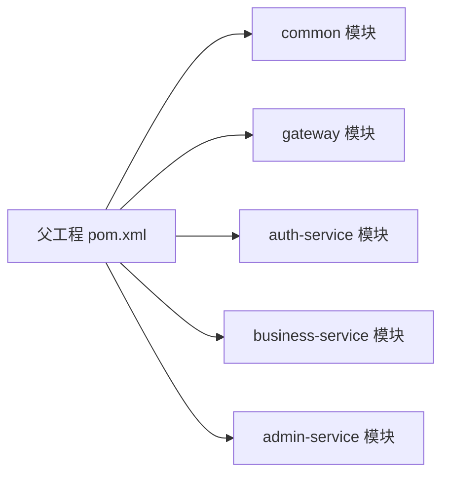

# 快速开始

<cite>
**本文引用的文件**   
- [class_times_record_back/docker-compose.yml](file://class_times_record_back/docker-compose.yml)
- [class_times_record_back/pom.xml](file://class_times_record_back/pom.xml)
- [class_times_record_back/gateway/src/main/resources/application.yml](file://class_times_record_back/gateway/src/main/resources/application.yml)
- [class_times_record_back/auth-service/src/main/resources/application.yml](file://class_times_record_back/auth-service/src/main/resources/application.yml)
- [class_times_record_back/business-service/src/main/resources/application.yml](file://class_times_record_back/business-service/src/main/resources/application.yml)
- [class_times_record_back/admin-service/src/main/resources/application.yml](file://class_times_record_back/admin-service/src/main/resources/application.yml)
- [class_times_record_back/docs/class_times_record.sql](file://class_times_record_back/docs/class_times_record.sql)
- [class_times_record_back/docs/nacos-common-redis.yaml](file://class_times_record_back/docs/nacos-common-redis.yaml)
- [class_record_admin_front/package.json](file://class_record_admin_front/package.json)
- [class_times_record/package.json](file://class_times_record/package.json)
</cite>

## 目录
1. [简介](#简介)
2. [项目结构](#项目结构)
3. [核心组件](#核心组件)
4. [架构总览](#架构总览)
5. [详细组件分析](#详细组件分析)
6. [依赖关系分析](#依赖关系分析)
7. [性能与资源建议](#性能与资源建议)
8. [故障排查指南](#故障排查指南)
9. [结论](#结论)
10. [附录](#附录)

## 简介
本指南面向新手，帮助你在本地或容器中快速运行“课时记录系统”。你将完成以下目标：
- 准备环境：Java 21、Node.js 22+、MySQL、Nacos（以及可选的 Redis）
- 启动后端微服务：gateway → auth → business → admin
- 运行前端管理应用与小程序开发调试
- 使用 Docker Compose 一键拉起基础设施与微服务
- 解决常见环境问题（端口冲突、数据库连接失败、Nacos 配置中心连接问题等）

## 项目结构
仓库包含三个主要部分：
- 后端微服务（Spring Cloud Alibaba + Nacos + MyBatis-Plus）
  - gateway：网关入口
  - auth-service：认证授权
  - business-service：业务服务
  - admin-service：后台管理服务
  - common：公共模块
- 前端管理应用（Vue 3 + Vite + Element Plus）
- 小程序端（uni-app，支持多端编译，含微信小程序脚本）

图表来源
- [class_times_record_back/gateway/src/main/resources/application.yml:1-19](file://class_times_record_back/gateway/src/main/resources/application.yml#L1-L19)
- [class_times_record_back/auth-service/src/main/resources/application.yml:1-24](file://class_times_record_back/auth-service/src/main/resources/application.yml#L1-L24)
- [class_times_record_back/business-service/src/main/resources/application.yml:1-24](file://class_times_record_back/business-service/src/main/resources/application.yml#L1-L24)
- [class_times_record_back/admin-service/src/main/resources/application.yml:1-23](file://class_times_record_back/admin-service/src/main/resources/application.yml#L1-L23)

章节来源
- [class_times_record_back/pom.xml:1-162](file://class_times_record_back/pom.xml#L1-L162)

## 核心组件
- 网关 Gateway：统一入口，从 Nacos 加载路由与日志配置
- 认证 Auth：负责登录鉴权、用户平台绑定等
- 业务 Business：课程、班级、排课、记录等业务逻辑
- 管理 Admin：机构、角色、菜单、管理员等系统管理功能
- 数据层：MyBatis-Plus + MySQL；可选 Redis 作为缓存与会话存储
- 配置与发现：Nacos（命名空间 course-record）

章节来源
- [class_times_record_back/gateway/src/main/resources/application.yml:1-19](file://class_times_record_back/gateway/src/main/resources/application.yml#L1-L19)
- [class_times_record_back/auth-service/src/main/resources/application.yml:1-24](file://class_times_record_back/auth-service/src/main/resources/application.yml#L1-L24)
- [class_times_record_back/business-service/src/main/resources/application.yml:1-24](file://class_times_record_back/business-service/src/main/resources/application.yml#L1-L24)
- [class_times_record_back/admin-service/src/main/resources/application.yml:1-23](file://class_times_record_back/admin-service/src/main/resources/application.yml#L1-L23)

## 架构总览
下图展示了请求从前端到网关再到各微服务的调用路径，以及 Nacos 在其中的作用。

图表来源
- [class_times_record_back/gateway/src/main/resources/application.yml:1-19](file://class_times_record_back/gateway/src/main/resources/application.yml#L1-L19)
- [class_times_record_back/auth-service/src/main/resources/application.yml:1-24](file://class_times_record_back/auth-service/src/main/resources/application.yml#L1-L24)
- [class_times_record_back/business-service/src/main/resources/application.yml:1-24](file://class_times_record_back/business-service/src/main/resources/application.yml#L1-L24)
- [class_times_record_back/admin-service/src/main/resources/application.yml:1-23](file://class_times_record_back/admin-service/src/main/resources/application.yml#L1-L23)

## 详细组件分析

### 环境准备清单
- Java 21（后端构建与运行）
- Node.js 22+（前端与小程序开发）
- MySQL 8.x（初始化 SQL 见下文）
- Nacos（用于服务发现与配置中心，命名空间 course-record）
- Redis（可选，若使用则需上传 common-redis.yaml 到 Nacos）

说明
- 后端工程要求 Java 21，参见父 POM 的 java.version 属性。
- 前端工程 engines 字段要求 Node.js ^20.19.0 || >=22.12.0，建议使用 Node.js 22+。
- 小程序工程基于 uni-app，提供多端脚本，包括微信小程序开发脚本。

章节来源
- [class_times_record_back/pom.xml:30-46](file://class_times_record_back/pom.xml#L30-L46)
- [class_record_admin_front/package.json:59-62](file://class_record_admin_front/package.json#L59-L62)
- [class_times_record/package.json:1-41](file://class_times_record/package.json#L1-L41)

### 数据库初始化
- 在本地或远程 MySQL 中创建数据库 class_times_record
- 导入 SQL 文件以初始化表结构与基础数据

章节来源
- [class_times_record_back/docs/class_times_record.sql:1-496](file://class_times_record_back/docs/class_times_record.sql#L1-L496)

### Nacos 配置中心准备
- 确保 Nacos 可访问，并在命名空间 course-record 下准备以下配置 Data ID：
  - cr-gateway.yaml
  - cr-auth-service.yaml
  - cr-business-service.yaml
  - cr-admin-service.yaml
  - common-db.yaml
  - common-sentinel.yaml
  - logback-spring.xml
  - common-redis.yaml（如使用 Redis）
- 示例：common-redis.yaml 的配置键名与默认值参考如下文件，请根据实际环境替换环境变量或常量。

章节来源
- [class_times_record_back/gateway/src/main/resources/application.yml:1-19](file://class_times_record_back/gateway/src/main/resources/application.yml#L1-L19)
- [class_times_record_back/auth-service/src/main/resources/application.yml:1-24](file://class_times_record_back/auth-service/src/main/resources/application.yml#L1-L24)
- [class_times_record_back/business-service/src/main/resources/application.yml:1-24](file://class_times_record_back/business-service/src/main/resources/application.yml#L1-L24)
- [class_times_record_back/admin-service/src/main/resources/application.yml:1-23](file://class_times_record_back/admin-service/src/main/resources/application.yml#L1-L23)
- [class_times_record_back/docs/nacos-common-redis.yaml:1-26](file://class_times_record_back/docs/nacos-common-redis.yaml#L1-L26)

### 后端微服务启动顺序
推荐顺序：gateway → auth → business → admin
- 每个服务通过 application.yml 中的 spring.config.import 从 Nacos 拉取配置
- 服务间通过 Nacos 进行服务发现与调用

章节来源
- [class_times_record_back/gateway/src/main/resources/application.yml:1-19](file://class_times_record_back/gateway/src/main/resources/application.yml#L1-L19)
- [class_times_record_back/auth-service/src/main/resources/application.yml:1-24](file://class_times_record_back/auth-service/src/main/resources/application.yml#L1-L24)
- [class_times_record_back/business-service/src/main/resources/application.yml:1-24](file://class_times_record_back/business-service/src/main/resources/application.yml#L1-L24)
- [class_times_record_back/admin-service/src/main/resources/application.yml:1-23](file://class_times_record_back/admin-service/src/main/resources/application.yml#L1-L23)

### 前端管理应用运行
- 进入 class_record_admin_front 目录
- 安装依赖后执行开发命令
- 构建与预览命令也可用

章节来源
- [class_record_admin_front/package.json:6-18](file://class_record_admin_front/package.json#L6-L18)

### 小程序编译与调试
- 进入 class_times_record 目录
- 使用提供的脚本进行多端开发与构建，其中包含微信小程序开发脚本
- 如需自动打开微信开发者工具，请确认脚本中的路径与实际安装路径一致

章节来源
- [class_times_record/package.json:4-41](file://class_times_record/package.json#L4-L41)

### Docker Compose 一键部署
- 使用根级 docker-compose.yml 可拉起 auth-service、business-service、admin-service 三个容器
- 注意：
  - 当前 compose 未包含 gateway 容器（注释说明 gateway 以 JAR 直跑方式运行）
  - 所有服务通过 network_mode: host 暴露端口
  - 通过环境变量注入 Nacos 地址、命名空间、Sentinel 地址等
  - 已设置 Tomcat 线程池与 HikariCP 连接池大小，降低内存占用

图表来源
- [class_times_record_back/docker-compose.yml:1-75](file://class_times_record_back/docker-compose.yml#L1-L75)

章节来源
- [class_times_record_back/docker-compose.yml:1-75](file://class_times_record_back/docker-compose.yml#L1-L75)

## 依赖关系分析
- 版本与依赖管理集中在父 POM 中，统一了 Spring Boot、Spring Cloud、Spring Cloud Alibaba、MyBatis-Plus 等版本
- 子模块通过继承父 POM 获得一致的依赖与插件配置

图表来源
- [class_times_record_back/pom.xml:22-28](file://class_times_record_back/pom.xml#L22-L28)

章节来源
- [class_times_record_back/pom.xml:1-162](file://class_times_record_back/pom.xml#L1-L162)

## 性能与资源建议
- 容器化部署时，Tomcat 线程池与 HikariCP 连接池大小已在 compose 中限制，避免内存压力过大
- 若单机运行多个服务实例，建议适当调小连接池与线程数，防止资源争用
- 生产环境建议为 Nacos、MySQL、Redis 分配独立资源与持久化存储

[本节为通用建议，不直接分析具体文件]

## 故障排查指南
- 端口冲突
  - 现象：服务无法启动或浏览器无法访问
  - 处理：检查本机是否已有进程占用相同端口；compose 使用 host 网络模式，需确保宿主机端口未被占用
- 数据库连接失败
  - 现象：服务启动时报连接异常
  - 处理：确认 MySQL 已启动且数据库 class_times_record 存在并已导入 SQL；核对 Nacos 中 common-db.yaml 的连接信息
- Nacos 配置中心连接问题
  - 现象：服务启动后无法拉取配置或服务发现失败
  - 处理：检查 NACOS_SERVER_ADDR 与 NACOS_NAMESPACE 是否正确；确认命名空间 course-record 下所需 Data ID 是否存在
- Redis 不可用（如启用）
  - 现象：缓存或会话相关功能异常
  - 处理：确认 Redis 可达，并在 Nacos 中上传 common-redis.yaml，核对 host/port/password/database 等参数
- 前端代理与跨域
  - 现象：前端请求后端失败
  - 处理：检查前端代理配置与网关路由；确认 Nacos 中网关配置正确

章节来源
- [class_times_record_back/docker-compose.yml:1-75](file://class_times_record_back/docker-compose.yml#L1-L75)
- [class_times_record_back/gateway/src/main/resources/application.yml:1-19](file://class_times_record_back/gateway/src/main/resources/application.yml#L1-L19)
- [class_times_record_back/auth-service/src/main/resources/application.yml:1-24](file://class_times_record_back/auth-service/src/main/resources/application.yml#L1-L24)
- [class_times_record_back/business-service/src/main/resources/application.yml:1-24](file://class_times_record_back/business-service/src/main/resources/application.yml#L1-L24)
- [class_times_record_back/admin-service/src/main/resources/application.yml:1-23](file://class_times_record_back/admin-service/src/main/resources/application.yml#L1-L23)
- [class_times_record_back/docs/nacos-common-redis.yaml:1-26](file://class_times_record_back/docs/nacos-common-redis.yaml#L1-L26)

## 结论
按照本指南完成环境准备、数据库初始化、Nacos 配置、后端与前端启动后，即可在本地或容器中完整运行课时记录系统。建议在首次搭建时使用 Docker Compose 快速拉起基础设施与微服务，再逐步优化配置与性能。

[本节为总结性内容，不直接分析具体文件]

## 附录
- 关键脚本与命令速查
  - 后端：按顺序启动 gateway → auth → business → admin
  - 前端管理：进入 class_record_admin_front 目录，安装依赖后执行开发命令
  - 小程序：进入 class_times_record 目录，使用提供的多端脚本进行开发与构建
- 必要配置文件清单（Nacos 命名空间 course-record）
  - cr-gateway.yaml、cr-auth-service.yaml、cr-business-service.yaml、cr-admin-service.yaml
  - common-db.yaml、common-sentinel.yaml、logback-spring.xml
  - common-redis.yaml（可选）

章节来源
- [class_record_admin_front/package.json:6-18](file://class_record_admin_front/package.json#L6-L18)
- [class_times_record/package.json:4-41](file://class_times_record/package.json#L4-L41)
- [class_times_record_back/docs/nacos-common-redis.yaml:1-26](file://class_times_record_back/docs/nacos-common-redis.yaml#L1-L26)