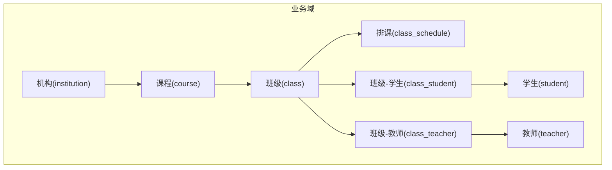
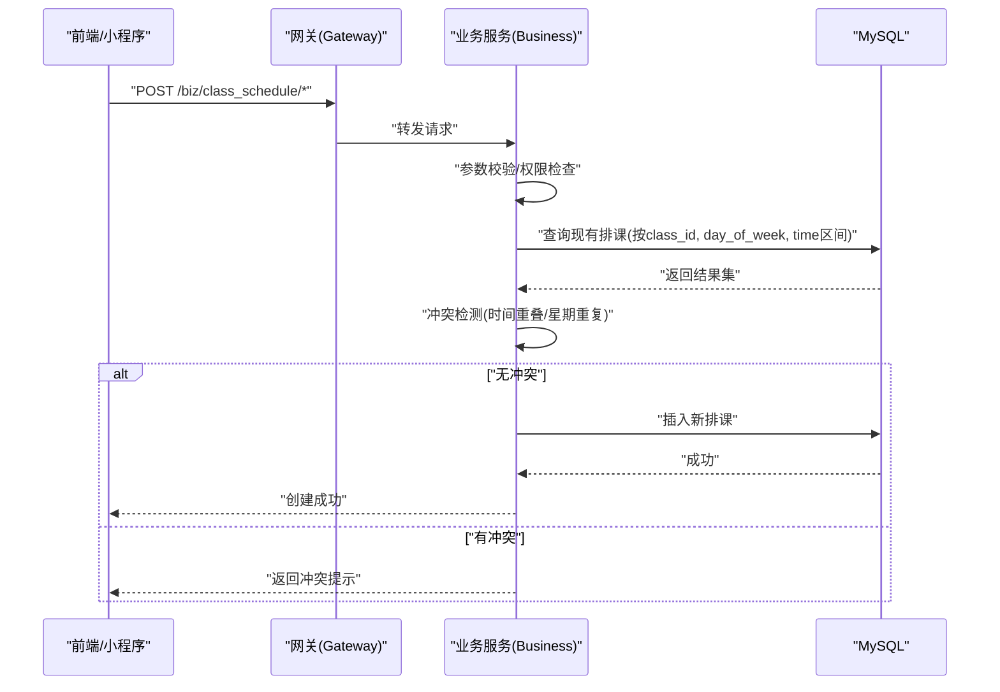
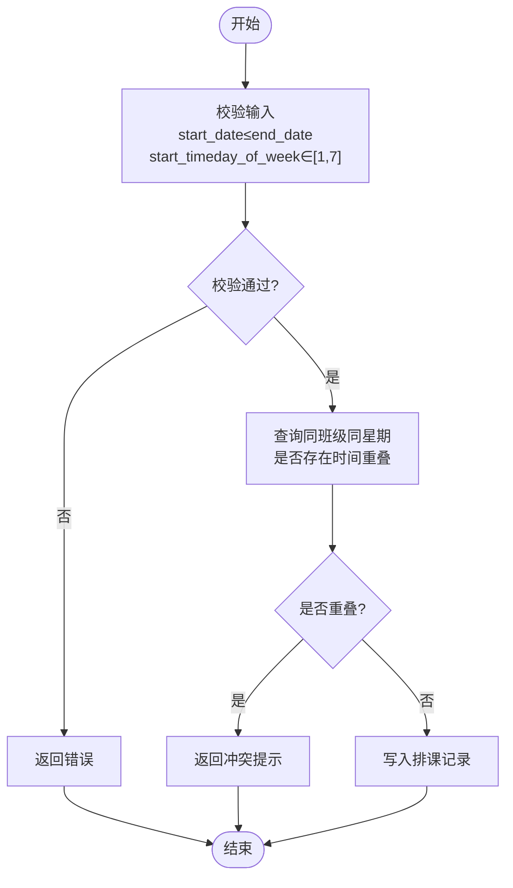
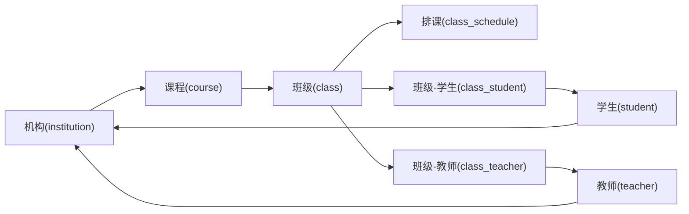

# 排课管理表结构

<cite>
**本文引用的文件**
- [class_times_record.sql](file://class_times_record_back/docs/class_times_record.sql)
- [architecture.md](file://class_times_record_back/docs/architecture.md)
</cite>

## 目录
1. [引言](#引言)
2. [项目结构](#项目结构)
3. [核心组件](#核心组件)
4. [架构总览](#架构总览)
5. [详细组件分析](#详细组件分析)
6. [依赖分析](#依赖分析)
7. [性能考虑](#性能考虑)
8. [故障排查指南](#故障排查指南)
9. [结论](#结论)
10. [附录](#附录)

## 引言
本文件聚焦于“排课管理”的数据库设计，围绕以下目标展开：
- 深入解析排课核心表 class_schedule 的设计，包括时间段定义、星期设置与时间冲突检测的数据模型支持。
- 说明班级关联表 class_student、class_teacher 的多对多关系设计与绑定机制。
- 分析课程表 course 与班级表 class 的关联关系，解释按次与按天两种课程类型的数据存储策略。
- 提供排课算法所需的关键字段规范（如 start_date、end_date、day_of_week、start_time、end_time）。
- 给出排课冲突检测的索引优化方案与查询性能调优建议，为排课系统的开发与维护提供完整的数据库设计指导。

## 项目结构
本项目采用微服务架构，业务域包含机构、学生、教师、家长、班级、排课、课程、课程记录、课时记录等能力。排课相关数据主要落在 business-service 对应的数据库中，核心表由 SQL 脚本定义。



图表来源
- [class_times_record.sql:39-53](file://class_times_record_back/docs/class_times_record.sql#L39-L53)
- [class_times_record.sql:58-73](file://class_times_record_back/docs/class_times_record.sql#L58-L73)
- [class_times_record.sql:78-89](file://class_times_record_back/docs/class_times_record.sql#L78-L89)
- [class_times_record.sql:94-105](file://class_times_record_back/docs/class_times_record.sql#L94-L105)
- [class_times_record.sql:110-122](file://class_times_record_back/docs/class_times_record.sql#L110-L122)
- [class_times_record.sql:299-316](file://class_times_record_back/docs/class_times_record.sql#L299-L316)
- [class_times_record.sql:409-424](file://class_times_record_back/docs/class_times_record.sql#L409-L424)
- [class_times_record.sql:169-179](file://class_times_record_back/docs/class_times_record.sql#L169-L179)

章节来源
- [architecture.md:47-57](file://class_times_record_back/docs/architecture.md#L47-L57)
- [class_times_record.sql:39-122](file://class_times_record_back/docs/class_times_record.sql#L39-L122)

## 核心组件
本节聚焦排课相关的核心实体与关系：
- 课程(course)：定义课程名称、类型（按次/按天）、所属机构等。
- 班级(class)：归属某一课程，维护班级名称、人数上限与状态。
- 排课(class_schedule)：描述班级的上课周期与具体时段（日期范围、星期、起止时间）。
- 班级-学生(class_student)、班级-教师(class_teacher)：实现班级与学生、教师的多对多绑定。
- 学生(student)、教师(teacher)、机构(institution)：基础主数据。

章节来源
- [class_times_record.sql:110-122](file://class_times_record_back/docs/class_times_record.sql#L110-L122)
- [class_times_record.sql:39-53](file://class_times_record_back/docs/class_times_record.sql#L39-L53)
- [class_times_record.sql:58-73](file://class_times_record_back/docs/class_times_record.sql#L58-L73)
- [class_times_record.sql:78-89](file://class_times_record_back/docs/class_times_record.sql#L78-L89)
- [class_times_record.sql:94-105](file://class_times_record_back/docs/class_times_record.sql#L94-L105)
- [class_times_record.sql:299-316](file://class_times_record_back/docs/class_times_record.sql#L299-L316)
- [class_times_record.sql:409-424](file://class_times_record_back/docs/class_times_record.sql#L409-L424)
- [class_times_record.sql:169-179](file://class_times_record_back/docs/class_times_record.sql#L169-L179)

## 架构总览
排课数据在业务层通过 Controller → Service → Mapper 访问数据库；排课冲突检测通常在 Service 层完成，利用数据库索引与唯一约束保障一致性与性能。



图表来源
- [architecture.md:59-64](file://class_times_record_back/docs/architecture.md#L59-L64)
- [class_times_record.sql:58-73](file://class_times_record_back/docs/class_times_record.sql#L58-L73)

## 详细组件分析

### 排课核心表 class_schedule 设计
- 关键字段
  - class_id：外键关联 class，表示该排课属于哪个班级。
  - start_date/end_date：排课的生效日期范围，用于支持按周/按月/按学期的周期性排课。
  - day_of_week：星期取值（1-7），代表周一到周日，便于按周循环生成具体日期。
  - start_time/end_time：每日的具体上课时间段。
  - remark：备注信息。
- 设计要点
  - 使用 date/time 类型保证时间语义明确，避免字符串歧义。
  - 通过 class_id + day_of_week + 时间区间进行冲突检测，确保同一班级在同一天的同一时段不重复。
  - 若需扩展至教室/教室容量限制，可在后续引入教室维度并增加相应约束。

```mermaid
erDiagram
CLASS_SCHEDULE {
int id PK
int class_id FK
date start_date
date end_date
tinyint day_of_week
time start_time
time end_time
varchar remark
datetime create_time
datetime update_time
}
CLASS ||--o{ CLASS_SCHEDULE : "拥有多个排课"
```

图表来源
- [class_times_record.sql:58-73](file://class_times_record_back/docs/class_times_record.sql#L58-L73)
- [class_times_record.sql:39-53](file://class_times_record_back/docs/class_times_record.sql#L39-L53)

章节来源
- [class_times_record.sql:58-73](file://class_times_record_back/docs/class_times_record.sql#L58-L73)

### 班级关联表 class_student、class_teacher 的多对多设计
- class_student
  - class_id + student_id 联合唯一，防止同一学生在同一班级重复绑定。
  - 通过外键分别指向 class 与 student，保证引用完整性。
- class_teacher
  - class_id + teacher_id 联合唯一，防止同一教师在同一个班级重复绑定。
  - 通过外键分别指向 class 与 teacher，保证引用完整性。
- 绑定机制
  - 新增绑定：插入中间表记录，触发人数统计或权限计算（可结合AOP或Service逻辑）。
  - 移除绑定：删除对应中间表记录，同步更新班级人数等聚合字段。

```mermaid
erDiagram
CLASS_STUDENT {
int id PK
int class_id FK
int student_id FK
datetime create_time
}
CLASS_TEACHER {
int id PK
int class_id FK
int teacher_id FK
datetime create_time
}
CLASS ||--o{ CLASS_STUDENT : "包含多名学生"
CLASS ||--o{ CLASS_TEACHER : "包含多名教师"
STUDENT ||--o{ CLASS_STUDENT : "被分配到班级"
TEACHER ||--o{ CLASS_TEACHER : "被分配到班级"
```

图表来源
- [class_times_record.sql:78-89](file://class_times_record_back/docs/class_times_record.sql#L78-L89)
- [class_times_record.sql:94-105](file://class_times_record_back/docs/class_times_record.sql#L94-L105)
- [class_times_record.sql:39-53](file://class_times_record_back/docs/class_times_record.sql#L39-L53)
- [class_times_record.sql:299-316](file://class_times_record_back/docs/class_times_record.sql#L299-L316)
- [class_times_record.sql:409-424](file://class_times_record_back/docs/class_times_record.sql#L409-L424)

章节来源
- [class_times_record.sql:78-89](file://class_times_record_back/docs/class_times_record.sql#L78-L89)
- [class_times_record.sql:94-105](file://class_times_record_back/docs/class_times_record.sql#L94-L105)

### 课程表 course 与班级表 class 的关联及课程类型策略
- 关联关系
  - class.course_id 外键指向 course.id，表示班级归属于某门课程。
- 课程类型
  - course_type：1=按次，2=按天。
  - 按次：以“次数”为核心计量单位，适合短期集训、体验课等场景。
  - 按天：以“天数”为核心计量单位，适合长期班、学期制等场景。
- 数据存储策略
  - 按次：课程记录与课时记录侧重“次数扣减”，排课仍按 class_schedule 的时间粒度组织，但计费与剩余次数基于“次”。
  - 按天：课程记录与课时记录侧重“天数扣减”，排课同样按 class_schedule 组织，但计费与剩余天数基于“天”。
  - 注意：course_type 影响的是课程计量与结算逻辑，不影响 class_schedule 的时间建模。

```mermaid
erDiagram
COURSE {
int id PK
varchar course_name
tinyint course_type
int institution_id FK
tinyint is_available
datetime create_time
datetime update_time
}
CLASS {
int id PK
int course_id FK
varchar class_name
int student_count
int student_max_count
tinyint status
tinyint isDelete
datetime create_time
datetime update_time
}
COURSE ||--o{ CLASS : "一门课程可有多班级"
```

图表来源
- [class_times_record.sql:110-122](file://class_times_record_back/docs/class_times_record.sql#L110-L122)
- [class_times_record.sql:39-53](file://class_times_record_back/docs/class_times_record.sql#L39-L53)

章节来源
- [class_times_record.sql:110-122](file://class_times_record_back/docs/class_times_record.sql#L110-L122)
- [class_times_record.sql:39-53](file://class_times_record_back/docs/class_times_record.sql#L39-L53)

### 排课算法所需字段与使用规范
- 关键字段
  - start_date/end_date：排课生效的日期区间，常用于批量生成具体日期的排课实例。
  - day_of_week：1-7 表示周一至周日，配合 start_date/end_date 可生成每周固定时段的排课。
  - start_time/end_time：每日的具体上课时间段，用于冲突检测与展示。
- 使用规范
  - 生成规则：在 start_date 与 end_date 范围内，按 day_of_week 映射到具体日期，再套用 start_time/end_time 得到最终上课时间点。
  - 边界条件：start_date ≤ end_date；start_time < end_time；day_of_week ∈ [1,7]。
  - 冲突检测：同一 class_id 下，相同 day_of_week 且时间区间存在重叠即冲突。



图表来源
- [class_times_record.sql:58-73](file://class_times_record_back/docs/class_times_record.sql#L58-L73)

章节来源
- [class_times_record.sql:58-73](file://class_times_record_back/docs/class_times_record.sql#L58-L73)

### 排课冲突检测的数据模型支持与约束
- 当前约束
  - class_schedule 仅对 class_id 建立普通索引，未对“星期+时间区间”建立唯一约束。
  - 因此，严格意义上的“同一天同一时段不可重复”需在应用层（Service）做冲突检测，或使用数据库触发器/唯一约束增强。
- 推荐增强
  - 在 class_id + day_of_week 上建立复合索引，加速冲突查询。
  - 若需要强一致性，可引入“排课实例表”（将周期性规则展开为具体日期行），并对“class_id + 具体日期 + 时间区间”建立唯一约束，从而把冲突检测下沉到数据库层。

章节来源
- [class_times_record.sql:58-73](file://class_times_record_back/docs/class_times_record.sql#L58-L73)

## 依赖分析
排课相关表的依赖关系如下：
- class_schedule.class_id → class.id
- class.course_id → course.id
- class_student.class_id → class.id；class_student.student_id → student.id
- class_teacher.class_id → class.id；class_teacher.teacher_id → teacher.id
- student.institution_id → institution.id
- teacher.institution_id → institution.id
- course.institution_id → institution.id



图表来源
- [class_times_record.sql:169-179](file://class_times_record_back/docs/class_times_record.sql#L169-L179)
- [class_times_record.sql:110-122](file://class_times_record_back/docs/class_times_record.sql#L110-L122)
- [class_times_record.sql:39-53](file://class_times_record_back/docs/class_times_record.sql#L39-L53)
- [class_times_record.sql:58-73](file://class_times_record_back/docs/class_times_record.sql#L58-L73)
- [class_times_record.sql:78-89](file://class_times_record_back/docs/class_times_record.sql#L78-L89)
- [class_times_record.sql:94-105](file://class_times_record_back/docs/class_times_record.sql#L94-L105)
- [class_times_record.sql:299-316](file://class_times_record_back/docs/class_times_record.sql#L299-L316)
- [class_times_record.sql:409-424](file://class_times_record_back/docs/class_times_record.sql#L409-L424)

章节来源
- [class_times_record.sql:169-179](file://class_times_record_back/docs/class_times_record.sql#L169-L179)
- [class_times_record.sql:110-122](file://class_times_record_back/docs/class_times_record.sql#L110-L122)
- [class_times_record.sql:39-53](file://class_times_record_back/docs/class_times_record.sql#L39-L53)
- [class_times_record.sql:58-73](file://class_times_record_back/docs/class_times_record.sql#L58-L73)
- [class_times_record.sql:78-89](file://class_times_record_back/docs/class_times_record.sql#L78-L89)
- [class_times_record.sql:94-105](file://class_times_record_back/docs/class_times_record.sql#L94-L105)
- [class_times_record.sql:299-316](file://class_times_record_back/docs/class_times_record.sql#L299-L316)
- [class_times_record.sql:409-424](file://class_times_record_back/docs/class_times_record.sql#L409-L424)

## 性能考虑
- 索引优化建议
  - 为 class_schedule 添加复合索引：(class_id, day_of_week)。该索引可显著加速“同班级同星期”的冲突检测查询。
  - 若未来引入“排课实例表”，建议对 (class_id, 具体日期, start_time, end_time) 建立唯一索引，将冲突检测下沉到数据库层。
- 查询性能调优
  - 冲突检测SQL应限定 class_id 与 day_of_week，并使用时间区间重叠判断（start_time < 已有.end_time AND end_time > 已有.start_time）。
  - 批量生成排课时，先按星期分组预检冲突，再分批插入，减少锁竞争与回滚成本。
  - 对 class 表的 student_count 等聚合字段，建议在增删学生时异步或事务内更新，避免频繁COUNT。
- 事务与一致性
  - 排课插入与冲突检测应在同一事务中执行，避免并发插入导致重复。
  - 对于高频操作，可考虑在应用层加分布式锁（如 Redis）保护关键路径。

章节来源
- [class_times_record.sql:58-73](file://class_times_record_back/docs/class_times_record.sql#L58-L73)

## 故障排查指南
- 常见问题
  - 排课冲突：同一班级在同一天同一时段重复排课。优先检查应用层冲突检测逻辑与数据库索引是否完善。
  - 绑定重复：同一学生在同一班级重复绑定。检查 class_student 的唯一约束是否生效。
  - 数据不一致：班级人数与实际不符。检查人数统计是否在增删学生后正确更新。
- 定位方法
  - 查看 class_schedule 的 class_id + day_of_week 组合查询结果，确认是否存在时间重叠。
  - 检查 class_student 与 class_teacher 的唯一约束是否阻止了重复绑定。
  - 核对 class 表的 student_count 与 class_student 的 COUNT 是否一致。

章节来源
- [class_times_record.sql:78-89](file://class_times_record_back/docs/class_times_record.sql#L78-L89)
- [class_times_record.sql:94-105](file://class_times_record_back/docs/class_times_record.sql#L94-L105)
- [class_times_record.sql:39-53](file://class_times_record_back/docs/class_times_record.sql#L39-L53)
- [class_times_record.sql:58-73](file://class_times_record_back/docs/class_times_record.sql#L58-L73)

## 结论
- class_schedule 以“日期范围 + 星期 + 时间段”表达周期性排课，具备良好可扩展性。
- class_student 与 class_teacher 通过联合唯一约束实现稳定的多对多绑定。
- course_type 区分按次与按天，影响课程计量与结算逻辑，但不改变排课的时间建模。
- 当前冲突检测依赖应用层，建议通过复合索引与可能的“排课实例表”进一步下沉到数据库层，提升一致性与性能。

## 附录
- 接口路由参考：排课相关接口位于 /biz/class_schedule，由 Gateway 转发至 business-service。
- 安全与鉴权：Gateway 层统一进行 JWT 校验与签名验证，业务层再进行二次校验与上下文注入。

章节来源
- [architecture.md:59-64](file://class_times_record_back/docs/architecture.md#L59-L64)
- [architecture.md:92-147](file://class_times_record_back/docs/architecture.md#L92-L147)