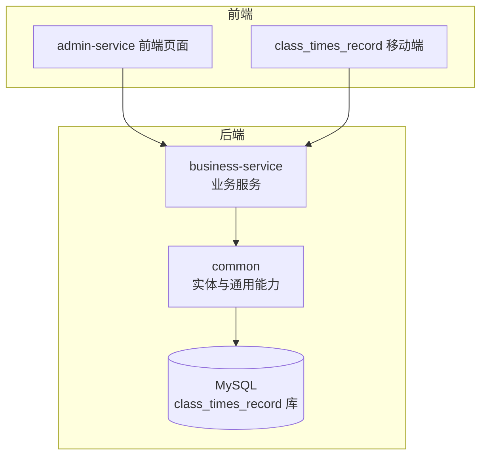
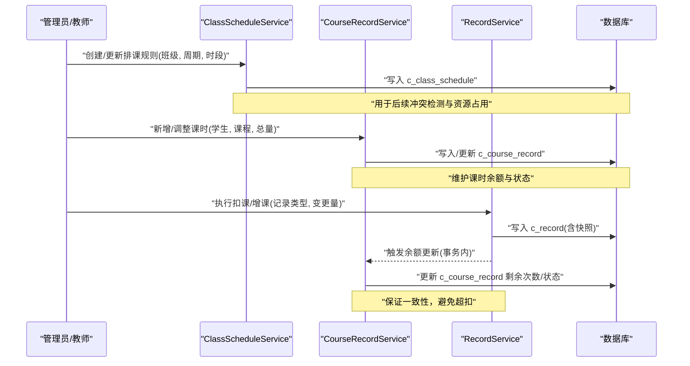
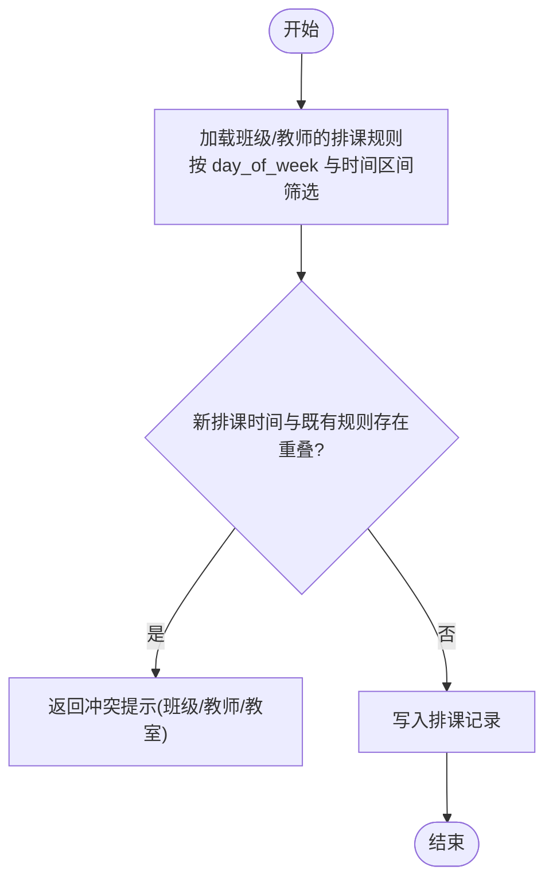
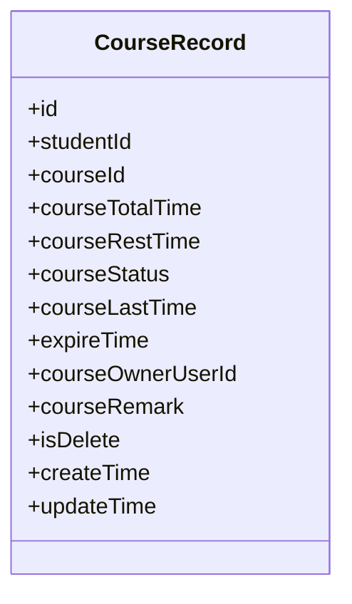
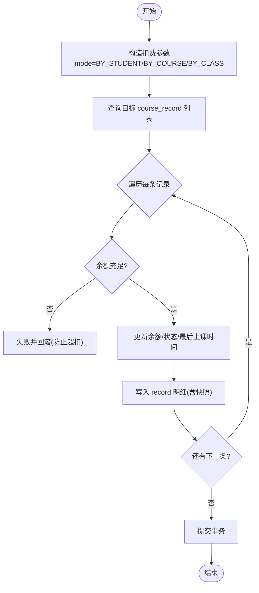
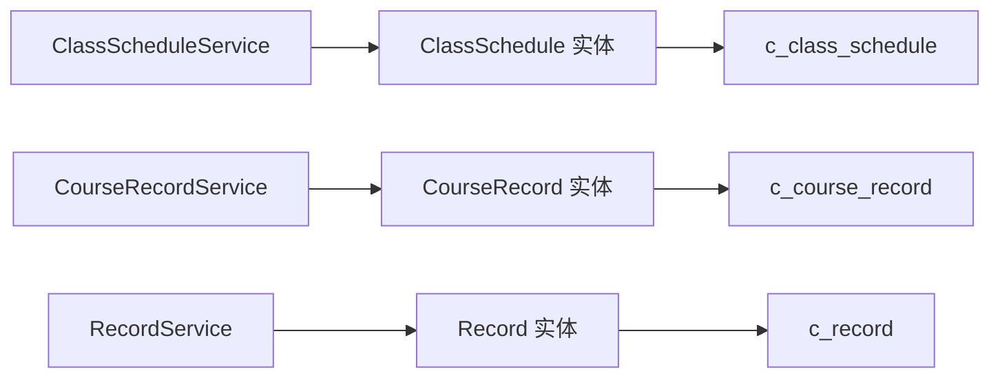

# 排课课时表结构

<cite>
**本文引用的文件**   
- [class_times_record.sql](file://class_times_record_back/docs/class_times_record.sql)
- [ClassSchedule.java](file://class_times_record_back/common/src/main/java/com/shiroko/repository/entity/ClassSchedule.java)
- [CourseRecord.java](file://class_times_record_back/common/src/main/java/com/shiroko/repository/entity/CourseRecord.java)
- [Record.java](file://class_times_record_back/common/src/main/java/com/shiroko/repository/entity/Record.java)
- [ClassStudent.java](file://class_times_record_back/common/src/main/java/com/shiroko/repository/entity/ClassStudent.java)
- [ClassScheduleService.java](file://class_times_record_back/business-service/src/main/java/com/shiroko/service/ClassScheduleService.java)
- [CourseRecordService.java](file://class_times_record_back/business-service/src/main/java/com/shiroko/service/CourseRecordService.java)
- [RecordService.java](file://class_times_record_back/business-service/src/main/java/com/shiroko/service/RecordService.java)
</cite>

## 目录
1. [引言](#引言)
2. [项目结构](#项目结构)
3. [核心组件](#核心组件)
4. [架构总览](#架构总览)
5. [详细组件分析](#详细组件分析)
6. [依赖分析](#依赖分析)
7. [性能考虑](#性能考虑)
8. [故障排查指南](#故障排查指南)
9. [结论](#结论)
10. [附录](#附录)

## 引言
本文件围绕排课与课时管理的数据模型展开，聚焦以下目标：
- 解析排课管理表、课时记录表、上课记录表以及班级关联表的结构设计与关系。
- 说明排课算法所需的数据模型支撑（时间冲突检测、资源分配、周期性排课）。
- 解释课时扣减与统计的数据流转过程（变更追踪、历史记录保存、状态更新机制）。
- 提供复杂查询优化的索引设计与表关联策略，并给出大数据量下的性能优化与分区建议。
- 为排课系统的开发与维护提供数据库设计指导。

## 项目结构
本项目采用前后端分离与多服务架构，后端包含业务服务、通用实体与数据访问层；前端包含管理后台与移动端应用。与排课课时相关的数据定义集中在 SQL 脚本中，实体映射位于 common 模块的 entity 包，服务接口位于 business-service 模块。



图表来源
- [ClassScheduleService.java:1-30](file://class_times_record_back/business-service/src/main/java/com/shiroko/service/ClassScheduleService.java#L1-L30)
- [CourseRecordService.java:1-49](file://class_times_record_back/business-service/src/main/java/com/shiroko/service/CourseRecordService.java#L1-L49)
- [RecordService.java:1-28](file://class_times_record_back/business-service/src/main/java/com/shiroko/service/RecordService.java#L1-L28)
- [ClassSchedule.java:1-80](file://class_times_record_back/common/src/main/java/com/shiroko/repository/entity/ClassSchedule.java#L1-L80)
- [CourseRecord.java:1-111](file://class_times_record_back/common/src/main/java/com/shiroko/repository/entity/CourseRecord.java#L1-L111)
- [Record.java:1-102](file://class_times_record_back/common/src/main/java/com/shiroko/repository/entity/Record.java#L1-L102)

章节来源
- [class_times_record.sql:1-496](file://class_times_record_back/docs/class_times_record.sql#L1-L496)

## 核心组件
本节梳理与排课课时直接相关的核心表与实体，并说明其职责与关键字段。

- 排课管理表 class_schedule
  - 作用：描述班级的周期性排课规则，支持按周重复的时间段配置。
  - 关键字段：班级ID、时间段起止日期、星期几、开始/结束时间、备注等。
  - 用途：用于排课展示、冲突检测、教师/教室资源占用判断。

- 课时记录表 course_record
  - 作用：记录学生某门课程的课时总量、剩余次数、上次上课时间、到期时间、归属人等。
  - 关键字段：学生ID、课程ID、课时总数、剩余次数、状态、过期时间、逻辑删除标记等。
  - 用途：作为课时余额主数据，驱动扣费与统计。

- 上课记录表 record
  - 作用：记录每次增课/消课/纯记录的明细，保留变更快照与操作人信息。
  - 关键字段：课时记录ID、记录时间、类型、变更数量、扣费后剩余快照、扣费模式、班级ID、操作人等。
  - 用途：审计与追溯，支撑报表与对账。

- 班级关联表
  - class_student：班级与学生多对多关系。
  - class_teacher：班级与教师多对多关系。
  - teacher_course：教师与课程多对多关系。
  - 用途：排课资源绑定、批量扣费、权限与可见性控制。

章节来源
- [class_times_record.sql:56-73](file://class_times_record_back/docs/class_times_record.sql#L56-L73)
- [class_times_record.sql:140-164](file://class_times_record_back/docs/class_times_record.sql#L140-L164)
- [class_times_record.sql:262-281](file://class_times_record_back/docs/class_times_record.sql#L262-L281)
- [class_times_record.sql:76-89](file://class_times_record_back/docs/class_times_record.sql#L76-L89)
- [class_times_record.sql:92-105](file://class_times_record_back/docs/class_times_record.sql#L92-L105)
- [class_times_record.sql:426-439](file://class_times_record_back/docs/class_times_record.sql#L426-L439)
- [ClassSchedule.java:1-80](file://class_times_record_back/common/src/main/java/com/shiroko/repository/entity/ClassSchedule.java#L1-L80)
- [CourseRecord.java:1-111](file://class_times_record_back/common/src/main/java/com/shiroko/repository/entity/CourseRecord.java#L1-L111)
- [Record.java:1-102](file://class_times_record_back/common/src/main/java/com/shiroko/repository/entity/Record.java#L1-L102)
- [ClassStudent.java:1-53](file://class_times_record_back/common/src/main/java/com/shiroko/repository/entity/ClassStudent.java#L1-L53)

## 架构总览
下图展示了排课与课时扣减的核心数据流：从排课规则到课时记录，再到上课记录明细，最终形成可审计的流水。



图表来源
- [ClassScheduleService.java:18-29](file://class_times_record_back/business-service/src/main/java/com/shiroko/service/ClassScheduleService.java#L18-L29)
- [CourseRecordService.java:18-48](file://class_times_record_back/business-service/src/main/java/com/shiroko/service/CourseRecordService.java#L18-L48)
- [RecordService.java:18-27](file://class_times_record_back/business-service/src/main/java/com/shiroko/service/RecordService.java#L18-L27)
- [class_times_record.sql:56-73](file://class_times_record_back/docs/class_times_record.sql#L56-L73)
- [class_times_record.sql:140-164](file://class_times_record_back/docs/class_times_record.sql#L140-L164)
- [class_times_record.sql:262-281](file://class_times_record_back/docs/class_times_record.sql#L262-L281)

## 详细组件分析

### 排课管理表 class_schedule
- 字段要点
  - 周期维度：start_date、end_date、day_of_week 组合表达“在某个日期区间内的每周星期几”的重复规则。
  - 时间维度：start_time、end_time 表示具体节次时长。
  - 关联维度：class_id 指向班级，便于与 class_student、class_teacher 联动进行资源校验。
- 排课算法支持
  - 时间冲突检测：在同一 day_of_week + start_time/end_time 范围内，检查同一班级或同一教师是否已有排课。
  - 资源分配：结合 class_teacher 与 teacher_course，确保授课教师具备对应课程资质且无时间冲突。
  - 周期性排课：通过 start_date/end_date 限定生效范围，支持学期/月度模板化生成。
- 索引与查询
  - 现有索引：class_id。
  - 建议增强：(class_id, day_of_week)、(class_id, start_date, end_date)、(class_id, start_time, end_time) 以优化冲突检测与范围查询。
- 复杂度与性能
  - 冲突检测通常为 O(n) 扫描同班/同教师同周时段的排课，建议在应用层先做粗粒度过滤（按周/日），再精确比较时间区间重叠。



图表来源
- [class_times_record.sql:56-73](file://class_times_record_back/docs/class_times_record.sql#L56-L73)
- [ClassSchedule.java:1-80](file://class_times_record_back/common/src/main/java/com/shiroko/repository/entity/ClassSchedule.java#L1-L80)

章节来源
- [class_times_record.sql:56-73](file://class_times_record_back/docs/class_times_record.sql#L56-L73)
- [ClassSchedule.java:1-80](file://class_times_record_back/common/src/main/java/com/shiroko/repository/entity/ClassSchedule.java#L1-L80)

### 课时记录表 course_record
- 字段要点
  - 余额与状态：course_total_time、course_rest_time、course_status、expire_time、course_last_time。
  - 归属与审计：course_owner_user_id、is_delete、create_time/update_time。
- 数据一致性
  - 与 record 表配合，确保每次扣费/增课都产生明细，并在事务中同步更新余额与状态。
- 索引与查询
  - 现有索引：student_id+course_id 唯一键、course_owner_user_id、course_id。
  - 建议增强：(student_id, course_status)、(expire_time)、(course_rest_time) 以优化待办与过期处理。
- 复杂度与性能
  - 高频更新场景（扣课）需关注行锁竞争，建议分库分表或按机构/学期分区。



图表来源
- [CourseRecord.java:1-111](file://class_times_record_back/common/src/main/java/com/shiroko/repository/entity/CourseRecord.java#L1-L111)
- [class_times_record.sql:140-164](file://class_times_record_back/docs/class_times_record.sql#L140-L164)

章节来源
- [class_times_record.sql:140-164](file://class_times_record_back/docs/class_times_record.sql#L140-L164)
- [CourseRecord.java:1-111](file://class_times_record_back/common/src/main/java/com/shiroko/repository/entity/CourseRecord.java#L1-L111)

### 上课记录表 record
- 字段要点
  - 明细与快照：record_type、record_change、rest_time_after_deduct、deduct_mode、class_id、operate_teacher_id。
  - 审计与追溯：record_time、record_remark、create_time/update_time。
- 数据流转
  - 插入 record 后，根据 deduct_mode 选择按学生/课程/班级批量扣费，并回写 course_record 的余额与状态。
- 索引与查询
  - 现有索引：course_record_id、operate_teacher_id。
  - 建议增强：(course_record_id, record_time)、(deduct_mode, class_id)、(operate_teacher_id, record_time) 以优化报表与审计。
- 复杂度与性能
  - 批量扣费时可能涉及多条 course_record 更新，建议使用批处理与合理的事务边界。



图表来源
- [Record.java:1-102](file://class_times_record_back/common/src/main/java/com/shiroko/repository/entity/Record.java#L1-L102)
- [CourseRecord.java:1-111](file://class_times_record_back/common/src/main/java/com/shiroko/repository/entity/CourseRecord.java#L1-L111)
- [class_times_record.sql:262-281](file://class_times_record_back/docs/class_times_record.sql#L262-L281)
- [class_times_record.sql:140-164](file://class_times_record_back/docs/class_times_record.sql#L140-L164)

章节来源
- [class_times_record.sql:262-281](file://class_times_record_back/docs/class_times_record.sql#L262-L281)
- [Record.java:1-102](file://class_times_record_back/common/src/main/java/com/shiroko/repository/entity/Record.java#L1-L102)

### 班级关联表 class_student、class_teacher、teacher_course
- 作用
  - class_student：班级-学生关系，支持按班级批量扣费与通知。
  - class_teacher：班级-教师关系，用于排课资源校验与授课安排。
  - teacher_course：教师-课程关系，用于教学资质校验。
- 索引与约束
  - 均具备复合唯一索引或普通索引，保障关系一致性与查询效率。
- 排课与扣费联动
  - 排课时依据 class_teacher 与 teacher_course 校验教师-课程匹配与时间冲突。
  - 批量扣费时依据 class_student 定位目标学生集合。

```mermaid
erDiagram
CLASS_STUDENT {
int id PK
int class_id FK
int student_id FK
datetime create_time
}
CLASS_TEACHER {
int id PK
int class_id FK
int teacher_id FK
datetime create_time
}
TEACHER_COURSE {
int id PK
int teacher_id FK
int course_id FK
datetime create_time
}
CLASS ||--o{ CLASS_STUDENT : "包含"
CLASS ||--o{ CLASS_TEACHER : "任课"
TEACHER ||--o{ TEACHER_COURSE : "教授"
COURSE ||--o{ TEACHER_COURSE : "被教授"
```

图表来源
- [class_times_record.sql:76-89](file://class_times_record_back/docs/class_times_record.sql#L76-L89)
- [class_times_record.sql:92-105](file://class_times_record_back/docs/class_times_record.sql#L92-L105)
- [class_times_record.sql:426-439](file://class_times_record_back/docs/class_times_record.sql#L426-L439)
- [ClassStudent.java:1-53](file://class_times_record_back/common/src/main/java/com/shiroko/repository/entity/ClassStudent.java#L1-L53)

章节来源
- [class_times_record.sql:76-89](file://class_times_record_back/docs/class_times_record.sql#L76-L89)
- [class_times_record.sql:92-105](file://class_times_record_back/docs/class_times_record.sql#L92-L105)
- [class_times_record.sql:426-439](file://class_times_record_back/docs/class_times_record.sql#L426-L439)
- [ClassStudent.java:1-53](file://class_times_record_back/common/src/main/java/com/shiroko/repository/entity/ClassStudent.java#L1-L53)

## 依赖分析
- 服务与实体
  - ClassScheduleService 面向 class_schedule 的查询与更新。
  - CourseRecordService 面向 course_record 的增删改查与扣费流程。
  - RecordService 面向 record 的明细写入与查询。
- 实体与表
  - 各实体通过 @TableName 注解映射至实际表名，字段通过 @TableField 指定列名。
- 外部依赖
  - 使用 MyBatis-Plus 的 IService 抽象简化 CRUD。
  - 统一响应体 ResponseDTO 封装结果。



图表来源
- [ClassScheduleService.java:18-29](file://class_times_record_back/business-service/src/main/java/com/shiroko/service/ClassScheduleService.java#L18-L29)
- [CourseRecordService.java:18-48](file://class_times_record_back/business-service/src/main/java/com/shiroko/service/CourseRecordService.java#L18-L48)
- [RecordService.java:18-27](file://class_times_record_back/business-service/src/main/java/com/shiroko/service/RecordService.java#L18-L27)
- [ClassSchedule.java:22-24](file://class_times_record_back/common/src/main/java/com/shiroko/repository/entity/ClassSchedule.java#L22-L24)
- [CourseRecord.java:22-26](file://class_times_record_back/common/src/main/java/com/shiroko/repository/entity/CourseRecord.java#L22-L26)
- [Record.java:22-26](file://class_times_record_back/common/src/main/java/com/shiroko/repository/entity/Record.java#L22-L26)

章节来源
- [ClassScheduleService.java:1-30](file://class_times_record_back/business-service/src/main/java/com/shiroko/service/ClassScheduleService.java#L1-L30)
- [CourseRecordService.java:1-49](file://class_times_record_back/business-service/src/main/java/com/shiroko/service/CourseRecordService.java#L1-L49)
- [RecordService.java:1-28](file://class_times_record_back/business-service/src/main/java/com/shiroko/service/RecordService.java#L1-L28)
- [ClassSchedule.java:1-80](file://class_times_record_back/common/src/main/java/com/shiroko/repository/entity/ClassSchedule.java#L1-L80)
- [CourseRecord.java:1-111](file://class_times_record_back/common/src/main/java/com/shiroko/repository/entity/CourseRecord.java#L1-L111)
- [Record.java:1-102](file://class_times_record_back/common/src/main/java/com/shiroko/repository/entity/Record.java#L1-L102)

## 性能考虑
- 索引优化
  - class_schedule：增加 (class_id, day_of_week)、(class_id, start_date, end_date)、(class_id, start_time, end_time) 以加速冲突检测与范围查询。
  - course_record：增加 (student_id, course_status)、(expire_time)、(course_rest_time) 以优化待办与过期任务。
  - record：增加 (course_record_id, record_time)、(deduct_mode, class_id)、(operate_teacher_id, record_time) 以优化报表与审计。
- 事务与并发
  - 扣费流程需在事务内完成 record 写入与 course_record 余额更新，避免超扣与不一致。
  - 高并发下对 course_record 的行锁竞争可通过分片键（如 student_id 哈希）分散热点。
- 分区策略
  - 按机构/学期对 course_record 与 record 进行水平分区，降低单表体积，提升归档与清理效率。
  - 对 class_schedule 可按学期分区，便于历史数据归档。
- 读写分离与缓存
  - 读多写少场景（排课查看、课时统计）可使用只读副本与缓存（如 Redis）减少数据库压力。
- 批处理与异步
  - 批量扣费与报表生成建议走异步任务队列，避免阻塞主流程。

[本节为通用性能建议，不直接分析具体文件]

## 故障排查指南
- 常见异常
  - 课时不足：扣费时余额不足导致失败，需检查 course_record.course_rest_time 与 record.record_change 的一致性。
  - 排课冲突：同一班级/教师在相同时段已有排课，需检查 class_schedule 的 day_of_week 与时间区间。
  - 外键约束：删除基础数据（如班级、教师、课程）时受外键限制，需先清理关联记录。
- 定位方法
  - 核对 record 明细与 course_record 余额快照 rest_time_after_deduct 是否一致。
  - 检查 course_record 的 course_status 与 expire_time 是否符合业务预期。
  - 审查 class_schedule 的 class_id、day_of_week、start_time/end_time 是否存在重叠。
- 修复建议
  - 对不一致数据进行补偿修正，优先基于 record 明细重算余额。
  - 对排课冲突，提供自动避让或人工干预界面。

章节来源
- [class_times_record.sql:140-164](file://class_times_record_back/docs/class_times_record.sql#L140-L164)
- [class_times_record.sql:262-281](file://class_times_record_back/docs/class_times_record.sql#L262-L281)
- [class_times_record.sql:56-73](file://class_times_record_back/docs/class_times_record.sql#L56-L73)

## 结论
本设计通过 class_schedule、course_record、record 及班级关联表构建了完整的排课与课时管理体系。借助合理的索引与分区策略，可在保证数据一致性的前提下满足高并发与大数据量的需求。建议在实现中强化事务边界、冲突检测与审计追溯能力，并结合业务规模逐步引入缓存与异步化处理。

[本节为总结性内容，不直接分析具体文件]

## 附录
- 关键实体与表映射路径
  - ClassSchedule -> c_class_schedule
  - CourseRecord -> c_course_record
  - Record -> c_record
  - ClassStudent -> c_class_student
- 服务接口参考
  - ClassScheduleService：排课查询与更新
  - CourseRecordService：课时记录管理与扣费
  - RecordService：上课记录明细写入与查询

章节来源
- [ClassSchedule.java:22-24](file://class_times_record_back/common/src/main/java/com/shiroko/repository/entity/ClassSchedule.java#L22-L24)
- [CourseRecord.java:22-26](file://class_times_record_back/common/src/main/java/com/shiroko/repository/entity/CourseRecord.java#L22-L26)
- [Record.java:22-26](file://class_times_record_back/common/src/main/java/com/shiroko/repository/entity/Record.java#L22-L26)
- [ClassScheduleService.java:18-29](file://class_times_record_back/business-service/src/main/java/com/shiroko/service/ClassScheduleService.java#L18-L29)
- [CourseRecordService.java:18-48](file://class_times_record_back/business-service/src/main/java/com/shiroko/service/CourseRecordService.java#L18-L48)
- [RecordService.java:18-27](file://class_times_record_back/business-service/src/main/java/com/shiroko/service/RecordService.java#L18-L27)