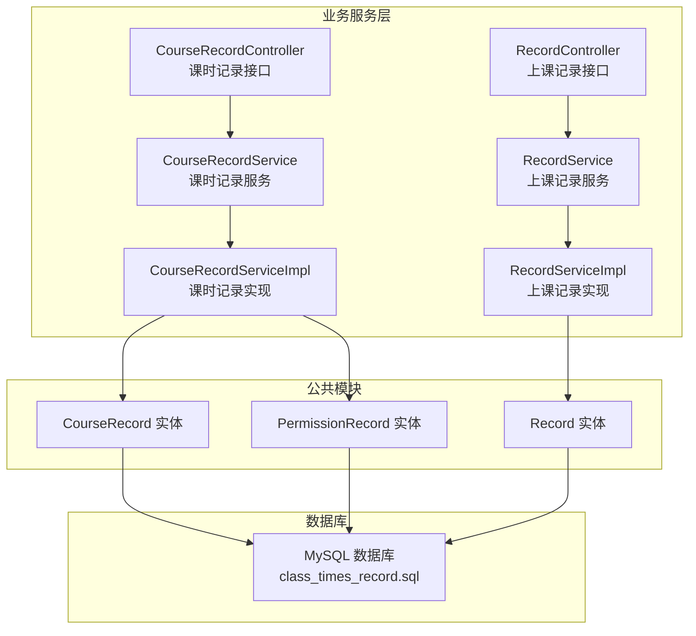
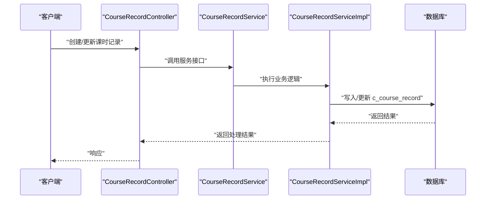
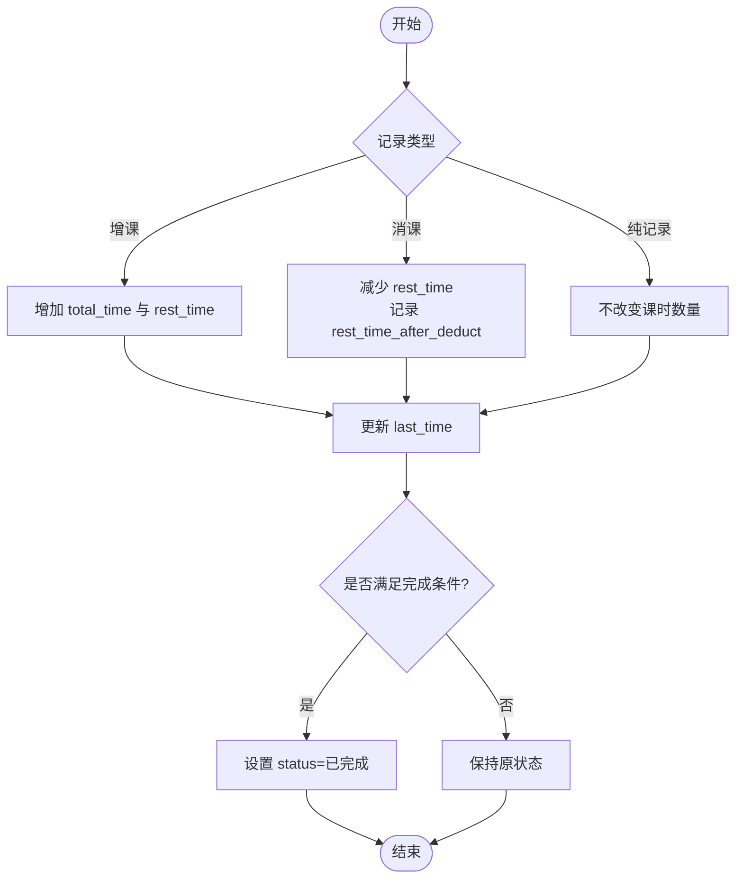
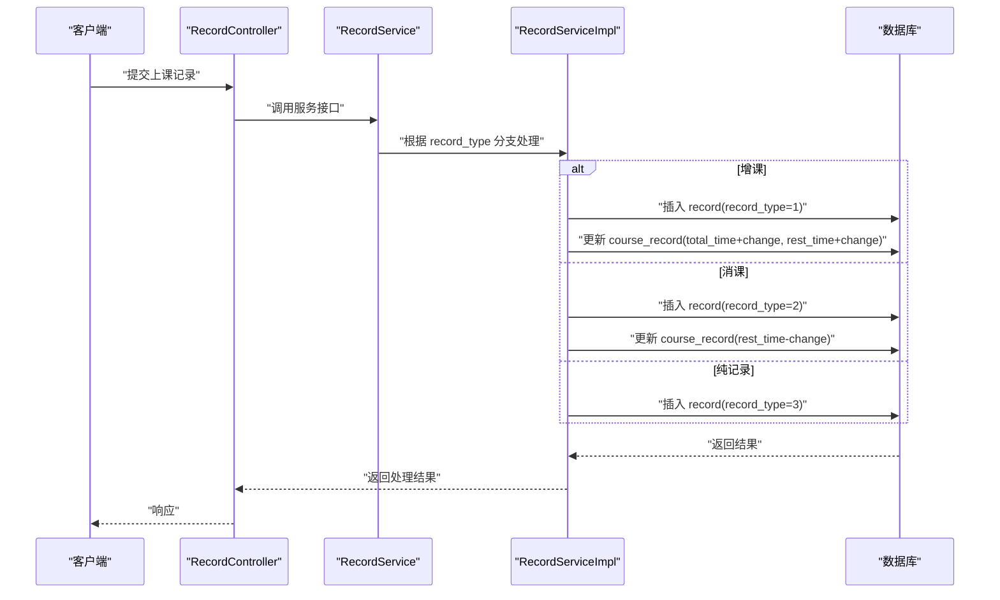
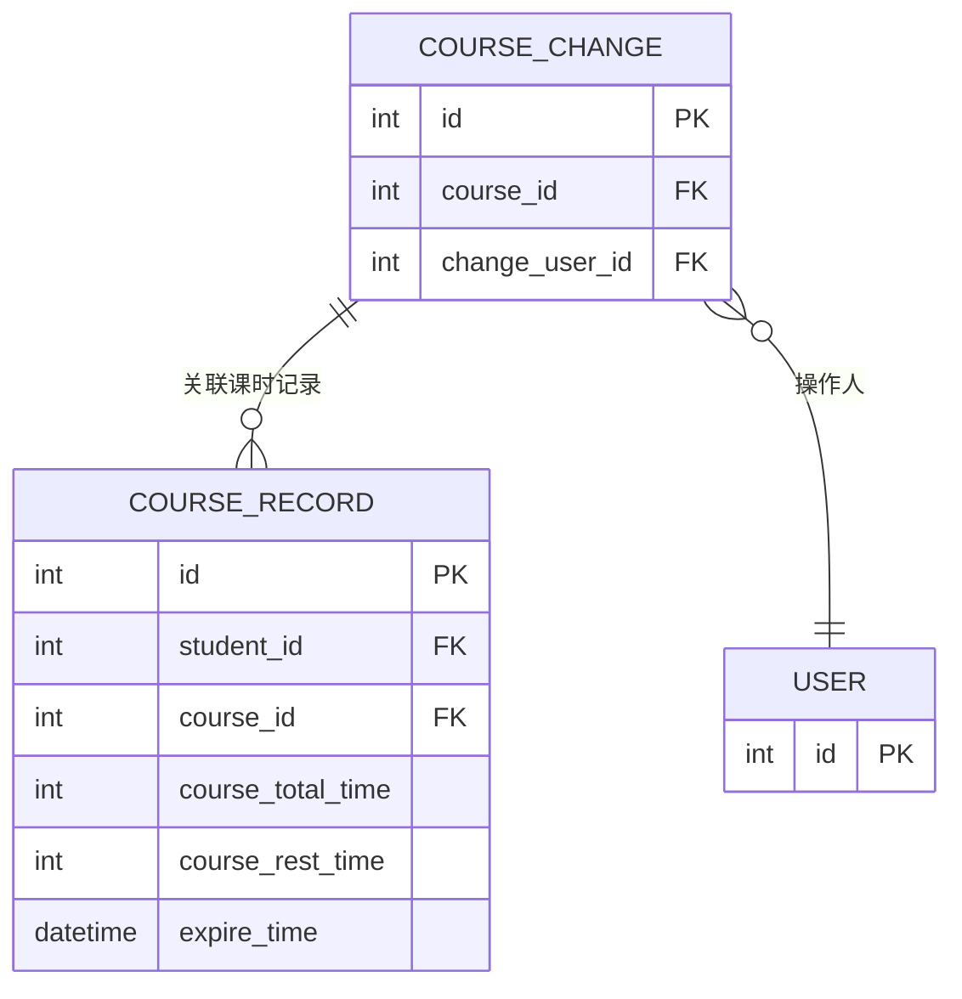
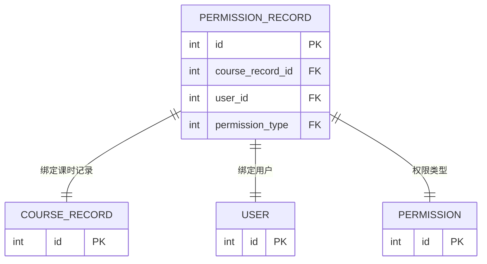
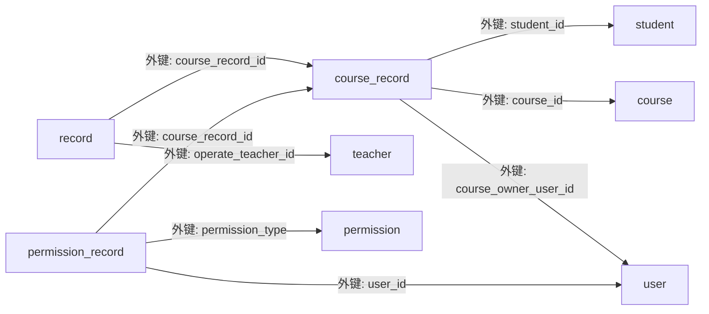

# 课时记录表结构

<cite>
**本文引用的文件**   
- [class_times_record.sql](file://class_times_record_back/docs/class_times_record.sql)
- [CourseRecord.java](file://class_times_record_back/common/src/main/java/com/shiroko/repository/entity/CourseRecord.java)
- [Record.java](file://class_times_record_back/common/src/main/java/com/shiroko/repository/entity/Record.java)
- [PermissionRecord.java](file://class_times_record_back/common/src/main/java/com/shiroko/repository/entity/PermissionRecord.java)
- [CourseRecordController.java](file://class_times_record_back/business-service/src/main/java/com/shiroko/controller/CourseRecordController.java)
- [CourseRecordService.java](file://class_times_record_back/business-service/src/main/java/com/shiroko/service/CourseRecordService.java)
- [CourseRecordServiceImpl.java](file://class_times_record_back/business-service/src/main/java/com/shiroko/service/impl/CourseRecordServiceImpl.java)
- [RecordController.java](file://class_times_record_back/business-service/src/main/java/com/shiroko/controller/RecordController.java)
- [RecordService.java](file://class_times_record_back/business-service/src/main/java/com/shiroko/service/RecordService.java)
- [RecordServiceImpl.java](file://class_times_record_back/business-service/src/main/java/com/shiroko/service/impl/RecordServiceImpl.java)
</cite>

## 目录
1. [简介](#简介)
2. [项目结构](#项目结构)
3. [核心组件](#核心组件)
4. [架构总览](#架构总览)
5. [详细组件分析](#详细组件分析)
6. [依赖关系分析](#依赖关系分析)
7. [性能考虑](#性能考虑)
8. [故障排查指南](#故障排查指南)
9. [结论](#结论)
10. [附录](#附录)

## 简介
本文件面向课时管理系统的数据结构设计，围绕以下目标展开：
- 深入解析课时记录核心表 course_record 的设计与关键字段（课时总数、剩余课时、到期时间等）的管理机制。
- 详细说明上课记录表 record 的数据流转过程，涵盖增课、消课、纯记录三种类型。
- 分析课时变更追踪表 course_change 的审计功能，解释操作人记录与变更历史保存策略。
- 说明权限控制表 permission_record 与课时记录的关联关系，实现用户对特定课程的访问控制。
- 提供课时统计与报表生成的数据模型支持建议，包括学生课时统计、教师工作量统计等。
- 给出大数据量下的查询优化方案和数据归档策略。

## 项目结构
后端采用分层架构：控制器层负责接口定义，服务层封装业务逻辑，持久层通过实体映射到数据库表。核心领域对象包括课程记录、上课记录、权限记录等。

图表来源
- [CourseRecordController.java:1-200](file://class_times_record_back/business-service/src/main/java/com/shiroko/controller/CourseRecordController.java#L1-L200)
- [RecordController.java:1-200](file://class_times_record_back/business-service/src/main/java/com/shiroko/controller/RecordController.java#L1-L200)
- [CourseRecordService.java:1-200](file://class_times_record_back/business-service/src/main/java/com/shiroko/service/CourseRecordService.java#L1-L200)
- [RecordService.java:1-200](file://class_times_record_back/business-service/src/main/java/com/shiroko/service/RecordService.java#L1-L200)
- [CourseRecordServiceImpl.java:1-400](file://class_times_record_back/business-service/src/main/java/com/shiroko/service/impl/CourseRecordServiceImpl.java#L1-L400)
- [RecordServiceImpl.java:1-400](file://class_times_record_back/business-service/src/main/java/com/shiroko/service/impl/RecordServiceImpl.java#L1-L400)
- [CourseRecord.java:1-111](file://class_times_record_back/common/src/main/java/com/shiroko/repository/entity/CourseRecord.java#L1-L111)
- [Record.java:1-102](file://class_times_record_back/common/src/main/java/com/shiroko/repository/entity/Record.java#L1-L102)
- [PermissionRecord.java:1-53](file://class_times_record_back/common/src/main/java/com/shiroko/repository/entity/PermissionRecord.java#L1-L53)
- [class_times_record.sql:1-497](file://class_times_record_back/docs/class_times_record.sql#L1-L497)

章节来源
- [class_times_record.sql:1-497](file://class_times_record_back/docs/class_times_record.sql#L1-L497)
- [CourseRecord.java:1-111](file://class_times_record_back/common/src/main/java/com/shiroko/repository/entity/CourseRecord.java#L1-L111)
- [Record.java:1-102](file://class_times_record_back/common/src/main/java/com/shiroko/repository/entity/Record.java#L1-L102)
- [PermissionRecord.java:1-53](file://class_times_record_back/common/src/main/java/com/shiroko/repository/entity/PermissionRecord.java#L1-L53)

## 核心组件
本节聚焦课时记录与上课记录的核心字段与约束，以及权限记录对访问控制的支撑。

- 课时记录表 course_record
  - 关键字段：student_id、course_id、course_total_time、course_rest_time、course_last_time、expire_time、course_status、course_owner_user_id、course_remark、is_delete、create_time、update_time。
  - 唯一约束：(student_id, course_id) 保证同一学生对同一课程仅有一条主记录。
  - 索引：course_owner_user_id、course_id 用于按归属人和课程维度查询。
  - 外键：student_id、course_id、course_owner_user_id 分别关联学生、课程、用户。

- 上课记录表 record
  - 关键字段：course_record_id、record_time、record_remark、record_type、record_change、operate_teacher_id、is_delete、create_time、update_time。
  - 扩展字段（实体中可见）：rest_time_after_deduct、deduct_mode、class_id，用于记录扣费快照与扣费模式。
  - 索引：course_record_id、operate_teacher_id 用于按课时记录和教师维度查询。
  - 外键：course_record_id、operate_teacher_id 分别关联课时记录与教师。

- 权限记录表 permission_record
  - 关键字段：course_record_id、user_id、permission_type。
  - 唯一约束：(course_record_id, user_id) 保证同一用户对同一课时记录仅绑定一种权限。
  - 索引：user_id、course_record_id、permission_type 用于多维度权限查询。
  - 外键：course_record_id、user_id、permission_type 分别关联课时记录、用户、权限字典。

章节来源
- [class_times_record.sql:140-164](file://class_times_record_back/docs/class_times_record.sql#L140-L164)
- [class_times_record.sql:262-281](file://class_times_record_back/docs/class_times_record.sql#L262-L281)
- [class_times_record.sql:243-259](file://class_times_record_back/docs/class_times_record.sql#L243-L259)
- [CourseRecord.java:1-111](file://class_times_record_back/common/src/main/java/com/shiroko/repository/entity/CourseRecord.java#L1-L111)
- [Record.java:1-102](file://class_times_record_back/common/src/main/java/com/shiroko/repository/entity/Record.java#L1-L102)
- [PermissionRecord.java:1-53](file://class_times_record_back/common/src/main/java/com/shiroko/repository/entity/PermissionRecord.java#L1-L53)

## 架构总览
课时管理的关键流程包括：创建或更新课时记录、执行增课/消课/纯记录三类操作、记录变更审计、基于权限的访问控制。

图表来源
- [CourseRecordController.java:1-200](file://class_times_record_back/business-service/src/main/java/com/shiroko/controller/CourseRecordController.java#L1-L200)
- [CourseRecordService.java:1-200](file://class_times_record_back/business-service/src/main/java/com/shiroko/service/CourseRecordService.java#L1-L200)
- [CourseRecordServiceImpl.java:1-400](file://class_times_record_back/business-service/src/main/java/com/shiroko/service/impl/CourseRecordServiceImpl.java#L1-L400)
- [class_times_record.sql:140-164](file://class_times_record_back/docs/class_times_record.sql#L140-L164)

## 详细组件分析

### 课时记录表 course_record 设计与管理机制
- 字段职责
  - course_total_time：初始课时总量，作为后续扣费的基准。
  - course_rest_time：当前剩余课时，随每次消课减少。
  - expire_time：到期时间，用于提醒或限制使用。
  - course_last_time：最近一次上课时间，便于统计与展示。
  - course_status：状态（未完成/已完成），在剩余课时为0或业务判定完成时更新。
  - course_owner_user_id：课程归属人，用于权限与统计。
- 管理机制
  - 增课：增加 course_total_time 与 course_rest_time，并生成对应 record 类型为“增课”的记录。
  - 消课：减少 course_rest_time，记录本次扣费后的快照 rest_time_after_deduct，并生成“消课”记录。
  - 纯记录：不改变课时数量，仅记录事实（如补课、请假等）。
  - 到期与状态：当 expire_time 到达或 course_rest_time 归零时，可触发状态更新。

图表来源
- [class_times_record.sql:140-164](file://class_times_record_back/docs/class_times_record.sql#L140-L164)
- [Record.java:1-102](file://class_times_record_back/common/src/main/java/com/shiroko/repository/entity/Record.java#L1-L102)

章节来源
- [class_times_record.sql:140-164](file://class_times_record_back/docs/class_times_record.sql#L140-L164)
- [CourseRecord.java:1-111](file://class_times_record_back/common/src/main/java/com/shiroko/repository/entity/CourseRecord.java#L1-L111)

### 上课记录表 record 数据流转（增课、消课、纯记录）
- 记录类型
  - 1：增课；2：消课；3：纯记录。
- 关键信息
  - record_change：本次课时变更数量（增课为正，消课为负）。
  - rest_time_after_deduct：扣费后剩余课时快照，便于追溯。
  - deduct_mode：扣费模式（按学生/按课程/按班级），配合 class_id 使用。
  - operate_teacher_id：操作人（教师），用于责任追溯。
- 数据流
  - 增课：插入 record 记录，同时更新 course_record 的 total_time 与 rest_time。
  - 消课：插入 record 记录，计算新的 rest_time，写入快照，更新 course_record。
  - 纯记录：仅插入 record，不改动 course_record。

图表来源
- [RecordController.java:1-200](file://class_times_record_back/business-service/src/main/java/com/shiroko/controller/RecordController.java#L1-L200)
- [RecordService.java:1-200](file://class_times_record_back/business-service/src/main/java/com/shiroko/service/RecordService.java#L1-L200)
- [RecordServiceImpl.java:1-400](file://class_times_record_back/business-service/src/main/java/com/shiroko/service/impl/RecordServiceImpl.java#L1-L400)
- [class_times_record.sql:262-281](file://class_times_record_back/docs/class_times_record.sql#L262-L281)
- [class_times_record.sql:140-164](file://class_times_record_back/docs/class_times_record.sql#L140-L164)

章节来源
- [class_times_record.sql:262-281](file://class_times_record_back/docs/class_times_record.sql#L262-L281)
- [Record.java:1-102](file://class_times_record_back/common/src/main/java/com/shiroko/repository/entity/Record.java#L1-L102)

### 课时变更追踪表 course_change 审计功能
- 目的
  - 记录课时变更的操作人与关联课时记录，形成审计轨迹。
- 关键字段
  - id、course_id、change_user_id。
- 保存策略
  - 任何影响 course_record 的增课/消课/调整操作，均需插入 course_change 记录，包含操作人 change_user_id。
  - 结合 record 表的 operate_teacher_id 与 record_type，可实现更细粒度的审计视图。

图表来源
- [class_times_record.sql:125-137](file://class_times_record_back/docs/class_times_record.sql#L125-L137)
- [class_times_record.sql:140-164](file://class_times_record_back/docs/class_times_record.sql#L140-L164)

章节来源
- [class_times_record.sql:125-137](file://class_times_record_back/docs/class_times_record.sql#L125-L137)

### 权限控制表 permission_record 与课时记录的关联
- 目的
  - 实现对特定课时记录的访问控制，支持访客/管理员等多角色。
- 关键字段
  - course_record_id、user_id、permission_type。
- 约束与索引
  - 唯一约束 (course_record_id, user_id) 防止重复绑定。
  - 索引 user_id、course_record_id、permission_type 提升查询效率。
- 使用场景
  - 家长查看子女课时记录、教务人员管理权限、外部合作方受限访问等。

图表来源
- [class_times_record.sql:243-259](file://class_times_record_back/docs/class_times_record.sql#L243-L259)
- [PermissionRecord.java:1-53](file://class_times_record_back/common/src/main/java/com/shiroko/repository/entity/PermissionRecord.java#L1-L53)

章节来源
- [class_times_record.sql:243-259](file://class_times_record_back/docs/class_times_record.sql#L243-L259)
- [PermissionRecord.java:1-53](file://class_times_record_back/common/src/main/java/com/shiroko/repository/entity/PermissionRecord.java#L1-L53)

### 课时统计与报表的数据模型支持
- 学生课时统计
  - 指标：已上课时数、剩余课时、到期情况、最近上课时间。
  - 数据来源：course_record 聚合 + record 明细校验。
- 教师工作量统计
  - 指标：授课次数、消课总量、参与班级/课程分布。
  - 数据来源：record.operate_teacher_id 分组统计 + class_schedule/class 关联。
- 报表建议
  - 预聚合表：按月/季度汇总学生课时消耗与剩余趋势。
  - 物化视图：按机构/课程/教师维度生成常用报表视图。
  - 增量计算：基于 record 流水进行增量更新，避免全表扫描。

[本节为概念性内容，未直接分析具体文件]

## 依赖关系分析
课时记录与上课记录、权限记录之间存在明确的外键与索引依赖，确保数据一致性与查询性能。

图表来源
- [class_times_record.sql:140-164](file://class_times_record_back/docs/class_times_record.sql#L140-L164)
- [class_times_record.sql:262-281](file://class_times_record_back/docs/class_times_record.sql#L262-L281)
- [class_times_record.sql:243-259](file://class_times_record_back/docs/class_times_record.sql#L243-L259)

章节来源
- [class_times_record.sql:140-164](file://class_times_record_back/docs/class_times_record.sql#L140-L164)
- [class_times_record.sql:262-281](file://class_times_record_back/docs/class_times_record.sql#L262-L281)
- [class_times_record.sql:243-259](file://class_times_record_back/docs/class_times_record.sql#L243-L259)

## 性能考虑
- 索引优化
  - course_record：(student_id, course_id) 唯一索引已存在；建议补充 (expire_time)、(course_status) 复合索引以支持到期提醒与状态筛选。
  - record：(course_record_id, record_time) 复合索引用于按课时记录的时间序列查询；(operate_teacher_id, record_time) 用于教师工作量统计。
  - permission_record：(user_id, course_record_id) 复合索引用于快速判断用户访问权限。
- 查询优化
  - 分页与游标：对大列表使用基于主键或时间戳的分页，避免深分页。
  - 预聚合：高频报表使用定时任务生成汇总表，降低实时聚合开销。
  - 读写分离：读多写少场景下，将报表查询路由至只读副本。
- 事务与一致性
  - 增课/消课需在同一事务内更新 course_record 与插入 record，必要时引入乐观锁或版本号字段防止并发覆盖。
  - 对于批量消课，采用分批提交与幂等键，避免重复扣费。

[本节为通用指导，未直接分析具体文件]

## 故障排查指南
- 常见异常
  - 课时不足：消课时检查 course_rest_time 是否大于等于本次变更量。
  - 权限不足：访问课时记录前校验 permission_record 是否存在且权限类型匹配。
  - 数据不一致：核对 record 流水与 course_record 快照是否一致，必要时重算。
- 定位方法
  - 通过 operate_teacher_id 与 record_time 范围检索相关流水。
  - 通过 course_record_id 与 permission_record.user_id 验证访问链路。
  - 对比 course_change 与 record 的差异，确认审计轨迹完整性。

章节来源
- [class_times_record.sql:262-281](file://class_times_record_back/docs/class_times_record.sql#L262-L281)
- [class_times_record.sql:243-259](file://class_times_record_back/docs/class_times_record.sql#L243-L259)

## 结论
本设计以 course_record 为核心，配合 record 流水与 permission_record 权限控制，构建了完整的课时管理与访问控制体系。通过合理的索引与事务策略，可在保证一致性的前提下提升查询与统计性能。建议在大数据量场景下引入预聚合与归档策略，进一步保障系统稳定性与可扩展性。

[本节为总结性内容，未直接分析具体文件]

## 附录
- 数据归档策略
  - 按时间分表：将历史 record 与 course_change 迁移至归档库或分区表，保留近期热数据在主库。
  - 冷热分离：course_record 保留活跃记录，历史数据压缩存储。
  - 定期清理：对 is_delete=1 的记录进行物理清理，释放空间。
- 扩展字段建议
  - course_record：可增加 version 字段用于乐观锁；增加 last_deduct_time 用于扣费时效统计。
  - record：完善 deduct_mode 枚举值与校验；增加 batch_id 支持批量操作溯源。

[本节为概念性内容，未直接分析具体文件]