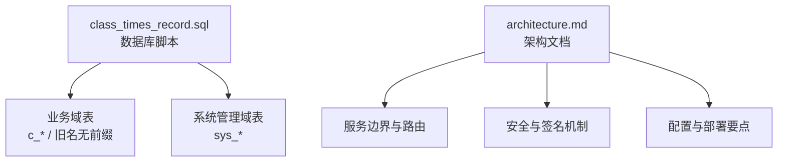
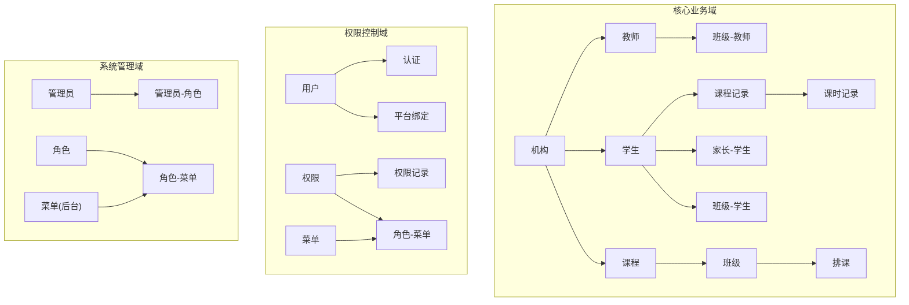
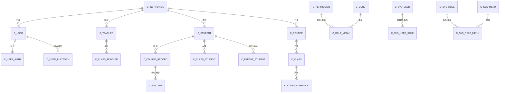
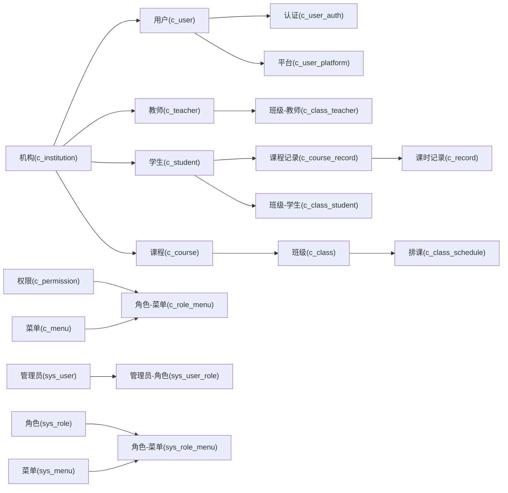

# 数据库架构设计

<cite>
**本文引用的文件**   
- [class_times_record.sql](file://class_times_record_back/docs/class_times_record.sql)
- [architecture.md](file://class_times_record_back/docs/architecture.md)
</cite>

## 目录
1. [引言](#引言)
2. [项目结构](#项目结构)
3. [核心组件](#核心组件)
4. [架构总览](#架构总览)
5. [详细组件分析](#详细组件分析)
6. [依赖关系分析](#依赖关系分析)
7. [性能与扩展性](#性能与扩展性)
8. [故障排查指南](#故障排查指南)
9. [结论](#结论)
10. [附录](#附录)

## 引言
本文件聚焦于 class_times_record 数据库的整体架构设计，围绕表命名规范、分层域划分、多租户隔离策略、版本迁移管理、性能优化与扩展性进行系统化说明，并给出面向新开发者的实践指导。文档同时结合现有 SQL 与架构文档，对当前实现与改进建议进行对照分析。

## 项目结构
从仓库可见，数据库相关资产集中在后端文档目录中：
- 数据库脚本：class_times_record.sql（MySQL 8.0+）
- 架构与设计文档：architecture.md（服务、安全、API、部署等）



图表来源
- [class_times_record.sql:1-496](file://class_times_record_back/docs/class_times_record.sql#L1-L496)
- [architecture.md:1-644](file://class_times_record_back/docs/architecture.md#L1-L644)

章节来源
- [class_times_record.sql:1-496](file://class_times_record_back/docs/class_times_record.sql#L1-L496)
- [architecture.md:1-644](file://class_times_record_back/docs/architecture.md#L1-L644)

## 核心组件
- 数据模型与实体继承体系：包含用户、机构、教师、家长、学生、课程、班级、排课、课程记录、课时记录、权限与菜单、订阅计划、微信订阅等实体；并通过 BaseEntity/RoleBaseEntity 抽象类组织公共字段与行为。
- 关键索引与约束：为高频查询与一致性提供保障，如唯一键、外键、常用查询列的索引。
- 逻辑删除与主键策略：全局启用 isDeleted 逻辑删除；主键采用雪花算法生成，趋势递增利于索引。

章节来源
- [architecture.md:326-471](file://class_times_record_back/docs/architecture.md#L326-L471)

## 架构总览
数据库按“业务域 + 系统管理域”分层组织，配合统一命名规范与约束策略，形成清晰的数据边界与可维护性。

```mermaid
erDiagram
INSTITUTION ||--o{ USER : "拥有"
INSTITUTION ||--o{ TEACHER : "聘用"
INSTITUTION ||--o{ STUDENT : "注册"
INSTITUTION ||--o{ COURSE : "开设"
USER ||--|| USER_AUTH : "认证凭据"
USER ||--o| USER_PLATFORM : "平台绑定"
TEACHER ||--o{ CLASS_TEACHER : "任教"
TEACHER ||--o{ TEACHER_COURSE : "授课"
STUDENT ||--o{ PARENT_STUDENT : "关联家长"
STUDENT ||--o{ CLASS_STUDENT : "在班"
COURSE ||--o{ CLASS : "开班"
CLASS ||--o{ CLASS_SCHEDULE : "排课"
STUDENT ||--o{ COURSE_RECORD : "购课"
COURSE_RECORD ||--o{ RECORD : "课时明细"
COURSE_RECORD ||--o{ PERMISSION_RECORD : "权限绑定"
PERMISSION ||--o{ ROLE_MENU : "角色-菜单"
MENU ||--o{ ROLE_MENU : "菜单"
SYS_USER ||--o{ SYS_USER_ROLE : "管理员-角色"
SYS_ROLE ||--o{ SYS_ROLE_MENU : "角色-菜单"
SYS_MENU ||--o{ SYS_ROLE_MENU : "菜单"
```

图表来源
- [class_times_record.sql:1-496](file://class_times_record_back/docs/class_times_record.sql#L1-L496)

## 详细组件分析

### 一、表命名规范与设计原则
- 业务表前缀 c_：用于区分业务领域实体，便于跨服务/模块识别与治理。
- 系统表前缀 sys_：用于后台管理系统相关数据，与业务数据解耦。
- 历史兼容：SQL 中存在未带前缀的旧表（如 user、course、record 等），建议在演进中逐步迁移至 c_ 前缀，保持命名一致性与可读性。

最佳实践
- 新增表一律使用 c_ 或 sys_ 前缀，避免裸名。
- 中间表以语义化命名，如 class_student、parent_student、class_teacher、role_menu。
- 字段命名遵循 snake_case，布尔型使用 is_xxx，时间字段使用 create_time/update_time。

章节来源
- [class_times_record.sql:1-496](file://class_times_record_back/docs/class_times_record.sql#L1-L496)
- [architecture.md:387-421](file://class_times_record_back/docs/architecture.md#L387-L421)

### 二、分层设计与域划分
- 核心业务域：机构、教师、家长、学生、课程、班级、排课、课程记录、课时记录、订阅计划、微信订阅等。
- 系统管理域：管理员、角色、菜单、操作日志、系统配置等。
- 权限控制域：用户认证、平台绑定、权限定义与记录、角色-菜单关联等。



图表来源
- [class_times_record.sql:1-496](file://class_times_record_back/docs/class_times_record.sql#L1-L496)

章节来源
- [architecture.md:326-471](file://class_times_record_back/docs/architecture.md#L326-L471)

### 三、多租户隔离机制与数据隔离策略
- 租户标识：通过 institution_id 贯穿机构、教师、学生、课程、用户等实体，作为多租户的核心隔离维度。
- 访问控制：所有涉及机构数据的查询应强制携带 institution_id 过滤条件，防止越权访问。
- 建议增强：
  - 在 MyBatis-Plus 层增加租户拦截器，自动注入 institution_id 条件。
  - 对敏感接口增加二次校验（如基于 JWT 中的租户上下文）。
  - 审计日志记录 tenant_id，便于问题追踪。

章节来源
- [class_times_record.sql:1-496](file://class_times_record_back/docs/class_times_record.sql#L1-L496)
- [architecture.md:326-471](file://class_times_record_back/docs/architecture.md#L326-L471)

### 四、版本管理与迁移策略
- 现状：提供单文件全量脚本 class_times_record.sql，适合初始化与演示环境。
- 建议：
  - 引入 Flyway/Liquibase 等迁移工具，按版本号管理增量变更（V1__init.sql、V2__add_c_prefix.sql 等）。
  - 建立回滚脚本与灰度发布流程，确保生产环境可逆。
  - 将 c_ 前缀改造拆分为独立迁移任务，分阶段执行与验证。

章节来源
- [class_times_record.sql:1-496](file://class_times_record_back/docs/class_times_record.sql#L1-L496)

### 五、关键索引与约束
- 唯一约束：
  - 同一学生在同一班级仅一条记录（class_student）。
  - 同一家长对同一学生仅一条关联（parent_student）。
  - 同一用户对同一课程记录仅一条权限记录（permission_record）。
  - 同一用户同一平台 open_id 唯一（user_platform）。
  - 同一机构同一用户只能有一条教师记录（teacher）。
  - 同一学生同一课程仅一条记录（course_record）。
- 常用索引：
  - 机构维度查询：institution_id 索引。
  - 课程/班级/排课/课时记录等高频查询列建索引。
- 外键约束：保证数据完整性，但需权衡写入性能与级联影响。

章节来源
- [class_times_record.sql:1-496](file://class_times_record_back/docs/class_times_record.sql#L1-L496)
- [architecture.md:459-471](file://class_times_record_back/docs/architecture.md#L459-L471)

### 六、实体继承体系与公共字段
- 基类：BaseEntity（空标记）、RoleBaseEntity（含 userId、isAvailable、username 等）。
- 主要实体：User、UserAuth、UserPlatform、Admin、Student、Teacher、Parent、CourseRecord、Record、PermissionRecord、Menu、ClassSchedule、Institution、Course、Class、ClassStudent、ParentStudent、ClassTeacher、SubscriptionPlan、WxSubscribeRecord、WxStudentSubscribe、SysUser、SysRole、SysMenu、SysUserRole、SysRoleMenu、SysOperationLog、SysConfig。
- 作用：统一审计字段、状态字段与通用方法，降低重复代码。

章节来源
- [architecture.md:422-457](file://class_times_record_back/docs/architecture.md#L422-L457)

### 七、逻辑删除与主键策略
- 逻辑删除：全局配置 isDeleted 字段，查询自动追加过滤，删除转为更新。
- 主键策略：分布式雪花算法，趋势递增，利于 MySQL 索引与分库分表扩展。

章节来源
- [architecture.md:216-249](file://class_times_record_back/docs/architecture.md#L216-L249)

### 八、ER 关系总览（简化版）


图表来源
- [class_times_record.sql:1-496](file://class_times_record_back/docs/class_times_record.sql#L1-L496)

## 依赖关系分析
- 表间依赖：
  - 机构为核心根节点，驱动教师、学生、课程、用户等实体的归属关系。
  - 课程记录是课时记录的父实体，承载总量、剩余、状态等聚合信息。
  - 权限记录将用户与课程记录绑定，支撑细粒度数据可见性。
- 系统管理域与业务域解耦：sys_* 表独立于 c_* 表，避免耦合扩散。



图表来源
- [class_times_record.sql:1-496](file://class_times_record_back/docs/class_times_record.sql#L1-L496)

章节来源
- [class_times_record.sql:1-496](file://class_times_record_back/docs/class_times_record.sql#L1-L496)

## 性能与扩展性
- 索引优化
  - 针对高频查询列（如 institution_id、student_id、course_id、class_id、course_record_id）建立合适索引。
  - 复合索引优先覆盖常见筛选组合（如 student_id + course_id）。
- 读写分离与缓存
  - 读多写少场景（如排课、课程详情）可引入 Redis 缓存热点数据。
  - 对统计类指标（如班级人数）考虑异步更新或物化视图。
- 事务与锁
  - 扣课等强一致性操作需合理拆分事务范围，避免长事务。
  - 合理使用行级锁与幂等设计，防止并发重复扣减。
- 分库分表
  - 当课时记录、课程记录增长到千万级时，可按 student_id 或 course_record_id 哈希分片。
  - 提前规划分片键与扩容方案，避免后期重构成本。
- 连接池与虚拟线程
  - 根据架构文档，应用已启用虚拟线程，I/O 密集型场景受益明显；仍需关注数据库连接池大小与慢查询治理。

章节来源
- [architecture.md:234-249](file://class_times_record_back/docs/architecture.md#L234-L249)
- [architecture.md:459-471](file://class_times_record_back/docs/architecture.md#L459-L471)

## 故障排查指南
- 常见问题定位
  - 唯一约束冲突：检查 class_student、parent_student、permission_record、user_platform、teacher、course_record 的唯一键。
  - 外键失败：确认被引用记录是否存在，避免级联删除导致的数据丢失。
  - 逻辑删除误用：确认查询是否遗漏 isDeleted=0 条件（框架通常自动处理，但自定义 SQL 需注意）。
- 监控与日志
  - 开启慢查询日志，定期分析 top N 慢 SQL。
  - 结合架构文档中的全局异常处理，统一返回错误码与消息，便于前端提示与运维告警。

章节来源
- [class_times_record.sql:1-496](file://class_times_record_back/docs/class_times_record.sql#L1-L496)
- [architecture.md:250-263](file://class_times_record_back/docs/architecture.md#L250-L263)

## 结论
当前数据库设计在业务域与系统管理域之间实现了清晰分层，具备较好的可扩展性与可维护性。建议尽快推进以下工作：
- 统一表名前缀（c_/sys_），消除历史裸名带来的歧义。
- 引入迁移工具与灰度发布流程，提升变更可控性。
- 完善租户隔离与审计能力，强化数据安全。
- 持续优化索引与慢查询，结合缓存与分片策略应对规模增长。

## 附录

### A. 表清单与分类（摘要）
- 基础与认证：用户、认证、平台、管理员
- 平台与机构：机构、订阅套餐、微信订阅
- 教学主体：教师、家长、学生
- 教学组织：课程、班级、排课、班级-学生、班级-教师、家长-学生
- 教学记录：课程记录、课时记录、权限记录
- 系统管理：管理员用户、角色、菜单、角色-菜单、操作日志、系统配置

章节来源
- [architecture.md:387-421](file://class_times_record_back/docs/architecture.md#L387-L421)

### B. 关键约束与索引（摘要）
- 唯一键：class_student(class_id, student_id)、parent_student(parent_id, student_id)、permission_record(user_id, course_record_id)、user_platform(user_id, open_id)、teacher(institution_id, user_id)、course_record(student_id, course_id)
- 常用索引：institution_id、course_id、class_id、student_id、course_record_id 等

章节来源
- [class_times_record.sql:1-496](file://class_times_record_back/docs/class_times_record.sql#L1-L496)
- [architecture.md:459-471](file://class_times_record_back/docs/architecture.md#L459-L471)

### C. 新开发者实践清单
- 新建表必须使用 c_ 或 sys_ 前缀，并在迁移脚本中声明。
- 所有查询默认带上 institution_id 过滤，必要时通过拦截器注入。
- 使用逻辑删除与雪花主键，避免自增主键与物理删除混用。
- 为高频查询列建立索引，避免全表扫描。
- 变更走迁移工具，禁止直接在生产执行手工 SQL。

[本节为通用指导，不直接分析具体文件]