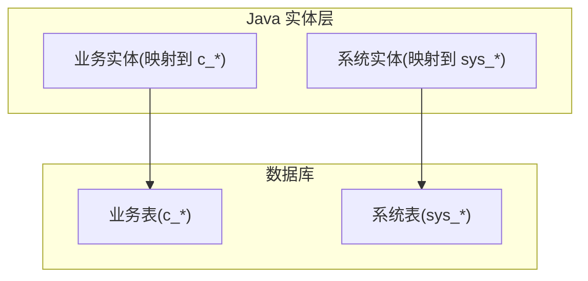
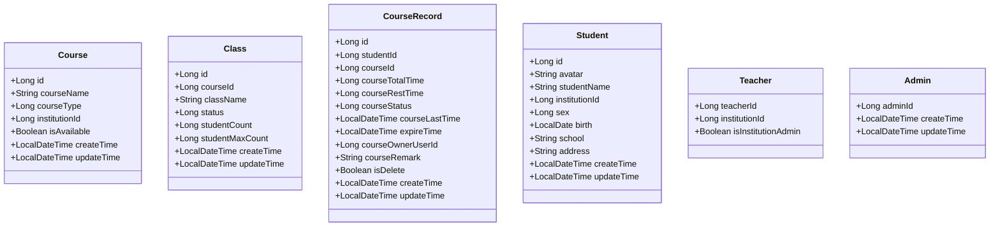
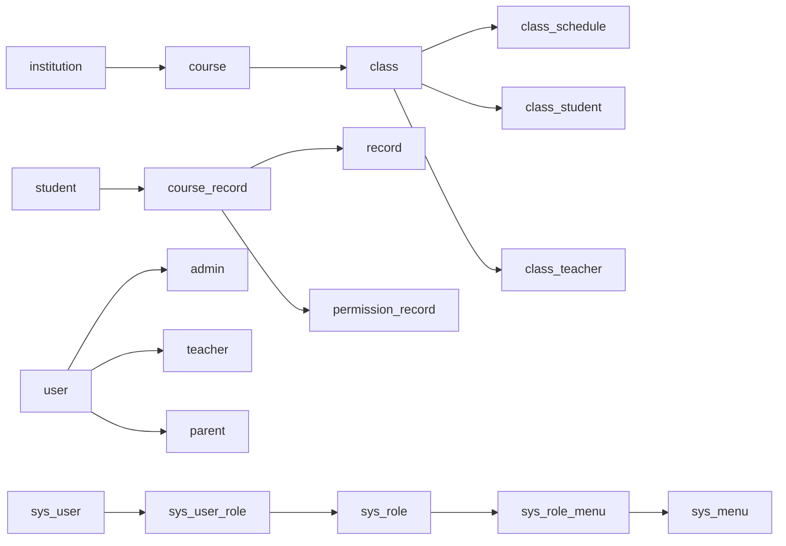

# 数据库设计

<cite>
**本文引用的文件**   
- [class_times_record.sql](file://class_times_record_back/docs/class_times_record.sql)
- [Admin.java](file://class_times_record_back/common/src/main/java/com/shiroko/repository/entity/Admin.java)
- [Class.java](file://class_times_record_back/common/src/main/java/com/shiroko/repository/entity/Class.java)
- [Course.java](file://class_times_record_back/common/src/main/java/com/shiroko/repository/entity/Course.java)
- [CourseRecord.java](file://class_times_record_back/common/src/main/java/com/shiroko/repository/entity/CourseRecord.java)
- [Student.java](file://class_times_record_back/common/src/main/java/com/shiroko/repository/entity/Student.java)
- [Teacher.java](file://class_times_record_back/common/src/main/java/com/shiroko/repository/entity/Teacher.java)
</cite>

## 目录
1. [引言](#引言)
2. [项目结构](#项目结构)
3. [核心组件](#核心组件)
4. [架构总览](#架构总览)
5. [详细组件分析](#详细组件分析)
6. [依赖关系分析](#依赖关系分析)
7. [性能与索引优化](#性能与索引优化)
8. [数据迁移与版本控制](#数据迁移与版本控制)
9. [安全性与备份恢复](#安全性与备份恢复)
10. [结论](#结论)
11. [附录：命名规范与最佳实践](#附录：命名规范与最佳实践)

## 引言
本设计文档围绕 class_times_record 数据库，系统化阐述整体架构、表命名规范（c_前缀业务表、sys_前缀系统表）、核心实体模型（机构、教师、学生、课程、班级排课、课时记录等）、关系映射（一对一、一对多、多对多）、索引与查询优化策略、数据迁移与版本管理方案、安全与备份恢复策略，以及为新开发者提供的数据库设计最佳实践。

## 项目结构
- 数据库脚本位于 docs/class_times_record.sql，包含完整的 DDL 定义、外键约束与索引信息。
- Java 层实体类位于 common 模块的 repository/entity 包下，使用 MyBatis-Plus 注解将实体映射到 c_ 前缀的业务表；系统域实体映射到 sys_ 前缀的系统表。
- 通过 @TableName 明确表名映射，@TableId/@TableField 标注主键与字段映射，统一时间戳字段由公共基类或填充器处理。



图表来源
- [class_times_record.sql:1-496](file://class_times_record_back/docs/class_times_record.sql#L1-L496)
- [Admin.java:22-24](file://class_times_record_back/common/src/main/java/com/shiroko/repository/entity/Admin.java#L22-L24)
- [Class.java:20-21](file://class_times_record_back/common/src/main/java/com/shiroko/repository/entity/Class.java#L20-L21)
- [Course.java:20-21](file://class_times_record_back/common/src/main/java/com/shiroko/repository/entity/Course.java#L20-L21)
- [CourseRecord.java:22-24](file://class_times_record_back/common/src/main/java/com/shiroko/repository/entity/CourseRecord.java#L22-L24)
- [Student.java:22-24](file://class_times_record_back/common/src/main/java/com/shiroko/repository/entity/Student.java#L22-L24)
- [Teacher.java:20-22](file://class_times_record_back/common/src/main/java/com/shiroko/repository/entity/Teacher.java#L20-L22)

章节来源
- [class_times_record.sql:1-496](file://class_times_record_back/docs/class_times_record.sql#L1-L496)
- [Admin.java:22-24](file://class_times_record_back/common/src/main/java/com/shiroko/repository/entity/Admin.java#L22-L24)
- [Class.java:20-21](file://class_times_record_back/common/src/main/java/com/shiroko/repository/entity/Class.java#L20-L21)
- [Course.java:20-21](file://class_times_record_back/common/src/main/java/com/shiroko/repository/entity/Course.java#L20-L21)
- [CourseRecord.java:22-24](file://class_times_record_back/common/src/main/java/com/shiroko/repository/entity/CourseRecord.java#L22-L24)
- [Student.java:22-24](file://class_times_record_back/common/src/main/java/com/shiroko/repository/entity/Student.java#L22-L24)
- [Teacher.java:20-22](file://class_times_record_back/common/src/main/java/com/shiroko/repository/entity/Teacher.java#L20-L22)

## 核心组件
本节聚焦核心业务实体及其在数据库中的映射关系，涵盖机构、教师、学生、课程、班级、排课、课时记录等关键领域。

- 机构（institution）：作为多租户隔离的基础维度，多数实体通过 institution_id 进行归属划分。
- 用户体系：user/user_auth/user_platform 提供统一身份与平台登录态；admin/teacher/parent 为角色扩展。
- 课程与班级：course 定义课程元数据；class 表示按课程划分的教学班；class_schedule 描述固定周课表；class_student/class_teacher 维护班级成员。
- 课时记录：course_record 记录某学生在某课程的课时总量、剩余次数、状态与过期时间；record 记录增课/消课流水；permission_record 用于课程维度的权限分配。

章节来源
- [class_times_record.sql:167-179](file://class_times_record_back/docs/class_times_record.sql#L167-L179)
- [class_times_record.sql:108-122](file://class_times_record_back/docs/class_times_record.sql#L108-L122)
- [class_times_record_back/docs/class_times_record.sql:39-53](file://class_times_record_back/docs/class_times_record.sql#L39-L53)
- [class_times_record_back/docs/class_times_record.sql:56-73](file://class_times_record_back/docs/class_times_record.sql#L56-L73)
- [class_times_record_back/docs/class_times_record.sql:76-89](file://class_times_record_back/docs/class_times_record.sql#L76-L89)
- [class_times_record_back/docs/class_times_record.sql:92-105](file://class_times_record_back/docs/class_times_record.sql#L92-L105)
- [class_times_record_back/docs/class_times_record.sql:140-164](file://class_times_record_back/docs/class_times_record.sql#L140-L164)
- [class_times_record_back/docs/class_times_record.sql:262-281](file://class_times_record_back/docs/class_times_record.sql#L262-L281)
- [class_times_record_back/docs/class_times_record.sql:232-259](file://class_times_record_back/docs/class_times_record.sql#L232-L259)
- [class_times_record_back/docs/class_times_record.sql:299-316](file://class_times_record_back/docs/class_times_record.sql#L299-L316)
- [class_times_record_back/docs/class_times_record.sql:409-423](file://class_times_record_back/docs/class_times_record.sql#L409-L423)
- [class_times_record_back/docs/class_times_record.sql:442-453](file://class_times_record_back/docs/class_times_record.sql#L442-L453)
- [class_times_record_back/docs/class_times_record.sql:456-472](file://class_times_record_back/docs/class_times_record.sql#L456-L472)
- [class_times_record_back/docs/class_times_record.sql:475-493](file://class_times_record_back/docs/class_times_record.sql#L475-L493)

## 架构总览
下图展示业务域与系统域的表分组及主要关联方向。

```mermaid
erDiagram
INSTITUTE ||--o{ COURSE : "拥有"
INSTITUTE ||--o{ STUDENT : "管理"
INSTITUTE ||--o{ TEACHER : "管理"
INSTITUTE ||--o{ USER : "包含"
COURSE ||--o{ CLASS : "开设"
COURSE ||--o{ COURSE_RECORD : "被购买"
COURSE ||--o{ TEACHER_COURSE : "授课"
CLASS ||--o{ CLASS_SCHEDULE : "排课"
CLASS ||--o{ CLASS_STUDENT : "学员"
CLASS ||--o{ CLASS_TEACHER : "任课教师"
STUDENT ||--o{ COURSE_RECORD : "选课"
COURSE_RECORD ||--o{ RECORD : "课时流水"
COURSE_RECORD ||--o{ PERMISSION_RECORD : "授权"
USER ||--o| ADMIN : "管理员"
USER ||--o| TEACHER : "教师"
USER ||--o| PARENT : "家长"
USER ||--o| USER_AUTH : "账号密码"
USER ||--o| USER_PLATFORM : "第三方登录"
SYS_MENU ||--o{ SYS_ROLE_MENU : "菜单权限"
SYS_ROLE ||--o{ SYS_ROLE_MENU : "角色菜单"
SYS_USER ||--o{ SYS_USER_ROLE : "用户角色"
```

图表来源
- [class_times_record.sql:167-179](file://class_times_record_back/docs/class_times_record.sql#L167-L179)
- [class_times_record.sql:108-122](file://class_times_record_back/docs/class_times_record.sql#L108-L122)
- [class_times_record.sql:39-53](file://class_times_record_back/docs/class_times_record.sql#L39-L53)
- [class_times_record.sql:56-73](file://class_times_record_back/docs/class_times_record.sql#L56-L73)
- [class_times_record.sql:76-89](file://class_times_record_back/docs/class_times_record.sql#L76-L89)
- [class_times_record.sql:92-105](file://class_times_record_back/docs/class_times_record.sql#L92-L105)
- [class_times_record.sql:140-164](file://class_times_record_back/docs/class_times_record.sql#L140-L164)
- [class_times_record.sql:262-281](file://class_times_record_back/docs/class_times_record.sql#L262-L281)
- [class_times_record.sql:232-259](file://class_times_record_back/docs/class_times_record.sql#L232-L259)
- [class_times_record.sql:299-316](file://class_times_record_back/docs/class_times_record.sql#L299-L316)
- [class_times_record.sql:409-423](file://class_times_record_back/docs/class_times_record.sql#L409-L423)
- [class_times_record.sql:442-453](file://class_times_record_back/docs/class_times_record.sql#L442-L453)
- [class_times_record.sql:456-472](file://class_times_record_back/docs/class_times_record.sql#L456-L472)
- [class_times_record.sql:475-493](file://class_times_record_back/docs/class_times_record.sql#L475-L493)
- [class_times_record.sql:319-336](file://class_times_record_back/docs/class_times_record.sql#L319-L336)
- [class_times_record.sql:339-354](file://class_times_record_back/docs/class_times_record.sql#L339-L354)
- [class_times_record.sql:357-369](file://class_times_record_back/docs/class_times_record.sql#L357-L369)
- [class_times_record.sql:372-391](file://class_times_record_back/docs/class_times_record.sql#L372-L391)
- [class_times_record.sql:394-406](file://class_times_record_back/docs/class_times_record.sql#L394-L406)

## 详细组件分析

### 机构管理（institution）
- 职责：承载机构基础信息与状态，作为多租户隔离根节点。
- 关键字段：id、机构名称、地址、状态、唯一编码、时间戳。
- 关系：一对多关联 course、student、teacher、user。

章节来源
- [class_times_record.sql:167-179](file://class_times_record_back/docs/class_times_record.sql#L167-L179)

### 教师管理（teacher / user / user_auth / user_platform）
- 职责：教师角色扩展，绑定机构与用户体系；支持第三方登录与账号密码登录。
- 关键字段：teacher.institution_id、is_institution_admin；user_auth.account/password/salt；user_platform.open_id/union_id/platform。
- 关系：
  - teacher 一对一关联 user（通过 user_id）。
  - user 一对多 user_auth、user_platform。
  - teacher 多对多 course（通过 teacher_course）。

章节来源
- [class_times_record.sql:409-423](file://class_times_record_back/docs/class_times_record.sql#L409-L423)
- [class_times_record.sql:442-453](file://class_times_record_back/docs/class_times_record.sql#L442-L453)
- [class_times_record.sql:456-472](file://class_times_record_back/docs/class_times_record.sql#L456-L472)
- [class_times_record.sql:475-493](file://class_times_record_back/docs/class_times_record.sql#L475-L493)
- [class_times_record.sql:426-439](file://class_times_record_back/docs/class_times_record.sql#L426-L439)

### 学生管理（student / parent / parent_student）
- 职责：学生档案与家长关系管理。
- 关键字段：student.institution_id、sex、birth、school、address；parent.phone/username；parent_student.relation/is_primary。
- 关系：
  - student 一对多 parent_student。
  - parent 一对多 parent_student。
  - student 一对多 course_record。

章节来源
- [class_times_record.sql:299-316](file://class_times_record_back/docs/class_times_record.sql#L299-L316)
- [class_times_record.sql:200-211](file://class_times_record_back/docs/class_times_record.sql#L200-L211)
- [class_times_record.sql:214-229](file://class_times_record_back/docs/class_times_record.sql#L214-L229)
- [class_times_record.sql:140-164](file://class_times_record_back/docs/class_times_record.sql#L140-L164)

### 课程管理（course / teacher_course）
- 职责：课程元数据与教师授课关系。
- 关键字段：course.course_name、course_type、institution_id、is_available。
- 关系：
  - course 一对多 class、course_record。
  - teacher 多对多 course（通过 teacher_course）。

章节来源
- [class_times_record.sql:108-122](file://class_times_record_back/docs/class_times_record.sql#L108-L122)
- [class_times_record.sql:426-439](file://class_times_record_back/docs/class_times_record.sql#L426-L439)

### 班级与排课（class / class_schedule / class_student / class_teacher）
- 职责：按课程组织教学班，维护固定周课表与师生成员。
- 关键字段：class.class_name/student_count/student_max_count/status；class_schedule.start_date/end_date/day_of_week/start_time/end_time。
- 关系：
  - class 一对多 class_schedule、class_student、class_teacher。
  - class_student 多对多 student。
  - class_teacher 多对多 teacher。

章节来源
- [class_times_record.sql:39-53](file://class_times_record_back/docs/class_times_record.sql#L39-L53)
- [class_times_record.sql:56-73](file://class_times_record_back/docs/class_times_record.sql#L56-L73)
- [class_times_record.sql:76-89](file://class_times_record_back/docs/class_times_record.sql#L76-L89)
- [class_times_record.sql:92-105](file://class_times_record_back/docs/class_times_record.sql#L92-L105)

### 课时记录（course_record / record / permission_record）
- 职责：记录学生课程购买与消耗流水，并支持课程级权限分配。
- 关键字段：course_record.course_total_time/course_rest_time/course_status/course_last_time/expire_time/course_owner_user_id；record.record_type/record_change/operate_teacher_id。
- 关系：
  - course_record 一对多 record。
  - course_record 一对多 permission_record。
  - record 多对一 operate_teacher_id（teacher）。

章节来源
- [class_times_record.sql:140-164](file://class_times_record_back/docs/class_times_record.sql#L140-L164)
- [class_times_record.sql:262-281](file://class_times_record_back/docs/class_times_record.sql#L262-L281)
- [class_times_record.sql:232-259](file://class_times_record_back/docs/class_times_record.sql#L232-L259)

### 系统管理（sys_menu / sys_role / sys_role_menu / sys_user / sys_user_role）
- 职责：后台 RBAC 权限模型，菜单-角色-用户三表关联。
- 关键字段：sys_menu.path/component/perms；sys_role.role_key/status；sys_user.username/status。
- 关系：
  - sys_role 多对多 sys_menu（通过 sys_role_menu）。
  - sys_user 多对多 sys_role（通过 sys_user_role）。

章节来源
- [class_times_record.sql:319-336](file://class_times_record_back/docs/class_times_record.sql#L319-L336)
- [class_times_record.sql:339-354](file://class_times_record_back/docs/class_times_record.sql#L339-L354)
- [class_times_record.sql:357-369](file://class_times_record_back/docs/class_times_record.sql#L357-L369)
- [class_times_record.sql:372-391](file://class_times_record_back/docs/class_times_record.sql#L372-L391)
- [class_times_record.sql:394-406](file://class_times_record_back/docs/class_times_record.sql#L394-L406)

### 实体类与表映射（MyBatis-Plus）
- 业务实体均通过 @TableName 映射至 c_ 前缀表，主键采用自增 IdType.AUTO，时间字段使用 LocalDateTime。
- BaseEntity/RoleBaseEntity 提供通用字段与继承能力，简化重复字段声明。



图表来源
- [Course.java:20-60](file://class_times_record_back/common/src/main/java/com/shiroko/repository/entity/Course.java#L20-L60)
- [Class.java:20-68](file://class_times_record_back/common/src/main/java/com/shiroko/repository/entity/Class.java#L20-L68)
- [CourseRecord.java:22-111](file://class_times_record_back/common/src/main/java/com/shiroko/repository/entity/CourseRecord.java#L22-L111)
- [Student.java:22-89](file://class_times_record_back/common/src/main/java/com/shiroko/repository/entity/Student.java#L22-L89)
- [Teacher.java:20-47](file://class_times_record_back/common/src/main/java/com/shiroko/repository/entity/Teacher.java#L20-L47)
- [Admin.java:22-43](file://class_times_record_back/common/src/main/java/com/shiroko/repository/entity/Admin.java#L22-L43)

## 依赖关系分析
- 业务域依赖链：institution → course → class → (class_schedule, class_student, class_teacher)；student → course_record → record；course_record → permission_record。
- 系统域依赖链：sys_user ↔ sys_role ↔ sys_menu。
- 跨域连接点：user 作为统一身份中心，被 admin/teacher/parent 复用；course_record.owner 指向 user。



图表来源
- [class_times_record.sql:167-179](file://class_times_record_back/docs/class_times_record.sql#L167-L179)
- [class_times_record.sql:108-122](file://class_times_record_back/docs/class_times_record.sql#L108-L122)
- [class_times_record.sql:39-53](file://class_times_record_back/docs/class_times_record.sql#L39-L53)
- [class_times_record.sql:56-73](file://class_times_record_back/docs/class_times_record.sql#L56-L73)
- [class_times_record.sql:76-89](file://class_times_record_back/docs/class_times_record.sql#L76-L89)
- [class_times_record.sql:92-105](file://class_times_record_back/docs/class_times_record.sql#L92-L105)
- [class_times_record.sql:140-164](file://class_times_record_back/docs/class_times_record.sql#L140-L164)
- [class_times_record.sql:262-281](file://class_times_record_back/docs/class_times_record.sql#L262-L281)
- [class_times_record.sql:232-259](file://class_times_record_back/docs/class_times_record.sql#L232-L259)
- [class_times_record.sql:442-453](file://class_times_record_back/docs/class_times_record.sql#L442-L453)
- [class_times_record.sql:409-423](file://class_times_record_back/docs/class_times_record.sql#L409-L423)
- [class_times_record.sql:200-211](file://class_times_record_back/docs/class_times_record.sql#L200-L211)
- [class_times_record.sql:319-336](file://class_times_record_back/docs/class_times_record.sql#L319-L336)
- [class_times_record.sql:339-354](file://class_times_record_back/docs/class_times_record.sql#L339-L354)
- [class_times_record.sql:357-369](file://class_times_record_back/docs/class_times_record.sql#L357-L369)
- [class_times_record.sql:372-391](file://class_times_record_back/docs/class_times_record.sql#L372-L391)
- [class_times_record.sql:394-406](file://class_times_record_back/docs/class_times_record.sql#L394-L406)

## 性能与索引优化
- 主键与唯一约束
  - 所有表均定义主键；部分组合唯一约束避免重复绑定，如 class_student(class_id, student_id)、class_teacher(class_id, teacher_id)、course_record(student_id, course_id)、permission_record(course_record_id, user_id)。
- 常用查询索引
  - 外键列普遍建索引：class(course_id)、class_schedule(class_id)、course(institution_id)、course_record(student_id, course_id, course_owner_user_id)、record(course_record_id, operate_teacher_id)、teacher(institution_id, user_id)、student(institution_id)、user(institution_id) 等。
- 复合索引建议
  - 报表与筛选场景可考虑追加复合索引，例如 course_record 上按 (course_owner_user_id, course_status, create_time) 的组合以加速“我的课程”列表查询；record 上按 (course_record_id, record_time) 加速课时流水分页。
- 统计与冗余字段
  - class.student_count 可作为轻冗余字段减少实时计数开销，但需在写入时保持一致性保障。
- 软删除与归档
  - 多处使用 is_delete 逻辑删除，建议在历史数据增长后对冷数据做归档分区或分库分表规划。

章节来源
- [class_times_record.sql:39-53](file://class_times_record_back/docs/class_times_record.sql#L39-L53)
- [class_times_record.sql:56-73](file://class_times_record_back/docs/class_times_record.sql#L56-L73)
- [class_times_record.sql:76-89](file://class_times_record_back/docs/class_times_record.sql#L76-L89)
- [class_times_record.sql:92-105](file://class_times_record_back/docs/class_times_record.sql#L92-L105)
- [class_times_record.sql:108-122](file://class_times_record_back/docs/class_times_record.sql#L108-L122)
- [class_times_record.sql:140-164](file://class_times_record_back/docs/class_times_record.sql#L140-L164)
- [class_times_record.sql:262-281](file://class_times_record_back/docs/class_times_record.sql#L262-L281)
- [class_times_record.sql:299-316](file://class_times_record_back/docs/class_times_record.sql#L299-L316)
- [class_times_record.sql:409-423](file://class_times_record_back/docs/class_times_record.sql#L409-L423)
- [class_times_record.sql:442-453](file://class_times_record_back/docs/class_times_record.sql#L442-L453)

## 数据迁移与版本控制
- 脚本管理
  - 以 SQL 脚本形式集中管理 DDL/DML，当前版本见 docs/class_times_record.sql。
- 版本化策略
  - 建议引入 Flyway/Liquibase 或自研迁移工具，按 v1.x/v2.x 目录组织增量脚本，确保幂等与回滚能力。
- 变更流程
  - 开发分支提交变更脚本 → 代码评审 → 预发环境执行验证 → 生产灰度发布与回滚预案。
- 一致性校验
  - 上线前后执行对象差异比对（表结构、索引、注释），并结合自动化测试用例覆盖关键路径。

章节来源
- [class_times_record.sql:1-15](file://class_times_record_back/docs/class_times_record.sql#L1-L15)

## 安全性与备份恢复
- 认证与鉴权
  - 用户密码采用 SM3 加密存储（user_auth.password/salt）；系统端使用 BCrypt 建议（sys_user.password）。
  - 基于 sys_menu/sys_role/sys_user 实现 RBAC 细粒度权限控制。
- 数据隔离
  - 通过 institution_id 在多租户间进行数据隔离，结合应用层权限校验防止越权访问。
- 审计与日志
  - record 表记录增课/消课操作人、时间与备注；可结合系统操作日志完善审计闭环。
- 备份与恢复
  - 定期全量备份 + 增量 binlog 备份；制定 RPO/RTO 目标，演练恢复流程；敏感字段脱敏导出。

章节来源
- [class_times_record.sql:456-472](file://class_times_record_back/docs/class_times_record.sql#L456-L472)
- [class_times_record.sql:372-391](file://class_times_record_back/docs/class_times_record.sql#L372-L391)
- [class_times_record.sql:319-336](file://class_times_record_back/docs/class_times_record.sql#L319-L336)
- [class_times_record.sql:339-354](file://class_times_record_back/docs/class_times_record.sql#L339-L354)
- [class_times_record.sql:357-369](file://class_times_record_back/docs/class_times_record.sql#L357-L369)
- [class_times_record.sql:372-391](file://class_times_record_back/docs/class_times_record.sql#L372-L391)
- [class_times_record.sql:394-406](file://class_times_record_back/docs/class_times_record.sql#L394-L406)
- [class_times_record.sql:262-281](file://class_times_record_back/docs/class_times_record.sql#L262-L281)

## 结论
该数据库设计以 institution 为多租户根节点，围绕课程、班级、排课与课时记录构建完整的教学业务闭环；系统域通过 sys_* 表实现标准 RBAC。通过合理的索引设计与外键约束，兼顾了数据一致性与查询性能。后续可在复杂报表场景补充复合索引，并引入迁移工具与备份演练机制，进一步提升工程化水平与稳定性。

## 附录：命名规范与最佳实践
- 表命名规范
  - 业务表：c_ 前缀（如 c_class、c_course、c_course_record、c_student、c_teacher、c_class_schedule、c_class_student、c_class_teacher、c_permission_record、c_record 等）。
  - 系统表：sys_ 前缀（如 sys_menu、sys_role、sys_role_menu、sys_user、sys_user_role）。
- 字段命名
  - 使用小写下划线分隔；布尔型使用 is_xxx；时间字段使用 create_time/update_time；逻辑删除使用 is_delete。
- 主键与索引
  - 统一使用自增主键；对外键列建立索引；高频查询条件建立复合索引；组合唯一约束保证业务唯一性。
- 实体映射
  - 使用 @TableName/@TableId/@TableField 显式映射；时间类型使用 LocalDateTime；公共字段抽取至 BaseEntity/RoleBaseEntity。
- 事务与一致性
  - 涉及多表更新（如课时扣减）需置于同一事务；必要时引入乐观锁或版本号字段。
- 审计与可追溯
  - 关键写操作保留操作人、时间与备注；对敏感字段加密存储。

章节来源
- [class_times_record.sql:1-496](file://class_times_record_back/docs/class_times_record.sql#L1-L496)
- [Admin.java:22-43](file://class_times_record_back/common/src/main/java/com/shiroko/repository/entity/Admin.java#L22-L43)
- [Class.java:20-68](file://class_times_record_back/common/src/main/java/com/shiroko/repository/entity/Class.java#L20-L68)
- [Course.java:20-60](file://class_times_record_back/common/src/main/java/com/shiroko/repository/entity/Course.java#L20-L60)
- [CourseRecord.java:22-111](file://class_times_record_back/common/src/main/java/com/shiroko/repository/entity/CourseRecord.java#L22-L111)
- [Student.java:22-89](file://class_times_record_back/common/src/main/java/com/shiroko/repository/entity/Student.java#L22-L89)
- [Teacher.java:20-47](file://class_times_record_back/common/src/main/java/com/shiroko/repository/entity/Teacher.java#L20-L47)