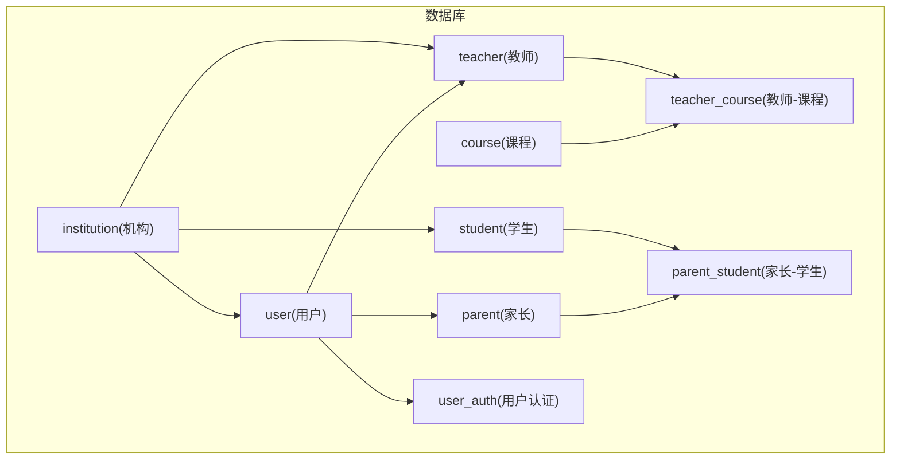
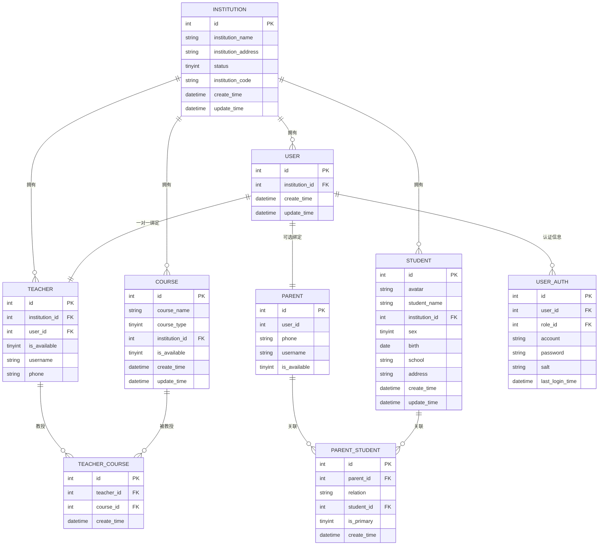
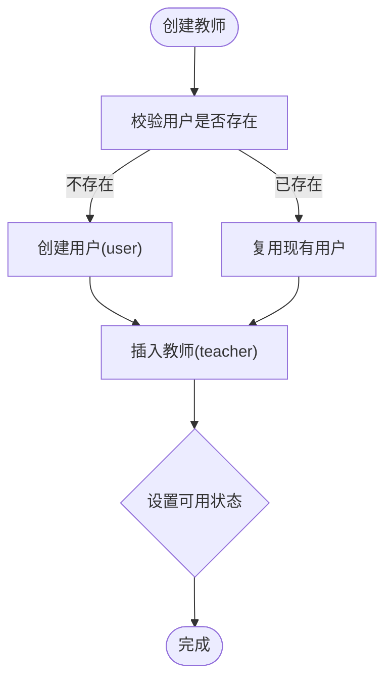
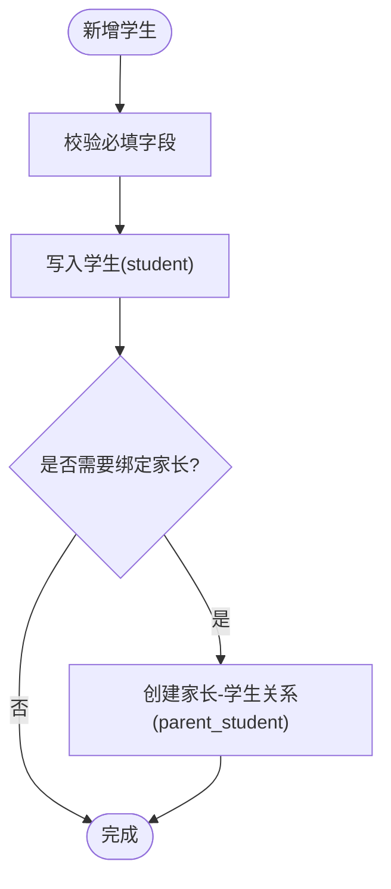
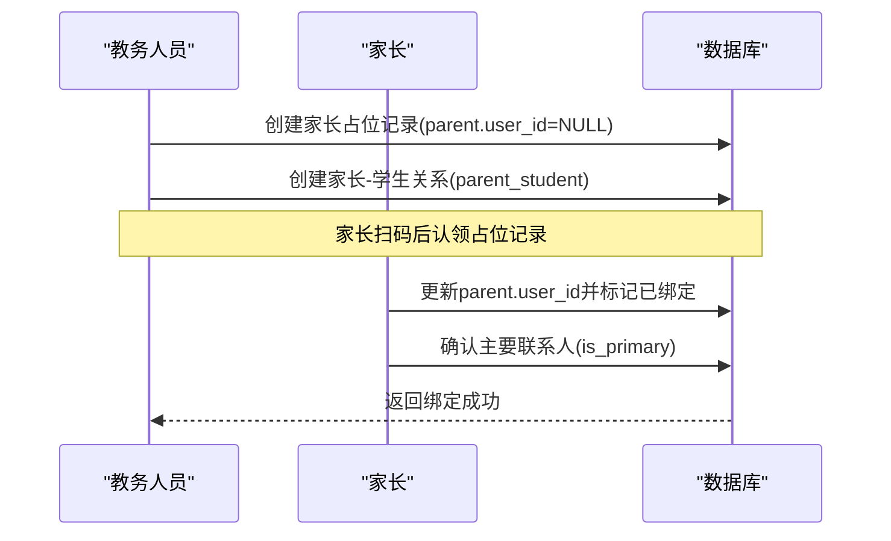
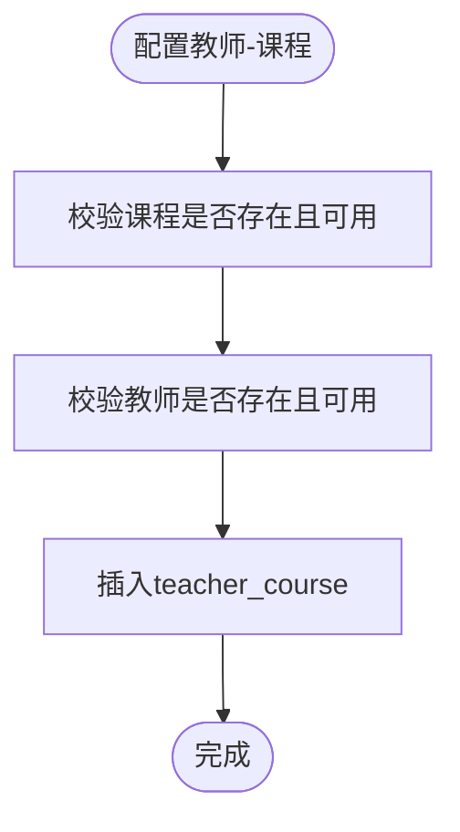
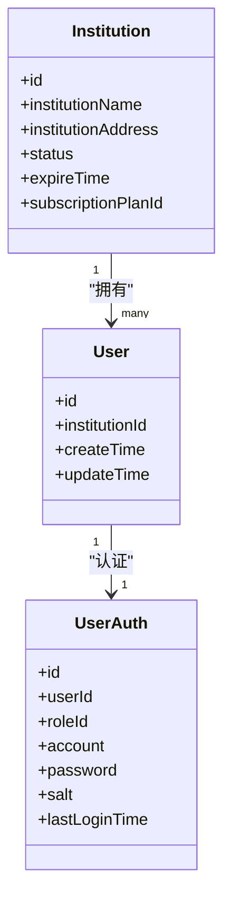
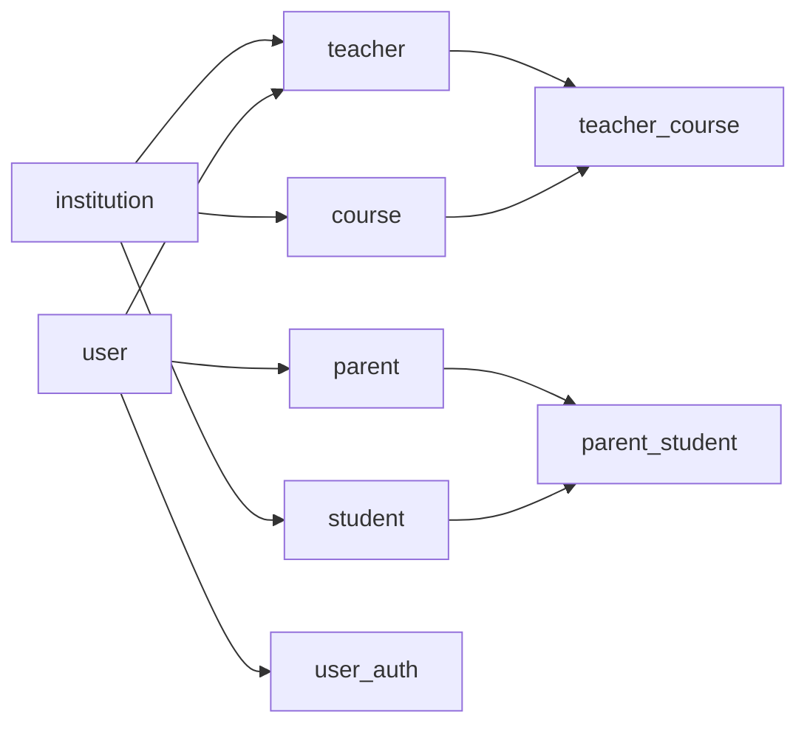

# 师生管理表结构

<cite>
**本文引用的文件**   
- [class_times_record.sql](file://class_times_record_back/docs/class_times_record.sql)
- [Teacher.java](file://class_times_record_back/common/src/main/java/com/shiroko/repository/entity/Teacher.java)
- [Student.java](file://class_times_record_back/common/src/main/java/com/shiroko/repository/entity/Student.java)
- [Parent.java](file://class_times_record_back/common/src/main/java/com/shiroko/repository/entity/Parent.java)
- [ParentStudent.java](file://class_times_record_back/common/src/main/java/com/shiroko/repository/entity/ParentStudent.java)
- [Institution.java](file://class_times_record_back/common/src/main/java/com/shiroko/repository/entity/Institution.java)
- [User.java](file://class_times_record_back/common/src/main/java/com/shiroko/repository/entity/User.java)
- [UserAuth.java](file://class_times_record_back/common/src/main/java/com/shiroko/repository/entity/UserAuth.java)
</cite>

## 目录
1. [引言](#引言)
2. [项目结构](#项目结构)
3. [核心组件](#核心组件)
4. [架构总览](#架构总览)
5. [详细组件分析](#详细组件分析)
6. [依赖关系分析](#依赖关系分析)
7. [性能考虑](#性能考虑)
8. [故障排查指南](#故障排查指南)
9. [结论](#结论)
10. [附录](#附录)

## 引言
本文件聚焦于“师生管理”相关的数据模型与业务规则，围绕以下目标展开：
- 教师、学生、家长及其关联表的表结构设计说明
- 教师与机构的关系映射、教师账号绑定机制与学生基本信息管理
- 家长与学生多对多关系设计（parent_student），主要联系人标识与关系类型管理
- 教师-课程关联（teacher_course）的设计原理与教学资源配置
- 数据完整性约束与业务规则验证的实现方案

## 项目结构
本项目包含数据库脚本与后端实体类定义两部分关键内容：
- 数据库脚本：提供完整的建表语句、索引与外键约束
- Java 实体：对应数据库表结构的对象映射，用于服务层与持久层交互

图表来源
- [class_times_record.sql:167-179](file://class_times_record_back/docs/class_times_record.sql#L167-L179)
- [class_times_record.sql:443-454](file://class_times_record_back/docs/class_times_record.sql#L443-L454)
- [class_times_record.sql:409-424](file://class_times_record_back/docs/class_times_record.sql#L409-L424)
- [class_times_record.sql:299-316](file://class_times_record_back/docs/class_times_record.sql#L299-L316)
- [class_times_record.sql:200-211](file://class_times_record_back/docs/class_times_record.sql#L200-L211)
- [class_times_record.sql:214-229](file://class_times_record_back/docs/class_times_record.sql#L214-L229)
- [class_times_record.sql:108-122](file://class_times_record_back/docs/class_times_record.sql#L108-L122)
- [class_times_record.sql:427-440](file://class_times_record_back/docs/class_times_record.sql#L427-L440)
- [class_times_record.sql:457-473](file://class_times_record_back/docs/class_times_record.sql#L457-L473)

章节来源
- [class_times_record.sql:167-179](file://class_times_record_back/docs/class_times_record.sql#L167-L179)
- [class_times_record.sql:443-454](file://class_times_record_back/docs/class_times_record.sql#L443-L454)
- [class_times_record.sql:409-424](file://class_times_record_back/docs/class_times_record.sql#L409-L424)
- [class_times_record.sql:299-316](file://class_times_record_back/docs/class_times_record.sql#L299-L316)
- [class_times_record.sql:200-211](file://class_times_record_back/docs/class_times_record.sql#L200-L211)
- [class_times_record.sql:214-229](file://class_times_record_back/docs/class_times_record.sql#L214-L229)
- [class_times_record.sql:108-122](file://class_times_record_back/docs/class_times_record.sql#L108-L122)
- [class_times_record.sql:427-440](file://class_times_record_back/docs/class_times_record.sql#L427-L440)
- [class_times_record.sql:457-473](file://class_times_record_back/docs/class_times_record.sql#L457-L473)

## 核心组件
本节概述师生管理的核心实体与表：
- 机构（institution）：组织边界，所有主体均归属某一机构
- 用户（user）：统一身份基础表，承载登录与平台信息
- 教师（teacher）：与 user 一对一绑定，并归属 institution
- 学生（student）：记录学生基本信息，归属 institution
- 家长（parent）：与家长端账号或占位记录相关
- 家长-学生（parent_student）：实现家长与学生的多对多关系，支持主要联系人标记
- 教师-课程（teacher_course）：教师可教授的课程集合，支撑排课与资源分配
- 用户认证（user_auth）：用户名、密码、角色等认证信息

章节来源
- [Institution.java:1-87](file://class_times_record_back/common/src/main/java/com/shiroko/repository/entity/Institution.java#L1-L87)
- [User.java:1-58](file://class_times_record_back/common/src/main/java/com/shiroko/repository/entity/User.java#L1-L58)
- [Teacher.java:1-53](file://class_times_record_back/common/src/main/java/com/shiroko/repository/entity/Teacher.java#L1-L53)
- [Student.java:1-89](file://class_times_record_back/common/src/main/java/com/shiroko/repository/entity/Student.java#L1-L89)
- [Parent.java:1-65](file://class_times_record_back/common/src/main/java/com/shiroko/repository/entity/Parent.java#L1-L65)
- [ParentStudent.java:1-64](file://class_times_record_back/common/src/main/java/com/shiroko/repository/entity/ParentStudent.java#L1-L64)
- [UserAuth.java:1-70](file://class_times_record_back/common/src/main/java/com/shiroko/repository/entity/UserAuth.java#L1-L70)

## 架构总览
下图展示师生管理域的核心实体关系与约束。该图基于数据库脚本与实体类字段映射整理，便于理解整体数据模型。

图表来源
- [class_times_record.sql:167-179](file://class_times_record_back/docs/class_times_record.sql#L167-L179)
- [class_times_record.sql:443-454](file://class_times_record_back/docs/class_times_record.sql#L443-L454)
- [class_times_record.sql:409-424](file://class_times_record_back/docs/class_times_record.sql#L409-L424)
- [class_times_record.sql:299-316](file://class_times_record_back/docs/class_times_record.sql#L299-L316)
- [class_times_record.sql:200-211](file://class_times_record_back/docs/class_times_record.sql#L200-L211)
- [class_times_record.sql:214-229](file://class_times_record_back/docs/class_times_record.sql#L214-L229)
- [class_times_record.sql:108-122](file://class_times_record_back/docs/class_times_record.sql#L108-L122)
- [class_times_record.sql:427-440](file://class_times_record_back/docs/class_times_record.sql#L427-L440)
- [class_times_record.sql:457-473](file://class_times_record_back/docs/class_times_record.sql#L457-L473)

## 详细组件分析

### 教师管理表（teacher）
- 职责与边界
  - 教师属于某机构（institution_id），并与统一用户（user）进行一对一绑定
  - 通过 is_available 控制启用/禁用状态
  - 支持 username、phone 等扩展信息
- 关键约束
  - 唯一索引：(institution_id, user_id)，保证同一机构内教师与用户一一对应
  - 外键：institution_id -> institution.id；user_id -> user.id
- 业务要点
  - 教师账号绑定机制：创建教师时先确保存在 user 记录，再在 teacher 中建立关联
  - 机构管理员能力由上层逻辑控制（例如小程序端权限），不在本表直接体现

图表来源
- [class_times_record.sql:409-424](file://class_times_record_back/docs/class_times_record.sql#L409-L424)
- [class_times_record.sql:443-454](file://class_times_record_back/docs/class_times_record.sql#L443-L454)

章节来源
- [class_times_record.sql:409-424](file://class_times_record_back/docs/class_times_record.sql#L409-L424)
- [class_times_record.sql:443-454](file://class_times_record_back/docs/class_times_record.sql#L443-L454)
- [Teacher.java:1-53](file://class_times_record_back/common/src/main/java/com/shiroko/repository/entity/Teacher.java#L1-L53)

### 学生管理表（student）
- 职责与边界
  - 记录学生基本信息：姓名、性别、生日、学校、地址等
  - 归属机构（institution_id）
- 关键约束
  - 外键：institution_id -> institution.id
- 业务要点
  - 学生与家长的关联通过 parent_student 维护，不直接在 student 表中体现
  - 头像、学校、地址等为可选字段，便于灵活录入

图表来源
- [class_times_record.sql:299-316](file://class_times_record_back/docs/class_times_record.sql#L299-L316)
- [class_times_record.sql:214-229](file://class_times_record_back/docs/class_times_record.sql#L214-L229)

章节来源
- [class_times_record.sql:299-316](file://class_times_record_back/docs/class_times_record.sql#L299-L316)
- [Student.java:1-89](file://class_times_record_back/common/src/main/java/com/shiroko/repository/entity/Student.java#L1-L89)

### 家长管理表（parent）与家长-学生关系（parent_student）
- 家长表（parent）
  - 字段包括 phone、username、is_available 等
  - 可与 user 关联（user_id），用于家长端登录与身份识别
- 家长-学生关系（parent_student）
  - 实现家长与学生的多对多关系
  - 关键字段：relation（关系描述）、is_primary（是否主要联系人）
  - 索引：parent_id、student_id
- 业务规则
  - 主要联系人标识：is_primary 用于区分主要/次要联系人
  - 关系类型：relation 字段以字符串形式存储关系描述（如“父亲”、“母亲”等）
  - 唯一性建议：为避免重复绑定与重复主要联系人，建议在数据库层面增加唯一约束（见“数据完整性与业务规则”小节）

图表来源
- [class_times_record.sql:200-211](file://class_times_record_back/docs/class_times_record.sql#L200-L211)
- [class_times_record.sql:214-229](file://class_times_record_back/docs/class_times_record.sql#L214-L229)

章节来源
- [class_times_record.sql:200-211](file://class_times_record_back/docs/class_times_record.sql#L200-L211)
- [class_times_record.sql:214-229](file://class_times_record_back/docs/class_times_record.sql#L214-L229)
- [Parent.java:1-65](file://class_times_record_back/common/src/main/java/com/shiroko/repository/entity/Parent.java#L1-L65)
- [ParentStudent.java:1-64](file://class_times_record_back/common/src/main/java/com/shiroko/repository/entity/ParentStudent.java#L1-L64)

### 教师-课程关联表（teacher_course）
- 设计原理
  - 教师可教授多门课程，课程可由多位教师教授
  - 通过 teacher_course 实现多对多关系
- 关键约束
  - 外键：teacher_id -> teacher.id；course_id -> course.id
  - 索引：teacher_id、course_id，提升查询效率
- 业务要点
  - 教学资源分配：为排课、课时统计、权限控制提供依据
  - 建议增加唯一约束 (teacher_id, course_id) 防止重复绑定

图表来源
- [class_times_record.sql:427-440](file://class_times_record_back/docs/class_times_record.sql#L427-L440)
- [class_times_record.sql:108-122](file://class_times_record_back/docs/class_times_record.sql#L108-L122)

章节来源
- [class_times_record.sql:427-440](file://class_times_record_back/docs/class_times_record.sql#L427-L440)
- [class_times_record.sql:108-122](file://class_times_record_back/docs/class_times_record.sql#L108-L122)

### 机构与用户体系（institution、user、user_auth）
- 机构（institution）
  - 作为数据隔离边界，所有主体（教师、学生、课程）均归属机构
- 用户（user）
  - 统一身份基础表，承载机构归属与时间戳
- 用户认证（user_auth）
  - 存储用户名、加密密码、盐值、上次登录时间等
  - 与 user 一对一绑定，role_id 指向权限角色

图表来源
- [class_times_record.sql:167-179](file://class_times_record_back/docs/class_times_record.sql#L167-L179)
- [class_times_record.sql:443-454](file://class_times_record_back/docs/class_times_record.sql#L443-L454)
- [class_times_record.sql:457-473](file://class_times_record_back/docs/class_times_record.sql#L457-L473)
- [Institution.java:1-87](file://class_times_record_back/common/src/main/java/com/shiroko/repository/entity/Institution.java#L1-L87)
- [User.java:1-58](file://class_times_record_back/common/src/main/java/com/shiroko/repository/entity/User.java#L1-L58)
- [UserAuth.java:1-70](file://class_times_record_back/common/src/main/java/com/shiroko/repository/entity/UserAuth.java#L1-L70)

章节来源
- [class_times_record.sql:167-179](file://class_times_record_back/docs/class_times_record.sql#L167-L179)
- [class_times_record.sql:443-454](file://class_times_record_back/docs/class_times_record.sql#L443-L454)
- [class_times_record.sql:457-473](file://class_times_record_back/docs/class_times_record.sql#L457-L473)
- [Institution.java:1-87](file://class_times_record_back/common/src/main/java/com/shiroko/repository/entity/Institution.java#L1-L87)
- [User.java:1-58](file://class_times_record_back/common/src/main/java/com/shiroko/repository/entity/User.java#L1-L58)
- [UserAuth.java:1-70](file://class_times_record_back/common/src/main/java/com/shiroko/repository/entity/UserAuth.java#L1-L70)

## 依赖关系分析
- 直接依赖
  - teacher 依赖 institution、user
  - student 依赖 institution
  - parent 可选依赖 user
  - parent_student 依赖 parent、student
  - teacher_course 依赖 teacher、course
  - user_auth 依赖 user、permission（角色）
- 间接依赖
  - 通过 institution 实现数据隔离与权限范围控制
  - 通过 user 统一身份，结合 user_auth 完成认证与授权

图表来源
- [class_times_record.sql:409-424](file://class_times_record_back/docs/class_times_record.sql#L409-L424)
- [class_times_record.sql:299-316](file://class_times_record_back/docs/class_times_record.sql#L299-L316)
- [class_times_record.sql:200-211](file://class_times_record_back/docs/class_times_record.sql#L200-L211)
- [class_times_record.sql:214-229](file://class_times_record_back/docs/class_times_record.sql#L214-L229)
- [class_times_record.sql:427-440](file://class_times_record_back/docs/class_times_record.sql#L427-L440)
- [class_times_record.sql:457-473](file://class_times_record_back/docs/class_times_record.sql#L457-L473)

章节来源
- [class_times_record.sql:409-424](file://class_times_record_back/docs/class_times_record.sql#L409-L424)
- [class_times_record.sql:299-316](file://class_times_record_back/docs/class_times_record.sql#L299-L316)
- [class_times_record.sql:200-211](file://class_times_record_back/docs/class_times_record.sql#L200-L211)
- [class_times_record.sql:214-229](file://class_times_record_back/docs/class_times_record.sql#L214-L229)
- [class_times_record.sql:427-440](file://class_times_record_back/docs/class_times_record.sql#L427-L440)
- [class_times_record.sql:457-473](file://class_times_record_back/docs/class_times_record.sql#L457-L473)

## 性能考虑
- 索引优化
  - 常用查询路径上的外键列均已建立索引（如 teacher.institution_id、student.institution_id、parent_student.parent_id、parent_student.student_id、teacher_course.teacher_id、teacher_course.course_id）
- 唯一约束
  - 建议在 teacher_course 增加 (teacher_id, course_id) 唯一约束，避免重复绑定导致冗余数据
  - 建议在 parent_student 增加 (parent_id, student_id) 与 (student_id, is_primary) 唯一约束，保障数据一致性
- 查询策略
  - 多表联查时优先使用外键索引，减少全表扫描
  - 分页与过滤条件尽量命中索引列（如 institution_id、create_time）

[本节为通用性能建议，无需特定文件引用]

## 故障排查指南
- 常见错误
  - 外键冲突：删除或更新受约束的父记录时报错，需检查级联策略与业务逻辑
  - 唯一约束冲突：重复绑定教师-课程、家长-学生或主要联系人重复
  - 认证失败：user_auth 中账户或密码不正确，或角色缺失
- 定位步骤
  - 查看外键约束名称与关联表，确认父子记录是否存在
  - 检查唯一索引冲突的具体字段组合
  - 核对 user_auth 的 account、password、salt 与 last_login_time 状态

章节来源
- [class_times_record.sql:409-424](file://class_times_record_back/docs/class_times_record.sql#L409-L424)
- [class_times_record.sql:214-229](file://class_times_record_back/docs/class_times_record.sql#L214-L229)
- [class_times_record.sql:457-473](file://class_times_record_back/docs/class_times_record.sql#L457-L473)

## 结论
本文件梳理了师生管理域的核心表结构与关系，明确了教师与机构、教师账号绑定、学生信息管理、家长与学生多对多关系以及教师-课程资源配置的设计要点。通过合理的索引与唯一约束，可在数据库层面保障数据完整性与业务规则的一致性。后续可在应用层补充更严格的校验与审计日志，进一步提升系统的健壮性与可追溯性。

[本节为总结性内容，无需特定文件引用]

## 附录
- 术语说明
  - 主要联系人：家长-学生关系中 is_primary=true 的记录，通常用于重要通知与事务处理
  - 关系类型：parent_student.relation 字段，用于描述家长与学生的具体关系（如“父亲”、“母亲”等）
- 建议的数据库变更
  - 为 teacher_course 添加唯一约束 (teacher_id, course_id)
  - 为 parent_student 添加唯一约束 (parent_id, student_id) 与 (student_id, is_primary)

[本节为补充说明，无需特定文件引用]