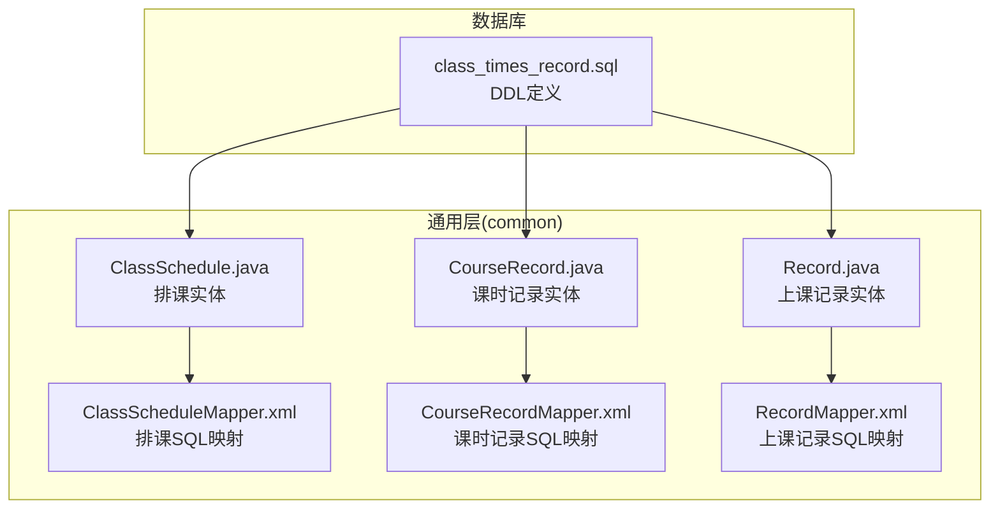
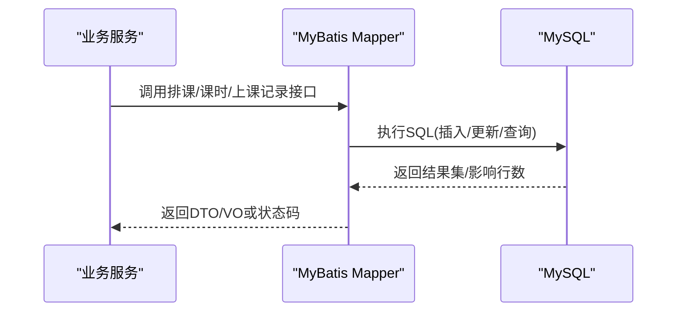
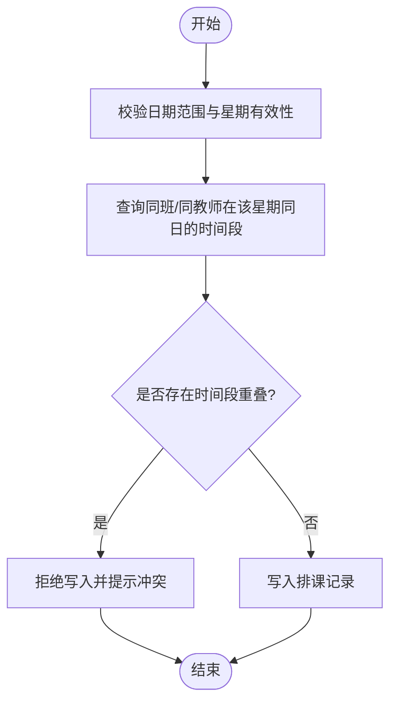
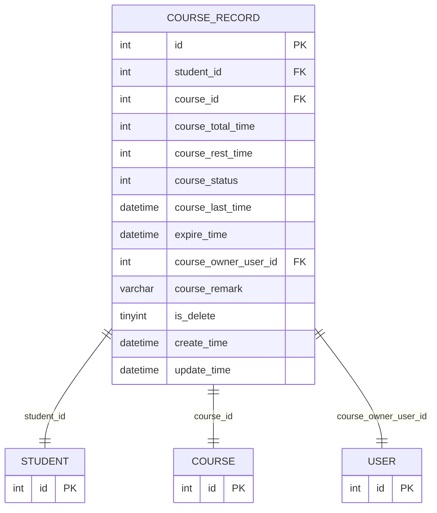
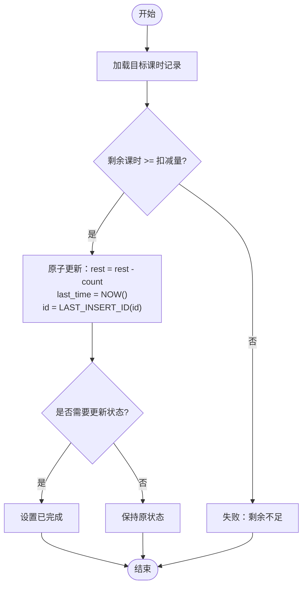
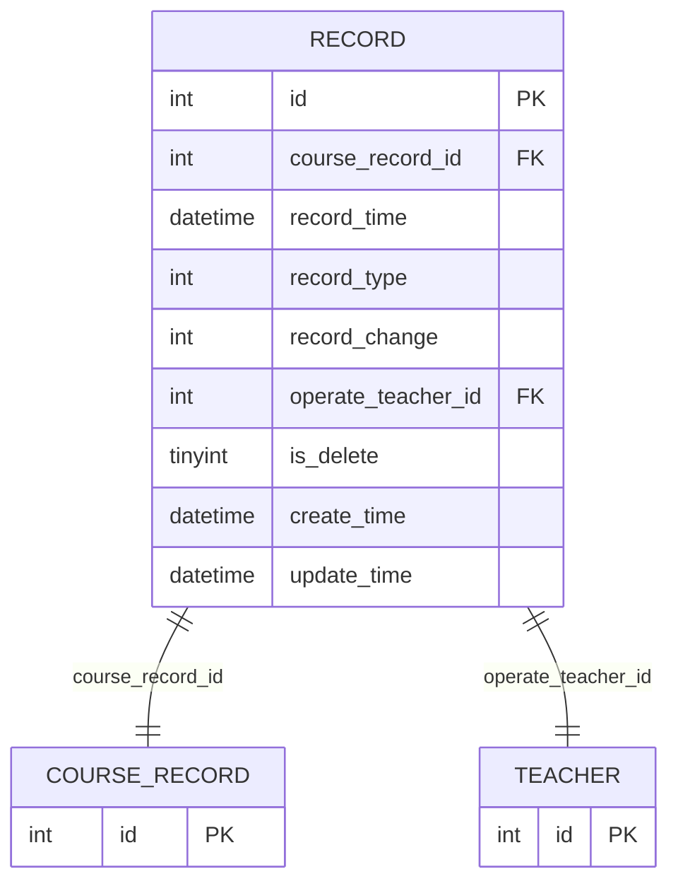
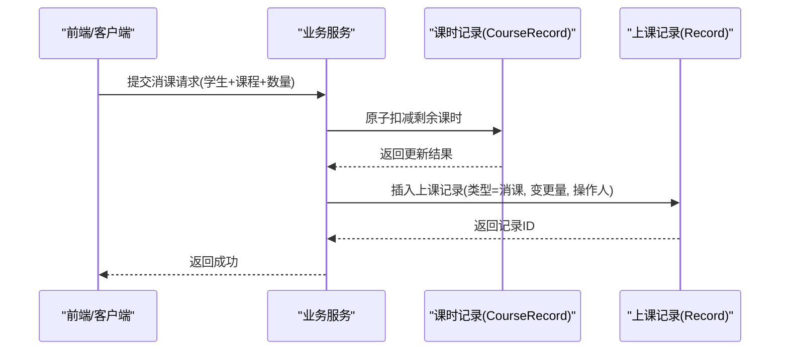
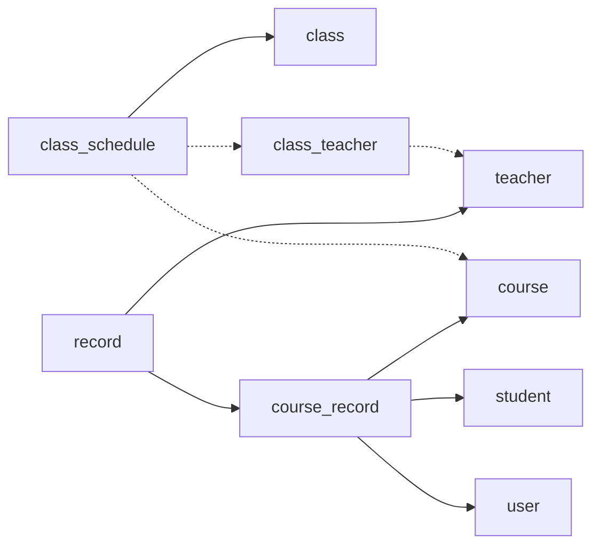

# 排课记录表结构

<cite>
**本文引用的文件**   
- [class_times_record.sql](file://class_times_record_back/docs/class_times_record.sql)
- [ClassSchedule.java](file://common/src/main/java/com/shiroko/repository/entity/ClassSchedule.java)
- [CourseRecord.java](file://common/src/main/java/com/shiroko/repository/entity/CourseRecord.java)
- [Record.java](file://common/src/main/java/com/shiroko/repository/entity/Record.java)
- [ClassScheduleMapper.xml](file://common/src/main/resources/com/shiroko/mapper/ClassScheduleMapper.xml)
- [CourseRecordMapper.xml](file://common/src/main/resources/com/shiroko/mapper/CourseRecordMapper.xml)
- [RecordMapper.xml](file://common/src/main/resources/com/shiroko/mapper/RecordMapper.xml)
</cite>

## 目录
1. [简介](#简介)
2. [项目结构](#项目结构)
3. [核心组件](#核心组件)
4. [架构总览](#架构总览)
5. [详细组件分析](#详细组件分析)
6. [依赖关系分析](#依赖关系分析)
7. [性能考虑](#性能考虑)
8. [故障排查指南](#故障排查指南)
9. [结论](#结论)
10. [附录](#附录)

## 简介
本文件围绕课时管理系统中的“排课”与“课时记录”相关数据模型进行深入解析，重点覆盖以下方面：
- 排课时间维度设计（日期、星期、时间段）
- 排课冲突检测机制
- 课时记录的生命周期管理、扣减逻辑与剩余课时计算
- 上课记录的增删改类型、课时变更追踪与操作人审计
- 数据一致性保证与事务处理方案

## 项目结构
本项目采用前后端分离与多服务架构。数据库脚本位于后端文档目录；实体类与 MyBatis Mapper 位于 common 模块中，用于跨服务复用。



图表来源
- [class_times_record.sql:56-73](file://class_times_record_back/docs/class_times_record.sql#L56-L73)
- [ClassSchedule.java:22-80](file://common/src/main/java/com/shiroko/repository/entity/ClassSchedule.java#L22-L80)
- [CourseRecord.java:22-111](file://common/src/main/java/com/shiroko/repository/entity/CourseRecord.java#L22-L111)
- [Record.java:22-102](file://common/src/main/java/com/shiroko/repository/entity/Record.java#L22-L102)
- [ClassScheduleMapper.xml:1-75](file://common/src/main/resources/com/shiroko/mapper/ClassScheduleMapper.xml#L1-L75)
- [CourseRecordMapper.xml:1-137](file://common/src/main/resources/com/shiroko/mapper/CourseRecordMapper.xml#L1-L137)
- [RecordMapper.xml:1-86](file://common/src/main/resources/com/shiroko/mapper/RecordMapper.xml#L1-L86)

章节来源
- [class_times_record.sql:56-73](file://class_times_record_back/docs/class_times_record.sql#L56-L73)
- [ClassSchedule.java:22-80](file://common/src/main/java/com/shiroko/repository/entity/ClassSchedule.java#L22-L80)
- [CourseRecord.java:22-111](file://common/src/main/java/com/shiroko/repository/entity/CourseRecord.java#L22-L111)
- [Record.java:22-102](file://common/src/main/java/com/shiroko/repository/entity/Record.java#L22-L102)
- [ClassScheduleMapper.xml:1-75](file://common/src/main/resources/com/shiroko/mapper/ClassScheduleMapper.xml#L1-L75)
- [CourseRecordMapper.xml:1-137](file://common/src/main/resources/com/shiroko/mapper/CourseRecordMapper.xml#L1-L137)
- [RecordMapper.xml:1-86](file://common/src/main/resources/com/shiroko/mapper/RecordMapper.xml#L1-L86)

## 核心组件
本节聚焦三张核心表及其关联表的结构设计与业务含义：
- 排课表 class_schedule（c_class_schedule）
- 课时记录表 course_record（c_course_record）
- 上课记录表 record（c_record）
- 关联表：班级(class)、班级教师(class_teacher)、学生(student)、课程(course)

关键要点
- 排课以“日期范围 + 星期 + 时间段”描述周期性上课时间
- 课时记录维护“总数、剩余、状态、过期时间、上次上课时间”等
- 上课记录作为不可变流水，记录每次增/消/纯记录及操作人

章节来源
- [class_times_record.sql:56-73](file://class_times_record_back/docs/class_times_record.sql#L56-L73)
- [class_times_record.sql:140-164](file://class_times_record_back/docs/class_times_record.sql#L140-L164)
- [class_times_record.sql:262-281](file://class_times_record_back/docs/class_times_record.sql#L262-L281)
- [class_times_record.sql:37-53](file://class_times_record_back/docs/class_times_record.sql#L37-L53)
- [class_times_record.sql:92-105](file://class_times_record_back/docs/class_times_record.sql#L92-L105)
- [class_times_record.sql:299-316](file://class_times_record_back/docs/class_times_record.sql#L299-L316)
- [class_times_record.sql:108-122](file://class_times_record_back/docs/class_times_record.sql#L108-L122)

## 架构总览
从数据到应用层的调用路径如下：



图表来源
- [ClassScheduleMapper.xml:24-71](file://common/src/main/resources/com/shiroko/mapper/ClassScheduleMapper.xml#L24-L71)
- [CourseRecordMapper.xml:28-86](file://common/src/main/resources/com/shiroko/mapper/CourseRecordMapper.xml#L28-L86)
- [RecordMapper.xml:43-84](file://common/src/main/resources/com/shiroko/mapper/RecordMapper.xml#L43-L84)

## 详细组件分析

### 排课表 class_schedule（c_class_schedule）
- 字段与维度
  - 日期范围：start_date、end_date
  - 星期：day_of_week（1-7）
  - 时间段：start_time、end_time
  - 关联：class_id → class
- 索引与约束
  - 主键 id
  - 普通索引 class_id
  - 外键约束 class_id → class.id
- 典型用途
  - 按机构/教师查询排课列表
  - 批量插入排课计划
  - 按班级删除排课

```mermaid
erDiagram
CLASS_SCHEDULE {
int id PK
int class_id FK
date start_date
date end_date
tinyint day_of_week
time start_time
time end_time
varchar remark
datetime create_time
datetime update_time
}
CLASS {
int id PK
}
CLASS_SCHEDULE ||--|| CLASS : "class_id"
```

图表来源
- [class_times_record.sql:56-73](file://class_times_record_back/docs/class_times_record.sql#L56-L73)
- [class_times_record.sql:37-53](file://class_times_record_back/docs/class_times_record.sql#L37-L53)
- [ClassSchedule.java:22-80](file://common/src/main/java/com/shiroko/repository/entity/ClassSchedule.java#L22-L80)
- [ClassScheduleMapper.xml:24-71](file://common/src/main/resources/com/shiroko/mapper/ClassScheduleMapper.xml#L24-L71)

#### 排课时间维度与冲突检测
- 时间维度
  - 使用“日期范围 + 星期 + 时间段”表达重复性上课时间
  - 查询时可按机构或教师聚合，并关联班级名称与授课教师
- 冲突检测建议（实现层面）
  - 同一班级在同一星期同一天内，时间段不应重叠
  - 同一教师在同一星期同一天内，时间段不应重叠
  - 建议在写入前进行条件查询校验，或在数据库层增加唯一/检查约束（如需要）
  - 可结合 start_date/end_date 与 day_of_week 过滤候选时段，再比较 start_time/end_time 的区间是否相交



章节来源
- [ClassScheduleMapper.xml:46-71](file://common/src/main/resources/com/shiroko/mapper/ClassScheduleMapper.xml#L46-L71)
- [class_times_record.sql:56-73](file://class_times_record_back/docs/class_times_record.sql#L56-L73)

### 课时记录表 course_record（c_course_record）
- 关键字段
  - student_id、course_id：归属学生与课程
  - course_total_time：课时总数
  - course_rest_time：剩余课时
  - course_status：状态（未完成/已完成）
  - course_last_time：上次上课时间
  - expire_time：到期时间
  - course_owner_user_id：归属人
  - is_delete：逻辑删除
- 索引与约束
  - 主键 id
  - 唯一索引 (student_id, course_id)：防止同一学生重复绑定同一课程
  - 普通索引 course_owner_user_id、course_id
  - 外键约束 student_id、course_id、course_owner_user_id



图表来源
- [class_times_record.sql:140-164](file://class_times_record_back/docs/class_times_record.sql#L140-L164)
- [class_times_record.sql:299-316](file://class_times_record_back/docs/class_times_record.sql#L299-L316)
- [class_times_record.sql:108-122](file://class_times_record_back/docs/class_times_record.sql#L108-L122)
- [CourseRecord.java:22-111](file://common/src/main/java/com/shiroko/repository/entity/CourseRecord.java#L22-L111)

#### 课时记录生命周期与剩余课时计算
- 生命周期
  - 创建：初始化 total、rest、status=未完成、expire_time 等
  - 消课：减少 rest，更新 last_time，必要时调整 status
  - 完成：当 rest 归零或业务判定完成，更新 status=已完成
  - 过期：expire_time 到达后标记过期（可由定时任务或查询过滤处理）
- 剩余课时计算
  - 通过原子更新确保并发安全：在满足 course_rest_time >= 扣减量条件下直接递减
  - 使用 LAST_INSERT_ID() 回写被更新行 ID，便于后续审计或日志



图表来源
- [CourseRecordMapper.xml:28-44](file://common/src/main/resources/com/shiroko/mapper/CourseRecordMapper.xml#L28-L44)
- [CourseRecord.java:45-76](file://common/src/main/java/com/shiroko/repository/entity/CourseRecord.java#L45-L76)

章节来源
- [class_times_record.sql:140-164](file://class_times_record_back/docs/class_times_record.sql#L140-L164)
- [CourseRecordMapper.xml:28-86](file://common/src/main/resources/com/shiroko/mapper/CourseRecordMapper.xml#L28-L86)
- [CourseRecord.java:22-111](file://common/src/main/java/com/shiroko/repository/entity/CourseRecord.java#L22-L111)

### 上课记录表 record（c_record）
- 关键字段
  - course_record_id：关联课时记录
  - record_time：记录时间
  - record_type：记录类型（增课/消课/纯记录）
  - record_change：课时变更数量
  - operate_teacher_id：操作人（教师）
  - is_delete：逻辑删除
- 扩展字段（实体中存在但DDL未体现）
  - rest_time_after_deduct：扣费后剩余课时快照
  - deduct_mode：扣费模式（按学生/按课程/按班级）
  - class_id：按班级扣费时有效
- 索引与约束
  - 主键 id
  - 普通索引 course_record_id、operate_teacher_id
  - 外键约束 course_record_id、operate_teacher_id



图表来源
- [class_times_record.sql:262-281](file://class_times_record_back/docs/class_times_record.sql#L262-L281)
- [Record.java:22-102](file://common/src/main/java/com/shiroko/repository/entity/Record.java#L22-L102)

#### 上课记录的增删改类型与审计
- 操作类型
  - 增课：record_type=增课，record_change>0
  - 消课：record_type=消课，record_change>0（对应课时记录 rest 减少）
  - 纯记录：仅记录事实，不改变课时
- 课时变更追踪
  - 通过 record_change 记录变动量
  - 可选快照字段 rest_time_after_deduct 记录扣减后的剩余值（便于对账）
- 操作人审计
  - operate_teacher_id 记录操作教师
  - 查询时可关联教师信息展示操作人姓名



图表来源
- [CourseRecordMapper.xml:28-44](file://common/src/main/resources/com/shiroko/mapper/CourseRecordMapper.xml#L28-L44)
- [RecordMapper.xml:43-84](file://common/src/main/resources/com/shiroko/mapper/RecordMapper.xml#L43-L84)
- [Record.java:52-85](file://common/src/main/java/com/shiroko/repository/entity/Record.java#L52-L85)

章节来源
- [class_times_record.sql:262-281](file://class_times_record_back/docs/class_times_record.sql#L262-L281)
- [RecordMapper.xml:43-84](file://common/src/main/resources/com/shiroko/mapper/RecordMapper.xml#L43-L84)
- [Record.java:22-102](file://common/src/main/java/com/shiroko/repository/entity/Record.java#L22-L102)

### 关联表与基础实体
- 班级 class：承载课程、人数、状态等
- 班级教师 class_teacher：班级与教师的关联
- 学生 student：学生基本信息
- 课程 course：课程名称、类型、所属机构、可用状态

```mermaid
erDiagram
CLASS {
int id PK
int course_id FK
varchar class_name
int student_count
int student_max_count
tinyint status
tinyint isDelete
datetime create_time
datetime update_time
}
CLASS_TEACHER {
int id PK
int class_id FK
int teacher_id FK
}
STUDENT {
int id PK
}
COURSE {
int id PK
varchar course_name
tinyint course_type
int institution_id FK
tinyint is_available
datetime create_time
datetime update_time
}
CLASS ||--o{ CLASS_TEACHER : "class_id"
CLASS ||--|| COURSE : "course_id"
```

图表来源
- [class_times_record.sql:37-53](file://class_times_record_back/docs/class_times_record.sql#L37-L53)
- [class_times_record.sql:92-105](file://class_times_record_back/docs/class_times_record.sql#L92-L105)
- [class_times_record.sql:299-316](file://class_times_record_back/docs/class_times_record.sql#L299-L316)
- [class_times_record.sql:108-122](file://class_times_record_back/docs/class_times_record.sql#L108-L122)

## 依赖关系分析
- 表间依赖
  - class_schedule.class_id → class.id
  - course_record.student_id → student.id
  - course_record.course_id → course.id
  - course_record.course_owner_user_id → user.id
  - record.course_record_id → course_record.id
  - record.operate_teacher_id → teacher.id
- 查询依赖
  - 排课查询常联表 class、class_teacher、teacher、course
  - 课时记录分页查询常联表 student、permission_record（权限控制）
  - 上课记录查询常联表 course_record、course、student、teacher



图表来源
- [class_times_record.sql:56-73](file://class_times_record_back/docs/class_times_record.sql#L56-L73)
- [class_times_record.sql:140-164](file://class_times_record_back/docs/class_times_record.sql#L140-L164)
- [class_times_record.sql:262-281](file://class_times_record_back/docs/class_times_record.sql#L262-L281)
- [ClassScheduleMapper.xml:46-71](file://common/src/main/resources/com/shiroko/mapper/ClassScheduleMapper.xml#L46-L71)
- [CourseRecordMapper.xml:45-86](file://common/src/main/resources/com/shiroko/mapper/CourseRecordMapper.xml#L45-L86)
- [RecordMapper.xml:43-84](file://common/src/main/resources/com/shiroko/mapper/RecordMapper.xml#L43-L84)

## 性能考虑
- 索引优化
  - 排课：为 class_id、day_of_week、start_time/end_time 建立复合索引以提升冲突检测与查询效率
  - 课时记录：(student_id, course_id) 已具备唯一索引；可为 course_status、expire_time 建立辅助索引支持筛选
  - 上课记录：(course_record_id, record_time) 复合索引利于按课时记录拉取流水并按时间排序
- 原子更新
  - 使用带条件的 UPDATE 与 LAST_INSERT_ID() 避免超扣与竞态
- 分页与过滤
  - 课时记录分页查询使用动态条件与 LIKE 模糊匹配，注意在大表场景下对索引命中与全表扫描的影响
- 批量写入
  - 排课批量插入使用 foreach 拼接，减少往返开销

[本节为通用性能建议，无需特定文件引用]

## 故障排查指南
- 排课冲突
  - 现象：新增排课后出现时间重叠
  - 排查：确认 day_of_week 与 start_time/end_time 是否正确；检查同班/同教师同日是否有重叠
  - 参考：排课查询与批量插入 SQL
- 课时超扣
  - 现象：消课后剩余课时为负
  - 排查：确认原子更新条件是否生效；核对并发场景下的事务边界
  - 参考：updateRestTime 原子更新语句
- 记录缺失或不一致
  - 现象：课时记录有变化但上课记录缺失
  - 排查：确认事务是否完整提交；检查插入顺序与异常分支
  - 参考：上课记录查询与关联字段

章节来源
- [ClassScheduleMapper.xml:24-71](file://common/src/main/resources/com/shiroko/mapper/ClassScheduleMapper.xml#L24-L71)
- [CourseRecordMapper.xml:28-44](file://common/src/main/resources/com/shiroko/mapper/CourseRecordMapper.xml#L28-L44)
- [RecordMapper.xml:43-84](file://common/src/main/resources/com/shiroko/mapper/RecordMapper.xml#L43-L84)

## 结论
- 排课通过“日期范围 + 星期 + 时间段”实现灵活周期排课，配合索引与查询策略可有效支撑冲突检测
- 课时记录以“总数/剩余/状态/过期时间”为核心，利用原子更新保障并发安全与数据一致性
- 上课记录作为不可变流水，提供完整的课时变更追踪与操作人审计能力
- 建议在关键路径引入事务与幂等设计，进一步提升系统健壮性

[本节为总结性内容，无需特定文件引用]

## 附录
- 术语说明
  - 排课：为班级设定周期性上课时间
  - 课时记录：学生某课程的购买/分配与剩余情况
  - 上课记录：每次增/消/纯记录的流水
- 常见查询示例（路径）
  - 按机构查询排课：ClassScheduleMapper.selectClassScheduleByInstitutionId
  - 按教师查询排课：ClassScheduleMapper.selectClassScheduleByTeacherId
  - 课时记录分页：CourseRecordMapper.selectCourseCustomPage
  - 课时记录列表：CourseRecordMapper.selectCourseRecords
  - 上课记录列表：RecordMapper.selectRecords

章节来源
- [ClassScheduleMapper.xml:46-71](file://common/src/main/resources/com/shiroko/mapper/ClassScheduleMapper.xml#L46-L71)
- [CourseRecordMapper.xml:45-134](file://common/src/main/resources/com/shiroko/mapper/CourseRecordMapper.xml#L45-L134)
- [RecordMapper.xml:43-84](file://common/src/main/resources/com/shiroko/mapper/RecordMapper.xml#L43-L84)