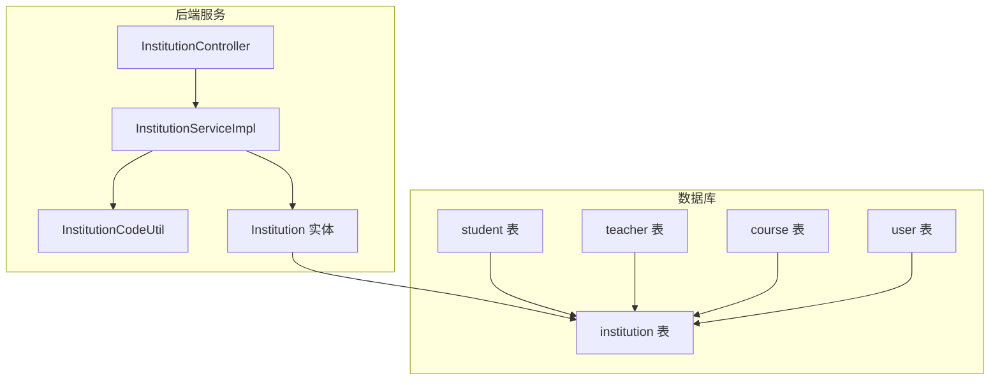
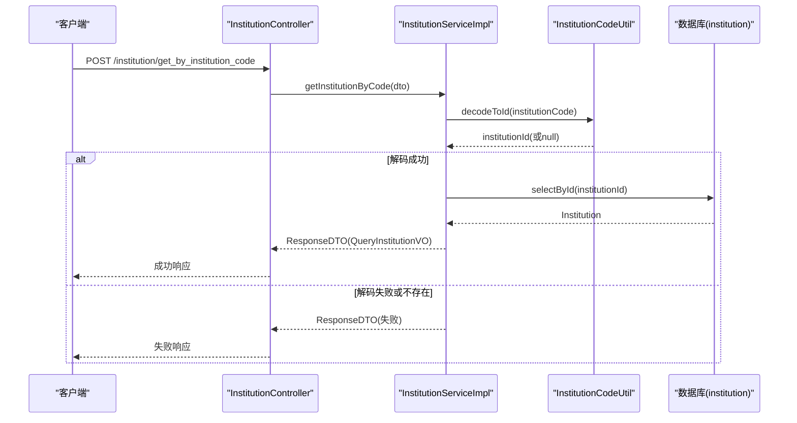
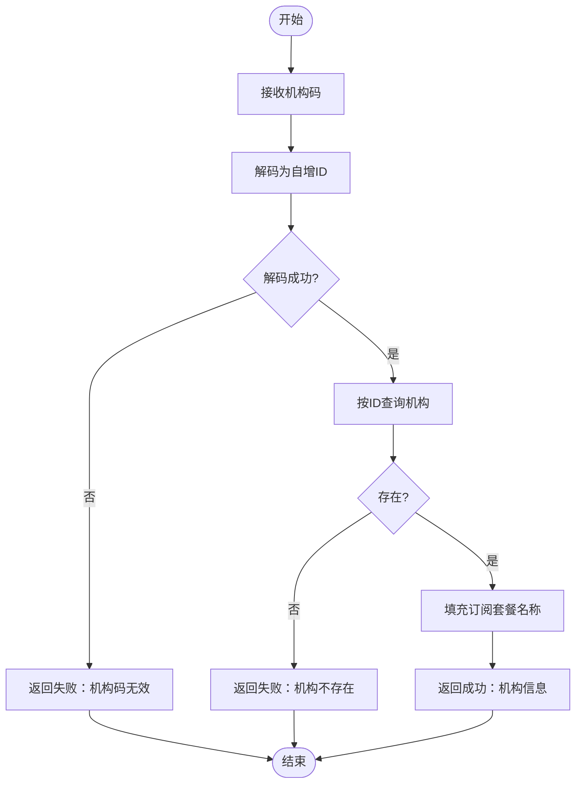
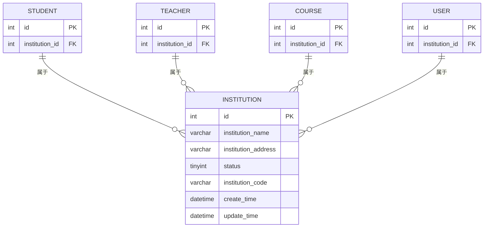
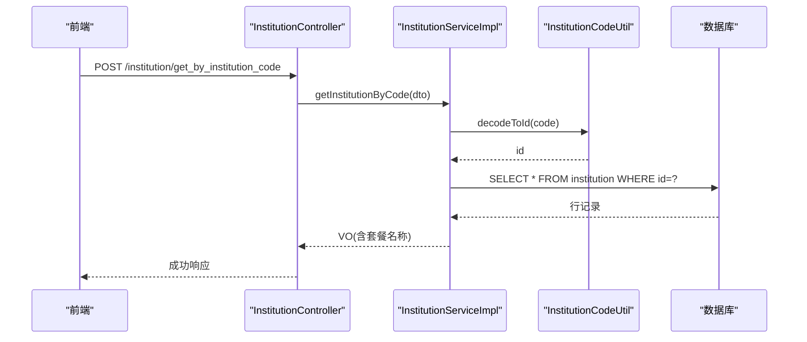
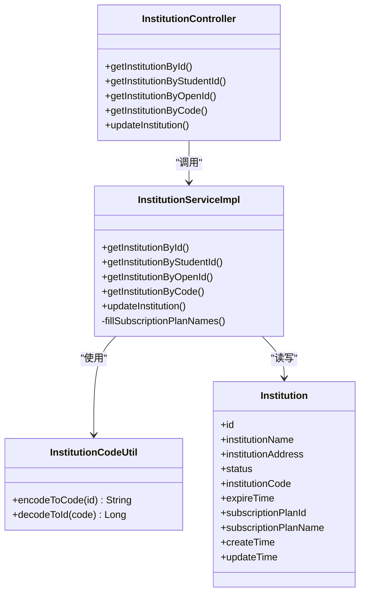

# 机构管理表结构

<cite>
**本文引用的文件**   
- [class_times_record.sql](file://class_times_record_back/docs/class_times_record.sql)
- [Institution.java](file://class_times_record_back/common/src/main/java/com/shiroko/repository/entity/Institution.java)
- [InstitutionCodeUtil.java](file://class_times_record_back/common/src/main/java/com/shiroko/util/InstitutionCodeUtil.java)
- [InstitutionServiceImpl.java](file://class_times_record_back/business-service/src/main/java/com/shiroko/service/impl/InstitutionServiceImpl.java)
- [InstitutionController.java](file://class_times_record_back/business-service/src/main/java/com/shiroko/controller/InstitutionController.java)
- [QueryInstitutionDTO.java](file://class_times_record_back/common/src/main/java/com/shiroko/repository/dto/institution/QueryInstitutionDTO.java)
- [UpdateInstitutionDTO.java](file://class_times_record_back/common/src/main/java/com/shiroko/repository/dto/institution/UpdateInstitutionDTO.java)
</cite>

## 目录
1. [简介](#简介)
2. [项目结构](#项目结构)
3. [核心组件](#核心组件)
4. [架构总览](#架构总览)
5. [详细组件分析](#详细组件分析)
6. [依赖关系分析](#依赖关系分析)
7. [性能考虑](#性能考虑)
8. [故障排查指南](#故障排查指南)
9. [结论](#结论)
10. [附录](#附录)

## 简介
本文件聚焦“机构”领域的数据模型与实现，围绕机构核心表（数据库中的 institution）进行深度解析，包括字段定义、数据类型选择、约束条件与业务含义；详细说明机构的唯一代码生成机制、状态管理与生命周期；解释机构与其他实体（教师、学生、课程等）的关联关系；并提供数据完整性保证与业务规则验证的实现方案及最佳实践指导。

## 项目结构
- 数据库脚本位于 docs 目录下，包含 institution 表的建表语句与外键约束。
- Java 后端采用分层架构：Controller -> Service -> Mapper -> Entity，配合 DTO/VO 进行参数校验与响应封装。
- 机构唯一码通过工具类基于 Hashids 生成与解码，避免直接暴露自增主键。

图表来源
- [class_times_record.sql:169-179](file://class_times_record_back/docs/class_times_record.sql#L169-L179)
- [InstitutionController.java:24-56](file://class_times_record_back/business-service/src/main/java/com/shiroko/controller/InstitutionController.java#L24-L56)
- [InstitutionServiceImpl.java:29-109](file://class_times_record_back/business-service/src/main/java/com/shiroko/service/impl/InstitutionServiceImpl.java#L29-L109)
- [InstitutionCodeUtil.java:13-46](file://class_times_record_back/common/src/main/java/com/shiroko/util/InstitutionCodeUtil.java#L13-L46)
- [Institution.java:21-87](file://class_times_record_back/common/src/main/java/com/shiroko/repository/entity/Institution.java#L21-L87)

章节来源
- [class_times_record.sql:169-179](file://class_times_record_back/docs/class_times_record.sql#L169-L179)

## 核心组件
- 机构实体（Institution）：映射到数据库表 c_institution，包含基础信息、状态、租期到期时间、订阅套餐ID与名称等字段。
- 机构唯一码工具（InstitutionCodeUtil）：使用 Hashids 将自增 ID 编码为短码，支持反向解码。
- 机构服务（InstitutionServiceImpl）：提供按 ID、学生ID、OpenID、机构码查询与更新能力，并在返回 VO 中填充订阅套餐名称。
- 机构控制器（InstitutionController）：对外暴露 REST 接口，统一入参校验与响应封装。

章节来源
- [Institution.java:21-87](file://class_times_record_back/common/src/main/java/com/shiroko/repository/entity/Institution.java#L21-L87)
- [InstitutionCodeUtil.java:13-46](file://class_times_record_back/common/src/main/java/com/shiroko/util/InstitutionCodeUtil.java#L13-L46)
- [InstitutionServiceImpl.java:29-109](file://class_times_record_back/business-service/src/main/java/com/shiroko/service/impl/InstitutionServiceImpl.java#L29-L109)
- [InstitutionController.java:24-56](file://class_times_record_back/business-service/src/main/java/com/shiroko/controller/InstitutionController.java#L24-L56)

## 架构总览
下图展示了从前端请求到数据库访问的完整调用链，以及机构码在查询流程中的编解码过程。

图表来源
- [InstitutionController.java:46-49](file://class_times_record_back/business-service/src/main/java/com/shiroko/controller/InstitutionController.java#L46-L49)
- [InstitutionServiceImpl.java:57-71](file://class_times_record_back/business-service/src/main/java/com/shiroko/service/impl/InstitutionServiceImpl.java#L57-L71)
- [InstitutionCodeUtil.java:32-45](file://class_times_record_back/common/src/main/java/com/shiroko/util/InstitutionCodeUtil.java#L32-L45)
- [class_times_record.sql:169-179](file://class_times_record_back/docs/class_times_record.sql#L169-L179)

## 详细组件分析

### 机构表结构与字段语义
- 表名：institution（注意：Java 实体映射为 c_institution，遵循业务表以 c_ 前缀命名约定）
- 主要字段与类型
  - id：自增主键，标识机构
  - institution_name：机构名称
  - institution_address：机构地址
  - status：机构状态（0：待审核；1：启用；2：禁用）
  - institution_code：机构唯一代码（由自增 ID 经 Hashids 编码得到）
  - create_time/update_time：创建与更新时间
- 约束与索引
  - 主键：id
  - 其他索引：当前脚本未对 institution_code 建立唯一索引，建议在应用层保证唯一性或在数据库层增加唯一索引以避免重复
- 业务含义
  - status 用于控制机构可用性与生命周期阶段
  - expire_time（实体中存在但脚本未体现）表示租期到期时间，NULL 表示永久有效；超过该时间应限制教师登录等关键操作
  - subscription_plan_id 与 subscription_plan_name 用于关联订阅套餐，便于展示与计费策略扩展

章节来源
- [class_times_record.sql:169-179](file://class_times_record_back/docs/class_times_record.sql#L169-L179)
- [Institution.java:21-87](file://class_times_record_back/common/src/main/java/com/shiroko/repository/entity/Institution.java#L21-L87)

### 唯一代码生成机制（institution_code）
- 生成方式：使用 Hashids 将自增 id 编码为固定最小长度的短码，字符集去除了易混淆字符，盐值固定以保证同一 ID 编码结果稳定
- 解码流程：根据输入的机构码解码出真实 id，再按 id 查询机构记录
- 安全性与可读性：相比直接暴露 id，短码更友好且不易被枚举；同时需确保输入合法性与长度校验

图表来源
- [InstitutionServiceImpl.java:57-71](file://class_times_record_back/business-service/src/main/java/com/shiroko/service/impl/InstitutionServiceImpl.java#L57-L71)
- [InstitutionCodeUtil.java:32-45](file://class_times_record_back/common/src/main/java/com/shiroko/util/InstitutionCodeUtil.java#L32-L45)

章节来源
- [InstitutionCodeUtil.java:13-46](file://class_times_record_back/common/src/main/java/com/shiroko/util/InstitutionCodeUtil.java#L13-L46)
- [InstitutionServiceImpl.java:57-71](file://class_times_record_back/business-service/src/main/java/com/shiroko/service/impl/InstitutionServiceImpl.java#L57-L71)

### 状态管理与生命周期
- 状态值
  - 0：待审核
  - 1：启用
  - 2：禁用
- 生命周期建议
  - 新增机构默认状态为“待审核”，管理员审核后切换为“启用”
  - “禁用”用于临时冻结，保留历史数据与关联关系
  - 结合 expire_time 控制租期：过期后自动降级为“禁用”或限制登录
- 前端展示
  - 列表与详情中根据 status 映射显示标签文本与颜色

章节来源
- [class_times_record.sql:169-179](file://class_times_record_back/docs/class_times_record.sql#L169-L179)
- [Institution.java:46-58](file://class_times_record_back/common/src/main/java/com/shiroko/repository/entity/Institution.java#L46-L58)

### 与其他实体的关联关系
- 学生（student）
  - 通过 institution_id 外键关联 institution，表示学生所属机构
- 教师（teacher）
  - 通过 institution_id 外键关联 institution，表示教师所属机构
- 课程（course）
  - 通过 institution_id 外键关联 institution，表示课程归属机构
- 用户（user）
  - 通过 institution_id 外键关联 institution，表示用户所属机构

图表来源
- [class_times_record.sql:169-179](file://class_times_record_back/docs/class_times_record.sql#L169-L179)
- [class_times_record.sql:302-316](file://class_times_record_back/docs/class_times_record.sql#L302-L316)
- [class_times_record.sql:412-424](file://class_times_record_back/docs/class_times_record.sql#L412-L424)
- [class_times_record.sql:111-122](file://class_times_record_back/docs/class_times_record.sql#L111-L122)
- [class_times_record.sql:446-454](file://class_times_record_back/docs/class_times_record.sql#L446-L454)

章节来源
- [class_times_record.sql:169-179](file://class_times_record_back/docs/class_times_record.sql#L169-L179)
- [class_times_record.sql:302-316](file://class_times_record_back/docs/class_times_record.sql#L302-L316)
- [class_times_record.sql:412-424](file://class_times_record_back/docs/class_times_record.sql#L412-L424)
- [class_times_record.sql:111-122](file://class_times_record_back/docs/class_times_record.sql#L111-L122)
- [class_times_record.sql:446-454](file://class_times_record_back/docs/class_times_record.sql#L446-L454)

### 数据完整性与业务规则验证
- 入参校验
  - 使用分组校验（QueryGroup）对查询参数进行非空校验，如 byId、byOpenId、byInstitutionCode
- 业务规则
  - 机构码必须合法且对应存在的机构
  - 更新机构信息时，expire_time 可为空表示永久有效
- 外键约束
  - student、teacher、course、user 均通过 institution_id 外键关联，删除机构时需考虑级联策略（当前为 RESTRICT，防止误删）

章节来源
- [QueryInstitutionDTO.java:14-30](file://class_times_record_back/common/src/main/java/com/shiroko/repository/dto/institution/QueryInstitutionDTO.java#L14-L30)
- [UpdateInstitutionDTO.java:12-19](file://class_times_record_back/common/src/main/java/com/shiroko/repository/dto/institution/UpdateInstitutionDTO.java#L12-L19)
- [class_times_record.sql:302-316](file://class_times_record_back/docs/class_times_record.sql#L302-L316)
- [class_times_record.sql:412-424](file://class_times_record_back/docs/class_times_record.sql#L412-L424)
- [class_times_record.sql:111-122](file://class_times_record_back/docs/class_times_record.sql#L111-L122)
- [class_times_record.sql:446-454](file://class_times_record_back/docs/class_times_record.sql#L446-L454)

### API 工作流（按机构码查询）

图表来源
- [InstitutionController.java:46-49](file://class_times_record_back/business-service/src/main/java/com/shiroko/controller/InstitutionController.java#L46-L49)
- [InstitutionServiceImpl.java:57-71](file://class_times_record_back/business-service/src/main/java/com/shiroko/service/impl/InstitutionServiceImpl.java#L57-L71)
- [InstitutionCodeUtil.java:32-45](file://class_times_record_back/common/src/main/java/com/shiroko/util/InstitutionCodeUtil.java#L32-L45)
- [class_times_record.sql:169-179](file://class_times_record_back/docs/class_times_record.sql#L169-L179)

## 依赖关系分析
- 控制器依赖服务层，服务层依赖工具类与数据访问层
- 实体与数据库表一一对应，DTO/VO 负责传输与展示
- 订阅套餐名称在服务层通过单独查询填充，避免复杂 JOIN

图表来源
- [InstitutionController.java:24-56](file://class_times_record_back/business-service/src/main/java/com/shiroko/controller/InstitutionController.java#L24-L56)
- [InstitutionServiceImpl.java:29-109](file://class_times_record_back/business-service/src/main/java/com/shiroko/service/impl/InstitutionServiceImpl.java#L29-L109)
- [InstitutionCodeUtil.java:13-46](file://class_times_record_back/common/src/main/java/com/shiroko/util/InstitutionCodeUtil.java#L13-L46)
- [Institution.java:21-87](file://class_times_record_back/common/src/main/java/com/shiroko/repository/entity/Institution.java#L21-L87)

章节来源
- [InstitutionController.java:24-56](file://class_times_record_back/business-service/src/main/java/com/shiroko/controller/InstitutionController.java#L24-L56)
- [InstitutionServiceImpl.java:29-109](file://class_times_record_back/business-service/src/main/java/com/shiroko/service/impl/InstitutionServiceImpl.java#L29-L109)
- [InstitutionCodeUtil.java:13-46](file://class_times_record_back/common/src/main/java/com/shiroko/util/InstitutionCodeUtil.java#L13-L46)
- [Institution.java:21-87](file://class_times_record_back/common/src/main/java/com/shiroko/repository/entity/Institution.java#L21-L87)

## 性能考虑
- 查询优化
  - 若频繁按 institution_code 查询，建议在数据库层为该列添加唯一索引以提升检索性能
  - 批量查询时，可考虑一次性加载订阅套餐信息以减少多次往返
- 编解码开销
  - Hashids 编解码计算量较小，但在高并发场景下仍需关注 CPU 占用，必要时可引入缓存（如本地缓存最近使用的 code->id 映射）
- 外键约束
  - 当前为 RESTRICT，避免误删导致级联影响，适合强一致性要求；如需软删除或级联处理，可在应用层实现

[本节为通用性能建议，不直接分析具体文件]

## 故障排查指南
- 机构码无效
  - 现象：返回“机构码无效”
  - 原因：Hashids 解码失败，可能为非法输入或长度不符
  - 处理：检查前端传入的 institutionCode 是否经过正确编码，确认盐值与字符集配置一致
- 机构不存在
  - 现象：返回“机构不存在”
  - 原因：解码后的 id 在数据库中无对应记录
  - 处理：核对数据库是否存在该机构，或检查是否已被删除
- 状态异常
  - 现象：机构状态不符合预期
  - 原因：状态流转逻辑未生效或前端展示映射错误
  - 处理：检查状态更新接口与前端状态映射逻辑

章节来源
- [InstitutionServiceImpl.java:57-71](file://class_times_record_back/business-service/src/main/java/com/shiroko/service/impl/InstitutionServiceImpl.java#L57-L71)
- [InstitutionCodeUtil.java:32-45](file://class_times_record_back/common/src/main/java/com/shiroko/util/InstitutionCodeUtil.java#L32-L45)

## 结论
机构表结构设计简洁清晰，通过 institution_code 隐藏自增主键并提升安全性；状态字段与租期字段共同支撑机构生命周期管理；通过外键约束保障数据完整性。建议在数据库层为 institution_code 增加唯一索引，并在服务层完善过期与状态联动逻辑，以提升系统健壮性与可维护性。

[本节为总结性内容，不直接分析具体文件]

## 附录
- 最佳实践
  - 在新增机构时自动生成 institution_code，并确保全局唯一
  - 对 institution_code 的输入进行长度与格式校验
  - 在更新机构信息时，严格校验 expire_time 的合法性
  - 对涉及机构的状态变更操作，记录审计日志以便追溯
  - 前端展示时，统一使用状态映射常量，避免硬编码

[本节为通用指导，不直接分析具体文件]