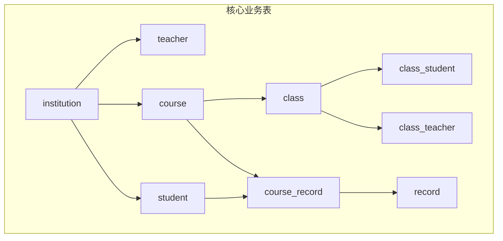
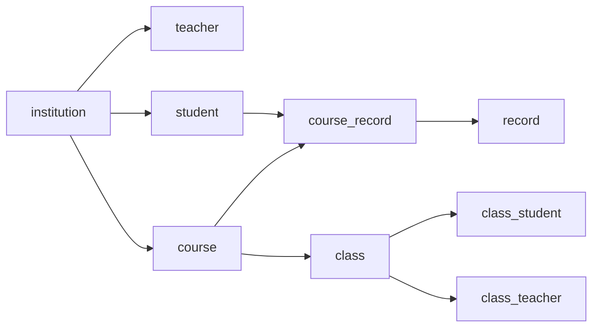

# 核心业务表结构

<cite>
**本文引用的文件**   
- [class_times_record.sql](file://class_times_record_back/docs/class_times_record.sql)
- [Institution.java](file://class_times_record_back/common/src/main/java/com/shiroko/repository/entity/Institution.java)
- [Teacher.java](file://class_times_record_back/common/src/main/java/com/shiroko/repository/entity/Teacher.java)
- [Student.java](file://class_times_record_back/common/src/main/java/com/shiroko/repository/entity/Student.java)
- [Course.java](file://class_times_record_back/common/src/main/java/com/shiroko/repository/entity/Course.java)
- [Class.java](file://class_times_record_back/common/src/main/java/com/shiroko/repository/entity/Class.java)
- [ClassStudent.java](file://class_times_record_back/common/src/main/java/com/shiroko/repository/entity/ClassStudent.java)
- [ClassTeacher.java](file://class_times_record_back/common/src/main/java/com/shiroko/repository/entity/ClassTeacher.java)
- [CourseRecord.java](file://class_times_record_back/common/src/main/java/com/shiroko/repository/entity/CourseRecord.java)
- [Record.java](file://class_times_record_back/common/src/main/java/com/shiroko/repository/entity/Record.java)
</cite>

## 目录
1. [引言](#引言)
2. [项目结构](#项目结构)
3. [核心组件](#核心组件)
4. [架构总览](#架构总览)
5. [详细组件分析](#详细组件分析)
6. [依赖关系分析](#依赖关系分析)
7. [性能考虑](#性能考虑)
8. [故障排查指南](#故障排查指南)
9. [结论](#结论)
10. [附录](#附录)

## 引言
本文件聚焦于课时管理系统中的核心业务实体与数据库表结构，围绕机构、教师、学生、课程、班级等关键域进行系统化说明。文档从字段定义、数据类型选择、约束条件、业务含义出发，进一步解释表间关系映射（一对一、一对多、多对多），并给出外键设计原则、数据完整性保障与性能优化建议，帮助开发者在设计与实现中遵循一致性与可维护性。

## 项目结构
本项目采用前后端分离与微服务化组织方式，核心业务表定义位于后端 SQL 脚本中，Java 层通过 MyBatis-Plus 实体类与表结构一一对应。本次文档重点覆盖以下核心表：
- 机构管理表 institution
- 教师管理表 teacher
- 学生管理表 student
- 课程管理表 course
- 班级管理表 class
- 关联与记录表：class_student、class_teacher、course_record、record 等



图表来源
- [class_times_record.sql:167-179](file://class_times_record_back/docs/class_times_record.sql#L167-L179)
- [class_times_record.sql:409-423](file://class_times_record_back/docs/class_times_record.sql#L409-L423)
- [class_times_record.sql:299-316](file://class_times_record_back/docs/class_times_record.sql#L299-L316)
- [class_times_record.sql:108-122](file://class_times_record_back/docs/class_times_record.sql#L108-L122)
- [class_times_record.sql:39-53](file://class_times_record_back/docs/class_times_record.sql#L39-L53)
- [class_times_record.sql:76-89](file://class_times_record_back/docs/class_times_record.sql#L76-L89)
- [class_times_record.sql:92-105](file://class_times_record_back/docs/class_times_record.sql#L92-L105)
- [class_times_record.sql:140-164](file://class_times_record_back/docs/class_times_record.sql#L140-L164)
- [class_times_record.sql:262-281](file://class_times_record_back/docs/class_times_record.sql#L262-L281)

章节来源
- [class_times_record.sql:167-179](file://class_times_record_back/docs/class_times_record.sql#L167-L179)
- [class_times_record.sql:409-423](file://class_times_record_back/docs/class_times_record.sql#L409-L423)
- [class_times_record.sql:299-316](file://class_times_record_back/docs/class_times_record.sql#L299-L316)
- [class_times_record.sql:108-122](file://class_times_record_back/docs/class_times_record.sql#L108-L122)
- [class_times_record.sql:39-53](file://class_times_record_back/docs/class_times_record.sql#L39-L53)
- [class_times_record.sql:76-89](file://class_times_record_back/docs/class_times_record.sql#L76-L89)
- [class_times_record.sql:92-105](file://class_times_record_back/docs/class_times_record.sql#L92-L105)
- [class_times_record.sql:140-164](file://class_times_record_back/docs/class_times_record.sql#L140-L164)
- [class_times_record.sql:262-281](file://class_times_record_back/docs/class_times_record.sql#L262-L281)

## 核心组件
本节概述各核心实体的职责与关键字段，结合 Java 实体类与 SQL 表结构进行对照说明。

- 机构（institution）
  - 作用：承载培训机构的元信息，作为租户隔离的根维度。
  - 关键字段：id、机构名称、地址、状态、唯一代码、创建/更新时间。
  - 参考路径：[Institution.java](file://class_times_record_back/common/src/main/java/com/shiroko/repository/entity/Institution.java)、[SQL 定义:167-179](file://class_times_record_back/docs/class_times_record.sql#L167-L179)

- 教师（teacher）
  - 作用：教师主数据，包含所属机构、账号关联、是否机构管理员等。
  - 关键字段：id、机构id、user_id、是否启用、用户名、是否机构管理员。
  - 参考路径：[Teacher.java](file://class_times_record_back/common/src/main/java/com/shiroko/repository/entity/Teacher.java)、[SQL 定义:409-423](file://class_times_record_back/docs/class_times_record.sql#L409-L423)

- 学生（student）
  - 作用：学员主数据，包含基本信息与所属机构。
  - 关键字段：id、头像、姓名、机构id、性别、生日、学校、地址、创建/更新时间。
  - 参考路径：[Student.java](file://class_times_record_back/common/src/main/java/com/shiroko/repository/entity/Student.java)、[SQL 定义:299-316](file://class_times_record_back/docs/class_times_record.sql#L299-L316)

- 课程（course）
  - 作用：课程主数据，按次或按天计费类型，归属机构。
  - 关键字段：id、课程名称、课程类型、机构id、是否可用、创建/更新时间。
  - 参考路径：[Course.java](file://class_times_record_back/common/src/main/java/com/shiroko/repository/entity/Course.java)、[SQL 定义:108-122](file://class_times_record_back/docs/class_times_record.sql#L108-L122)

- 班级（class）
  - 作用：教学组织单元，绑定课程，控制人数上限与状态。
  - 关键字段：id、课程id、班级名称、当前人数、最大人数、状态、逻辑删除、创建/更新时间。
  - 参考路径：[Class.java](file://class_times_record_back/common/src/main/java/com/shiroko/repository/entity/Class.java)、[SQL 定义:39-53](file://class_times_record_back/docs/class_times_record.sql#L39-L53)

- 班级-学生（class_student）
  - 作用：班级与学生多对多关系的中间表。
  - 关键字段：id、class_id、student_id、创建时间；唯一索引(class_id, student_id)。
  - 参考路径：[ClassStudent.java](file://class_times_record_back/common/src/main/java/com/shiroko/repository/entity/ClassStudent.java)、[SQL 定义:76-89](file://class_times_record_back/docs/class_times_record.sql#L76-L89)

- 班级-教师（class_teacher）
  - 作用：班级与教师多对多关系的中间表。
  - 关键字段：id、class_id、teacher_id、创建时间；唯一索引(class_id, teacher_id)。
  - 参考路径：[ClassTeacher.java](file://class_times_record_back/common/src/main/java/com/shiroko/repository/entity/ClassTeacher.java)、[SQL 定义:92-105](file://class_times_record_back/docs/class_times_record.sql#L92-L105)

- 课程记录（course_record）
  - 作用：学生与课程的课时契约，记录总课时、剩余次数、状态、过期时间、归属人等。
  - 关键字段：id、student_id、course_id、总课时、剩余次数、上次上课时间、到期时间、状态、归属人、备注、逻辑删除、创建/更新时间；唯一索引(student_id, course_id)。
  - 参考路径：[CourseRecord.java](file://class_times_record_back/common/src/main/java/com/shiroko/repository/entity/CourseRecord.java)、[SQL 定义:140-164](file://class_times_record_back/docs/class_times_record.sql#L140-L164)

- 课时记录（record）
  - 作用：课时增减流水，记录每次扣费/增课明细，支持多种扣费模式与快照字段。
  - 关键字段：id、course_record_id、记录时间、备注、记录类型、课时变更、扣费后剩余课时快照、扣费模式、班级ID、操作人、逻辑删除、创建/更新时间。
  - 参考路径：[Record.java](file://class_times_record_back/common/src/main/java/com/shiroko/repository/entity/Record.java)、[SQL 定义:262-281](file://class_times_record_back/docs/class_times_record.sql#L262-L281)

章节来源
- [Institution.java:1-87](file://class_times_record_back/common/src/main/java/com/shiroko/repository/entity/Institution.java#L1-L87)
- [Teacher.java:1-47](file://class_times_record_back/common/src/main/java/com/shiroko/repository/entity/Teacher.java#L1-L47)
- [Student.java:1-89](file://class_times_record_back/common/src/main/java/com/shiroko/repository/entity/Student.java#L1-L89)
- [Course.java:1-60](file://class_times_record_back/common/src/main/java/com/shiroko/repository/entity/Course.java#L1-L60)
- [Class.java:1-68](file://class_times_record_back/common/src/main/java/com/shiroko/repository/entity/Class.java#L1-L68)
- [ClassStudent.java:1-53](file://class_times_record_back/common/src/main/java/com/shiroko/repository/entity/ClassStudent.java#L1-L53)
- [ClassTeacher.java:1-43](file://class_times_record_back/common/src/main/java/com/shiroko/repository/entity/ClassTeacher.java#L1-L43)
- [CourseRecord.java:1-111](file://class_times_record_back/common/src/main/java/com/shiroko/repository/entity/CourseRecord.java#L1-L111)
- [Record.java:1-102](file://class_times_record_back/common/src/main/java/com/shiroko/repository/entity/Record.java#L1-L102)
- [class_times_record.sql:167-179](file://class_times_record_back/docs/class_times_record.sql#L167-L179)
- [class_times_record.sql:409-423](file://class_times_record_back/docs/class_times_record.sql#L409-L423)
- [class_times_record.sql:299-316](file://class_times_record_back/docs/class_times_record.sql#L299-L316)
- [class_times_record.sql:108-122](file://class_times_record_back/docs/class_times_record.sql#L108-L122)
- [class_times_record.sql:39-53](file://class_times_record_back/docs/class_times_record.sql#L39-L53)
- [class_times_record.sql:76-89](file://class_times_record_back/docs/class_times_record.sql#L76-L89)
- [class_times_record.sql:92-105](file://class_times_record_back/docs/class_times_record.sql#L92-L105)
- [class_times_record.sql:140-164](file://class_times_record_back/docs/class_times_record.sql#L140-L164)
- [class_times_record.sql:262-281](file://class_times_record_back/docs/class_times_record.sql#L262-L281)

## 架构总览
下图展示了核心业务表之间的关系，包括一对一、一对多与多对多的映射，以及关键外键约束。

```mermaid
erDiagram
INSTITUTION {
int id PK
varchar institution_name
varchar institution_address
tinyint status
varchar institution_code
datetime create_time
datetime update_time
}
TEACHER {
int id PK
int institution_id FK
int user_id FK
tinyint is_available
varchar username
}
STUDENT {
int id PK
int institution_id FK
varchar avatar
varchar student_name
tinyint sex
date birth
varchar school
varchar address
datetime create_time
datetime update_time
}
COURSE {
int id PK
varchar course_name
tinyint course_type
int institution_id FK
tinyint is_available
datetime create_time
datetime update_time
}
CLASS {
int id PK
int course_id FK
varchar class_name
int student_count
int student_max_count
tinyint status
tinyint isDelete
datetime create_time
datetime update_time
}
CLASS_STUDENT {
int id PK
int class_id FK
int student_id FK
datetime create_time
}
CLASS_TEACHER {
int id PK
int class_id FK
int teacher_id FK
datetime create_time
}
COURSE_RECORD {
int id PK
int student_id FK
int course_id FK
int course_total_time
int course_rest_time
datetime course_last_time
datetime expire_time
int course_status
int course_owner_user_id
varchar course_remark
tinyint is_delete
datetime create_time
datetime update_time
}
RECORD {
int id PK
int course_record_id FK
datetime record_time
varchar record_remark
int record_type
int record_change
long rest_time_after_deduct
varchar deduct_mode
int class_id
int operate_teacher_id
tinyint is_delete
datetime create_time
datetime update_time
}
INSTITUTION ||--o{ TEACHER : "所属机构"
INSTITUTION ||--o{ STUDENT : "所属机构"
INSTITUTION ||--o{ COURSE : "所属机构"
COURSE ||--o{ CLASS : "开设班级"
CLASS ||--o{ CLASS_STUDENT : "学生报名"
CLASS ||--o{ CLASS_TEACHER : "任课教师"
STUDENT ||--o{ COURSE_RECORD : "选课记录"
COURSE ||--o{ COURSE_RECORD : "选课记录"
COURSE_RECORD ||--o{ RECORD : "课时流水"
```

图表来源
- [class_times_record.sql:167-179](file://class_times_record_back/docs/class_times_record.sql#L167-L179)
- [class_times_record.sql:409-423](file://class_times_record_back/docs/class_times_record.sql#L409-L423)
- [class_times_record.sql:299-316](file://class_times_record_back/docs/class_times_record.sql#L299-L316)
- [class_times_record.sql:108-122](file://class_times_record_back/docs/class_times_record.sql#L108-L122)
- [class_times_record.sql:39-53](file://class_times_record_back/docs/class_times_record.sql#L39-L53)
- [class_times_record.sql:76-89](file://class_times_record_back/docs/class_times_record.sql#L76-L89)
- [class_times_record.sql:92-105](file://class_times_record_back/docs/class_times_record.sql#L92-L105)
- [class_times_record.sql:140-164](file://class_times_record_back/docs/class_times_record.sql#L140-L164)
- [class_times_record.sql:262-281](file://class_times_record_back/docs/class_times_record.sql#L262-L281)

## 详细组件分析

### 机构管理表（institution）
- 字段与类型
  - id：自增主键
  - institution_name：机构名称
  - institution_address：机构地址
  - status：状态（待审核/启用/禁用）
  - institution_code：机构唯一代码
  - create_time/update_time：审计时间戳
- 约束与索引
  - 主键：id
  - 无显式外键；业务上作为其他表的父维度
- 业务含义
  - 作为租户隔离与资源归属的基础维度，所有教师、学生、课程均归属某机构
- 最佳实践
  - 使用 institution_code 作为跨系统标识；status 用于生命周期管控
  - 建议在查询时基于 institution_id 建立索引以加速过滤

章节来源
- [class_times_record.sql:167-179](file://class_times_record_back/docs/class_times_record.sql#L167-L179)
- [Institution.java:1-87](file://class_times_record_back/common/src/main/java/com/shiroko/repository/entity/Institution.java#L1-L87)

### 教师管理表（teacher）
- 字段与类型
  - id：自增主键
  - institution_id：所属机构
  - user_id：用户中心账号关联
  - is_available：角色状态（启用/禁用）
  - username：用户名
  - is_institution_admin：是否为机构管理员（实体类新增字段）
- 约束与索引
  - 主键：id
  - 唯一索引(institution_id, user_id)：保证同一机构内用户唯一
  - 外键：institution_id → institution.id；user_id → user.id
- 业务含义
  - 教师主数据，支撑排课、授课、课时记录等操作权限与归属
- 最佳实践
  - 使用 is_institution_admin 控制机构级管理权限
  - 更新 is_available 时需同步校验相关班级/课程绑定

章节来源
- [class_times_record.sql:409-423](file://class_times_record_back/docs/class_times_record.sql#L409-L423)
- [Teacher.java:1-47](file://class_times_record_back/common/src/main/java/com/shiroko/repository/entity/Teacher.java#L1-L47)

### 学生管理表（student）
- 字段与类型
  - id：自增主键
  - avatar：头像地址
  - student_name：姓名
  - institution_id：所属机构
  - sex：性别
  - birth：出生日期
  - school：学校
  - address：家庭住址
  - create_time/update_time：审计时间戳
- 约束与索引
  - 主键：id
  - 外键：institution_id → institution.id
- 业务含义
  - 学员主数据，支撑选课、班级、课时记录等业务
- 最佳实践
  - 敏感信息（如地址）需脱敏展示；birth 可用于年龄计算与分群

章节来源
- [class_times_record.sql:299-316](file://class_times_record_back/docs/class_times_record.sql#L299-L316)
- [Student.java:1-89](file://class_times_record_back/common/src/main/java/com/shiroko/repository/entity/Student.java#L1-L89)

### 课程管理表（course）
- 字段与类型
  - id：自增主键
  - course_name：课程名称
  - course_type：课程类型（按次/按天）
  - institution_id：所属机构
  - is_available：是否可用
  - create_time/update_time：审计时间戳
- 约束与索引
  - 主键：id
  - 外键：institution_id → institution.id
- 业务含义
  - 课程主数据，决定计费方式与可用性
- 最佳实践
  - 禁用课程时应检查是否存在活跃班级或未完成课程记录

章节来源
- [class_times_record.sql:108-122](file://class_times_record_back/docs/class_times_record.sql#L108-L122)
- [Course.java:1-60](file://class_times_record_back/common/src/main/java/com/shiroko/repository/entity/Course.java#L1-L60)

### 班级管理表（class）
- 字段与类型
  - id：自增主键
  - course_id：对应课程
  - class_name：班级名称
  - student_count：当前人数
  - student_max_count：最大人数限制
  - status：状态（进行中/已结束）
  - isDelete：逻辑删除
  - create_time/update_time：审计时间戳
- 约束与索引
  - 主键：id
  - 外键：course_id → course.id
- 业务含义
  - 教学组织单元，承载排课、师生绑定、容量控制
- 最佳实践
  - 插入/删除学生时同步维护 student_count；达到上限禁止继续加入

章节来源
- [class_times_record.sql:39-53](file://class_times_record_back/docs/class_times_record.sql#L39-L53)
- [Class.java:1-68](file://class_times_record_back/common/src/main/java/com/shiroko/repository/entity/Class.java#L1-L68)

### 班级-学生（class_student）
- 字段与类型
  - id：自增主键
  - class_id：班级
  - student_id：学生
  - create_time：创建时间
- 约束与索引
  - 主键：id
  - 唯一索引(class_id, student_id)：防止重复报名
  - 外键：class_id → class.id；student_id → student.id
- 业务含义
  - 班级与学生的多对多关系
- 最佳实践
  - 添加前校验班级容量与状态；删除时同步更新班级人数

章节来源
- [class_times_record.sql:76-89](file://class_times_record_back/docs/class_times_record.sql#L76-L89)
- [ClassStudent.java:1-53](file://class_times_record_back/common/src/main/java/com/shiroko/repository/entity/ClassStudent.java#L1-L53)

### 班级-教师（class_teacher）
- 字段与类型
  - id：自增主键
  - class_id：班级
  - teacher_id：教师
  - create_time：创建时间
- 约束与索引
  - 主键：id
  - 唯一索引(class_id, teacher_id)：防止重复绑定
  - 外键：class_id → class.id；teacher_id → teacher.id
- 业务含义
  - 班级与教师的多对多关系
- 最佳实践
  - 绑定前校验教师状态与排课冲突

章节来源
- [class_times_record.sql:92-105](file://class_times_record_back/docs/class_times_record.sql#L92-L105)
- [ClassTeacher.java:1-43](file://class_times_record_back/common/src/main/java/com/shiroko/repository/entity/ClassTeacher.java#L1-L43)

### 课程记录（course_record）
- 字段与类型
  - id：自增主键
  - student_id：学生
  - course_id：课程
  - course_total_time：总课时
  - course_rest_time：剩余次数
  - course_last_time：上次上课时间
  - expire_time：到期时间
  - course_status：状态（未完成/已完成）
  - course_owner_user_id：归属人
  - course_remark：备注
  - is_delete：逻辑删除
  - create_time/update_time：审计时间戳
- 约束与索引
  - 主键：id
  - 唯一索引(student_id, course_id)：同一学生对同一课程仅一条记录
  - 外键：student_id → student.id；course_id → course.id；course_owner_user_id → user.id
- 业务含义
  - 学生与课程的课时契约，驱动课时流水与结算
- 最佳实践
  - 修改剩余次数必须通过课时记录（record）原子更新，避免并发不一致

章节来源
- [class_times_record.sql:140-164](file://class_times_record_back/docs/class_times_record.sql#L140-L164)
- [CourseRecord.java:1-111](file://class_times_record_back/common/src/main/java/com/shiroko/repository/entity/CourseRecord.java#L1-L111)

### 课时记录（record）
- 字段与类型
  - id：自增主键
  - course_record_id：课时记录
  - record_time：记录时间
  - record_remark：备注
  - record_type：记录类型（增课/消课/纯记录）
  - record_change：课时变更量
  - rest_time_after_deduct：扣费后剩余课时快照
  - deduct_mode：扣费模式（按学生/按课程/按班级）
  - class_id：班级ID（按班级扣费时有效）
  - operate_teacher_id：操作人
  - is_delete：逻辑删除
  - create_time/update_time：审计时间戳
- 约束与索引
  - 主键：id
  - 外键：course_record_id → course_record.id；operate_teacher_id → teacher.id
- 业务含义
  - 课时流水，提供完整的审计与追溯能力
- 最佳实践
  - 写入流水时必须同时更新 course_record.course_rest_time，并使用事务保证一致性

章节来源
- [class_times_record.sql:262-281](file://class_times_record_back/docs/class_times_record.sql#L262-L281)
- [Record.java:1-102](file://class_times_record_back/common/src/main/java/com/shiroko/repository/entity/Record.java#L1-L102)

## 依赖关系分析
- 一对一
  - teacher.user_id ↔ user.id（教师与用户中心账号）
- 一对多
  - institution → teacher/student/course（机构下多教师/学生/课程）
  - course → class（一门课程可开多个班）
  - class → class_student/class_teacher（一个班级多名学生/教师）
  - course_record → record（一条课程记录有多条课时流水）
- 多对多
  - class ↔ student（通过 class_student）
  - class ↔ teacher（通过 class_teacher）



图表来源
- [class_times_record.sql:167-179](file://class_times_record_back/docs/class_times_record.sql#L167-L179)
- [class_times_record.sql:409-423](file://class_times_record_back/docs/class_times_record.sql#L409-L423)
- [class_times_record.sql:299-316](file://class_times_record_back/docs/class_times_record.sql#L299-L316)
- [class_times_record.sql:108-122](file://class_times_record_back/docs/class_times_record.sql#L108-L122)
- [class_times_record.sql:39-53](file://class_times_record_back/docs/class_times_record.sql#L39-L53)
- [class_times_record.sql:76-89](file://class_times_record_back/docs/class_times_record.sql#L76-L89)
- [class_times_record.sql:92-105](file://class_times_record_back/docs/class_times_record.sql#L92-L105)
- [class_times_record.sql:140-164](file://class_times_record_back/docs/class_times_record.sql#L140-L164)
- [class_times_record.sql:262-281](file://class_times_record_back/docs/class_times_record.sql#L262-L281)

## 性能考虑
- 索引策略
  - 高频过滤字段加索引：如 institution_id、course_id、student_id、class_id、course_record_id
  - 复合索引：(student_id, course_id) 已存在，避免重复选课查询开销
  - 唯一索引：(class_id, student_id)、(class_id, teacher_id) 既保证业务规则又提升去重查询效率
- 外键与锁
  - 外键 ON DELETE RESTRICT 保护数据一致性，但批量删除需谨慎，避免长事务锁表
  - 高并发场景优先使用应用层唯一约束+幂等写入，减少数据库锁竞争
- 读写分离与缓存
  - 主数据（机构、课程、班级）适合读多写少，可引入缓存
  - 课时流水（record）为追加型数据，注意归档与分区策略
- 统计字段维护
  - class.student_count 建议通过触发器或事务内原子更新，避免计数不一致

## 故障排查指南
- 常见错误
  - 外键约束失败：检查被引用记录是否存在，或先解除关联再删除
  - 唯一索引冲突：重复报名/重复绑定教师，需在应用层做前置校验
  - 课时余额不足：扣课前校验 course_rest_time ≥ 扣减量
- 定位方法
  - 查看 course_record 与 record 的一致性：对比剩余次数与流水累计
  - 检查班级容量：比对 class.student_count 与 class_student 实际数量
  - 审计日志：利用 create_time/update_time 与 operate_teacher_id 追踪变更

章节来源
- [class_times_record.sql:76-89](file://class_times_record_back/docs/class_times_record.sql#L76-L89)
- [class_times_record.sql:92-105](file://class_times_record_back/docs/class_times_record.sql#L92-L105)
- [class_times_record.sql:140-164](file://class_times_record_back/docs/class_times_record.sql#L140-L164)
- [class_times_record.sql:262-281](file://class_times_record_back/docs/class_times_record.sql#L262-L281)

## 结论
本方案围绕机构、教师、学生、课程、班级五大核心实体构建课时管理体系，通过明确的外键约束与唯一索引保障数据完整性，借助 course_record 与 record 形成“契约+流水”的可追溯模型。配合合理的索引与事务策略，可在保证一致性的前提下获得良好的扩展性与性能表现。

## 附录
- 数据完整性与业务规则验证要点
  - 同一学生对同一课程仅一条课程记录（唯一索引）
  - 班级容量控制：添加/移除学生时同步更新人数
  - 课时扣减原子性：写入 record 的同时更新 course_rest_time
  - 状态机：课程/班级/机构状态变更需联动校验
- 开发最佳实践
  - 统一使用 Long 作为主键类型，避免整型溢出
  - 所有时间字段使用带时区的时间类型，并在应用层规范化
  - 对外接口返回最小必要字段，敏感信息脱敏处理