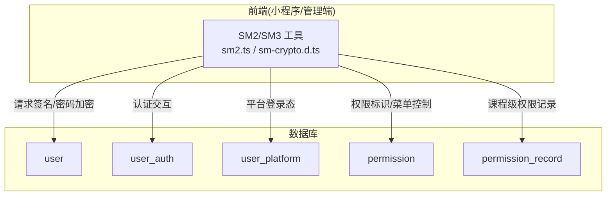
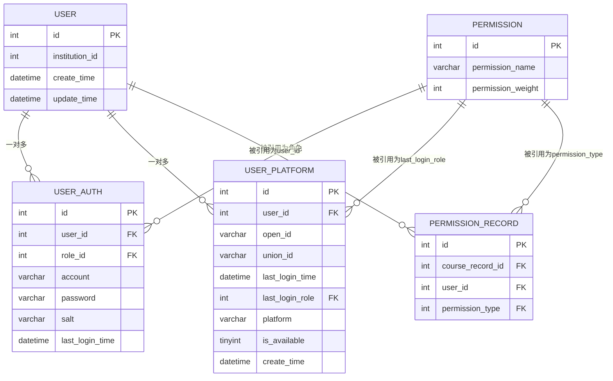
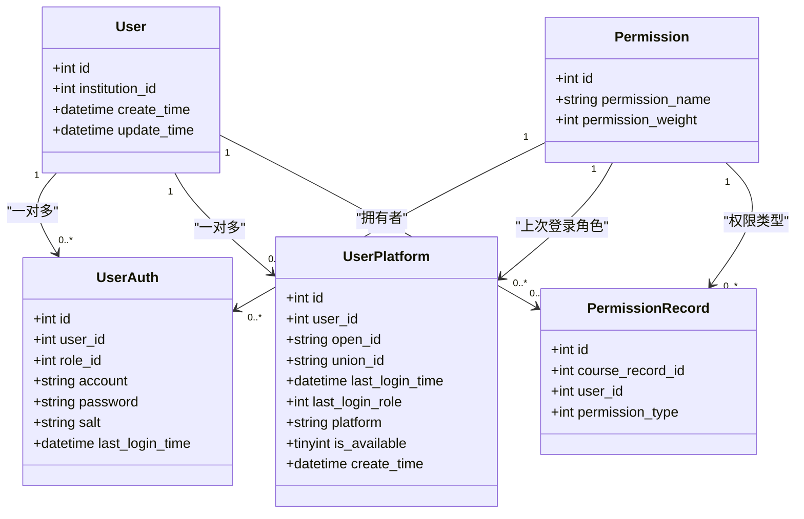
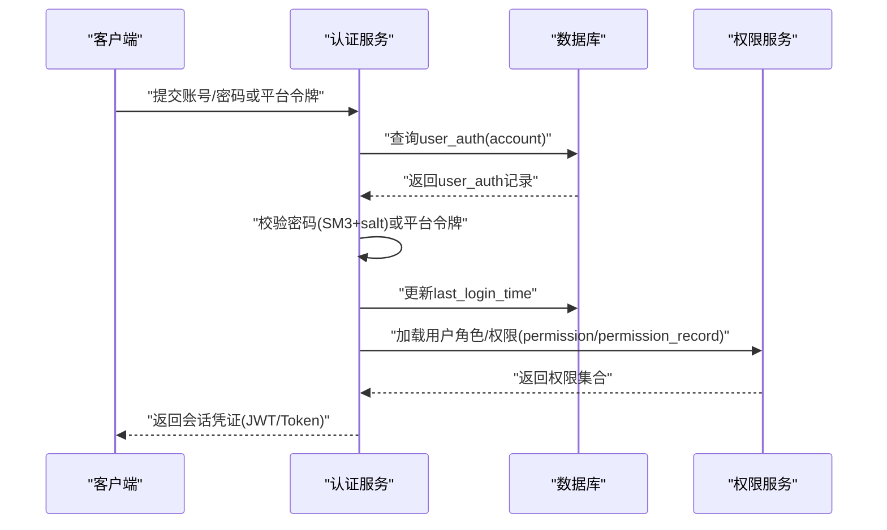

# 用户认证表结构

<cite>
**本文引用的文件**   
- [class_times_record.sql](file://class_times_record_back/docs/class_times_record.sql)
- [CLAUDE.md](file://CLAUDE.md)
- [sm2.ts](file://class_record_admin_front/src/utils/sm2.ts)
- [sm-crypto.d.ts](file://class_record_admin_front/src/types/sm-crypto.d.ts)
</cite>

## 目录
1. [简介](#简介)
2. [项目结构](#项目结构)
3. [核心组件](#核心组件)
4. [架构总览](#架构总览)
5. [详细组件分析](#详细组件分析)
6. [依赖关系分析](#依赖关系分析)
7. [性能考虑](#性能考虑)
8. [故障排查指南](#故障排查指南)
9. [结论](#结论)
10. [附录](#附录)

## 简介
本文件聚焦于用户认证相关的数据表结构设计，围绕以下五张核心表展开：user（用户基础信息）、user_auth（用户认证信息）、user_platform（平台绑定）、permission（权限/角色定义）、permission_record（权限分配记录）。文档将详细说明字段定义、数据关系、国密SM3密码加密存储机制、多平台登录支持设计以及权限模型与记录管理。同时提供用户认证流程的数据流图与安全考量建议，帮助读者快速理解并正确扩展该体系。

## 项目结构
与用户认证相关的数据库结构定义位于后端文档的SQL文件中；前端在小程序与管理端均实现了基于国密算法的签名与加密能力，用于请求安全与密码传输保护。

图表来源
- [class_times_record.sql:443-494](file://class_times_record_back/docs/class_times_record.sql#L443-L494)
- [sm2.ts:1-100](file://class_record_admin_front/src/utils/sm2.ts#L1-L100)
- [sm-crypto.d.ts:13-15](file://class_record_admin_front/src/types/sm-crypto.d.ts#L13-L15)

章节来源
- [class_times_record.sql:443-494](file://class_times_record_back/docs/class_times_record.sql#L443-L494)
- [CLAUDE.md:32-56](file://CLAUDE.md#L32-L56)
- [sm2.ts:1-100](file://class_record_admin_front/src/utils/sm2.ts#L1-L100)
- [sm-crypto.d.ts:13-15](file://class_record_admin_front/src/types/sm-crypto.d.ts#L13-L15)

## 核心组件
本节对五张核心表的字段与关系进行说明，重点覆盖：
- user：用户主实体，关联机构
- user_auth：账号密码与角色绑定，使用SM3+盐值存储
- user_platform：第三方平台登录态与上次登录角色
- permission：权限/角色定义（含权重）
- permission_record：针对课程记录的细粒度权限分配

章节来源
- [class_times_record.sql:443-494](file://class_times_record_back/docs/class_times_record.sql#L443-L494)

## 架构总览
下图展示用户认证相关表之间的ER关系，包括外键约束与唯一索引的设计意图。

图表来源
- [class_times_record.sql:443-494](file://class_times_record_back/docs/class_times_record.sql#L443-L494)

## 详细组件分析

### 用户基础信息表 user
- 作用：系统内所有用户的统一主实体，承载机构归属与审计时间戳。
- 关键字段
  - id：自增主键
  - institution_id：所属机构ID，外键关联机构表
  - create_time/update_time：创建与更新时间
- 设计要点
  - 通过institution_id实现租户/机构隔离的基础维度
  - 与其他业务表（如teacher、parent、admin等）通过user.id建立一对一或一对多扩展关系

章节来源
- [class_times_record.sql:443-454](file://class_times_record_back/docs/class_times_record.sql#L443-L454)

### 用户认证信息表 user_auth
- 作用：存储用户账号、密码及角色绑定，支撑账号密码登录。
- 关键字段
  - id：自增主键
  - user_id：关联user.id
  - role_id：关联permission.id，表示该账号的角色
  - account：用户名（登录名）
  - password：SM3哈希后的密码
  - salt：SM3加盐值
  - last_login_time：最近登录时间
- 设计要点
  - 密码采用“SM3 + salt”方式存储，避免明文与弱哈希风险
  - role_id直接指向permission表，形成“账号-角色”的简单RBAC映射
  - 可结合last_login_time做风控与活跃度统计

章节来源
- [class_times_record.sql:457-473](file://class_times_record_back/docs/class_times_record.sql#L457-L473)
- [CLAUDE.md:32-56](file://CLAUDE.md#L32-L56)

### 平台绑定表 user_platform
- 作用：记录用户在第三方平台的登录态与跨应用身份，支持多平台统一用户。
- 关键字段
  - id：自增主键
  - user_id：关联user.id
  - open_id：平台用户唯一ID
  - union_id：平台跨应用唯一ID
  - last_login_time：最近登录时间
  - last_login_role：上次登录时使用的角色（关联permission.id）
  - platform：平台标识（如web、小程序等）
  - is_available：是否可用
  - create_time：记录创建时间
- 设计要点
  - 通过(user_id, open_id)唯一索引保证同一平台下用户绑定不重复
  - last_login_role便于在多角色场景下决定默认会话角色
  - 支持按platform区分不同渠道的登录态

章节来源
- [class_times_record.sql:476-494](file://class_times_record_back/docs/class_times_record.sql#L476-L494)

### 权限定义表 permission
- 作用：定义系统中的权限/角色及其权重，作为RBAC模型的“权限点”。
- 关键字段
  - id：自增主键
  - permission_name：权限名称
  - permission_weight：权限权重（可用于排序或优先级判断）
- 设计要点
  - 作为role_id与permission_type的外键目标，贯穿账号角色与资源授权
  - 权重字段可用于后续扩展权限等级或审批链策略

章节来源
- [class_times_record.sql:232-240](file://class_times_record_back/docs/class_times_record.sql#L232-L240)

### 权限分配记录表 permission_record
- 作用：记录用户对特定课程记录的权限类型，实现资源级细粒度授权。
- 关键字段
  - id：自增主键
  - course_record_id：关联course_record.id
  - user_id：关联user.id
  - permission_type：关联permission.id，表示拥有的权限类型
- 设计要点
  - 通过(course_record_id, user_id)唯一索引确保“同一用户对同一课程记录仅拥有一种相同权限类型”
  - 适合用于课时记录、消课、调整等业务场景的精细化访问控制

章节来源
- [class_times_record.sql:243-259](file://class_times_record_back/docs/class_times_record.sql#L243-L259)

### 类图：用户认证相关实体关系

图表来源
- [class_times_record.sql:232-259](file://class_times_record_back/docs/class_times_record.sql#L232-L259)
- [class_times_record.sql:443-494](file://class_times_record_back/docs/class_times_record.sql#L443-L494)

## 依赖关系分析
- 外键依赖
  - user_auth.role_id → permission.id
  - user_platform.last_login_role → permission.id
  - permission_record.permission_type → permission.id
  - user_auth.user_id → user.id
  - user_platform.user_id → user.id
  - permission_record.user_id → user.id
- 唯一性约束
  - user_platform: (user_id, open_id) 唯一
  - permission_record: (course_record_id, user_id) 唯一
- 索引优化
  - 常用查询列已建索引，如user_auth.user_id、user_auth.role_id、user_platform.last_login_role、permission_record.user_id、permission_record.course_record_id、permission_record.permission_type

章节来源
- [class_times_record.sql:232-259](file://class_times_record_back/docs/class_times_record.sql#L232-L259)
- [class_times_record.sql:443-494](file://class_times_record_back/docs/class_times_record.sql#L443-L494)

## 性能考虑
- 索引命中
  - 登录校验路径：user_auth.account + user_id 索引可加速账号查找与用户定位
  - 平台登录：user_platform.user_id + open_id 唯一索引保障快速去重与匹配
  - 资源授权：permission_record.user_id/course_record_id 索引提升按用户或课程维度的权限判定效率
- 写入成本
  - 每次登录更新last_login_time属于轻写操作，注意批量场景下的锁竞争
- 扩展建议
  - 若用户规模增长，可对user_auth.account增加唯一索引以避免重复注册
  - 对高频查询的联合条件可考虑复合索引（如user_platform.user_id + platform）

[本节为通用性能建议，无需具体文件分析]

## 故障排查指南
- 登录失败
  - 检查user_auth.account是否存在且is_available状态正常（若存在启用字段）
  - 核对密码是否为SM3+salt计算结果，确认salt一致
  - 查看last_login_time是否被异常更新
- 平台登录冲突
  - 若open_id重复导致插入失败，检查(user_id, open_id)唯一约束
  - 确认union_id在不同应用间的映射是否正确
- 权限不足
  - 校验permission_record中是否存在对应course_record_id与user_id的组合
  - 检查permission_type是否与业务期望的权限类型一致

章节来源
- [class_times_record.sql:457-494](file://class_times_record_back/docs/class_times_record.sql#L457-L494)

## 结论
该用户认证体系以user为核心，通过user_auth完成账号密码与角色的绑定，借助user_platform实现多平台统一登录态，并以permission与permission_record构建从“角色到资源”的细粒度授权模型。配合前端的SM2/SM3能力，可在传输层与存储层共同保障安全性。建议在后续迭代中完善账号唯一约束、细化权限枚举与审计日志，以提升系统的可维护性与可扩展性。

[本节为总结性内容，无需具体文件分析]

## 附录

### 国密SM3密码加密存储机制
- 存储格式
  - user_auth.password：SM3哈希值
  - user_auth.salt：SM3加盐值
- 生成流程
  - 客户端或服务端对原始密码与salt进行SM3运算，得到固定长度摘要后入库
- 验证流程
  - 读取salt，对输入密码再次执行SM3，与存储的password比对
- 参考实现
  - 前端工具库声明了sm3函数接口，用于签名与摘要计算
  - 项目文档说明了小程序端采用SM2加密传输、SM3存储的策略

章节来源
- [class_times_record.sql:457-473](file://class_times_record_back/docs/class_times_record.sql#L457-L473)
- [sm-crypto.d.ts:13-15](file://class_record_admin_front/src/types/sm-crypto.d.ts#L13-L15)
- [CLAUDE.md:32-56](file://CLAUDE.md#L32-L56)

### 多平台登录支持设计
- 设计要点
  - 通过user_platform.open_id/union_id识别不同平台用户
  - last_login_role记录最近一次登录角色，便于默认会话选择
  - platform字段区分渠道（web、小程序等），便于差异化策略
- 典型流程
  - 第三方平台回调携带open_id/union_id
  - 根据open_id查找user_platform，若无则创建并关联user
  - 更新last_login_time与last_login_role

章节来源
- [class_times_record.sql:476-494](file://class_times_record_back/docs/class_times_record.sql#L476-L494)

### 权限记录管理（permission_record）
- 用途
  - 针对课程记录等资源进行细粒度授权，限制某用户对某条记录的操作权限
- 约束
  - 同一用户对同一课程记录只能拥有一种相同权限类型（唯一索引保障）
- 常见用法
  - 教师/家长/管理员对课程记录的增删改查控制
  - 与permission表中的permission_type联动，实现动态权限配置

章节来源
- [class_times_record.sql:243-259](file://class_times_record_back/docs/class_times_record.sql#L243-L259)

### 用户认证流程数据流图（概念）

[此图为概念流程图，未直接映射具体源码文件，故不提供图表来源]

### 安全性考虑
- 传输安全
  - 小程序端采用SM2对密码进行加密传输，后端解密后再进行SM3存储
  - 请求签名使用SM3，附带x-sign、x-timestamp、x-nonce头，防止篡改与重放
- 存储安全
  - 密码使用SM3+salt存储，避免彩虹表攻击
- 会话安全
  - 短时效JWT，必要时支持静默刷新
- 最小权限
  - 通过permission_record实现资源级最小授权

章节来源
- [CLAUDE.md:32-56](file://CLAUDE.md#L32-L56)
- [sm2.ts:1-100](file://class_record_admin_front/src/utils/sm2.ts#L1-L100)