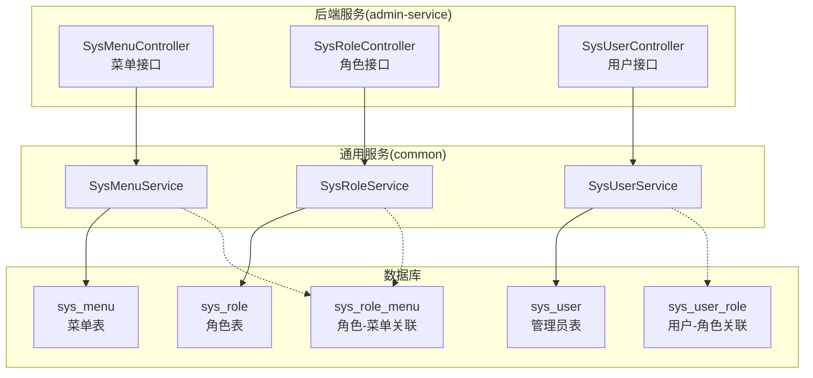
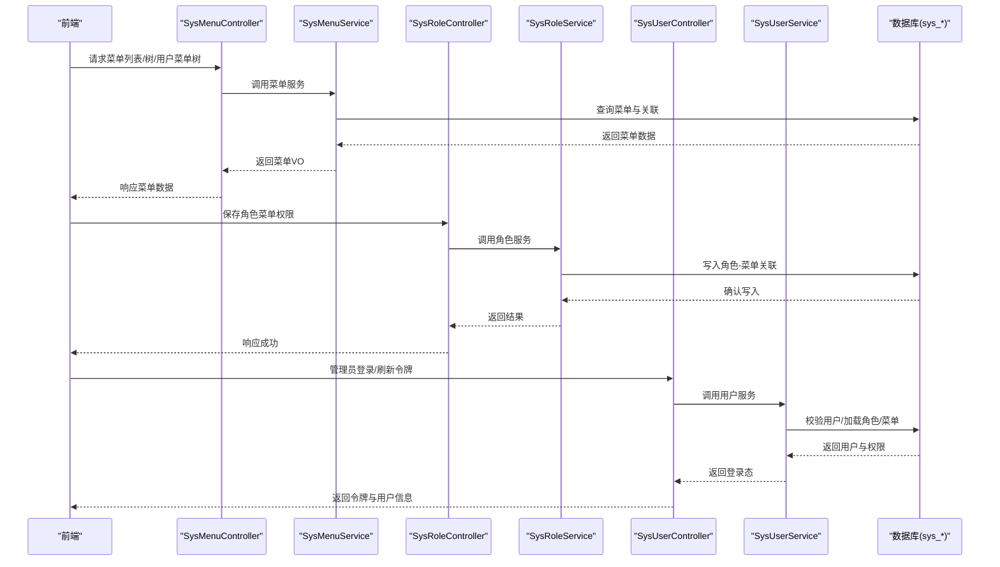
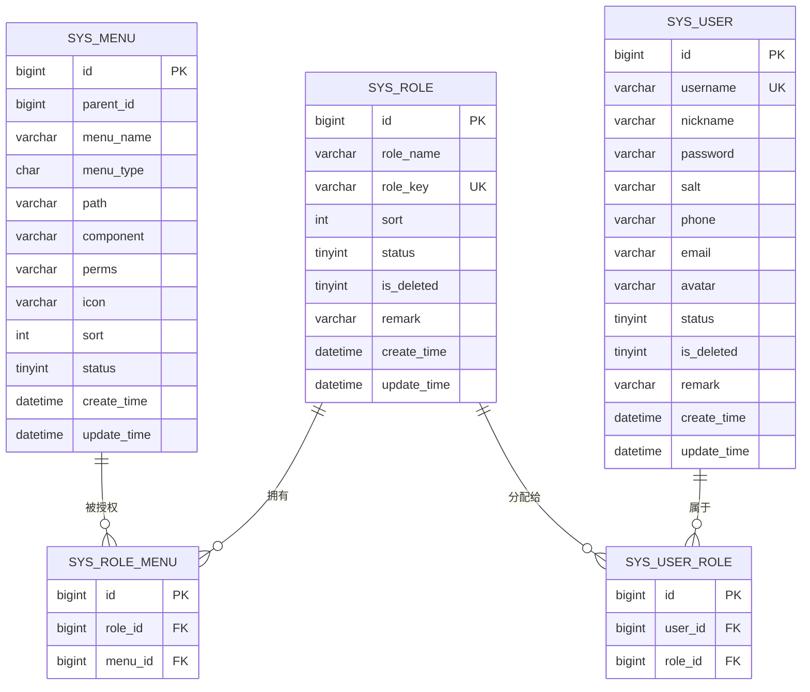
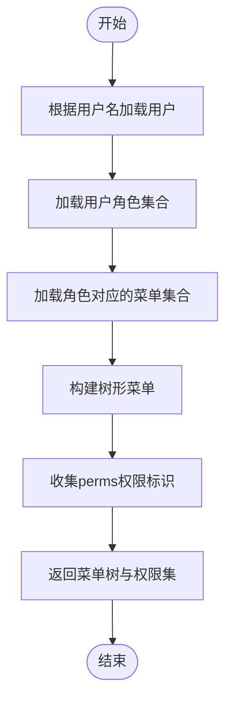
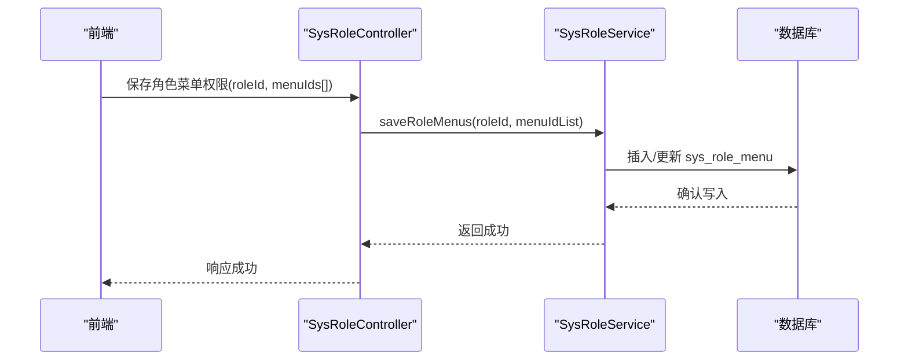
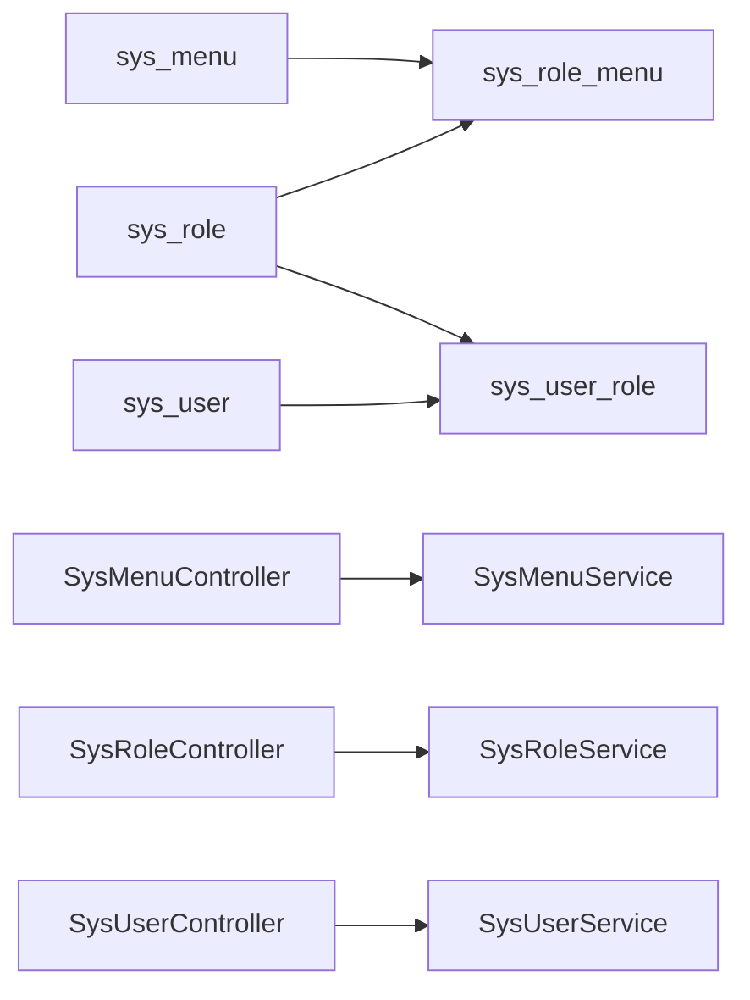

# 系统菜单表结构

<cite>
**本文引用的文件**
- [class_times_record.sql](file://class_times_record_back/docs/class_times_record.sql)
- [SysMenuController.java](file://admin-service/src/main/java/com/shiroko/controller/SysMenuController.java)
- [SysRoleController.java](file://admin-service/src/main/java/com/shiroko/controller/SysRoleController.java)
- [SysUserController.java](file://admin-service/src/main/java/com/shiroko/controller/SysUserController.java)
- [SysMenuService.java](file://common/src/main/java/com/shiroko/service/SysMenuService.java)
- [SysRoleService.java](file://common/src/main/java/com/shiroko/service/SysRoleService.java)
- [SysUserService.java](file://common/src/main/java/com/shiroko/service/SysUserService.java)
</cite>

## 目录
1. [简介](#简介)
2. [项目结构](#项目结构)
3. [核心组件](#核心组件)
4. [架构总览](#架构总览)
5. [详细组件分析](#详细组件分析)
6. [依赖关系分析](#依赖关系分析)
7. [性能考虑](#性能考虑)
8. [故障排查指南](#故障排查指南)
9. [结论](#结论)
10. [附录](#附录)

## 简介
本文件围绕后台管理系统的权限与菜单体系，系统化梳理以下数据模型与实现要点：
- 菜单表 sys_menu、角色表 sys_role、管理员表 sys_user 及其关联表 sys_role_menu、sys_user_role 的表结构设计
- 菜单层级结构设计（父子关系）、菜单类型区分（目录/菜单/按钮）与权限标识 perms 的管理方式
- RBAC 权限模型在用户-角色-菜单三层关联上的落地设计
- 管理员账户安全设计（密码加密存储建议、状态控制）与登录刷新流程的数据支撑
- 结合后端控制器与服务接口，说明菜单树构建、角色菜单授权、用户菜单渲染等关键流程

## 项目结构
本项目采用前后端分离与多服务拆分。与“系统菜单表结构”直接相关的数据库定义位于 SQL 脚本中；后端通过 admin-service 暴露菜单、角色、用户的 REST 接口，并通过 common 模块中的 Service 层提供业务编排能力。

图表来源
- [class_times_record.sql:319-406](file://class_times_record_back/docs/class_times_record.sql#L319-L406)
- [SysMenuController.java:21-58](file://admin-service/src/main/java/com/shiroko/controller/SysMenuController.java#L21-L58)
- [SysRoleController.java:21-68](file://admin-service/src/main/java/com/shiroko/controller/SysRoleController.java#L21-L68)
- [SysUserController.java:23-78](file://admin-service/src/main/java/com/shiroko/controller/SysUserController.java#L23-L78)
- [SysMenuService.java](file://common/src/main/java/com/shiroko/service/SysMenuService.java)
- [SysRoleService.java](file://common/src/main/java/com/shiroko/service/SysRoleService.java)
- [SysUserService.java](file://common/src/main/java/com/shiroko/service/SysUserService.java)

章节来源
- [class_times_record.sql:319-406](file://class_times_record_back/docs/class_times_record.sql#L319-L406)
- [SysMenuController.java:21-58](file://admin-service/src/main/java/com/shiroko/controller/SysMenuController.java#L21-L58)
- [SysRoleController.java:21-68](file://admin-service/src/main/java/com/shiroko/controller/SysRoleController.java#L21-L68)
- [SysUserController.java:23-78](file://admin-service/src/main/java/com/shiroko/controller/SysUserController.java#L23-L78)

## 核心组件
- sys_menu：后台菜单及权限表，支持多级菜单与按钮级权限点，包含路径、组件、图标、排序、显示状态以及权限标识 perms
- sys_role：角色信息表，包含角色名称、角色键、排序、状态、逻辑删除标记与备注
- sys_user：管理员用户表，包含账号、昵称、密码（建议使用 BCrypt）、盐值、联系方式、头像、状态、逻辑删除标记与备注
- sys_role_menu：角色与菜单的关联表，用于将菜单权限授予角色
- sys_user_role：管理员与角色的关联表，用于将角色分配给用户

上述五张表共同构成 RBAC 的核心数据模型，支撑“用户拥有角色，角色拥有菜单（含按钮权限）”的权限判定链路。

章节来源
- [class_times_record.sql:319-406](file://class_times_record_back/docs/class_times_record.sql#L319-L406)

## 架构总览
下图展示了 RBAC 在数据层与接口层的交互关系：前端通过菜单、角色、用户相关接口获取数据，后端服务读取并组装树形菜单、角色菜单集合、用户角色集合，最终返回给前端进行渲染与权限控制。

图表来源
- [SysMenuController.java:21-58](file://admin-service/src/main/java/com/shiroko/controller/SysMenuController.java#L21-L58)
- [SysRoleController.java:21-68](file://admin-service/src/main/java/com/shiroko/controller/SysRoleController.java#L21-L68)
- [SysUserController.java:23-78](file://admin-service/src/main/java/com/shiroko/controller/SysUserController.java#L23-L78)
- [SysMenuService.java](file://common/src/main/java/com/shiroko/service/SysMenuService.java)
- [SysRoleService.java](file://common/src/main/java/com/shiroko/service/SysRoleService.java)
- [SysUserService.java](file://common/src/main/java/com/shiroko/service/SysUserService.java)
- [class_times_record.sql:319-406](file://class_times_record_back/docs/class_times_record.sql#L319-L406)

## 详细组件分析

### 数据模型与字段说明
- sys_menu（菜单表）
  - 主键 id，父节点 parent_id（0 表示顶级）
  - 菜单名称 menu_name、类型 menu_type（M:目录/C:菜单/F:按钮或权限点）
  - 路由 path、组件 component、权限标识 perms
  - 图标 icon、排序 sort、显示状态 status
  - 时间戳 create_time、update_time
- sys_role（角色表）
  - 主键 id、角色名称 role_name、角色键 role_key（唯一索引）
  - 排序 sort、状态 status、逻辑删除 is_deleted、备注 remark
  - 时间戳 create_time、update_time
- sys_user（管理员表）
  - 主键 id、登录账号 username（唯一索引）、昵称 nickname
  - 密码 password（建议使用 BCrypt）、盐 salt
  - 联系方式 phone/email、头像 avatar
  - 状态 status、逻辑删除 is_deleted、备注 remark
  - 时间戳 create_time、update_time
- sys_role_menu（角色-菜单关联）
  - 主键 id、role_id、menu_id，外键分别指向 sys_role.id 与 sys_menu.id
- sys_user_role（用户-角色关联）
  - 主键 id、user_id、role_id，外键分别指向 sys_user.id 与 sys_role.id

图表来源
- [class_times_record.sql:319-406](file://class_times_record_back/docs/class_times_record.sql#L319-L406)

章节来源
- [class_times_record.sql:319-406](file://class_times_record_back/docs/class_times_record.sql#L319-L406)

### 菜单层级结构与类型设计
- 层级结构
  - 使用 parent_id 自引用实现多级菜单，parent_id=0 为顶级菜单
  - 前端可通过递归或树形算法将扁平菜单转换为树形结构
- 菜单类型
  - M：目录，通常作为分组容器，不直接对应页面
  - C：菜单，对应具体页面路由
  - F：按钮/权限点，用于细粒度操作控制（如新增、编辑、删除）
- 权限标识
  - perms 字段用于承载权限字符串（如 schedule:adjust），配合后端注解或拦截器进行方法级权限校验
  - 前端可依据 perms 控制按钮显隐与点击行为

章节来源
- [class_times_record.sql:319-336](file://class_times_record_back/docs/class_times_record.sql#L319-L336)

### RBAC 权限模型实现
- 用户-角色-菜单三层关联
  - sys_user_role 将用户与角色绑定
  - sys_role_menu 将角色与菜单绑定
  - 通过用户 ID 可下钻到其所有角色，再聚合得到该用户的所有菜单与按钮权限
- 典型流程
  - 登录时根据用户名加载用户与其角色，进一步拉取角色对应的菜单树与权限标识集合
  - 前端基于菜单树渲染导航，基于 perms 控制按钮可见性与可用性
  - 后端在需要的方法上校验 perms，拒绝未授权访问

图表来源
- [SysMenuController.java:21-58](file://admin-service/src/main/java/com/shiroko/controller/SysMenuController.java#L21-L58)
- [SysRoleController.java:21-68](file://admin-service/src/main/java/com/shiroko/controller/SysRoleController.java#L21-L68)
- [SysUserController.java:23-78](file://admin-service/src/main/java/com/shiroko/controller/SysUserController.java#L23-L78)
- [class_times_record.sql:319-406](file://class_times_record_back/docs/class_times_record.sql#L319-L406)

章节来源
- [SysMenuController.java:21-58](file://admin-service/src/main/java/com/shiroko/controller/SysMenuController.java#L21-L58)
- [SysRoleController.java:21-68](file://admin-service/src/main/java/com/shiroko/controller/SysRoleController.java#L21-L68)
- [SysUserController.java:23-78](file://admin-service/src/main/java/com/shiroko/controller/SysUserController.java#L23-L78)
- [class_times_record.sql:319-406](file://class_times_record_back/docs/class_times_record.sql#L319-L406)

### 管理员账户安全设计与状态管理
- 密码存储
  - sys_user.password 字段注释建议使用 BCrypt 加密，避免明文存储
  - 同时保留 salt 字段以兼容历史方案或特定场景
- 状态控制
  - sys_user.status 控制账号启用/停用
  - sys_user.is_deleted 用于逻辑删除，便于审计与恢复
- 登录与刷新
  - SysUserController 提供登录与刷新令牌接口，供认证流程使用
  - 刷新令牌接口可用于无感续期，提升用户体验

章节来源
- [class_times_record.sql:372-391](file://class_times_record_back/docs/class_times_record.sql#L372-L391)
- [SysUserController.java:30-77](file://admin-service/src/main/java/com/shiroko/controller/SysUserController.java#L30-L77)

### 菜单与角色授权流程
- 菜单管理
  - 提供菜单列表、树形结构、用户菜单树、增删改查等接口
- 角色菜单授权
  - 提供获取角色已授权菜单与批量保存角色菜单权限的接口
  - 保存时将前端传入的菜单 ID 列表持久化至 sys_role_menu

图表来源
- [SysRoleController.java:54-67](file://admin-service/src/main/java/com/shiroko/controller/SysRoleController.java#L54-L67)
- [SysRoleService.java](file://common/src/main/java/com/shiroko/service/SysRoleService.java)
- [class_times_record.sql:357-369](file://class_times_record_back/docs/class_times_record.sql#L357-L369)

章节来源
- [SysRoleController.java:54-67](file://admin-service/src/main/java/com/shiroko/controller/SysRoleController.java#L54-L67)
- [SysRoleService.java](file://common/src/main/java/com/shiroko/service/SysRoleService.java)
- [class_times_record.sql:357-369](file://class_times_record_back/docs/class_times_record.sql#L357-L369)

## 依赖关系分析
- 表间依赖
  - sys_role_menu.role_id -> sys_role.id
  - sys_role_menu.menu_id -> sys_menu.id
  - sys_user_role.user_id -> sys_user.id
  - sys_user_role.role_id -> sys_role.id
- 接口依赖
  - SysMenuController 依赖 SysMenuService
  - SysRoleController 依赖 SysRoleService
  - SysUserController 依赖 SysUserService
- 潜在风险
  - 若未对 sys_role_menu 与 sys_user_role 建立合适索引，频繁查询可能影响性能
  - 菜单树构建与权限集合合并应在服务层缓存，避免每次请求重复计算

图表来源
- [class_times_record.sql:319-406](file://class_times_record_back/docs/class_times_record.sql#L319-L406)
- [SysMenuController.java:21-58](file://admin-service/src/main/java/com/shiroko/controller/SysMenuController.java#L21-L58)
- [SysRoleController.java:21-68](file://admin-service/src/main/java/com/shiroko/controller/SysRoleController.java#L21-L68)
- [SysUserController.java:23-78](file://admin-service/src/main/java/com/shiroko/controller/SysUserController.java#L23-L78)

章节来源
- [class_times_record.sql:319-406](file://class_times_record_back/docs/class_times_record.sql#L319-L406)
- [SysMenuController.java:21-58](file://admin-service/src/main/java/com/shiroko/controller/SysMenuController.java#L21-L58)
- [SysRoleController.java:21-68](file://admin-service/src/main/java/com/shiroko/controller/SysRoleController.java#L21-L68)
- [SysUserController.java:23-78](file://admin-service/src/main/java/com/shiroko/controller/SysUserController.java#L23-L78)

## 性能考虑
- 索引优化
  - sys_role_menu 与 sys_user_role 已具备 role_id/menu_id/user_id 索引，有利于按角色或用户快速检索
- 查询优化
  - 菜单树构建建议在服务层进行一次性组装，必要时引入缓存（如 Redis）降低数据库压力
  - 用户菜单树可按用户维度缓存，减少重复计算
- 事务与一致性
  - 批量保存角色菜单权限应使用事务保证一致性，避免部分写入导致数据不一致

[本节为通用指导，无需代码来源]

## 故障排查指南
- 菜单无法显示
  - 检查 sys_menu.status 是否为显示状态
  - 确认当前用户是否拥有对应角色，且角色已授权该菜单
- 按钮不可用
  - 检查菜单 perms 是否正确配置
  - 确认后端方法是否进行 perms 校验，前端是否根据 perms 控制按钮
- 角色菜单授权失败
  - 检查 sys_role_menu 写入是否成功
  - 确认前端传递的 menuIds 是否为有效菜单 ID
- 登录异常
  - 检查 sys_user.status 与 is_deleted 状态
  - 核对密码加密策略是否与 BCrypt 一致

章节来源
- [SysMenuController.java:21-58](file://admin-service/src/main/java/com/shiroko/controller/SysMenuController.java#L21-L58)
- [SysRoleController.java:21-68](file://admin-service/src/main/java/com/shiroko/controller/SysRoleController.java#L21-L68)
- [SysUserController.java:23-78](file://admin-service/src/main/java/com/shiroko/controller/SysUserController.java#L23-L78)
- [class_times_record.sql:319-406](file://class_times_record_back/docs/class_times_record.sql#L319-L406)

## 结论
本项目的 RBAC 权限模型通过 sys_user、sys_role、sys_menu 三张核心表与 sys_user_role、sys_role_menu 两张关联表完整落地，实现了从用户到角色再到菜单（含按钮权限）的清晰授权链路。配合菜单层级结构与 perms 标识，既能满足复杂的前端导航与按钮级控制，也能在后端进行细粒度的方法级鉴权。建议在服务层引入缓存与统一的事务边界，进一步提升性能与一致性。

[本节为总结性内容，无需代码来源]

## 附录
- 术语说明
  - 目录：用于组织菜单结构的容器节点
  - 菜单：对应具体页面的路由节点
  - 按钮/权限点：最小粒度的操作权限标识
- 最佳实践
  - 菜单命名规范：保持语义清晰，便于维护
  - 权限标识规范：采用“模块:操作”形式，避免冲突
  - 状态管理：启用/停用与逻辑删除配合，确保可审计

[本节为概念性内容，无需代码来源]