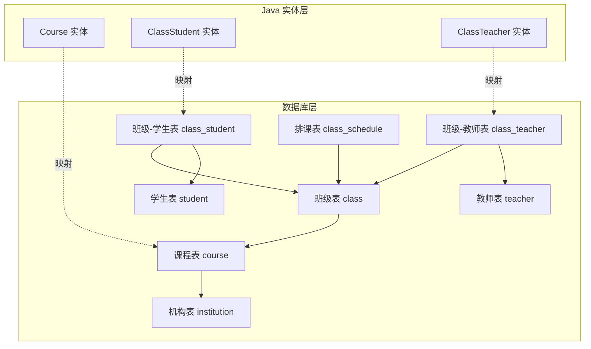
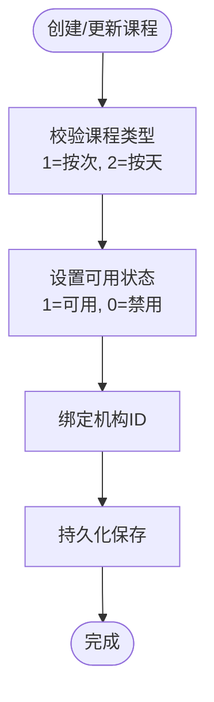
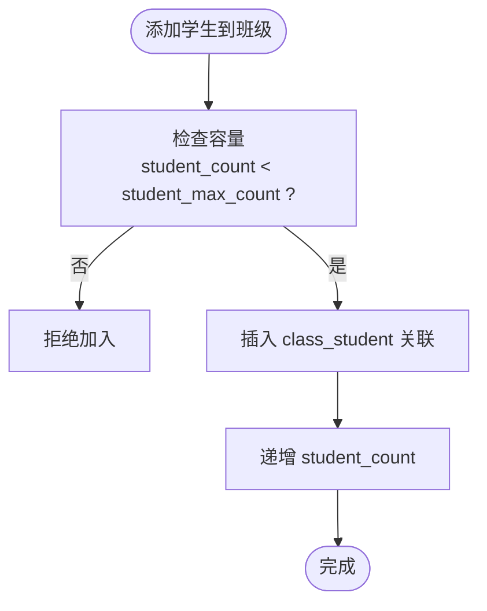
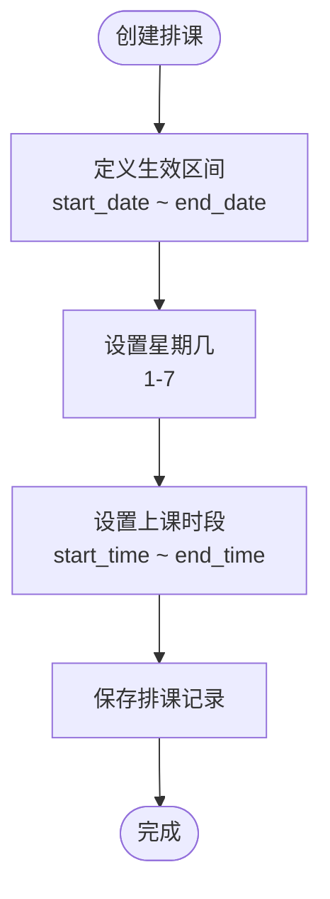
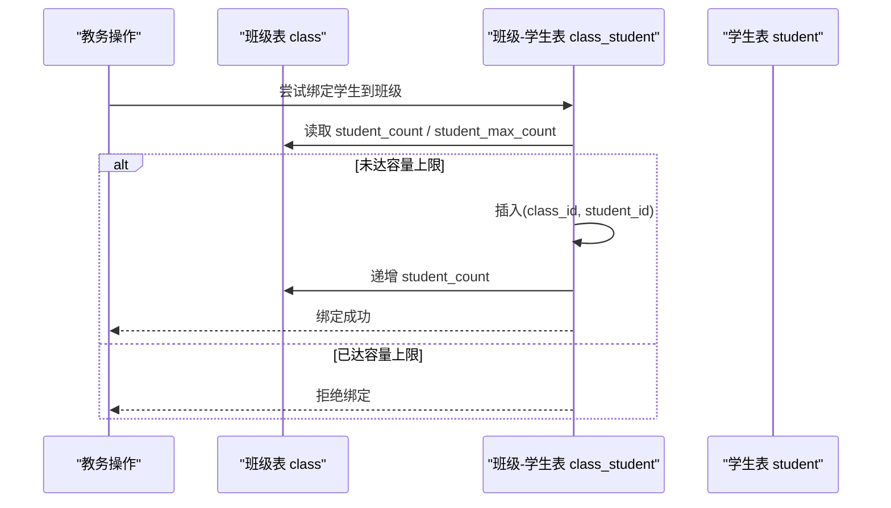
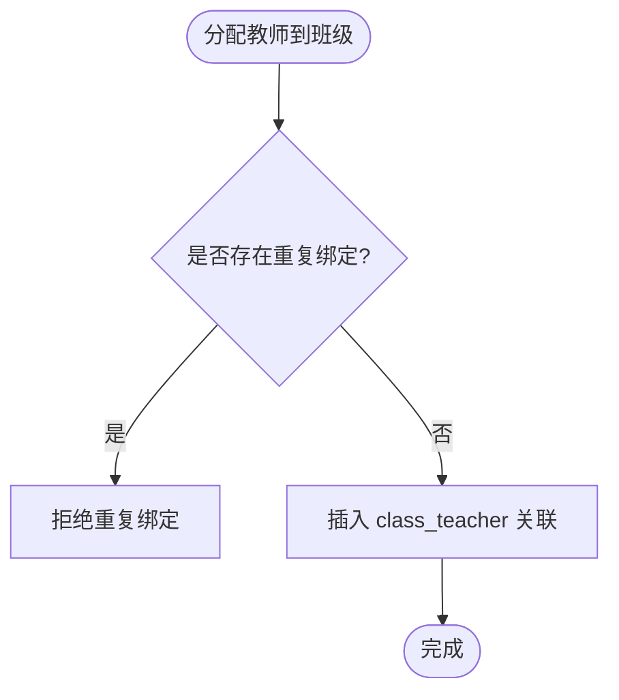
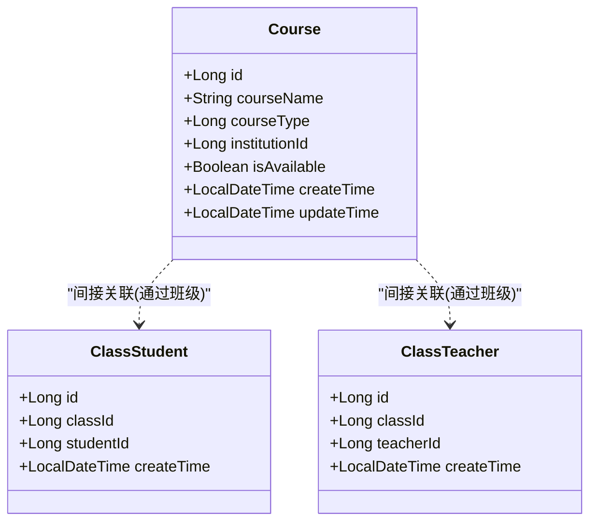
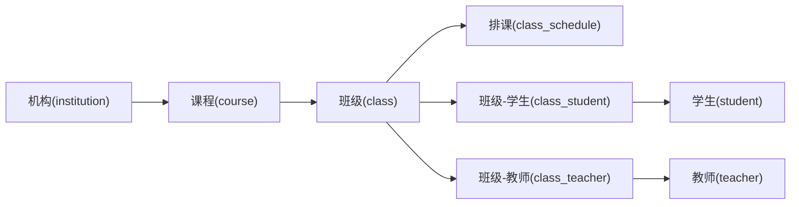

# 课程班级表结构

<cite>
**本文引用的文件**   
- [class_times_record.sql](file://class_times_record_back/docs/class_times_record.sql)
- [Course.java](file://class_times_record_back/common/src/main/java/com/shiroko/repository/entity/Course.java)
- [ClassStudent.java](file://class_times_record_back/common/src/main/java/com/shiroko/repository/entity/ClassStudent.java)
- [ClassTeacher.java](file://class_times_record_back/common/src/main/java/com/shiroko/repository/entity/ClassTeacher.java)
</cite>

## 目录
1. [简介](#简介)
2. [项目结构](#项目结构)
3. [核心组件](#核心组件)
4. [架构总览](#架构总览)
5. [详细组件分析](#详细组件分析)
6. [依赖关系分析](#依赖关系分析)
7. [性能考虑](#性能考虑)
8. [故障排查指南](#故障排查指南)
9. [结论](#结论)
10. [附录](#附录)

## 简介
本文件聚焦于“课程-班级”基础数据模型与排课系统的数据结构设计，围绕以下目标展开：
- 课程管理表（course）的字段、类型与状态设计
- 班级管理表（class）及其容量控制、状态管理与从属关系
- 课程类型设计（按次/按天）及可用状态管理
- 课程与机构的关联关系
- 班级-学生（class_student）、班级-教师（class_teacher）的多对多关系设计
- 排课相关的基础表（class_schedule）与扩展性建议

## 项目结构
与本课程班级表结构相关的核心内容来源于数据库脚本与实体类定义：
- 数据库脚本：包含课程、班级、排课、学生、教师等表的建表语句与约束
- Java 实体：对应课程、班级-学生、班级-教师的实体映射



图表来源
- [class_times_record.sql:108-122](file://class_times_record_back/docs/class_times_record.sql#L108-L122)
- [class_times_record.sql:39-53](file://class_times_record_back/docs/class_times_record.sql#L39-L53)
- [class_times_record.sql:78-89](file://class_times_record_back/docs/class_times_record.sql#L78-L89)
- [class_times_record.sql:94-105](file://class_times_record_back/docs/class_times_record.sql#L94-L105)
- [class_times_record.sql:58-73](file://class_times_record_back/docs/class_times_record.sql#L58-L73)
- [class_times_record.sql:169-179](file://class_times_record_back/docs/class_times_record.sql#L169-L179)
- [class_times_record.sql:299-316](file://class_times_record_back/docs/class_times_record.sql#L299-L316)
- [class_times_record.sql:409-424](file://class_times_record_back/docs/class_times_record.sql#L409-L424)
- [Course.java:20-59](file://class_times_record_back/common/src/main/java/com/shiroko/repository/entity/Course.java#L20-L59)
- [ClassStudent.java:20-52](file://class_times_record_back/common/src/main/java/com/shiroko/repository/entity/ClassStudent.java#L20-L52)
- [ClassTeacher.java:20-43](file://class_times_record_back/common/src/main/java/com/shiroko/repository/entity/ClassTeacher.java#L20-L43)

章节来源
- [class_times_record.sql:108-122](file://class_times_record_back/docs/class_times_record.sql#L108-L122)
- [class_times_record.sql:39-53](file://class_times_record_back/docs/class_times_record.sql#L39-L53)
- [class_times_record.sql:78-89](file://class_times_record_back/docs/class_times_record.sql#L78-L89)
- [class_times_record.sql:94-105](file://class_times_record_back/docs/class_times_record.sql#L94-L105)
- [class_times_record.sql:58-73](file://class_times_record_back/docs/class_times_record.sql#L58-L73)
- [Course.java:20-59](file://class_times_record_back/common/src/main/java/com/shiroko/repository/entity/Course.java#L20-L59)
- [ClassStudent.java:20-52](file://class_times_record_back/common/src/main/java/com/shiroko/repository/entity/ClassStudent.java#L20-L52)
- [ClassTeacher.java:20-43](file://class_times_record_back/common/src/main/java/com/shiroko/repository/entity/ClassTeacher.java#L20-L43)

## 核心组件
本节概述课程、班级、排课以及多对多关联的核心设计与要点。

- 课程表（course）
  - 关键字段：课程名称、课程类型（按次/按天）、所属机构、是否可用、时间戳
  - 课程类型：用于区分计费或统计维度（按次 vs 按天）
  - 可用状态：控制课程在业务层面的可见性与可报名性
  - 机构关联：通过外键关联到机构表，实现多机构隔离

- 班级表（class）
  - 关键字段：所属课程、班级名称、当前人数、最大人数、状态、逻辑删除标记、时间戳
  - 容量控制：通过“当前人数”和“最大人数”进行限制
  - 状态管理：进行中/已结束等状态驱动业务流程
  - 从属关系：每个班级属于一个课程

- 排课表（class_schedule）
  - 关键字段：所属班级、时间段起止日期、星期几、开始/结束时间、备注
  - 用途：描述班级的周期性上课安排

- 多对多关联
  - 班级-学生（class_student）：记录学生与班级的绑定关系
  - 班级-教师（class_teacher）：记录教师与班级的绑定关系

章节来源
- [class_times_record.sql:108-122](file://class_times_record_back/docs/class_times_record.sql#L108-L122)
- [class_times_record.sql:39-53](file://class_times_record_back/docs/class_times_record.sql#L39-L53)
- [class_times_record.sql:58-73](file://class_times_record_back/docs/class_times_record.sql#L58-L73)
- [class_times_record.sql:78-89](file://class_times_record_back/docs/class_times_record.sql#L78-L89)
- [class_times_record.sql:94-105](file://class_times_record_back/docs/class_times_record.sql#L94-L105)

## 架构总览
下图展示了课程、班级、排课与多对多关联的整体关系，并标注了关键的外键约束与索引。

```mermaid
erDiagram
COURSE {
int id PK
varchar course_name
tinyint course_type
int institution_id FK
tinyint is_available
datetime create_time
datetime update_time
}
CLASS {
int id PK
int course_id FK
varchar class_name
int student_count
int student_max_count
tinyint status
tinyint isDelete
datetime create_time
datetime update_time
}
CLASS_SCHEDULE {
int id PK
int class_id FK
date start_date
date end_date
tinyint day_of_week
time start_time
time end_time
varchar remark
datetime create_time
datetime update_time
}
CLASS_STUDENT {
int id PK
int class_id FK
int student_id FK
datetime create_time
}
CLASS_TEACHER {
int id PK
int class_id FK
int teacher_id FK
datetime create_time
}
INSTITUTION {
int id PK
varchar institution_name
varchar institution_address
tinyint status
varchar institution_code
datetime create_time
datetime update_time
}
STUDENT {
int id PK
varchar avatar
varchar student_name
int institution_id FK
tinyint sex
date birth
varchar school
varchar address
datetime create_time
datetime update_time
}
TEACHER {
int id PK
int institution_id FK
int user_id FK
tinyint is_available
varchar username
varchar phone
}
COURSE ||--o{ CLASS : "一个课程有多个班级"
CLASS ||--o{ CLASS_SCHEDULE : "一个班级有多条排课"
CLASS ||--o{ CLASS_STUDENT : "一个班级有多个学生"
CLASS ||--o{ CLASS_TEACHER : "一个班级有多个教师"
COURSE }o--|| INSTITUTION : "课程归属机构"
CLASS_STUDENT }o--|| STUDENT : "学生参与班级"
CLASS_TEACHER }o--|| TEACHER : "教师授课班级"
```

图表来源
- [class_times_record.sql:108-122](file://class_times_record_back/docs/class_times_record.sql#L108-L122)
- [class_times_record.sql:39-53](file://class_times_record_back/docs/class_times_record.sql#L39-L53)
- [class_times_record.sql:58-73](file://class_times_record_back/docs/class_times_record.sql#L58-L73)
- [class_times_record.sql:78-89](file://class_times_record_back/docs/class_times_record.sql#L78-L89)
- [class_times_record.sql:94-105](file://class_times_record_back/docs/class_times_record.sql#L94-L105)
- [class_times_record.sql:169-179](file://class_times_record_back/docs/class_times_record.sql#L169-L179)
- [class_times_record.sql:299-316](file://class_times_record_back/docs/class_times_record.sql#L299-L316)
- [class_times_record.sql:409-424](file://class_times_record_back/docs/class_times_record.sql#L409-L424)

## 详细组件分析

### 课程表（course）设计解析
- 课程类型（course_type）
  - 取值说明：1=按次；2=按天
  - 业务含义：决定课时消耗、续费与统计口径
- 可用状态（is_available）
  - 取值说明：1=可用；0=禁用
  - 业务含义：控制课程在前端展示与报名流程中的可用性
- 机构关联（institution_id）
  - 通过外键关联机构表，实现多租户/多机构数据隔离
- 索引与约束
  - 针对 institution_id 建立索引，提升按机构查询效率
  - 外键约束保证课程与机构的强一致性



图表来源
- [class_times_record.sql:108-122](file://class_times_record_back/docs/class_times_record.sql#L108-L122)
- [Course.java:20-59](file://class_times_record_back/common/src/main/java/com/shiroko/repository/entity/Course.java#L20-L59)

章节来源
- [class_times_record.sql:108-122](file://class_times_record_back/docs/class_times_record.sql#L108-L122)
- [Course.java:20-59](file://class_times_record_back/common/src/main/java/com/shiroko/repository/entity/Course.java#L20-L59)

### 班级表（class）设计解析
- 从属关系
  - 通过 course_id 外键指向课程表，表示“班级属于课程”
- 容量控制
  - student_count：当前已报名人数
  - student_max_count：最大容量上限
  - 新增学生时需在应用层校验 student_count < student_max_count
- 状态管理
  - status：1=正在进行；2=已结束
  - 结合排课与记录，驱动报名、签到、消课等业务
- 逻辑删除
  - isDelete：软删除标记，便于审计与恢复
- 索引与约束
  - 针对 course_id 建立索引，提升按课程查询班级列表的效率



图表来源
- [class_times_record.sql:39-53](file://class_times_record_back/docs/class_times_record.sql#L39-L53)
- [class_times_record.sql:78-89](file://class_times_record_back/docs/class_times_record.sql#L78-L89)

章节来源
- [class_times_record.sql:39-53](file://class_times_record_back/docs/class_times_record.sql#L39-L53)
- [class_times_record.sql:78-89](file://class_times_record_back/docs/class_times_record.sql#L78-L89)

### 排课表（class_schedule）设计解析
- 周期排课
  - start_date/end_date：排课生效的时间区间
  - day_of_week：星期几（1-7）
  - start_time/end_time：具体上课时段
- 备注信息
  - remark：用于补充说明（如教室、特殊安排）
- 索引与约束
  - 针对 class_id 建立索引，提升按班级查询排课的效率



图表来源
- [class_times_record.sql:58-73](file://class_times_record_back/docs/class_times_record.sql#L58-L73)

章节来源
- [class_times_record.sql:58-73](file://class_times_record_back/docs/class_times_record.sql#L58-L73)

### 多对多关联：班级-学生（class_student）
- 设计要点
  - 唯一约束：(class_id, student_id) 防止重复绑定
  - 外键约束：确保班级与学生存在性
  - 索引：对 student_id 建立索引，便于按学生查询其所在班级
- 容量联动
  - 插入关联后需同步增加班级 student_count



图表来源
- [class_times_record.sql:78-89](file://class_times_record_back/docs/class_times_record.sql#L78-89)
- [class_times_record.sql:39-53](file://class_times_record_back/docs/class_times_record.sql#L39-L53)
- [class_times_record.sql:299-316](file://class_times_record_back/docs/class_times_record.sql#L299-L316)

章节来源
- [class_times_record.sql:78-89](file://class_times_record_back/docs/class_times_record.sql#L78-89)
- [class_times_record.sql:39-53](file://class_times_record_back/docs/class_times_record.sql#L39-L53)
- [class_times_record.sql:299-316](file://class_times_record_back/docs/class_times_record.sql#L299-L316)

### 多对多关联：班级-教师（class_teacher）
- 设计要点
  - 唯一约束：(class_id, teacher_id) 防止重复绑定
  - 外键约束：确保班级与教师存在性
  - 索引：对 teacher_id 建立索引，便于按教师查询其授课班级
- 业务意义
  - 支持一师多班、一班多师的灵活排课场景



图表来源
- [class_times_record.sql:94-105](file://class_times_record_back/docs/class_times_record.sql#L94-L105)
- [class_times_record.sql:409-424](file://class_times_record_back/docs/class_times_record.sql#L409-L424)

章节来源
- [class_times_record.sql:94-105](file://class_times_record_back/docs/class_times_record.sql#L94-L105)
- [class_times_record.sql:409-424](file://class_times_record_back/docs/class_times_record.sql#L409-L424)

### Java 实体映射对照
- Course 实体
  - 字段：id、courseName、courseType、institutionId、isAvailable、createTime、updateTime
  - 表名映射：c_course（注意与 SQL 中表名差异，以实际部署为准）
- ClassStudent 实体
  - 字段：id、classId、studentId、createTime
  - 表名映射：c_class_student
- ClassTeacher 实体
  - 字段：id、classId、teacherId、createTime
  - 表名映射：c_class_teacher



图表来源
- [Course.java:20-59](file://class_times_record_back/common/src/main/java/com/shiroko/repository/entity/Course.java#L20-L59)
- [ClassStudent.java:20-52](file://class_times_record_back/common/src/main/java/com/shiroko/repository/entity/ClassStudent.java#L20-L52)
- [ClassTeacher.java:20-43](file://class_times_record_back/common/src/main/java/com/shiroko/repository/entity/ClassTeacher.java#L20-L43)

章节来源
- [Course.java:20-59](file://class_times_record_back/common/src/main/java/com/shiroko/repository/entity/Course.java#L20-L59)
- [ClassStudent.java:20-52](file://class_times_record_back/common/src/main/java/com/shiroko/repository/entity/ClassStudent.java#L20-L52)
- [ClassTeacher.java:20-43](file://class_times_record_back/common/src/main/java/com/shiroko/repository/entity/ClassTeacher.java#L20-L43)

## 依赖关系分析
- 外键依赖
  - course.institution_id -> institution.id
  - class.course_id -> course.id
  - class_schedule.class_id -> class.id
  - class_student.class_id -> class.id
  - class_student.student_id -> student.id
  - class_teacher.class_id -> class.id
  - class_teacher.teacher_id -> teacher.id
- 索引优化
  - course.institution_id
  - class.course_id
  - class_schedule.class_id
  - class_student.student_id
  - class_teacher.teacher_id
- 耦合与内聚
  - 课程与机构为强耦合（外键），保障数据一致性
  - 班级与课程为强耦合，班级与排课为强耦合
  - 多对多通过中间表解耦，保持高内聚低耦合



图表来源
- [class_times_record.sql:108-122](file://class_times_record_back/docs/class_times_record.sql#L108-L122)
- [class_times_record.sql:39-53](file://class_times_record_back/docs/class_times_record.sql#L39-L53)
- [class_times_record.sql:58-73](file://class_times_record_back/docs/class_times_record.sql#L58-L73)
- [class_times_record.sql:78-89](file://class_times_record_back/docs/class_times_record.sql#L78-L89)
- [class_times_record.sql:94-105](file://class_times_record_back/docs/class_times_record.sql#L94-L105)
- [class_times_record.sql:169-179](file://class_times_record_back/docs/class_times_record.sql#L169-L179)
- [class_times_record.sql:299-316](file://class_times_record_back/docs/class_times_record.sql#L299-L316)
- [class_times_record.sql:409-424](file://class_times_record_back/docs/class_times_record.sql#L409-L424)

章节来源
- [class_times_record.sql:108-122](file://class_times_record_back/docs/class_times_record.sql#L108-L122)
- [class_times_record.sql:39-53](file://class_times_record_back/docs/class_times_record.sql#L39-L53)
- [class_times_record.sql:58-73](file://class_times_record_back/docs/class_times_record.sql#L58-L73)
- [class_times_record.sql:78-89](file://class_times_record_back/docs/class_times_record.sql#L78-L89)
- [class_times_record.sql:94-105](file://class_times_record_back/docs/class_times_record.sql#L94-L105)
- [class_times_record.sql:169-179](file://class_times_record_back/docs/class_times_record.sql#L169-L179)
- [class_times_record.sql:299-316](file://class_times_record_back/docs/class_times_record.sql#L299-L316)
- [class_times_record.sql:409-424](file://class_times_record_back/docs/class_times_record.sql#L409-L424)

## 性能考虑
- 索引策略
  - 高频查询列均建立索引：course.institution_id、class.course_id、class_schedule.class_id、class_student.student_id、class_teacher.teacher_id
- 容量校验
  - 建议在事务中进行“读取容量-插入关联-递增计数”的原子操作，避免并发超卖
- 排课查询
  - 基于 class_id 的查询已具备索引；若频繁按日期范围查询，可考虑在 start_date/end_date 上建立复合索引
- 软删除
  - isDelete 字段配合查询条件过滤，避免物理删除带来的级联风险

[本节为通用性能建议，不直接分析具体文件]

## 故障排查指南
- 容量超限
  - 现象：无法将学生加入班级
  - 排查：检查 class.student_count 与 student_max_count 的值，确认是否有并发写入导致不一致
- 重复绑定
  - 现象：插入 class_student/class_teacher 失败
  - 排查：检查唯一约束 (class_id, student_id)/(class_id, teacher_id) 是否冲突
- 外键约束失败
  - 现象：插入/更新时报外键错误
  - 排查：确认被引用的 course/institution/student/teacher 记录是否存在
- 排课冲突
  - 现象：同一班级在同一时间段出现多条排课
  - 排查：可在应用层增加“同班级+同日+时间重叠”的冲突检测逻辑

章节来源
- [class_times_record.sql:39-53](file://class_times_record_back/docs/class_times_record.sql#L39-L53)
- [class_times_record.sql:78-89](file://class_times_record_back/docs/class_times_record.sql#L78-L89)
- [class_times_record.sql:94-105](file://class_times_record_back/docs/class_times_record.sql#L94-L105)
- [class_times_record.sql:58-73](file://class_times_record_back/docs/class_times_record.sql#L58-L73)

## 结论
该数据模型以课程为核心，通过班级组织教学单元，并以排课表支撑周期性上课安排。课程类型与可用状态满足按次/按天的计费与展示需求；班级容量控制与状态管理保障了教学资源的合理分配；多对多关联表清晰表达了班级-学生、班级-教师的关系。整体结构具备良好的可扩展性，适合进一步扩展至更多业务场景（如教室资源、跨机构共享等）。

[本节为总结性内容，不直接分析具体文件]

## 附录
- 术语说明
  - 按次：以课时次数为计量单位
  - 按天：以天数为单位计量
  - 软删除：使用标志位标记删除，保留历史数据
- 扩展建议
  - 增加“教室/场地”表并与排课关联，支持资源冲突检测
  - 增加“教师能力标签/科目”表，辅助智能排课
  - 引入“班级批次/期数”概念，支持同一课程多期开班

[本节为概念性内容，不直接分析具体文件]