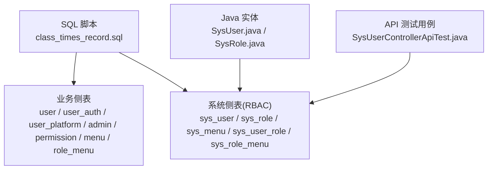
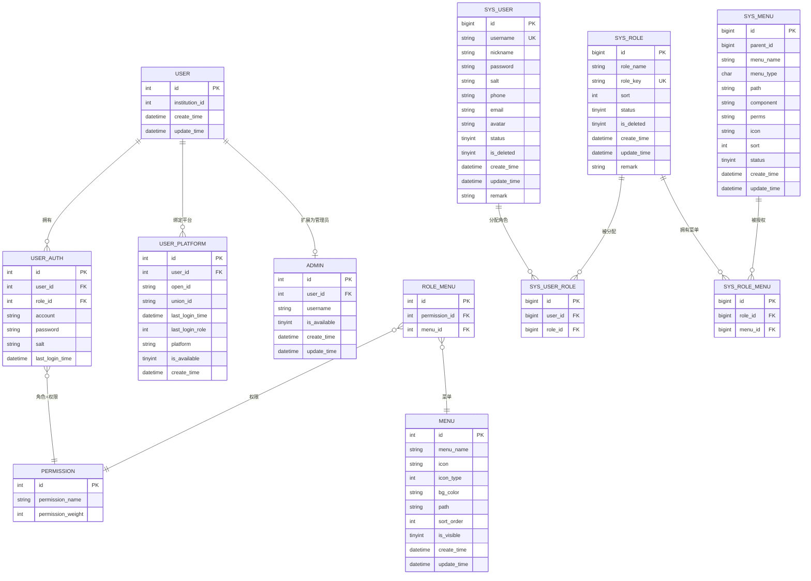
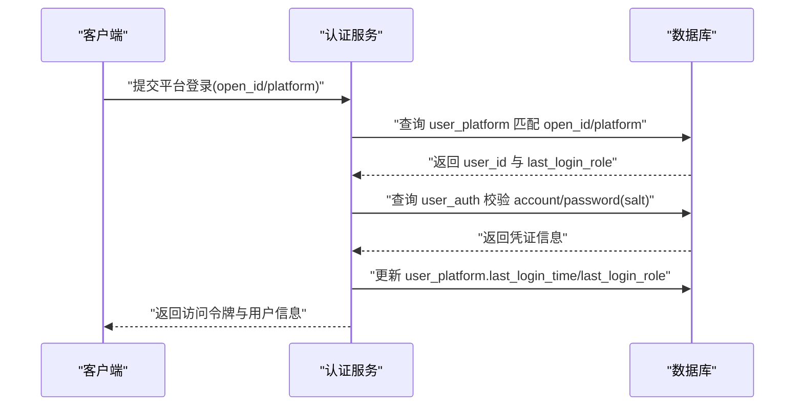
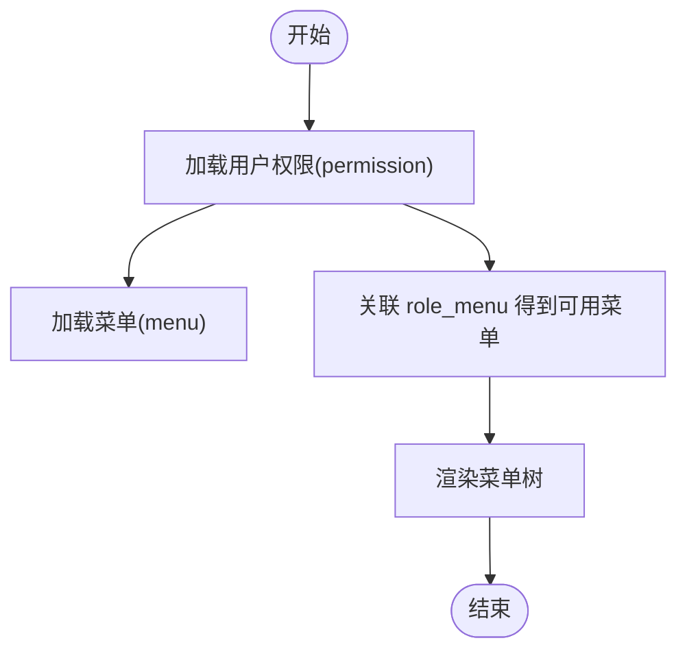
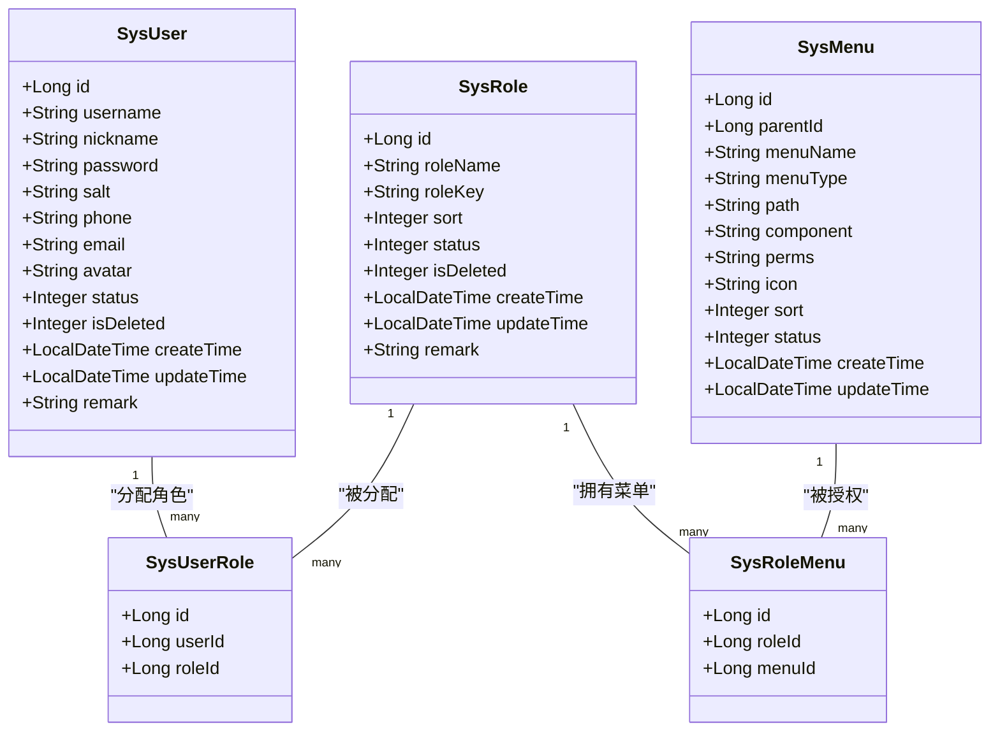
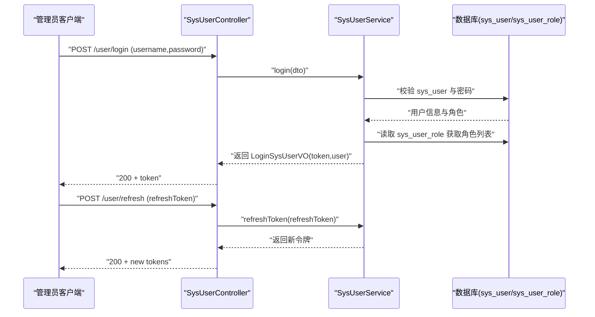
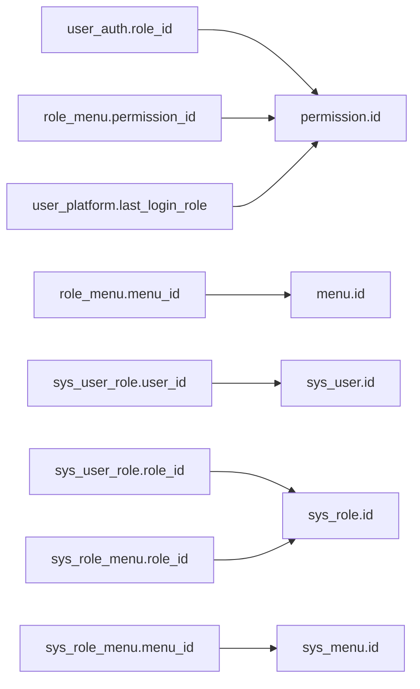

# 系统管理表结构

<cite>
**本文引用的文件**
- [class_times_record.sql](file://class_times_record_back/docs/class_times_record.sql)
- [SysUser.java](file://common/src/main/java/com/shiroko/repository/entity/SysUser.java)
- [SysRole.java](file://common/src/main/java/com/shiroko/repository/entity/SysRole.java)
- [SysUserControllerApiTest.java](file://admin-service/src/test/java/com/shiroko/controller/SysUserControllerApiTest.java)
</cite>

## 目录
1. [简介](#简介)
2. [项目结构](#项目结构)
3. [核心组件](#核心组件)
4. [架构总览](#架构总览)
5. [详细组件分析](#详细组件分析)
6. [依赖关系分析](#依赖关系分析)
7. [性能考虑](#性能考虑)
8. [故障排查指南](#故障排查指南)
9. [结论](#结论)
10. [附录](#附录)

## 简介
本文件聚焦于系统管理相关的数据库表结构设计，覆盖用户体系（user、user_auth、user_platform）、管理员体系（admin）、权限与菜单（permission、menu、role_menu）以及后台管理系统 RBAC 模型（sys_user、sys_role、sys_menu、sys_user_role、sys_role_menu）。文档将深入解析：
- 用户认证授权机制的表设计
- 角色权限模型与菜单权限控制
- 平台登录管理与多端统一账号
- RBAC 权限模型的实现方式与数据模型
- 用户会话管理与状态跟踪的表设计思路
- 系统配置与审计日志的数据存储方案建议
- 为系统管理员提供权限管理的数据库设计参考

## 项目结构
仓库包含多个前端与后端子工程。与系统管理表结构直接相关的是后端 SQL 脚本与实体定义：
- SQL 脚本：定义了业务侧与系统侧两套权限/菜单/用户相关表
- 实体类：对应 sys_user、sys_role 等表的 Java 实体映射
- 接口测试：验证了管理员登录、用户管理等 API 行为

图表来源
- [class_times_record.sql:1-496](file://class_times_record_back/docs/class_times_record.sql#L1-L496)
- [SysUser.java:1-50](file://common/src/main/java/com/shiroko/repository/entity/SysUser.java#L1-L50)
- [SysRole.java:1-42](file://common/src/main/java/com/shiroko/repository/entity/SysRole.java#L1-L42)
- [SysUserControllerApiTest.java:1-208](file://admin-service/src/test/java/com/shiroko/controller/SysUserControllerApiTest.java#L1-L208)

章节来源
- [class_times_record.sql:1-496](file://class_times_record_back/docs/class_times_record.sql#L1-L496)
- [SysUser.java:1-50](file://common/src/main/java/com/shiroko/repository/entity/SysUser.java#L1-L50)
- [SysRole.java:1-42](file://common/src/main/java/com/shiroko/repository/entity/SysRole.java#L1-L42)
- [SysUserControllerApiTest.java:1-208](file://admin-service/src/test/java/com/shiroko/controller/SysUserControllerApiTest.java#L1-L208)

## 核心组件
本节对系统管理相关表进行结构化说明，包括字段含义、约束与索引策略，并给出典型使用场景。

- 用户基础表 user
  - 作用：承载所有用户的唯一身份标识与机构归属
  - 关键字段：id、institution_id、create_time、update_time
  - 关联：被 admin、teacher、parent、user_auth、user_platform 等引用
  - 索引：institution_id

- 用户认证表 user_auth
  - 作用：存储用户登录凭证与角色绑定（业务侧）
  - 关键字段：id、user_id、role_id、account、password、salt、last_login_time
  - 安全：密码采用 SM3 加密，含盐值；记录最近登录时间
  - 关联：user、permission（role_id 指向权限表 id）

- 平台登录表 user_platform
  - 作用：记录第三方平台登录信息（如微信 open_id/union_id），支持多端统一账号
  - 关键字段：id、user_id、open_id、union_id、platform、is_available、last_login_time、last_login_role
  - 约束：(user_id, open_id) 唯一，避免重复绑定
  - 关联：user、permission（last_login_role 指向权限表 id）

- 管理员扩展表 admin
  - 作用：在 user 基础上扩展管理员属性（昵称、可用状态等）
  - 关键字段：id、user_id、username、is_available、create_time、update_time
  - 关联：user

- 权限表 permission
  - 作用：定义权限粒度（可理解为“角色”或“能力集合”）
  - 关键字段：id、permission_name、permission_weight
  - 关联：被 user_auth、role_menu、permission_record 引用

- 菜单表 menu
  - 作用：定义业务侧菜单项（名称、图标、路径、排序、可见性）
  - 关键字段：id、menu_name、icon、icon_type、bg_color、path、sort_order、is_visible、create_time、update_time

- 角色-菜单关联表 role_menu
  - 作用：将权限（permission）与菜单（menu）建立关联，实现菜单级权限控制
  - 关键字段：id、permission_id、menu_id
  - 关联：permission、menu

- 后台 RBAC 用户表 sys_user
  - 作用：后台管理员账户（用户名、昵称、密码、联系方式、头像、状态、逻辑删除等）
  - 关键字段：id、username、nickname、password、salt、phone、email、avatar、status、is_deleted、createTime、updateTime、remark
  - 索引：username 唯一
  - 实体映射：SysUser.java

- 后台 RBAC 角色表 sys_role
  - 作用：后台角色定义（角色名、角色键、排序、状态、逻辑删除、备注）
  - 关键字段：id、role_name、role_key、sort、status、is_deleted、createTime、updateTime、remark
  - 索引：role_key 唯一
  - 实体映射：SysRole.java

- 后台 RBAC 菜单表 sys_menu
  - 作用：后台菜单及按钮权限点（目录/菜单/按钮类型、路由、组件、权限标识 perms、图标、排序、状态）
  - 关键字段：id、parent_id、menu_name、menu_type、path、component、perms、icon、sort、status、createTime、updateTime

- 后台 RBAC 角色-菜单关联表 sys_role_menu
  - 作用：角色与菜单/按钮的关联，实现细粒度权限控制
  - 关键字段：id、role_id、menu_id
  - 关联：sys_role、sys_menu

- 后台 RBAC 用户-角色关联表 sys_user_role
  - 作用：管理员与角色的多对多关系
  - 关键字段：id、user_id、role_id
  - 关联：sys_user、sys_role

章节来源
- [class_times_record.sql:20-496](file://class_times_record_back/docs/class_times_record.sql#L20-L496)
- [SysUser.java:1-50](file://common/src/main/java/com/shiroko/repository/entity/SysUser.java#L1-L50)
- [SysRole.java:1-42](file://common/src/main/java/com/shiroko/repository/entity/SysRole.java#L1-L42)

## 架构总览
下图展示了业务侧与系统侧两套权限/菜单/用户体系的总体关系，以及它们如何支撑认证授权与菜单展示。

图表来源
- [class_times_record.sql:20-496](file://class_times_record_back/docs/class_times_record.sql#L20-L496)

## 详细组件分析

### 用户认证与平台登录（user、user_auth、user_platform）
- 设计要点
  - user 作为统一主体，通过 user_auth 管理账号密码与角色（业务侧）
  - user_platform 记录各平台的 open_id/union_id，支持多端统一账号与最后登录角色追踪
  - 密码采用 SM3 加盐存储，提升安全性
  - 通过 last_login_time 与 last_login_role 辅助统计与风控
- 典型流程
  - 平台登录：根据 platform + open_id/union_id 定位 user_platform -> 获取 user_id -> 校验 user_auth 中的账号密码 -> 返回令牌（由服务层实现）
  - 更新最后登录时间与角色：写入 user_platform.last_login_time 与 last_login_role

图表来源
- [class_times_record.sql:442-493](file://class_times_record_back/docs/class_times_record.sql#L442-L493)

章节来源
- [class_times_record.sql:442-493](file://class_times_record_back/docs/class_times_record.sql#L442-L493)

### 管理员体系（admin）
- 设计要点
  - admin 在 user 基础上扩展管理员属性（昵称、可用性）
  - 通过 user_id 外键与 user 强关联，保证一致性
- 适用场景
  - 区分普通用户与管理员，便于后续权限扩展与审计

章节来源
- [class_times_record.sql:20-34](file://class_times_record_back/docs/class_times_record.sql#L20-L34)

### 业务侧权限与菜单（permission、menu、role_menu）
- 设计要点
  - permission 表示“权限/角色”，role_menu 将权限与菜单关联，实现菜单级权限控制
  - menu 描述菜单展示信息（名称、图标、路径、排序、可见性）
- 典型用法
  - 为某权限分配若干菜单，前端根据当前用户权限动态渲染菜单树

图表来源
- [class_times_record.sql:182-296](file://class_times_record_back/docs/class_times_record.sql#L182-L296)

章节来源
- [class_times_record.sql:182-296](file://class_times_record_back/docs/class_times_record.sql#L182-L296)

### 后台 RBAC 模型（sys_user、sys_role、sys_menu、sys_user_role、sys_role_menu）
- 设计要点
  - sys_user：管理员账户基本信息与状态
  - sys_role：角色定义，role_key 用于程序化鉴权
  - sys_menu：菜单与按钮权限点，menu_type 区分目录/菜单/按钮，perms 标识权限码
  - sys_user_role：用户-角色多对多
  - sys_role_menu：角色-菜单/按钮多对多
- 实体映射
  - SysUser.java 与 SysRole.java 分别映射 sys_user 与 sys_role

图表来源
- [SysUser.java:1-50](file://common/src/main/java/com/shiroko/repository/entity/SysUser.java#L1-L50)
- [SysRole.java:1-42](file://common/src/main/java/com/shiroko/repository/entity/SysRole.java#L1-L42)
- [class_times_record.sql:319-406](file://class_times_record_back/docs/class_times_record.sql#L319-L406)

章节来源
- [SysUser.java:1-50](file://common/src/main/java/com/shiroko/repository/entity/SysUser.java#L1-L50)
- [SysRole.java:1-42](file://common/src/main/java/com/shiroko/repository/entity/SysRole.java#L1-L42)
- [class_times_record.sql:319-406](file://class_times_record_back/docs/class_times_record.sql#L319-L406)

### 管理员登录与刷新 Token（API 行为）
- 关键接口（基于测试用例）
  - POST /user/login：管理员登录，返回 accessToken 与 refreshToken
  - POST /user/refresh：刷新令牌
  - 其他用户管理接口：list/get_by_id/insert/update/delete/reset_password/get_roles
- 交互时序

图表来源
- [SysUserControllerApiTest.java:56-206](file://admin-service/src/test/java/com/shiroko/controller/SysUserControllerApiTest.java#L56-L206)
- [class_times_record.sql:372-406](file://class_times_record_back/docs/class_times_record.sql#L372-L406)

章节来源
- [SysUserControllerApiTest.java:1-208](file://admin-service/src/test/java/com/shiroko/controller/SysUserControllerApiTest.java#L1-L208)
- [class_times_record.sql:372-406](file://class_times_record_back/docs/class_times_record.sql#L372-L406)

## 依赖关系分析
- 业务侧依赖链
  - user_auth.role_id -> permission.id
  - role_menu.permission_id -> permission.id
  - role_menu.menu_id -> menu.id
  - user_platform.last_login_role -> permission.id
- 系统侧依赖链
  - sys_user_role.user_id -> sys_user.id
  - sys_user_role.role_id -> sys_role.id
  - sys_role_menu.role_id -> sys_role.id
  - sys_role_menu.menu_id -> sys_menu.id
- 潜在风险与建议
  - 业务侧将“角色”概念以 permission 表达，语义上容易混淆，建议在应用层明确“权限=角色”的约定
  - 若未来需要更细粒度的“功能权限”，可在 sys_menu.perms 层面做按钮级控制，业务侧也可引入独立的 permission 资源表

图表来源
- [class_times_record.sql:232-296](file://class_times_record_back/docs/class_times_record.sql#L232-L296)
- [class_times_record.sql:357-406](file://class_times_record_back/docs/class_times_record.sql#L357-L406)

章节来源
- [class_times_record.sql:232-296](file://class_times_record_back/docs/class_times_record.sql#L232-L296)
- [class_times_record.sql:357-406](file://class_times_record_back/docs/class_times_record.sql#L357-L406)

## 性能考虑
- 索引优化
  - 高频查询字段应建索引：user_auth(user_id)、user_platform(user_id, open_id)、sys_user(username)、sys_role(role_key)、sys_user_role(user_id, role_id)、sys_role_menu(role_id, menu_id)
- 读写分离与缓存
  - 菜单与角色权限适合缓存（Redis），降低频繁 JOIN 查询压力
- 分页与过滤
  - 列表接口需合理分页，避免全表扫描
- 软删除
  - sys_user/sys_role 已支持 is_deleted，注意查询时始终带上逻辑删除条件

[本节为通用性能建议，不直接分析具体文件]

## 故障排查指南
- 登录失败
  - 检查 user_auth.account/password/salt 是否正确
  - 确认 user_platform.open_id/platform 是否一致
- 菜单不可见
  - 核对 sys_user_role 与 sys_role_menu 是否配置正确
  - 检查 sys_menu.status 与父级菜单状态
- 权限越权
  - 校验 sys_menu.perms 与后端注解/拦截器配置是否一致
- 最后登录角色异常
  - 检查 user_platform.last_login_role 更新逻辑

章节来源
- [class_times_record.sql:442-493](file://class_times_record_back/docs/class_times_record.sql#L442-L493)
- [class_times_record.sql:319-406](file://class_times_record_back/docs/class_times_record.sql#L319-L406)

## 结论
本项目同时存在“业务侧”和“系统侧”两套权限/菜单/用户体系：
- 业务侧以 user/user_auth/user_platform 为核心，结合 permission/menu/role_menu 实现菜单级权限控制与多端登录
- 系统侧采用标准 RBAC（sys_user/sys_role/sys_menu/sys_user_role/sys_role_menu），具备完善的角色-菜单/按钮授权能力
- 建议在应用层明确两套体系的边界与职责，必要时进行迁移或融合，减少概念歧义与维护成本

[本节为总结性内容，不直接分析具体文件]

## 附录

### 会话管理与状态跟踪（设计建议）
- 会话存储
  - 使用 Redis 存储 JWT 黑名单、刷新令牌与过期时间
  - 维护用户在线状态与最后活跃时间，便于踢人下线与审计
- 状态字段
  - 复用 sys_user.status、user_auth.last_login_time、user_platform.last_login_time 等字段
- 登出与失效
  - 登出时将 accessToken 加入黑名单，refreshToken 标记失效

[本节为概念性设计建议，不直接分析具体文件]

### 系统配置与审计日志（设计建议）
- 系统配置
  - 新增 sys_config 表（key/value、分组、描述、更新时间），支持运行时热更新
- 审计日志
  - 新增 sys_operation_log 表（操作人、模块、动作、请求参数、响应结果、IP、耗时、时间戳）
  - 结合 AOP 切面自动采集，按模块/时间范围检索

[本节为概念性设计建议，不直接分析具体文件]