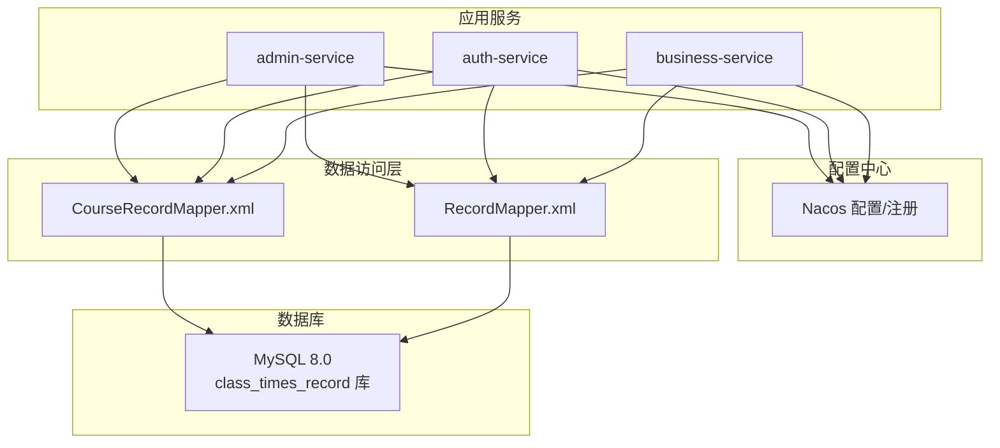
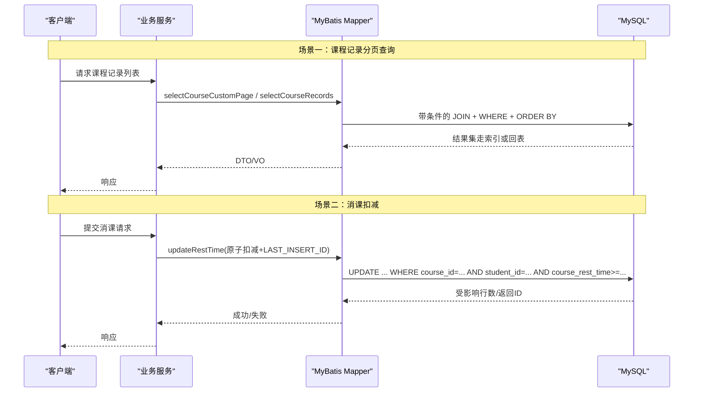
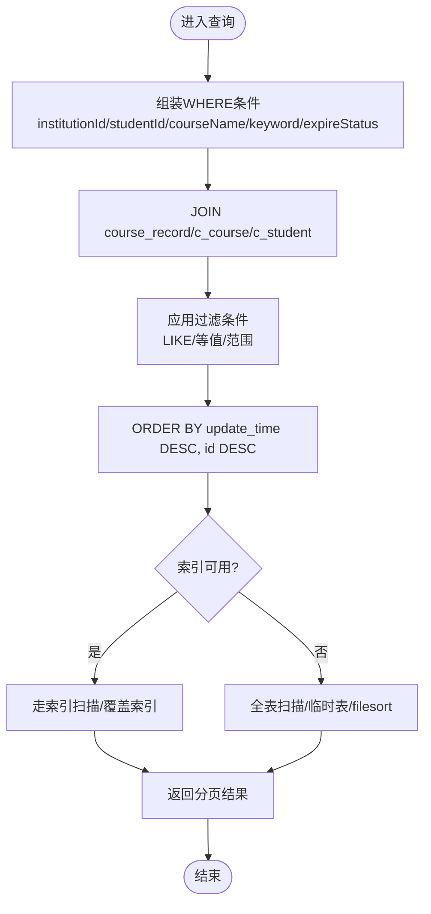
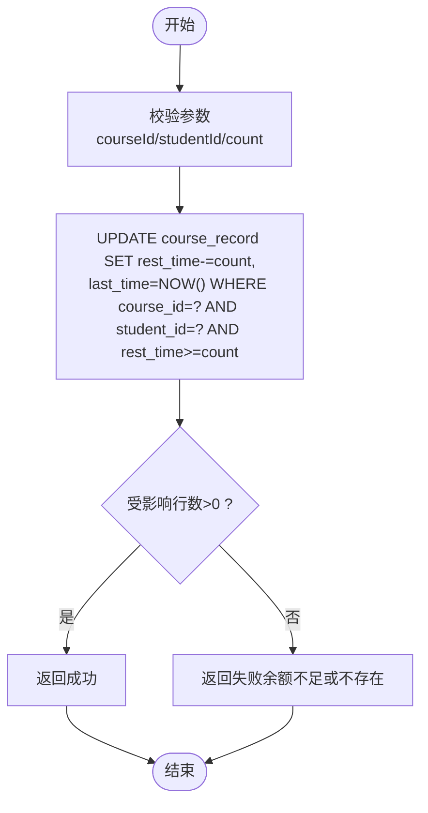
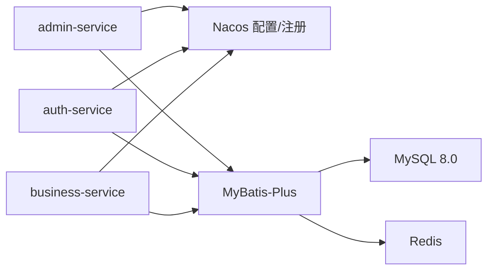

# 索引与性能优化

<cite>
**本文引用的文件**
- [class_times_record.sql](file://class_times_record_back/docs/class_times_record.sql)
- [CourseRecordMapper.xml](file://common/src/main/resources/com/shiroko/mapper/CourseRecordMapper.xml)
- [RecordMapper.xml](file://common/src/main/resources/com/shiroko/mapper/RecordMapper.xml)
- [application.yml（admin-service）](file://admin-service/src/main/resources/application.yml)
- [application.yml（auth-service）](file://auth-service/src/main/resources/application.yml)
- [application.yml（business-service）](file://business-service/src/main/resources/application.yml)
</cite>

## 目录
1. [引言](#引言)
2. [项目结构](#项目结构)
3. [核心组件](#核心组件)
4. [架构总览](#架构总览)
5. [详细组件分析](#详细组件分析)
6. [依赖分析](#依赖分析)
7. [性能考虑](#性能考虑)
8. [故障排查指南](#故障排查指南)
9. [结论](#结论)
10. [附录](#附录)

## 引言
本文件面向数据库管理员与开发者，围绕课程记录系统的表结构与查询路径，系统性梳理现有索引设计策略、复合索引原则、慢查询分析与监控方法、大数据量下的分区与归档策略、连接池与事务管理最佳实践，以及SQL优化与执行计划分析方法。目标是提供可落地的调优实践指南，帮助在数据规模增长与并发提升场景下保持系统稳定与高性能。

## 项目结构
后端采用多服务架构（admin-service、auth-service、business-service），通过 Nacos 进行配置与服务发现；数据访问层基于 MyBatis-Plus，SQL 定义集中在 mapper XML 中；数据库脚本位于 docs 目录。

图表来源
- [application.yml（admin-service）:1-23](file://admin-service/src/main/resources/application.yml#L1-L23)
- [application.yml（auth-service）:1-24](file://auth-service/src/main/resources/application.yml#L1-L24)
- [application.yml（business-service）:1-24](file://business-service/src/main/resources/application.yml#L1-L24)
- [CourseRecordMapper.xml:1-137](file://common/src/main/resources/com/shiroko/mapper/CourseRecordMapper.xml#L1-L137)
- [RecordMapper.xml:1-86](file://common/src/main/resources/com/shiroko/mapper/RecordMapper.xml#L1-L86)
- [class_times_record.sql:1-496](file://class_times_record_back/docs/class_times_record.sql#L1-L496)

章节来源
- [application.yml（admin-service）:1-23](file://admin-service/src/main/resources/application.yml#L1-L23)
- [application.yml（auth-service）:1-24](file://auth-service/src/main/resources/application.yml#L1-L24)
- [application.yml（business-service）:1-24](file://business-service/src/main/resources/application.yml#L1-L24)

## 核心组件
- 数据模型与索引：以 class_times_record.sql 为权威来源，覆盖主键、唯一索引与普通索引的设计现状。
- 关键查询路径：CourseRecordMapper.xml 与 RecordMapper.xml 定义了高频的列表分页、条件筛选、关联查询与扣课时更新逻辑。
- 配置与集成：各服务 application.yml 统一从 Nacos 导入 common-db.yaml、common-redis.yaml 等公共配置，便于集中管理连接池与缓存参数。

章节来源
- [class_times_record.sql:1-496](file://class_times_record_back/docs/class_times_record.sql#L1-L496)
- [CourseRecordMapper.xml:1-137](file://common/src/main/resources/com/shiroko/mapper/CourseRecordMapper.xml#L1-L137)
- [RecordMapper.xml:1-86](file://common/src/main/resources/com/shiroko/mapper/RecordMapper.xml#L1-L86)
- [application.yml（admin-service）:1-23](file://admin-service/src/main/resources/application.yml#L1-L23)
- [application.yml（auth-service）:1-24](file://auth-service/src/main/resources/application.yml#L1-L24)
- [application.yml（business-service）:1-24](file://business-service/src/main/resources/application.yml#L1-L24)

## 架构总览
下图展示了典型“课程记录分页查询”和“消课扣减”两条关键链路，体现从服务到 Mapper 再到 MySQL 的数据流与索引使用点。

图表来源
- [CourseRecordMapper.xml:28-86](file://common/src/main/resources/com/shiroko/mapper/CourseRecordMapper.xml#L28-L86)
- [CourseRecordMapper.xml:88-134](file://common/src/main/resources/com/shiroko/mapper/CourseRecordMapper.xml#L88-L134)
- [RecordMapper.xml:43-84](file://common/src/main/resources/com/shiroko/mapper/RecordMapper.xml#L43-L84)
- [class_times_record.sql:140-164](file://class_times_record_back/docs/class_times_record.sql#L140-L164)

## 详细组件分析

### 表结构与索引现状分析
- 主键索引
  - 所有表均定义自增主键 id，作为聚簇索引，用于快速定位单行与范围扫描。
- 唯一索引
  - 课程记录：student_id + course_id 唯一约束，避免同一学生重复绑定同一课程。
  - 权限记录：course_record_id + user_id 唯一约束，保证用户与课程记录的绑定唯一性。
  - 教师-班级、家长-学生等多对多关系表也采用联合唯一索引防止重复关联。
- 普通索引
  - 常见外键列（如 institution_id、course_id、student_id、teacher_id、user_id）建立普通索引，加速关联查询。
  - 部分表存在冗余索引风险（例如同时存在单列与联合索引时，需评估选择性）。

建议关注点
- 对于高基数且频繁过滤的列（如 institution_id、course_status、record_type），确保有合适索引。
- 联合唯一索引的列顺序应与最常使用的查询谓词顺序一致，以提升覆盖能力。

章节来源
- [class_times_record.sql:140-164](file://class_times_record_back/docs/class_times_record.sql#L140-L164)
- [class_times_record.sql:246-259](file://class_times_record_back/docs/class_times_record.sql#L246-L259)
- [class_times_record.sql:79-89](file://class_times_record_back/docs/class_times_record.sql#L79-L89)
- [class_times_record.sql:95-105](file://class_times_record_back/docs/class_times_record.sql#L95-L105)
- [class_times_record.sql:412-423](file://class_times_record_back/docs/class_times_record.sql#L412-L423)

### 复合索引设计原则与实践
- 最左前缀原则：联合索引 (A,B,C) 可用于 A、A+B、A+B+C 的查询，但不可用于仅 B 或仅 C 的查询。
- 选择性优先：将区分度高、过滤性强的列放在前面，减少回表概率。
- 覆盖索引：尽量让 SELECT 字段包含在索引中，避免回表。
- 排序与分组：ORDER BY/GROUP BY 的列应尽量与索引前缀一致，避免 filesort。
- 去重与约束：利用唯一索引实现业务唯一性，减少额外校验开销。

结合本项目的典型用法
- 课程记录查询常按 institution_id、student_id、course_name、keyword 组合筛选，建议在 c_course_record 上构建与常用过滤顺序匹配的复合索引，或在 c_course、c_student 侧补充必要索引以减少回表。
- 消课更新使用 course_id + student_id 作为 WHERE 条件，当前已有该联合唯一索引，可直接命中。

章节来源
- [class_times_record.sql:140-164](file://class_times_record_back/docs/class_times_record.sql#L140-L164)
- [CourseRecordMapper.xml:45-86](file://common/src/main/resources/com/shiroko/mapper/CourseRecordMapper.xml#L45-L86)
- [CourseRecordMapper.xml:88-134](file://common/src/main/resources/com/shiroko/mapper/CourseRecordMapper.xml#L88-L134)

### 慢查询分析与性能监控
- 开启慢查询日志
  - 在 MySQL 层面开启 slow_query_log，设置阈值（如 1s），并定期导出分析。
- 使用 EXPLAIN/EXPLAIN ANALYZE
  - 针对 CourseRecordMapper.xml 中的分页与复杂条件查询，检查是否出现全表扫描、临时表、filesort、回表过多等问题。
- 热点指标监控
  - 关注 QPS、TP99/TP95、锁等待、缓冲池命中率、磁盘 IO、复制延迟等。
- 问题定位流程
  - 定位慢 SQL → 查看执行计划 → 识别缺失索引/不当 JOIN/函数导致索引失效 → 调整 SQL 或索引 → 回归验证。

章节来源
- [CourseRecordMapper.xml:45-86](file://common/src/main/resources/com/shiroko/mapper/CourseRecordMapper.xml#L45-L86)
- [CourseRecordMapper.xml:88-134](file://common/src/main/resources/com/shiroko/mapper/CourseRecordMapper.xml#L88-L134)
- [RecordMapper.xml:43-84](file://common/src/main/resources/com/shiroko/mapper/RecordMapper.xml#L43-L84)

### 大数据量下的表分区与归档策略
- 分区策略
  - 时间分区：按 create_time 或 record_time 做 RANGE 分区，利于历史数据清理与冷热分离。
  - 机构分区：按 institution_id 做 HASH 分区，适合多租户隔离与水平扩展。
- 归档策略
  - 冷数据迁移至历史库或对象存储，保留必要审计字段。
  - 定时任务清理软删除数据（is_delete=1）与过期记录。
- 注意事项
  - 分区键应出现在高频查询的 WHERE 条件中，否则可能退化为全分区扫描。
  - 跨分区 JOIN 需谨慎评估性能影响。

[本节为通用指导，不直接分析具体文件]

### 连接池配置与事务管理最佳实践
- 连接池
  - 通过 Nacos 的 common-db.yaml 统一管理连接池参数（最大连接数、空闲超时、最小空闲等），根据业务峰值与数据库容量调优。
  - 合理设置获取连接超时与重试策略，避免雪崩。
- 事务边界
  - 短事务、早提交，避免长事务持有锁。
  - 批量操作拆分批次，控制单次事务大小。
  - 幂等设计：对消课等写操作增加幂等键或版本号，防止重复提交。
- 分布式事务
  - 跨服务一致性要求不高时，优先采用最终一致（消息队列+补偿）。
  - 强一致场景谨慎使用分布式事务，评估性能代价。

章节来源
- [application.yml（admin-service）:1-23](file://admin-service/src/main/resources/application.yml#L1-L23)
- [application.yml（auth-service）:1-24](file://auth-service/src/main/resources/application.yml#L1-L24)
- [application.yml（business-service）:1-24](file://business-service/src/main/resources/application.yml#L1-L24)

### SQL 查询优化建议与执行计划分析
- 分页优化
  - 深分页使用游标式分页（基于上次最大 ID 或时间戳），避免大偏移量带来的性能退化。
- 条件与索引匹配
  - WHERE 条件尽量使用等值与范围条件，避免在索引列上使用函数或表达式导致索引失效。
  - LIKE '%xx%' 无法使用普通索引，必要时引入全文索引或搜索引擎。
- JOIN 优化
  - 先过滤再 JOIN，小表驱动大表，确保 ON 条件列具备索引。
- 聚合与排序
  - 尽可能在索引上完成排序，避免 file sort；必要时创建覆盖索引。
- 更新优化
  - 使用原子更新（如本项目的 LAST_INSERT_ID 模式）减少竞争与额外读取。

章节来源
- [CourseRecordMapper.xml:28-44](file://common/src/main/resources/com/shiroko/mapper/CourseRecordMapper.xml#L28-L44)
- [CourseRecordMapper.xml:45-86](file://common/src/main/resources/com/shiroko/mapper/CourseRecordMapper.xml#L45-L86)
- [CourseRecordMapper.xml:88-134](file://common/src/main/resources/com/shiroko/mapper/CourseRecordMapper.xml#L88-L134)
- [RecordMapper.xml:43-84](file://common/src/main/resources/com/shiroko/mapper/RecordMapper.xml#L43-L84)

### 关键查询流程图示

#### 课程记录分页查询流程

图表来源
- [CourseRecordMapper.xml:45-86](file://common/src/main/resources/com/shiroko/mapper/CourseRecordMapper.xml#L45-L86)
- [CourseRecordMapper.xml:88-134](file://common/src/main/resources/com/shiroko/mapper/CourseRecordMapper.xml#L88-L134)

#### 消课扣减流程

图表来源
- [CourseRecordMapper.xml:28-44](file://common/src/main/resources/com/shiroko/mapper/CourseRecordMapper.xml#L28-L44)
- [class_times_record.sql:140-164](file://class_times_record_back/docs/class_times_record.sql#L140-L164)

## 依赖分析
- 服务与配置
  - 三个服务均通过 Nacos 导入公共配置（数据库、Redis、Sentinel、日志），有利于统一治理与动态刷新。
- 数据访问依赖
  - Mapper XML 集中于 common 模块，被多个服务复用，降低耦合度。
- 外部依赖
  - MySQL 8.0 作为持久化存储；Redis 用于缓存与会话；Nacos 提供服务发现与配置管理。

图表来源
- [application.yml（admin-service）:1-23](file://admin-service/src/main/resources/application.yml#L1-L23)
- [application.yml（auth-service）:1-24](file://auth-service/src/main/resources/application.yml#L1-L24)
- [application.yml（business-service）:1-24](file://business-service/src/main/resources/application.yml#L1-L24)

章节来源
- [application.yml（admin-service）:1-23](file://admin-service/src/main/resources/application.yml#L1-L23)
- [application.yml（auth-service）:1-24](file://auth-service/src/main/resources/application.yml#L1-L24)
- [application.yml（business-service）:1-24](file://business-service/src/main/resources/application.yml#L1-L24)

## 性能考虑
- 索引维护成本
  - 索引越多，写入越慢，空间占用越大。需在读写比与查询复杂度之间权衡。
- 热点行与锁竞争
  - 消课等高并发写场景，注意行级锁竞争，可通过分片键或队列削峰缓解。
- 统计信息与时序变化
  - 定期 ANALYZE TABLE，确保优化器选择正确的执行计划。
- 资源水位
  - CPU、内存、IO、网络带宽均为瓶颈候选，需结合监控指标综合判断。

[本节为通用指导，不直接分析具体文件]

## 故障排查指南
- 常见问题
  - 慢查询：检查 WHERE 条件是否命中索引，是否存在函数/隐式类型转换导致索引失效。
  - 深分页卡顿：改用游标分页或限制最大页码。
  - 死锁：缩短事务、固定加锁顺序、避免在事务中进行远程调用。
  - 连接池耗尽：增大连接池上限、排查长事务与未释放连接。
- 诊断步骤
  - 启用慢查询日志 → 提取 TOP N 慢 SQL → EXPLAIN 分析 → 补充/调整索引 → 压测回归。
- 工具推荐
  - EXPLAIN/EXPLAIN ANALYZE、Performance Schema、sys schema、pt-query-digest。

[本节为通用指导，不直接分析具体文件]

## 结论
本项目在表结构设计上已具备较好的基础：主键清晰、关键外键建索引、重要业务唯一性由联合唯一索引保障。在高并发与大数据量场景下，建议重点推进以下工作：
- 基于实际查询特征完善复合索引与覆盖索引，减少回表与临时表。
- 引入分页游标与批量处理，优化深分页与大批量写入。
- 建立完善的慢查询与性能监控体系，形成闭环优化。
- 制定分区与归档策略，实现冷热数据分层与低成本扩容。
- 通过 Nacos 统一治理连接池与缓存参数，配合压测持续调优。

[本节为总结性内容，不直接分析具体文件]

## 附录
- 术语
  - 覆盖索引：查询所需字段全部存在于索引中，无需回表。
  - 游标分页：基于最后一条记录的键值进行下一页查询，避免大偏移量。
  - 热数据/冷数据：近期活跃数据与长期不变更数据的划分。
- 参考路径
  - 表结构定义：[class_times_record.sql](file://class_times_record_back/docs/class_times_record.sql)
  - 核心查询映射：[CourseRecordMapper.xml](file://common/src/main/resources/com/shiroko/mapper/CourseRecordMapper.xml)、[RecordMapper.xml](file://common/src/main/resources/com/shiroko/mapper/RecordMapper.xml)
  - 服务配置入口：[admin-service/application.yml](file://admin-service/src/main/resources/application.yml)、[auth-service/application.yml](file://auth-service/src/main/resources/application.yml)、[business-service/application.yml](file://business-service/src/main/resources/application.yml)