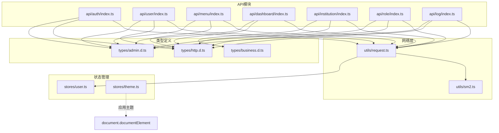
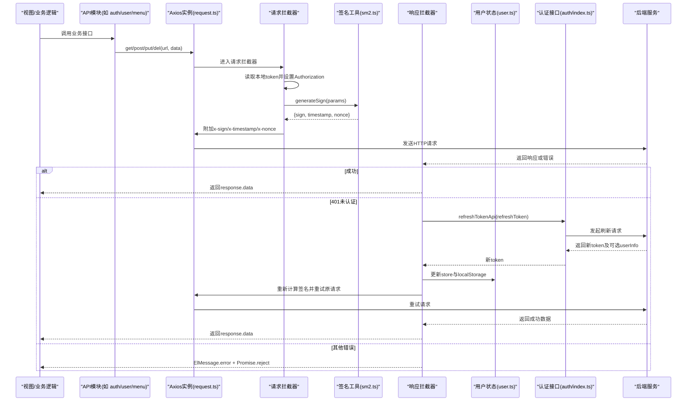
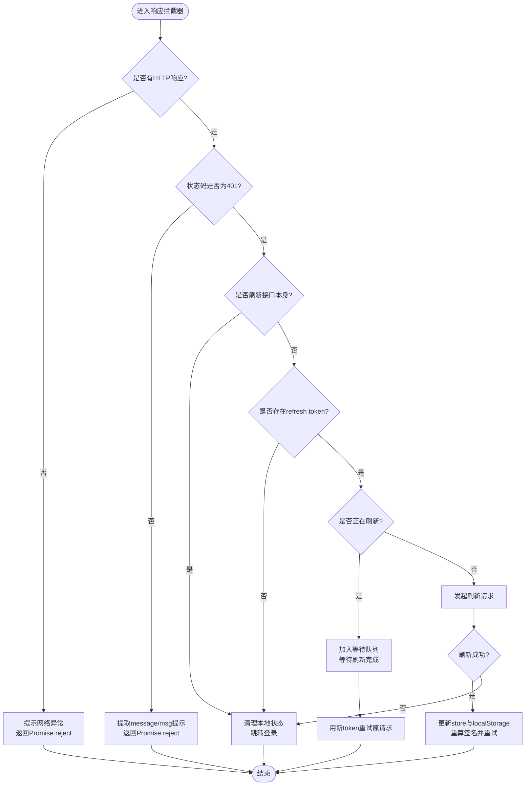
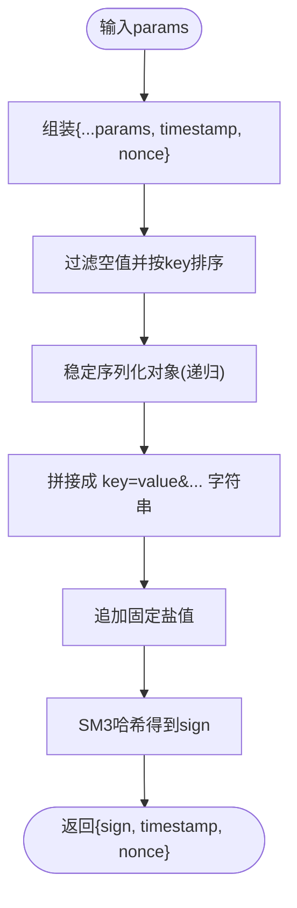
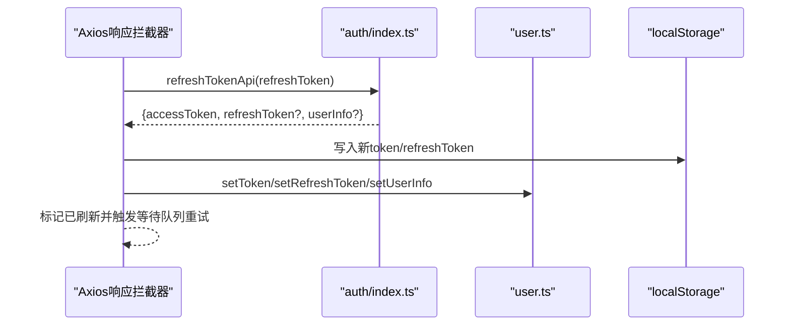
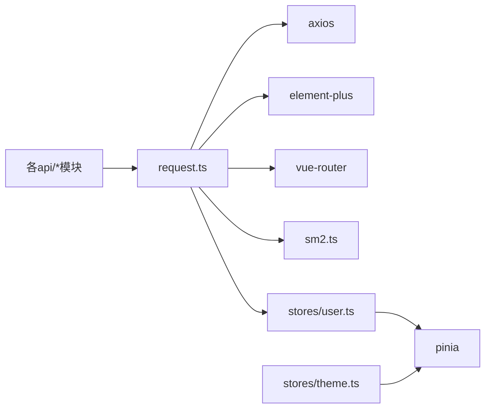

# API集成与请求管理

<cite>
**本文引用的文件**   
- [src/utils/request.ts](file://class_record_admin_front/src/utils/request.ts)
- [src/utils/sm2.ts](file://class_record_admin_front/src/utils/sm2.ts)
- [src/api/auth/index.ts](file://class_record_admin_front/src/api/auth/index.ts)
- [src/api/user/index.ts](file://class_record_admin_front/src/api/user/index.ts)
- [src/api/menu/index.ts](file://class_record_admin_front/src/api/menu/index.ts)
- [src/api/dashboard/index.ts](file://class_record_admin_front/src/api/dashboard/index.ts)
- [src/api/institution/index.ts](file://class_record_admin_front/src/api/institution/index.ts)
- [src/api/role/index.ts](file://class_record_admin_front/src/api/role/index.ts)
- [src/api/log/index.ts](file://class_record_admin_front/src/api/log/index.ts)
- [src/stores/user.ts](file://class_record_admin_front/src/stores/user.ts)
- [src/stores/theme.ts](file://class_record_admin_front/src/stores/theme.ts)
- [src/types/http.d.ts](file://class_record_admin_front/src/types/http.d.ts)
- [src/types/admin.d.ts](file://class_record_admin_front/src/types/admin.d.ts)
- [src/types/business.d.ts](file://class_record_admin_front/src/types/business.d.ts)
</cite>

## 目录
1. [简介](#简介)
2. [项目结构](#项目结构)
3. [核心组件](#核心组件)
4. [架构总览](#架构总览)
5. [详细组件分析](#详细组件分析)
6. [依赖关系分析](#依赖关系分析)
7. [性能考虑](#性能考虑)
8. [故障排查指南](#故障排查指南)
9. [结论](#结论)
10. [附录](#附录)

## 简介
本文件面向管理端前端的API集成与请求管理，系统性解析Axios封装、拦截器配置、Token续签与重试机制、国密签名流程、错误处理策略、API模块化组织方式、Pinia状态管理模式（用户状态与主题状态）、前后端数据格式与类型安全保证，以及Mock开发模式与调试技巧。目标是帮助开发者快速理解并高效扩展管理端HTTP能力。

## 项目结构
管理端前端采用“按领域划分”的API模块组织方式：每个业务域一个文件夹，内部以index.ts聚合接口；统一的网络层位于utils/request.ts；类型定义集中在types目录；状态管理使用Pinia，分别维护用户与主题状态。

图表来源
- [src/utils/request.ts:1-222](file://class_record_admin_front/src/utils/request.ts#L1-L222)
- [src/utils/sm2.ts:1-88](file://class_record_admin_front/src/utils/sm2.ts#L1-L88)
- [src/api/auth/index.ts:1-14](file://class_record_admin_front/src/api/auth/index.ts#L1-L14)
- [src/api/user/index.ts:1-30](file://class_record_admin_front/src/api/user/index.ts#L1-L30)
- [src/api/menu/index.ts:1-26](file://class_record_admin_front/src/api/menu/index.ts#L1-L26)
- [src/api/dashboard/index.ts:1-6](file://class_record_admin_front/src/api/dashboard/index.ts#L1-L6)
- [src/api/institution/index.ts:1-14](file://class_record_admin_front/src/api/institution/index.ts#L1-L14)
- [src/api/role/index.ts:1-26](file://class_record_admin_front/src/api/role/index.ts#L1-L26)
- [src/api/log/index.ts:1-14](file://class_record_admin_front/src/api/log/index.ts#L1-L14)
- [src/stores/user.ts:1-49](file://class_record_admin_front/src/stores/user.ts#L1-L49)
- [src/stores/theme.ts:1-47](file://class_record_admin_front/src/stores/theme.ts#L1-L47)
- [src/types/http.d.ts:1-12](file://class_record_admin_front/src/types/http.d.ts#L1-L12)
- [src/types/admin.d.ts:1-263](file://class_record_admin_front/src/types/admin.d.ts#L1-L263)
- [src/types/business.d.ts:1-443](file://class_record_admin_front/src/types/business.d.ts#L1-L443)

章节来源
- [src/utils/request.ts:1-222](file://class_record_admin_front/src/utils/request.ts#L1-L222)
- [src/utils/sm2.ts:1-88](file://class_record_admin_front/src/utils/sm2.ts#L1-L88)
- [src/api/auth/index.ts:1-14](file://class_record_admin_front/src/api/auth/index.ts#L1-L14)
- [src/api/user/index.ts:1-30](file://class_record_admin_front/src/api/user/index.ts#L1-L30)
- [src/api/menu/index.ts:1-26](file://class_record_admin_front/src/api/menu/index.ts#L1-L26)
- [src/api/dashboard/index.ts:1-6](file://class_record_admin_front/src/api/dashboard/index.ts#L1-L6)
- [src/api/institution/index.ts:1-14](file://class_record_admin_front/src/api/institution/index.ts#L1-L14)
- [src/api/role/index.ts:1-26](file://class_record_admin_front/src/api/role/index.ts#L1-L26)
- [src/api/log/index.ts:1-14](file://class_record_admin_front/src/api/log/index.ts#L1-L14)
- [src/stores/user.ts:1-49](file://class_record_admin_front/src/stores/user.ts#L1-L49)
- [src/stores/theme.ts:1-47](file://class_record_admin_front/src/stores/theme.ts#L1-L47)
- [src/types/http.d.ts:1-12](file://class_record_admin_front/src/types/http.d.ts#L1-L12)
- [src/types/admin.d.ts:1-263](file://class_record_admin_front/src/types/admin.d.ts#L1-L263)
- [src/types/business.d.ts:1-443](file://class_record_admin_front/src/types/business.d.ts#L1-L443)

## 核心组件
- Axios实例与基础配置：统一baseURL、超时、拦截器、便捷方法get/post/put/del。
- 请求拦截器：注入Authorization头、生成并附加x-sign/x-timestamp/x-nonce签名头。
- 响应拦截器：统一解包data、全局错误提示、401自动续签与重试、无网络异常提示。
- Token与刷新机制：基于refresh token的静默续签、并发排队重试、失败回退到登录页。
- 国密签名：SM3对参数进行排序拼接后签名，防止篡改。
- 类型系统：ApiResponse/PageData泛型约束返回体，配合各业务类型定义实现端到端类型安全。
- Pinia状态：用户状态集中管理token、userInfo、菜单树等；主题状态持久化并驱动DOM属性与类名切换。

章节来源
- [src/utils/request.ts:1-222](file://class_record_admin_front/src/utils/request.ts#L1-L222)
- [src/utils/sm2.ts:1-88](file://class_record_admin_front/src/utils/sm2.ts#L1-L88)
- [src/types/http.d.ts:1-12](file://class_record_admin_front/src/types/http.d.ts#L1-L12)
- [src/stores/user.ts:1-49](file://class_record_admin_front/src/stores/user.ts#L1-L49)
- [src/stores/theme.ts:1-47](file://class_record_admin_front/src/stores/theme.ts#L1-L47)

## 架构总览
下图展示了从页面调用到后端响应的完整链路，包括签名、鉴权、续签与重试。

图表来源
- [src/utils/request.ts:34-190](file://class_record_admin_front/src/utils/request.ts#L34-L190)
- [src/utils/sm2.ts:52-87](file://class_record_admin_front/src/utils/sm2.ts#L52-L87)
- [src/api/auth/index.ts:11-13](file://class_record_admin_front/src/api/auth/index.ts#L11-L13)
- [src/stores/user.ts:12-45](file://class_record_admin_front/src/stores/user.ts#L12-L45)

## 详细组件分析

### Axios封装与拦截器
- 基础配置
  - baseURL根据环境变量区分生产与本地环境。
  - 统一超时时间，避免长时间挂起。
- 请求拦截器
  - 自动注入Authorization头。
  - 基于sm-crypto生成签名头x-sign/x-timestamp/x-nonce，确保请求不可篡改。
- 响应拦截器
  - 成功时直接返回response.data，简化上层调用。
  - 401分支：
    - 若为刷新接口自身返回401，清理本地状态并跳转登录。
    - 若无refresh token，清理状态并跳转登录。
    - 若正在刷新，将当前请求加入等待队列，待刷新完成后统一重试。
    - 刷新成功后更新store与localStorage，重新计算签名并重试原请求。
    - 刷新失败则清理状态并跳转登录。
  - 非401错误：提取message/msg提示，网络异常给出通用提示。

图表来源
- [src/utils/request.ts:56-190](file://class_record_admin_front/src/utils/request.ts#L56-L190)

章节来源
- [src/utils/request.ts:1-222](file://class_record_admin_front/src/utils/request.ts#L1-L222)

### 国密签名机制
- 算法与盐值
  - 使用SM3对参数进行签名，固定盐值需与后端一致。
- 参数规范化
  - 递归稳定序列化对象，模拟后端排序与空值过滤行为，确保前后端签名一致。
- 签名头
  - 在请求拦截器中动态生成sign/timestamp/nonce并写入请求头。

图表来源
- [src/utils/sm2.ts:23-87](file://class_record_admin_front/src/utils/sm2.ts#L23-L87)

章节来源
- [src/utils/sm2.ts:1-88](file://class_record_admin_front/src/utils/sm2.ts#L1-L88)

### Token管理与状态同步
- 存储键
  - admin_token、admin_refresh_token。
- 用户状态（Pinia）
  - 提供setToken/setRefreshToken/setUserInfo/clearAll等方法，并在刷新成功后同步store与localStorage。
- 刷新流程
  - 通过auth模块的refreshTokenApi获取新token，必要时同时更新userInfo。

图表来源
- [src/utils/request.ts:118-149](file://class_record_admin_front/src/utils/request.ts#L118-L149)
- [src/api/auth/index.ts:11-13](file://class_record_admin_front/src/api/auth/index.ts#L11-L13)
- [src/stores/user.ts:12-45](file://class_record_admin_front/src/stores/user.ts#L12-L45)

章节来源
- [src/stores/user.ts:1-49](file://class_record_admin_front/src/stores/user.ts#L1-L49)
- [src/api/auth/index.ts:1-14](file://class_record_admin_front/src/api/auth/index.ts#L1-L14)

### API模块化组织
- 按领域拆分：auth、user、menu、dashboard、institution、role、log等。
- 统一导出：每个模块暴露函数式API，入参与返回值均带类型注解，便于IDE提示与编译期检查。
- 复用网络层：所有模块统一通过request.ts的get/post/put/del发起请求。

章节来源
- [src/api/auth/index.ts:1-14](file://class_record_admin_front/src/api/auth/index.ts#L1-L14)
- [src/api/user/index.ts:1-30](file://class_record_admin_front/src/api/user/index.ts#L1-L30)
- [src/api/menu/index.ts:1-26](file://class_record_admin_front/src/api/menu/index.ts#L1-L26)
- [src/api/dashboard/index.ts:1-6](file://class_record_admin_front/src/api/dashboard/index.ts#L1-L6)
- [src/api/institution/index.ts:1-14](file://class_record_admin_front/src/api/institution/index.ts#L1-L14)
- [src/api/role/index.ts:1-26](file://class_record_admin_front/src/api/role/index.ts#L1-L26)
- [src/api/log/index.ts:1-14](file://class_record_admin_front/src/api/log/index.ts#L1-L14)

### 错误处理策略
- 网络异常：统一提示“网络异常，请检查网络连接”。
- 业务错误：优先取message/msg字段提示，兜底“请求失败”。
- 鉴权错误：
  - 刷新接口自身401：清理状态并跳转登录。
  - 无refresh token：清理状态并跳转登录。
  - 刷新失败：清理状态并跳转登录。
  - 并发401：排队等待刷新完成后重试，避免重复刷新风暴。

章节来源
- [src/utils/request.ts:181-190](file://class_record_admin_front/src/utils/request.ts#L181-L190)
- [src/utils/request.ts:66-180](file://class_record_admin_front/src/utils/request.ts#L66-L180)

### 请求重试机制
- 单次重试：仅在首次遇到401且存在refresh token时尝试刷新并重试一次。
- 并发控制：isRefreshing标志位+订阅者队列，确保同一时刻仅发起一次刷新，其余请求等待。
- 签名重算：重试前基于原始参数对象重新生成签名头，保证签名有效性。

章节来源
- [src/utils/request.ts:21-31](file://class_record_admin_front/src/utils/request.ts#L21-L31)
- [src/utils/request.ts:98-113](file://class_record_admin_front/src/utils/request.ts#L98-L113)
- [src/utils/request.ts:141-149](file://class_record_admin_front/src/utils/request.ts#L141-L149)

### 状态管理（Pinia）使用模式
- 用户状态（user.ts）
  - 管理token、refreshToken、userInfo、roles、menus。
  - 提供clearAll用于登出与过期清理。
  - 支持拉取用户菜单树并缓存至store。
- 主题状态（theme.ts）
  - 管理light/dark模式，持久化到localStorage。
  - 通过watch监听mode变化，动态设置document.documentElement的data-theme与dark类名，并处理首屏过渡动画禁用。

章节来源
- [src/stores/user.ts:1-49](file://class_record_admin_front/src/stores/user.ts#L1-L49)
- [src/stores/theme.ts:1-47](file://class_record_admin_front/src/stores/theme.ts#L1-L47)

### 前后端数据格式转换与类型安全
- 统一响应包装：ApiResponse<T>包含code/message/data/requestTime。
- 分页约定：PageData<T>包含list/total。
- 业务类型：admin.d.ts与business.d.ts覆盖用户、角色、菜单、机构、课程、班级、记录等实体与请求/响应类型。
- 类型推导：API函数返回Promise<ApiResponse<T>>，结合业务类型可实现端到端类型推断与校验。

章节来源
- [src/types/http.d.ts:1-12](file://class_record_admin_front/src/types/http.d.ts#L1-L12)
- [src/types/admin.d.ts:1-263](file://class_record_admin_front/src/types/admin.d.ts#L1-L263)
- [src/types/business.d.ts:1-443](file://class_record_admin_front/src/types/business.d.ts#L1-L443)

### Mock数据开发模式
- 建议方案
  - 使用Vite插件（如vite-plugin-mock）在开发环境拦截特定路由，返回mock数据。
  - 或通过代理（vite.config.ts server.proxy）将指定路径转发到本地Mock Server。
- 注意事项
  - 保持与真实接口一致的请求方法与路径，避免影响拦截器与签名逻辑。
  - 在测试环境中关闭签名验证或使用白名单绕过。

[本节为通用实践说明，不直接分析具体文件]

## 依赖关系分析
- 低耦合高内聚
  - request.ts作为唯一网络入口，被所有API模块依赖。
  - sm2.ts提供签名能力，被request.ts在请求拦截器中调用。
  - user.ts与request.ts协作完成Token生命周期管理。
- 外部依赖
  - axios：HTTP客户端。
  - element-plus：ElMessage用于全局提示。
  - sm-crypto：SM2/SM3加密与签名。
  - pinia：状态管理。
  - vue-router：路由跳转。

图表来源
- [src/utils/request.ts:1-12](file://class_record_admin_front/src/utils/request.ts#L1-L12)
- [src/utils/sm2.ts:1-8](file://class_record_admin_front/src/utils/sm2.ts#L1-L8)
- [src/stores/user.ts:1-3](file://class_record_admin_front/src/stores/user.ts#L1-L3)
- [src/stores/theme.ts:1-3](file://class_record_admin_front/src/stores/theme.ts#L1-L3)

章节来源
- [src/utils/request.ts:1-222](file://class_record_admin_front/src/utils/request.ts#L1-L222)
- [src/utils/sm2.ts:1-88](file://class_record_admin_front/src/utils/sm2.ts#L1-L88)
- [src/stores/user.ts:1-49](file://class_record_admin_front/src/stores/user.ts#L1-L49)
- [src/stores/theme.ts:1-47](file://class_record_admin_front/src/stores/theme.ts#L1-L47)

## 性能考虑
- 减少重复刷新：并发401场景下通过订阅者队列合并刷新请求，降低服务端压力。
- 合理超时：默认15秒超时，可根据业务调整。
- 按需加载：API模块按功能拆分，有利于Tree Shaking与懒加载。
- 签名开销：SM3计算轻量，但应避免在高频短轮询中过度构造大对象参数。

[本节为通用指导，不直接分析具体文件]

## 故障排查指南
- 401频繁出现
  - 检查admin_refresh_token是否存在且有效。
  - 确认刷新接口路径与参数是否与后端一致。
  - 观察是否出现并发刷新风暴（应被队列合并）。
- 签名失败
  - 核对sm2.ts中的盐值与后端一致。
  - 确认参数对象是否包含null/undefined/空串，会被过滤。
  - 检查GET请求的params与POST请求的data是否正确传递。
- 主题切换无效
  - 检查html元素是否设置了data-theme与dark类名。
  - 确认首次加载时是否移除了transition-disabled类。
- 网络异常
  - 检查浏览器控制台与代理配置，确认请求可达。

章节来源
- [src/utils/request.ts:66-190](file://class_record_admin_front/src/utils/request.ts#L66-L190)
- [src/utils/sm2.ts:52-87](file://class_record_admin_front/src/utils/sm2.ts#L52-L87)
- [src/stores/theme.ts:21-43](file://class_record_admin_front/src/stores/theme.ts#L21-L43)

## 结论
本项目通过统一的Axios封装与拦截器，实现了健壮的鉴权、签名与错误处理；借助Pinia对用户与主题状态进行集中管理；以类型化的API模块提升可维护性与开发体验。建议在后续迭代中持续完善Mock体系与监控埋点，进一步提升稳定性与可观测性。

[本节为总结性内容，不直接分析具体文件]

## 附录
- 常用API示例路径
  - 认证：/admin/crypto/public_key、/admin/user/login、/admin/user/refresh
  - 用户：/admin/user/list、/admin/user/get_by_id、/admin/user/insert、/admin/user/update、/admin/user/delete、/admin/user/reset_password、/admin/user/get_roles
  - 菜单：/admin/menu/list、/admin/menu/tree、/admin/menu/insert、/admin/menu/update、/admin/menu/delete、/admin/menu/user_tree
  - 仪表盘：/admin/dashboard/data
  - 机构：/admin/business/institution/list、/admin/business/institution/insert、/admin/business/institution/update
  - 角色：/admin/role/list、/admin/role/get_by_id、/admin/role/insert、/admin/role/update、/admin/role/delete、/admin/role/get_menus
  - 日志：/admin/operation_log/list、/admin/operation_log/delete、/admin/operation_log/clear

章节来源
- [src/api/auth/index.ts:1-14](file://class_record_admin_front/src/api/auth/index.ts#L1-L14)
- [src/api/user/index.ts:1-30](file://class_record_admin_front/src/api/user/index.ts#L1-L30)
- [src/api/menu/index.ts:1-26](file://class_record_admin_front/src/api/menu/index.ts#L1-L26)
- [src/api/dashboard/index.ts:1-6](file://class_record_admin_front/src/api/dashboard/index.ts#L1-L6)
- [src/api/institution/index.ts:1-14](file://class_record_admin_front/src/api/institution/index.ts#L1-L14)
- [src/api/role/index.ts:1-26](file://class_record_admin_front/src/api/role/index.ts#L1-L26)
- [src/api/log/index.ts:1-14](file://class_record_admin_front/src/api/log/index.ts#L1-L14)