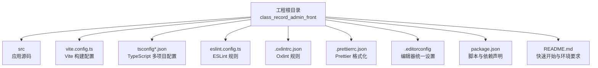
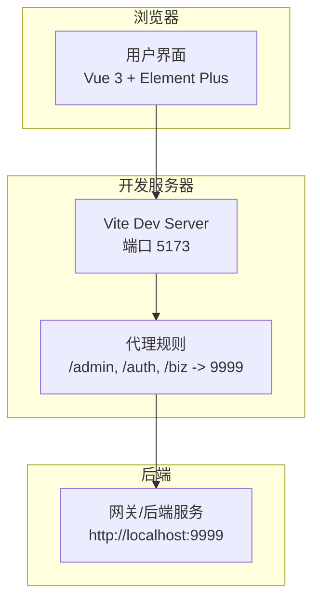
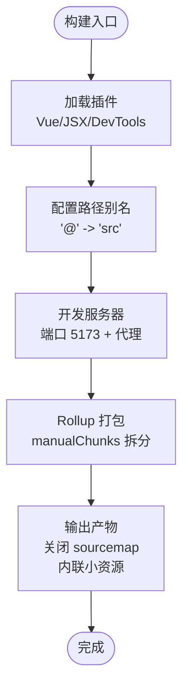
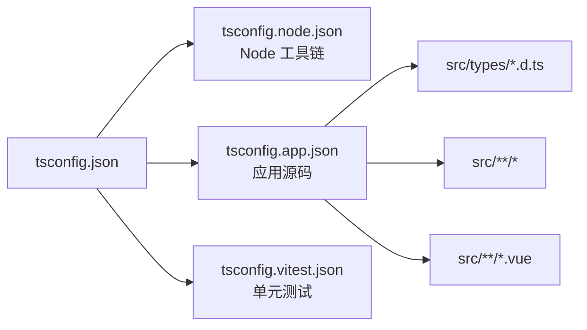
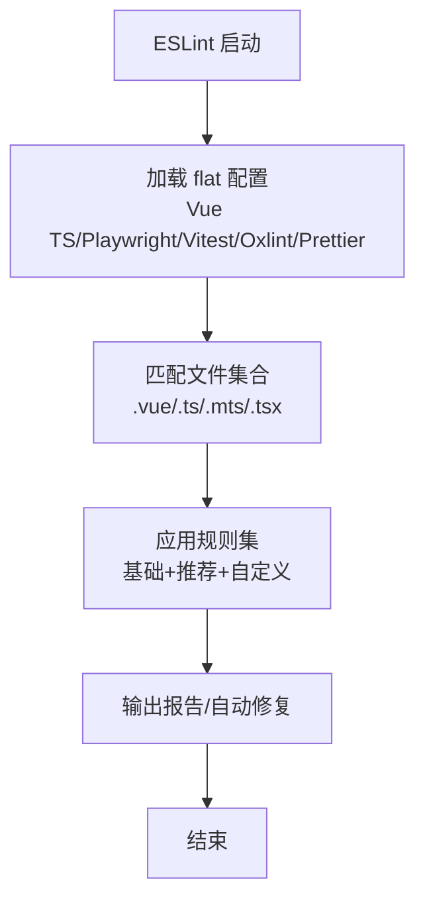
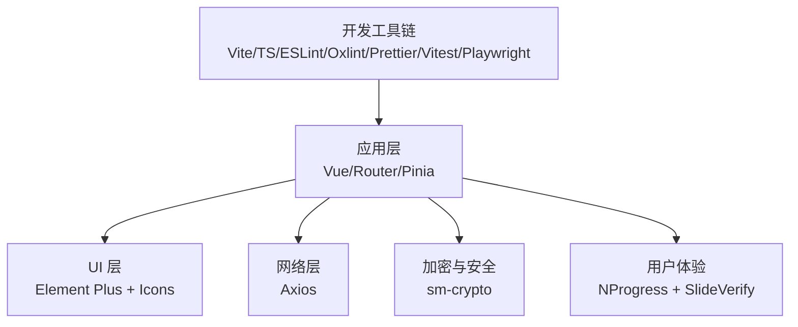

# 技术栈与配置

<cite>
**本文引用的文件**   
- [package.json](file://class_record_admin_front/package.json)
- [vite.config.ts](file://class_record_admin_front/vite.config.ts)
- [tsconfig.json](file://class_record_admin_front/tsconfig.json)
- [tsconfig.app.json](file://class_record_admin_front/tsconfig.app.json)
- [tsconfig.node.json](file://class_record_admin_front/tsconfig.node.json)
- [eslint.config.ts](file://class_record_admin_front/eslint.config.ts)
- [.editorconfig](file://class_record_admin_front/.editorconfig)
- [.prettierrc.json](file://class_record_admin_front/.prettierrc.json)
- [.oxlintrc.json](file://class_record_admin_front/.oxlintrc.json)
- [env.d.ts](file://class_record_admin_front/env.d.ts)
- [src/main.ts](file://class_record_admin_front/src/main.ts)
- [README.md](file://class_record_admin_front/README.md)
</cite>

## 目录
1. [简介](#简介)
2. [项目结构](#项目结构)
3. [核心组件与技术栈](#核心组件与技术栈)
4. [架构总览](#架构总览)
5. [详细配置解析](#详细配置解析)
6. [依赖关系分析](#依赖关系分析)
7. [性能与构建优化](#性能与构建优化)
8. [常见问题排查](#常见问题排查)
9. [结论](#结论)

## 简介
本文件面向管理端前端工程，聚焦于 Vue 3 + TypeScript + Vite 8 + Element Plus 的技术组合与工程化配置。内容覆盖：
- 依赖版本与用途说明
- Vite 构建、TypeScript 编译、ESLint 代码规范配置
- 项目初始化流程、开发环境搭建、环境变量与代理
- Node.js 版本要求与包管理器使用规范
- 常见配置问题的排查方法与解决方案

## 项目结构
管理端前端位于 class_record_admin_front 目录，采用模块化组织方式，按功能域划分 api、views、stores、router、types、utils、styles 等目录；构建与工程化配置集中在根目录的配置文件与脚本中。

图表来源
- [vite.config.ts:1-64](file://class_record_admin_front/vite.config.ts#L1-L64)
- [tsconfig.json:1-15](file://class_record_admin_front/tsconfig.json#L1-L15)
- [eslint.config.ts:1-47](file://class_record_admin_front/eslint.config.ts#L1-L47)
- [.oxlintrc.json:1-11](file://class_record_admin_front/.oxlintrc.json#L1-L11)
- [.prettierrc.json:1-7](file://class_record_admin_front/.prettierrc.json#L1-L7)
- [.editorconfig:1-9](file://class_record_admin_front/.editorconfig#L1-L9)
- [package.json:1-63](file://class_record_admin_front/package.json#L1-L63)
- [README.md:1-127](file://class_record_admin_front/README.md#L1-L127)

章节来源
- [README.md:64-98](file://class_record_admin_front/README.md#L64-L98)

## 核心组件与技术栈
- 框架与生态
  - Vue 3：Composition API 与 <script setup> 语法
  - Vue Router：路由管理（history 模式）
  - Pinia：状态管理
  - Axios：HTTP 请求封装
- UI 与样式
  - Element Plus：UI 组件库与图标集
  - SCSS：样式预处理
- 构建与工具链
  - Vite 8：开发与构建
  - TypeScript：类型检查与编译
  - ESLint + Oxlint：静态检查
  - Prettier：代码格式化
  - Vitest + Playwright：单测与端到端测试
- 安全与体验
  - sm-crypto：国密算法支持
  - vue3-slide-verify：滑块验证码
  - nprogress：页面加载进度条

章节来源
- [package.json:19-30](file://class_record_admin_front/package.json#L19-L30)
- [package.json:31-58](file://class_record_admin_front/package.json#L31-L58)
- [README.md:30-39](file://class_record_admin_front/README.md#L30-L39)

## 架构总览
管理端前端在开发模式下通过 Vite 启动本地服务，并将 /admin、/auth、/biz 前缀的请求代理至后端网关（默认 http://localhost:9999）。生产构建时，将大体积依赖拆分为独立 chunk，减少首屏资源体积并提升缓存命中率。

图表来源
- [vite.config.ts:14-30](file://class_record_admin_front/vite.config.ts#L14-L30)
- [README.md:105-114](file://class_record_admin_front/README.md#L105-L114)

## 详细配置解析

### Node.js 版本与包管理器
- Node.js 版本要求
  - 支持 ^20.19.0 或 >=22.12.0
- 包管理器
  - 仓库包含 pnpm-lock.yaml，建议使用 pnpm 以获得更快的安装与更严格的依赖解析
  - 也兼容 npm/yarn，但需确保锁文件一致以避免差异

章节来源
- [package.json:59-61](file://class_record_admin_front/package.json#L59-L61)
- [package.json:1-18](file://class_record_admin_front/package.json#L1-L18)

### 初始化与运行
- 安装依赖
  - 使用 pnpm install 或 npm install
- 启动开发服务
  - 执行 dev 脚本，默认监听 5173 端口
- 构建与预览
  - build 脚本会并行执行类型检查与构建
  - preview 用于本地预览生产产物
- 测试
  - test:unit 使用 Vitest
  - test:e2e 使用 Playwright

章节来源
- [package.json:6-18](file://class_record_admin_front/package.json#L6-L18)
- [README.md:41-62](file://class_record_admin_front/README.md#L41-L62)

### Vite 构建配置
- 插件
  - @vitejs/plugin-vue、@vitejs/plugin-vue-jsx、vite-plugin-vue-devtools
- 路径别名
  - @ 指向 src 目录
- 开发服务器
  - 端口 5173
  - 代理 /admin、/auth、/biz 到 http://localhost:9999，开启 changeOrigin
- 构建策略
  - sourcemap 关闭以减小产物体积
  - manualChunks 拆分：element-plus、element-plus-icons、vue-vendor、utils
  - chunkSizeWarningLimit 设为 300KB
  - assetsInlineLimit 设为 4096B（小于 4KB 内联为 base64）

图表来源
- [vite.config.ts:1-64](file://class_record_admin_front/vite.config.ts#L1-L64)

章节来源
- [vite.config.ts:7-13](file://class_record_admin_front/vite.config.ts#L7-L13)
- [vite.config.ts:14-30](file://class_record_admin_front/vite.config.ts#L14-L30)
- [vite.config.ts:31-62](file://class_record_admin_front/vite.config.ts#L31-L62)

### TypeScript 编译配置
- 多项目引用
  - tsconfig.json 引用 node/app/vitest 三个子配置
- Node 侧配置（tsconfig.node.json）
  - 基于 @tsconfig/node24
  - module/preserve、moduleResolution/bundler
  - types 仅包含 node，避免误引入其他 @types/*
  - noEmit 仅做类型检查
- 应用侧配置（tsconfig.app.json）
  - 继承 @vue/tsconfig/tsconfig.dom.json
  - include 包含 env.d.ts、src/types/*.d.ts、src/**/*、src/**/*.vue
  - noUncheckedIndexedAccess 增强数组/对象索引访问安全性
  - paths 映射 @/* 到 ./src/*
  - tsBuildInfoFile 指定增量类型检查信息位置

图表来源
- [tsconfig.json:1-15](file://class_record_admin_front/tsconfig.json#L1-L15)
- [tsconfig.node.json:1-28](file://class_record_admin_front/tsconfig.node.json#L1-L28)
- [tsconfig.app.json:1-19](file://class_record_admin_front/tsconfig.app.json#L1-L19)

章节来源
- [tsconfig.json:1-15](file://class_record_admin_front/tsconfig.json#L1-L15)
- [tsconfig.node.json:1-28](file://class_record_admin_front/tsconfig.node.json#L1-L28)
- [tsconfig.app.json:1-19](file://class_record_admin_front/tsconfig.app.json#L1-L19)

### ESLint 与代码规范
- 规则来源
  - @vue/eslint-config-typescript 推荐规则
  - eslint-plugin-vue 基础规则
  - eslint-plugin-playwright（e2e）
  - @vitest/eslint-plugin（单测）
  - oxlint 集成（基于 .oxlintrc.json）
  - eslint-config-prettier 禁用冲突规则
- 自定义规则
  - 关闭 vue/multi-word-component-names
  - @typescript-eslint/no-explicit-any 降级为 warn
- 扫描范围
  - **/*.{vue,ts,mts,tsx}
  - e2e/**/*.{test,spec}.{js,ts,jsx,tsx}
  - src/**/__tests__/*

图表来源
- [eslint.config.ts:1-47](file://class_record_admin_front/eslint.config.ts#L1-L47)
- [.oxlintrc.json:1-11](file://class_record_admin_front/.oxlintrc.json#L1-L11)

章节来源
- [eslint.config.ts:14-46](file://class_record_admin_front/eslint.config.ts#L14-L46)
- [.oxlintrc.json:1-11](file://class_record_admin_front/.oxlintrc.json#L1-L11)

### 编辑器与格式化
- EditorConfig
  - UTF-8、缩进 2 空格、LF 换行、末尾换行、去除尾部空白、最大行长 100
- Prettier
  - 不加分号、单引号、打印宽度 100

章节来源
- [.editorconfig:1-9](file://class_record_admin_front/.editorconfig#L1-L9)
- [.prettierrc.json:1-7](file://class_record_admin_front/.prettierrc.json#L1-L7)

### 环境变量与类型声明
- Vite 客户端类型
  - env.d.ts 引用 vite/client，使 import.meta.env 具备类型提示
- 环境变量文件
  - 当前仓库未提供 .env* 文件，如需可新增 .env.development/.env.production 并在代码中使用 import.meta.env.*
- 代理与跨域
  - 开发环境通过 Vite server.proxy 将 /admin、/auth、/biz 转发至 http://localhost:9999，无需额外 CORS 配置

章节来源
- [env.d.ts:1-2](file://class_record_admin_front/env.d.ts#L1-L2)
- [vite.config.ts:14-30](file://class_record_admin_front/vite.config.ts#L14-L30)
- [README.md:105-114](file://class_record_admin_front/README.md#L105-L114)

### 应用初始化与主题
- 入口初始化
  - main.ts 创建 Vue 实例，注册 Pinia、Router、Element Plus，挂载全局样式
  - 在挂载前读取主题 store 并应用 data-theme 属性
- 根组件
  - App.vue 仅渲染 router-view

章节来源
- [src/main.ts:1-22](file://class_record_admin_front/src/main.ts#L1-L22)
- [src/App.vue:1-10](file://class_record_admin_front/src/App.vue#L1-L10)

## 依赖关系分析
- 运行时依赖
  - vue、vue-router、pinia、axios、element-plus、@element-plus/icons-vue、sm-crypto、nprogress、vue3-slide-verify
- 开发依赖
  - vite、@vitejs/plugin-vue、@vitejs/plugin-vue-jsx、vite-plugin-vue-devtools、typescript、vue-tsc、sass、eslint、oxlint、prettier、vitest、playwright、@vue/test-utils、jsdom、npm-run-all2、jiti

图表来源
- [package.json:19-30](file://class_record_admin_front/package.json#L19-L30)
- [package.json:31-58](file://class_record_admin_front/package.json#L31-L58)

章节来源
- [package.json:19-58](file://class_record_admin_front/package.json#L19-L58)

## 性能与构建优化
- 分包策略
  - element-plus、element-plus-icons、vue-vendor、utils 独立 chunk，提高缓存命中
- 资源内联
  - 小于 4KB 的资源内联为 base64，减少 HTTP 请求数
- 警告阈值
  - chunkSizeWarningLimit 设为 300KB，便于发现异常大包
- Source Map
  - 生产构建关闭 sourcemap，减小产物体积

章节来源
- [vite.config.ts:31-62](file://class_record_admin_front/vite.config.ts#L31-L62)

## 常见问题排查
- 无法访问后端接口（跨域/代理）
  - 确认开发服务器已启动且端口为 5173
  - 确认后端网关在 http://localhost:9999 正常响应
  - 检查请求路径是否以 /admin、/auth、/biz 开头
- 构建产物过大
  - 检查是否引入了完整 element-plus 或全部图标，按需引入或使用手动分包
  - 关注 chunkSizeWarningLimit 告警，定位超大模块
- 类型检查失败
  - 确认 Node.js 版本满足 engines 要求
  - 检查 tsconfig.app.json 的 include 是否覆盖新增文件
  - 清理增量类型检查缓存（node_modules/.tmp 下的 tsbuildinfo）
- ESLint/Oxlint 报错
  - 查看具体规则名，必要时在 eslint.config.ts 中调整规则级别
  - 若与 Prettier 冲突，确认 eslint-config-prettier 已启用
- 环境变量未生效
  - 确认使用了 import.meta.env.* 而非 process.env
  - 如需区分环境，创建 .env.development/.env.production 并重启开发服务器

章节来源
- [vite.config.ts:14-30](file://class_record_admin_front/vite.config.ts#L14-L30)
- [vite.config.ts:31-62](file://class_record_admin_front/vite.config.ts#L31-L62)
- [tsconfig.app.json:1-19](file://class_record_admin_front/tsconfig.app.json#L1-L19)
- [eslint.config.ts:14-46](file://class_record_admin_front/eslint.config.ts#L14-L46)
- [package.json:59-61](file://class_record_admin_front/package.json#L59-L61)

## 结论
本项目采用现代前端工程化方案：Vue 3 + TypeScript + Vite 8 + Element Plus，配合完善的类型检查、代码规范与构建优化策略，兼顾开发效率与生产质量。通过合理的分包与内联策略，有效降低首屏体积；通过代理与严格的环境配置，保障前后端联调顺畅。建议团队遵循现有规范，持续优化依赖与构建产出，保持工程健康度。