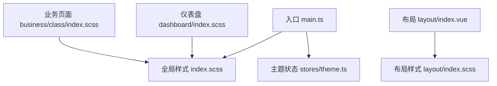
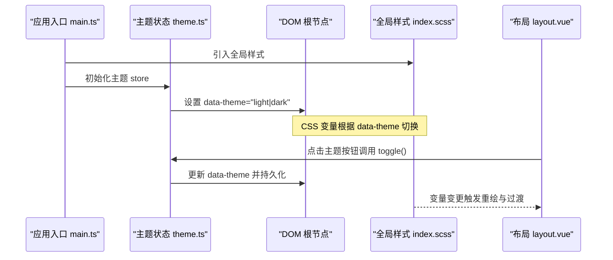
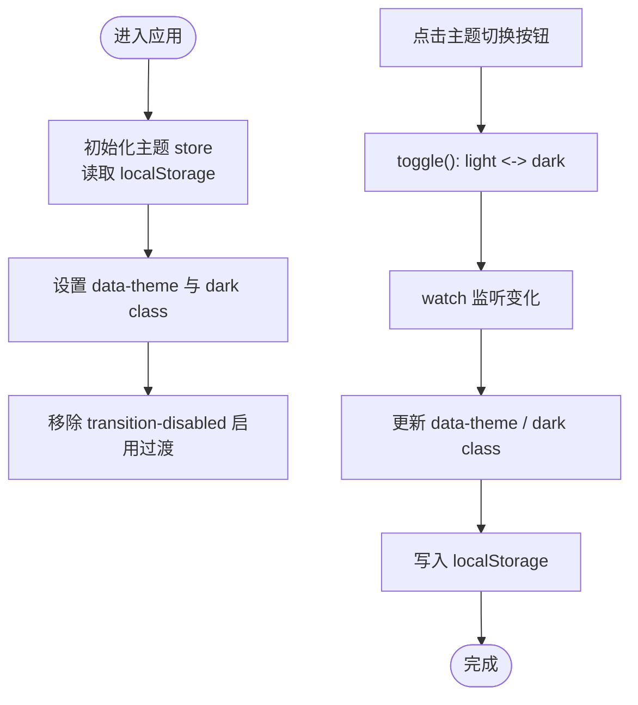
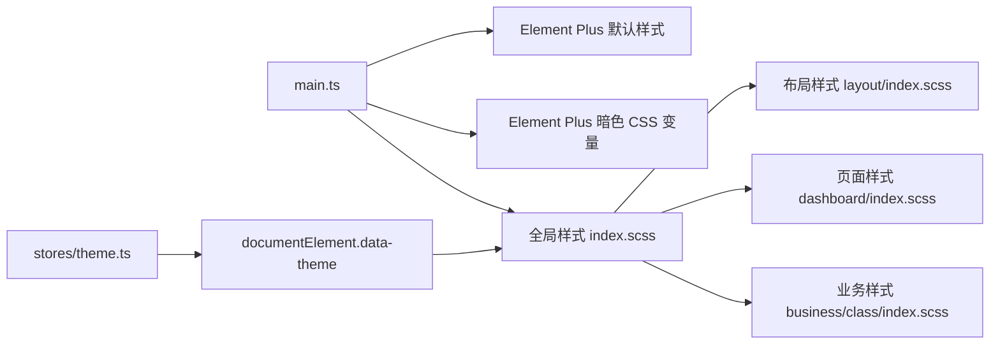

# 样式系统与主题

<cite>
**本文引用的文件**
- [src/main.ts](file://class_record_admin_front/src/main.ts)
- [src/styles/index.scss](file://class_record_admin_front/src/styles/index.scss)
- [src/stores/theme.ts](file://class_record_admin_front/src/stores/theme.ts)
- [src/views/layout/index.vue](file://class_record_admin_front/src/views/layout/index.vue)
- [src/views/layout/index.scss](file://class_record_admin_front/src/views/layout/index.scss)
- [src/views/dashboard/index.scss](file://class_record_admin_front/src/views/dashboard/index.scss)
- [src/views/business/class/index.scss](file://class_record_admin_front/src/views/business/class/index.scss)
</cite>

## 目录
1. [简介](#简介)
2. [项目结构](#项目结构)
3. [核心组件](#核心组件)
4. [架构总览](#架构总览)
5. [详细组件分析](#详细组件分析)
6. [依赖分析](#依赖分析)
7. [性能考虑](#性能考虑)
8. [故障排查指南](#故障排查指南)
9. [结论](#结论)
10. [附录](#附录)

## 简介
本文件面向管理端的前端样式系统与主题机制，系统性梳理 SCSS 预处理器使用、CSS 变量管理、响应式与布局策略、Element Plus 主题定制与覆盖、全局样式规范、组件样式覆盖策略、主题切换与暗色模式支持、样式隔离方案、样式性能优化、CSS 模块化与 BEM 命名规范，以及调试工具与开发技巧。文档以仓库实际实现为依据，提供可追溯的源码定位与可视化图示，帮助开发者快速理解并高效扩展样式体系。

## 项目结构
管理端采用 Vue 3 + Vite + Element Plus 技术栈，样式组织遵循“全局基础样式 + 布局样式 + 页面/业务样式”的分层策略：
- 全局基础样式：统一 CSS 变量、重置、过渡动画、Element Plus 主题覆盖等
- 布局样式：侧边栏、头部、主内容区等框架级样式
- 页面/业务样式：各视图模块的局部样式，按功能域拆分

图表来源
- [src/main.ts:1-22](file://class_record_admin_front/src/main.ts#L1-L22)
- [src/styles/index.scss:1-493](file://class_record_admin_front/src/styles/index.scss#L1-L493)
- [src/stores/theme.ts:1-47](file://class_record_admin_front/src/stores/theme.ts#L1-L47)
- [src/views/layout/index.vue:1-216](file://class_record_admin_front/src/views/layout/index.vue#L1-L216)
- [src/views/layout/index.scss:1-172](file://class_record_admin_front/src/views/layout/index.scss#L1-L172)
- [src/views/dashboard/index.scss:1-128](file://class_record_admin_front/src/views/dashboard/index.scss#L1-L128)
- [src/views/business/class/index.scss:1-12](file://class_record_admin_front/src/views/business/class/index.scss#L1-L12)

章节来源
- [src/main.ts:1-22](file://class_record_admin_front/src/main.ts#L1-L22)
- [src/styles/index.scss:1-493](file://class_record_admin_front/src/styles/index.scss#L1-L493)
- [src/stores/theme.ts:1-47](file://class_record_admin_front/src/stores/theme.ts#L1-L47)
- [src/views/layout/index.vue:1-216](file://class_record_admin_front/src/views/layout/index.vue#L1-L216)
- [src/views/layout/index.scss:1-172](file://class_record_admin_front/src/views/layout/index.scss#L1-L172)
- [src/views/dashboard/index.scss:1-128](file://class_record_admin_front/src/views/dashboard/index.scss#L1-L128)
- [src/views/business/class/index.scss:1-12](file://class_record_admin_front/src/views/business/class/index.scss#L1-L12)

## 核心组件
- 全局样式入口：集中定义 CSS 变量（亮/暗两套）、基础重置、通用过渡、Element Plus 主题变量覆盖、常用布局工具类
- 主题状态管理：基于 Pinia 维护 theme 模式，监听变化同步到 DOM 属性与本地存储，控制过渡开关
- 布局组件：侧边栏折叠、面包屑、用户信息、主题切换按钮等，配合布局样式完成整体框架
- 页面样式：仪表盘统计卡片骨架屏、业务列表工具条等，体现 BEM 风格命名与变量复用

章节来源
- [src/styles/index.scss:1-493](file://class_record_admin_front/src/styles/index.scss#L1-L493)
- [src/stores/theme.ts:1-47](file://class_record_admin_front/src/stores/theme.ts#L1-L47)
- [src/views/layout/index.vue:1-216](file://class_record_admin_front/src/views/layout/index.vue#L1-L216)
- [src/views/layout/index.scss:1-172](file://class_record_admin_front/src/views/layout/index.scss#L1-L172)
- [src/views/dashboard/index.scss:1-128](file://class_record_admin_front/src/views/dashboard/index.scss#L1-L128)
- [src/views/business/class/index.scss:1-12](file://class_record_admin_front/src/views/business/class/index.scss#L1-L12)

## 架构总览
样式系统由“变量驱动 + 主题切换 + 组件覆盖 + 布局/页面分层”构成。入口在应用启动时加载全局样式与 Element Plus 默认样式及暗色 CSS 变量，随后通过主题 store 将 data-theme 写入根节点，触发对应变量集生效；布局与页面样式通过 scoped SCSS 与 BEM 风格类名进行隔离与复用。

图表来源
- [src/main.ts:1-22](file://class_record_admin_front/src/main.ts#L1-L22)
- [src/stores/theme.ts:1-47](file://class_record_admin_front/src/stores/theme.ts#L1-L47)
- [src/styles/index.scss:1-493](file://class_record_admin_front/src/styles/index.scss#L1-L493)
- [src/views/layout/index.vue:1-216](file://class_record_admin_front/src/views/layout/index.vue#L1-L216)

## 详细组件分析

### 全局样式与 CSS 变量体系
- 变量分组
  - 色彩：强调色、文本、成功/危险/警告、边框、表面色、滚动条、阴影、占位符、表格斑马纹、骨架屏渐变起止色
  - 字体：正文与标题字体族
  - 布局：侧边栏宽度、收起宽度、头部高度
  - Element Plus 变量：主色及其明暗阶、边框、背景、文本、圆角、字体族等
- 暗色模式
  - 通过 [data-theme="dark"] 选择器覆盖变量，形成完整暗色语义映射
- 基础重置与通用样式
  - 盒模型、全局字体、链接、标题、NProgress 进度条、滚动条、过渡动画
- Element Plus 覆盖
  - 菜单、按钮、表格、表单、对话框、卡片、标签、分页、下拉菜单、输入框等在亮/暗模式下分别覆盖关键变量或子元素样式
- 布局工具类
  - 页面容器、空值占位、页头、搜索栏、表格工具栏、分页容器等

章节来源
- [src/styles/index.scss:1-493](file://class_record_admin_front/src/styles/index.scss#L1-L493)

### 主题切换机制与暗色模式
- 状态管理
  - 使用 Pinia 维护 mode，初始值来自 localStorage
  - watch 监听 mode 变化，同步设置 documentElement 的 data-theme 与 dark class，并持久化
  - 首次应用后移除 theme-transition-disabled 类，启用主题切换过渡
- 交互入口
  - 布局头部主题切换按钮绑定 themeStore.toggle，图标随模式切换
- 过渡体验
  - 全局为 background-color、border-color、color、box-shadow 添加 0.3s 过渡，避免闪烁

图表来源
- [src/stores/theme.ts:1-47](file://class_record_admin_front/src/stores/theme.ts#L1-L47)
- [src/views/layout/index.vue:174-181](file://class_record_admin_front/src/views/layout/index.vue#L174-L181)
- [src/styles/index.scss:410-421](file://class_record_admin_front/src/styles/index.scss#L410-L421)

章节来源
- [src/stores/theme.ts:1-47](file://class_record_admin_front/src/stores/theme.ts#L1-L47)
- [src/views/layout/index.vue:174-181](file://class_record_admin_front/src/views/layout/index.vue#L174-L181)
- [src/styles/index.scss:410-421](file://class_record_admin_front/src/styles/index.scss#L410-L421)

### Element Plus 主题定制与覆盖策略
- 变量级覆盖
  - 在 :root 与 [data-theme="dark"] 中统一覆盖 --el-* 变量，确保组件内部一致
- 组件级覆盖
  - 针对 el-menu、el-button、el-table、el-dialog、el-card、el-tag、el-pagination、el-input/select wrapper 等，按需覆盖背景、边框、文本、悬停态、激活态
- 作用域与优先级
  - 全局样式集中覆盖，避免在各组件内重复定义
  - 必要时在组件中使用 scoped 样式仅覆盖特定实例，避免污染全局

章节来源
- [src/styles/index.scss:46-112](file://class_record_admin_front/src/styles/index.scss#L46-L112)
- [src/styles/index.scss:193-327](file://class_record_admin_front/src/styles/index.scss#L193-L327)
- [src/styles/index.scss:424-492](file://class_record_admin_front/src/styles/index.scss#L424-L492)

### 布局与响应式实现
- 布局结构
  - 左侧固定宽度侧边栏，支持折叠；顶部头部包含面包屑、主题切换、用户信息；主体区域承载路由视图
- 尺寸变量
  - 侧边栏展开/收起宽度、头部高度通过 CSS 变量统一管理，便于联动
- 响应式建议
  - 当前未使用媒体查询，建议在移动端通过媒体查询调整侧边栏行为（如抽屉式）与字号/间距，保持可读性与触控友好

章节来源
- [src/views/layout/index.scss:1-172](file://class_record_admin_front/src/views/layout/index.scss#L1-L172)
- [src/styles/index.scss:41-45](file://class_record_admin_front/src/styles/index.scss#L41-L45)

### 页面与业务样式示例
- 仪表盘
  - 统计卡片使用 surface/border/shadow 变量，hover 提升层级；骨架屏使用渐变动画，颜色取自 skeleton-from/via 变量
- 业务列表
  - 工具条与计数文本使用通用变量与 Element Plus 文本变量，保持视觉一致性

章节来源
- [src/views/dashboard/index.scss:1-128](file://class_record_admin_front/src/views/dashboard/index.scss#L1-L128)
- [src/views/business/class/index.scss:1-12](file://class_record_admin_front/src/views/business/class/index.scss#L1-L12)

### 样式隔离与命名规范
- 隔离策略
  - 布局与页面样式使用 scoped SCSS，避免跨组件污染
  - 全局样式集中在 styles/index.scss，统一变量与公共类
- 命名规范
  - 采用 BEM 风格（block__element--modifier），如 stat-card、stat-card--skeleton、page-content、search-bar、table-toolbar 等
  - 组件覆盖优先使用 Element Plus 提供的 CSS 变量，其次才使用具体类名覆盖

章节来源
- [src/views/dashboard/index.scss:1-128](file://class_record_admin_front/src/views/dashboard/index.scss#L1-L128)
- [src/views/layout/index.scss:1-172](file://class_record_admin_front/src/views/layout/index.scss#L1-L172)
- [src/styles/index.scss:329-379](file://class_record_admin_front/src/styles/index.scss#L329-L379)

## 依赖分析
- 入口依赖
  - main.ts 引入 Element Plus 默认样式与暗色 CSS 变量，同时引入全局样式与主题 store
- 样式依赖链
  - 全局样式定义变量与覆盖 → 布局与页面样式引用变量 → 主题切换改变变量值 → 组件自动适配
- 外部依赖
  - Element Plus 主题变量与组件样式
  - Google Fonts 字体资源

图表来源
- [src/main.ts:1-22](file://class_record_admin_front/src/main.ts#L1-L22)
- [src/styles/index.scss:1-493](file://class_record_admin_front/src/styles/index.scss#L1-L493)
- [src/stores/theme.ts:1-47](file://class_record_admin_front/src/stores/theme.ts#L1-L47)
- [src/views/layout/index.scss:1-172](file://class_record_admin_front/src/views/layout/index.scss#L1-L172)
- [src/views/dashboard/index.scss:1-128](file://class_record_admin_front/src/views/dashboard/index.scss#L1-L128)
- [src/views/business/class/index.scss:1-12](file://class_record_admin_front/src/views/business/class/index.scss#L1-L12)

章节来源
- [src/main.ts:1-22](file://class_record_admin_front/src/main.ts#L1-L22)
- [src/styles/index.scss:1-493](file://class_record_admin_front/src/styles/index.scss#L1-L493)
- [src/stores/theme.ts:1-47](file://class_record_admin_front/src/stores/theme.ts#L1-L47)

## 性能考虑
- 变量驱动减少重复计算：通过 CSS 变量集中管理，避免大量硬编码与重复样式
- 过渡与动画控制：主题切换过渡时长适中，避免频繁重排；骨架屏动画使用 transform/background-position 等 GPU 友好属性
- 样式体积控制：按需引入 Element Plus 样式，避免全量引入带来的冗余
- 渲染路径优化：布局与页面样式尽量使用 CSS 变量与简单选择器，降低匹配成本
- 字体加载：Google Fonts 异步加载，注意首屏体验与回退字体族

[本节为通用指导，不直接分析具体文件]

## 故障排查指南
- 主题未生效
  - 检查是否已引入 Element Plus 暗色 CSS 变量与全局样式
  - 确认 data-theme 是否正确设置在根节点
- 切换闪烁
  - 确认 theme-transition-disabled 是否在首次应用后被移除
- 组件样式不一致
  - 优先检查 Element Plus 变量覆盖是否完整，尤其是暗色模式下的 --el-* 变量
  - 若需局部覆盖，使用 scoped 样式限定范围，避免全局污染
- 布局异常
  - 检查侧边栏宽度与头部高度变量是否被意外覆盖
- 字体显示问题
  - 检查 Google Fonts 网络可达性与字体族回退配置

章节来源
- [src/main.ts:1-22](file://class_record_admin_front/src/main.ts#L1-L22)
- [src/stores/theme.ts:1-47](file://class_record_admin_front/src/stores/theme.ts#L1-L47)
- [src/styles/index.scss:1-493](file://class_record_admin_front/src/styles/index.scss#L1-L493)

## 结论
本项目通过“CSS 变量 + 主题状态 + 组件覆盖 + 分层样式”的架构，实现了稳定、可扩展的管理端样式系统与主题能力。全局样式集中管理变量与覆盖，布局与页面样式通过 scoped 与 BEM 风格保证隔离与可读性；主题切换机制简洁可靠，暗色模式覆盖完整。后续可在响应式与构建优化方面继续完善，进一步提升多端一致性与首屏性能。

[本节为总结性内容，不直接分析具体文件]

## 附录
- 最佳实践清单
  - 新增主题色时，同步更新亮/暗两套变量与 Element Plus 相关变量
  - 组件覆盖优先使用 CSS 变量，其次再使用类名覆盖
  - 页面样式严格遵循 BEM 命名，避免深层嵌套
  - 对复杂交互增加过渡与骨架屏，提升感知性能
  - 在移动端补充媒体查询，优化侧边栏与字号间距
- 调试技巧
  - 浏览器开发者工具中查看根节点 data-theme 与 CSS 变量计算值
  - 使用样式面板过滤 Element Plus 生成的类，定位覆盖点
  - 临时禁用过渡类观察无动画效果，验证变量切换正确性

[本节为通用指导，不直接分析具体文件]