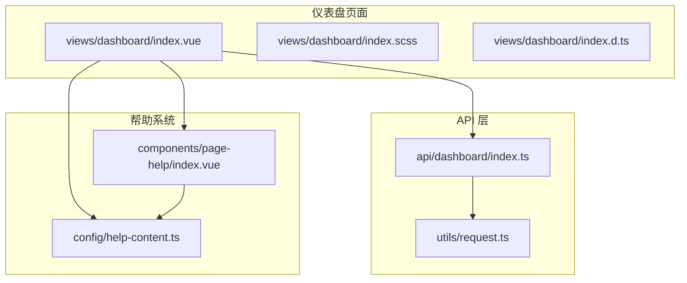
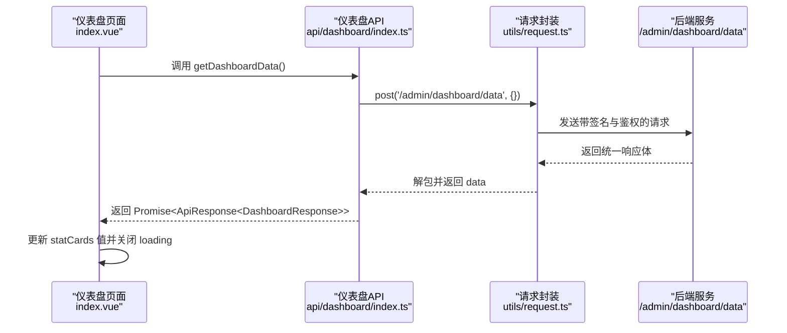
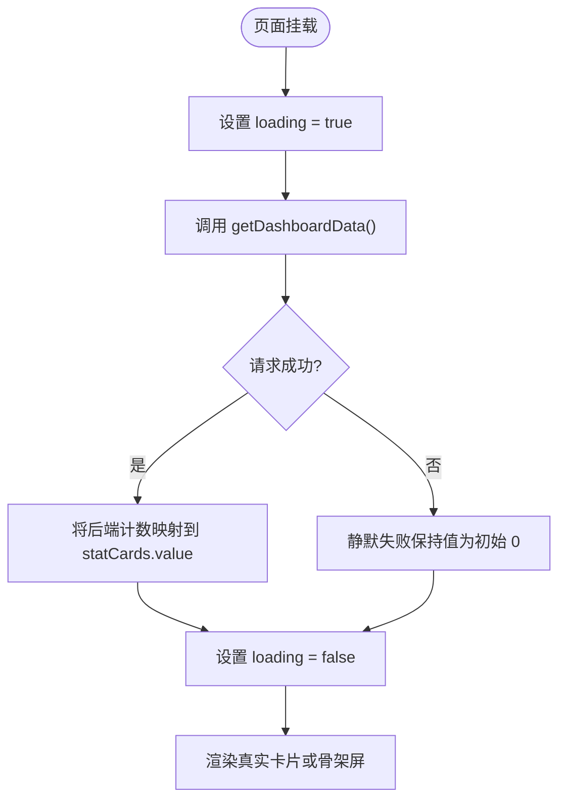
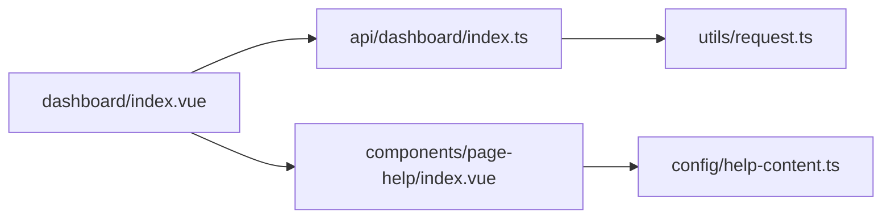

# 仪表盘模块

<cite>
**本文引用的文件列表**
- [仪表盘页面组件](file://class_record_admin_front/src/views/dashboard/index.vue)
- [仪表盘样式](file://class_record_admin_front/src/views/dashboard/index.scss)
- [仪表盘类型定义](file://class_record_admin_front/src/views/dashboard/index.d.ts)
- [仪表盘 API 封装](file://class_record_admin_front/src/api/dashboard/index.ts)
- [HTTP 请求封装与鉴权拦截器](file://class_record_admin_front/src/utils/request.ts)
- [页面帮助组件](file://class_record_admin_front/src/components/page-help/index.vue)
- [帮助内容配置](file://class_record_admin_front/src/config/help-content.ts)
</cite>

## 目录
1. [简介](#简介)
2. [项目结构](#项目结构)
3. [核心组件](#核心组件)
4. [架构总览](#架构总览)
5. [详细组件分析](#详细组件分析)
6. [依赖关系分析](#依赖关系分析)
7. [性能考虑](#性能考虑)
8. [故障排查指南](#故障排查指南)
9. [结论](#结论)
10. [附录：扩展开发指南](#附录扩展开发指南)

## 简介
本模块为后台管理系统的“仪表盘”页面，负责展示系统关键统计数据（如学生总数、教师总数、机构总数、课程总数、班级总数），并提供加载骨架屏、错误静默降级、响应式布局以及页面内帮助提示。该模块通过统一的 HTTP 请求封装调用后端接口，完成数据获取与绑定，同时结合 Element Plus 的栅格与图标体系实现美观的卡片展示。

## 项目结构
仪表盘相关代码位于前端工程 class_record_admin_front 中，采用按功能域组织的方式：
- views/dashboard：页面视图与样式、类型定义
- api/dashboard：页面级 API 封装
- components/page-help：通用页面帮助气泡组件
- config/help-content：各页面帮助文案集中配置
- utils/request：统一 axios 实例、签名、刷新令牌、错误处理等

图表来源
- [仪表盘页面组件:1-106](file://class_record_admin_front/src/views/dashboard/index.vue#L1-L106)
- [仪表盘样式:1-128](file://class_record_admin_front/src/views/dashboard/index.scss#L1-L128)
- [仪表盘类型定义:1-8](file://class_record_admin_front/src/views/dashboard/index.d.ts#L1-L8)
- [仪表盘 API 封装:1-6](file://class_record_admin_front/src/api/dashboard/index.ts#L1-L6)
- [HTTP 请求封装与鉴权拦截器:1-222](file://class_record_admin_front/src/utils/request.ts#L1-L222)
- [页面帮助组件:1-33](file://class_record_admin_front/src/components/page-help/index.vue#L1-L33)
- [帮助内容配置:1-30](file://class_record_admin_front/src/config/help-content.ts#L1-L30)

章节来源
- [仪表盘页面组件:1-106](file://class_record_admin_front/src/views/dashboard/index.vue#L1-L106)
- [仪表盘样式:1-128](file://class_record_admin_front/src/views/dashboard/index.scss#L1-L128)
- [仪表盘类型定义:1-8](file://class_record_admin_front/src/views/dashboard/index.d.ts#L1-L8)
- [仪表盘 API 封装:1-6](file://class_record_admin_front/src/api/dashboard/index.ts#L1-L6)
- [HTTP 请求封装与鉴权拦截器:1-222](file://class_record_admin_front/src/utils/request.ts#L1-L222)
- [页面帮助组件:1-33](file://class_record_admin_front/src/components/page-help/index.vue#L1-L33)
- [帮助内容配置:1-30](file://class_record_admin_front/src/config/help-content.ts#L1-L30)

## 核心组件
- 仪表盘页面组件：负责初始化统计卡片、发起数据请求、渲染真实数据或骨架屏、集成帮助气泡。
- 仪表盘 API 封装：提供 getDashboardData 方法，统一调用 /admin/dashboard/data 接口。
- HTTP 请求封装：提供 post/get/put/del 等方法，内置鉴权、签名、刷新令牌、错误提示等逻辑。
- 页面帮助组件：以悬浮气泡形式展示帮助内容，内容由 help-content 配置驱动。
- 帮助内容配置：集中维护各页面的帮助文案，便于统一管理与多语言扩展。

章节来源
- [仪表盘页面组件:1-106](file://class_record_admin_front/src/views/dashboard/index.vue#L1-L106)
- [仪表盘 API 封装:1-6](file://class_record_admin_front/src/api/dashboard/index.ts#L1-L6)
- [HTTP 请求封装与鉴权拦截器:1-222](file://class_record_admin_front/src/utils/request.ts#L1-L222)
- [页面帮助组件:1-33](file://class_record_admin_front/src/components/page-help/index.vue#L1-L33)
- [帮助内容配置:1-30](file://class_record_admin_front/src/config/help-content.ts#L1-L30)

## 架构总览
从页面到后端的完整调用链路如下：

图表来源
- [仪表盘页面组件:47-68](file://class_record_admin_front/src/views/dashboard/index.vue#L47-L68)
- [仪表盘 API 封装:1-6](file://class_record_admin_front/src/api/dashboard/index.ts#L1-L6)
- [HTTP 请求封装与鉴权拦截器:33-53](file://class_record_admin_front/src/utils/request.ts#L33-L53)

## 详细组件分析

### 仪表盘页面组件（index.vue）
- 数据模型与状态
  - 使用 ref 维护 loading 状态与 statCards 数组。
  - StatCard 类型包含 label、value、icon、color、bgColor 字段，用于描述每个统计卡片的展示信息。
- 数据获取流程
  - onMounted 生命周期中触发 fetchDashboardData。
  - 设置 loading=true，调用 getDashboardData，成功后将后端返回的 studentCount、teacherCount、institutionCount、courseCount、classCount 映射到 statCards 对应项的 value。
  - 异常时静默失败（不弹窗），最终在 finally 中关闭 loading。
- 模板与交互
  - 使用 el-row/el-col 栅格布局，v-if/v-else 切换真实数据与骨架屏。
  - 每张卡片通过 :style 动态绑定背景色与前景色，图标来自 @element-plus/icons-vue，并使用 markRaw 避免不必要的响应式开销。
- 帮助系统集成
  - 引入 PageHelp 组件，传入 HELP.dashboard 文案，作为标题右侧的帮助气泡。

图表来源
- [仪表盘页面组件:47-68](file://class_record_admin_front/src/views/dashboard/index.vue#L47-L68)
- [仪表盘类型定义:1-8](file://class_record_admin_front/src/views/dashboard/index.d.ts#L1-L8)

章节来源
- [仪表盘页面组件:1-106](file://class_record_admin_front/src/views/dashboard/index.vue#L1-L106)
- [仪表盘类型定义:1-8](file://class_record_admin_front/src/views/dashboard/index.d.ts#L1-L8)

### 仪表盘样式（index.scss）
- 页面进入动画：使用 CSS keyframes 实现淡入上移效果。
- 卡片样式：圆角、边框、阴影、悬停上浮与阴影加深，提升视觉层次。
- 骨架屏：通过渐变背景与动画模拟占位，避免白屏等待感。
- 主题变量：大量使用 CSS 变量（如 --color-surface、--color-text-primary、--color-border、--color-shadow-*、--font-heading 等），便于全局主题定制。

章节来源
- [仪表盘样式:1-128](file://class_record_admin_front/src/views/dashboard/index.scss#L1-L128)

### 仪表盘 API 封装（api/dashboard/index.ts）
- 暴露 getDashboardData 函数，内部通过 post 方法调用 /admin/dashboard/data。
- 返回值类型为 Promise<ApiResponse<DashboardResponse>>，由 request 封装统一解包。

章节来源
- [仪表盘 API 封装:1-6](file://class_record_admin_front/src/api/dashboard/index.ts#L1-L6)

### HTTP 请求封装与鉴权拦截器（utils/request.ts）
- 基础配置：baseURL 根据环境变量区分生产与本地；超时时间 15s。
- 请求拦截器：
  - 自动注入 Authorization Bearer token。
  - 生成 x-sign、x-timestamp、x-nonce 签名头，增强安全性。
- 响应拦截器：
  - 成功时直接返回 response.data。
  - 401 处理：支持 refresh_token 续签；若续签失败则清理用户态并跳转登录页；并发请求排队重试。
  - 其他错误：提取 message/msg 并 ElMessage.error 提示。
  - 网络异常：统一提示。
- 便捷方法：get/post/put/del 统一包装，返回 ApiResponse<T>。

章节来源
- [HTTP 请求封装与鉴权拦截器:1-222](file://class_record_admin_front/src/utils/request.ts#L1-L222)

### 页面帮助组件（page-help/index.vue）
- 基于 el-popover 实现悬浮气泡，hover 触发，宽度固定。
- 接收 content 字符串属性，支持换行显示。
- 图标使用 QuestionFilled，悬停变色，符合设计一致性。

章节来源
- [页面帮助组件:1-33](file://class_record_admin_front/src/components/page-help/index.vue#L1-L33)

### 帮助内容配置（help-content.ts）
- 以键值对形式维护各页面帮助文案，key 与路由或页面标识一致。
- dashboard 键对应的文案说明仪表盘用途与主要卡片含义。

章节来源
- [帮助内容配置:1-30](file://class_record_admin_front/src/config/help-content.ts#L1-L30)

## 依赖关系分析
- 组件耦合度低：页面仅依赖 API 封装与帮助组件，业务逻辑集中在页面内，易于测试与维护。
- 外部依赖：
  - Element Plus：栅格、图标、消息提示、Popover。
  - Axios：HTTP 客户端。
  - Vue 3 组合式 API：ref、onMounted、markRaw。
- 潜在循环依赖：无直接循环引用。

图表来源
- [仪表盘页面组件:1-106](file://class_record_admin_front/src/views/dashboard/index.vue#L1-L106)
- [仪表盘 API 封装:1-6](file://class_record_admin_front/src/api/dashboard/index.ts#L1-L6)
- [HTTP 请求封装与鉴权拦截器:1-222](file://class_record_admin_front/src/utils/request.ts#L1-L222)
- [页面帮助组件:1-33](file://class_record_admin_front/src/components/page-help/index.vue#L1-L33)
- [帮助内容配置:1-30](file://class_record_admin_front/src/config/help-content.ts#L1-L30)

章节来源
- [仪表盘页面组件:1-106](file://class_record_admin_front/src/views/dashboard/index.vue#L1-L106)
- [仪表盘 API 封装:1-6](file://class_record_admin_front/src/api/dashboard/index.ts#L1-L6)
- [HTTP 请求封装与鉴权拦截器:1-222](file://class_record_admin_front/src/utils/request.ts#L1-L222)
- [页面帮助组件:1-33](file://class_record_admin_front/src/components/page-help/index.vue#L1-L33)
- [帮助内容配置:1-30](file://class_record_admin_front/src/config/help-content.ts#L1-L30)

## 性能考虑
- 减少响应式开销：图标使用 markRaw 包裹，避免 Vue 对静态图标进行不必要的响应式追踪。
- 骨架屏替代空白等待：loading 期间展示骨架屏，提升感知性能。
- 错误静默降级：异常时不中断用户浏览体验，卡片默认显示 0。
- 请求拦截优化：
  - 统一签名与鉴权，避免重复逻辑。
  - 401 并发续签队列，防止雪崩式重试。
- 建议进一步优化点：
  - 防抖/节流：如需频繁刷新，可加入防抖策略。
  - 缓存：对不常变化的统计数据增加短期缓存（如内存缓存或浏览器缓存）。
  - 懒加载：仅在可见区域渲染更多复杂组件（当前为轻量卡片，收益有限）。

[本节为通用性能建议，不直接分析具体文件]

## 故障排查指南
- 401 未授权
  - 现象：请求被拦截，可能跳转到登录页。
  - 排查：检查 localStorage 中的 admin_token 与 admin_refresh_token 是否存在且有效；确认服务端是否签发新 token。
  - 参考：请求拦截器的 401 处理与续签逻辑。
- 网络异常
  - 现象：ElMessage 提示“网络异常”。
  - 排查：检查网络连接、代理配置、跨域设置。
- 数据为空或为 0
  - 现象：卡片数值始终为 0。
  - 排查：确认后端 /admin/dashboard/data 是否返回预期字段；检查请求是否被拦截器正确附加签名与鉴权头。
- 帮助气泡不显示
  - 现象：点击或悬停无内容。
  - 排查：确认 HELP.dashboard 是否存在；检查 PageHelp 组件是否正确接收 content 属性。

章节来源
- [HTTP 请求封装与鉴权拦截器:55-190](file://class_record_admin_front/src/utils/request.ts#L55-L190)
- [仪表盘页面组件:47-68](file://class_record_admin_front/src/views/dashboard/index.vue#L47-L68)
- [页面帮助组件:1-33](file://class_record_admin_front/src/components/page-help/index.vue#L1-L33)
- [帮助内容配置:1-30](file://class_record_admin_front/src/config/help-content.ts#L1-L30)

## 结论
仪表盘模块以简洁清晰的职责划分实现了统计数据的可视化展示：页面组件负责数据绑定与 UI 渲染，API 层统一封装接口，请求层提供鉴权、签名与错误处理，帮助系统通过配置化方式提供上下文说明。整体结构清晰、扩展性强，适合在此基础上继续丰富更多统计维度与交互能力。

[本节为总结性内容，不直接分析具体文件]

## 附录：扩展开发指南

### 新增统计项的步骤
- 定义数据结构
  - 在类型文件中补充 StatCard 字段或新增类型（如需）。
  - 参考路径：[仪表盘类型定义:1-8](file://class_record_admin_front/src/views/dashboard/index.d.ts#L1-L8)
- 添加卡片配置
  - 在 statCards 数组中新增一项，包含 label、value、icon、color、bgColor。
  - 参考路径：[仪表盘页面组件:9-45](file://class_record_admin_front/src/views/dashboard/index.vue#L9-L45)
- 对接后端数据
  - 在后端新增对应统计字段，并在 getDashboardData 返回的 DashboardResponse 中包含该字段。
  - 在页面中将该字段映射到新卡片的 value。
  - 参考路径：[仪表盘页面组件:52-58](file://class_record_admin_front/src/views/dashboard/index.vue#L52-L58)
- 调整布局
  - 如需改变每行卡片数量，调整 el-col 的 span 值或栅格断点。
  - 参考路径：[仪表盘页面组件:77-89](file://class_record_admin_front/src/views/dashboard/index.vue#L77-L89)
- 可选：添加帮助说明
  - 在 help-content.ts 中补充对应帮助文案，并在页面中引入。
  - 参考路径：[帮助内容配置:1-30](file://class_record_admin_front/src/config/help-content.ts#L1-L30)、[仪表盘页面组件](file://class_record_admin_front/src/views/dashboard/index.vue#L74)

### 最佳实践
- 图标选择：优先使用 @element-plus/icons-vue 的语义化图标，并通过 markRaw 避免响应式开销。
- 颜色规范：使用一致的 color 与 bgColor 搭配，确保对比度与可读性。
- 错误处理：保持静默降级，必要时在控制台输出日志以便定位问题。
- 可访问性：为重要数字提供适当的 aria-label 或 title 辅助文本。
- 主题适配：尽量使用 CSS 变量，便于后续主题切换与深色模式支持。

### 代码示例路径
- 数据获取与绑定：[仪表盘页面组件:47-68](file://class_record_admin_front/src/views/dashboard/index.vue#L47-L68)
- 卡片渲染与骨架屏：[仪表盘页面组件:77-101](file://class_record_admin_front/src/views/dashboard/index.vue#L77-L101)
- 帮助气泡集成：[仪表盘页面组件](file://class_record_admin_front/src/views/dashboard/index.vue#L74)、[页面帮助组件:1-33](file://class_record_admin_front/src/components/page-help/index.vue#L1-L33)
- 请求封装与鉴权：[HTTP 请求封装与鉴权拦截器:33-53](file://class_record_admin_front/src/utils/request.ts#L33-L53)、[仪表盘 API 封装:1-6](file://class_record_admin_front/src/api/dashboard/index.ts#L1-L6)