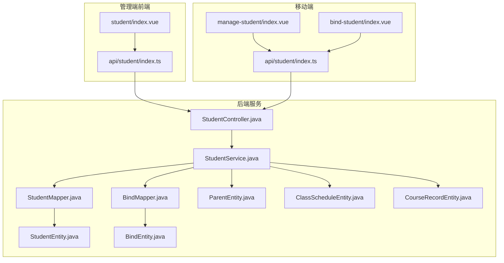
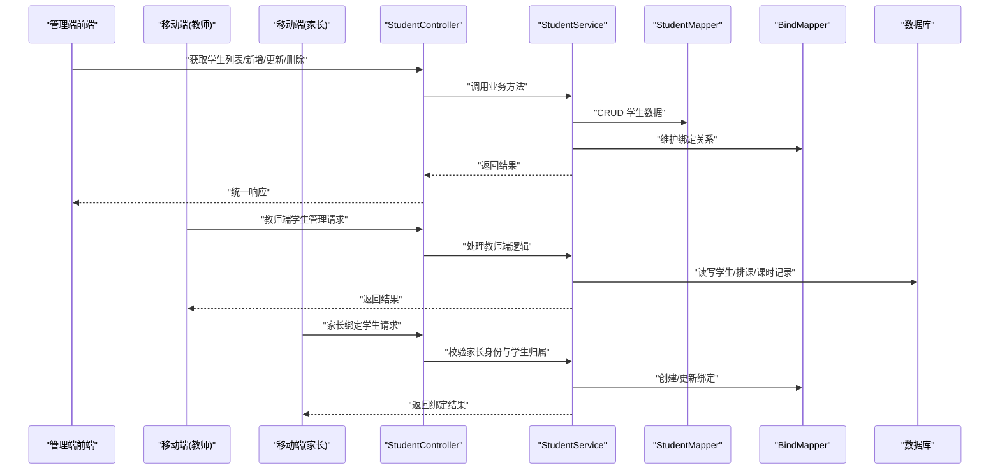
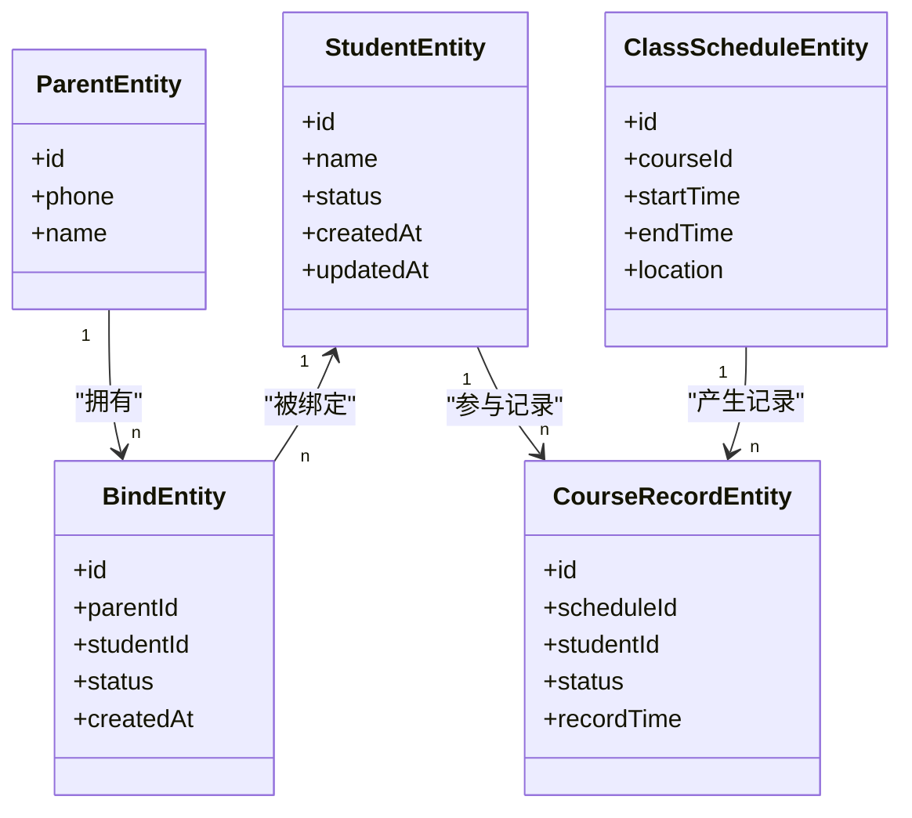
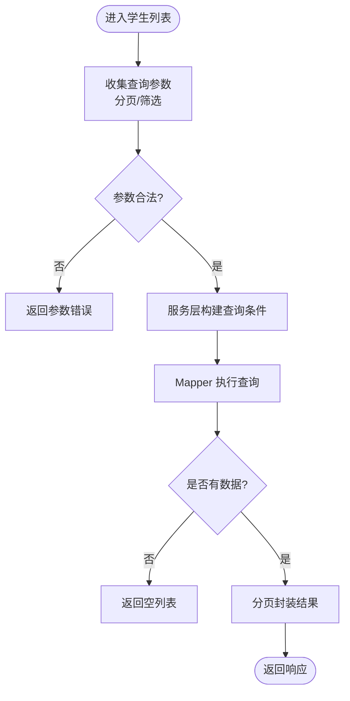
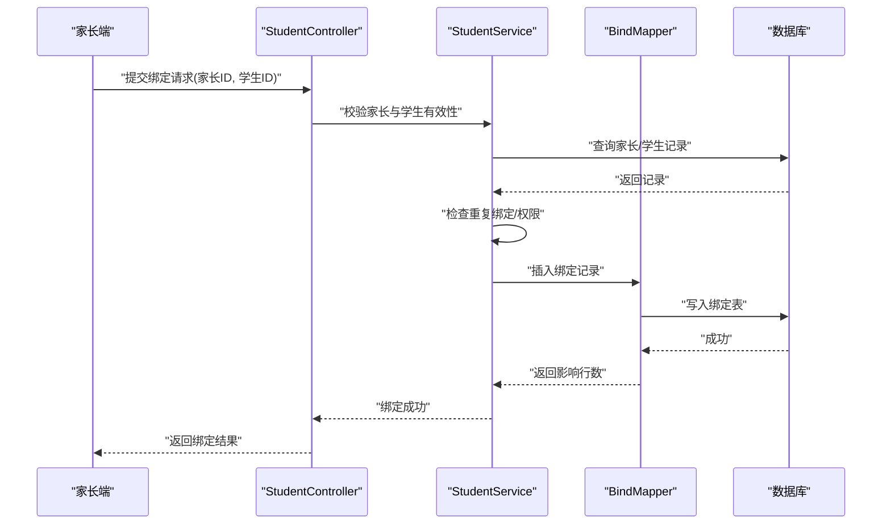
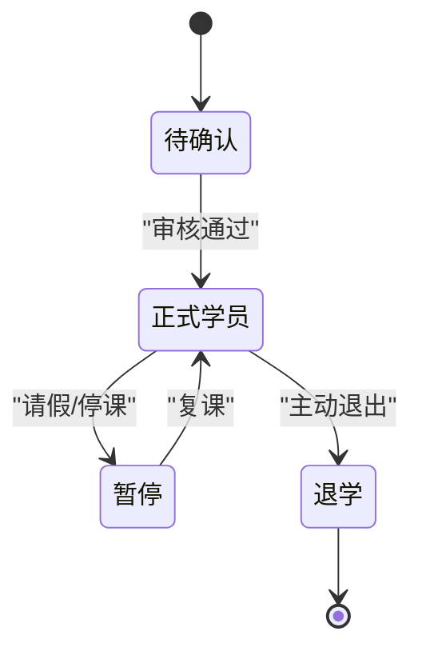
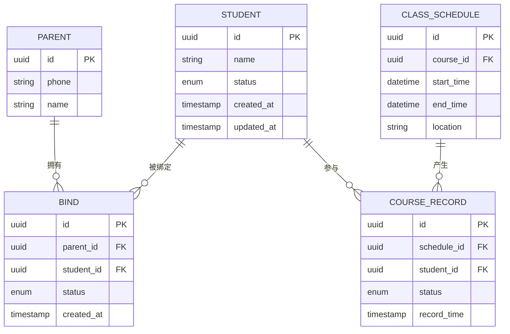
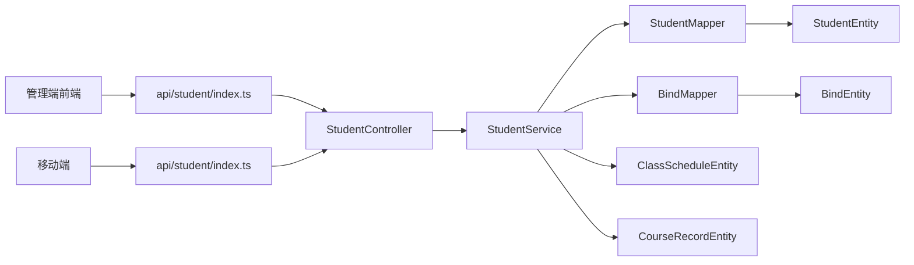

# 学生管理模块

<cite>
**本文引用的文件**   
- [class_times_record_back/business-service/src/main/java/com/shiroko/controller/StudentController.java](file://class_times_record_back/business-service/src/main/java/com/shiroko/controller/StudentController.java)
- [class_times_record_back/business-service/src/main/java/com/shiroko/service/StudentService.java](file://class_times_record_back/business-service/src/main/java/com/shiroko/service/StudentService.java)
- [class_times_record_back/business-service/src/main/java/com/shiroko/repository/entity/StudentEntity.java](file://class_times_record_back/business-service/src/main/java/com/shiroko/repository/entity/StudentEntity.java)
- [class_times_record_back/business-service/src/main/java/com/shiroko/repository/mapper/StudentMapper.java](file://class_times_record_back/business-service/src/main/java/com/shiroko/repository/mapper/StudentMapper.java)
- [class_times_record_back/business-service/src/main/java/com/shiroko/repository/entity/ParentEntity.java](file://class_times_record_back/business-service/src/main/java/com/shiroko/repository/entity/ParentEntity.java)
- [class_times_record_back/business-service/src/main/java/com/shiroko/repository/entity/BindEntity.java](file://class_times_record_back/business-service/src/main/java/com/shiroko/repository/entity/BindEntity.java)
- [class_times_record_back/business-service/src/main/java/com/shiroko/repository/mapper/BindMapper.java](file://class_times_record_back/business-service/src/main/java/com/shiroko/repository/mapper/BindMapper.java)
- [class_times_record_back/business-service/src/main/java/com/shiroko/repository/entity/ClassScheduleEntity.java](file://class_times_record_back/business-service/src/main/java/com/shiroko/repository/entity/ClassScheduleEntity.java)
- [class_times_record_back/business-service/src/main/java/com/shiroko/repository/entity/CourseRecordEntity.java](file://class_times_record_back/business-service/src/main/java/com/shiroko/repository/entity/CourseRecordEntity.java)
- [class_times_record_admin_front/src/api/student/index.ts](file://class_times_record_admin_front/src/api/student/index.ts)
- [class_times_record_admin_front/src/views/business/student/index.vue](file://class_times_record_admin_front/src/views/business/student/index.vue)
- [class_times_record/src/api/student/index.ts](file://class_times_record/src/api/student/index.ts)
- [class_times_record/src/pages/main/teacher/manage-student/index.vue](file://class_times_record/src/pages/main/teacher/manage-student/index.vue)
- [class_times_record/src/pages/main/parent/bind-student/index.vue](file://class_times_record/src/pages/main/parent/bind-student/index.vue)
- [class_times_record/src/types/student.d.ts](file://class_times_record/src/types/student.d.ts)
- [class_times_record/src/types/bind.d.ts](file://class_times_record/src/types/bind.d.ts)
</cite>

## 目录
1. [简介](#简介)
2. [项目结构](#项目结构)
3. [核心组件](#核心组件)
4. [架构总览](#架构总览)
5. [详细组件分析](#详细组件分析)
6. [依赖关系分析](#依赖关系分析)
7. [性能考虑](#性能考虑)
8. [故障排查指南](#故障排查指南)
9. [结论](#结论)
10. [附录：API 接口文档与最佳实践](#附录api-接口文档与最佳实践)

## 简介
本模块聚焦于“学生管理”的完整能力，覆盖学生信息管理、家长绑定、正式学员状态管理、与班级课程关联等核心业务。文档从系统架构、数据流、处理逻辑、集成点、错误处理与性能特性等多维度进行解析，并提供面向前端的 API 使用方式与数据处理最佳实践，帮助开发者快速理解并高效扩展该模块。

## 项目结构
学生管理涉及前后端多端协作：
- 后端（business-service）提供学生、家长、绑定关系、排课与课时记录的持久化与业务编排。
- 管理端前端（admin-front）提供学生列表、新增、编辑、删除、批量操作与导入导出入口。
- 移动端（uni-app）提供教师端学生管理与家长端绑定学生功能。

图表来源
- [class_times_record_admin_front/src/views/business/student/index.vue](file://class_times_record_admin_front/src/views/business/student/index.vue)
- [class_times_record_admin_front/src/api/student/index.ts](file://class_times_record_admin_front/src/api/student/index.ts)
- [class_times_record/src/pages/main/teacher/manage-student/index.vue](file://class_times_record/src/pages/main/teacher/manage-student/index.vue)
- [class_times_record/src/pages/main/parent/bind-student/index.vue](file://class_times_record/src/pages/main/parent/bind-student/index.vue)
- [class_times_record/src/api/student/index.ts](file://class_times_record/src/api/student/index.ts)
- [class_times_record_back/business-service/src/main/java/com/shiroko/controller/StudentController.java](file://class_times_record_back/business-service/src/main/java/com/shiroko/controller/StudentController.java)
- [class_times_record_back/business-service/src/main/java/com/shiroko/service/StudentService.java](file://class_times_record_back/business-service/src/main/java/com/shiroko/service/StudentService.java)
- [class_times_record_back/business-service/src/main/java/com/shiroko/repository/mapper/StudentMapper.java](file://class_times_record_back/business-service/src/main/java/com/shiroko/repository/mapper/StudentMapper.java)
- [class_times_record_back/business-service/src/main/java/com/shiroko/repository/mapper/BindMapper.java](file://class_times_record_back/business-service/src/main/java/com/shiroko/repository/mapper/BindMapper.java)
- [class_times_record_back/business-service/src/main/java/com/shiroko/repository/entity/StudentEntity.java](file://class_times_record_back/business-service/src/main/java/com/shiroko/repository/entity/StudentEntity.java)
- [class_times_record_back/business-service/src/main/java/com/shiroko/repository/entity/ParentEntity.java](file://class_times_record_back/business-service/src/main/java/com/shiroko/repository/entity/ParentEntity.java)
- [class_times_record_back/business-service/src/main/java/com/shiroko/repository/entity/BindEntity.java](file://class_times_record_back/business-service/src/main/java/com/shiroko/repository/entity/BindEntity.java)
- [class_times_record_back/business-service/src/main/java/com/shiroko/repository/entity/ClassScheduleEntity.java](file://class_times_record_back/business-service/src/main/java/com/shiroko/repository/entity/ClassScheduleEntity.java)
- [class_times_record_back/business-service/src/main/java/com/shiroko/repository/entity/CourseRecordEntity.java](file://class_times_record_back/business-service/src/main/java/com/shiroko/repository/entity/CourseRecordEntity.java)

章节来源
- [class_times_record_admin_front/src/views/business/student/index.vue](file://class_times_record_admin_front/src/views/business/student/index.vue)
- [class_times_record_admin_front/src/api/student/index.ts](file://class_times_record_admin_front/src/api/student/index.ts)
- [class_times_record/src/pages/main/teacher/manage-student/index.vue](file://class_times_record/src/pages/main/teacher/manage-student/index.vue)
- [class_times_record/src/pages/main/parent/bind-student/index.vue](file://class_times_record/src/pages/main/parent/bind-student/index.vue)
- [class_times_record/src/api/student/index.ts](file://class_times_record/src/api/student/index.ts)
- [class_times_record_back/business-service/src/main/java/com/shiroko/controller/StudentController.java](file://class_times_record_back/business-service/src/main/java/com/shiroko/controller/StudentController.java)
- [class_times_record_back/business-service/src/main/java/com/shiroko/service/StudentService.java](file://class_times_record_back/business-service/src/main/java/com/shiroko/service/StudentService.java)
- [class_times_record_back/business-service/src/main/java/com/shiroko/repository/mapper/StudentMapper.java](file://class_times_record_back/business-service/src/main/java/com/shiroko/repository/mapper/StudentMapper.java)
- [class_times_record_back/business-service/src/main/java/com/shiroko/repository/mapper/BindMapper.java](file://class_times_record_back/business-service/src/main/java/com/shiroko/repository/mapper/BindMapper.java)
- [class_times_record_back/business-service/src/main/java/com/shiroko/repository/entity/StudentEntity.java](file://class_times_record_back/business-service/src/main/java/com/shiroko/repository/entity/StudentEntity.java)
- [class_times_record_back/business-service/src/main/java/com/shiroko/repository/entity/ParentEntity.java](file://class_times_record_back/business-service/src/main/java/com/shiroko/repository/entity/ParentEntity.java)
- [class_times_record_back/business-service/src/main/java/com/shiroko/repository/entity/BindEntity.java](file://class_times_record_back/business-service/src/main/java/com/shiroko/repository/entity/BindEntity.java)
- [class_times_record_back/business-service/src/main/java/com/shiroko/repository/entity/ClassScheduleEntity.java](file://class_times_record_back/business-service/src/main/java/com/shiroko/repository/entity/ClassScheduleEntity.java)
- [class_times_record_back/business-service/src/main/java/com/shiroko/repository/entity/CourseRecordEntity.java](file://class_times_record_back/business-service/src/main/java/com/shiroko/repository/entity/CourseRecordEntity.java)

## 核心组件
- 控制器层：暴露学生相关 REST 接口，负责参数校验、权限控制与响应封装。
- 服务层：实现学生信息 CRUD、家长绑定、正式学员状态流转、与排课/课时记录关联的业务编排。
- 数据访问层：通过 Mapper 对实体进行增删改查与复杂查询。
- 实体模型：学生、家长、绑定关系、排课、课时记录等核心领域对象。
- 前端调用：管理端与移动端分别封装 API 调用，驱动页面交互。

章节来源
- [class_times_record_back/business-service/src/main/java/com/shiroko/controller/StudentController.java](file://class_times_record_back/business-service/src/main/java/com/shiroko/controller/StudentController.java)
- [class_times_record_back/business-service/src/main/java/com/shiroko/service/StudentService.java](file://class_times_record_back/business-service/src/main/java/com/shiroko/service/StudentService.java)
- [class_times_record_back/business-service/src/main/java/com/shiroko/repository/mapper/StudentMapper.java](file://class_times_record_back/business-service/src/main/java/com/shiroko/repository/mapper/StudentMapper.java)
- [class_times_record_back/business-service/src/main/java/com/shiroko/repository/mapper/BindMapper.java](file://class_times_record_back/business-service/src/main/java/com/shiroko/repository/mapper/BindMapper.java)
- [class_times_record_back/business-service/src/main/java/com/shiroko/repository/entity/StudentEntity.java](file://class_times_record_back/business-service/src/main/java/com/shiroko/repository/entity/StudentEntity.java)
- [class_times_record_back/business-service/src/main/java/com/shiroko/repository/entity/ParentEntity.java](file://class_times_record_back/business-service/src/main/java/com/shiroko/repository/entity/ParentEntity.java)
- [class_times_record_back/business-service/src/main/java/com/shiroko/repository/entity/BindEntity.java](file://class_times_record_back/business-service/src/main/java/com/shiroko/repository/entity/BindEntity.java)
- [class_times_record_back/business-service/src/main/java/com/shiroko/repository/entity/ClassScheduleEntity.java](file://class_times_record_back/business-service/src/main/java/com/shiroko/repository/entity/ClassScheduleEntity.java)
- [class_times_record_back/business-service/src/main/java/com/shiroko/repository/entity/CourseRecordEntity.java](file://class_times_record_back/business-service/src/main/java/com/shiroko/repository/entity/CourseRecordEntity.java)
- [class_times_record_admin_front/src/api/student/index.ts](file://class_times_record_admin_front/src/api/student/index.ts)
- [class_times_record/src/api/student/index.ts](file://class_times_record/src/api/student/index.ts)

## 架构总览
学生管理采用分层架构：前端通过 API 调用控制器，控制器委托服务完成业务编排，服务再调用 Mapper 访问数据库。关键流程包括学生信息的增删改查、家长绑定校验与建立、正式学员状态变更以及与排课和课时记录的关联。

图表来源
- [class_times_record_back/business-service/src/main/java/com/shiroko/controller/StudentController.java](file://class_times_record_back/business-service/src/main/java/com/shiroko/controller/StudentController.java)
- [class_times_record_back/business-service/src/main/java/com/shiroko/service/StudentService.java](file://class_times_record_back/business-service/src/main/java/com/shiroko/service/StudentService.java)
- [class_times_record_back/business-service/src/main/java/com/shiroko/repository/mapper/StudentMapper.java](file://class_times_record_back/business-service/src/main/java/com/shiroko/repository/mapper/StudentMapper.java)
- [class_times_record_back/business-service/src/main/java/com/shiroko/repository/mapper/BindMapper.java](file://class_times_record_back/business-service/src/main/java/com/shiroko/repository/mapper/BindMapper.java)
- [class_times_record_admin_front/src/api/student/index.ts](file://class_times_record_admin_front/src/api/student/index.ts)
- [class_times_record/src/api/student/index.ts](file://class_times_record/src/api/student/index.ts)

## 详细组件分析

### 学生实体与数据模型
- 学生实体：包含基础信息、状态字段（如是否正式学员）、时间戳等。
- 家长实体：家长身份信息，用于与家长绑定的校验。
- 绑定实体：维护家长与学生的绑定关系，支持一对多或多对一场景。
- 排课实体：课程安排，学生可通过排课与课程关联。
- 课时记录实体：记录学生上课情况，支撑统计与结算。

图表来源
- [class_times_record_back/business-service/src/main/java/com/shiroko/repository/entity/StudentEntity.java](file://class_times_record_back/business-service/src/main/java/com/shiroko/repository/entity/StudentEntity.java)
- [class_times_record_back/business-service/src/main/java/com/shiroko/repository/entity/ParentEntity.java](file://class_times_record_back/business-service/src/main/java/com/shiroko/repository/entity/ParentEntity.java)
- [class_times_record_back/business-service/src/main/java/com/shiroko/repository/entity/BindEntity.java](file://class_times_record_back/business-service/src/main/java/com/shiroko/repository/entity/BindEntity.java)
- [class_times_record_back/business-service/src/main/java/com/shiroko/repository/entity/ClassScheduleEntity.java](file://class_times_record_back/business-service/src/main/java/com/shiroko/repository/entity/ClassScheduleEntity.java)
- [class_times_record_back/business-service/src/main/java/com/shiroko/repository/entity/CourseRecordEntity.java](file://class_times_record_back/business-service/src/main/java/com/shiroko/repository/entity/CourseRecordEntity.java)

章节来源
- [class_times_record_back/business-service/src/main/java/com/shiroko/repository/entity/StudentEntity.java](file://class_times_record_back/business-service/src/main/java/com/shiroko/repository/entity/StudentEntity.java)
- [class_times_record_back/business-service/src/main/java/com/shiroko/repository/entity/ParentEntity.java](file://class_times_record_back/business-service/src/main/java/com/shiroko/repository/entity/ParentEntity.java)
- [class_times_record_back/business-service/src/main/java/com/shiroko/repository/entity/BindEntity.java](file://class_times_record_back/business-service/src/main/java/com/shiroko/repository/entity/BindEntity.java)
- [class_times_record_back/business-service/src/main/java/com/shiroko/repository/entity/ClassScheduleEntity.java](file://class_times_record_back/business-service/src/main/java/com/shiroko/repository/entity/ClassScheduleEntity.java)
- [class_times_record_back/business-service/src/main/java/com/shiroko/repository/entity/CourseRecordEntity.java](file://class_times_record_back/business-service/src/main/java/com/shiroko/repository/entity/CourseRecordEntity.java)

### 学生信息 CRUD 流程
- 列表查询：支持分页、筛选（如姓名、状态、班级），由控制器接收参数后交由服务层组装查询条件，Mapper 执行 SQL。
- 新增学生：校验必填字段与唯一性约束，写入学生表，必要时初始化默认状态。
- 更新学生：按 ID 定位记录，合并更新字段，记录更新时间。
- 删除学生：软删除或硬删除策略需与服务层一致，注意级联清理绑定与记录。

图表来源
- [class_times_record_back/business-service/src/main/java/com/shiroko/controller/StudentController.java](file://class_times_record_back/business-service/src/main/java/com/shiroko/controller/StudentController.java)
- [class_times_record_back/business-service/src/main/java/com/shiroko/service/StudentService.java](file://class_times_record_back/business-service/src/main/java/com/shiroko/service/StudentService.java)
- [class_times_record_back/business-service/src/main/java/com/shiroko/repository/mapper/StudentMapper.java](file://class_times_record_back/business-service/src/main/java/com/shiroko/repository/mapper/StudentMapper.java)

章节来源
- [class_times_record_back/business-service/src/main/java/com/shiroko/controller/StudentController.java](file://class_times_record_back/business-service/src/main/java/com/shiroko/controller/StudentController.java)
- [class_times_record_back/business-service/src/main/java/com/shiroko/service/StudentService.java](file://class_times_record_back/business-service/src/main/java/com/shiroko/service/StudentService.java)
- [class_times_record_back/business-service/src/main/java/com/shiroko/repository/mapper/StudentMapper.java](file://class_times_record_back/business-service/src/main/java/com/shiroko/repository/mapper/StudentMapper.java)

### 家长绑定与验证逻辑
- 绑定前置校验：确认家长身份有效、目标学生存在且未被其他家长重复绑定（依据业务规则）。
- 绑定建立：在绑定表中插入记录，设置初始状态为有效。
- 解绑与重绑：支持解除绑定与重新绑定，需保证事务一致性。
- 权限控制：仅允许本人或授权角色进行绑定操作。

图表来源
- [class_times_record_back/business-service/src/main/java/com/shiroko/controller/StudentController.java](file://class_times_record_back/business-service/src/main/java/com/shiroko/controller/StudentController.java)
- [class_times_record_back/business-service/src/main/java/com/shiroko/service/StudentService.java](file://class_times_record_back/business-service/src/main/java/com/shiroko/service/StudentService.java)
- [class_times_record_back/business-service/src/main/java/com/shiroko/repository/mapper/BindMapper.java](file://class_times_record_back/business-service/src/main/java/com/shiroko/repository/mapper/BindMapper.java)
- [class_times_record/src/pages/main/parent/bind-student/index.vue](file://class_times_record/src/pages/main/parent/bind-student/index.vue)
- [class_times_record/src/types/bind.d.ts](file://class_times_record/src/types/bind.d.ts)

章节来源
- [class_times_record_back/business-service/src/main/java/com/shiroko/controller/StudentController.java](file://class_times_record_back/business-service/src/main/java/com/shiroko/controller/StudentController.java)
- [class_times_record_back/business-service/src/main/java/com/shiroko/service/StudentService.java](file://class_times_record_back/business-service/src/main/java/com/shiroko/service/StudentService.java)
- [class_times_record_back/business-service/src/main/java/com/shiroko/repository/mapper/BindMapper.java](file://class_times_record_back/business-service/src/main/java/com/shiroko/repository/mapper/BindMapper.java)
- [class_times_record/src/pages/main/parent/bind-student/index.vue](file://class_times_record/src/pages/main/parent/bind-student/index.vue)
- [class_times_record/src/types/bind.d.ts](file://class_times_record/src/types/bind.d.ts)

### 正式学员状态管理
- 状态定义：例如“试用/正式/退学/暂停”等，具体枚举以实体与服务层为准。
- 状态流转：由管理员或教师触发，服务层校验前置条件（如绑定关系、排课参与情况）后更新状态。
- 审计与日志：状态变更应记录操作人、时间与原因，便于追溯。

图表来源
- [class_times_record_back/business-service/src/main/java/com/shiroko/repository/entity/StudentEntity.java](file://class_times_record_back/business-service/src/main/java/com/shiroko/repository/entity/StudentEntity.java)
- [class_times_record_back/business-service/src/main/java/com/shiroko/service/StudentService.java](file://class_times_record_back/business-service/src/main/java/com/shiroko/service/StudentService.java)

章节来源
- [class_times_record_back/business-service/src/main/java/com/shiroko/repository/entity/StudentEntity.java](file://class_times_record_back/business-service/src/main/java/com/shiroko/repository/entity/StudentEntity.java)
- [class_times_record_back/business-service/src/main/java/com/shiroko/service/StudentService.java](file://class_times_record_back/business-service/src/main/java/com/shiroko/service/StudentService.java)

### 学生与班级课程的关联关系
- 关联路径：学生通过排课与课程关联；课时记录反映学生实际参与的课程。
- 查询优化：常用查询可基于排课 ID 或课程 ID 聚合学生列表与课时统计。
- 数据一致性：排课变更时需同步更新相关课时记录与统计缓存。

图表来源
- [class_times_record_back/business-service/src/main/java/com/shiroko/repository/entity/StudentEntity.java](file://class_times_record_back/business-service/src/main/java/com/shiroko/repository/entity/StudentEntity.java)
- [class_times_record_back/business-service/src/main/java/com/shiroko/repository/entity/ParentEntity.java](file://class_times_record_back/business-service/src/main/java/com/shiroko/repository/entity/ParentEntity.java)
- [class_times_record_back/business-service/src/main/java/com/shiroko/repository/entity/BindEntity.java](file://class_times_record_back/business-service/src/main/java/com/shiroko/repository/entity/BindEntity.java)
- [class_times_record_back/business-service/src/main/java/com/shiroko/repository/entity/ClassScheduleEntity.java](file://class_times_record_back/business-service/src/main/java/com/shiroko/repository/entity/ClassScheduleEntity.java)
- [class_times_record_back/business-service/src/main/java/com/shiroko/repository/entity/CourseRecordEntity.java](file://class_times_record_back/business-service/src/main/java/com/shiroko/repository/entity/CourseRecordEntity.java)

章节来源
- [class_times_record_back/business-service/src/main/java/com/shiroko/repository/entity/StudentEntity.java](file://class_times_record_back/business-service/src/main/java/com/shiroko/repository/entity/StudentEntity.java)
- [class_times_record_back/business-service/src/main/java/com/shiroko/repository/entity/ParentEntity.java](file://class_times_record_back/business-service/src/main/java/com/shiroko/repository/entity/ParentEntity.java)
- [class_times_record_back/business-service/src/main/java/com/shiroko/repository/entity/BindEntity.java](file://class_times_record_back/business-service/src/main/java/com/shiroko/repository/entity/BindEntity.java)
- [class_times_record_back/business-service/src/main/java/com/shiroko/repository/entity/ClassScheduleEntity.java](file://class_times_record_back/business-service/src/main/java/com/shiroko/repository/entity/ClassScheduleEntity.java)
- [class_times_record_back/business-service/src/main/java/com/shiroko/repository/entity/CourseRecordEntity.java](file://class_times_record_back/business-service/src/main/java/com/shiroko/repository/entity/CourseRecordEntity.java)

### 前端调用与页面集成
- 管理端：提供学生列表、新增、编辑、删除、批量操作与导入导出入口，调用统一的 API 封装。
- 移动端（教师）：提供学生管理页面，支持查看、编辑与状态调整。
- 移动端（家长）：提供绑定学生页面，支持绑定、解绑与查看已绑定学生。

章节来源
- [class_times_record_admin_front/src/views/business/student/index.vue](file://class_times_record_admin_front/src/views/business/student/index.vue)
- [class_times_record_admin_front/src/api/student/index.ts](file://class_times_record_admin_front/src/api/student/index.ts)
- [class_times_record/src/pages/main/teacher/manage-student/index.vue](file://class_times_record/src/pages/main/teacher/manage-student/index.vue)
- [class_times_record/src/pages/main/parent/bind-student/index.vue](file://class_times_record/src/pages/main/parent/bind-student/index.vue)
- [class_times_record/src/api/student/index.ts](file://class_times_record/src/api/student/index.ts)
- [class_times_record/src/types/student.d.ts](file://class_times_record/src/types/student.d.ts)

## 依赖关系分析
- 控制器依赖服务：StudentController 依赖 StudentService 完成业务编排。
- 服务依赖 Mapper：StudentService 依赖 StudentMapper 与 BindMapper 进行数据访问。
- 实体间关系：绑定关系连接家长与学生；课时记录连接排课与学生。
- 前端依赖 API：管理端与移动端通过各自 API 模块调用后端接口。

图表来源
- [class_times_record_back/business-service/src/main/java/com/shiroko/controller/StudentController.java](file://class_times_record_back/business-service/src/main/java/com/shiroko/controller/StudentController.java)
- [class_times_record_back/business-service/src/main/java/com/shiroko/service/StudentService.java](file://class_times_record_back/business-service/src/main/java/com/shiroko/service/StudentService.java)
- [class_times_record_back/business-service/src/main/java/com/shiroko/repository/mapper/StudentMapper.java](file://class_times_record_back/business-service/src/main/java/com/shiroko/repository/mapper/StudentMapper.java)
- [class_times_record_back/business-service/src/main/java/com/shiroko/repository/mapper/BindMapper.java](file://class_times_record_back/business-service/src/main/java/com/shiroko/repository/mapper/BindMapper.java)
- [class_times_record_back/business-service/src/main/java/com/shiroko/repository/entity/StudentEntity.java](file://class_times_record_back/business-service/src/main/java/com/shiroko/repository/entity/StudentEntity.java)
- [class_times_record_back/business-service/src/main/java/com/shiroko/repository/entity/BindEntity.java](file://class_times_record_back/business-service/src/main/java/com/shiroko/repository/entity/BindEntity.java)
- [class_times_record_back/business-service/src/main/java/com/shiroko/repository/entity/ClassScheduleEntity.java](file://class_times_record_back/business-service/src/main/java/com/shiroko/repository/entity/ClassScheduleEntity.java)
- [class_times_record_back/business-service/src/main/java/com/shiroko/repository/entity/CourseRecordEntity.java](file://class_times_record_back/business-service/src/main/java/com/shiroko/repository/entity/CourseRecordEntity.java)
- [class_times_record_admin_front/src/api/student/index.ts](file://class_times_record_admin_front/src/api/student/index.ts)
- [class_times_record/src/api/student/index.ts](file://class_times_record/src/api/student/index.ts)

章节来源
- [class_times_record_back/business-service/src/main/java/com/shiroko/controller/StudentController.java](file://class_times_record_back/business-service/src/main/java/com/shiroko/controller/StudentController.java)
- [class_times_record_back/business-service/src/main/java/com/shiroko/service/StudentService.java](file://class_times_record_back/business-service/src/main/java/com/shiroko/service/StudentService.java)
- [class_times_record_back/business-service/src/main/java/com/shiroko/repository/mapper/StudentMapper.java](file://class_times_record_back/business-service/src/main/java/com/shiroko/repository/mapper/StudentMapper.java)
- [class_times_record_back/business-service/src/main/java/com/shiroko/repository/mapper/BindMapper.java](file://class_times_record_back/business-service/src/main/java/com/shiroko/repository/mapper/BindMapper.java)
- [class_times_record_back/business-service/src/main/java/com/shiroko/repository/entity/StudentEntity.java](file://class_times_record_back/business-service/src/main/java/com/shiroko/repository/entity/StudentEntity.java)
- [class_times_record_back/business-service/src/main/java/com/shiroko/repository/entity/BindEntity.java](file://class_times_record_back/business-service/src/main/java/com/shiroko/repository/entity/BindEntity.java)
- [class_times_record_back/business-service/src/main/java/com/shiroko/repository/entity/ClassScheduleEntity.java](file://class_times_record_back/business-service/src/main/java/com/shiroko/repository/entity/ClassScheduleEntity.java)
- [class_times_record_back/business-service/src/main/java/com/shiroko/repository/entity/CourseRecordEntity.java](file://class_times_record_back/business-service/src/main/java/com/shiroko/repository/entity/CourseRecordEntity.java)
- [class_times_record_admin_front/src/api/student/index.ts](file://class_times_record_admin_front/src/api/student/index.ts)
- [class_times_record/src/api/student/index.ts](file://class_times_record/src/api/student/index.ts)

## 性能考虑
- 分页与索引：学生列表查询务必分页，并对常用筛选字段（姓名、状态、手机号）建立索引。
- 批量操作：批量新增/更新建议分批提交，避免单次事务过大导致锁竞争。
- 绑定校验：重复绑定检查应在数据库层面增加唯一约束或唯一索引，减少应用层冲突。
- 统计查询：课时统计与报表类查询建议使用物化视图或定时汇总任务，降低实时计算压力。
- 缓存策略：热点数据（如学生基本信息、绑定关系）可使用缓存，但需注意一致性。

[本节为通用指导，不直接分析具体文件]

## 故障排查指南
- 绑定失败：检查家长与学生是否存在、是否已被其他家长绑定、权限是否足够。
- 状态变更异常：确认前置条件（如排课参与情况、费用结算状态）是否满足。
- 列表查询缓慢：检查分页参数是否正确、SQL 是否命中索引、是否存在全表扫描。
- 数据不一致：核对事务边界与回滚策略，确保绑定与状态变更在同一事务中。

章节来源
- [class_times_record_back/business-service/src/main/java/com/shiroko/service/StudentService.java](file://class_times_record_back/business-service/src/main/java/com/shiroko/service/StudentService.java)
- [class_times_record_back/business-service/src/main/java/com/shiroko/repository/mapper/BindMapper.java](file://class_times_record_back/business-service/src/main/java/com/shiroko/repository/mapper/BindMapper.java)
- [class_times_record_back/business-service/src/main/java/com/shiroko/repository/mapper/StudentMapper.java](file://class_times_record_back/business-service/src/main/java/com/shiroko/repository/mapper/StudentMapper.java)

## 结论
学生管理模块围绕学生信息、家长绑定与正式学员状态展开，结合排课与课时记录形成完整的业务闭环。通过清晰的分层架构与严格的校验机制，保障数据一致性与用户体验。建议在后续迭代中完善审计日志、权限细化与统计分析能力，进一步提升系统的可维护性与可扩展性。

[本节为总结性内容，不直接分析具体文件]

## 附录：API 接口文档与最佳实践

### 接口清单（学生管理）
- 获取学生列表
  - 方法：GET
  - 路径：/api/student/list
  - 说明：分页查询学生列表，支持按姓名、状态、班级筛选
  - 请求参数：page、size、keyword、status、classId
  - 响应：分页结果集
- 新增学生
  - 方法：POST
  - 路径：/api/student
  - 说明：创建新学生，校验必填字段与唯一性
  - 请求体：学生基本信息
  - 响应：新建学生对象
- 更新学生
  - 方法：PUT
  - 路径：/api/student/{id}
  - 说明：按 ID 更新学生信息
  - 请求体：需要更新的字段
  - 响应：更新后的学生对象
- 删除学生
  - 方法：DELETE
  - 路径：/api/student/{id}
  - 说明：删除学生（软删除或硬删除依策略而定）
  - 响应：操作结果
- 家长绑定学生
  - 方法：POST
  - 路径：/api/student/bind
  - 说明：建立家长与学生的绑定关系，校验重复绑定与权限
  - 请求体：parentId、studentId
  - 响应：绑定结果
- 解绑学生
  - 方法：DELETE
  - 路径：/api/student/unbind
  - 说明：解除家长与学生的绑定关系
  - 请求体：parentId、studentId
  - 响应：解绑结果
- 批量导入学生
  - 方法：POST
  - 路径：/api/student/import
  - 说明：批量导入学生数据，支持 Excel/CSV
  - 请求体：文件流
  - 响应：导入结果与错误明细
- 批量导出学生
  - 方法：GET
  - 路径：/api/student/export
  - 说明：根据筛选条件导出学生数据
  - 请求参数：同列表查询
  - 响应：文件流

章节来源
- [class_times_record_back/business-service/src/main/java/com/shiroko/controller/StudentController.java](file://class_times_record_back/business-service/src/main/java/com/shiroko/controller/StudentController.java)
- [class_times_record_admin_front/src/api/student/index.ts](file://class_times_record_admin_front/src/api/student/index.ts)
- [class_times_record/src/api/student/index.ts](file://class_times_record/src/api/student/index.ts)

### 数据处理最佳实践
- 输入校验：前端与后端双重校验，防止非法数据入库。
- 事务边界：绑定与状态变更需在事务内执行，确保一致性。
- 幂等设计：批量导入与绑定接口应具备幂等性，避免重复提交造成数据污染。
- 审计追踪：关键操作记录操作人、时间与原因，便于问题定位。
- 隐私保护：敏感字段（如手机号）在展示与传输时进行脱敏与加密处理。

章节来源
- [class_times_record_back/business-service/src/main/java/com/shiroko/service/StudentService.java](file://class_times_record_back/business-service/src/main/java/com/shiroko/service/StudentService.java)
- [class_times_record/src/types/student.d.ts](file://class_times_record/src/types/student.d.ts)
- [class_times_record/src/types/bind.d.ts](file://class_times_record/src/types/bind.d.ts)