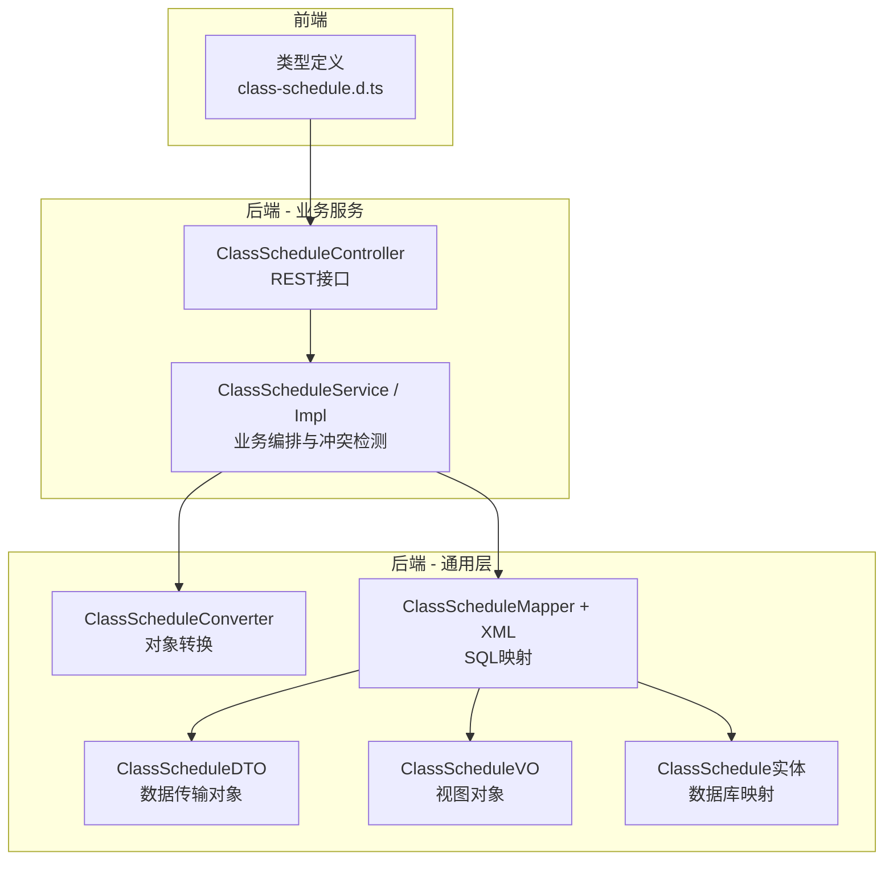
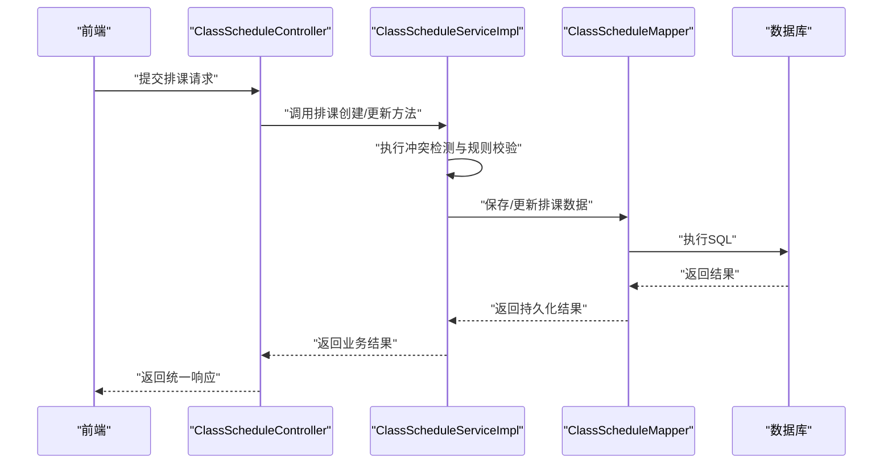
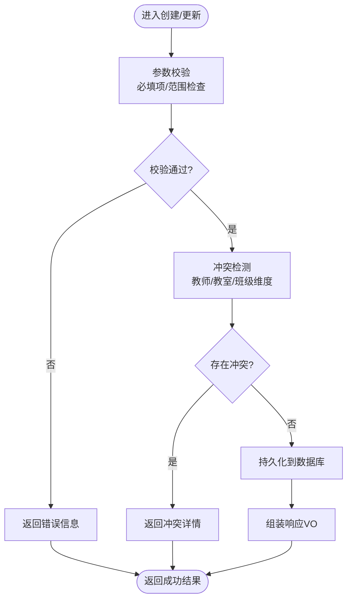
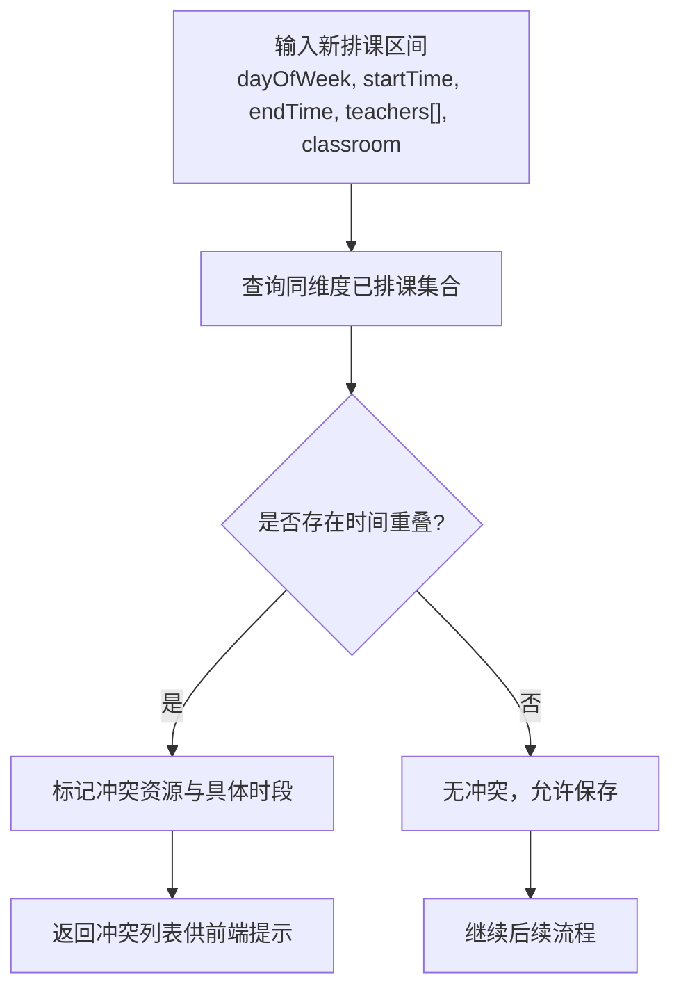
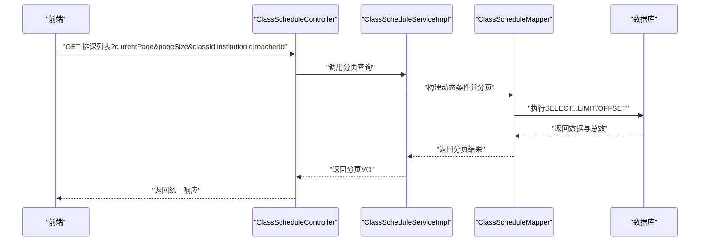
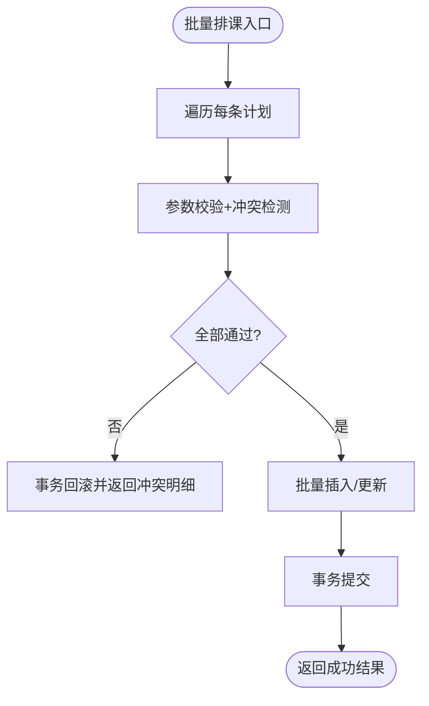
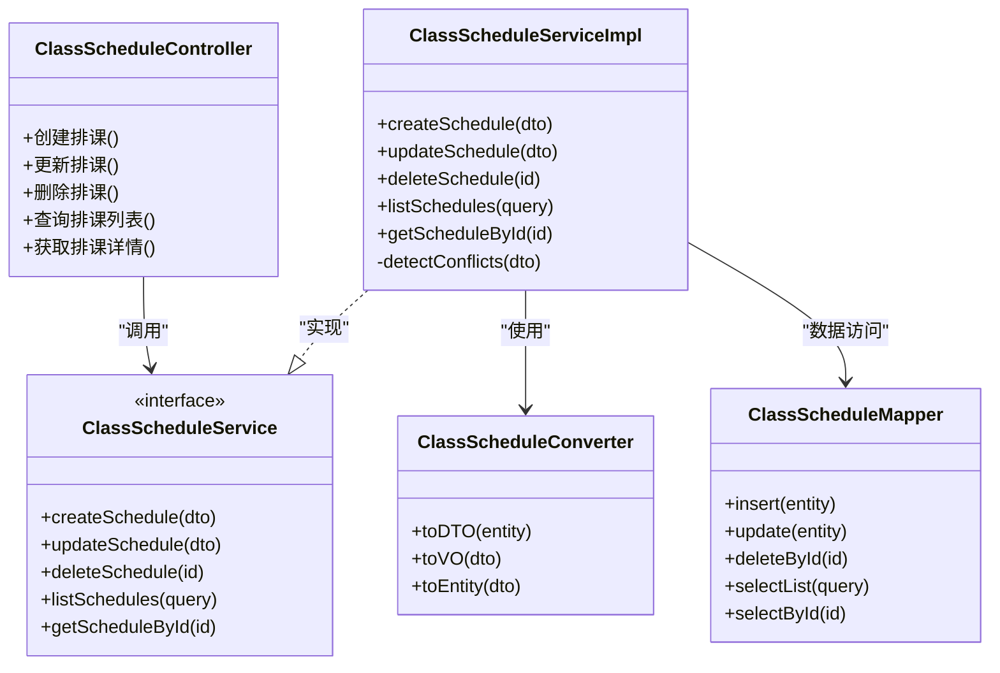

# 排课管理模块

<cite>
**本文引用的文件**
- [ClassScheduleController.java](file://class_times_record_back/business-service/src/main/java/com/shiroko/controller/ClassScheduleController.java)
- [ClassScheduleService.java](file://class_times_record_back/business-service/src/main/java/com/shiroko/service/ClassScheduleService.java)
- [ClassScheduleServiceImpl.java](file://class_times_record_back/business-service/src/main/java/com/shiroko/service/impl/ClassScheduleServiceImpl.java)
- [ClassScheduleMapper.java](file://class_times_record_back/common/src/main/java/com/shiroko/mapper/ClassScheduleMapper.java)
- [ClassScheduleMapper.xml](file://class_times_record_back/common/src/main/resources/com/shiroko/mapper/ClassScheduleMapper.xml)
- [ClassScheduleConverter.java](file://class_times_record_back/common/src/main/java/com/shiroko/converter/ClassScheduleConverter.java)
- [ClassScheduleDTO.java](file://class_times_record_back/common/src/main/java/com/shiroko/repository/dto/classschedule/ClassScheduleDTO.java)
- [ClassScheduleVO.java](file://class_times_record_back/common/src/main/java/com/shiroko/repository/vo/classschedule/ClassScheduleVO.java)
- [ClassSchedule.java](file://class_times_record_back/common/src/main/java/com/shiroko/repository/entity/ClassSchedule.java)
- [class-schedule.d.ts](file://class_times_record/src/types/class-schedule.d.ts)
</cite>

## 目录
1. [简介](#简介)
2. [项目结构](#项目结构)
3. [核心组件](#核心组件)
4. [架构总览](#架构总览)
5. [详细组件分析](#详细组件分析)
6. [依赖关系分析](#依赖关系分析)
7. [性能考虑](#性能考虑)
8. [故障排查指南](#故障排查指南)
9. [结论](#结论)
10. [附录](#附录)

## 简介
本模块聚焦“排课管理”，覆盖课程表创建、时间冲突检测、排课调整、排课查询等核心能力，并提供与班级、课程、教室、教师的关联数据模型与接口。文档从系统架构、组件职责、数据流、算法流程、API规范、可视化展示、模板与批量排课、变更历史与通知机制、优化建议等方面展开，帮助读者快速理解并高效使用或扩展该模块。

## 项目结构
后端采用分层架构：控制器层暴露REST API，服务层封装业务逻辑（含冲突检测与事务控制），数据访问层通过MyBatis Mapper与XML完成持久化；通用层提供DTO/VO/Entity与转换器。前端类型定义位于类时记录的前端工程类型文件中，用于约束请求与响应结构。



图表来源
- [ClassScheduleController.java](file://class_times_record_back/business-service/src/main/java/com/shiroko/controller/ClassScheduleController.java)
- [ClassScheduleService.java](file://class_times_record_back/business-service/src/main/java/com/shiroko/service/ClassScheduleService.java)
- [ClassScheduleServiceImpl.java](file://class_times_record_back/business-service/src/main/java/com/shiroko/service/impl/ClassScheduleServiceImpl.java)
- [ClassScheduleConverter.java](file://class_times_record_back/common/src/main/java/com/shiroko/converter/ClassScheduleConverter.java)
- [ClassScheduleMapper.java](file://class_times_record_back/common/src/main/java/com/shiroko/mapper/ClassScheduleMapper.java)
- [ClassScheduleMapper.xml](file://class_times_record_back/common/src/main/resources/com/shiroko/mapper/ClassScheduleMapper.xml)
- [ClassScheduleDTO.java](file://class_times_record_back/common/src/main/java/com/shiroko/repository/dto/classschedule/ClassScheduleDTO.java)
- [ClassScheduleVO.java](file://class_times_record_back/common/src/main/java/com/shiroko/repository/vo/classschedule/ClassScheduleVO.java)
- [ClassSchedule.java](file://class_times_record_back/common/src/main/java/com/shiroko/repository/entity/ClassSchedule.java)
- [class-schedule.d.ts](file://class_times_record/src/types/class-schedule.d.ts)

章节来源
- [ClassScheduleController.java](file://class_times_record_back/business-service/src/main/java/com/shiroko/controller/ClassScheduleController.java)
- [ClassScheduleService.java](file://class_times_record_back/business-service/src/main/java/com/shiroko/service/ClassScheduleService.java)
- [ClassScheduleServiceImpl.java](file://class_times_record_back/business-service/src/main/java/com/shiroko/service/impl/ClassScheduleServiceImpl.java)
- [ClassScheduleMapper.java](file://class_times_record_back/common/src/main/java/com/shiroko/mapper/ClassScheduleMapper.java)
- [ClassScheduleMapper.xml](file://class_times_record_back/common/src/main/resources/com/shiroko/mapper/ClassScheduleMapper.xml)
- [ClassScheduleConverter.java](file://class_times_record_back/common/src/main/java/com/shiroko/converter/ClassScheduleConverter.java)
- [ClassScheduleDTO.java](file://class_times_record_back/common/src/main/java/com/shiroko/repository/dto/classschedule/ClassScheduleDTO.java)
- [ClassScheduleVO.java](file://class_times_record_back/common/src/main/java/com/shiroko/repository/vo/classschedule/ClassScheduleVO.java)
- [ClassSchedule.java](file://class_times_record_back/common/src/main/java/com/shiroko/repository/entity/ClassSchedule.java)
- [class-schedule.d.ts](file://class_times_record/src/types/class-schedule.d.ts)

## 核心组件
- 控制器层：对外暴露排课相关REST接口，负责参数校验、调用服务层、返回统一响应。
- 服务层：实现排课CRUD、冲突检测、批量操作、事务边界与异常处理。
- 数据访问层：基于MyBatis的Mapper与XML进行SQL拼装与执行，支持分页与条件查询。
- 转换器：在DTO/VO/Entity之间进行字段映射与格式转换。
- 前端类型：定义请求与响应的数据结构，确保前后端契约一致。

章节来源
- [ClassScheduleController.java](file://class_times_record_back/business-service/src/main/java/com/shiroko/controller/ClassScheduleController.java)
- [ClassScheduleService.java](file://class_times_record_back/business-service/src/main/java/com/shiroko/service/ClassScheduleService.java)
- [ClassScheduleServiceImpl.java](file://class_times_record_back/business-service/src/main/java/com/shiroko/service/impl/ClassScheduleServiceImpl.java)
- [ClassScheduleConverter.java](file://class_times_record_back/common/src/main/java/com/shiroko/converter/ClassScheduleConverter.java)
- [ClassScheduleMapper.java](file://class_times_record_back/common/src/main/java/com/shiroko/mapper/ClassScheduleMapper.java)
- [ClassScheduleMapper.xml](file://class_times_record_back/common/src/main/resources/com/shiroko/mapper/ClassScheduleMapper.xml)
- [class-schedule.d.ts](file://class_times_record/src/types/class-schedule.d.ts)

## 架构总览
排课管理遵循典型的分层架构：前端通过HTTP调用后端控制器，控制器委托服务层执行业务规则（如冲突检测），服务层通过转换器适配数据模型，最终由Mapper与XML完成数据持久化。



图表来源
- [ClassScheduleController.java](file://class_times_record_back/business-service/src/main/java/com/shiroko/controller/ClassScheduleController.java)
- [ClassScheduleServiceImpl.java](file://class_times_record_back/business-service/src/main/java/com/shiroko/service/impl/ClassScheduleServiceImpl.java)
- [ClassScheduleMapper.java](file://class_times_record_back/common/src/main/java/com/shiroko/mapper/ClassScheduleMapper.java)
- [ClassScheduleMapper.xml](file://class_times_record_back/common/src/main/resources/com/shiroko/mapper/ClassScheduleMapper.xml)

## 详细组件分析

### 数据模型与关系
排课实体包含班级、教师、教室、星期、时间段、起止日期、备注、颜色等字段，并通过ID与其他实体建立关联。

```mermaid
erDiagram
CLASS_SCHEDULE {
int id PK
int class_id FK
string classroom
int day_of_week
date start_date
date end_date
time start_time
time end_time
string remark
string color
timestamp create_time
timestamp update_time
}
TEACHER {
int id PK
string name
}
COURSE {
int id PK
string title
}
CLASS {
int id PK
string name
}
CLASS_SCHEDULE ||--o{ TEACHER : "关联多个教师"
CLASS_SCHEDULE ||--|| COURSE : "可选关联课程"
CLASS_SCHEDULE ||--|| CLASS : "归属班级"
```

图表来源
- [ClassSchedule.java](file://class_times_record_back/common/src/main/java/com/shiroko/repository/entity/ClassSchedule.java)
- [ClassScheduleDTO.java](file://class_times_record_back/common/src/main/java/com/shiroko/repository/dto/classschedule/ClassScheduleDTO.java)
- [ClassScheduleVO.java](file://class_times_record_back/common/src/main/java/com/shiroko/repository/vo/classschedule/ClassScheduleVO.java)

章节来源
- [ClassSchedule.java](file://class_times_record_back/common/src/main/java/com/shiroko/repository/entity/ClassSchedule.java)
- [ClassScheduleDTO.java](file://class_times_record_back/common/src/main/java/com/shiroko/repository/dto/classschedule/ClassScheduleDTO.java)
- [ClassScheduleVO.java](file://class_times_record_back/common/src/main/java/com/shiroko/repository/vo/classschedule/ClassScheduleVO.java)

### 排课创建与更新流程
创建与更新均经过参数校验、冲突检测、持久化与结果组装。



图表来源
- [ClassScheduleServiceImpl.java](file://class_times_record_back/business-service/src/main/java/com/shiroko/service/impl/ClassScheduleServiceImpl.java)
- [ClassScheduleMapper.java](file://class_times_record_back/common/src/main/java/com/shiroko/mapper/ClassScheduleMapper.java)
- [ClassScheduleMapper.xml](file://class_times_record_back/common/src/main/resources/com/shiroko/mapper/ClassScheduleMapper.xml)

章节来源
- [ClassScheduleServiceImpl.java](file://class_times_record_back/business-service/src/main/java/com/shiroko/service/impl/ClassScheduleServiceImpl.java)
- [ClassScheduleMapper.java](file://class_times_record_back/common/src/main/java/com/shiroko/mapper/ClassScheduleMapper.java)
- [ClassScheduleMapper.xml](file://class_times_record_back/common/src/main/resources/com/shiroko/mapper/ClassScheduleMapper.xml)

### 时间冲突检测算法
冲突检测围绕“同一资源在同一时间段不可重复占用”的原则，按教师、教室、班级三个维度分别判断。



说明
- 时间重叠判定：两个时间段[start1,end1]与[start2,end2]重叠当且仅当start1 < end2 且 start2 < end1。
- 维度划分：教师维度、教室维度、班级维度各自独立检测，任一维度冲突即阻止保存。
- 批量场景：对每个待排条目逐一检测，汇总冲突结果。

图表来源
- [ClassScheduleServiceImpl.java](file://class_times_record_back/business-service/src/main/java/com/shiroko/service/impl/ClassScheduleServiceImpl.java)
- [ClassScheduleMapper.java](file://class_times_record_back/common/src/main/java/com/shiroko/mapper/ClassScheduleMapper.java)
- [ClassScheduleMapper.xml](file://class_times_record_back/common/src/main/resources/com/shiroko/mapper/ClassScheduleMapper.xml)

章节来源
- [ClassScheduleServiceImpl.java](file://class_times_record_back/business-service/src/main/java/com/shiroko/service/impl/ClassScheduleServiceImpl.java)
- [ClassScheduleMapper.java](file://class_times_record_back/common/src/main/java/com/shiroko/mapper/ClassScheduleMapper.java)
- [ClassScheduleMapper.xml](file://class_times_record_back/common/src/main/resources/com/shiroko/mapper/ClassScheduleMapper.xml)

### 排课查询与分页
支持按班级、机构、教师等多维筛选，并提供分页能力。



图表来源
- [ClassScheduleController.java](file://class_times_record_back/business-service/src/main/java/com/shiroko/controller/ClassScheduleController.java)
- [ClassScheduleServiceImpl.java](file://class_times_record_back/business-service/src/main/java/com/shiroko/service/impl/ClassScheduleServiceImpl.java)
- [ClassScheduleMapper.java](file://class_times_record_back/common/src/main/java/com/shiroko/mapper/ClassScheduleMapper.java)
- [ClassScheduleMapper.xml](file://class_times_record_back/common/src/main/resources/com/shiroko/mapper/ClassScheduleMapper.xml)

章节来源
- [ClassScheduleController.java](file://class_times_record_back/business-service/src/main/java/com/shiroko/controller/ClassScheduleController.java)
- [ClassScheduleServiceImpl.java](file://class_times_record_back/business-service/src/main/java/com/shiroko/service/impl/ClassScheduleServiceImpl.java)
- [ClassScheduleMapper.java](file://class_times_record_back/common/src/main/java/com/shiroko/mapper/ClassScheduleMapper.java)
- [ClassScheduleMapper.xml](file://class_times_record_back/common/src/main/resources/com/shiroko/mapper/ClassScheduleMapper.xml)

### 排课调整与批量排课
- 单条调整：根据scheduleId定位记录，更新weekDay、startTime、endTime、courseId、remark等字段，再次触发冲突检测。
- 批量排课：接收多条排课计划，逐条校验与冲突检测，整体事务提交，失败回滚。



图表来源
- [ClassScheduleServiceImpl.java](file://class_times_record_back/business-service/src/main/java/com/shiroko/service/impl/ClassScheduleServiceImpl.java)
- [ClassScheduleMapper.java](file://class_times_record_back/common/src/main/java/com/shiroko/mapper/ClassScheduleMapper.java)
- [ClassScheduleMapper.xml](file://class_times_record_back/common/src/main/resources/com/shiroko/mapper/ClassScheduleMapper.xml)

章节来源
- [ClassScheduleServiceImpl.java](file://class_times_record_back/business-service/src/main/java/com/shiroko/service/impl/ClassScheduleServiceImpl.java)
- [ClassScheduleMapper.java](file://class_times_record_back/common/src/main/java/com/shiroko/mapper/ClassScheduleMapper.java)
- [ClassScheduleMapper.xml](file://class_times_record_back/common/src/main/resources/com/shiroko/mapper/ClassScheduleMapper.xml)

### 排课模板与复用
- 模板概念：将常用排课方案（如固定周次、固定时间段、固定教师与教室）抽象为模板。
- 应用方式：选择模板后生成待排课清单，再走批量排课流程进行校验与落库。
- 扩展点：可在服务层增加模板CRUD与模板实例化方法，结合现有批量接口复用。

[本节为概念性说明，不直接分析具体文件]

### 排课变更历史记录
- 设计思路：在排课主表之外维护变更记录表，记录变更前后的关键字段快照、操作人、操作时间与原因。
- 触发时机：每次更新或删除排课时写入一条变更日志。
- 查询与审计：提供按排课ID、操作人、时间范围查询的接口，便于审计与回溯。

[本节为概念性说明，不直接分析具体文件]

### 排课通知推送机制
- 事件驱动：排课创建/调整完成后发布事件（如“排课变更事件”）。
- 订阅者：消息队列或本地事件总线订阅事件，向教师、班主任、教务管理员发送站内信或短信/邮件。
- 幂等与重试：通知具备去重与重试策略，避免重复推送。

[本节为概念性说明，不直接分析具体文件]

### 可视化展示
- 日历视图：以周为单位展示各班级/教师/教室的排课块，支持拖拽微调。
- 冲突高亮：冲突时段以醒目颜色标注，点击可查看详情。
- 过滤与搜索：按班级、教师、教室、课程名称筛选。
- 导出：支持导出为CSV/Excel以便线下核对。

[本节为概念性说明，不直接分析具体文件]

## 依赖关系分析
- 控制器依赖服务接口，服务实现依赖转换器与Mapper。
- Mapper依赖XML中的SQL片段，完成复杂条件与分页。
- DTO/VO/Entity三者通过转换器解耦，保证领域模型与传输模型的独立性。



图表来源
- [ClassScheduleController.java](file://class_times_record_back/business-service/src/main/java/com/shiroko/controller/ClassScheduleController.java)
- [ClassScheduleService.java](file://class_times_record_back/business-service/src/main/java/com/shiroko/service/ClassScheduleService.java)
- [ClassScheduleServiceImpl.java](file://class_times_record_back/business-service/src/main/java/com/shiroko/service/impl/ClassScheduleServiceImpl.java)
- [ClassScheduleConverter.java](file://class_times_record_back/common/src/main/java/com/shiroko/converter/ClassScheduleConverter.java)
- [ClassScheduleMapper.java](file://class_times_record_back/common/src/main/java/com/shiroko/mapper/ClassScheduleMapper.java)

章节来源
- [ClassScheduleController.java](file://class_times_record_back/business-service/src/main/java/com/shiroko/controller/ClassScheduleController.java)
- [ClassScheduleService.java](file://class_times_record_back/business-service/src/main/java/com/shiroko/service/ClassScheduleService.java)
- [ClassScheduleServiceImpl.java](file://class_times_record_back/business-service/src/main/java/com/shiroko/service/impl/ClassScheduleServiceImpl.java)
- [ClassScheduleConverter.java](file://class_times_record_back/common/src/main/java/com/shiroko/converter/ClassScheduleConverter.java)
- [ClassScheduleMapper.java](file://class_times_record_back/common/src/main/java/com/shiroko/mapper/ClassScheduleMapper.java)

## 性能考虑
- 索引优化：为dayOfWeek、classId、teacherId、classroom、start_time、end_time建立复合索引，提升冲突检测与查询效率。
- 冲突检测批量化：一次性拉取相关维度的已排课集合，减少多次往返数据库。
- 分页与投影：只查询必要字段，避免大对象传输；合理设置pageSize上限。
- 事务粒度：批量排课尽量控制在合理批次大小，避免长事务导致锁竞争。
- 缓存策略：对静态字典（如星期、节假日）与热点配置进行缓存，降低重复计算。
- SQL优化：避免全表扫描与隐式类型转换，使用显式条件与绑定变量。

[本节提供一般性指导，不直接分析具体文件]

## 故障排查指南
- 冲突报错：确认传入的星期、时间段与资源ID是否正确；查看冲突维度（教师/教室/班级）与具体时段。
- 空数据：检查查询条件是否过严；确认分页参数与排序字段。
- 事务回滚：批量排课失败时，检查是否有某一条冲突或唯一约束违反；定位失败条目并单独重试。
- 性能问题：监控慢查询日志，关注冲突检测SQL的执行计划与索引命中情况。

[本节提供一般性指导，不直接分析具体文件]

## 结论
排课管理模块通过清晰的分层设计与严格的冲突检测，实现了稳定可靠的排课能力。建议在后续迭代中完善模板与批量排课体验、引入变更历史与通知机制，并结合索引与SQL优化进一步提升性能与可用性。

[本节为总结性内容，不直接分析具体文件]

## 附录

### API接口规范（示例）
以下为排课管理常见接口的约定，实际字段以控制器与服务实现为准。

- 创建排课
  - 方法：POST
  - 路径：/api/class-schedule
  - 请求体：参考前端类型定义中的创建/更新结构
  - 响应：统一响应包装，包含排课详情或冲突信息

- 更新排课
  - 方法：PUT
  - 路径：/api/class-schedule/{scheduleId}
  - 请求体：包含需更新的字段
  - 响应：统一响应包装

- 删除排课
  - 方法：DELETE
  - 路径：/api/class-schedule/{scheduleId}
  - 响应：统一响应包装

- 查询排课列表
  - 方法：GET
  - 路径：/api/class-schedule/list
  - 查询参数：currentPage、pageSize、classId/institutionId/teacherId（三选一或多选）
  - 响应：分页结果

- 获取排课详情
  - 方法：GET
  - 路径：/api/class-schedule/{scheduleId}
  - 响应：排课详情

章节来源
- [ClassScheduleController.java](file://class_times_record_back/business-service/src/main/java/com/shiroko/controller/ClassScheduleController.java)
- [class-schedule.d.ts](file://class_times_record/src/types/class-schedule.d.ts)

### 前端类型契约要点
- 列表查询：支持按班级、机构、教师筛选，并携带分页参数。
- 创建/更新：包含星期、起止时间、教师集合、教室、备注、颜色等字段。
- 详情：返回完整排课信息与关联教师列表。

章节来源
- [class-schedule.d.ts](file://class_times_record/src/types/class-schedule.d.ts)