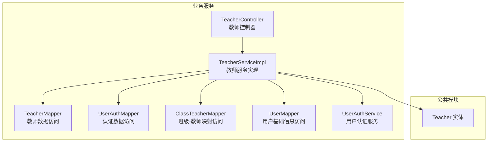
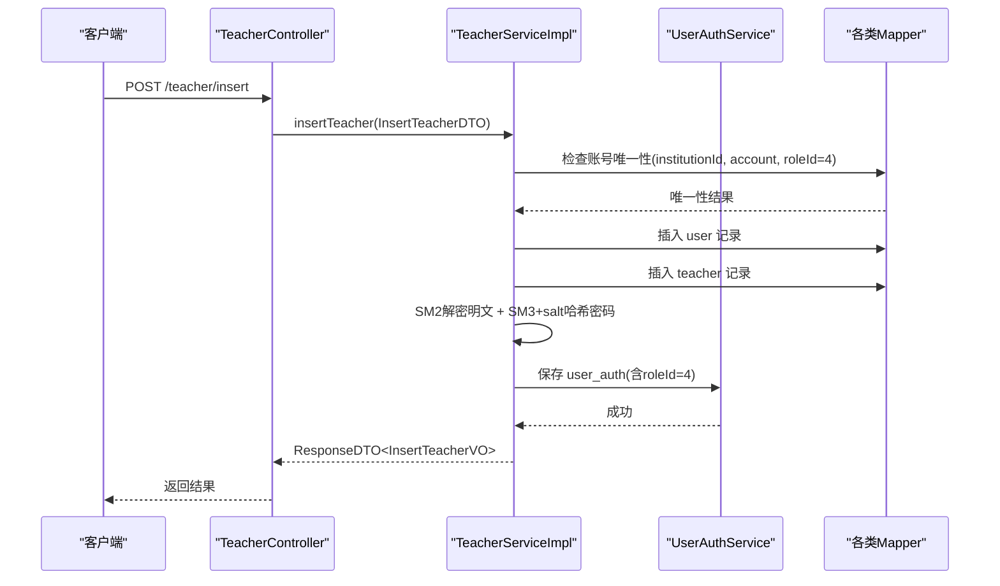
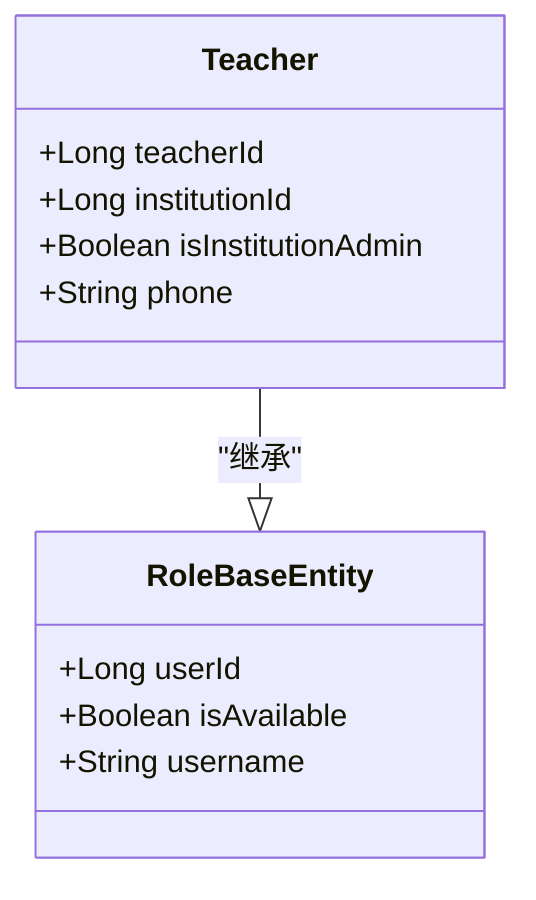
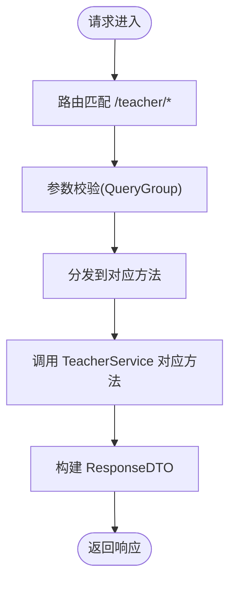
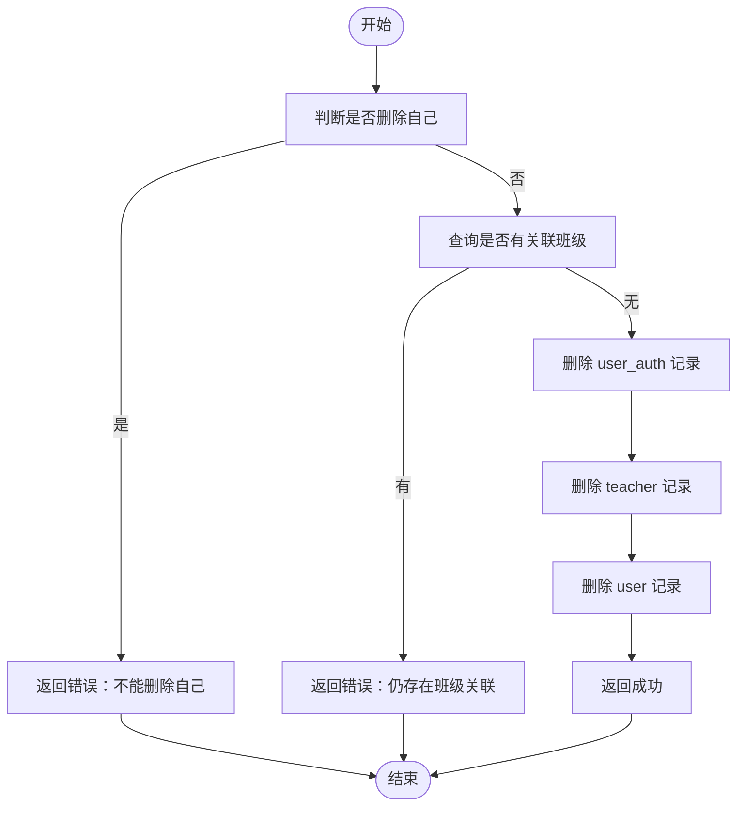
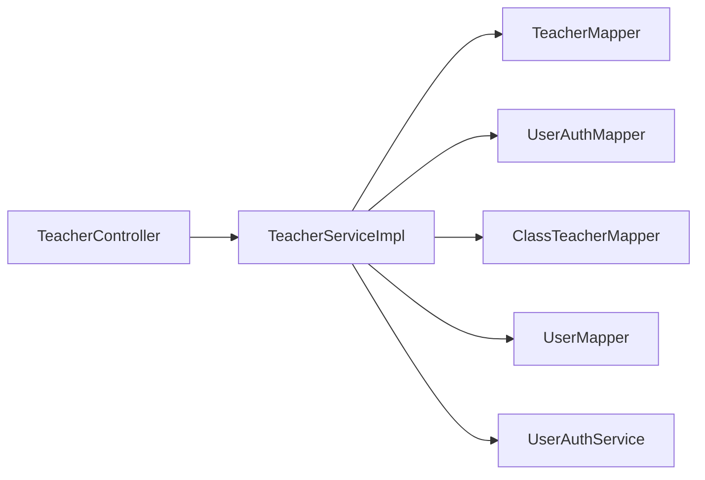

# 教师管理模块

<cite>
**本文引用的文件**   
- [TeacherController.java](file://class_times_record_back/business-service/src/main/java/com/shiroko/controller/TeacherController.java)
- [TeacherServiceImpl.java](file://class_times_record_back/business-service/src/main/java/com/shiroko/service/impl/TeacherServiceImpl.java)
- [Teacher.java](file://class_times_record_back/common/src/main/java/com/shiroko/repository/entity/Teacher.java)
- [ClassTeacherService.java](file://class_times_record_back/business-service/src/main/java/com/shiroko/service/ClassTeacherService.java)
- [ClassTeacherServiceImpl.java](file://class_times_record_back/business-service/src/main/java/com/shiroko/service/impl/ClassTeacherServiceImpl.java)
- [architecture.md](file://class_times_record/docs/architecture.md)
</cite>

## 目录
1. [简介](#简介)
2. [项目结构](#项目结构)
3. [核心组件](#核心组件)
4. [架构总览](#架构总览)
5. [详细组件分析](#详细组件分析)
6. [依赖关系分析](#依赖关系分析)
7. [性能考虑](#性能考虑)
8. [故障排查指南](#故障排查指南)
9. [结论](#结论)
10. [附录：API 接口规范与异常处理](#附录api-接口规范与异常处理)

## 简介
本章节面向“教师管理模块”，聚焦以下能力：
- 教师信息管理：查询、更新、删除、新增
- 账号管理：教师账号的创建、更新（含密码重置）、唯一性校验
- 权限与角色：教师角色固定为特定 role_id，结合机构维度进行账号唯一性控制
- 课程分配关联：通过班级-教师关联表维护教师与班级的绑定关系，作为课程分配的前置条件
- 登录与访问控制：基于网关统一鉴权与用户上下文注入，教师登录后按角色与机构范围限制功能访问
- 批量导入导出与状态管理：当前代码未提供直接实现，本节给出扩展建议与落地方案

## 项目结构
后端采用多服务微服务架构，教师管理相关逻辑位于 business-service 中，实体定义在 common 模块。前端包含管理端与小程序端，分别调用业务接口完成教师管理与教学流程。

图表来源
- [TeacherController.java:1-66](file://class_times_record_back/business-service/src/main/java/com/shiroko/controller/TeacherController.java#L1-L66)
- [TeacherServiceImpl.java:1-237](file://class_times_record_back/business-service/src/main/java/com/shiroko/service/impl/TeacherServiceImpl.java#L1-L237)
- [Teacher.java:1-53](file://class_times_record_back/common/src/main/java/com/shiroko/repository/entity/Teacher.java#L1-L53)

章节来源
- [TeacherController.java:1-66](file://class_times_record_back/business-service/src/main/java/com/shiroko/controller/TeacherController.java#L1-L66)
- [TeacherServiceImpl.java:1-237](file://class_times_record_back/business-service/src/main/java/com/shiroko/service/impl/TeacherServiceImpl.java#L1-L237)
- [Teacher.java:1-53](file://class_times_record_back/common/src/main/java/com/shiroko/repository/entity/Teacher.java#L1-L53)

## 核心组件
- 控制器层：对外暴露教师管理的 REST 接口，负责参数校验与响应封装
- 服务层：实现教师信息的增删改查、账号唯一性校验、密码加盐哈希存储、级联删除等核心逻辑
- 数据访问层：通过 Mapper 操作教师、用户、认证、班级-教师映射等表
- 实体模型：教师实体继承角色基类，包含机构维度字段与是否机构管理员标记

章节来源
- [TeacherController.java:1-66](file://class_times_record_back/business-service/src/main/java/com/shiroko/controller/TeacherController.java#L1-L66)
- [TeacherServiceImpl.java:1-237](file://class_times_record_back/business-service/src/main/java/com/shiroko/service/impl/TeacherServiceImpl.java#L1-L237)
- [Teacher.java:1-53](file://class_times_record_back/common/src/main/java/com/shiroko/repository/entity/Teacher.java#L1-L53)

## 架构总览
教师管理模块遵循典型的分层架构：控制器接收请求并委托服务层处理；服务层协调多个数据访问对象与通用服务（如用户认证服务），并通过转换器完成 DTO/VO 与实体的转换。

图表来源
- [TeacherController.java:1-66](file://class_times_record_back/business-service/src/main/java/com/shiroko/controller/TeacherController.java#L1-L66)
- [TeacherServiceImpl.java:126-172](file://class_times_record_back/business-service/src/main/java/com/shiroko/service/impl/TeacherServiceImpl.java#L126-L172)

## 详细组件分析

### 教师实体与角色基类
- 教师实体包含机构 ID、是否为机构管理员、手机号等字段
- 继承角色基类，具备通用的用户标识、可用性、用户名等字段
- 教师角色固定为特定 role_id，用于区分家长、教师与管理员身份

图表来源
- [Teacher.java:1-53](file://class_times_record_back/common/src/main/java/com/shiroko/repository/entity/Teacher.java#L1-L53)

章节来源
- [Teacher.java:1-53](file://class_times_record_back/common/src/main/java/com/shiroko/repository/entity/Teacher.java#L1-L53)

### 教师控制器接口
- 提供按 ID 查询、按机构查询、更新、新增、删除等接口
- 所有接口均使用统一的响应包装类型，便于前端一致化处理

图表来源
- [TeacherController.java:1-66](file://class_times_record_back/business-service/src/main/java/com/shiroko/controller/TeacherController.java#L1-L66)

章节来源
- [TeacherController.java:1-66](file://class_times_record_back/business-service/src/main/java/com/shiroko/controller/TeacherController.java#L1-L66)

### 教师服务实现（CRUD、账号与密码）
- 查询：支持按教师 ID 与按机构 ID 查询，返回分页或列表视图
- 更新：支持更新教师信息与账号；若更新账号则进行机构内唯一性校验；若更新密码则先解密再哈希加盐存储
- 新增：先校验账号唯一性，再依次插入用户、教师、认证信息；密码采用 SM2 解密后 SM3+salt 哈希
- 删除：禁止删除自己；若仍关联班级则拒绝删除；按 user_auth → teacher → user 顺序清理关联数据

图表来源
- [TeacherServiceImpl.java:182-231](file://class_times_record_back/business-service/src/main/java/com/shiroko/service/impl/TeacherServiceImpl.java#L182-L231)

章节来源
- [TeacherServiceImpl.java:60-83](file://class_times_record_back/business-service/src/main/java/com/shiroko/service/impl/TeacherServiceImpl.java#L60-L83)
- [TeacherServiceImpl.java:85-124](file://class_times_record_back/business-service/src/main/java/com/shiroko/service/impl/TeacherServiceImpl.java#L85-L124)
- [TeacherServiceImpl.java:126-172](file://class_times_record_back/business-service/src/main/java/com/shiroko/service/impl/TeacherServiceImpl.java#L126-L172)
- [TeacherServiceImpl.java:182-231](file://class_times_record_back/business-service/src/main/java/com/shiroko/service/impl/TeacherServiceImpl.java#L182-L231)

### 教师与机构的关联关系
- 教师实体包含 institutionId，用于限定教师在机构内的可见性与操作范围
- 账号唯一性校验以 institutionId + account + roleId 组合进行，确保同一机构下教师账号不重复

章节来源
- [TeacherServiceImpl.java:128-136](file://class_times_record_back/business-service/src/main/java/com/shiroko/service/impl/TeacherServiceImpl.java#L128-L136)
- [TeacherServiceImpl.java:96-105](file://class_times_record_back/business-service/src/main/java/com/shiroko/service/impl/TeacherServiceImpl.java#L96-L105)
- [Teacher.java:33-35](file://class_times_record_back/common/src/main/java/com/shiroko/repository/entity/Teacher.java#L33-L35)

### 教师权限配置机制与角色特殊处理
- 教师角色固定为特定 role_id（示例中为 4），在新增与更新时强制设置
- 结合网关统一鉴权与用户上下文注入，教师登录后根据角色与机构范围限制功能访问
- 系统管理员与机构管理员不同：教师实体中的 isInstitutionAdmin 表示该教师是否为所在机构的管理员，拥有更多管理菜单权限

章节来源
- [TeacherServiceImpl.java:163-164](file://class_times_record_back/business-service/src/main/java/com/shiroko/service/impl/TeacherServiceImpl.java#L163-L164)
- [Teacher.java:38-42](file://class_times_record_back/common/src/main/java/com/shiroko/repository/entity/Teacher.java#L38-L42)
- [architecture.md](file://class_times_record/docs/architecture.md)

### 课程分配与班级-教师关联
- 删除教师前会检查是否存在班级-教师关联记录，若有则拒绝删除，避免破坏课程分配数据完整性
- 班级-教师关联由 ClassTeacher 实体及对应 Service/Mapper 维护，教师管理需与其联动

章节来源
- [TeacherServiceImpl.java:197-203](file://class_times_record_back/business-service/src/main/java/com/shiroko/service/impl/TeacherServiceImpl.java#L197-L203)
- [ClassTeacherService.java:12](file://class_times_record_back/business-service/src/main/java/com/shiroko/service/ClassTeacherService.java#L12)
- [ClassTeacherServiceImpl.java:16-17](file://class_times_record_back/business-service/src/main/java/com/shiroko/service/impl/ClassTeacherServiceImpl.java#L16-L17)

### 教师登录后的权限控制与功能访问限制
- 网关层统一 JWT 校验与签名验证，将用户信息注入到 UserContext
- 教师登录后，依据角色与机构范围进行资源访问控制；教师端小程序对家长角色的查询进行了额外限定（参考架构文档说明）

章节来源
- [architecture.md](file://class_times_record/docs/architecture.md)

### 批量导入导出与状态管理
- 当前代码未提供直接的批量导入导出接口与状态管理实现
- 建议扩展方向：
  - 批量导入：提供 Excel/CSV 模板下载与上传接口，服务端解析后进行唯一性校验与批量写入
  - 批量导出：按机构维度导出教师列表，支持筛选条件与分页流式输出
  - 状态管理：为教师增加可用状态字段（如 is_available），在查询与删除时进行状态过滤与保护

[本节为概念性扩展建议，不涉及具体源码]

## 依赖关系分析
- 控制器依赖服务层，服务层依赖多个 Mapper 与通用服务
- 教师服务与用户认证服务存在协作关系，用于账号与密码的持久化
- 删除流程涉及多表级联清理，需保证事务一致性与外键约束顺序

图表来源
- [TeacherController.java:1-66](file://class_times_record_back/business-service/src/main/java/com/shiroko/controller/TeacherController.java#L1-L66)
- [TeacherServiceImpl.java:1-237](file://class_times_record_back/business-service/src/main/java/com/shiroko/service/impl/TeacherServiceImpl.java#L1-L237)

章节来源
- [TeacherController.java:1-66](file://class_times_record_back/business-service/src/main/java/com/shiroko/controller/TeacherController.java#L1-L66)
- [TeacherServiceImpl.java:1-237](file://class_times_record_back/business-service/src/main/java/com/shiroko/service/impl/TeacherServiceImpl.java#L1-L237)

## 性能考虑
- 唯一性校验应在数据库层面建立联合索引（institution_id, account, role_id）以提升查询效率
- 批量导入导出建议使用流式读写与分批提交，避免一次性加载大量数据导致内存压力
- 删除操作的级联清理应尽量减少额外查询，必要时可引入缓存或预聚合统计

[本节为通用优化建议，不涉及具体源码]

## 故障排查指南
- 账号重复：新增或更新时提示“该机构下已存在相同的账号”，请检查 institutionId 与 account 的组合是否唯一
- 删除失败：
  - “不能删除自己”：当前登录用户即为被删除教师
  - “该教师仍关联班级”：请先解除班级-教师关联或删除相关班级
  - “删除失败”：可能由于外键约束或并发冲突，建议重试并检查日志
- 密码更新无效：确认前端是否正确使用 SM2 加密传输，后端是否成功解密并进行 SM3+salt 哈希

章节来源
- [TeacherServiceImpl.java:128-136](file://class_times_record_back/business-service/src/main/java/com/shiroko/service/impl/TeacherServiceImpl.java#L128-L136)
- [TeacherServiceImpl.java:182-231](file://class_times_record_back/business-service/src/main/java/com/shiroko/service/impl/TeacherServiceImpl.java#L182-L231)

## 结论
教师管理模块围绕教师信息、账号与权限、课程分配关联展开，实现了完整的 CRUD 与严格的唯一性与级联删除策略。结合网关统一鉴权与用户上下文，教师登录后可按角色与机构范围进行访问控制。后续可扩展批量导入导出与状态管理，以满足更大规模与更复杂的业务场景。

## 附录：API 接口规范与异常处理

### 接口清单
- 获取教师详情
  - 路径：POST /teacher/get_by_id
  - 入参：QueryTeacherDTO（包含 teacherId）
  - 出参：ResponseDTO<QueryTeacherVO>
- 按机构获取教师列表
  - 路径：POST /teacher/get_teacher_by_institution_id
  - 入参：QueryTeacherDTO（包含 institutionId）
  - 出参：ResponseDTO<QueryTeacherVO>
- 更新教师信息
  - 路径：POST /teacher/update_by_id
  - 入参：UpdateTeacherDTO（可包含 teacherId、account、password、institutionId 等）
  - 出参：ResponseDTO<UpdateTeacherVO>
- 新增教师
  - 路径：POST /teacher/insert
  - 入参：InsertTeacherDTO（包含 institutionId、account、password 等）
  - 出参：ResponseDTO<InsertTeacherVO>
- 删除教师
  - 路径：POST /teacher/delete
  - 入参：Map<String, Long>（包含 teacherId）
  - 出参：ResponseDTO<String>

章节来源
- [TeacherController.java:35-64](file://class_times_record_back/business-service/src/main/java/com/shiroko/controller/TeacherController.java#L35-L64)

### 异常与错误码
- 账号重复：新增或更新时返回“该机构下已存在相同的账号”
- 删除保护：
  - “不能删除自己”
  - “该教师仍关联班级，请先将该教师从班级中移除或删除相关班级后再删除”
  - “教师不存在”
  - “删除失败”
- 统一响应：所有接口均返回 ResponseDTO，包含成功/失败状态与消息体

章节来源
- [TeacherServiceImpl.java:102-105](file://class_times_record_back/business-service/src/main/java/com/shiroko/service/impl/TeacherServiceImpl.java#L102-L105)
- [TeacherServiceImpl.java:133-136](file://class_times_record_back/business-service/src/main/java/com/shiroko/service/impl/TeacherServiceImpl.java#L133-L136)
- [TeacherServiceImpl.java:186-231](file://class_times_record_back/business-service/src/main/java/com/shiroko/service/impl/TeacherServiceImpl.java#L186-L231)