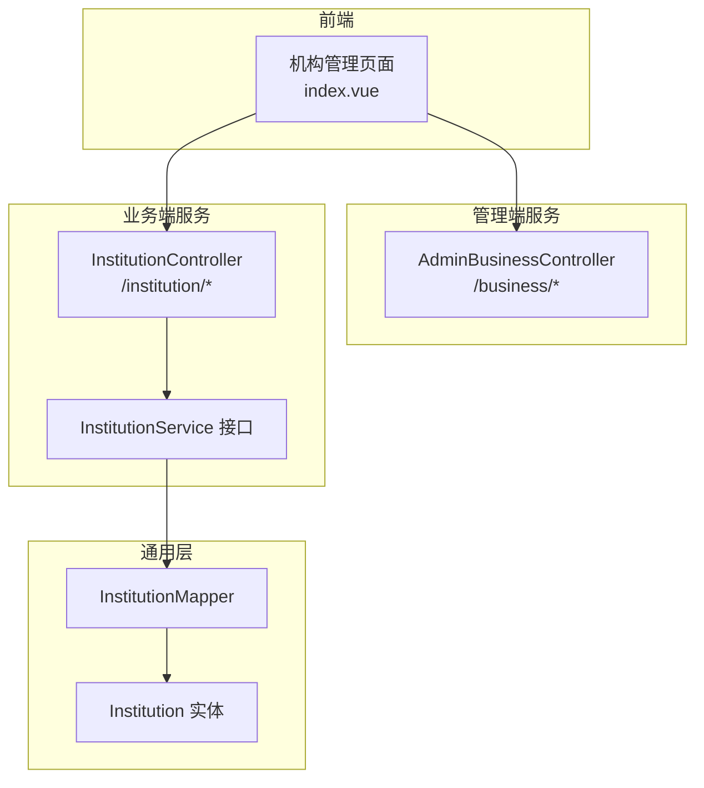
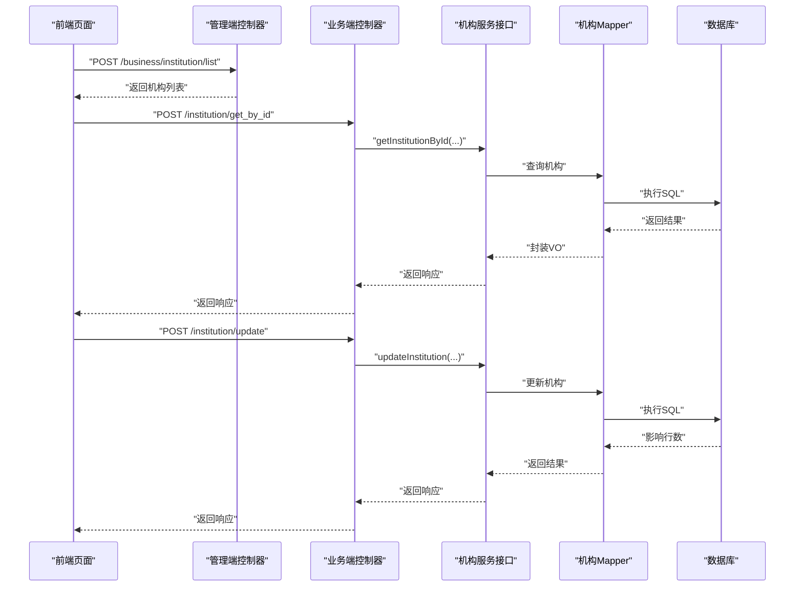
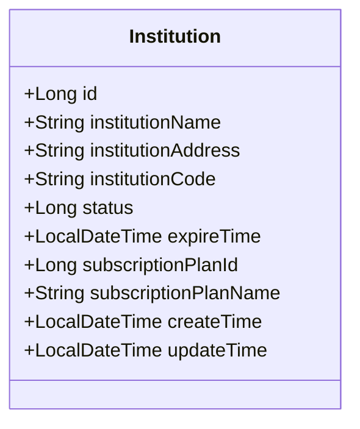
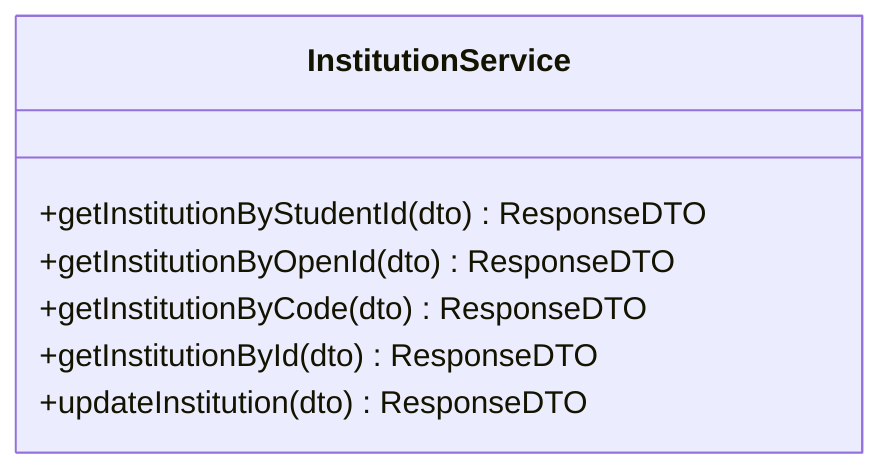
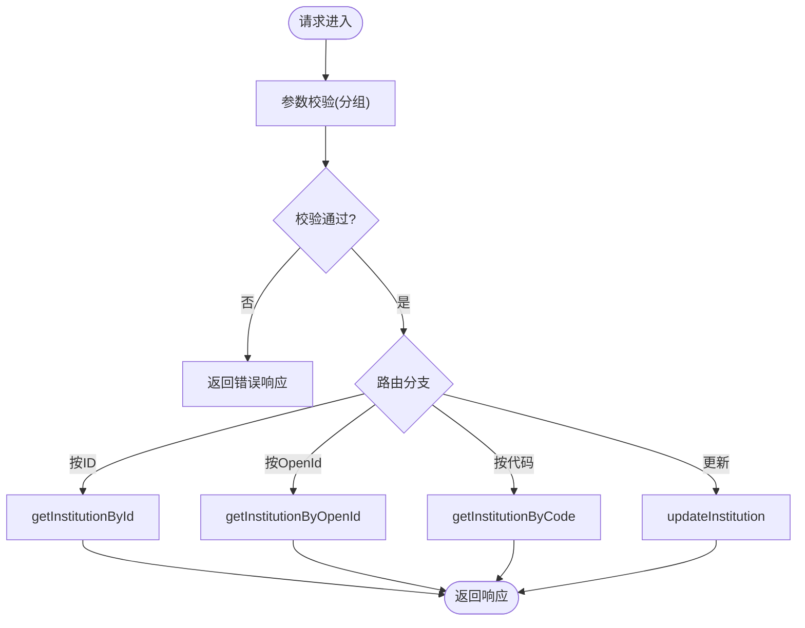
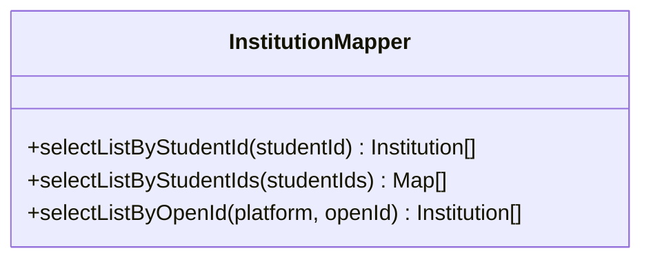
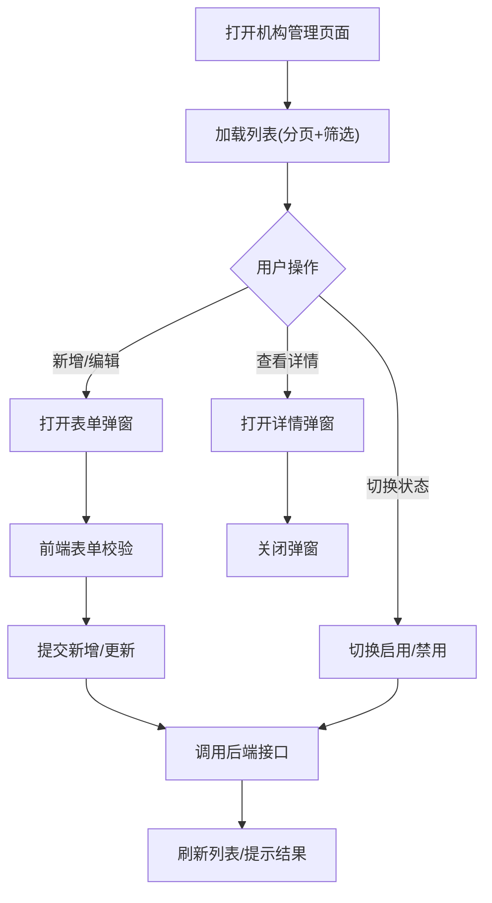
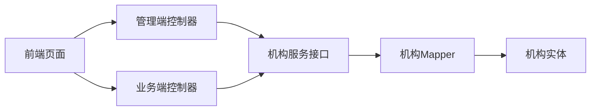

# 机构管理模块

<cite>
**本文引用的文件**   
- [InstitutionService.java](file://class_times_record_back/common/src/main/java/com/shiroko/service/InstitutionService.java)
- [InstitutionController.java](file://class_times_record_back/business-service/src/main/java/com/shiroko/controller/InstitutionController.java)
- [AdminBusinessController.java](file://class_times_record_back/admin-service/src/main/java/com/shiroko/controller/AdminBusinessController.java)
- [InstitutionMapper.java](file://class_times_record_back/common/src/main/java/com/shiroko/mapper/InstitutionMapper.java)
- [Institution.java](file://class_times_record_back/common/src/main/java/com/shiroko/repository/entity/Institution.java)
- [index.vue（机构管理前端页面）](file://class_record_admin_front/src/views/business/institution/index.vue)
</cite>

## 目录
1. [简介](#简介)
2. [项目结构](#项目结构)
3. [核心组件](#核心组件)
4. [架构总览](#架构总览)
5. [详细组件分析](#详细组件分析)
6. [依赖关系分析](#依赖关系分析)
7. [性能考虑](#性能考虑)
8. [故障排查指南](#故障排查指南)
9. [结论](#结论)
10. [附录：API 接口文档](#附录api-接口文档)

## 简介
本模块聚焦“培训机构信息管理”，覆盖机构基本信息维护、校区与订阅计划配置、状态管理与查询等能力。后端采用分层架构（Controller-Service-Mapper），提供面向管理端与业务端的接口；前端提供机构列表、新增/编辑、详情查看与状态切换等交互。数据模型包含机构基础字段、租期到期时间、订阅套餐ID及关联的套餐名称展示字段，并通过 MyBatis-Plus 进行持久化操作。

## 项目结构
围绕机构管理的相关代码分布在以下位置：
- 后端实体与映射：common 模块中的实体与 Mapper
- 业务服务接口：common 模块中的 Service 接口
- 控制器：business-service 面向业务端，admin-service 面向管理端
- 前端页面：class_record_admin_front 下的机构管理页面

图表来源
- [InstitutionController.java:1-57](file://class_times_record_back/business-service/src/main/java/com/shiroko/controller/InstitutionController.java#L1-L57)
- [AdminBusinessController.java:1-255](file://class_times_record_back/admin-service/src/main/java/com/shiroko/controller/AdminBusinessController.java#L1-L255)
- [InstitutionService.java:1-30](file://class_times_record_back/common/src/main/java/com/shiroko/service/InstitutionService.java#L1-L30)
- [InstitutionMapper.java:1-31](file://class_times_record_back/common/src/main/java/com/shiroko/mapper/InstitutionMapper.java#L1-L31)
- [Institution.java:1-87](file://class_times_record_back/common/src/main/java/com/shiroko/repository/entity/Institution.java#L1-L87)
- [index.vue（机构管理前端页面）:1-326](file://class_record_admin_front/src/views/business/institution/index.vue#L1-L326)

章节来源
- [InstitutionController.java:1-57](file://class_times_record_back/business-service/src/main/java/com/shiroko/controller/InstitutionController.java#L1-L57)
- [AdminBusinessController.java:1-255](file://class_times_record_back/admin-service/src/main/java/com/shiroko/controller/AdminBusinessController.java#L1-L255)
- [InstitutionService.java:1-30](file://class_times_record_back/common/src/main/java/com/shiroko/service/InstitutionService.java#L1-L30)
- [InstitutionMapper.java:1-31](file://class_times_record_back/common/src/main/java/com/shiroko/mapper/InstitutionMapper.java#L1-L31)
- [Institution.java:1-87](file://class_times_record_back/common/src/main/java/com/shiroko/repository/entity/Institution.java#L1-L87)
- [index.vue（机构管理前端页面）:1-326](file://class_record_admin_front/src/views/business/institution/index.vue#L1-L326)

## 核心组件
- 实体 Institution：定义机构主键、名称、地址、代码、状态、租期到期时间、订阅套餐ID、创建/更新时间以及非数据库字段 subscriptionPlanName（用于展示）。
- 服务接口 InstitutionService：提供按学生ID、OpenId、机构代码、ID 查询机构，以及更新机构信息的能力。
- 控制器
  - business-service 的 InstitutionController：对外暴露查询与更新接口，使用分组校验。
  - admin-service 的 AdminBusinessController：管理端统一入口，提供机构列表、新增、更新等接口。
- 数据访问 InstitutionMapper：继承 BaseMapper，并提供按学生ID、多个学生ID、OpenId 的扩展查询方法。
- 前端页面 index.vue：实现机构列表分页、搜索、新增/编辑弹窗、详情查看、状态开关切换等。

章节来源
- [Institution.java:1-87](file://class_times_record_back/common/src/main/java/com/shiroko/repository/entity/Institution.java#L1-L87)
- [InstitutionService.java:1-30](file://class_times_record_back/common/src/main/java/com/shiroko/service/InstitutionService.java#L1-L30)
- [InstitutionController.java:1-57](file://class_times_record_back/business-service/src/main/java/com/shiroko/controller/InstitutionController.java#L1-L57)
- [AdminBusinessController.java:1-255](file://class_times_record_back/admin-service/src/main/java/com/shiroko/controller/AdminBusinessController.java#L1-L255)
- [InstitutionMapper.java:1-31](file://class_times_record_back/common/src/main/java/com/shiroko/mapper/InstitutionMapper.java#L1-L31)
- [index.vue（机构管理前端页面）:1-326](file://class_record_admin_front/src/views/business/institution/index.vue#L1-L326)

## 架构总览
机构管理在前后端分离的架构下运行：
- 前端通过 HTTP 调用管理端或业务端接口完成机构的增删改查与状态变更。
- 管理端与业务端分别由不同 Controller 暴露接口，最终汇聚到 Service 层进行业务编排。
- Service 层调用 Mapper 进行数据访问，实体对象承载数据模型。

图表来源
- [AdminBusinessController.java:43-95](file://class_times_record_back/admin-service/src/main/java/com/shiroko/controller/AdminBusinessController.java#L43-L95)
- [InstitutionController.java:31-54](file://class_times_record_back/business-service/src/main/java/com/shiroko/controller/InstitutionController.java#L31-L54)
- [InstitutionService.java:18-29](file://class_times_record_back/common/src/main/java/com/shiroko/service/InstitutionService.java#L18-L29)
- [InstitutionMapper.java:17-30](file://class_times_record_back/common/src/main/java/com/shiroko/mapper/InstitutionMapper.java#L17-L30)

## 详细组件分析

### 实体与数据模型
- 主键 id：自增 Long
- 名称 institutionName、地址 institutionAddress、代码 institutionCode
- 状态 status：0 待审核、1 启用、2 禁用
- 租期 expireTime：NULL 表示永久有效；过期后不允许教师登录（业务规则）
- 订阅套餐 subscriptionPlanId：默认 1（标准套餐）
- 展示字段 subscriptionPlanName：非数据库字段，通过 JOIN 获取套餐名称
- 审计字段 createTime、updateTime

图表来源
- [Institution.java:21-87](file://class_times_record_back/common/src/main/java/com/shiroko/repository/entity/Institution.java#L21-L87)

章节来源
- [Institution.java:1-87](file://class_times_record_back/common/src/main/java/com/shiroko/repository/entity/Institution.java#L1-L87)

### 服务接口与职责
- getInstitutionByStudentId：根据学生ID查询其所属机构
- getInstitutionByOpenId：根据平台与OpenId查询机构
- getInstitutionByCode：根据机构代码查询
- getInstitutionById：根据ID查询
- updateInstitution：更新机构信息（如状态、地址、到期时间、套餐等）

图表来源
- [InstitutionService.java:18-29](file://class_times_record_back/common/src/main/java/com/shiroko/service/InstitutionService.java#L18-L29)

章节来源
- [InstitutionService.java:1-30](file://class_times_record_back/common/src/main/java/com/shiroko/service/InstitutionService.java#L1-L30)

### 控制器与校验
- 业务端控制器 InstitutionController
  - /institution/get_by_id：按ID查询，使用 QueryGroup.ById 分组校验
  - /institution/get_by_open_id：按OpenId查询，使用 QueryGroup.ByOpenId 分组校验
  - /institution/get_by_institution_code：按机构代码查询，使用 QueryGroup.ByInstitutionCode 分组校验
  - /institution/update：更新机构信息，使用默认分组校验
- 管理端控制器 AdminBusinessController
  - /business/institution/list：分页查询机构列表
  - /business/institution/insert：新增机构
  - /business/institution/update：更新机构

图表来源
- [InstitutionController.java:31-54](file://class_times_record_back/business-service/src/main/java/com/shiroko/controller/InstitutionController.java#L31-L54)
- [AdminBusinessController.java:85-95](file://class_times_record_back/admin-service/src/main/java/com/shiroko/controller/AdminBusinessController.java#L85-L95)

章节来源
- [InstitutionController.java:1-57](file://class_times_record_back/business-service/src/main/java/com/shiroko/controller/InstitutionController.java#L1-L57)
- [AdminBusinessController.java:1-255](file://class_times_record_back/admin-service/src/main/java/com/shiroko/controller/AdminBusinessController.java#L1-L255)

### 数据访问与扩展查询
- 继承 BaseMapper 提供基础 CRUD
- 扩展方法
  - selectListByStudentId(Long studentId)
  - selectListByStudentIds(List<Long> studentIds)：批量查询多学生所属机构，返回含 studentId 字段的 Map 列表，便于前端分组映射
  - selectListByOpenId(String platform, String openId)

图表来源
- [InstitutionMapper.java:17-30](file://class_times_record_back/common/src/main/java/com/shiroko/mapper/InstitutionMapper.java#L17-L30)

章节来源
- [InstitutionMapper.java:1-31](file://class_times_record_back/common/src/main/java/com/shiroko/mapper/InstitutionMapper.java#L1-L31)

### 前端交互与表单验证
- 列表页支持按机构名称、机构代码、状态筛选，分页加载
- 新增/编辑弹窗包含必填项“机构名称”的校验规则
- 状态开关直接触发更新接口，成功则刷新行状态
- 详情弹窗展示机构完整信息与格式化时间

图表来源
- [index.vue（机构管理前端页面）:1-326](file://class_record_admin_front/src/views/business/institution/index.vue#L1-L326)

章节来源
- [index.vue（机构管理页面）:1-326](file://class_record_admin_front/src/views/business/institution/index.vue#L1-L326)

## 依赖关系分析
- 控制器依赖服务接口，服务接口依赖 Mapper，Mapper 依赖实体与数据库
- 管理端与业务端控制器均依赖同一套 Service/Mapper/Entity，保证数据一致性
- 前端依赖管理端与业务端两套接口，分别用于后台管理与小程序侧查询

图表来源
- [AdminBusinessController.java:1-255](file://class_times_record_back/admin-service/src/main/java/com/shiroko/controller/AdminBusinessController.java#L1-L255)
- [InstitutionController.java:1-57](file://class_times_record_back/business-service/src/main/java/com/shiroko/controller/InstitutionController.java#L1-L57)
- [InstitutionService.java:1-30](file://class_times_record_back/common/src/main/java/com/shiroko/service/InstitutionService.java#L1-L30)
- [InstitutionMapper.java:1-31](file://class_times_record_back/common/src/main/java/com/shiroko/mapper/InstitutionMapper.java#L1-L31)
- [Institution.java:1-87](file://class_times_record_back/common/src/main/java/com/shiroko/repository/entity/Institution.java#L1-L87)

章节来源
- [AdminBusinessController.java:1-255](file://class_times_record_back/admin-service/src/main/java/com/shiroko/controller/AdminBusinessController.java#L1-L255)
- [InstitutionController.java:1-57](file://class_times_record_back/business-service/src/main/java/com/shiroko/controller/InstitutionController.java#L1-L57)
- [InstitutionService.java:1-30](file://class_times_record_back/common/src/main/java/com/shiroko/service/InstitutionService.java#L1-L30)
- [InstitutionMapper.java:1-31](file://class_times_record_back/common/src/main/java/com/shiroko/mapper/InstitutionMapper.java#L1-L31)
- [Institution.java:1-87](file://class_times_record_back/common/src/main/java/com/shiroko/repository/entity/Institution.java#L1-L87)

## 性能考虑
- 列表查询建议结合分页与索引优化（机构名称、机构代码、状态）
- 批量查询学生所属机构时使用 selectListByStudentIds，减少多次往返
- 订阅套餐名称通过 JOIN 获取，注意避免 N+1 查询问题
- 前端分页与筛选可减少单次数据量，提升渲染性能

## 故障排查指南
- 参数校验失败：检查前端传入字段是否符合分组校验要求（如 ById、ByOpenId、ByInstitutionCode）
- 状态更新异常：确认当前记录存在且权限允许，观察返回的错误码与消息
- 列表为空：检查筛选条件是否过严，确认后端返回 total 与 list 是否为空
- 详情显示异常：确认 subscriptionPlanName 是否正确 JOIN 获取

章节来源
- [InstitutionController.java:31-54](file://class_times_record_back/business-service/src/main/java/com/shiroko/controller/InstitutionController.java#L31-L54)
- [index.vue（机构管理前端页面）:44-141](file://class_record_admin_front/src/views/business/institution/index.vue#L44-L141)

## 结论
机构管理模块以清晰的层次结构与明确的职责划分实现了机构信息的维护与查询。通过管理端与业务端双入口，既满足后台运营需求，也支撑小程序侧的数据读取。数据模型涵盖关键业务属性（状态、租期、套餐），并在前端提供了良好的交互体验。后续可在此基础上扩展更多高级功能（如导入导出、批量操作、复杂报表等）。

## 附录：API 接口文档

### 管理端接口（/business）
- POST /business/institution/list
  - 功能：分页查询机构列表
  - 请求体：QueryInstitutionDTO（包含分页与筛选条件）
  - 响应：ResponseDTO<AdminInstitutionListVO>
- POST /business/institution/insert
  - 功能：新增机构
  - 请求体：InsertInstitutionDTO
  - 响应：ResponseDTO<AdminInstitutionVO>
- POST /business/institution/update
  - 功能：更新机构
  - 请求体：AdminUpdateInstitutionDTO
  - 响应：ResponseDTO<AdminInstitutionVO>

章节来源
- [AdminBusinessController.java:43-95](file://class_times_record_back/admin-service/src/main/java/com/shiroko/controller/AdminBusinessController.java#L43-L95)

### 业务端接口（/institution）
- POST /institution/get_by_id
  - 功能：按ID查询机构
  - 请求体：QueryInstitutionDTO（校验组：ById）
  - 响应：ResponseDTO<QueryInstitutionVO>
- POST /institution/get_by_open_id
  - 功能：按OpenId查询机构
  - 请求体：QueryInstitutionDTO（校验组：ByOpenId）
  - 响应：ResponseDTO<QueryInstitutionVO>
- POST /institution/get_by_institution_code
  - 功能：按机构代码查询
  - 请求体：QueryInstitutionDTO（校验组：ByInstitutionCode）
  - 响应：ResponseDTO<QueryInstitutionVO>
- POST /institution/update
  - 功能：更新机构信息
  - 请求体：UpdateInstitutionDTO（默认校验组）
  - 响应：ResponseDTO<UpdateInstitutionVO>

章节来源
- [InstitutionController.java:31-54](file://class_times_record_back/business-service/src/main/java/com/shiroko/controller/InstitutionController.java#L31-L54)

### 数据模型与字段说明
- 机构实体字段
  - id：主键
  - institutionName：机构名称
  - institutionAddress：机构地址
  - institutionCode：机构代码
  - status：状态（0 待审核、1 启用、2 禁用）
  - expireTime：租期到期时间（NULL 表示永久有效）
  - subscriptionPlanId：订阅套餐ID（默认 1）
  - subscriptionPlanName：订阅套餐名称（非数据库字段，JOIN 获取）
  - createTime、updateTime：审计时间

章节来源
- [Institution.java:21-87](file://class_times_record_back/common/src/main/java/com/shiroko/repository/entity/Institution.java#L21-L87)