# 核心功能模块

<cite>
**本文引用的文件**
- [仪表盘页面](file://class_record_admin_front/src/views/dashboard/index.vue)
- [仪表盘API](file://class_record_admin_front/src/api/dashboard/index.ts)
- [用户管理页面](file://class_record_admin_front/src/views/system/user/index.vue)
- [用户API](file://class_record_admin_front/src/api/user/index.ts)
- [机构管理页面](file://class_record_admin_front/src/views/business/institution/index.vue)
- [机构API](file://class_record_admin_front/src/api/institution/index.ts)
- [教师管理页面](file://class_record_admin_front/src/views/business/teacher/index.vue)
- [教师API](file://class_record_admin_front/src/api/teacher/index.ts)
- [学生管理页面](file://class_record_admin_front/src/views/business/student/index.vue)
- [学生API](file://class_record_admin_front/src/api/student/index.ts)
- [课程管理页面](file://class_record_admin_front/src/views/business/course/index.vue)
- [课程API](file://class_record_admin_front/src/api/course/index.ts)
- [排课管理页面](file://class_record_admin_front/src/views/business/class-schedule/index.vue)
- [排课API](file://class_record_admin_front/src/api/class-schedule/index.ts)
- [课时记录页面](file://class_record_admin_front/src/views/business/course-record/index.vue)
- [课时记录API](file://class_record_admin_front/src/api/course-record/index.ts)
</cite>

## 目录
1. [简介](#简介)
2. [项目结构](#项目结构)
3. [核心组件](#核心组件)
4. [架构总览](#架构总览)
5. [详细组件分析](#详细组件分析)
6. [依赖分析](#依赖分析)
7. [性能考虑](#性能考虑)
8. [故障排查指南](#故障排查指南)
9. [结论](#结论)
10. [附录](#附录)

## 简介
本文件面向管理端（Web）核心业务模块，覆盖仪表盘统计、用户管理、机构管理、教师管理、学生管理、课程管理、排课管理、课时记录等关键能力。文档从页面结构、数据流处理、表单验证、列表展示、搜索过滤、交互关系与数据传递机制等方面深入解析，并提供新功能开发的模板与最佳实践指导，以及具体代码示例与API调用方式的路径引用。

## 项目结构
管理端前端采用 Vue 3 + TypeScript + Element Plus 的模块化组织方式：
- 视图层 views：按“系统”和“业务”两大域划分，每个业务域以独立页面文件组织
- API 层 api：按领域拆分，统一通过 HTTP 工具发起请求
- 类型定义 types：集中声明前后端交互的数据结构
- 工具 utils：封装通用方法（如格式化、加密、HTTP 请求）
- 配置 config：帮助内容、路由等全局配置

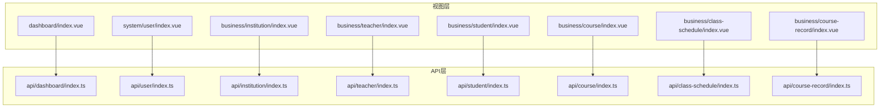

图表来源
- [仪表盘页面:1-106](file://class_record_admin_front/src/views/dashboard/index.vue#L1-L106)
- [仪表盘API:1-6](file://class_record_admin_front/src/api/dashboard/index.ts#L1-L6)
- [用户管理页面:1-360](file://class_record_admin_front/src/views/system/user/index.vue#L1-L360)
- [用户API:1-30](file://class_record_admin_front/src/api/user/index.ts#L1-L30)
- [机构管理页面:1-326](file://class_record_admin_front/src/views/business/institution/index.vue#L1-L326)
- [机构API:1-14](file://class_record_admin_front/src/api/institution/index.ts#L1-L14)
- [教师管理页面:1-460](file://class_record_admin_front/src/views/business/teacher/index.vue#L1-L460)
- [教师API:1-14](file://class_record_admin_front/src/api/teacher/index.ts#L1-L14)
- [学生管理页面:1-262](file://class_record_admin_front/src/views/business/student/index.vue#L1-L262)
- [学生API:1-14](file://class_record_admin_front/src/api/student/index.ts#L1-L14)
- [课程管理页面:1-242](file://class_record_admin_front/src/views/business/course/index.vue#L1-L242)
- [课程API:1-14](file://class_record_admin_front/src/api/course/index.ts#L1-L14)
- [排课管理页面:1-238](file://class_record_admin_front/src/views/business/class-schedule/index.vue#L1-L238)
- [排课API:1-10](file://class_record_admin_front/src/api/class-schedule/index.ts#L1-L10)
- [课时记录页面:1-328](file://class_record_admin_front/src/views/business/course-record/index.vue#L1-L328)
- [课时记录API:1-14](file://class_record_admin_front/src/api/course-record/index.ts#L1-L14)

章节来源
- [仪表盘页面:1-106](file://class_record_admin_front/src/views/dashboard/index.vue#L1-L106)
- [用户管理页面:1-360](file://class_record_admin_front/src/views/system/user/index.vue#L1-L360)
- [机构管理页面:1-326](file://class_record_admin_front/src/views/business/institution/index.vue#L1-L326)
- [教师管理页面:1-460](file://class_record_admin_front/src/views/business/teacher/index.vue#L1-L460)
- [学生管理页面:1-262](file://class_record_admin_front/src/views/business/student/index.vue#L1-L262)
- [课程管理页面:1-242](file://class_record_admin_front/src/views/business/course/index.vue#L1-L242)
- [排课管理页面:1-238](file://class_record_admin_front/src/views/business/class-schedule/index.vue#L1-L238)
- [课时记录页面:1-328](file://class_record_admin_front/src/views/business/course-record/index.vue#L1-L328)

## 核心组件
本节概述各模块共用的页面结构与交互模式：
- 页面头部：标题 + 帮助入口
- 搜索区：输入框、下拉筛选、查询/重置按钮
- 表格区：分页、排序、状态标签、操作列
- 弹窗表单：新增/编辑复用同一弹窗，提交后刷新列表
- 数据加载：onMounted 初始化，分页切换触发重新拉取
- 错误处理：统一拦截器提示，局部失败时给出友好反馈

章节来源
- [用户管理页面:1-360](file://class_record_admin_front/src/views/system/user/index.vue#L1-L360)
- [机构管理页面:1-326](file://class_record_admin_front/src/views/business/institution/index.vue#L1-L326)
- [教师管理页面:1-460](file://class_record_admin_front/src/views/business/teacher/index.vue#L1-L460)
- [学生管理页面:1-262](file://class_record_admin_front/src/views/business/student/index.vue#L1-L262)
- [课程管理页面:1-242](file://class_record_admin_front/src/views/business/course/index.vue#L1-L242)
- [排课管理页面:1-238](file://class_record_admin_front/src/views/business/class-schedule/index.vue#L1-L238)
- [课时记录页面:1-328](file://class_record_admin_front/src/views/business/course-record/index.vue#L1-L328)

## 架构总览
管理端整体为“视图 -> API -> 后端服务”的单向数据流。视图负责渲染与交互，API 层统一封装 HTTP 调用，返回标准响应结构。部分敏感字段（如密码）在前端使用国密 SM2 公钥加密后再传输。

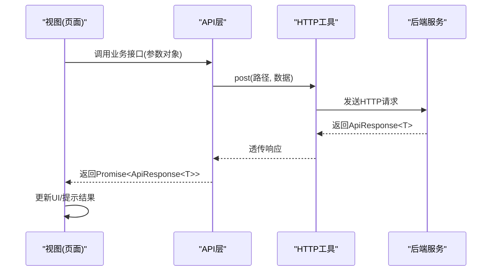

图表来源
- [仪表盘API:1-6](file://class_record_admin_front/src/api/dashboard/index.ts#L1-L6)
- [用户API:1-30](file://class_record_admin_front/src/api/user/index.ts#L1-L30)
- [机构API:1-14](file://class_record_admin_front/src/api/institution/index.ts#L1-L14)
- [教师API:1-14](file://class_record_admin_front/src/api/teacher/index.ts#L1-L14)
- [学生API:1-14](file://class_record_admin_front/src/api/student/index.ts#L1-L14)
- [课程API:1-14](file://class_record_admin_front/src/api/course/index.ts#L1-L14)
- [排课API:1-10](file://class_record_admin_front/src/api/class-schedule/index.ts#L1-L10)
- [课时记录API:1-14](file://class_record_admin_front/src/api/course-record/index.ts#L1-L14)

## 详细组件分析

### 仪表盘统计
- 页面结构：顶部标题+帮助；卡片式统计指标；加载中骨架屏
- 数据流：进入页面即拉取统计数据，成功后填充卡片数值
- 交互特性：无复杂表单，仅数据展示与加载态
- 错误处理：静默失败，卡片显示默认值

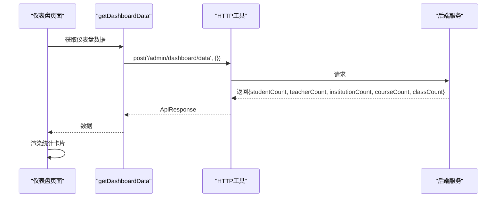

图表来源
- [仪表盘页面:1-106](file://class_record_admin_front/src/views/dashboard/index.vue#L1-L106)
- [仪表盘API:1-6](file://class_record_admin_front/src/api/dashboard/index.ts#L1-L6)

章节来源
- [仪表盘页面:1-106](file://class_record_admin_front/src/views/dashboard/index.vue#L1-L106)
- [仪表盘API:1-6](file://class_record_admin_front/src/api/dashboard/index.ts#L1-L6)

### 用户管理
- 页面结构：搜索栏（用户名、手机号、状态）、表格（含状态标签、创建时间）、分页、新增/编辑弹窗（含角色多选）
- 数据流：
  - 列表：getUserList 分页查询
  - 角色：getRoleList 全量加载供选择
  - 详情：getUserRoles 回显已分配角色
- 表单验证：必填项校验（用户名、昵称、密码），编辑时隐藏密码输入
- 安全：新增/重置密码前获取公钥，使用 SM2 加密明文密码再提交
- 交互特性：删除与重置密码二次确认，成功提示并刷新列表

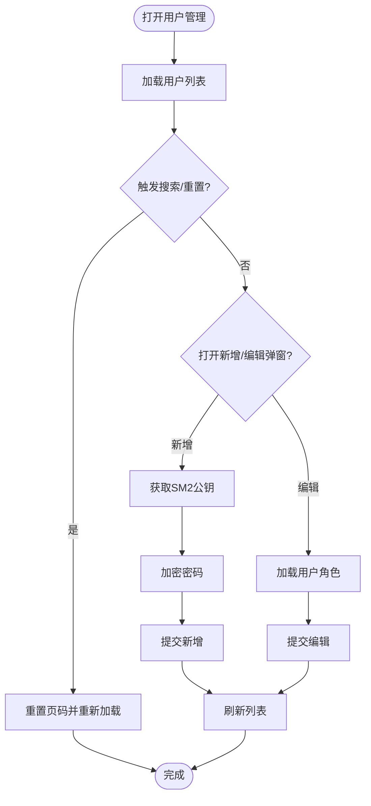

图表来源
- [用户管理页面:1-360](file://class_record_admin_front/src/views/system/user/index.vue#L1-L360)
- [用户API:1-30](file://class_record_admin_front/src/api/user/index.ts#L1-L30)

章节来源
- [用户管理页面:1-360](file://class_record_admin_front/src/views/system/user/index.vue#L1-L360)
- [用户API:1-30](file://class_record_admin_front/src/api/user/index.ts#L1-L30)

### 机构管理
- 页面结构：搜索栏（名称、代码、状态）、表格（状态映射、到期时间、订阅套餐）、分页、新增/编辑弹窗、详情弹窗
- 数据流：getInstitutionList 分页查询；updateInstitution/insertInstitution 提交
- 表单验证：机构名称必填
- 交互特性：行内开关快速启用/禁用；详情只读展示

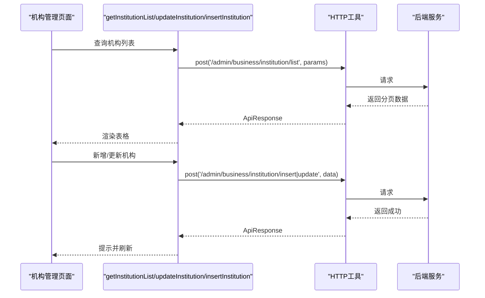

图表来源
- [机构管理页面:1-326](file://class_record_admin_front/src/views/business/institution/index.vue#L1-L326)
- [机构API:1-14](file://class_record_admin_front/src/api/institution/index.ts#L1-L14)

章节来源
- [机构管理页面:1-326](file://class_record_admin_front/src/views/business/institution/index.vue#L1-L326)
- [机构API:1-14](file://class_record_admin_front/src/api/institution/index.ts#L1-L14)

### 教师管理
- 页面结构：搜索栏（用户名、所属机构、状态）、表格（登录账号、机构管理员标识、最后登录、状态）、分页、新增/编辑弹窗、账号管理弹窗
- 数据流：
  - 列表：getTeacherList 分页查询
  - 选项：getInstitutionList 用于下拉机构
  - 账号：getTeacherAccount/updateTeacherAccount/updateTeacherPassword/toggleInstitutionAdmin
- 表单验证：用户名、机构必填；密码长度校验
- 安全：新增或重置密码时使用 SM2 公钥加密
- 交互特性：行内启停、设为/取消机构管理员二次确认

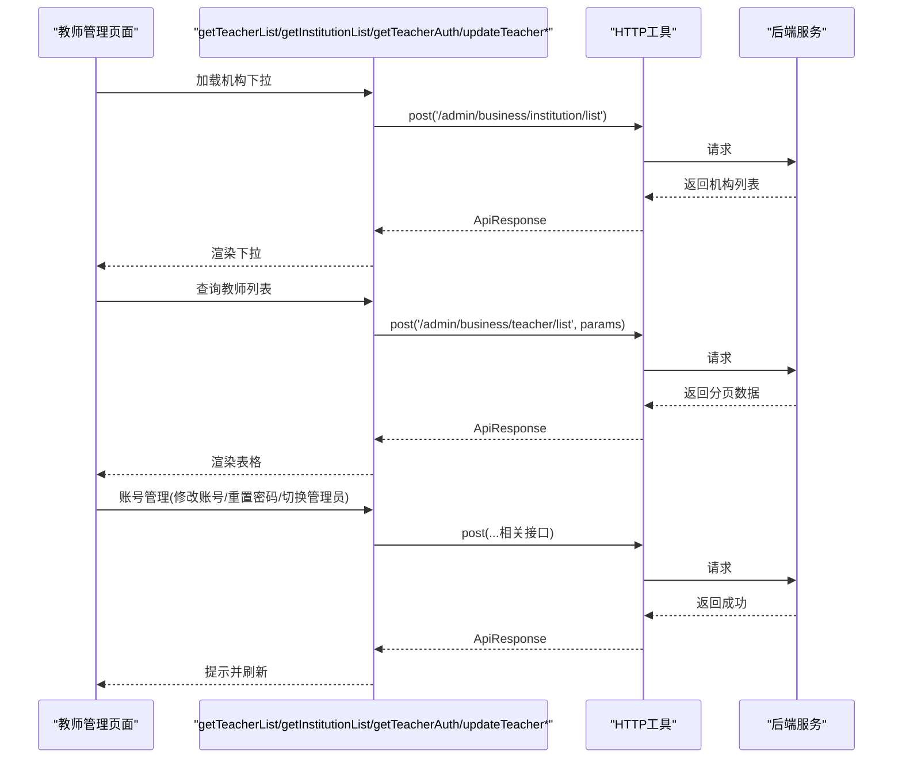

图表来源
- [教师管理页面:1-460](file://class_record_admin_front/src/views/business/teacher/index.vue#L1-L460)
- [教师API:1-14](file://class_record_admin_front/src/api/teacher/index.ts#L1-L14)
- [机构API:1-14](file://class_record_admin_front/src/api/institution/index.ts#L1-L14)

章节来源
- [教师管理页面:1-460](file://class_record_admin_front/src/views/business/teacher/index.vue#L1-L460)
- [教师API:1-14](file://class_record_admin_front/src/api/teacher/index.ts#L1-L14)
- [机构API:1-14](file://class_record_admin_front/src/api/institution/index.ts#L1-L14)

### 学生管理
- 页面结构：搜索栏（姓名、性别、所属机构）、表格（联系人信息聚合展示）、分页、新增/编辑弹窗
- 数据流：getStudentList 分页查询；insertStudent/updateStudent 提交
- 表单验证：姓名、机构必填
- 交互特性：编辑回填日期字符串，提交时转换为数字机构ID

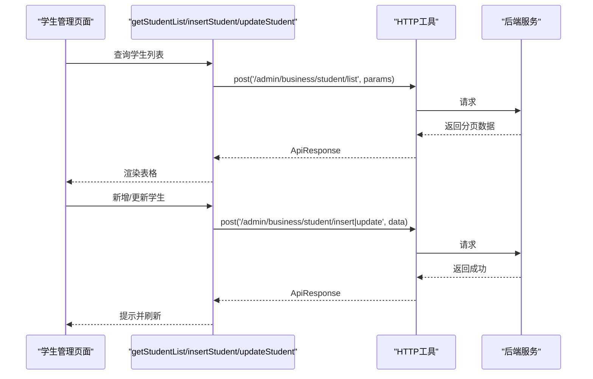

图表来源
- [学生管理页面:1-262](file://class_record_admin_front/src/views/business/student/index.vue#L1-L262)
- [学生API:1-14](file://class_record_admin_front/src/api/student/index.ts#L1-L14)

章节来源
- [学生管理页面:1-262](file://class_record_admin_front/src/views/business/student/index.vue#L1-L262)
- [学生API:1-14](file://class_record_admin_front/src/api/student/index.ts#L1-L14)

### 课程管理
- 页面结构：搜索栏（名称、类型、状态）、表格（类型标签、状态）、分页、新增/编辑弹窗
- 数据流：getCourseList 分页查询；insertCourse/updateCourse 提交
- 表单验证：课程名称、机构必填
- 交互特性：类型与状态标签化展示

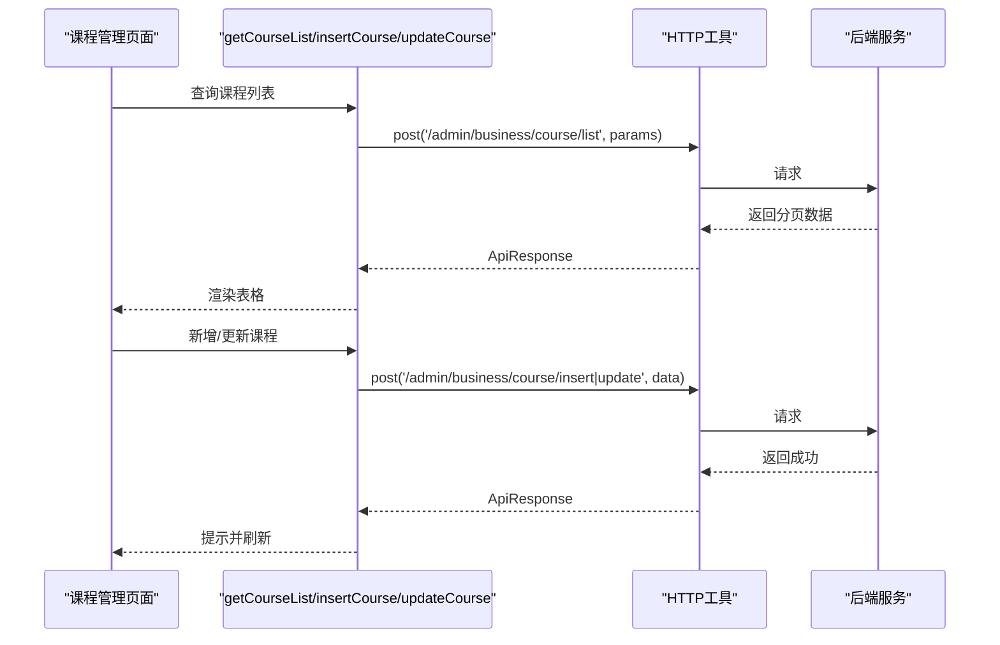

图表来源
- [课程管理页面:1-242](file://class_record_admin_front/src/views/business/course/index.vue#L1-L242)
- [课程API:1-14](file://class_record_admin_front/src/api/course/index.ts#L1-L14)

章节来源
- [课程管理页面:1-242](file://class_record_admin_front/src/views/business/course/index.vue#L1-L242)
- [课程API:1-14](file://class_record_admin_front/src/api/course/index.ts#L1-L14)

### 排课管理
- 页面结构：级联筛选（机构 -> 课程 -> 班级）、表格（日期范围、星期、时间段、备注）、编辑弹窗
- 数据流：
  - 选项：getInstitutionList、getCourseList、getClassList
  - 列表：getClassScheduleList(classId, institutionId)
  - 更新：updateClassSchedule
- 联动逻辑：选择机构清空课程/班级；选择课程清空班级；选择班级才加载排课
- 表单验证：开始/结束日期、星期、开始/结束时间必填

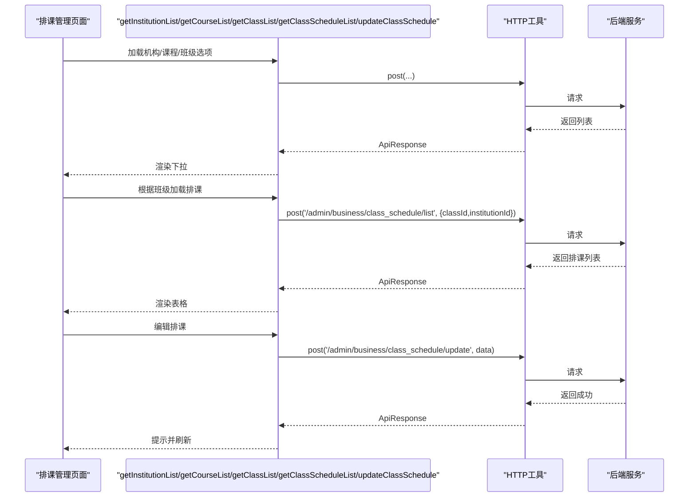

图表来源
- [排课管理页面:1-238](file://class_record_admin_front/src/views/business/class-schedule/index.vue#L1-L238)
- [排课API:1-10](file://class_record_admin_front/src/api/class-schedule/index.ts#L1-L10)
- [课程API:1-14](file://class_record_admin_front/src/api/course/index.ts#L1-L14)
- [机构API:1-14](file://class_record_admin_front/src/api/institution/index.ts#L1-L14)

章节来源
- [排课管理页面:1-238](file://class_record_admin_front/src/views/business/class-schedule/index.vue#L1-L238)
- [排课API:1-10](file://class_record_admin_front/src/api/class-schedule/index.ts#L1-L10)
- [课程API:1-14](file://class_record_admin_front/src/api/course/index.ts#L1-L14)
- [机构API:1-14](file://class_record_admin_front/src/api/institution/index.ts#L1-L14)

### 课时记录（学生课程）
- 页面结构：筛选（机构、学生、课程、状态）、表格（进度条、剩余课时、上次上课、到期时间、状态）、分页、新增/编辑弹窗
- 数据流：
  - 选项：getInstitutionList、getStudentList、getCourseList
  - 列表：getCourseRecordList
  - 提交：insertCourseRecord/updateCourseRecord
- 表单验证：学生、课程、总课时必填；剩余课时不大于总课时
- 交互特性：进度百分比与颜色动态计算

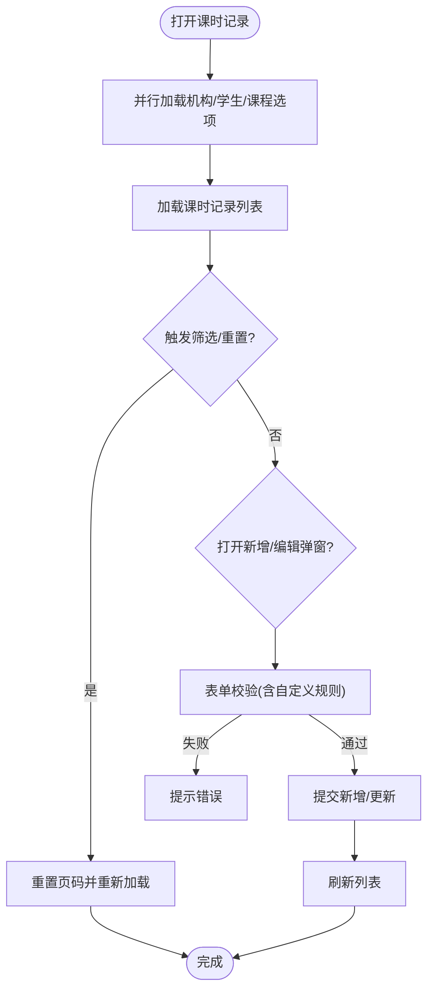

图表来源
- [课时记录页面:1-328](file://class_record_admin_front/src/views/business/course-record/index.vue#L1-L328)
- [课时记录API:1-14](file://class_record_admin_front/src/api/course-record/index.ts#L1-L14)
- [学生API:1-14](file://class_record_admin_front/src/api/student/index.ts#L1-L14)
- [课程API:1-14](file://class_record_admin_front/src/api/course/index.ts#L1-L14)
- [机构API:1-14](file://class_record_admin_front/src/api/institution/index.ts#L1-L14)

章节来源
- [课时记录页面:1-328](file://class_record_admin_front/src/views/business/course-record/index.vue#L1-L328)
- [课时记录API:1-14](file://class_record_admin_front/src/api/course-record/index.ts#L1-L14)
- [学生API:1-14](file://class_record_admin_front/src/api/student/index.ts#L1-L14)
- [课程API:1-14](file://class_record_admin_front/src/api/course/index.ts#L1-L14)
- [机构API:1-14](file://class_record_admin_front/src/api/institution/index.ts#L1-L14)

## 依赖分析
- 视图到API：每个页面仅依赖对应领域的API模块，保持低耦合
- API到HTTP工具：统一通过 post 方法发起请求，便于统一拦截与错误处理
- 跨模块依赖：
  - 教师/学生/课程/排课/课时记录均依赖机构列表作为下拉选项
  - 排课管理依赖课程与班级的级联关系
  - 用户管理与教师管理在涉及密码时依赖公钥获取与SM2加密

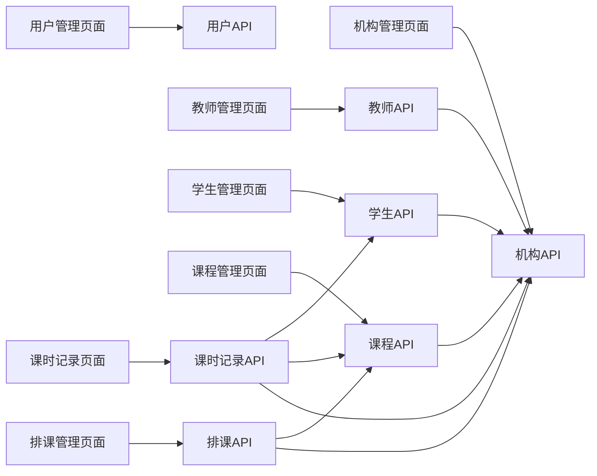

图表来源
- [用户管理页面:1-360](file://class_record_admin_front/src/views/system/user/index.vue#L1-L360)
- [用户API:1-30](file://class_record_admin_front/src/api/user/index.ts#L1-L30)
- [机构管理页面:1-326](file://class_record_admin_front/src/views/business/institution/index.vue#L1-L326)
- [机构API:1-14](file://class_record_admin_front/src/api/institution/index.ts#L1-L14)
- [教师管理页面:1-460](file://class_record_admin_front/src/views/business/teacher/index.vue#L1-L460)
- [教师API:1-14](file://class_record_admin_front/src/api/teacher/index.ts#L1-L14)
- [学生管理页面:1-262](file://class_record_admin_front/src/views/business/student/index.vue#L1-L262)
- [学生API:1-14](file://class_record_admin_front/src/api/student/index.ts#L1-L14)
- [课程管理页面:1-242](file://class_record_admin_front/src/views/business/course/index.vue#L1-L242)
- [课程API:1-14](file://class_record_admin_front/src/api/course/index.ts#L1-L14)
- [排课管理页面:1-238](file://class_record_admin_front/src/views/business/class-schedule/index.vue#L1-L238)
- [排课API:1-10](file://class_record_admin_front/src/api/class-schedule/index.ts#L1-L10)
- [课时记录页面:1-328](file://class_record_admin_front/src/views/business/course-record/index.vue#L1-L328)
- [课时记录API:1-14](file://class_record_admin_front/src/api/course-record/index.ts#L1-L14)

章节来源
- [教师管理页面:1-460](file://class_record_admin_front/src/views/business/teacher/index.vue#L1-L460)
- [学生管理页面:1-262](file://class_record_admin_front/src/views/business/student/index.vue#L1-L262)
- [课程管理页面:1-242](file://class_record_admin_front/src/views/business/course/index.vue#L1-L242)
- [排课管理页面:1-238](file://class_record_admin_front/src/views/business/class-schedule/index.vue#L1-L238)
- [课时记录页面:1-328](file://class_record_admin_front/src/views/business/course-record/index.vue#L1-L328)

## 性能考虑
- 列表分页：所有列表接口均支持分页参数，避免一次性加载大量数据
- 选项预加载：下拉选项通常一次全量加载（pageSize=999），减少重复请求
- 并发请求：课时记录页面并行加载机构/学生/课程选项，缩短首屏等待
- 条件过滤：仅在非空条件下拼接查询参数，减少无效请求
- 本地计算：进度条百分比与颜色在前端计算，降低后端压力

[本节为通用建议，不直接分析具体文件]

## 故障排查指南
- 网络与权限：
  - 检查HTTP工具是否统一拦截错误并提示
  - 确认接口路径与权限配置正确
- 表单校验：
  - 必填项未通过导致无法提交
  - 自定义校验（如剩余课时不大于总课时）需关注错误提示
- 安全相关：
  - 获取公钥失败会导致密码加密失败，应优先提示并中止提交
  - 确保SM2加密流程一致（新增/重置密码场景）
- 数据一致性：
  - 下拉选项为空时，注意级联禁用与空状态提示
  - 列表刷新时机应在提交成功后执行

章节来源
- [用户管理页面:1-360](file://class_record_admin_front/src/views/system/user/index.vue#L1-L360)
- [教师管理页面:1-460](file://class_record_admin_front/src/views/business/teacher/index.vue#L1-L460)
- [课时记录页面:1-328](file://class_record_admin_front/src/views/business/course-record/index.vue#L1-L328)

## 结论
管理端核心模块遵循统一的页面结构与数据流模式，具备完善的表单验证、列表展示、搜索过滤与交互体验。通过API层解耦与HTTP工具统一封装，提升了可维护性与扩展性。建议在新增功能时沿用现有模板与最佳实践，确保一致的用户体验与代码风格。

[本节为总结性内容，不直接分析具体文件]

## 附录

### 新功能开发模板与最佳实践
- 页面结构模板
  - 页面头部：标题 + 帮助
  - 搜索区：输入框/下拉 + 查询/重置
  - 表格区：分页 + 状态标签 + 操作列
  - 弹窗表单：新增/编辑复用，提交后刷新列表
- 数据流模板
  - onMounted 初始化加载列表与必要选项
  - 搜索/重置：重置页码并重新加载
  - 分页：current-change/size-change 触发加载
- API封装模板
  - 在对应 api/<domain>/index.ts 中定义接口函数
  - 使用 post 统一发起请求，返回 Promise<ApiResponse<T>>
- 表单验证模板
  - 使用 Element Plus 的 FormRules 进行基础校验
  - 复杂逻辑使用自定义 validator
- 安全模板
  - 涉及密码：先获取公钥，再用 SM2 加密后提交
- 错误处理模板
  - 统一拦截器提示
  - 局部失败时给出明确错误消息

章节来源
- [用户管理页面:1-360](file://class_record_admin_front/src/views/system/user/index.vue#L1-L360)
- [机构管理页面:1-326](file://class_record_admin_front/src/views/business/institution/index.vue#L1-L326)
- [教师管理页面:1-460](file://class_record_admin_front/src/views/business/teacher/index.vue#L1-L460)
- [学生管理页面:1-262](file://class_record_admin_front/src/views/business/student/index.vue#L1-L262)
- [课程管理页面:1-242](file://class_record_admin_front/src/views/business/course/index.vue#L1-L242)
- [排课管理页面:1-238](file://class_record_admin_front/src/views/business/class-schedule/index.vue#L1-L238)
- [课时记录页面:1-328](file://class_record_admin_front/src/views/business/course-record/index.vue#L1-L328)

### API调用方式参考
- 仪表盘
  - 获取数据：post('/admin/dashboard/data', {})
- 用户
  - 列表：post('/admin/user/list', data)
  - 新增：post('/admin/user/insert', data)
  - 更新：post('/admin/user/update', data)
  - 删除：post('/admin/user/delete', { id })
  - 重置密码：post('/admin/user/reset_password', data)
  - 获取角色：post('/admin/user/get_roles', { userId })
- 机构
  - 列表：post('/admin/business/institution/list', data)
  - 新增：post('/admin/business/institution/insert', data)
  - 更新：post('/admin/business/institution/update', data)
- 教师
  - 列表：post('/admin/business/teacher/list', data)
  - 新增：post('/admin/business/teacher/insert', data)
  - 更新：post('/admin/business/teacher/update', data)
- 学生
  - 列表：post('/admin/business/student/list', data)
  - 新增：post('/admin/business/student/insert', data)
  - 更新：post('/admin/business/student/update', data)
- 课程
  - 列表：post('/admin/business/course/list', data)
  - 新增：post('/admin/business/course/insert', data)
  - 更新：post('/admin/business/course/update', data)
- 排课
  - 列表：post('/admin/business/class_schedule/list', data)
  - 更新：post('/admin/business/class_schedule/update', data)
- 课时记录
  - 列表：post('/admin/business/course_record/list', data)
  - 新增：post('/admin/business/course_record/insert', data)
  - 更新：post('/admin/business/course_record/update', data)

章节来源
- [仪表盘API:1-6](file://class_record_admin_front/src/api/dashboard/index.ts#L1-L6)
- [用户API:1-30](file://class_record_admin_front/src/api/user/index.ts#L1-L30)
- [机构API:1-14](file://class_record_admin_front/src/api/institution/index.ts#L1-L14)
- [教师API:1-14](file://class_record_admin_front/src/api/teacher/index.ts#L1-L14)
- [学生API:1-14](file://class_record_admin_front/src/api/student/index.ts#L1-L14)
- [课程API:1-14](file://class_record_admin_front/src/api/course/index.ts#L1-L14)
- [排课API:1-10](file://class_record_admin_front/src/api/class-schedule/index.ts#L1-L10)
- [课时记录API:1-14](file://class_record_admin_front/src/api/course-record/index.ts#L1-L14)