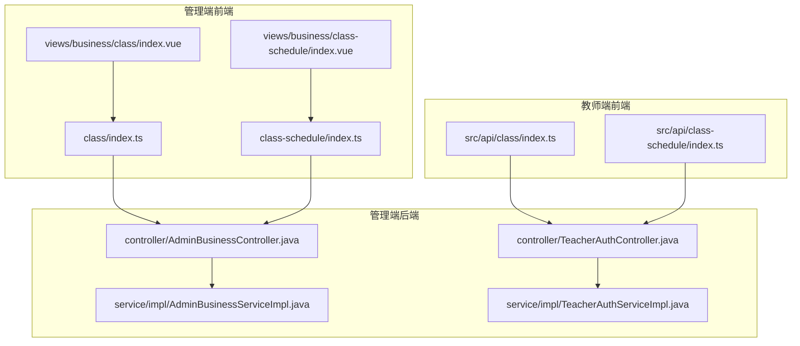
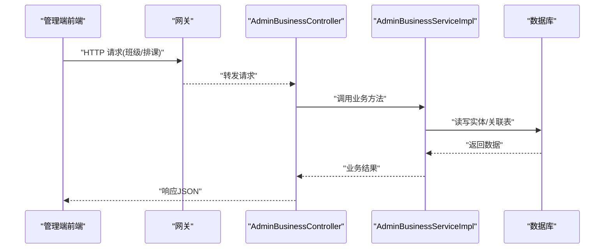
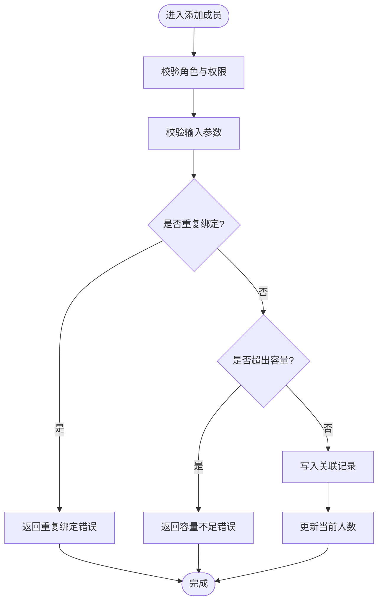
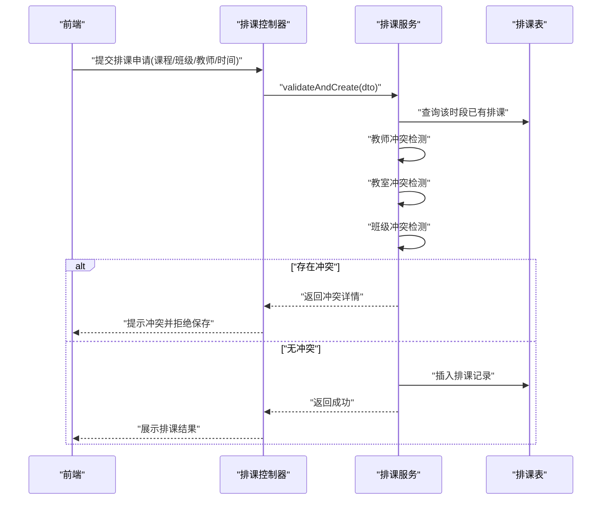
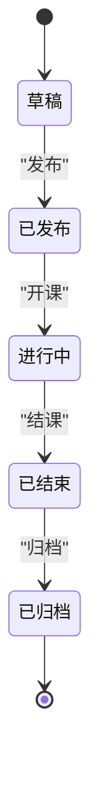
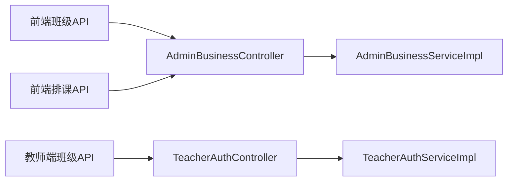

# 班级管理模块

<cite>
**本文引用的文件**
- [AdminBusinessController.java](file://class_times_record_back/admin-service/src/main/java/com/shiroko/controller/AdminBusinessController.java)
- [AdminBusinessServiceImpl.java](file://class_times_record_back/admin-service/src/main/java/com/shiroko/service/impl/AdminBusinessServiceImpl.java)
- [index.ts（前端班级API）](file://class_record_admin_front/src/api/class/index.ts)
- [index.vue（前端班级管理页面）](file://class_record_admin_front/src/views/business/class/index.vue)
- [index.d.ts（前端班级类型定义）](file://class_record_admin_front/src/views/business/class/index.d.ts)
- [index.ts（前端排课API）](file://class_record_admin_front/src/api/class-schedule/index.ts)
- [index.vue（前端排课页面）](file://class_record_admin_front/src/views/business/class-schedule/index.vue)
- [index.d.ts（前端排课类型定义）](file://class_record_admin_front/src/views/business/class-schedule/index.d.ts)
- [index.ts（教师端班级API）](file://class_times_record/src/api/class/index.ts)
- [index.ts（教师端排课API）](file://class_times_record/src/api/class-schedule/index.ts)
- [TeacherAuthController.java](file://class_times_record_back/admin-service/src/main/java/com/shiroko/controller/TeacherAuthController.java)
- [TeacherAuthServiceImpl.java](file://class_times_record_back/admin-service/src/main/java/com/shiroko/service/impl/TeacherAuthServiceImpl.java)
</cite>

## 目录
1. [简介](#简介)
2. [项目结构](#项目结构)
3. [核心组件](#核心组件)
4. [架构总览](#架构总览)
5. [详细组件分析](#详细组件分析)
6. [依赖关系分析](#依赖关系分析)
7. [性能与并发](#性能与并发)
8. [故障排查指南](#故障排查指南)
9. [结论](#结论)
10. [附录：API接口文档](#附录api接口文档)

## 简介
本模块聚焦“班级管理”全生命周期能力，覆盖班级创建、成员管理（学生/教师）、课程安排、容量控制、状态流转、批量操作、导入导出以及数据分析。后端采用微服务分层架构，前端提供管理端与教师端双视角的交互界面。本文从系统架构、数据流、处理逻辑、并发策略到API契约进行系统化说明，帮助读者快速理解并高效使用。

## 项目结构
围绕“班级管理”，前后端关键位置如下：
- 管理端前端
  - API封装：class、class-schedule
  - 页面：business/class、business/class-schedule
- 教师端前端
  - API封装：class、class-schedule
- 管理端后端
  - 控制器：AdminBusinessController、TeacherAuthController
  - 服务实现：AdminBusinessServiceImpl、TeacherAuthServiceImpl



图表来源
- [AdminBusinessController.java](file://class_times_record_back/admin-service/src/main/java/com/shiroko/controller/AdminBusinessController.java)
- [AdminBusinessServiceImpl.java](file://class_times_record_back/admin-service/src/main/java/com/shiroko/service/impl/AdminBusinessServiceImpl.java)
- [TeacherAuthController.java](file://class_times_record_back/admin-service/src/main/java/com/shiroko/controller/TeacherAuthController.java)
- [TeacherAuthServiceImpl.java](file://class_times_record_back/admin-service/src/main/java/com/shiroko/service/impl/TeacherAuthServiceImpl.java)
- [index.ts（前端班级API）](file://class_record_admin_front/src/api/class/index.ts)
- [index.ts（前端排课API）](file://class_record_admin_front/src/api/class-schedule/index.ts)
- [index.vue（前端班级管理页面）](file://class_record_admin_front/src/views/business/class/index.vue)
- [index.vue（前端排课页面）](file://class_record_admin_front/src/views/business/class-schedule/index.vue)
- [index.ts（教师端班级API）](file://class_times_record/src/api/class/index.ts)
- [index.ts（教师端排课API）](file://class_times_record/src/api/class-schedule/index.ts)

章节来源
- [AdminBusinessController.java](file://class_times_record_back/admin-service/src/main/java/com/shiroko/controller/AdminBusinessController.java)
- [AdminBusinessServiceImpl.java](file://class_times_record_back/admin-service/src/main/java/com/shiroko/service/impl/AdminBusinessServiceImpl.java)
- [TeacherAuthController.java](file://class_times_record_back/admin-service/src/main/java/com/shiroko/controller/TeacherAuthController.java)
- [TeacherAuthServiceImpl.java](file://class_times_record_back/admin-service/src/main/java/com/shiroko/service/impl/TeacherAuthServiceImpl.java)
- [index.ts（前端班级API）](file://class_record_admin_front/src/api/class/index.ts)
- [index.ts（前端排课API）](file://class_record_admin_front/src/api/class-schedule/index.ts)
- [index.vue（前端班级管理页面）](file://class_record_admin_front/src/views/business/class/index.vue)
- [index.vue（前端排课页面）](file://class_record_admin_front/src/views/business/class-schedule/index.vue)
- [index.ts（教师端班级API）](file://class_times_record/src/api/class/index.ts)
- [index.ts（教师端排课API）](file://class_times_record/src/api/class-schedule/index.ts)

## 核心组件
- 管理端业务控制器与服务
  - AdminBusinessController：对外暴露班级与排课相关REST接口，承载权限校验、参数校验与结果封装。
  - AdminBusinessServiceImpl：实现班级CRUD、成员增删、容量校验、排课冲突检测、状态变更等核心业务。
- 教师端认证与授权
  - TeacherAuthController/TeacherAuthServiceImpl：面向教师的鉴权与授权流程，确保仅具备相应角色的用户可访问班级与排课能力。
- 前端API与页面
  - class/class-schedule API封装：统一请求路径、参数序列化、错误处理。
  - 页面视图：提供表单、列表、日历视图、批量操作入口与导入导出按钮。

章节来源
- [AdminBusinessController.java](file://class_times_record_back/admin-service/src/main/java/com/shiroko/controller/AdminBusinessController.java)
- [AdminBusinessServiceImpl.java](file://class_times_record_back/admin-service/src/main/java/com/shiroko/service/impl/AdminBusinessServiceImpl.java)
- [TeacherAuthController.java](file://class_times_record_back/admin-service/src/main/java/com/shiroko/controller/TeacherAuthController.java)
- [TeacherAuthServiceImpl.java](file://class_times_record_back/admin-service/src/main/java/com/shiroko/service/impl/TeacherAuthServiceImpl.java)
- [index.ts（前端班级API）](file://class_record_admin_front/src/api/class/index.ts)
- [index.ts（前端排课API）](file://class_record_admin_front/src/api/class-schedule/index.ts)
- [index.vue（前端班级管理页面）](file://class_record_admin_front/src/views/business/class/index.vue)
- [index.vue（前端排课页面）](file://class_record_admin_front/src/views/business/class-schedule/index.vue)

## 架构总览
整体采用“前端—网关—微服务—存储”的分层架构。管理类功能集中在admin-service；教师端通过同一网关路由至对应控制器；数据库持久化由通用仓储层完成。



图表来源
- [AdminBusinessController.java](file://class_times_record_back/admin-service/src/main/java/com/shiroko/controller/AdminBusinessController.java)
- [AdminBusinessServiceImpl.java](file://class_times_record_back/admin-service/src/main/java/com/shiroko/service/impl/AdminBusinessServiceImpl.java)

## 详细组件分析

### 班级实体与多对多关系
- 实体关系
  - 班级 ↔ 课程：多对多（一个班级包含多门课程，一门课程可被多个班级教授）
  - 班级 ↔ 教师：多对多（一个班级可由多位教师授课，一位教师可教多个班级）
  - 班级 ↔ 学生：多对多（一个班级有多名学生，一名学生可加入多个班级）
- 容量控制
  - 字段：最大容量、当前人数
  - 规则：新增成员前校验是否超过容量；支持动态调整容量上限
- 状态流转
  - 典型状态：草稿、已发布、进行中、已结束、已归档
  - 约束：仅允许在特定状态下执行特定操作（如发布后不可再编辑基础信息）

```mermaid
erDiagram
CLASS {
uuid id PK
string name
int max_capacity
int current_count
enum status
timestamp created_at
timestamp updated_at
}
COURSE {
uuid id PK
string title
string description
}
TEACHER {
uuid id PK
string name
string phone
}
STUDENT {
uuid id PK
string name
string student_no
}
CLASS ||--o{ CLASS_COURSE : "包含"
CLASS ||--o{ CLASS_TEACHER : "任课"
CLASS ||--o{ CLASS_STUDENT : "成员"
COURSE ||--o{ CLASS_COURSE : "被选入"
TEACHER ||--o{ CLASS_TEACHER : "任教"
STUDENT ||--o{ CLASS_STUDENT : "就读"
```

图表来源
- [AdminBusinessServiceImpl.java](file://class_times_record_back/admin-service/src/main/java/com/shiroko/service/impl/AdminBusinessServiceImpl.java)

章节来源
- [AdminBusinessServiceImpl.java](file://class_times_record_back/admin-service/src/main/java/com/shiroko/service/impl/AdminBusinessServiceImpl.java)

### 班级CRUD与成员管理
- 创建班级
  - 输入：名称、容量、初始状态、可选的课程/教师/学生ID集合
  - 处理：校验唯一性、容量合法性、初始化计数为0
- 更新/删除
  - 更新：仅允许在允许的状态下修改；若调整容量需重新校验现有成员数
  - 删除：级联清理关联或软删除（视实现而定）
- 成员管理
  - 添加学生/教师：先校验是否存在重复绑定，再检查容量限制
  - 移除成员：减少当前计数，必要时触发通知或审计日志
  - 批量操作：支持批量导入/导出，内部以事务保证一致性



图表来源
- [AdminBusinessServiceImpl.java](file://class_times_record_back/admin-service/src/main/java/com/shiroko/service/impl/AdminBusinessServiceImpl.java)

章节来源
- [AdminBusinessController.java](file://class_times_record_back/admin-service/src/main/java/com/shiroko/controller/AdminBusinessController.java)
- [AdminBusinessServiceImpl.java](file://class_times_record_back/admin-service/src/main/java/com/shiroko/service/impl/AdminBusinessServiceImpl.java)

### 排课与冲突检测
- 排课要素
  - 课程、班级、教师、教室、开始时间、结束时间、周期/周次
- 冲突维度
  - 教师时间冲突：同一教师在同一时段不能同时授课
  - 教室时间冲突：同一教室在同一时段只能容纳一次课
  - 班级时间冲突：同一班级在同一时段只能上一门课
- 冲突检测流程
  - 计算候选时间段交集
  - 查询已有排课，按上述维度逐一比对
  - 无冲突则落库，有冲突则返回具体冲突明细



图表来源
- [AdminBusinessController.java](file://class_times_record_back/admin-service/src/main/java/com/shiroko/controller/AdminBusinessController.java)
- [AdminBusinessServiceImpl.java](file://class_times_record_back/admin-service/src/main/java/com/shiroko/service/impl/AdminBusinessServiceImpl.java)

章节来源
- [AdminBusinessController.java](file://class_times_record_back/admin-service/src/main/java/com/shiroko/controller/AdminBusinessController.java)
- [AdminBusinessServiceImpl.java](file://class_times_record_back/admin-service/src/main/java/com/shiroko/service/impl/AdminBusinessServiceImpl.java)

### 班级状态管理
- 状态机
  - 草稿 → 已发布：完成必要信息校验后发布
  - 已发布 → 进行中：到达开课时间自动或手动切换
  - 进行中 → 已结束：达到结课条件
  - 已结束 → 已归档：完成数据归档与统计
- 约束
  - 非允许状态禁止编辑基础信息
  - 状态变更需记录审计日志



图表来源
- [AdminBusinessServiceImpl.java](file://class_times_record_back/admin-service/src/main/java/com/shiroko/service/impl/AdminBusinessServiceImpl.java)

章节来源
- [AdminBusinessServiceImpl.java](file://class_times_record_back/admin-service/src/main/java/com/shiroko/service/impl/AdminBusinessServiceImpl.java)

### 批量操作与导入导出
- 批量操作
  - 批量添加/移除成员：分批提交，失败项记录原因，整体事务回滚或补偿
  - 批量调整容量：校验历史数据一致性
- 导入导出
  - 导入：解析Excel/CSV，逐行校验，汇总错误报告
  - 导出：分页拉取、流式输出，避免内存溢出

章节来源
- [AdminBusinessServiceImpl.java](file://class_times_record_back/admin-service/src/main/java/com/shiroko/service/impl/AdminBusinessServiceImpl.java)

### 教师端权限与访问
- 教师端通过TeacherAuth系列组件进行身份认证与授权，仅允许具备相应角色的教师访问其负责班级的排课与成员查看能力。

章节来源
- [TeacherAuthController.java](file://class_times_record_back/admin-service/src/main/java/com/shiroko/controller/TeacherAuthController.java)
- [TeacherAuthServiceImpl.java](file://class_times_record_back/admin-service/src/main/java/com/shiroko/service/impl/TeacherAuthServiceImpl.java)

## 依赖关系分析
- 控制器→服务：解耦业务逻辑，便于测试与扩展
- 服务→仓储/数据库：通过MyBatis-Plus或JPA抽象数据访问
- 前端API→后端控制器：通过RESTful约定，统一错误码与分页格式



图表来源
- [AdminBusinessController.java](file://class_times_record_back/admin-service/src/main/java/com/shiroko/controller/AdminBusinessController.java)
- [AdminBusinessServiceImpl.java](file://class_times_record_back/admin-service/src/main/java/com/shiroko/service/impl/AdminBusinessServiceImpl.java)
- [TeacherAuthController.java](file://class_times_record_back/admin-service/src/main/java/com/shiroko/controller/TeacherAuthController.java)
- [TeacherAuthServiceImpl.java](file://class_times_record_back/admin-service/src/main/java/com/shiroko/service/impl/TeacherAuthServiceImpl.java)
- [index.ts（前端班级API）](file://class_record_admin_front/src/api/class/index.ts)
- [index.ts（前端排课API）](file://class_record_admin_front/src/api/class-schedule/index.ts)
- [index.ts（教师端班级API）](file://class_times_record/src/api/class/index.ts)

## 性能与并发
- 容量与成员数更新
  - 使用数据库行级锁或乐观锁字段version防止超卖
  - 批量操作分片提交，降低长事务风险
- 排课冲突检测
  - 基于索引的时间段查询，避免全表扫描
  - 热点时段可引入Redis缓存预检，最终落库时二次校验
- 导入导出
  - 大文件导入采用流式解析与分批入库
  - 导出采用游标分页+异步任务生成下载链接
- 并发安全
  - 幂等键：对批量操作提供幂等标识，避免重复提交
  - 分布式锁：跨实例场景下对关键资源加锁（如容量调整）

[本节为通用性能建议，不直接分析具体文件]

## 故障排查指南
- 常见错误
  - 容量不足：检查max_capacity与current_count一致性
  - 重复绑定：检查关联表唯一约束
  - 排课冲突：根据返回的冲突明细定位教师/教室/班级维度
- 日志与审计
  - 关注状态变更、成员变动、排课变更的审计日志
  - 结合TraceId追踪跨服务调用链
- 前端问题
  - 表单校验失败：核对必填项与格式
  - 批量导入失败：查看错误报告中的行号与原因

章节来源
- [AdminBusinessController.java](file://class_times_record_back/admin-service/src/main/java/com/shiroko/controller/AdminBusinessController.java)
- [AdminBusinessServiceImpl.java](file://class_times_record_back/admin-service/src/main/java/com/shiroko/service/impl/AdminBusinessServiceImpl.java)

## 结论
本模块围绕“班级”这一核心实体，构建了完整的CRUD、成员管理、排课与状态管理能力，并通过严格的冲突检测与容量控制保障数据一致性与业务正确性。配合前端的双端视图与批量工具，形成闭环的管理体验。后续可在数据分析、智能排课与可视化报表方面持续增强。

## 附录：API接口文档
以下列出与“班级管理”相关的API分组与职责说明。具体URL路径、请求体与响应体以实际实现为准，此处给出结构化描述以便对接。

- 班级接口（管理端）
  - 列表查询：支持分页、筛选（名称、状态、学期等）
  - 创建班级：传入名称、容量、初始课程/教师/学生集合
  - 获取详情：返回班级及关联信息
  - 更新班级：仅允许在允许状态下修改
  - 删除班级：级联或软删除
  - 成员管理：
    - 添加学生/教师：支持单条与批量
    - 移除学生/教师：支持单条与批量
    - 导入成员：上传文件，返回错误报告
    - 导出成员：生成下载链接
  - 容量管理：调整容量上限，校验当前人数
  - 状态管理：发布、开课、结课、归档等状态变更

- 排课接口（管理端）
  - 列表查询：按班级/教师/课程/时间范围筛选
  - 创建排课：提交课程、班级、教师、教室、起止时间、周期
  - 冲突检测：提交前预检，返回冲突明细
  - 更新/删除排课：受状态与权限约束

- 教师端接口（教师认证与授权）
  - 教师登录与令牌刷新
  - 教师可访问的班级列表与详情
  - 教师个人排课查询与调整（受限）

- 前端类型定义
  - 班级类型定义：用于表单与列表渲染
  - 排课类型定义：用于日历与时间选择器

章节来源
- [AdminBusinessController.java](file://class_times_record_back/admin-service/src/main/java/com/shiroko/controller/AdminBusinessController.java)
- [AdminBusinessServiceImpl.java](file://class_times_record_back/admin-service/src/main/java/com/shiroko/service/impl/AdminBusinessServiceImpl.java)
- [index.ts（前端班级API）](file://class_record_admin_front/src/api/class/index.ts)
- [index.ts（前端排课API）](file://class_record_admin_front/src/api/class-schedule/index.ts)
- [index.d.ts（前端班级类型定义）](file://class_record_admin_front/src/views/business/class/index.d.ts)
- [index.d.ts（前端排课类型定义）](file://class_record_admin_front/src/views/business/class-schedule/index.d.ts)
- [index.ts（教师端班级API）](file://class_times_record/src/api/class/index.ts)
- [index.ts（教师端排课API）](file://class_times_record/src/api/class-schedule/index.ts)
- [TeacherAuthController.java](file://class_times_record_back/admin-service/src/main/java/com/shiroko/controller/TeacherAuthController.java)
- [TeacherAuthServiceImpl.java](file://class_times_record_back/admin-service/src/main/java/com/shiroko/service/impl/TeacherAuthServiceImpl.java)