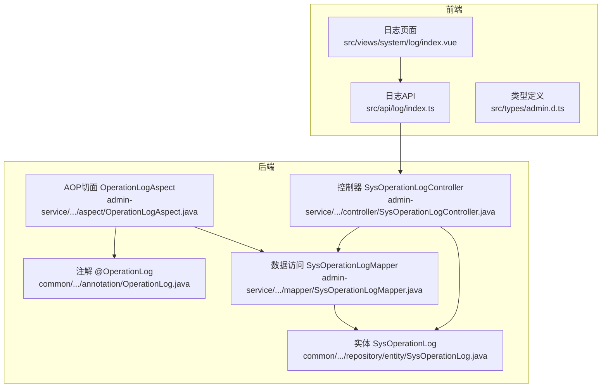
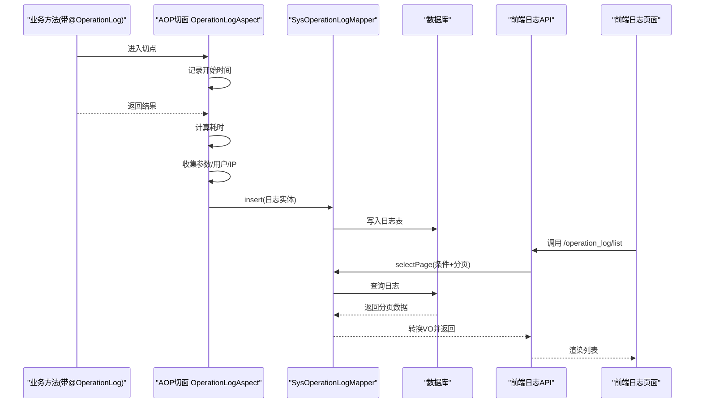
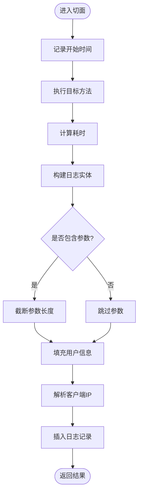
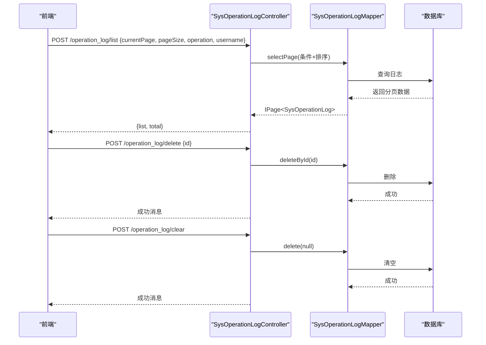
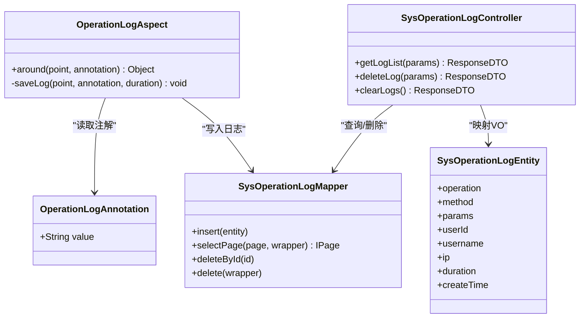

# 操作日志

<cite>
**本文引用的文件**   
- [OperationLogAspect.java](file://class_times_record_back/admin-service/src/main/java/com/shiroko/aspect/OperationLogAspect.java)
- [OperationLog.java](file://class_times_record_back/common/src/main/java/com/shiroko/annotation/OperationLog.java)
- [SysOperationLogController.java](file://class_times_record_back/admin-service/src/main/java/com/shiroko/controller/SysOperationLogController.java)
- [SysOperationLogMapper.java](file://class_times_record_back/admin-service/src/main/java/com/shiroko/mapper/SysOperationLogMapper.java)
- [SysOperationLog.java](file://class_times_record_back/common/src/main/java/com/shiroko/repository/entity/SysOperationLog.java)
- [index.ts（前端日志API）](file://class_record_admin_front/src/api/log/index.ts)
- [admin.d.ts（前端类型定义）](file://class_record_admin_front/src/types/admin.d.ts)
- [index.vue（前端日志页面）](file://class_record_admin_front/src/views/system/log/index.vue)
</cite>

## 目录
1. [简介](#简介)
2. [项目结构](#项目结构)
3. [核心组件](#核心组件)
4. [架构总览](#架构总览)
5. [详细组件分析](#详细组件分析)
6. [依赖关系分析](#依赖关系分析)
7. [性能与存储优化](#性能与存储优化)
8. [安全与脱敏策略](#安全与脱敏策略)
9. [API接口与使用示例](#api接口与使用示例)
10. [故障排查指南](#故障排查指南)
11. [结论](#结论)

## 简介
本模块提供系统级“操作日志”能力，覆盖自动记录、查询统计、审计追踪等关键场景。通过AOP切面拦截标注了注解的方法，统一采集请求参数、用户信息、IP、耗时等上下文，持久化到数据库；同时提供分页查询、删除、清空等管理接口，并配套前端页面进行可视化检索与清理。

## 项目结构
后端采用Spring Boot + MyBatis-Plus，操作日志相关代码分布在以下位置：
- 注解定义：common模块的注解包
- AOP切面：admin-service的aspect包
- 控制器与数据访问：admin-service的controller与mapper包
- 实体模型：common模块的repository.entity包
- 前端：class_record_admin_front中日志API、类型定义与页面

图表来源
- [OperationLogAspect.java:1-87](file://class_times_record_back/admin-service/src/main/java/com/shiroko/aspect/OperationLogAspect.java#L1-L87)
- [OperationLog.java:1-13](file://class_times_record_back/common/src/main/java/com/shiroko/annotation/OperationLog.java#L1-L13)
- [SysOperationLogController.java:1-74](file://class_times_record_back/admin-service/src/main/java/com/shiroko/controller/SysOperationLogController.java#L1-L74)
- [SysOperationLogMapper.java:1-8](file://class_times_record_back/admin-service/src/main/java/com/shiroko/mapper/SysOperationLogMapper.java#L1-L8)
- [SysOperationLog.java](file://class_times_record_back/common/src/main/java/com/shiroko/repository/entity/SysOperationLog.java)
- [index.ts（前端日志API）](file://class_record_admin_front/src/api/log/index.ts)
- [admin.d.ts（前端类型定义）](file://class_record_admin_front/src/types/admin.d.ts)
- [index.vue（前端日志页面）](file://class_record_admin_front/src/views/system/log/index.vue)

章节来源
- [OperationLogAspect.java:1-87](file://class_times_record_back/admin-service/src/main/java/com/shiroko/aspect/OperationLogAspect.java#L1-L87)
- [SysOperationLogController.java:1-74](file://class_times_record_back/admin-service/src/main/java/com/shiroko/controller/SysOperationLogController.java#L1-L74)
- [SysOperationLogMapper.java:1-8](file://class_times_record_back/admin-service/src/main/java/com/shiroko/mapper/SysOperationLogMapper.java#L1-L8)
- [index.ts（前端日志API）](file://class_record_admin_front/src/api/log/index.ts)
- [admin.d.ts（前端类型定义）](file://class_record_admin_front/src/types/admin.d.ts)
- [index.vue（前端日志页面）](file://class_record_admin_front/src/views/system/log/index.vue)

## 核心组件
- 注解 @OperationLog：用于声明式标记需要记录的操作，支持自定义描述文本。
- AOP切面 OperationLogAspect：在方法执行前后采集上下文（方法签名、参数、用户、IP、耗时），写入日志实体。
- 控制器 SysOperationLogController：提供日志列表查询、单条删除、全部清空等管理接口。
- 数据访问 SysOperationLogMapper：基于MyBatis-Plus的BaseMapper，提供基础CRUD能力。
- 实体 SysOperationLog：日志记录的数据模型。
- 前端API与页面：封装调用后端接口，实现条件查询、分页展示、删除与清空。

章节来源
- [OperationLog.java:1-13](file://class_times_record_back/common/src/main/java/com/shiroko/annotation/OperationLog.java#L1-L13)
- [OperationLogAspect.java:1-87](file://class_times_record_back/admin-service/src/main/java/com/shiroko/aspect/OperationLogAspect.java#L1-L87)
- [SysOperationLogController.java:1-74](file://class_times_record_back/admin-service/src/main/java/com/shiroko/controller/SysOperationLogController.java#L1-L74)
- [SysOperationLogMapper.java:1-8](file://class_times_record_back/admin-service/src/main/java/com/shiroko/mapper/SysOperationLogMapper.java#L1-L8)
- [SysOperationLog.java](file://class_times_record_back/common/src/main/java/com/shiroko/repository/entity/SysOperationLog.java)
- [index.ts（前端日志API）](file://class_record_admin_front/src/api/log/index.ts)
- [admin.d.ts（前端类型定义）](file://class_record_admin_front/src/types/admin.d.ts)
- [index.vue（前端日志页面）](file://class_record_admin_front/src/views/system/log/index.vue)

## 架构总览
下图展示了从业务方法被注解触发，到AOP切面采集并落库，再到前端查询展示的完整链路。

图表来源
- [OperationLogAspect.java:28-85](file://class_times_record_back/admin-service/src/main/java/com/shiroko/aspect/OperationLogAspect.java#L28-L85)
- [SysOperationLogController.java:31-57](file://class_times_record_back/admin-service/src/main/java/com/shiroko/controller/SysOperationLogController.java#L31-L57)
- [SysOperationLogMapper.java:1-8](file://class_times_record_back/admin-service/src/main/java/com/shiroko/mapper/SysOperationLogMapper.java#L1-L8)
- [index.ts（前端日志API）](file://class_record_admin_front/src/api/log/index.ts)
- [index.vue（前端日志页面）](file://class_record_admin_front/src/views/system/log/index.vue)

## 详细组件分析

### 注解 @OperationLog
- 目标与方法：用于方法级别，运行时可见，value字段可配置操作描述。
- 使用方式：在需要记录操作的Controller或Service方法上添加注解。

章节来源
- [OperationLog.java:1-13](file://class_times_record_back/common/src/main/java/com/shiroko/annotation/OperationLog.java#L1-L13)

### AOP切面 OperationLogAspect
- 拦截时机：Around环绕通知，先记录开始时间，再执行业务方法，最后计算耗时并保存日志。
- 采集内容：
  - 操作描述：来自注解value
  - 方法签名：类名.方法名
  - 请求参数：取第一个参数并截断过长字符串
  - 用户信息：从UserContext获取userId与username
  - 客户端IP：优先X-Forwarded-For，其次X-Real-IP，最后remoteAddr
  - 耗时与创建时间
- 异常处理：保存失败仅告警，不影响主流程。

图表来源
- [OperationLogAspect.java:28-85](file://class_times_record_back/admin-service/src/main/java/com/shiroko/aspect/OperationLogAspect.java#L28-L85)

章节来源
- [OperationLogAspect.java:28-85](file://class_times_record_back/admin-service/src/main/java/com/shiroko/aspect/OperationLogAspect.java#L28-L85)

### 控制器 SysOperationLogController
- 列表查询 /operation_log/list
  - 入参：currentPage、pageSize、operation、username
  - 逻辑：按operation与username模糊匹配，按创建时间倒序，分页返回
  - 输出：list与total
- 删除 /operation_log/delete
  - 入参：id
  - 行为：按ID删除单条日志
- 清空 /operation_log/clear
  - 行为：清空所有日志

图表来源
- [SysOperationLogController.java:31-72](file://class_times_record_back/admin-service/src/main/java/com/shiroko/controller/SysOperationLogController.java#L31-L72)
- [SysOperationLogMapper.java:1-8](file://class_times_record_back/admin-service/src/main/java/com/shiroko/mapper/SysOperationLogMapper.java#L1-L8)

章节来源
- [SysOperationLogController.java:31-72](file://class_times_record_back/admin-service/src/main/java/com/shiroko/controller/SysOperationLogController.java#L31-L72)

### 数据访问 SysOperationLogMapper
- 继承BaseMapper，提供标准CRUD能力，如insert、selectPage、deleteById、delete(null)等。

章节来源
- [SysOperationLogMapper.java:1-8](file://class_times_record_back/admin-service/src/main/java/com/shiroko/mapper/SysOperationLogMapper.java#L1-L8)

### 实体 SysOperationLog
- 字段建议包含：操作描述、方法签名、请求参数、用户ID、用户名、IP、耗时、创建时间等。
- 该实体由切面构造并持久化，供查询与管理。

章节来源
- [SysOperationLog.java](file://class_times_record_back/common/src/main/java/com/shiroko/repository/entity/SysOperationLog.java)

### 前端集成
- API封装：提供获取列表、删除、清空等方法。
- 类型定义：定义SysOperationLogResponse、GetOperationLogListRequest/Response等。
- 页面交互：加载列表、筛选、分页、删除与清空确认。

章节来源
- [index.ts（前端日志API）](file://class_record_admin_front/src/api/log/index.ts)
- [admin.d.ts（前端类型定义）](file://class_record_admin_front/src/types/admin.d.ts)
- [index.vue（前端日志页面）](file://class_record_admin_front/src/views/system/log/index.vue)

## 依赖关系分析
- 注解与切面：切面通过@Around("@annotation(operationLog)")匹配带有@OperationLog的方法。
- 切面与数据层：切面直接调用SysOperationLogMapper.insert写入日志。
- 控制器与数据层：控制器通过SysOperationLogMapper完成分页查询与删除。
- 前端与后端：前端通过REST接口与控制器交互。

图表来源
- [OperationLog.java:1-13](file://class_times_record_back/common/src/main/java/com/shiroko/annotation/OperationLog.java#L1-L13)
- [OperationLogAspect.java:28-85](file://class_times_record_back/admin-service/src/main/java/com/shiroko/aspect/OperationLogAspect.java#L28-L85)
- [SysOperationLogController.java:31-72](file://class_times_record_back/admin-service/src/main/java/com/shiroko/controller/SysOperationLogController.java#L31-L72)
- [SysOperationLogMapper.java:1-8](file://class_times_record_back/admin-service/src/main/java/com/shiroko/mapper/SysOperationLogMapper.java#L1-L8)
- [SysOperationLog.java](file://class_times_record_back/common/src/main/java/com/shiroko/repository/entity/SysOperationLog.java)

## 性能与存储优化
- 参数截断：为避免大对象导致日志膨胀，已对首个参数进行长度限制与截断。
- 异步写入建议：在高并发场景下，可将日志写入改为异步队列（如Kafka/RabbitMQ）或批量入库，降低主线程阻塞。
- 索引设计：建议在日志表上为常用查询字段建立索引，例如：
  - 操作描述（operation）
  - 用户名（username）
  - 创建时间（create_time）
  - 组合索引（username, create_time）用于按用户与时间范围查询
- 分页与排序：当前按创建时间倒序分页，避免全表扫描；确保分页大小合理，避免过大page size。
- 历史归档与清理：
  - 定期归档：将超过一定时间的日志迁移至冷存储或归档库。
  - 定时清理：提供定时任务按天/周/月清理旧日志，或保留最近N天的数据。
- 监控指标：
  - 日志写入延迟与成功率
  - 日志表大小增长趋势
  - 慢查询监控（针对复杂条件查询）

[本节为通用指导，不直接分析具体文件]

## 安全与脱敏策略
- 敏感信息识别：
  - 请求参数可能包含密码、手机号、身份证等敏感字段。
  - 当前实现未做字段级脱敏，存在泄露风险。
- 建议方案：
  - 白名单脱敏：在注解或配置中声明需脱敏的字段规则（如正则替换）。
  - 黑名单过滤：对常见敏感键名（password、token、secret等）进行遮蔽。
  - 结构化脱敏：对JSON参数进行解析后按规则脱敏，再序列化回字符串。
  - 传输加密：结合HTTPS与网关层校验，防止中间人攻击。
- 审计合规：
  - 保留最小必要信息，避免记录完整请求体。
  - 对日志访问进行权限控制与二次审计。

[本节为通用指导，不直接分析具体文件]

## API接口与使用示例
以下为常用接口的调用说明与示例（以JSON为例）：

- 获取日志列表
  - 路径：POST /operation_log/list
  - 请求体字段：
    - currentPage：页码，默认1
    - pageSize：每页数量，默认10
    - operation：操作描述模糊匹配
    - username：用户名模糊匹配
  - 响应体：
    - list：日志条目数组
    - total：总数
  - 示例请求：
    - {"currentPage":1,"pageSize":20,"operation":"创建机构","username":"admin"}
  - 示例响应：
    - {"code":200,"data":{"list":[...],"total":120}}

- 删除日志
  - 路径：POST /operation_log/delete
  - 请求体字段：
    - id：日志主键
  - 示例请求：
    - {"id":1001}
  - 示例响应：
    - {"code":200,"data":"删除成功"}

- 清空日志
  - 路径：POST /operation_log/clear
  - 请求体：空
  - 示例响应：
    - {"code":200,"data":"清空成功"}

- 前端调用参考
  - API封装：见 [index.ts（前端日志API）](file://class_record_admin_front/src/api/log/index.ts)
  - 类型定义：见 [admin.d.ts（前端类型定义）](file://class_record_admin_front/src/types/admin.d.ts)
  - 页面使用：见 [index.vue（前端日志页面）](file://class_record_admin_front/src/views/system/log/index.vue)

章节来源
- [SysOperationLogController.java:31-72](file://class_times_record_back/admin-service/src/main/java/com/shiroko/controller/SysOperationLogController.java#L31-L72)
- [index.ts（前端日志API）](file://class_record_admin_front/src/api/log/index.ts)
- [admin.d.ts（前端类型定义）](file://class_record_admin_front/src/types/admin.d.ts)
- [index.vue（前端日志页面）](file://class_record_admin_front/src/views/system/log/index.vue)

## 故障排查指南
- 日志未写入
  - 检查目标方法是否正确添加@OperationLog注解
  - 确认AOP切面是否生效（未被@EnableAspectJAutoProxy关闭）
  - 查看切面异常日志（保存失败会记录警告）
- 查询无结果
  - 确认传入的operation与username是否为空或匹配不到
  - 检查数据库是否存在对应记录
  - 验证分页参数是否合理
- 性能问题
  - 关注慢查询日志，评估是否需要增加索引
  - 调整page size与查询条件，避免全表扫描
- 前端报错
  - 核对请求体字段名称与后端一致
  - 检查网络与鉴权是否正常

章节来源
- [OperationLogAspect.java:36-40](file://class_times_record_back/admin-service/src/main/java/com/shiroko/aspect/OperationLogAspect.java#L36-L40)
- [SysOperationLogController.java:31-57](file://class_times_record_back/admin-service/src/main/java/com/shiroko/controller/SysOperationLogController.java#L31-L57)

## 结论
操作日志模块通过注解+AOP实现了非侵入式的自动记录，配合分页查询与管理接口满足日常审计需求。为进一步增强安全性与可扩展性，建议引入参数脱敏、异步写入、索引优化与定时清理策略，并结合监控指标持续优化性能与稳定性。