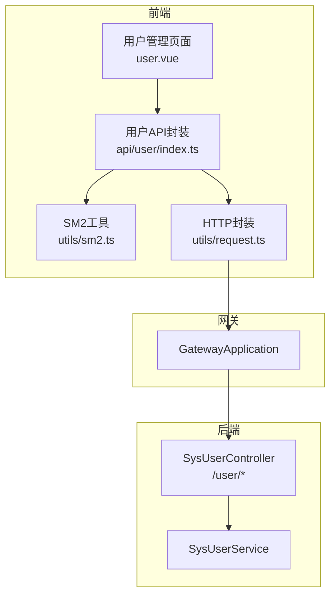
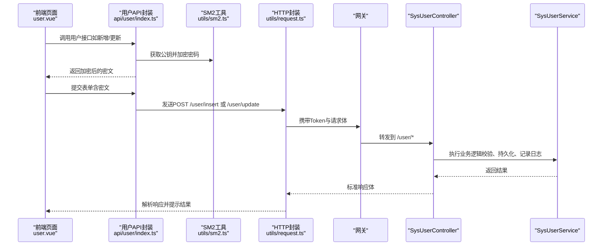
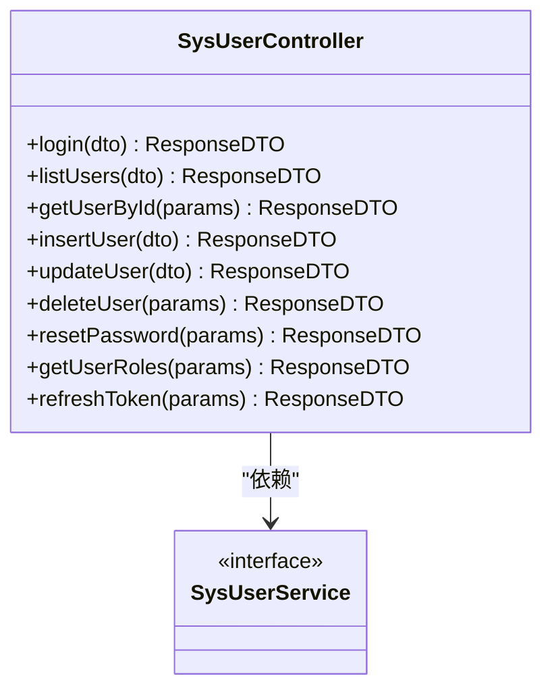
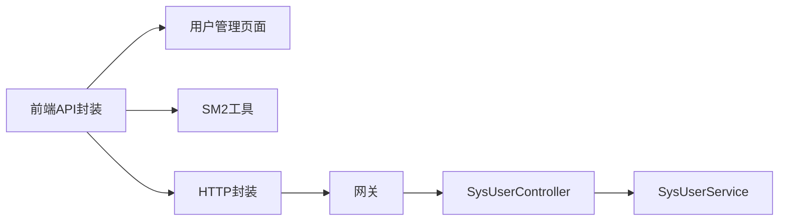

# 用户管理

<cite>
**本文引用的文件**   
- [SysUserController.java](file://class_times_record_back/admin-service/src/main/java/com/shiroko/controller/SysUserController.java)
- [SysUserService.java](file://class_times_record_back/common/src/main/java/com/shiroko/service/SysUserService.java)
- [index.ts（前端用户API）](file://class_record_admin_front/src/api/user/index.ts)
- [user.vue（用户管理页面）](file://class_record_admin_front/src/views/system/user/index.vue)
- [sm2.ts（SM2工具）](file://class_record_admin_front/src/utils/sm2.ts)
- [request.ts（HTTP封装）](file://class_record_admin_front/src/utils/request.ts)
- [CryptoControllerApiTest.java（加密接口测试）](file://class_times_record_back/admin-service/src/test/java/com/shiroko/controller/CryptoControllerApiTest.java)
</cite>

## 目录
1. [简介](#简介)
2. [项目结构](#项目结构)
3. [核心组件](#核心组件)
4. [架构总览](#架构总览)
5. [详细组件分析](#详细组件分析)
6. [依赖分析](#依赖分析)
7. [性能考虑](#性能考虑)
8. [故障排查指南](#故障排查指南)
9. [结论](#结论)
10. [附录：API调用示例](#附录api调用示例)

## 简介
本章节面向“用户管理模块”的文档，聚焦系统用户的CRUD、密码加密（SM2）、角色分配、状态管理等核心能力；并覆盖用户列表的搜索过滤、分页加载、批量操作等特性，说明表单验证规则、数据绑定机制与权限控制逻辑。文末提供完整的API调用示例，包括获取公钥进行密码加密、用户角色关联查询、用户状态切换等操作，并给出错误处理方案与用户体验优化建议。

## 项目结构
用户管理功能横跨前后端：
- 后端（admin-service + common）
  - 控制器层暴露用户相关REST接口
  - 服务层实现业务逻辑（登录、列表、新增/更新/删除、重置密码、角色查询、刷新令牌等）
- 前端（class_record_admin_front）
  - API封装层统一调用后端接口
  - 页面层负责展示、交互、表单校验与数据绑定
  - 工具层提供SM2加解密与HTTP请求封装

图表来源
- [SysUserController.java:23-78](file://class_times_record_back/admin-service/src/main/java/com/shiroko/controller/SysUserController.java#L23-L78)
- [SysUserService.java](file://class_times_record_back/common/src/main/java/com/shiroko/service/SysUserService.java)
- [index.ts（前端用户API）](file://class_record_admin_front/src/api/user/index.ts)
- [user.vue（用户管理页面）](file://class_record_admin_front/src/views/system/user/index.vue)
- [sm2.ts（SM2工具）](file://class_record_admin_front/src/utils/sm2.ts)
- [request.ts（HTTP封装）](file://class_record_admin_front/src/utils/request.ts)

章节来源
- [SysUserController.java:23-78](file://class_times_record_back/admin-service/src/main/java/com/shiroko/controller/SysUserController.java#L23-L78)

## 核心组件
- 用户控制器（SysUserController）
  - 提供登录、列表查询、按ID获取、新增、更新、删除、重置密码、获取角色、刷新令牌等接口
- 用户服务（SysUserService）
  - 承载用户领域逻辑，对接仓储与外部能力（如认证、加密、日志等）
- 前端用户API（api/user/index.ts）
  - 将后端接口封装为前端可调用方法，统一参数组织与响应处理
- 用户管理页面（views/system/user/index.vue）
  - 负责用户列表渲染、搜索过滤、分页、批量操作、表单创建/编辑、角色分配、状态切换等交互
- SM2工具（utils/sm2.ts）
  - 提供SM2公钥获取与密码加密能力，用于安全传输密码
- HTTP封装（utils/request.ts）
  - 统一请求拦截、错误处理、重试策略、Token注入等

章节来源
- [SysUserController.java:23-78](file://class_times_record_back/admin-service/src/main/java/com/shiroko/controller/SysUserController.java#L23-L78)
- [SysUserService.java](file://class_times_record_back/common/src/main/java/com/shiroko/service/SysUserService.java)
- [index.ts（前端用户API）](file://class_record_admin_front/src/api/user/index.ts)
- [user.vue（用户管理页面）](file://class_record_admin_front/src/views/system/user/index.vue)
- [sm2.ts（SM2工具）](file://class_record_admin_front/src/utils/sm2.ts)
- [request.ts（HTTP封装）](file://class_record_admin_front/src/utils/request.ts)

## 架构总览
用户管理的端到端流程如下：
- 前端通过API封装发起请求，必要时使用SM2对敏感字段（如密码）进行加密
- 请求经HTTP封装统一处理（鉴权、错误、超时等），由网关路由至后端控制器
- 控制器接收请求，委托服务层执行业务逻辑，返回标准响应体

图表来源
- [SysUserController.java:30-77](file://class_times_record_back/admin-service/src/main/java/com/shiroko/controller/SysUserController.java#L30-L77)
- [SysUserService.java](file://class_times_record_back/common/src/main/java/com/shiroko/service/SysUserService.java)
- [index.ts（前端用户API）](file://class_record_admin_front/src/api/user/index.ts)
- [sm2.ts（SM2工具）](file://class_record_admin_front/src/utils/sm2.ts)
- [request.ts（HTTP封装）](file://class_record_admin_front/src/utils/request.ts)

## 详细组件分析

### 用户控制器（SysUserController）
- 职责
  - 定义用户管理相关的REST接口，统一入参出参格式
  - 通过注解标记操作日志，便于审计
- 关键接口
  - 登录：POST /user/login
  - 列表查询：POST /user/list
  - 按ID获取：POST /user/get_by_id
  - 新增：POST /user/insert
  - 更新：POST /user/update
  - 删除：POST /user/delete
  - 重置密码：POST /user/reset_password
  - 获取角色：POST /user/get_roles
  - 刷新令牌：POST /user/refresh
- 设计要点
  - 使用统一的ResponseDTO包裹返回结果
  - 使用@Valid进行请求体验证
  - 使用@OperationLog记录关键操作

图表来源
- [SysUserController.java:23-78](file://class_times_record_back/admin-service/src/main/java/com/shiroko/controller/SysUserController.java#L23-L78)

章节来源
- [SysUserController.java:23-78](file://class_times_record_back/admin-service/src/main/java/com/shiroko/controller/SysUserController.java#L23-L78)

### 用户服务（SysUserService）
- 职责
  - 实现用户领域的核心业务逻辑，包括登录认证、用户信息维护、角色关联、密码重置、令牌刷新等
- 典型流程
  - 登录：校验用户名/密码（密码可能为SM2密文），生成/返回令牌
  - 列表：根据查询条件构建动态SQL或内存过滤，支持分页
  - 新增/更新：校验唯一性、必填项，落库并返回VO
  - 删除：软删或硬删，视业务策略而定
  - 重置密码：生成新密码并加密存储
  - 获取角色：根据用户ID查询其角色集合
  - 刷新令牌：基于refreshToken签发新令牌

章节来源
- [SysUserService.java](file://class_times_record_back/common/src/main/java/com/shiroko/service/SysUserService.java)

### 前端用户API（api/user/index.ts）
- 职责
  - 将后端接口封装为函数，统一参数组装、错误处理、类型标注
- 常见方法
  - login、list、getById、insert、update、remove、resetPassword、getRoles、refreshToken
- 与SM2集成
  - 在新增/更新/重置密码前，先获取公钥并对明文密码进行SM2加密，再提交密文

章节来源
- [index.ts（前端用户API）](file://class_record_admin_front/src/api/user/index.ts)

### 用户管理页面（views/system/user/index.vue）
- 职责
  - 用户列表展示、搜索过滤、分页加载、批量操作（启用/禁用、删除等）
  - 用户表单（新增/编辑）的数据绑定与校验
  - 角色分配弹窗与保存
  - 状态切换（启用/禁用）的即时反馈
- 数据绑定与校验
  - 使用表单组件双向绑定字段
  - 配置字段级校验规则（必填、长度、格式等）
  - 提交前二次校验，失败时高亮错误字段并阻止提交
- 分页与筛选
  - 监听搜索条件变化触发重新加载
  - 分页控件与后端分页参数联动
- 批量操作
  - 勾选多行后执行批量启用/禁用或删除
  - 操作前二次确认，成功后刷新列表

章节来源
- [user.vue（用户管理页面）](file://class_record_admin_front/src/views/system/user/index.vue)

### SM2工具（utils/sm2.ts）
- 职责
  - 提供SM2公钥获取与密码加密能力
- 使用场景
  - 新增/更新/重置密码前，先调用公钥接口，再用公钥对密码进行加密，确保传输安全

章节来源
- [sm2.ts（SM2工具）](file://class_record_admin_front/src/utils/sm2.ts)

### HTTP封装（utils/request.ts）
- 职责
  - 统一请求拦截、错误处理、超时设置、Token注入、重试策略
- 关键点
  - 全局错误提示与友好文案
  - 401自动跳转登录或刷新令牌
  - 网络异常降级与重试

章节来源
- [request.ts（HTTP封装）](file://class_record_admin_front/src/utils/request.ts)

## 依赖分析
- 组件耦合
  - 控制器与服务层解耦清晰，遵循单一职责
  - 前端API与页面解耦，便于复用与测试
- 外部依赖
  - 网关路由
  - 数据库（通过服务层访问）
  - 加密能力（SM2）
- 潜在风险
  - 若服务层未做幂等与并发保护，批量操作可能存在竞态
  - 前端缓存与后端状态不一致需通过刷新或乐观锁解决

图表来源
- [SysUserController.java:23-78](file://class_times_record_back/admin-service/src/main/java/com/shiroko/controller/SysUserController.java#L23-L78)
- [SysUserService.java](file://class_times_record_back/common/src/main/java/com/shiroko/service/SysUserService.java)
- [index.ts（前端用户API）](file://class_record_admin_front/src/api/user/index.ts)
- [user.vue（用户管理页面）](file://class_record_admin_front/src/views/system/user/index.vue)
- [sm2.ts（SM2工具）](file://class_record_admin_front/src/utils/sm2.ts)
- [request.ts（HTTP封装）](file://class_record_admin_front/src/utils/request.ts)

章节来源
- [SysUserController.java:23-78](file://class_times_record_back/admin-service/src/main/java/com/shiroko/controller/SysUserController.java#L23-L78)

## 性能考虑
- 列表查询
  - 后端采用分页与索引优化，避免全表扫描
  - 前端按需加载与虚拟滚动（大数据量）
- 加密开销
  - SM2加解密在前端进行，减少敏感数据传输
  - 公钥缓存避免频繁请求
- 批量操作
  - 分批提交，降低单次事务压力
  - 异步任务与进度提示提升体验

[本节为通用指导，不直接分析具体文件]

## 故障排查指南
- 常见问题
  - 登录失败：检查用户名/密码是否正确，确认SM2公钥是否可用，查看服务端日志
  - 列表为空：核对筛选条件与分页参数，确认数据库数据是否存在
  - 新增/更新失败：检查必填项与唯一性约束，查看服务端校验错误
  - 角色未显示：确认用户角色关联数据与查询接口返回
- 定位步骤
  - 前端控制台查看请求与响应
  - 后端日志查看异常堆栈与业务错误码
  - 数据库核对数据一致性与约束冲突
- 恢复建议
  - 清理缓存并重试
  - 回滚变更或恢复备份
  - 调整配置（如超时、重试次数）

章节来源
- [CryptoControllerApiTest.java:1-200](file://class_times_record_back/admin-service/src/test/java/com/shiroko/controller/CryptoControllerApiTest.java#L1-L200)

## 结论
用户管理模块在后端以清晰的控制器与服务分层实现，前端通过API封装与页面组件完成交互与展示。SM2公钥加密保障密码传输安全，配合完善的表单校验与错误处理，提升了安全性与用户体验。建议在后续迭代中增强批量操作的幂等性与异步化，完善监控与告警，进一步提升稳定性与可观测性。

[本节为总结，不直接分析具体文件]

## 附录：API调用示例
以下示例描述如何调用用户管理相关接口。请根据实际环境替换域名、Token与参数。

- 获取SM2公钥（用于密码加密）
  - 方法：GET
  - 路径：/crypto/public-key（示例路径，具体以后端为准）
  - 说明：返回SM2公钥字符串，前端使用该公钥对密码进行加密
  - 参考：加密接口测试用例
  章节来源
  - [CryptoControllerApiTest.java:1-200](file://class_times_record_back/admin-service/src/test/java/com/shiroko/controller/CryptoControllerApiTest.java#L1-L200)

- 管理员登录
  - 方法：POST
  - 路径：/user/login
  - 请求体：包含用户名与SM2加密后的密码
  - 响应：返回登录信息与令牌
  章节来源
  - [SysUserController.java:30-34](file://class_times_record_back/admin-service/src/main/java/com/shiroko/controller/SysUserController.java#L30-L34)

- 获取用户列表（支持搜索过滤与分页）
  - 方法：POST
  - 路径：/user/list
  - 请求体：查询条件（如用户名、状态、时间范围）与分页参数
  - 响应：返回用户列表与总数
  章节来源
  - [SysUserController.java:36-39](file://class_times_record_back/admin-service/src/main/java/com/shiroko/controller/SysUserController.java#L36-L39)

- 按ID获取用户详情
  - 方法：POST
  - 路径：/user/get_by_id
  - 请求体：{ id: 用户ID }
  - 响应：返回用户详情VO
  章节来源
  - [SysUserController.java:41-44](file://class_times_record_back/admin-service/src/main/java/com/shiroko/controller/SysUserController.java#L41-L44)

- 新增用户
  - 方法：POST
  - 路径：/user/insert
  - 请求体：包含用户名、SM2加密后的密码、角色ID列表等
  - 说明：前端先获取公钥并加密密码，再提交
  章节来源
  - [SysUserController.java:46-49](file://class_times_record_back/admin-service/src/main/java/com/shiroko/controller/SysUserController.java#L46-L49)

- 更新用户
  - 方法：POST
  - 路径：/user/update
  - 请求体：包含用户ID与待更新字段（如需修改密码，同样使用SM2加密）
  章节来源
  - [SysUserController.java:51-54](file://class_times_record_back/admin-service/src/main/java/com/shiroko/controller/SysUserController.java#L51-L54)

- 删除用户
  - 方法：POST
  - 路径：/user/delete
  - 请求体：{ id: 用户ID }
  章节来源
  - [SysUserController.java:56-59](file://class_times_record_back/admin-service/src/main/java/com/shiroko/controller/SysUserController.java#L56-L59)

- 重置用户密码
  - 方法：POST
  - 路径：/user/reset_password
  - 请求体：{ id: 用户ID, newPassword: 新密码（可由管理员设置或随机生成）}
  - 说明：服务端负责对新密码进行加密存储
  章节来源
  - [SysUserController.java:61-67](file://class_times_record_back/admin-service/src/main/java/com/shiroko/controller/SysUserController.java#L61-L67)

- 获取用户角色
  - 方法：POST
  - 路径：/user/get_roles
  - 请求体：{ userId: 用户ID }
  - 响应：返回角色列表
  章节来源
  - [SysUserController.java:69-72](file://class_times_record_back/admin-service/src/main/java/com/shiroko/controller/SysUserController.java#L69-L72)

- 刷新令牌
  - 方法：POST
  - 路径：/user/refresh
  - 请求体：{ refreshToken: 刷新令牌 }
  - 响应：返回新的登录信息与令牌
  章节来源
  - [SysUserController.java:74-77](file://class_times_record_back/admin-service/src/main/java/com/shiroko/controller/SysUserController.java#L74-L77)

- 前端SM2加密流程（概念示意）
  - 步骤：
    - 调用公钥接口获取SM2公钥
    - 使用公钥对明文密码进行SM2加密
    - 将密文随表单提交
  - 参考：
    - [sm2.ts（SM2工具）](file://class_record_admin_front/src/utils/sm2.ts)
    - [index.ts（前端用户API）](file://class_record_admin_front/src/api/user/index.ts)