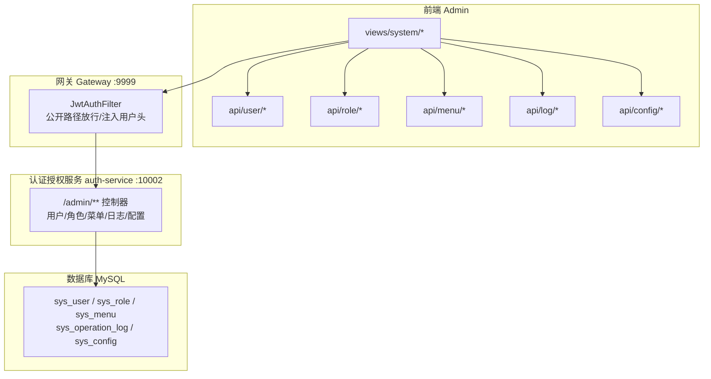
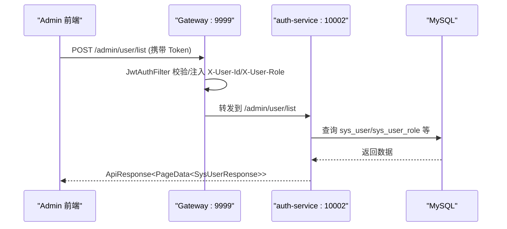
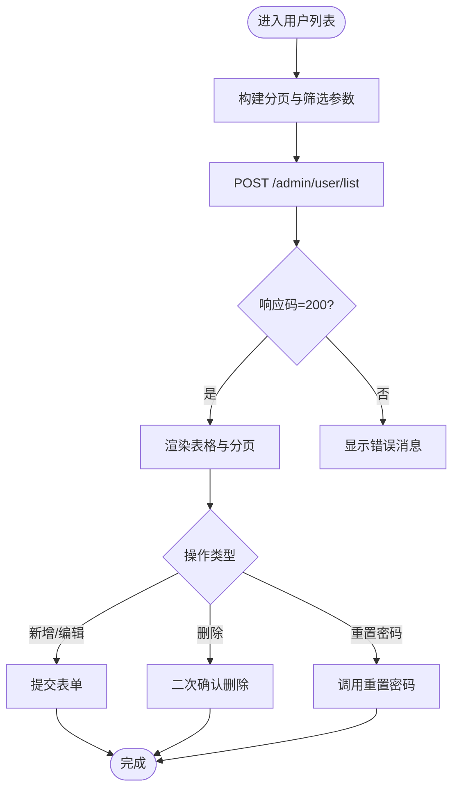
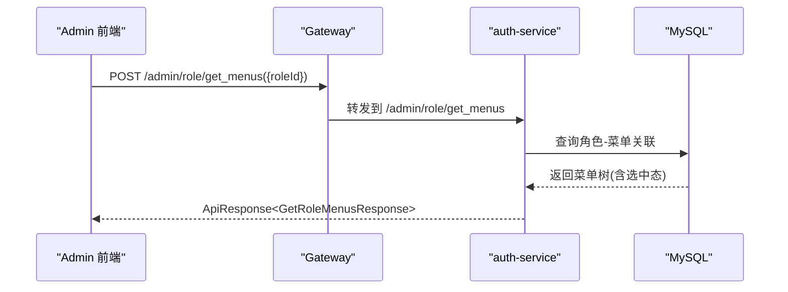
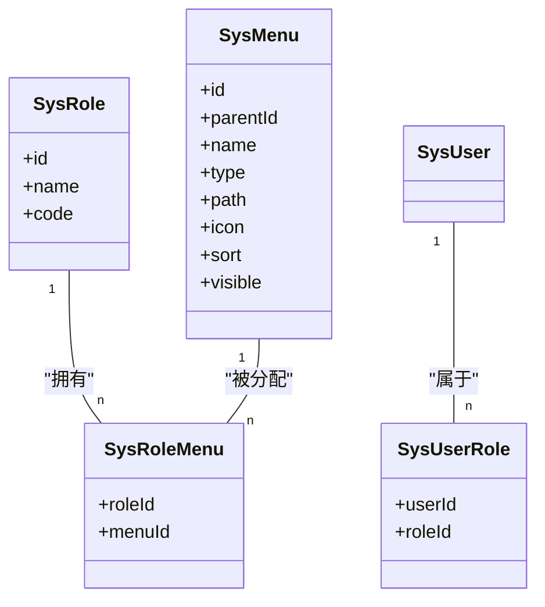
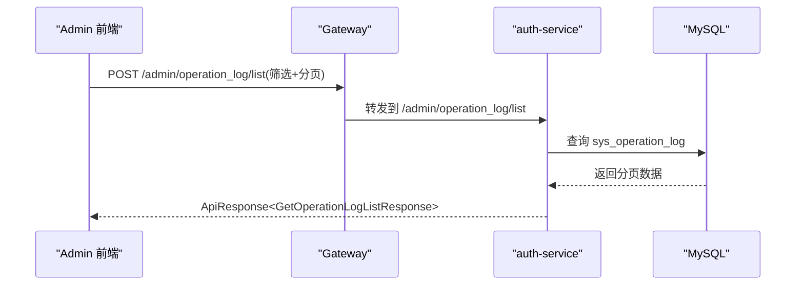
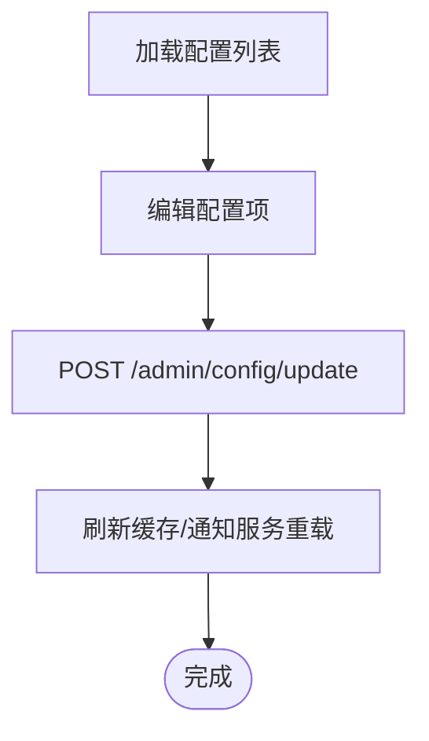

# 系统管理模块

<cite>
**本文引用的文件**   
- [README.md](file://class_record_admin_front/README.md)
- [architecture.md](file://class_times_record_back/docs/architecture.md)
- [index.ts（用户 API）](file://class_record_admin_front/src/api/user/index.ts)
- [index.ts（角色 API）](file://class_record_admin_front/src/api/role/index.ts)
- [index.ts（菜单 API）](file://class_record_admin_front/src/api/menu/index.ts)
- [index.ts（操作日志 API）](file://class_record_admin_front/src/api/log/index.ts)
- [index.ts（系统配置 API）](file://class_record_admin_front/src/api/config/index.ts)
</cite>

## 目录
1. [引言](#引言)
2. [项目结构](#项目结构)
3. [核心组件](#核心组件)
4. [架构总览](#架构总览)
5. [详细组件分析](#详细组件分析)
6. [依赖关系分析](#依赖关系分析)
7. [性能与扩展性](#性能与扩展性)
8. [故障排查指南](#故障排查指南)
9. [结论](#结论)
10. [附录：API 接口清单与调用示例](#附录api-接口清单与调用示例)

## 引言
本章节聚焦“系统管理模块”，覆盖用户管理、角色管理、菜单管理、操作日志、系统配置等系统级功能。文档从前后端协作角度，说明各子模块的 CRUD 能力、权限控制、表单验证、列表分页、搜索过滤、动态菜单加载机制，以及系统配置的项说明与热更新建议；并提供完整的 API 调用示例与错误处理方案，帮助读者快速理解并落地使用。

## 项目结构
系统管理模块在前端采用按领域分包的 API 组织方式，后端通过统一网关路由到认证授权服务，提供 /admin/** 系列接口。前端页面位于 views/system 下，包含用户、角色、菜单、日志、配置等页面。

图示来源
- [README.md:64-98](file://class_record_admin_front/README.md#L64-L98)
- [architecture.md:47-65](file://class_times_record_back/docs/architecture.md#L47-L65)

章节来源
- [README.md:64-98](file://class_record_admin_front/README.md#L64-L98)
- [architecture.md:47-65](file://class_times_record_back/docs/architecture.md#L47-L65)

## 核心组件
本节概述系统管理五大子模块的职责与关键特性：
- 用户管理：管理员账号的增删改查、密码重置、角色分配查询。
- 角色管理：角色的增删改查、菜单权限树获取。
- 菜单管理：菜单/目录/按钮三级管理、树形展示、按用户动态生成菜单树。
- 操作日志：日志列表查询、单条删除、批量清空。
- 系统配置：配置项的增删改查，支持后续热更新机制接入。

章节来源
- [README.md:7-13](file://class_record_admin_front/README.md#L7-L13)

## 架构总览
系统管理模块的请求链路如下：前端通过 Vite 代理将 /admin/** 请求转发至网关，网关进行 JWT 校验与用户上下文注入后，路由到认证授权服务的 /admin/** 控制器，最终访问数据库中的系统管理表。

图示来源
- [architecture.md:92-147](file://class_times_record_back/docs/architecture.md#L92-L147)
- [architecture.md:47-65](file://class_times_record_back/docs/architecture.md#L47-L65)

## 详细组件分析

### 用户管理
- 能力概览
  - 列表分页与搜索：通过分页参数与筛选条件查询管理员列表。
  - 详情获取：根据 ID 获取单个管理员信息。
  - 新增/更新/删除：标准 CRUD 操作。
  - 密码重置：对指定用户重置登录密码。
  - 角色分配查询：获取用户已分配的角色集合。
- 前端 API 入口
  - 列表、详情、新增、更新、删除、重置密码、获取角色等接口定义见用户 API 文件。
- 典型交互流程
  - 打开用户列表页 → 构造分页与筛选参数 → 调用列表接口 → 渲染表格与分页器。
  - 点击编辑/新增 → 打开表单 → 提交新增或更新 → 成功后刷新列表。
  - 重置密码 → 二次确认 → 调用重置接口 → 提示成功。
- 权限控制
  - 由网关与服务端拦截器基于 JWT 与角色进行鉴权，未授权访问将被拒绝。
- 表单验证
  - 前端在提交前进行必填、格式等校验；服务端通过 Bean Validation 注解进行入参校验，失败时统一返回字段级错误信息。
- 列表分页与搜索
  - 前端传递分页参数（如 page、size）与筛选条件（如用户名、状态），后端返回 PageData 结构。
- 错误处理
  - 统一响应体包含 code/message/data，异常由全局异常处理器捕获并返回标准化错误。

章节来源
- [index.ts（用户 API）:1-30](file://class_record_admin_front/src/api/user/index.ts#L1-L30)
- [architecture.md:250-262](file://class_times_record_back/docs/architecture.md#L250-L262)

### 角色管理
- 能力概览
  - 列表分页与搜索：查询角色列表。
  - 详情获取：根据 ID 获取角色信息。
  - 新增/更新/删除：标准 CRUD 操作。
  - 菜单权限分配：获取角色已分配的菜单树，用于勾选分配。
- 前端 API 入口
  - 列表、详情、新增、更新、删除、获取角色菜单等接口定义见角色 API 文件。
- 典型交互流程
  - 打开角色列表页 → 调用列表接口 → 渲染表格。
  - 打开“分配菜单”对话框 → 调用角色菜单接口 → 回显已选菜单 → 保存分配结果。
- 权限控制
  - 仅具备相应角色权限的管理员可执行角色相关操作。
- 表单验证
  - 前端与后端双重校验，确保名称、标识等必填且唯一。
- 列表分页与搜索
  - 支持按关键字、状态等条件筛选，返回分页数据。

图示来源
- [index.ts（角色 API）:1-26](file://class_record_admin_front/src/api/role/index.ts#L1-L26)
- [architecture.md:92-147](file://class_times_record_back/docs/architecture.md#L92-L147)

章节来源
- [index.ts（角色 API）:1-26](file://class_record_admin_front/src/api/role/index.ts#L1-L26)

### 菜单管理
- 能力概览
  - 三级菜单模型：菜单/目录/按钮，支持树形表格展示。
  - 列表与树：提供扁平列表与层级树两种视图。
  - 动态菜单：按当前用户角色生成可见菜单树。
  - 标准 CRUD：新增、更新、删除。
- 前端 API 入口
  - 列表、树、新增、更新、删除、用户菜单树等接口定义见菜单 API 文件。
- 典型交互流程
  - 打开菜单管理页 → 选择“列表/树”视图 → 渲染数据。
  - 新增/编辑菜单 → 设置父级、类型、排序、图标、路由等 → 提交保存。
  - 用户登录后 → 调用用户菜单树接口 → 动态渲染侧边栏。
- 权限控制
  - 菜单可见性与按钮级权限由角色-菜单关联决定，结合网关与服务端拦截器实现。
- 列表分页与搜索
  - 支持按名称、类型、状态等条件筛选。
- 错误处理
  - 统一响应体与全局异常处理保证一致的错误反馈。

图示来源
- [index.ts（菜单 API）:1-26](file://class_record_admin_front/src/api/menu/index.ts#L1-L26)
- [architecture.md:414-420](file://class_times_record_back/docs/architecture.md#L414-L420)

章节来源
- [index.ts（菜单 API）:1-26](file://class_record_admin_front/src/api/menu/index.ts#L1-L26)

### 操作日志
- 能力概览
  - 列表查询：支持按时间、操作人、模块、动作等条件检索。
  - 单条删除：清理误记或敏感日志。
  - 批量清空：定期归档或清理历史日志。
- 前端 API 入口
  - 列表、删除、清空等接口定义见日志 API 文件。
- 典型交互流程
  - 打开日志页 → 输入筛选条件 → 调用列表接口 → 渲染表格。
  - 点击删除/清空 → 二次确认 → 调用对应接口 → 刷新列表。
- 权限控制
  - 仅具备审计/运维权限的角色可访问日志管理。
- 列表分页与搜索
  - 支持多条件组合查询，返回结构化分页数据。
- 错误处理
  - 统一响应体与全局异常处理保障一致性。

图示来源
- [index.ts（操作日志 API）:1-14](file://class_record_admin_front/src/api/log/index.ts#L1-L14)
- [architecture.md:92-147](file://class_times_record_back/docs/architecture.md#L92-L147)

章节来源
- [index.ts（操作日志 API）:1-14](file://class_record_admin_front/src/api/log/index.ts#L1-L14)

### 系统配置
- 能力概览
  - 配置项管理：增删改查系统配置项。
  - 配置项说明：键名、值、分组、描述、是否启用等。
  - 热更新机制：建议通过配置中心（如 Nacos Config）或缓存层实现运行时更新，避免重启。
- 前端 API 入口
  - 列表、新增、更新、删除等接口定义见配置 API 文件。
- 典型交互流程
  - 打开配置页 → 加载配置列表 → 编辑某项 → 保存更新 → 刷新缓存/通知服务重载。
- 权限控制
  - 仅具备系统配置权限的角色可修改配置。
- 列表分页与搜索
  - 支持按分组、关键字等条件筛选。
- 错误处理
  - 统一响应体与全局异常处理保障一致性。

章节来源
- [index.ts（系统配置 API）:1-42](file://class_record_admin_front/src/api/config/index.ts#L1-L42)
- [architecture.md:619-632](file://class_times_record_back/docs/architecture.md#L619-L632)

## 依赖关系分析
- 前端依赖
  - 各业务页面依赖对应 api/* 下的接口封装，统一通过 Axios 发起请求。
- 网关与服务
  - 网关负责 JWT 校验、用户上下文注入与路由分发；认证授权服务承载 /admin/** 所有系统管理接口。
- 数据持久化
  - 系统管理相关实体包括 sys_user、sys_role、sys_menu、sys_user_role、sys_role_menu、sys_operation_log、sys_config 等。

图示来源
- [README.md:64-98](file://class_record_admin_front/README.md#L64-L98)
- [architecture.md:47-65](file://class_times_record_back/docs/architecture.md#L47-L65)
- [architecture.md:414-420](file://class_times_record_back/docs/architecture.md#L414-L420)

章节来源
- [README.md:64-98](file://class_record_admin_front/README.md#L64-L98)
- [architecture.md:47-65](file://class_times_record_back/docs/architecture.md#L47-L65)
- [architecture.md:414-420](file://class_times_record_back/docs/architecture.md#L414-L420)

## 性能与扩展性
- 虚拟线程：后端启用 JDK 21 虚拟线程，适合 I/O 密集型场景，提升并发处理能力。
- 逻辑删除：通过全局配置实现 isDeleted 字段逻辑删除，简化查询与审计。
- 主键策略：雪花算法生成分布式唯一 ID，趋势递增利于索引。
- 扩展建议
  - 为高频查询增加合适索引（如操作日志的时间、操作人字段）。
  - 引入 Redis 缓存热点配置与菜单树，降低数据库压力。
  - 对大表（如操作日志）实施分库分表或冷热分离策略。

章节来源
- [architecture.md:234-249](file://class_times_record_back/docs/architecture.md#L234-L249)
- [architecture.md:216-233](file://class_times_record_back/docs/architecture.md#L216-L233)

## 故障排查指南
- 统一异常处理
  - 参数校验失败、业务异常、运行时异常、SQL 异常等均由全局异常处理器统一返回 ResponseDTO。
- 常见问题定位
  - 401/403：检查网关 JWT 校验与角色权限是否正确。
  - 参数校验错误：查看字段级错误信息，修正前端表单校验规则。
  - 数据不一致：核对逻辑删除字段与事务边界。
- 调试建议
  - 开启开发环境 SQL 日志，观察实际执行的 SQL。
  - 使用 Swagger/OpenAPI 验证接口契约。

章节来源
- [architecture.md:250-262](file://class_times_record_back/docs/architecture.md#L250-L262)

## 结论
系统管理模块以 RBAC 为核心，围绕用户、角色、菜单、日志、配置五大子域提供完整管理能力。前后端通过统一网关与标准化响应体协作，具备良好的可扩展性与可维护性。建议在现有基础上完善配置热更新、菜单与权限缓存、日志归档等增强能力，进一步提升用户体验与系统稳定性。

## 附录：API 接口清单与调用示例

### 用户管理
- 列表分页与搜索
  - 方法：POST
  - 路径：/admin/user/list
  - 请求体：分页与筛选参数
  - 响应：ApiResponse<PageData<SysUserResponse>>
- 详情
  - 方法：POST
  - 路径：/admin/user/get_by_id
  - 请求体：{ id }
  - 响应：ApiResponse<SysUserResponse>
- 新增
  - 方法：POST
  - 路径：/admin/user/insert
  - 请求体：InsertUserRequest
  - 响应：ApiResponse<void>
- 更新
  - 方法：POST
  - 路径：/admin/user/update
  - 请求体：UpdateUserRequest
  - 响应：ApiResponse<void>
- 删除
  - 方法：POST
  - 路径：/admin/user/delete
  - 请求体：{ id }
  - 响应：ApiResponse<void>
- 重置密码
  - 方法：POST
  - 路径：/admin/user/reset_password
  - 请求体：ResetPasswordRequest
  - 响应：ApiResponse<void>
- 获取用户角色
  - 方法：POST
  - 路径：/admin/user/get_roles
  - 请求体：{ userId }
  - 响应：ApiResponse<GetUserRolesResponse>

章节来源
- [index.ts（用户 API）:1-30](file://class_record_admin_front/src/api/user/index.ts#L1-L30)

### 角色管理
- 列表分页与搜索
  - 方法：POST
  - 路径：/admin/role/list
  - 请求体：分页与筛选参数
  - 响应：ApiResponse<PageData<SysRoleResponse>>
- 详情
  - 方法：POST
  - 路径：/admin/role/get_by_id
  - 请求体：{ id }
  - 响应：ApiResponse<SysRoleResponse>
- 新增
  - 方法：POST
  - 路径：/admin/role/insert
  - 请求体：InsertRoleRequest
  - 响应：ApiResponse<void>
- 更新
  - 方法：POST
  - 路径：/admin/role/update
  - 请求体：UpdateRoleRequest
  - 响应：ApiResponse<void>
- 删除
  - 方法：POST
  - 路径：/admin/role/delete
  - 请求体：{ id }
  - 响应：ApiResponse<void>
- 获取角色菜单
  - 方法：POST
  - 路径：/admin/role/get_menus
  - 请求体：{ roleId }
  - 响应：ApiResponse<GetRoleMenusResponse>

章节来源
- [index.ts（角色 API）:1-26](file://class_record_admin_front/src/api/role/index.ts#L1-L26)

### 菜单管理
- 列表
  - 方法：POST
  - 路径：/admin/menu/list
  - 请求体：可选 GetMenuListRequest
  - 响应：ApiResponse<SysMenuResponse[]>
- 树
  - 方法：POST
  - 路径：/admin/menu/tree
  - 请求体：可选 GetMenuListRequest
  - 响应：ApiResponse<SysMenuResponse[]>
- 新增
  - 方法：POST
  - 路径：/admin/menu/insert
  - 请求体：InsertMenuRequest
  - 响应：ApiResponse<void>
- 更新
  - 方法：POST
  - 路径：/admin/menu/update
  - 请求体：UpdateMenuRequest
  - 响应：ApiResponse<void>
- 删除
  - 方法：POST
  - 路径：/admin/menu/delete
  - 请求体：{ id }
  - 响应：ApiResponse<void>
- 用户菜单树（动态加载）
  - 方法：POST
  - 路径：/admin/menu/user_tree
  - 请求体：{}
  - 响应：ApiResponse<SysMenuResponse[]>

章节来源
- [index.ts（菜单 API）:1-26](file://class_record_admin_front/src/api/menu/index.ts#L1-L26)

### 操作日志
- 列表
  - 方法：POST
  - 路径：/admin/operation_log/list
  - 请求体：GetOperationLogListRequest
  - 响应：ApiResponse<GetOperationLogListResponse>
- 删除
  - 方法：POST
  - 路径：/admin/operation_log/delete
  - 请求体：{ id }
  - 响应：ApiResponse<void>
- 清空
  - 方法：POST
  - 路径：/admin/operation_log/clear
  - 请求体：{}
  - 响应：ApiResponse<void>

章节来源
- [index.ts（操作日志 API）:1-14](file://class_record_admin_front/src/api/log/index.ts#L1-L14)

### 系统配置
- 列表
  - 方法：POST
  - 路径：/admin/config/list
  - 请求体：可选 GetConfigListRequest
  - 响应：ApiResponse<SysConfigResponse[]>
- 新增
  - 方法：POST
  - 路径：/admin/config/insert
  - 请求体：InsertConfigRequest
  - 响应：ApiResponse<SysConfigResponse>
- 更新
  - 方法：POST
  - 路径：/admin/config/update
  - 请求体：UpdateConfigRequest
  - 响应：ApiResponse<SysConfigResponse>
- 删除
  - 方法：POST
  - 路径：/admin/config/delete
  - 请求体：{ id }
  - 响应：ApiResponse<void>

章节来源
- [index.ts（系统配置 API）:1-42](file://class_record_admin_front/src/api/config/index.ts#L1-L42)