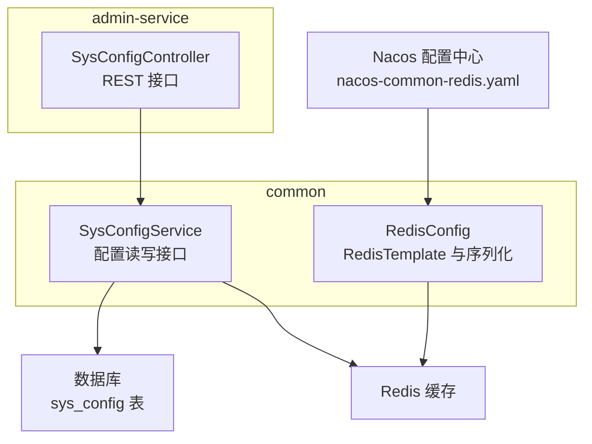
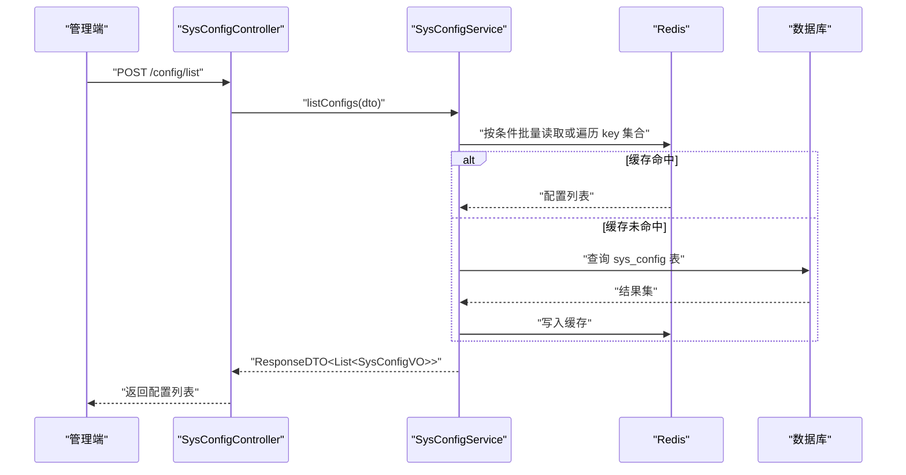
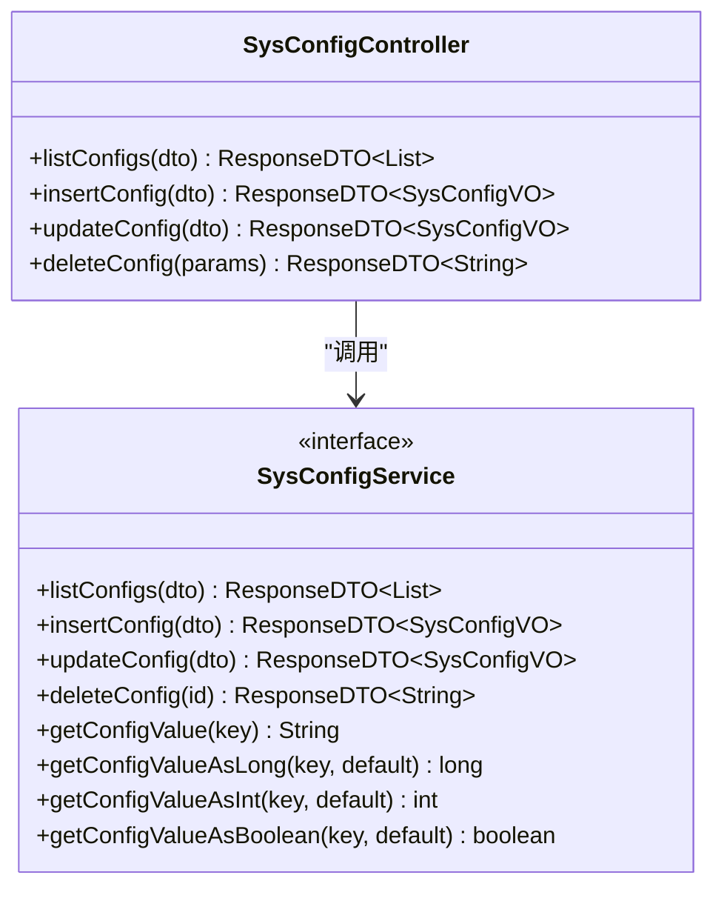
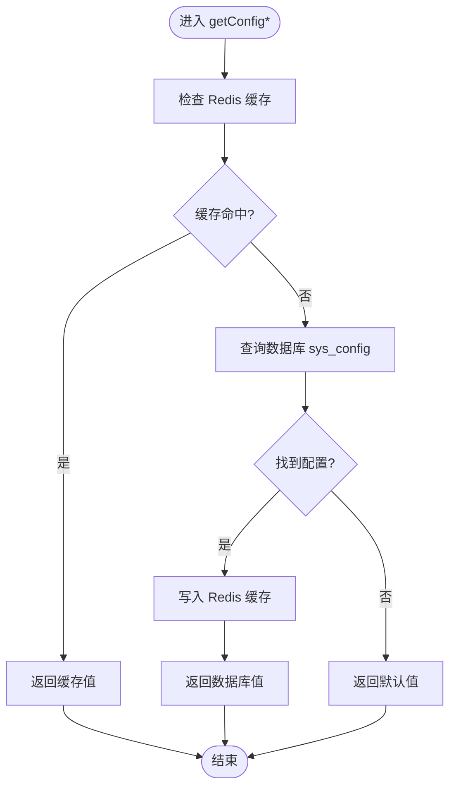
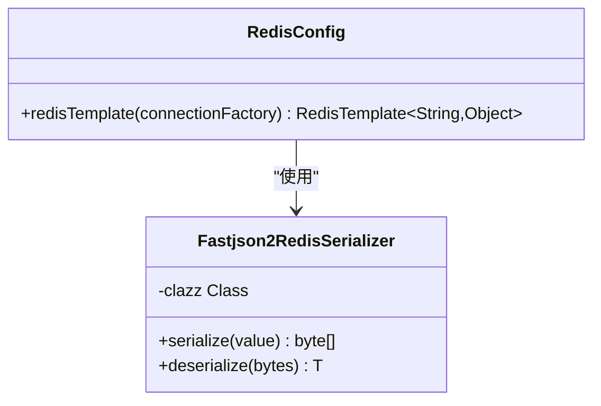
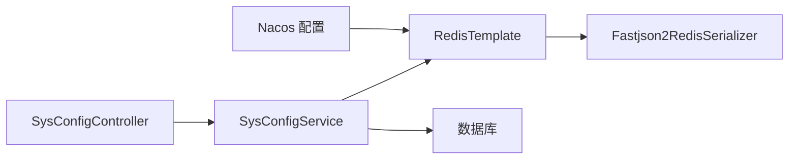

# 系统配置

<cite>
**本文引用的文件**   
- [SysConfigController.java](file://class_times_record_back/admin-service/src/main/java/com/shiroko/controller/SysConfigController.java)
- [SysConfigService.java](file://class_times_record_back/common/src/main/java/com/shiroko/service/SysConfigService.java)
- [RedisConfig.java](file://class_times_record_back/common/src/main/java/com/shiroko/config/RedisConfig.java)
- [nacos-common-redis.yaml](file://class_times_record_back/docs/nacos-common-redis.yaml)
</cite>

## 目录
1. [简介](#简介)
2. [项目结构](#项目结构)
3. [核心组件](#核心组件)
4. [架构总览](#架构总览)
5. [详细组件分析](#详细组件分析)
6. [依赖关系分析](#依赖关系分析)
7. [性能考虑](#性能考虑)
8. [故障排查指南](#故障排查指南)
9. [结论](#结论)
10. [附录](#附录)

## 简介
本模块提供“系统参数配置”的集中管理能力，支持动态配置、热更新、分组管理、类型化读取与默认值回退。通过 Redis 缓存 + 数据库回源的方式实现高并发下的低延迟读取；在增删改操作后自动清理缓存，使变更实时生效。同时提供统一的接口规范与可观测性（操作日志），便于运维与管理。

## 项目结构
系统配置相关代码分布在 admin-service 与 common 两个模块：
- admin-service：对外暴露配置管理的 REST 接口（列表查询、新增、更新、删除）。
- common：定义跨服务复用的配置读取能力（按 key 获取字符串/数值/布尔值等）以及 Redis 序列化配置。

图表来源
- [SysConfigController.java:1-77](file://class_times_record_back/admin-service/src/main/java/com/shiroko/controller/SysConfigController.java#L1-L77)
- [SysConfigService.java:1-92](file://class_times_record_back/common/src/main/java/com/shiroko/service/SysConfigService.java#L1-L92)
- [RedisConfig.java:1-90](file://class_times_record_back/common/src/main/java/com/shiroko/config/RedisConfig.java#L1-L90)
- [nacos-common-redis.yaml:1-26](file://class_times_record_back/docs/nacos-common-redis.yaml#L1-L26)

章节来源
- [SysConfigController.java:1-77](file://class_times_record_back/admin-service/src/main/java/com/shiroko/controller/SysConfigController.java#L1-L77)
- [SysConfigService.java:1-92](file://class_times_record_back/common/src/main/java/com/shiroko/service/SysConfigService.java#L1-L92)
- [RedisConfig.java:1-90](file://class_times_record_back/common/src/main/java/com/shiroko/config/RedisConfig.java#L1-L90)
- [nacos-common-redis.yaml:1-26](file://class_times_record_back/docs/nacos-common-redis.yaml#L1-L26)

## 核心组件
- SysConfigController：提供配置项的增删改查 REST 接口，统一返回 ResponseDTO，并对写操作记录操作日志。
- SysConfigService：定义配置读写的通用能力，包括按 key 获取字符串/整型/长整型/布尔值，并提供管理端 CRUD 方法声明。
- RedisConfig：自定义 RedisTemplate，Key 使用 String 序列化，Value 使用 Fastjson2 序列化，确保对象存取一致性与可读性。
- nacos-common-redis.yaml：通过 Nacos 集中管理 Redis 连接池与超时等运行时参数，便于多实例共享与动态调整。

章节来源
- [SysConfigController.java:1-77](file://class_times_record_back/admin-service/src/main/java/com/shiroko/controller/SysConfigController.java#L1-L77)
- [SysConfigService.java:1-92](file://class_times_record_back/common/src/main/java/com/shiroko/service/SysConfigService.java#L1-L92)
- [RedisConfig.java:1-90](file://class_times_record_back/common/src/main/java/com/shiroko/config/RedisConfig.java#L1-L90)
- [nacos-common-redis.yaml:1-26](file://class_times_record_back/docs/nacos-common-redis.yaml#L1-L26)

## 架构总览
系统配置采用“控制器-服务-缓存/存储”的分层设计：
- 控制层：接收请求、参数校验、调用服务层。
- 服务层：封装业务逻辑，优先从 Redis 读取配置，未命中则回源数据库并回填缓存；写操作后主动清理缓存。
- 数据层：持久化到数据库；Redis 作为热点配置的缓存层。
- 配置中心：通过 Nacos 注入 Redis 连接参数，支持运行期调整。

图表来源
- [SysConfigController.java:39-42](file://class_times_record_back/admin-service/src/main/java/com/shiroko/controller/SysConfigController.java#L39-L42)
- [SysConfigService.java:28-33](file://class_times_record_back/common/src/main/java/com/shiroko/service/SysConfigService.java#L28-L33)

## 详细组件分析

### 组件一：SysConfigController（配置管理 API）
职责
- 暴露配置项的增删改查接口，统一响应格式。
- 对写操作标注操作日志，便于审计。

关键接口
- POST /config/list：分页/筛选查询配置列表（支持 configKey/configName 模糊搜索，configGroup 精确筛选）。
- POST /config/insert：新增配置项。
- POST /config/update：更新配置项（触发缓存失效，实现热更新）。
- POST /config/delete：删除配置项（触发缓存失效）。

图表来源
- [SysConfigController.java:27-76](file://class_times_record_back/admin-service/src/main/java/com/shiroko/controller/SysConfigController.java#L27-L76)
- [SysConfigService.java:22-91](file://class_times_record_back/common/src/main/java/com/shiroko/service/SysConfigService.java#L22-L91)

章节来源
- [SysConfigController.java:27-76](file://class_times_record_back/admin-service/src/main/java/com/shiroko/controller/SysConfigController.java#L27-L76)

### 组件二：SysConfigService（配置读写能力）
职责
- 提供跨服务可用的配置读取方法，支持多种类型与默认值回退。
- 管理端 CRUD 方法仅在 admin-service 中实现，但接口在 common 中统一定义。

读取策略
- 优先从 Redis 读取，未命中则查数据库并回填缓存。
- 提供 getConfigValue/getConfigValueAsLong/getConfigValueAsInt/getConfigValueAsBoolean 等方法，简化调用方使用。

图表来源
- [SysConfigService.java:60-90](file://class_times_record_back/common/src/main/java/com/shiroko/service/SysConfigService.java#L60-L90)

章节来源
- [SysConfigService.java:22-91](file://class_times_record_back/common/src/main/java/com/shiroko/service/SysConfigService.java#L22-L91)

### 组件三：RedisConfig（缓存与序列化）
职责
- 自定义 RedisTemplate，Key 使用 String 序列化，Value 使用 Fastjson2 序列化。
- 保证对象序列化的稳定性与可读性，便于调试与跨语言兼容。

要点
- Key/HashKey：String 序列化器。
- Value/HashValue：Fastjson2 序列化器，开启 WriteNulls 与 SortMapEntriesByKeys，提升一致性。
- 连接池与超时由 Nacos 配置中心注入。

图表来源
- [RedisConfig.java:25-54](file://class_times_record_back/common/src/main/java/com/shiroko/config/RedisConfig.java#L25-L54)
- [RedisConfig.java:62-88](file://class_times_record_back/common/src/main/java/com/shiroko/config/RedisConfig.java#L62-L88)

章节来源
- [RedisConfig.java:25-88](file://class_times_record_back/common/src/main/java/com/shiroko/config/RedisConfig.java#L25-L88)

### 组件四：Nacos 配置（Redis 运行时参数）
职责
- 通过 Nacos 集中管理 Redis 连接池大小、超时等参数，支持多实例共享与动态调整。
- Data ID = common-redis.yaml，Group = DEFAULT_GROUP，命名空间 = course-record。

章节来源
- [nacos-common-redis.yaml:1-26](file://class_times_record_back/docs/nacos-common-redis.yaml#L1-L26)

## 依赖关系分析
- 控制器依赖服务接口，服务接口定义在 common 模块，实现位于 admin-service。
- 服务层依赖 Redis 与数据库，Redis 连接参数来自 Nacos。
- 序列化器为内部类，仅被 RedisConfig 使用，耦合度低。

图表来源
- [SysConfigController.java:27-76](file://class_times_record_back/admin-service/src/main/java/com/shiroko/controller/SysConfigController.java#L27-L76)
- [SysConfigService.java:22-91](file://class_times_record_back/common/src/main/java/com/shiroko/service/SysConfigService.java#L22-L91)
- [RedisConfig.java:25-88](file://class_times_record_back/common/src/main/java/com/shiroko/config/RedisConfig.java#L25-L88)
- [nacos-common-redis.yaml:1-26](file://class_times_record_back/docs/nacos-common-redis.yaml#L1-L26)

## 性能考虑
- 缓存命中率：热点配置建议合理设置 TTL，避免频繁回源。
- 连接池容量：根据微服务实例数与 QPS 调整 max-active/max-idle/min-idle。
- 序列化开销：Fastjson2 已开启键排序与 null 写入，兼顾一致性与可读性。
- 写放大控制：批量更新时尽量合并操作，减少多次缓存失效。

## 故障排查指南
- 无法连接 Redis
  - 检查 Nacos 中的 redis.host/redis.port/redis.password/redis.database 是否正确。
  - 确认连接池参数与网络连通性。
- 配置未生效
  - 确认更新接口是否成功执行，且缓存已被清理。
  - 检查客户端是否使用了正确的 configKey。
- 序列化异常
  - 检查存入 Redis 的对象字段是否与反序列化目标一致。
  - 确认 Fastjson2 特性开关是否符合预期。

章节来源
- [nacos-common-redis.yaml:1-26](file://class_times_record_back/docs/nacos-common-redis.yaml#L1-L26)
- [RedisConfig.java:62-88](file://class_times_record_back/common/src/main/java/com/shiroko/config/RedisConfig.java#L62-L88)

## 结论
系统配置模块以“接口统一、缓存优先、写后即效”为核心设计，结合 Nacos 集中管理与 Fastjson2 稳定序列化，实现了高性能、易维护、可扩展的配置管理能力。建议在后续版本中补充配置导入导出、版本管理与灰度发布能力，进一步提升运维效率与安全性。

## 附录

### API 参考（配置管理）
- 列表查询
  - 路径：POST /config/list
  - 入参：QuerySysConfigDTO（支持 configKey/configName 模糊搜索，configGroup 精确筛选）
  - 出参：ResponseDTO<List<SysConfigVO>>
- 新增配置
  - 路径：POST /config/insert
  - 入参：InsertSysConfigDTO
  - 出参：ResponseDTO<SysConfigVO>
- 更新配置
  - 路径：POST /config/update
  - 入参：UpdateSysConfigDTO
  - 出参：ResponseDTO<SysConfigVO>
- 删除配置
  - 路径：POST /config/delete
  - 入参：{ id: Long }
  - 出参：ResponseDTO<String>

章节来源
- [SysConfigController.java:39-75](file://class_times_record_back/admin-service/src/main/java/com/shiroko/controller/SysConfigController.java#L39-L75)

### 配置读取示例（服务侧）
- 获取字符串值
  - 方法：getConfigValue(configKey)
- 获取整型值（带默认值）
  - 方法：getConfigValueAsInt(configKey, defaultValue)
- 获取长整型值（带默认值）
  - 方法：getConfigValueAsLong(configKey, defaultValue)
- 获取布尔值（带默认值）
  - 方法：getConfigValueAsBoolean(configKey, defaultValue)

章节来源
- [SysConfigService.java:60-90](file://class_times_record_back/common/src/main/java/com/shiroko/service/SysConfigService.java#L60-L90)